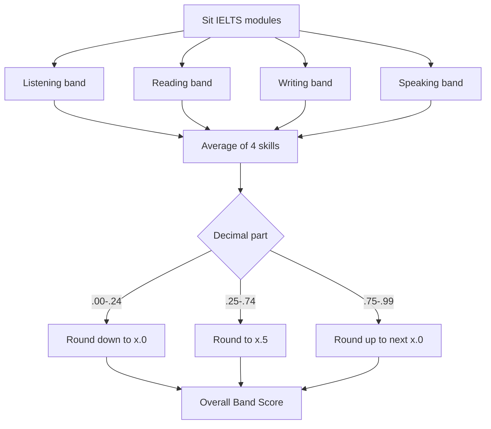

# IELTS Overall Band Calculation

```mermaid
flowchart TD
    A[Sit IELTS modules] --> B[Listening band]
    A --> C[Reading band]
    A --> D[Writing band]
    A --> E[Speaking band]
    B --> F[Average of 4 skills]
    C --> F
    D --> F
    E --> F
    F --> G{Decimal part}
    G -->|.00-.24| H[Round down to x.0]
    G -->|.25-.74| I[Round to x.5]
    G -->|.75-.99| J[Round up to next x.0]
    H --> K[Overall Band Score]
    I --> K
    J --> K
```

**Example:** L 7.5 + R 8.0 + W 7.0 + S 7.5 = 30.0 / 4 = **7.5** overall.
