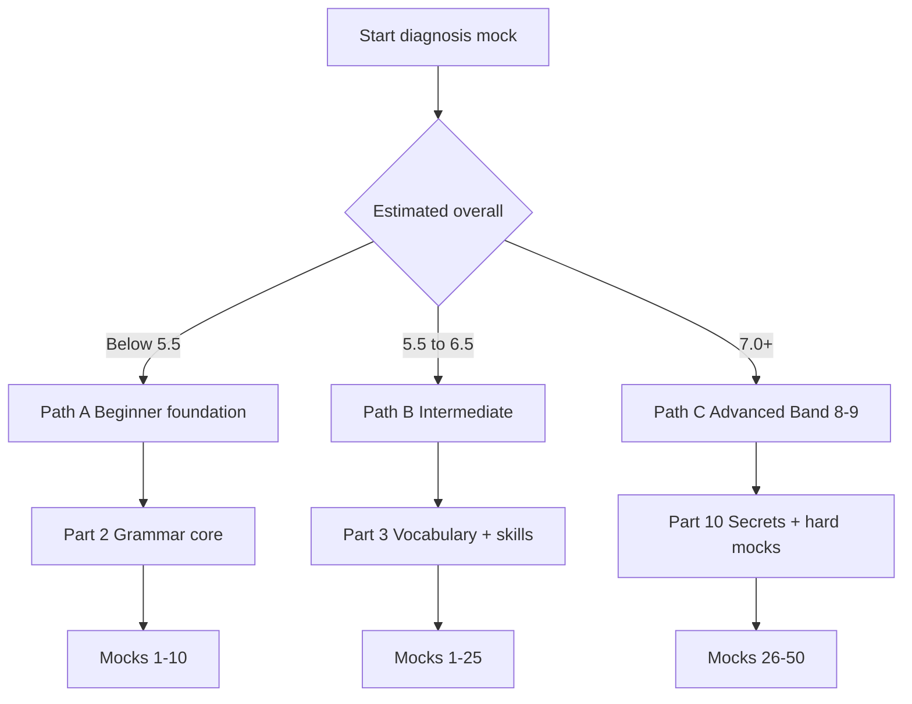

# Study Path Decision Tree

```mermaid
flowchart TD
    Start[Start diagnosis mock] --> Band{Estimated overall}
    Band -->|Below 5.5| A[Path A Beginner foundation]
    Band -->|5.5 to 6.5| B[Path B Intermediate]
    Band -->|7.0+| C[Path C Advanced Band 8-9]
    A --> G[Part 2 Grammar core]
    B --> V[Part 3 Vocabulary + skills]
    C --> S[Part 10 Secrets + hard mocks]
    G --> M[Mocks 1-10]
    V --> M2[Mocks 1-25]
    S --> M3[Mocks 26-50]
```
