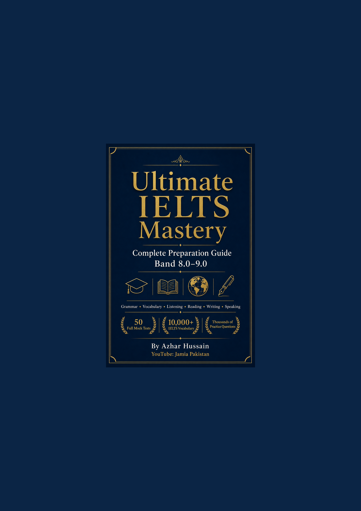

<div class="cover-page">



</div>

\newpage

# Ultimate IELTS Mastery

## Complete Preparation Guide for Band 8.0–9.0

**Grammar • Vocabulary • Listening • Reading • Writing • Speaking**

50 Full Mock Tests · 10,000+ IELTS Vocabulary · Thousands of Practice Questions

**By Azhar Hussain**

YouTube: **Jamia Pakistan**

***

### Print Spine Text

**Ultimate IELTS Mastery** — Azhar Hussain


\newpage


# Title Page


<div class="chapter-meta">

| | |
|---|---|
| **Estimated study time** | 45–120 minutes (adjust by level) |
| **Prerequisites** | Complete earlier chapters in this Part where marked |
| **Difficulty** | Progressive — core theory first, then Band 8–9 stretch tasks |
| **Key takeaways** | Finish Review, Quiz, and Exam Tips before advancing |

</div>

<p style="text-align:center; margin-top:18%;">

# Ultimate IELTS Mastery

## Complete Preparation Guide for Band 8.0–9.0

<br/>

**Author**

### Azhar Hussain

<br/>

**Email**  
[azharhussaincs@gmail.com](mailto:azharhussaincs@gmail.com)

**Phone**  
+92 300 8786258

**YouTube**  
Jamia Pakistan

<br/>

**Edition**  
First Edition

**Publication Year**  
2026

</p>

*Independent educational publication. Not affiliated with Cambridge Assessment English, the British Council, IDP Education, or IELTS.org.*


\newpage


# Copyright Page


<div class="chapter-meta">

| | |
|---|---|
| **Estimated study time** | 45–120 minutes (adjust by level) |
| **Prerequisites** | Complete earlier chapters in this Part where marked |
| **Difficulty** | Progressive — core theory first, then Band 8–9 stretch tasks |
| **Key takeaways** | Finish Review, Quiz, and Exam Tips before advancing |

</div>

**Ultimate IELTS Mastery: Complete Preparation Guide for Band 8.0–9.0**

Copyright © 2026 **Azhar Hussain**. All rights reserved.

Author: Azhar Hussain  
Email: [azharhussaincs@gmail.com](mailto:azharhussaincs@gmail.com)  
Phone: +92 300 8786258  
YouTube: Jamia Pakistan  
Website: *(to be announced)*

No part of this publication may be reproduced, stored in a retrieval system, or transmitted in any form or by any means — electronic, mechanical, photocopying, recording, scanning, or otherwise — without prior written permission from the author, except for brief quotations in reviews, scholarly citations, or other uses permitted by applicable law.

### Educational disclaimer

This book is an independent educational resource. It is **not** an official IELTS publication and is not endorsed by Cambridge Assessment English, the British Council, IDP Education, or IELTS.org. IELTS® is a registered trademark of its respective owners. Band descriptors, test formats, and scoring principles described herein are based on publicly available information and are explained in original language for teaching purposes. Official policies, fees, dates, and procedures may change; always verify current details on the official websites of IELTS partner organisations.

### Originality statement

All reading passages, listening-style transcripts, essay questions, speaking prompts, vocabulary entries, diagrams, and practice items in this book were created originally for this publication. They train IELTS-relevant skills without reproducing copyrighted exam papers.

### Limitation of liability

While every effort has been made to ensure accuracy, the author and publisher accept no liability for examination outcomes, admissions decisions, immigration results, or any loss arising from use of this material. Band scores depend on individual preparation, performance on test day, and official marking.

### Trademarks

All trademarks and registered trademarks are the property of their respective owners. Use of names is for identification and educational description only.

### Edition

First Edition, 2026  
Printed and digital formats  
ISBN: Pending commercial assignment


\newpage


# Dedication


<div class="chapter-meta">

| | |
|---|---|
| **Estimated study time** | 45–120 minutes (adjust by level) |
| **Prerequisites** | Complete earlier chapters in this Part where marked |
| **Difficulty** | Progressive — core theory first, then Band 8–9 stretch tasks |
| **Key takeaways** | Finish Review, Quiz, and Exam Tips before advancing |

</div>

To every learner who studies after a long day of work,  
who opens a practice test with courage,  
and who believes that careful English can open doors—

this book is for you.

And to the students of **Jamia Pakistan**,  
whose questions, persistence, and progress  
continue to shape how I teach.


\newpage


# Preface


<div class="chapter-meta">

| | |
|---|---|
| **Estimated study time** | 45–120 minutes (adjust by level) |
| **Prerequisites** | Complete earlier chapters in this Part where marked |
| **Difficulty** | Progressive — core theory first, then Band 8–9 stretch tasks |
| **Key takeaways** | Finish Review, Quiz, and Exam Tips before advancing |

</div>

*Ultimate IELTS Mastery* exists for one clear purpose: to take a motivated learner from uncertain foundations to the linguistic control, exam technique, and academic thinking required for **Band 8.0–9.0**.

This is not a summary booklet. It is a complete preparation system — grammar course, vocabulary dictionary, skills laboratory, workbook, and mock-test library — written so that serious candidates can prepare with structure rather than guesswork.

### Who should read this book

- Beginners who need English rebuilt carefully before exam practice becomes productive
- Intermediate learners stuck around Band 5.5–6.5 who need precision, range, and strategy
- Advanced candidates targeting Band 8–9 who need examiner-level refinement
- Teachers and tutors seeking one coherent curriculum
- Candidates preparing for **Academic** or **General Training** IELTS for university admission, immigration, scholarships, or professional certification

### Purpose of the book

High bands are not awarded for “sounding fancy.” They are awarded when you consistently demonstrate accurate grammar under pressure, precise collocations, exact task fulfilment, clear coherence, and flexible paraphrase. This book trains those capacities deliberately, with explanations of *why* answers succeed or fail.

### How to use the book

1. Complete **Part 1** so you understand the exam, scoring, and examiner expectations.  
2. Build **grammar and vocabulary** (Parts 2–3) while beginning skills work (Parts 4–8).  
3. Sit **mock tests** (Part 9) under timed conditions and keep an error journal.  
4. Use **Part 10** and the Appendices for final Band 8–9 polishing.

Each instructional chapter follows a teaching cycle: objectives → theory → examples → exercises → solutions → review → quiz → assignment → exam tips → Band 9 models.

### Expected study duration

| Starting level | Typical path | Duration |
|----------------|--------------|----------|
| Beginner / elementary | Path A foundation | 12–20 weeks |
| Intermediate (≈5.5–6.5) | Path B consolidation | 10–16 weeks |
| Upper-intermediate+ (≈7.0+) | Path C refinement | 8–14 weeks |

Daily consistency matters more than occasional marathon sessions.

### Recommended daily study plan (working adults)

| Day | Focus | Time |
|-----|-------|------|
| Monday | Grammar chapter + exercises | 90 min |
| Tuesday | Vocabulary topic + Speaking Part 1 | 75 min |
| Wednesday | Listening question type | 90 min |
| Thursday | Reading question type | 90 min |
| Friday | Writing Task 1 or Task 2 (timed) | 80 min |
| Saturday | Speaking Part 2–3 + review | 90 min |
| Sunday | Mini-mock or full mock + error journal | 2–3 hrs |

### A note from the author

No book can guarantee a band score. Your result depends on your starting level, study hours, feedback quality, and performance on test day. What this book offers is completeness: if a skill matters for Band 8–9, it is taught here with examples, practice, and answers.

Study with patience. Correct with discipline. Speak and write every day.

— **Azhar Hussain**  
YouTube: Jamia Pakistan  
[azharhussaincs@gmail.com](mailto:azharhussaincs@gmail.com)


\newpage


# Acknowledgements


<div class="chapter-meta">

| | |
|---|---|
| **Estimated study time** | 45–120 minutes (adjust by level) |
| **Prerequisites** | Complete earlier chapters in this Part where marked |
| **Difficulty** | Progressive — core theory first, then Band 8–9 stretch tasks |
| **Key takeaways** | Finish Review, Quiz, and Exam Tips before advancing |

</div>

I am grateful to the learners who follow **Jamia Pakistan** and who continually remind me that clarity beats complexity. Their questions shaped the diagnostic focus of the exercises in this book.

This curriculum also draws on publicly documented IELTS formats, band descriptors, and assessment principles published by IELTS partners (British Council, IDP, and Cambridge English), as well as pedagogical traditions from applied linguistics and English for Academic Purposes. Lexicographic conventions reflected in major learner dictionaries informed how meaning, collocation, and usage are presented — without copying proprietary entries.

I thank family, colleagues, and fellow educators who encouraged the long work of turning scattered teaching notes into a complete publication.

Any remaining errors are my own. Official test policies should always be confirmed on the relevant organisation’s website.

— **Azhar Hussain**


\newpage


# How to Use This Book

**Author:** Azhar Hussain · **YouTube:** Jamia Pakistan  
**Contact:** [azharhussaincs@gmail.com](mailto:azharhussaincs@gmail.com) · +92 300 8786258

<div class="chapter-meta">

| | |
|---|---|
| **Estimated study time** | 45–120 minutes (adjust by level) |
| **Prerequisites** | Complete earlier chapters in this Part where marked |
| **Difficulty** | Progressive — core theory first, then Band 8–9 stretch tasks |
| **Key takeaways** | Finish Review, Quiz, and Exam Tips before advancing |

</div>

## 1. Diagnose before you drill

Before Chapter 1 practice, take one full timed mock from Part 9 (or a recent official practice test if you already have one) and record:

| Skill | Raw / Band estimate | Top 3 weaknesses |
|-------|---------------------|------------------|
| Listening | | |
| Reading | | |
| Writing Task 1 | | |
| Writing Task 2 | | |
| Speaking | | |

Re-test every 4–6 weeks under exam conditions.

## 2. Recommended study paths

### Path A — Beginner → Band 6.5 foundation (12–20 weeks)

1. Part 1 (all chapters)
2. Part 2 Grammar core (Ch. 9–30) + Present/Past/Future essentials (Ch. 31–39)
3. Part 3 Vocabulary: Education, Health, Environment, Technology, Society
4. Parts 4–8 at reduced speed; focus on accuracy
5. Part 9: Mocks 1–10

### Path B — Intermediate → Band 7–7.5 (10–16 weeks)

1. Part 1 skim + deep study of band descriptors
2. Part 2 weak areas only + full tense review (Ch. 43)
3. Part 3 all topic modules + collocations
4. Parts 4–8 complete with full exercise banks
5. Part 9: Mocks 1–25 + error journal

### Path C — Advanced → Band 8–9 (8–14 weeks)

1. Part 1 examiner expectations + scoring
2. Part 2 advanced chapters (relative clauses, parallelism, conditionals, articles)
3. Part 3 Academic Word List + Band 9 Secrets (Part 10)
4. Parts 4–8 challenge sections only + full Writing/Speaking model analysis
5. Part 9: Mocks 26–50 under strict timing; rewrite every Task 2

## 3. The Error Journal (non-negotiable)

For every wrong answer, write:

1. What I chose / wrote / said  
2. The correct answer  
3. Why mine was wrong  
4. The rule or strategy I will apply next time  
5. One new example I create myself  

High-band improvement is mostly **error recycling**, not more random practice.

## 4. Weekly rhythm (example for working adults)

| Day | Focus | Time |
|-----|-------|------|
| Mon | Grammar chapter + exercises | 90 min |
| Tue | Vocabulary topic + speaking Part 1 | 75 min |
| Wed | Listening question type | 90 min |
| Thu | Reading question type | 90 min |
| Fri | Writing Task 1 or 2 (timed) | 80 min |
| Sat | Speaking Part 2–3 + review | 90 min |
| Sun | Mini-mock or full mock + journal | 2–3 hrs |

## 5. Symbols used in chapters

| Symbol / label | Meaning |
|----------------|---------|
| **Learning Objectives** | What you must be able to do after the chapter |
| **Worked Example** | Step-by-step model with examiner thinking |
| **Exam Tip** | Test-day strategy |
| **Band 9 Model** | High-band sample language or response |
| **Challenge** | Stretch tasks for Band 8–9 candidates |
| **Answer Key** | Solutions with explanations |

## 6. Cross-references

Chapters refer to earlier teaching (for example, Writing chapters assume Articles, Relative Clauses, and Linking from Part 2). If a cross-reference is unclear, return to the named chapter before continuing.

## 7. Materials you still need outside this book

- A quiet timer
- Recording device for Speaking
- Official sample band descriptors (public PDFs from IELTS partners) for comparison
- Optional: a teacher or trained partner for Writing/Speaking feedback

This book supplies content and method. You supply consistency.


\newpage


# Table of Contents


<div class="chapter-meta">

| | |
|---|---|
| **Estimated study time** | 45–120 minutes (adjust by level) |
| **Prerequisites** | Complete earlier chapters in this Part where marked |
| **Difficulty** | Progressive — core theory first, then Band 8–9 stretch tasks |
| **Key takeaways** | Finish Review, Quiz, and Exam Tips before advancing |

</div>

**Ultimate IELTS Mastery**  
*Complete Preparation Guide for Band 8.0–9.0*  
**Author:** Azhar Hussain · **YouTube:** Jamia Pakistan

> In the PDF, EPUB, and HTML editions, use the **clickable navigation pane / TOC** generated by the publisher toolchain. Every chapter heading, major subsection, and appendix is linked automatically.

---

## Front Matter

| Section |
|---------|
| Front Cover |
| Title Page |
| Copyright Page |
| Dedication |
| Preface |
| Acknowledgements |
| How to Use This Book |
| Table of Contents *(you are here)* |
| List of Figures |
| List of Tables |

---

## Part 1 — Introduction to IELTS

| Ch | Title |
|----|-------|
| 1 | What Is IELTS? |
| 2 | Academic vs General Training |
| 3 | Band Descriptors Explained |
| 4 | How IELTS Is Scored |
| 5 | Examiner Expectations |
| 6 | Exam Strategy & Mindset |
| 7 | Time Management |
| 8 | Common Mistakes & Myths |

---

## Part 2 — Complete English Grammar

| Ch | Title |
|----|-------|
| 9–30 | Grammar core (sentence structure through punctuation) |
| 31–43 | Complete tense system & mixed review |

---

## Part 3 — Vocabulary Dictionary

| Ch | Title |
|----|-------|
| 44 | How to Learn IELTS Vocabulary |
| 45–68 | Topic modules (Education → Urbanization) |
| 69 | Academic Word List Core |
| 70 | Essential Collocations |

---

## Part 4 — Listening

| Ch | Title |
|----|-------|
| 71–80 | Overview, all question types, practice bank, advanced strategies |

---

## Part 5 — Reading

| Ch | Title |
|----|-------|
| 81–93 | Skills, all question types, passage banks (Band 5–9) |

---

## Part 6 — Writing Task 1

| Ch | Title |
|----|-------|
| 94–103 | Overview, charts, maps, processes, GT letters, practice bank |

---

## Part 7 — Writing Task 2

| Ch | Title |
|----|-------|
| 104–113 | Essay types, cohesion, band comparisons, question bank, Band 9 models |

---

## Part 8 — Speaking

| Ch | Title |
|----|-------|
| 114–122 | Overview, Parts 1–3 strategies & 500+ banks, pronunciation, fluency |

---

## Part 9 — Practice Tests

| Ch | Title |
|----|-------|
| 123 | How to Use the Mock Tests |
| Mock 01–50 | Complete IELTS mock examinations with keys |
| 174 | Consolidated Answer Keys |

---

## Part 10 — Band 9 Secrets

| Ch | Title |
|----|-------|
| 175–180 | Advanced vocabulary, idioms vs academic phrases, cohesion, grammar tricks, examiner mind, time-saving |

---

## Appendices

| ID | Title |
|----|-------|
| A01–A12 | Grammar reference, dictionary index, verbs, phrasal verbs, idioms, AWL, spelling/pronunciation, checklists, revision & formula sheets |
| A13 | Glossary |
| A14 | Index |
| A15 | References |
| — | Back Cover (author contact & QR) |

---

*Full chapter-by-chapter listing matches `MASTER_OUTLINE.md`. Interactive PDF outline provides one-click jumps to every heading.*


\newpage


# List of Figures


<div class="chapter-meta">

| | |
|---|---|
| **Estimated study time** | 45–120 minutes (adjust by level) |
| **Prerequisites** | Complete earlier chapters in this Part where marked |
| **Difficulty** | Progressive — core theory first, then Band 8–9 stretch tasks |
| **Key takeaways** | Finish Review, Quiz, and Exam Tips before advancing |

</div>

This list catalogues major diagrams and visual resources in the book. Page numbers appear in the generated PDF Table of Contents navigation; use the clickable PDF outline for direct jumps.

| Fig. | Title | Location |
|------|-------|----------|
| F-01 | Front cover — Ultimate IELTS Mastery | Front matter |
| F-02 | Back cover — features & author contact | End matter |
| F-03 | QR code — Jamia Pakistan (YouTube placeholder) | Back cover |
| F-04 | IELTS overall band calculation flowchart | `diagrams/band_score_flowchart.md` |
| F-05 | Study-path decision tree | `diagrams/study_path.md` |
| F-06 | Academic vs General Training comparison visuals | Chapter 2 |
| F-07 | Band descriptor progression charts | Chapter 3 |
| F-08 | Scoring & rounding diagram | Chapter 4 |
| F-09 | Time-management pacing charts | Chapter 7 |
| F-10 | Sentence-structure pattern diagrams | Chapter 9 |
| F-11 | Article decision tree | Chapter 15 |
| F-12 | Conditional systems overview | Chapter 26 |
| F-13 | Tense timeline / aspect diagrams | Chapters 31–43 |
| F-14 | Listening section map strategies | Chapters 71–73 |
| F-15 | Reading skill process diagrams | Chapters 81–82 |
| F-16 | Writing Task 1 chart-type structures | Chapters 95–101 |
| F-17 | Writing Task 2 essay planning maps | Chapters 104–109 |
| F-18 | Speaking Part 2 note-map models | Chapter 117 |
| F-19 | Pronunciation stress & intonation schematics | Chapter 121 |
| F-20 | Mock-test workflow diagram | Chapter 123 |

*Additional tables, process diagrams, and vocabulary maps appear inside individual chapters and are indexed by chapter title in the PDF outline.*


\newpage


# List of Tables


<div class="chapter-meta">

| | |
|---|---|
| **Estimated study time** | 45–120 minutes (adjust by level) |
| **Prerequisites** | Complete earlier chapters in this Part where marked |
| **Difficulty** | Progressive — core theory first, then Band 8–9 stretch tasks |
| **Key takeaways** | Finish Review, Quiz, and Exam Tips before advancing |

</div>

Major reference and comparison tables used throughout the publication:

| Table | Title | Location |
|-------|-------|----------|
| T-01 | Recommended study paths & durations | Preface / How to Use |
| T-02 | Weekly study rhythm | How to Use This Book |
| T-03 | Academic vs General Training comparison | Chapter 2 |
| T-04 | Band descriptor summary (skills) | Chapter 3 |
| T-05 | Raw-score to band conversion guidance | Chapter 4 |
| T-06 | Module timing & checkpoints | Chapter 7 |
| T-07 | Parts of speech overview | Chapter 10 |
| T-08 | Article usage decision grid | Chapter 15 |
| T-09 | Preposition collocation banks | Chapter 16 |
| T-10 | Quantifier / countability grid | Chapter 18 |
| T-11 | Gerund vs infinitive verb lists | Chapter 20 |
| T-12 | Conditional forms overview | Chapter 26 |
| T-13 | Modal meaning & force | Chapter 27 |
| T-14 | Tense comparison matrices | Chapter 43 |
| T-15 | Topic vocabulary entry schema | Part 3 chapters |
| T-16 | Listening question-type strategy cards | Part 4 |
| T-17 | Reading question-type decision tables | Part 5 |
| T-18 | Task 1 language banks (trends/comparisons) | Part 6 |
| T-19 | Task 2 essay-type planning templates | Part 7 |
| T-20 | Speaking criteria & band features | Part 8 |
| T-21 | Mock-test score log template | Part 9 |
| T-22 | Irregular verbs reference | Appendix A03 |
| T-23 | Phrasal verbs (academic-useful) | Appendix A04 |
| T-24 | Academic Word List families | Appendix A06 |
| T-25 | Spelling & pronunciation trouble lists | Appendices A07–A08 |
| T-26 | Exam-day checklists | Appendix A09 |
| T-27 | Formula & cheat sheets | Appendices A11–A12 |

*Chapter-internal exercise tables are too numerous to list individually; use the clickable PDF contents and chapter headings to navigate.*


\newpage


# Chapter 1: What Is IELTS?

**Part:** Part 1 — Introduction to IELTS

---


<div class="chapter-meta">

| | |
|---|---|
| **Estimated study time** | 45–120 minutes (adjust by level) |
| **Prerequisites** | Complete earlier chapters in this Part where marked |
| **Difficulty** | Progressive — core theory first, then Band 8–9 stretch tasks |
| **Key takeaways** | Finish Review, Quiz, and Exam Tips before advancing |

</div>

## Learning Objectives

By the end of this chapter, you will be able to:

- Define IELTS and explain its global purpose in education, migration, and employment.
- Trace the historical development of IELTS from its origins to its current governance structure.
- Distinguish between the four test modules and explain why each exists.
- State accurate timing for every section of the test under both delivery formats.
- Navigate the registration process confidently, including ID requirements and result timelines.
- Compare paper-based and computer-delivered IELTS with evidence, not folklore.
- Identify and refute common myths that waste candidates' preparation time.
- Plan your first study week using the structural knowledge from this chapter.

---

## Theory / Explanation

### 1.1 What IELTS Is — and What It Is Not

**IELTS** stands for the **International English Language Testing System**. It is a standardised assessment of English proficiency designed for people whose first language is not English. The test is jointly owned and managed by the **British Council**, **IDP IELTS**, and **Cambridge English** (through Cambridge Assessment English). These three organisations form the IELTS partnership, which sets test standards, trains examiners, and maintains quality assurance worldwide.

IELTS measures whether you can **use English effectively in real contexts**—university lectures, workplace communication, everyday social interaction, and official documentation—not whether you have memorised obscure grammar rules in isolation. That design choice matters: IELTS rewards functional competence under time pressure, which is why this book emphasises *skills plus language*, not language alone.

**What IELTS is not:**

- It is **not** a pass/fail examination. You receive a band score from 0 to 9 (including half bands such as 6.5), and institutions set their own requirements.
- It is **not** a test of intelligence, general knowledge, or subject expertise. A physicist and an artist face the same English criteria.
- It is **not** identical to TOEFL, PTE, Duolingo English Test, or Cambridge C1 Advanced—though all measure English proficiency, their formats, scoring, and acceptance policies differ.
- It is **not** a certificate that never expires universally. Many organisations accept scores up to two years old; some set shorter windows.

Understanding these boundaries prevents two common errors: treating IELTS as a vocabulary trivia contest, or treating a single low module score as proof that you "cannot learn English."

### 1.2 Historical Background: Why IELTS Exists

English became the dominant language of international scholarship, trade, and migration in the twentieth century. By the 1980s, universities and immigration authorities needed a **reliable, widely recognised** measure of English ability that could be administered consistently across countries.

IELTS was launched in **1989**, replacing and consolidating earlier English tests used in Australia and Britain. Its original purpose was straightforward: provide evidence that international students and migrants could cope with English-medium environments.

Several historical forces shaped the test:

1. **Globalisation of higher education.** Universities in English-speaking countries recruited internationally and required defensible entry standards.
2. **Migration policy.** Countries such as Australia, Canada, New Zealand, and the United Kingdom needed objective language criteria for visa categories.
3. **Professional registration.** Medical, nursing, engineering, and teaching bodies required proof of communication skills for licensed practice.
4. **Standardisation.** A single nine-band scale allowed institutions to compare candidates from different backgrounds fairly.

Over time, IELTS expanded to more than **140 countries** and **1,600+ test locations**. The test content evolved—more authentic texts, updated task types, computer delivery—but the core philosophy remained: assess practical English through integrated skills tasks.

**Why history matters for you:** IELTS was built for *gatekeeping to English-medium institutions*, not for punishing learners. When you understand that purpose, you prepare differently. You prioritise clarity, coherence, and communicative success—the same qualities universities and employers actually need.

### 1.3 Purpose and Stakeholders

IELTS serves four major stakeholder groups:

| Stakeholder | Typical use of IELTS |
|-------------|----------------------|
| **Universities & colleges** | Admission to degree programmes; conditional admission with language support |
| **Governments & immigration** | Skilled migration, citizenship, visa points systems |
| **Professional bodies** | Registration for doctors, nurses, dentists, pharmacists, engineers, teachers |
| **Employers** | Evidence of workplace English, especially in multinational firms |

Each stakeholder interprets scores differently. A nursing council may require 7.0 in every module with no score below 7.0 in Listening, Reading, Writing, and Speaking. A master's programme might ask for overall 6.5 with 6.0 minimum in each skill. An employer might accept overall 6.0.

**Implication:** Your target score is not "as high as possible." Your target is **the requirement of your specific pathway**, plus a sensible buffer if you are borderline.

### 1.4 The Four Modules: An Integrated System

IELTS assesses four skills:

| Module | What it measures | Format (summary) |
|--------|------------------|------------------|
| **Listening** | Understanding spoken English across contexts | Four sections, 40 questions, ~30 minutes (+ transfer time on paper) |
| **Reading** | Understanding written texts | Three long passages (Academic) or mixed texts (General Training), 40 questions, 60 minutes |
| **Writing** | Producing clear, organised written English | Two tasks, 60 minutes total |
| **Speaking** | Sustaining spoken interaction | Three-part interview, 11–14 minutes |

These modules are **related but separately scored**. Strong speaking does not automatically compensate for weak writing in the eyes of a university that sets per-module minima.

**Listening** progresses from everyday social dialogue to academic discussion. You hear each recording once only (except in some practice materials). Questions test detail, attitude, purpose, and inference.

**Reading** differs between Academic and General Training (see Chapter 2). Both versions require fast, accurate comprehension and careful attention to paraphrase.

**Writing** Task 1 and Task 2 assess different genres. Academic Task 1 involves describing visual data or diagrams; General Training Task 1 is a letter. Task 2 is an essay for both versions.

**Speaking** is a structured conversation with a certified examiner, recorded for quality monitoring. It assesses fluency, coherence, lexical resource, grammatical range, and pronunciation.

**Why four modules?** Real life uses English holistically, but institutions need diagnostic detail. A student might comprehend lectures well (Listening) yet struggle with essays (Writing). Separating scores helps placement and support decisions.

### 1.5 Test Versions: Academic vs General Training

IELTS offers two versions:

- **IELTS Academic** — for higher education and professional registration where academic English is expected.
- **IELTS General Training** — for secondary education, work experience, and migration contexts where everyday and workplace English dominate.

Listening and Speaking are the **same** for both versions. Reading and Writing Task 1 differ. Task 2 Writing is broadly similar in essay style. Choosing the wrong version can invalidate your application. Chapter 2 covers this decision in depth.

### 1.6 Timing: The Complete Schedule

Total test time is approximately **2 hours and 45 minutes** for Listening, Reading, and Writing on the same test day. Speaking may occur on the same day or up to seven days before or after, depending on local scheduling.

#### Listening (~30 minutes)

- **Four sections**, **40 questions**
- Audio plays **once**
- Paper test: extra **10 minutes** to transfer answers to the answer sheet
- Computer test: no separate transfer time; you enter answers during playback

#### Reading (60 minutes)

- **Three sections** (Academic) or **three sections** with different text types (General Training)
- **40 questions**
- **No extra transfer time** — answers go directly on the sheet or screen

#### Writing (60 minutes)

- **Task 1:** recommended **20 minutes** (150 words minimum Academic; 150 words General letter)
- **Task 2:** recommended **40 minutes** (250 words minimum; weighted more heavily)
- Task 2 carries **approximately double** the weight of Task 1 in scoring

#### Speaking (11–14 minutes)

- **Part 1:** introduction and familiar topics (4–5 minutes)
- **Part 2:** individual long turn with cue card (3–4 minutes including preparation)
- **Part 3:** two-way discussion linked to Part 2 theme (4–5 minutes)

**Why timing is strict:** IELTS simulates real deadlines—lecture note-taking, exam essays, meetings. Learning the clock is not optional for Band 7+.

### 1.7 Registration and Test Day Essentials

#### Registration steps (typical pathway)

1. **Identify your version** (Academic or General Training) from your institution or immigration authority.
2. **Create an account** with your local test centre or the official online booking portal used in your country.
3. **Select format** — paper or computer — if both are offered locally.
4. **Choose date and location.**
5. **Upload identification** — usually a valid passport; some centres accept national ID cards for local tests.
6. **Pay the fee** (varies by country; typically equivalent to roughly USD 200–280).
7. **Receive confirmation** with reporting time and documents to bring.

#### Identification rules

The name on your registration **must match** your ID exactly. Missing middle names, spelling mismatches, or expired documents are common reasons for denial of entry. **Why?** IELTS is a high-stakes test; identity fraud would destroy trust in the system.

#### Results

- **Paper test:** results often available **13 days** after the test date.
- **Computer test:** results often available **3–5 days** after the test date.
- **Test Report Form (TRF):** official score document; you may request additional copies sent to recognising organisations.

#### Special arrangements

Candidates with medical conditions, dyslexia, hearing or vision impairment, or other needs may apply for **modified materials or extra time**. Requests must be submitted with medical evidence **weeks in advance**—not on test day.

### 1.8 Paper-Based vs Computer-Delivered IELTS

Both formats assess the **same skills** with the **same question types** and **same nine-band scoring**. Differences are logistical and psychological—not linguistic.

| Feature | Paper-based | Computer-delivered |
|---------|-------------|-------------------|
| Listening | Headphones often shared in room; 10 min transfer time | Usually individual headphones; answers typed/clicked live |
| Reading | Highlighting limited to pencil/mental notes | On-screen highlighting and notes (where enabled) |
| Writing | Handwritten | Typed |
| Speaking | Live with examiner | Live with examiner (same) |
| Results timeline | ~13 days | ~3–5 days |
| Comfort factor | Familiar for school-trained writers | Familiar for fast typists |

**Choosing wisely:**

- Select **computer** if you type faster than you write, if your handwriting is illegible, or if you need quicker results.
- Select **paper** if screen fatigue affects comprehension, if you annotate physically, or if your keyboard skills in English are weak.

**Myth alert:** Computer IELTS is not "easier." Difficulty is controlled through parallel test construction and statistical equating. Your preparation should be identical.

### 1.9 Scoring Overview (Preview)

Each module produces a **band score from 0 to 9**. Half bands (6.5, 7.5) are common. The **overall band** is the average of the four modules, rounded to the nearest half band:

- Average ends in .25 → round up to next half band
- Average ends in .75 → round up to next whole band

Example: Listening 7.0, Reading 6.5, Writing 6.0, Speaking 7.0 → average 6.625 → overall **6.5**.

Chapter 4 explains raw-score conversion and Writing/Speaking criteria in detail.

### 1.10 Common Myths — and the Truth

| Myth | Reality |
|------|---------|
| "Examiners penalise accent." | Examiners assess **intelligibility**, not accent type. |
| "Use big words for Band 9." | Band 9 uses **precise, natural** vocabulary; forced rarity backfires. |
| "Computer test is harder." | Formats differ; difficulty is standardised. |
| "Templates guarantee Band 7." | Memorised templates often reduce Task Response and Coherence scores. |
| "Only British English is accepted." | **American, British, Australian** spelling and usage are accepted if consistent. |
| "You must speak for 2 full minutes in Part 2." | Fluency matters more than filling time; stopping early without development hurts. |

Understanding myths early saves months of misdirected study.

### 1.11 How This Book Uses Chapter 1

Everything that follows assumes you know **what** you are preparing for. Parts 2–3 build language. Parts 4–8 build skills. Part 9 applies both under exam conditions. Part 10 refines high-band performance. Without the structural clarity from Part 1, candidates often practise randomly and wonder why scores plateau.

---

## Examples

### Example 1: Stakeholder Requirement Comparison

**Scenario:** Two candidates both score Listening 8.0, Reading 7.5, Writing 6.0, Speaking 7.0.

- **University A** (overall 6.5, no skill below 6.0): **Accepts** — overall 7.0.
- **Nursing registration** (7.0 each skill): **Rejects** — Writing 6.0 fails minimum.

**Lesson:** Overall band alone is insufficient; always check **per-module minima**.

### Example 2: Format Selection

**Candidate profile:** Software engineer, types 80 WPM, poor handwriting, needs results in five days for visa deadline.

**Reasonable choice:** Computer-delivered IELTS Academic.

**Why:** Speed, legibility, and results timeline align with needs; Speaking remains face-to-face.

### Example 3: Name Mismatch

Registration: "Mohammed Ali Khan"  
Passport: "Muhammad Ali Khan"

**Outcome:** Potential refusal to test until corrected.

**Why:** Identity verification is non-negotiable.

---

## Worked Examples

### Worked Example 1: Calculating Whether You Need Academic or General

**Question:** You are applying for a skilled migration visa to Canada that requires "IELTS General Training." You planned to take Academic because you might study later. What should you do?

**Step 1:** Identify the **immediate official requirement** — General Training for this visa class.

**Step 2:** Ask whether Academic would be accepted — immigration rules typically specify version explicitly; Academic is **not** a substitute.

**Step 3:** Decide timeline — if study comes later, you may take Academic at that point; many candidates take IELTS twice for different purposes.

**Answer:** Register for **General Training** now. Taking Academic would produce a score many immigration systems will not accept for that pathway.

**Why this reasoning works:** IELTS version is a **category requirement**, not a difficulty preference.

### Worked Example 2: Planning Test Day Order

**Question:** Speaking is scheduled the day before Listening, Reading, and Writing. Is this normal?

**Step 1:** Confirm with your centre — Speaking may occur **up to seven days before or after** other modules.

**Step 2:** Adjust preparation — avoid exhausting practice the night before Speaking; protect sleep.

**Step 3:** Bring the same ID to both appointments.

**Answer:** Yes, this scheduling is standard in many centres.

### Worked Example 3: Overall Band Estimation

Scores: L 7.5, R 7.0, W 6.5, S 7.0

Average = (7.5 + 7.0 + 6.5 + 7.0) ÷ 4 = 7.0

**Overall band: 7.0** (no rounding needed)

If Writing were 6.0 instead: average = 6.75 → rounds to **7.0** overall. Many institutions still reject because Writing < 6.5.

---

## Exercises

### Exercise Set A — Conceptual (Questions 1–10)

1. Name the three organisations that jointly manage IELTS.
2. In what year was IELTS introduced?
3. List four types of institutions that use IELTS scores.
4. How many questions are in the Listening and Reading modules combined?
5. How long is the Writing module?
6. What is the minimum word count for Writing Task 2?
7. Which two modules are identical in Academic and General Training?
8. How many parts are in the Speaking test?
9. What document serves as official proof of your scores?
10. What is the highest band score on IELTS?

### Exercise Set B — True / False / Not Given (Questions 11–20)

11. IELTS is a pass/fail test.  
12. Listening audio is played twice in the real test.  
13. Academic and General Training have different Speaking tests.  
14. Computer-delivered IELTS uses human examiners for Speaking.  
15. You can choose either US or UK spelling in Writing if you are consistent.  
16. Results for paper tests are usually faster than computer tests.  
17. Task 2 is worth more than Task 1 in Writing.  
18. IELTS measures intelligence as well as English.  
19. Special arrangements can be requested for medical needs.  
20. The overall band is always the lowest of the four module scores.

### Exercise Set C — Scenario Analysis (Questions 21–25)

21. A student registers as "J. Smith" but passport reads "John James Smith." Predict the issue.
22. A candidate needs IELTS for UK undergraduate admission. Which version?
23. A candidate applies for Australian permanent residency via a points-tested skilled visa requiring GT IELTS. Which Reading sections should they study?
24. A candidate scores L 8, R 8, W 5.5, S 7.5 for a programme requiring 6.5 overall and 6.0 minimum each skill. Are they eligible?
25. A candidate is fluent speaking but has never written essays. Which module likely limits their university admission first?

### Exercise Set D — Timing (Questions 26–30)

26. How many minutes are recommended for Task 1 Writing?
27. How long is Part 3 Speaking approximately?
28. What is total Listening time including transfer on paper?
29. How many Listening sections contain social/everyday contexts (Sections 1–2)?
30. If Speaking is on Monday and LRW on Wednesday, is this within allowed scheduling?

### Exercise Set E — Myth Busting (Questions 31–35)

31. Rewrite in one sentence: "Is computer IELTS easier?"
32. Explain why "memorise 100 essays" is poor advice.
33. A friend says accent reduction is mandatory. Respond using IELTS principles.
34. Why is consistency in spelling important?
35. Distinguish "band score" from "raw score."

---

## Solutions with Explanations

### Set A

1. **British Council, IDP IELTS, Cambridge English** — the partnership owners.
2. **1989** — established as a unified international test.
3. Examples: **universities, immigration departments, professional regulators, employers**.
4. **80 questions** (40 + 40).
5. **60 minutes**.
6. **250 words** minimum (penalty risk if substantially under).
7. **Listening and Speaking**.
8. **Three parts**.
9. **Test Report Form (TRF)**.
10. **Band 9**.

### Set B

11. **False** — band scores, not pass/fail.
12. **False** — played once in real test.
13. **False** — Speaking is the same.
14. **True** — Speaking is always face-to-face with a certified examiner (in standard IELTS).
15. **True** — consistency matters more than variety.
16. **False** — computer is usually faster for results.
17. **True** — Task 2 double weighting approximately.
18. **False** — English proficiency only.
19. **True** — with advance notice and evidence.
20. **False** — overall is averaged and rounded, not minimum.

### Set C

21. **Name mismatch** may block testing; register exactly as passport shows.
22. **Academic** — standard for degree-level entry.
23. **General Training Reading** sections and GT Task 1 letter — not Academic graphs.
24. **No** — Writing 5.5 fails 6.0 minimum despite strong overall potential.
25. **Writing** — universities require written academic work; speaking fluency alone insufficient.

### Set D

26. **20 minutes** recommended.
27. **4–5 minutes**.
28. **About 40 minutes** (30 + 10 transfer) on paper.
29. **Sections 1 and 2** — everyday/social contexts; Sections 3–4 more academic.
30. **Yes** — within seven-day window.

### Set E

31. **No** — format differs; difficulty is controlled to be equivalent.
32. Memorised essays often **misaddress the question**, hurting Task Response; examiners detect templates.
33. **Intelligibility** matters, not sounding British; clear pronunciation of phonemes and word stress is sufficient.
34. Mixed *colour/color* suggests carelessness; consistent variety shows control.
35. **Raw score** = number of correct answers (Listening/Reading); **band score** = scaled proficiency level 0–9.

---

## Review

### Key Takeaways

- IELTS is a **nine-band proficiency measure** for non-native English users, managed by a global partnership.
- Four modules assess **Listening, Reading, Writing, Speaking**; stakes differ by institution.
- **Academic vs General Training** must match your pathway; Listening/Speaking are shared.
- **Timing and word minima** are enforceable constraints, not suggestions.
- **Paper vs computer** is a logistics choice, not a difficulty cheat code.
- Registration details—especially **ID and name**—cause preventable failures.

### Self-Check Questions

1. Can I explain IELTS to a friend in two minutes accurately?
2. Do I know which test version my target institution requires?
3. Have I checked per-module minima, not just overall band?
4. Have I chosen paper or computer for reasons that suit *me*?

---

## Quiz

**Time limit:** 15 minutes. No notes.

1. What does IELTS stand for?
2. Which module has 40 questions and 60 minutes with no extra transfer time?
3. How many words minimum in Task 2?
4. Name one organisation in the IELTS partnership.
5. GT and Academic differ in which two modules?
6. What is the Speaking test duration range?
7. TRF stands for?
8. Round overall: L 6.5, R 6.5, W 6.5, S 7.0.
9. Is Listening audio replayed in the official test?
10. Give one reason institutions prefer IELTS over informal interviews.

*Answers at end of chapter in Quiz Answer Key.*

### Quiz Answer Key

1. International English Language Testing System  
2. Reading  
3. 250  
4. Any of: British Council, IDP, Cambridge English  
5. Reading and Writing Task 1  
6. 11–14 minutes  
7. Test Report Form  
8. (6.5+6.5+6.5+7.0)/4 = 6.625 → **6.5**  
9. No  
10. Standardisation, security, global recognition, separate skill diagnostics (any valid point)

---

## Assignment

### Assignment 1: Personal IELTS Profile (300–400 words)

Write a short document answering:

- Your purpose for taking IELTS (study, migration, work, registration).
- Required version, overall band, and per-module minima.
- Preferred delivery format with **three reasons**.
- Target test date and weekly hours available.
- One risk factor (e.g., Writing speed) and one mitigation strategy.

Bring this profile to Chapter 6 when building strategy.

### Assignment 2: Registration Reconnaissance

Visit the official IELTS booking site for your country (British Council, IDP, or authorised centre). Record:

- Next available test dates (paper and computer if both exist).
- Fee in local currency.
- ID requirements.
- Cancellation/rescheduling policy summary.

### Assignment 3: Teach-Back

Explain to one person the difference between Academic and General Training. Note one question they ask that you could not answer—research it before Chapter 2.

---

## Revision Notes

```
IELTS ESSENTIALS — CHAPTER 1 SNAPSHOT

Purpose:     Standardised English for study / work / migration
Owners:      British Council · IDP · Cambridge English
Since:       1989
Modules:     L · R · W · S  (each band 0–9)
Versions:    Academic | General Training (L+S same)
LRW time:    ~2h 45m same day | Speaking ±7 days
Writing:     Task 1 (~20 min) + Task 2 (~40 min, 250+ words)
Results:     Paper ~13d | Computer ~3–5d | TRF = official score
Overall:     Average of 4 modules, rounded to nearest 0.5
Choose format by typing, handwriting, results need — NOT "easier test"
```

---

## Exam Tips

> **Exam Strategy:** Arrive early with the **exact** ID used at registration. Many test-day disasters are administrative, not linguistic.

> **Exam Strategy:** Do not book until you know **Academic vs GT** from an official source—university website or immigration instruction—not a forum post.

> **Exam Strategy:** Task 2 before Task 1 is **not** allowed in the real test; practise in the official order (Task 1 first) so your stamina matches test conditions.

> **Exam Strategy:** If you are borderline on requirements, target **+0.5 buffer** in your weakest allowed module, not overall alone.

---

## Challenge Questions

1. **Policy design:** Why might immigration systems require minimum scores in *each* skill rather than overall band alone? Write 150 words.

2. **Equating:** If two candidates answer 32/40 Reading items correctly but receive different bands, list three technical reasons this could happen.

3. **Ethics:** A test centre offers "guaranteed band 7" packages. Why should you refuse, from test security and learning perspectives?

4. **Cross-cultural validity:** IELTS is used globally. What steps might test developers take to avoid cultural bias in Reading passages while keeping text academic?

*Suggested approaches in Challenge Solutions (instructor edition); learners should attempt fully before checking.*

---

## Band 9 Examples

> **Band 9 Secret:** High-band candidates treat IELTS as a **system**—they know module weights, institutional rules, and format constraints before drilling vocabulary. Strategic clarity is itself a Band 8–9 behaviour.

### Band 9 Speaking Extract (Part 1 style — original)

**Examiner:** Do you enjoy reading?

**Candidate:** I do, though my reading habits have shifted over the past few years. I used to gravitate toward fiction, but nowadays I tend to read long-form journalism and the occasional academic monograph related to my field. I find that kind of reading sharpens my critical thinking—and, incidentally, it has made IELTS-style texts feel less intimidating.

**Why this performs well:** Direct answer, developed with specific examples, natural vocabulary (*gravitate toward*, *long-form journalism*), clear pronunciation cues, no memorised template tone.

### Band 9 Mindset Statement (original)

*"I am not preparing for tricks; I am preparing to function in English at the level my future institution expects. Every module practice session simulates a real demand—lectures, emails, essays, meetings—not a puzzle with secret rules."*

### 1.12 One Skill Retake and Policy Awareness

In jurisdictions where **IELTS One Skill Retake** (OSR) is available, candidates who complete a full test may retake **one module** within a specified period instead of repeating all four. Availability, eligibility windows, and recognising organisation acceptance **vary by country and institution**.

**Why note this in Chapter 1:** It changes retake economics—if Listening alone blocks you, OSR may suffice where accepted.

**Action:** Confirm on official IELTS site for your test centre country **and** with your university/immigration authority whether OSR results are accepted.

### 1.13 Test Day Hour-by-Hour (Typical LRW Day)

| Time | Event |
|------|-------|
| T−45 min | Arrive; ID check; belongings stored |
| T−15 min | Seating; instructions |
| T+0 | Listening begins |
| ~T+40 min | Reading begins immediately after Listening |
| ~T+100 min | Writing begins |
| ~T+160 min | LRW ends; Speaking may be separate |

**Why hour-by-hour helps:** Reduces surprise adrenaline burn on first section.

### 1.14 Extended Exercises Set F (41–50)

41. Name two reasons IELTS uses nine bands not percentage.  
42. What happens if you miss Speaking appointment?  
43. Can you take Listening only?  
44. Three stakeholders using IELTS — name.  
45. Computer-delivered: where is Speaking?  
46. Approximate fee factor — cheap test centre myth?  
47. IELTS vs school English exam — one difference.  
48. TRF additional copies — why request?  
49. Section 4 Listening context type?  
50. Why read Chapter 2 before booking?

**Solutions:** 41. Global comparability; half bands; institutional thresholds | 42. Often counted absent/band 0 | 43. No — full test registration | 44. Universities, immigration, employers, regulators | 45. Usually same centre face-to-face | 46. Fees set locally; "cheap" may be scam | 47. Integrated skills vs single skill | 48. Send to universities | 49. Academic monologue/lecture | 50. Version selection prevents costly error

### 1.15 Glossary Preview (Chapter 1 Terms)

| Term | Meaning |
|------|---------|
| TRF | Test Report Form — official score document |
| GT | General Training test version |
| CDI | Computer-delivered IELTS |
| Raw score | Number of correct answers L/R |
| Module | One of four tested skills |
| CEFR | Common European Framework reference levels |

---

*Next: Chapter 2 — Academic vs General Training*


\newpage


# Chapter 2: Academic vs General Training

**Part:** Part 1 — Introduction to IELTS

---


<div class="chapter-meta">

| | |
|---|---|
| **Estimated study time** | 45–120 minutes (adjust by level) |
| **Prerequisites** | Complete earlier chapters in this Part where marked |
| **Difficulty** | Progressive — core theory first, then Band 8–9 stretch tasks |
| **Key takeaways** | Finish Review, Quiz, and Exam Tips before advancing |

</div>

## Learning Objectives

By the end of this chapter, you will be able to:

- Explain the fundamental purpose difference between IELTS Academic and IELTS General Training.
- Use detailed comparison tables to predict which version your pathway requires.
- Describe how Reading and Writing Task 1 differ in genre, difficulty profile, and preparation focus.
- Identify who must take Academic, who must take General Training, and who has genuine choice.
- Analyse sample task prompts from both versions and select appropriate preparation materials.
- Avoid the costly error of sitting the wrong test version for your application.
- Plan a version-specific study schedule that does not waste time on irrelevant task types.

---

## Theory / Explanation

### 2.1 Why Two Versions Exist

IELTS serves **two distinct English environments**:

1. **Academic environments** — universities, research institutions, professional bodies expecting journal-style reading and data-rich writing.
2. **General life and workplace environments** — migration, vocational training, everyday survival and workplace communication.

A single Reading paper could not fairly assess both without either boring academic-bound candidates or overwhelming migration-focused candidates. The solution: **shared Listening and Speaking**, **different Reading and Writing Task 1**.

**Critical rule:** You cannot convert an Academic TRF into General Training retroactively. The version is printed on your Test Report Form. Institutions reject mismatched versions.

### 2.2 Side-by-Side Comparison: Complete Overview

| Dimension | IELTS Academic | IELTS General Training |
|-----------|----------------|------------------------|
| **Primary purpose** | Higher education, professional registration (academic context) | Migration, secondary education, work experience, training programmes |
| **Listening** | Identical format and content | Identical |
| **Speaking** | Identical format and criteria | Identical |
| **Reading — text types** | Three long academic-style passages (discursive, analytical, factual) | Section 1: social survival (notices, ads); Section 2: workplace; Section 3: general interest (longer) |
| **Reading — difficulty arc** | Consistently academic register throughout | Gradual increase; Section 3 approaches academic style |
| **Writing Task 1** | Describe graph/chart/table/diagram/process/map (150 words) | Formal/semi-formal/informal **letter** (150 words) |
| **Writing Task 2** | Discursive essay (250 words) | Discursive essay (250 words) — question types overlap heavily |
| **Typical recognising bodies** | Universities, medical councils (often Academic), research scholarships | Immigration (Australia, Canada, NZ, UK routes), some employers |
| **Preparation emphasis** | Data description, academic lexis, abstract argumentation | Letter conventions, practical texts, functional vocabulary |

### 2.3 Who Should Take Academic?

Take **IELTS Academic** if any of the following apply:

- You apply for **undergraduate or postgraduate** study at an English-medium institution unless they explicitly accept GT.
- Your professional registration body lists **Academic** (many medical and dental councils specify Academic or accept both—verify).
- You seek scholarships tied to degree programmes.
- You need evidence of **academic English** for research positions.

**Why Academic fits:** Reading passages mirror journal articles and textbook extracts; Task 1 mirrors the kind of data summary required in reports and lab work.

### 2.4 Who Should Take General Training?

Take **IELTS General Training** if:

- Your **immigration category** specifies GT (common in skilled migration to Australia, Canada, etc.).
- You apply to **secondary school** or some vocational programmes in English-speaking countries.
- You need **work visa** evidence where GT is named.
- Your target organisation **explicitly requires GT**.

**Why GT fits:** Reading Section 1 simulates finding information in everyday documents; Task 1 practises correspondence you would write to landlords, employers, or community services.

### 2.5 When Candidates Have Choice — and When They Do Not

**No choice examples:**

- UK Student Route degree admission → almost always **Academic**.
- Australia Subclass 189 skilled independent (typical points test) → **General Training** for most primary applicants under standard rules (always verify current immigration instructions).

**Apparent choice:**

- Some employers accept "IELTS 6.5" without naming version → ask HR in writing.
- Some universities accept GT for **foundation or diploma** pathways → rare for honours degrees.

**Decision protocol:**

1. Read the **official requirement document** (immigration instruction, university admission page, registration council PDF).
2. If ambiguous, email the admissions office with: *"Does your programme require IELTS Academic, or is General Training accepted?"*
3. If still ambiguous, default to **Academic** for degree study and **GT** for migration when GT is conventional—never guess silently.

### 2.6 Reading: Deep Comparison

#### Academic Reading

- **Three passages**, increasing in difficulty typically by length and abstraction, not necessarily order of topic.
- Topics: science, history, psychology, environment, technology—accessible to non-specialists but **academic tone**.
- Question types: TFNG, matching headings, summary completion, MCQ, etc.
- **Skill demand:** tracking argument, recognising paraphrase, inferring writer attitude, managing vocabulary density.

**Why it feels hard:** Low background knowledge is compensated by the test—answers are in the text—but **speed through complex syntax** separates Band 6 from Band 8.

#### General Training Reading

| Section | Typical sources | Purpose |
|---------|-----------------|---------|
| **1** | Advertisements, timetables, staff notices | Locate specific information quickly |
| **2** | Job descriptions, workplace policies, training materials | Workplace survival |
| **3** | Magazine-style or general interest article | Extended comprehension similar to simplified Academic |

**Why GT Reading is not "easy IELTS":** Section 3 often determines upper bands; candidates who only practise Section 1 notices plateau at Band 6.

### 2.7 Writing Task 1: Deep Comparison

#### Academic Task 1 genres

- Line graphs, bar charts, pie charts, tables
- Processes and flow charts
- Maps (before/after)
- Mixed charts

**Assessment focus:** accurate reporting, logical grouping, key features, comparisons, appropriate overview, no unsupported opinion.

#### General Training Task 1 genres

- **Formal letter:** complaint, request, application
- **Semi-formal:** to a colleague or landlord known professionally
- **Informal:** to a friend

**Assessment focus:** purpose clarity, tone/register, bullet point coverage, paragraphing, appropriate openings/closings.

**Task 2 is shared in spirit:** both versions require an essay responding to a prompt (opinion, discussion, problem-solution, etc.). GT prompts sometimes feel slightly more everyday, but **band descriptors are the same four criteria**.

### 2.8 Listening and Speaking: Why They Are Shared

**Listening** includes both social and academic contexts because **all candidates** need to function in mixed settings—migration candidates attend meetings; students book housing.

**Speaking** assesses general oral proficiency—fluency, coherence, grammar, lexis, pronunciation—not subject knowledge.

**Preparation implication:** Listening/Speaking books and strategies are **version-neutral**. Do not buy separate Speaking courses for Academic vs GT.

### 2.9 Score Requirements: Do They Differ by Version?

Institutions set requirements **in bands**, not "Academic bands" vs "GT bands." A 7.0 in GT Listening equals 7.0 in Academic Listening on the TRF scale.

However, **required version** may differ while **numeric threshold** stays the same:

- Nursing council: Academic 7.0 each skill.
- Skilled migration: GT 8.0 each skill for maximum points (example tier—policies change).

Always check **both number and version**.

### 2.10 Preparation Resource Alignment

| If you prepare with Academic materials but need GT | Risk |
|-----------------------------------------------------|------|
| Academic Task 1 graphs | Useless for GT letter exam |
| Academic Reading only | Under-prepared for GT Sections 1–2 formats |
| GT letter templates only but need Academic | Task 1 failure on test day |

**Solution:** From day one, match Task 1 and Reading practice to your **registered version**.

### 2.11 Switching Versions Between Attempts

Many candidates take IELTS more than once. Switching version is legal if your pathway changes—e.g., migration first (GT), then MBA (Academic). Scores **do not transfer** as a single combined record; institutions look at the TRF you submit.

**Why switching is common:** GT migration success does not automatically satisfy Academic university thresholds.

---

## Examples

### Example 1: Academic Reading Passage Theme (Original summary)

A passage discusses how urban heat islands form when concrete and asphalt replace vegetation, raising city temperatures relative to surrounding rural areas. The writer compares mitigation strategies: green roofs, reflective materials, and expanded parkland.

**Typical questions:** matching headings, completion with words from passage, TRUE/FALSE/NOT GIVEN on whether all cities implement the same policies.

**Why Academic:** abstract environmental science discourse without requiring specialist prior knowledge.

### Example 2: GT Reading Section 1 (Original-style)

A community centre notice board lists: swimming pool hours, yoga class fees, parking restrictions on Saturdays, and a closure for maintenance on 14 March.

**Typical questions:** "Which class is cheapest?" "On which date is the pool closed?"

**Why GT:** functional literacy in daily life.

### Example 3: Academic Writing Task 1 Prompt (Original)

*The chart below shows the proportion of household energy use in three countries in 2020. Summarise the information by selecting and reporting the main features, and make comparisons where relevant.*

**Expected moves:** overview (e.g., heating dominates in Country A), grouped comparisons, no opinion about climate policy.

### Example 4: GT Writing Task 1 Prompt (Original)

*You recently bought a laptop online, but it arrived damaged. Write a letter to the retailer. In your letter:*

- *describe the damage*
- *explain how it affects your work*
- *say what you want the company to do*

**Expected moves:** formal register, all bullets addressed, clear paragraphing, sincere but professional tone.

---

## Worked Examples

### Worked Example 1: Version Decision Tree

**Case:** Priya, Indian national. Goals: (a) apply for Canada Express Entry within 12 months; (b) possibly do a Canadian master's in three years.

**Step 1 — Immediate need:** Express Entry language points → verify IRCC requirement → **IELTS General Training** accepted for CELPIP alternative equivalence via IELTS GT.

**Step 2 — Future master's:** Will likely need **Academic** with higher Writing/Reading expectations.

**Step 3 — Decision:** Take **GT now** for immigration; plan **Academic later** if admitted to graduate school.

**Why not Academic now for both?** IRCC historically required GT for most economic immigration streams; submitting Academic can invalidate the application.

### Worked Example 2: Comparing Task 2 (Same Essay Logic)

**Prompt (either version):** *Some people believe technology makes life more complicated. To what extent do you agree or disagree?*

**Band 7+ approach (version-independent):**

- Clear position with qualification
- Two body paragraphs with distinct reasons and examples
- Cohesive devices used naturally
- Conclusion summarising without new ideas

**Why version matters little here:** Task 2 band descriptors identical; preparation transfers.

### Worked Example 3: Misaligned Preparation Cost

**Case:** Ahmed studied Academic graph vocabulary for six weeks. Test day: GT letter about noisy neighbours.

**Outcome:** Task 1 panic; bullet points missed; tone too academic.

**Lesson:** Six weeks of misaligned Task 1 prep ≈ starting Task 1 preparation from zero under time pressure.

---

## Exercises

### Exercise Set A — Version Selection (1–10)

1. UK PhD programme requires IELTS Academic 7.0. Candidate registers GT. Problem?
2. Australian skilled visa instructions say GT only. Candidate has Academic 7.5 overall. Valid?
3. Foundation year at college accepts GT Reading/Writing. Bachelor's degree requires Academic. Same test for both?
4. Employer asks "IELTS 6.5 overall" only. What should candidate verify?
5. Medical council lists Academic with 7.0 each skill. Is GT with 7.5 overall acceptable?
6. Candidate wants "easier Reading" and chooses GT for university master's. Wise?
7. Listening preparation differs between versions — true or false?
8. Which module's Task 1 differs completely?
9. GT Reading Section 3 resembles which Academic skill most?
10. Can you request version change three days before test without fee?

### Exercise Set B — Feature Matching (11–20)

Match feature to Academic (A), General Training (G), or Both (B):

11. Speaking Part 2 cue card __  
12. Describe a bar chart __  
13. Workplace policy text __  
14. Three long academic passages __  
15. Complaint letter __  
16. Listening Section 4 lecture __  
17. Essay: discuss both views __  
18. Advertisement comprehension __  
19. Process diagram description __  
20. 250-word minimum essay __  

### Exercise Set C — Short Answer (21–30)

21. Name two immigration destinations commonly associated with GT requirements.
22. What word count minimum applies to GT Task 1?
23. Which GT Reading section is shortest and most factual?
24. Why is Speaking identical across versions?
25. Give one question type shared by Academic and GT Reading.
26. What happens if you submit Academic TRF to a GT-only immigration stream?
27. Name three Academic Task 1 visual types.
28. Name three GT letter tones you must distinguish.
29. Does Task 2 weight differ between versions?
30. Which partnership publishes official version guidance?

### Exercise Set D — Analysis (31–35)

31. Read: "GT is for people with poor English." Refute in 3 sentences.
32. A forum says universities never accept GT. Cite one exception class (pathway programmes).
33. Why might GT Section 3 determine Band 7 more than Section 1?
34. Compare time allocation for Task 1 vs Task 2 — same in both versions?
35. List two official sources to confirm version requirements.

### Exercise Set E — Task Identification (36–40)

36. "Summarise the stages of water purification in the diagram." → Version?
37. "Write to your manager about training needs." → Version?
38. "Match headings to paragraphs about bee decline." → Version?
39. "Complete form using hotel brochure." → Version?
40. "Discuss whether governments should fund arts." → Version?

---

## Solutions with Explanations

### Set A

1. **Invalid application** — wrong version on TRF.
2. **Likely invalid** for that stream — GT specified.
3. **Unlikely** — bachelor's typically needs Academic; may need two tests.
4. **Whether version specified**; if not, confirm in writing.
5. **No** — council names Academic explicitly.
6. **Unwise** — master's expects Academic; GT may be rejected regardless of ease perception.
7. **False** — identical Listening.
8. **Writing Task 1**.
9. **Academic Reading** — extended discursive text.
10. **Centre policy varies** — often costly or impossible close to date; book correctly first time.

### Set B

11. B | 12. A | 13. G | 14. A | 15. G | 16. B | 17. B | 18. G | 19. A | 20. B

### Set C

21. e.g. **Australia, Canada** (verify current rules).
22. **150 words**.
23. **Section 1**.
24. Oral proficiency is **context-general**; unis and migrants both need conversation skill.
25. e.g. **TRUE/FALSE/NOT GIVEN**, multiple choice, matching information.
26. **Rejection or invalid application** — version mismatch.
27. Line graph, table, map (any three Academic visuals).
28. Formal, semi-formal, informal.
29. **No** — Task 2 ~double Task 1 in both.
30. **British Council, IDP, ielts.org** materials.

### Set D

31. GT assesses **functional English**, not lower standards; Section 3 is demanding; band scale identical.
32. **Pathway/foundation** programmes occasionally accept GT before Academic upgrade.
33. Section 1 caps lower bands; **upper bands need Section 3** accuracy and speed.
34. **Yes** — ~20 min Task 1, ~40 min Task 2 recommended both versions.
35. **ielts.org**, immigration official site, university admissions page.

### Set E

36. **Academic** | 37. **GT** | 38. **Academic** | 39. **GT** | 40. **Both** (Task 2)

---

## Review

- Academic vs GT is **not** a difficulty toggle—it is a **pathway match**.
- Listening/Speaking: prepare once.
- Reading/Writing Task 1: prepare **version-specifically**.
- Task 2 essay skills **largely transfer**.
- Verify requirements in **official documents**, not social media.

---

## Quiz

1. Which two modules differ between versions?
2. GT Task 1 is what genre?
3. Academic Reading has how many passages?
4. GT Reading Section 1 tests what context?
5. Is Speaking Part 3 different in GT?
6. Minimum words GT Task 1?
7. Name one country using GT for skilled migration (typical).
8. Can Academic Task 2 prompts appear on GT?
9. TRF shows test version — true/false?
10. What is costliest preparation mistake between versions?

**Quiz Answers:** 1. Reading, Writing Task 1 | 2. Letter | 3. Three | 4. Social survival / everyday | 5. No | 6. 150 | 7. e.g. Australia | 8. Yes (similar essay types) | 9. True | 10. Preparing wrong Task 1/Reading type

---

## Assignment

1. **Official verification:** Find your target institution's IELTS requirement screenshot or PDF citation; highlight version and minima.

2. **Dual prompt practice:** Write 150-word outline only—one Academic graph summary plan, one GT formal letter plan (different topics).

3. **Comparison table:** Create your own one-page Academic vs GT revision sheet with five personal notes per column.

---

## Revision Notes

```
ACADEMIC (A) vs GENERAL TRAINING (GT)

Same:     Listening · Speaking · Task 2 essay style
Different: Reading texts · Writing Task 1

A Reading:  3 academic passages
GT Reading:   S1 social → S2 work → S3 general/long

A Task 1:     graphs · processes · maps (report)
GT Task 1:    letter (formal / semi-formal / informal)

Rule: Match version to OFFICIAL pathway — not to "easier" rumours
```

---

## Exam Tips

> **Exam Strategy:** GT candidates — do not ignore **Section 3 Reading**; it is where Band 7+ is won or lost.

> **Exam Strategy:** Academic candidates — Task 1 **overview sentence** is non-negotiable for Band 7+; letter writers must master **tone** equally.

> **Exam Strategy:** If your plan includes **both migration and degree**, map which test first to avoid duplicate fees.

---

## Challenge Questions

1. Design a decision flowchart (text description) for an agent advising students in a consultancy—include at least five branching questions.

2. Argue whether IELTS should merge versions with adaptive Reading. 200 words, academic style.

3. GT Task 1: why might an informal letter to a friend still require "semi-formal" clarity for Band 8?

---

## Band 9 Examples

> **Band 9 Secret:** Elite candidates know **exactly** which bullet points GT letters require and which Academic graph features are **trivial** (and should be omitted) versus **significant**.

### Band 9 GT Letter Opening (Original)

*Dear Ms Thornton,*

*I am writing to express my dissatisfaction with the washing machine I purchased from your store on 12 April, order reference #4482, which arrived with a cracked drum and has been unusable since delivery.*

**Why Band 9:** Immediate purpose, precise details, formal register without stiffness, sets up bullet coverage.

### Band 9 Academic Overview Sentence (Original)

*Overall, while all three countries relied heavily on domestic heating, Country B allocated a markedly higher share of energy to appliances, and Country C alone devoted a substantial proportion to cooling.*

**Why Band 9:** Clear global summary, comparison language, no data dump, no opinion.

### 2.12 Decision Worksheet (Complete Before Booking)

Copy and fill:

```
My pathway: _______________________
Official source URL: _______________
Required version (A/GT): ___________
Overall band needed: _______________
Per-module minima: L___ R___ W___ S___
Delivery format (paper/CDI): ________
Test date target: __________________
If wrong version booked, cost/delay: _______
```

**Why written:** Prevents impulse booking during promotion periods.

### 2.13 Sample Institution Requirements (Illustrative Patterns)

| Pathway type | Typical version | Typical minima pattern |
|--------------|-----------------|------------------------|
| UK undergraduate degree | Academic | 6.0–7.0 overall; 5.5–6.5 each |
| UK master's | Academic | 6.5–7.5 overall; 6.0–7.0 each |
| Canada Express Entry (language points) | GT (verify IRCC) | CLB mapping from IELTS bands |
| Australia skilled migration | GT common | Points by band tier |
| Professional nursing (many jurisdictions) | Academic | 7.0 each skill |
| Secondary school placement | GT sometimes | 5.0–6.0 overall |

**Always verify live requirements** — this table illustrates patterns only, not legal advice.

### 2.14 Extended Exercises Set F (41–50)

41. PhD Academic vs GT — which?  
42. GT letter semi-formal: who is recipient?  
43. Academic Passage 3 topic science — need PhD to answer?  
44. Same Speaking score GT vs Academic — comparable?  
45. Employer silent on version — action?  
46. GT S1 timetable questions — skill tested?  
47. Academic Task 1 map — overview needs?  
48. Can Task 2 essay from Academic prep used GT?  
49. Wrong version sat — must retake whole test?  
50. Two TRFs different versions — submit both?

**Solutions:** 41. Academic | 42. e.g. landlord/colleague context | 43. No — text-based | 44. Yes — same scale | 45. Ask HR | 46. Locating specific information | 47. Yes | 48. Yes with prompt alignment | 49. Yes for version-specific pathways | 50. Submit matching requirement only

### 2.15 Comparison Essay Task (Assignment Extension)

Write 200 words comparing **preparation time** you would allocate to Academic vs GT Task 1 for a candidate taking GT. Justify with chapter evidence.

---

*Next: Chapter 3 — Band Descriptors Explained*


\newpage


# Chapter 3: Band Descriptors Explained

**Part:** Part 1 — Introduction to IELTS

---


<div class="chapter-meta">

| | |
|---|---|
| **Estimated study time** | 45–120 minutes (adjust by level) |
| **Prerequisites** | Complete earlier chapters in this Part where marked |
| **Difficulty** | Progressive — core theory first, then Band 8–9 stretch tasks |
| **Key takeaways** | Finish Review, Quiz, and Exam Tips before advancing |

</div>

## Learning Objectives

By the end of this chapter, you will be able to:

- Interpret official IELTS band descriptors for Listening, Reading, Writing, and Speaking.
- Explain what each band level from 0 to 9 represents in practical terms.
- Articulate the specific differences that separate Bands 6, 7, 8, and 9 in productive skills.
- Diagnose your own performance using descriptor language rather than vague labels like "good" or "bad."
- Set realistic micro-goals that move you from one half-band to the next.
- Recognise when raw scores in receptive skills correspond to which band ranges.
- Use descriptors as feedback rubrics when reviewing practice work.

---

## Theory / Explanation

### 3.1 What Band Descriptors Are

Band descriptors are **published criteria** that define performance at each level on the nine-band scale. For Writing and Speaking, examiners use detailed rubrics with four criteria each. For Listening and Reading, bands derive from **raw score conversion tables** that vary slightly by test form difficulty.

**Why descriptors matter:** They translate subjective impressions into **shared standards**. When you say "I need better Writing," descriptors force precision: "My Task Response addresses the prompt but position is unclear in body 2—that is Band 6, not 7."

### 3.2 The Nine-Band Scale: Holistic Meanings

| Band | Public descriptor summary (paraphrased) |
|------|----------------------------------------|
| **9** | Expert user — full operational command, appropriate, accurate, fluent; occasional unsystematic inaccuracies only |
| **8** | Very good user — fully operational with occasional inaccuracies; handles complex argument well; minor errors in unfamiliar contexts |
| **7** | Good user — operational command with occasional inaccuracies; handles complex language reasonably; understands detailed reasoning |
| **6** | Competent user — generally effective despite inaccuracies; can use and understand reasonably complex language in familiar situations |
| **5** | Modest user — partial command; copes with overall meaning; many mistakes; should handle basic communication in field |
| **4** | Limited user — basic competence limited to familiar situations; frequent problems |
| **3** | Extremely limited user — conveys general meaning in very familiar situations; frequent breakdowns |
| **2** | Intermittent user — great difficulty understanding spoken/written English |
| **1** | Non-user — no ability except isolated words |
| **0** | Did not attempt / absent |

Half bands (6.5, 7.5) indicate performance **between** two descriptor levels.

### 3.3 Listening Band Descriptors (Receptive)

Listening is scored by **number of correct answers out of 40**, converted to a band. Approximate ranges (typical; exact cutoffs vary by test form):

| Raw score (out of 40) | Approximate band |
|-------------------------|------------------|
| 39–40 | 9.0 |
| 37–38 | 8.5 |
| 35–36 | 8.0 |
| 32–33 | 7.5 |
| 30–31 | 7.0 |
| 26–29 | 6.5 |
| 23–25 | 6.0 |
| 18–22 | 5.5 |
| 16–17 | 5.0 |

**What separates 6/7/8/9 in Listening (skill behaviours):**

- **Band 6:** Follows main idea in Sections 1–3; loses detail in Section 4; distracted by paraphrase traps.
- **Band 7:** Reliable on most question types; occasional spelling/plural errors; Section 4 manageable with notes.
- **Band 8:** Anticipates answers; handles fast speech and distractors; rare careless errors.
- **Band 9:** Near-perfect accuracy; systematic prediction and checking; handles all accents in standard IELTS range.

**Why raw conversion varies:** Test developers **equate** forms so a harder Listening paper might allow 34/40 for Band 8.0. You cannot assume one universal table forever—check practice test keys.

### 3.4 Reading Band Descriptors (Receptive)

Reading uses the same **40-question → band** logic with version-specific tables (Academic typically has stricter cutoffs than GT for the same raw score).

Approximate **Academic** ranges:

| Raw score | Approximate band |
|-----------|------------------|
| 39–40 | 9.0 |
| 37–38 | 8.5 |
| 35–36 | 8.0 |
| 33–34 | 7.5 |
| 30–32 | 7.0 |
| 27–29 | 6.5 |
| 23–26 | 6.0 |

**What separates 6/7/8/9 in Reading:**

- **Band 6:** Completes easier questions; struggles with TFNG nuance and time management on Passage 3.
- **Band 7:** Stable scanning; understands most paraphrase; occasional misread of NOT GIVEN vs FALSE.
- **Band 8:** Efficient passage mapping; strong inference; minimal time panic.
- **Band 9:** Completes all passages with accuracy; controls vocabulary in gap-fill without spelling loss.

### 3.5 Writing: Four Criteria (Both Tasks Combined)

Examiners award four sub-scores for Writing, then combine (not simple average—Task 2 weighted more):

1. **Task Response (TR)** — answer completeness, position, idea development, relevance (Task 2); task achievement, overview, key features (Task 1)
2. **Coherence and Cohesion (CC)** — logical organisation, paragraphing, referencing, cohesive devices
3. **Lexical Resource (LR)** — vocabulary range, precision, spelling, collocations
4. **Grammatical Range and Accuracy (GRA)** — sentence variety, error frequency and severity

Each criterion is banded 0–9. **Weakest criterion often limits perception**, though official weighting produces a single Writing band.

#### Task Response / Task Achievement — Band 6 vs 7 vs 8 vs 9 (Task 2)

| Band | Task Response (summary) |
|------|-------------------------|
| **6** | Addresses prompt but parts underdeveloped; position present but may be unclear or repetitive; some irrelevant detail |
| **7** | Addresses all parts; clear position; main ideas extended; occasional lack of focus |
| **8** | Sufficiently addresses all parts; well-developed response; relevant, supported ideas |
| **9** | Fully addresses prompt with fully developed position; ideas logically ordered and supported |

**Why 7 beats 6:** Examiners see **sustained argument** with paragraph-level development, not list-like reasons.

**Why 8 beats 7:** Ideas are **consistently relevant** and **well extended** without wandering.

**Why 9 beats 8:** Response feels **effortless and complete**—no gap between prompt and answer.

#### Coherence and Cohesion

| Band | CC (summary) |
|------|--------------|
| **6** | Information arranged coherently; cohesive devices may be mechanical or faulty; referencing sometimes unclear |
| **7** | Logical progression; range of cohesive devices; paragraphing generally effective |
| **8** | Sequences ideas logically; manages cohesion well; paragraphing appropriate |
| **9** | Uses cohesion so naturally that it rarely attracts attention |

**Key insight:** Band 6 essays often overuse **Firstly, Moreover, Furthermore** without logical glue. Band 8 uses **this, such, however, as a result** with meaning-driven connections.

#### Lexical Resource

| Band | LR (summary) |
|------|---------------|
| **6** | Adequate vocabulary for task; meaning clear despite restricted range; errors in word choice/spelling |
| **7** | Flexible vocabulary; some less common items; awareness of style; occasional errors |
| **8** | Wide resource; skilful use of uncommon items; rare errors |
| **9** | Full flexibility and precision; natural and sophisticated control |

**Why "big words" fail:** Band 6 with forced *utilise, plethora, multifarious* triggers **inaccuracy** and **inappropriate register**.

#### Grammatical Range and Accuracy

| Band | GRA (summary) |
|------|---------------|
| **6** | Mix of simple and complex forms; errors in complex structures but rarely impede communication |
| **7** | Variety of complex structures; frequent error-free sentences; good control |
| **8** | Wide range; majority of sentences error-free; occasional slips |
| **9** | Wide range with full flexibility and accuracy; minor slips only |

### 3.6 Speaking: Four Criteria

1. **Fluency and Coherence (FC)**
2. **Lexical Resource (LR)**
3. **Grammatical Range and Accuracy (GRA)**
4. **Pronunciation (P)**

#### Fluency and Coherence — 6/7/8/9

| Band | FC |
|------|-----|
| **6** | Willing to speak at length; may lose coherence; repetition/self-correction; connectors may be basic |
| **7** | Speaks at length without noticeable effort; some hesitation for language; clear topic development |
| **8** | Fluent with only occasional repetition/self-correction; develops topics coherently |
| **9** | Fluent with only very occasional repetition or self-correction; fully coherent |

**Why hesitations matter differently:** Band 7 allows **language-planning** pauses; Band 6 shows **content/search** breakdowns.

#### Pronunciation — 6/7/8/9

| Band | P |
|------|---|
| **6** | Generally intelligible; mispronunciation sometimes reduces clarity |
| **7** | Generally easy to understand; L1 accent may be noticeable but rarely impedes |
| **8** | Easy to understand throughout; accent has minimal effect |
| **9** | Uses features like intonation and stress precisely; effortless to understand |

**Critical:** Accent is **not** penalised; **unintelligible phonemes** are.

### 3.7 Interplay Between Criteria

A candidate may demonstrate Band 8 LR but Band 6 GRA in Writing. Examiners **balance** criteria; severe failure in one (e.g., off-topic Task Response) can cap the whole task.

**Speaking example:** Band 8 vocabulary with Band 6 fluency (long pauses every sentence) → likely overall Speaking **6.5–7.0**, not 8.

### 3.8 Using Descriptors for Self-Assessment

**Step 1:** Score each criterion separately using public descriptors.  
**Step 2:** Identify **lowest criterion**—primary training target.  
**Step 3:** Collect **evidence** (underlined errors, off-topic sentences).  
**Step 4:** Rewrite one paragraph targeting +0.5 in that criterion only.  
**Step 5:** Re-evaluate after one week.

**Why single-criterion focus works:** Trying to fix everything produces vague improvement; descriptor language enables measurable deltas.

### 3.9 Band 0 and Special Cases

- **Did not attend Speaking** → often band 0 for module.
- **Blank Writing** → band 0.
- **Memorised unrelated script** → may receive band 0 or very low Task Response in Speaking/Writing.

---

## Examples

### Example 1: Writing Task Response — Band 6 vs 7 (Original fragments)

**Prompt:** *Discuss advantages and disadvantages of remote work.*

**Band 6 fragment:**  
*Remote work has advantages. People save time. It also has disadvantages like loneliness. In conclusion remote work is good and bad.*

**Band 7 fragment:**  
*While remote work eliminates commuting and can improve focus, it also risks isolating employees and blurring boundaries between home and office. Whether the arrangement succeeds depends largely on role type and employer support.*

**Difference:** Band 7 **develops** and **qualifies**; Band 6 **lists** without extension.

### Example 2: Speaking Lexical Resource

**Band 6:** "The movie was very good and very interesting."  
**Band 8:** "The film was compelling—particularly the way it handled moral ambiguity without preaching."

### Example 3: Reading NOT GIVEN trap

Passage says: "The study was conducted in 2019."  
Statement: "The study lasted two years."  
Answer: **NOT GIVEN** (duration not stated).

Band 6 candidates often write FALSE; Band 8 candidates track **exact evidence**.

---

## Worked Examples

### Worked Example 1: Estimating Listening Band

**Raw score:** 31/40

**Step 1:** Consult practice test key table → often **Band 7.0**.

**Step 2:** Analyse errors — if four were Section 1 spelling, remediation is **different** from Section 4 inference gaps.

**Step 3:** Set target — 33/40 for Band 7.5 → need +2 correct with Section 4 focus.

### Worked Example 2: Writing Sub-criteria Diagnosis

**Essay assessed:**

- TR: 7 (all parts covered)
- CC: 6 (mechanical linking)
- LR: 7
- GRA: 6 (fragment errors)

**Predicted band:** ~6.5 Writing

**Priority:** Cohesion and grammar complex sentences — not more vocabulary.

### Worked Example 3: Speaking Pronunciation vs Fluency

Candidate speaks smoothly but substitutes /θ/ with /s/ ("think" → "sink") causing occasional confusion.

**Fluency:** 7  
**Pronunciation:** 6  
**Overall likely capped** around 6.5–7.0 until intelligibility improves.

---

## Exercises

### Set A — Band Knowledge (1–15)

1. How many criteria in Speaking?
2. Name Writing criteria.
3. Band 9 user descriptor in one phrase?
4. Half band between 6 and 7?
5. Listening scored by ___ or ___?
6. Which Writing task weighted more?
7. Band 6 Writing TR typical weakness?
8. Band 7 FC vs Band 6 FC difference?
9. Is accent scored down in Pronunciation?
10. Raw 35/40 Academic Reading approx band?
11. Band 0 meaning?
12. LR in Writing vs Speaking — same name, same focus?
13. What is "operational command"?
14. Band 5 user — partial or full command?
15. Coherence belongs to which criteria (W/S)?

### Set B — Match Band to Description (16–25)

16. Occasional unsystematic inaccuracies only — Band __  
17. Partial command, many mistakes — Band __  
18. Fully developed position, Task 2 — Band __  
19. Mechanical cohesive devices — Band __  
20. Generally intelligible pronunciation — Band __  
21. 23/40 Academic Reading — approx Band __  
22. Handles complex argument well — Band __  
23. Frequent breakdowns, Band __  
24. Wide grammatical range, majority error-free — Band __  
25. Willing to speak at length but loses coherence — Band __  

### Set C — Diagnose (26–30)

26. Essay off-topic half way — which criterion fails first?
27. Perfect grammar, 180 words Task 2 — likely TR band cap?
28. Speaking: memorised speech, unnatural — FC impact?
29. Reading: all Passage 1 wrong, Passage 3 perfect — skill issue?
30. Listening: loses marks on plural forms — band impact mechanism?

### Set D — Compare (31–40)

31. List three differences Band 7 vs 8 Writing LR.
32. List two differences Band 6 vs 7 Speaking FC.
33. Why is Band 8 CC "invisible" cohesion?
34. TR vs CC — which penalises off-topic more?
35. Can Band 8 GRA coexist with Band 6 TR?
36. Define "less common lexical items" without examples from tests.
37. What error types "impede communication" at Band 6 GRA?
38. How does Task 1 "overview" relate to TR?
39. Band 9 Listening behaviour in one sentence.
40. Why descriptors beat "sounds fluent" self-rating?

### Set E — Application (41–45)

41. Score sample Band 6 paragraph (Example 1) criteria 1–4 roughly.
42. Set one weekly goal from TR 6→7.
43. Set one weekly goal from FC 6→7 Speaking.
44. If LR 8 and GRA 5, which to prioritise for overall Writing?
45. Convert goal "I want Band 7" into descriptor language for Writing CC.

---

## Solutions with Explanations

### Set A

1. Four | 2. TR, CC, LR, GRA | 3. Expert user | 4. 6.5 | 5. Raw correct answers | 6. Task 2 | 7. Underdeveloped ideas | 8. Band 7 sustained speech with less coherence loss | 9. No — intelligibility matters | 10. ~8.0 | 11. Did not attempt | 12. Same four areas, context differs | 13. Can function effectively in language | 14. Partial | 15. CC (Writing), FC (Speaking includes coherence)

### Set B

16. 9 | 17. 5 | 18. 9 (TR) | 19. 6 | 20. 6 | 21. ~6.0 | 22. 8 | 23. 3 | 24. 8 | 25. 6

### Set C

26. **Task Response** | 27. **Yes** — under length + incomplete development caps TR ~5–6 | 28. **Low FC**, possibly low TR if memorised off-topic | 29. **Strategy/time** on easy passage — not comprehension ceiling | 30. Spelling/count errors reduce raw → lower band

### Set D — Sample answers

31. Band 8: wider range, skilful uncommon items, rare errors; Band 7: some less common items, occasional errors.  
32. Band 7: speaks at length with less effort; clearer topic development.  
33. Cohesion does not draw attention — reader focuses on ideas.  
34. **TR** directly.  
35. **Yes** — overall Writing pulled down by TR.  
36. Precise topic-specific vocabulary not used daily by most learners.  
37. Faulty complex sentences causing reader re-read.  
38. Missing overview limits Task Achievement below 7 typically.  
39. Near-perfect raw with systematic checking.  
40. Descriptors define **observable features**, reducing bias and wishful thinking.

### Set E

41. TR 6, CC 6, LR 6, GRA 6 (approx) | 42. e.g. Extend each body idea with one example + implication | 43. e.g. Speak 2 min daily without script; record and count long pauses | 44. **GRA** — large gap limits trust | 45. e.g. "Use reference chains and logical paragraph breaks without overusing Firstly/Secondly"

---

## Review

- Bands 0–9 describe **proficiency**, not effort or intelligence.
- Listening/Reading: **raw → band** (form-specific tables).
- Writing/Speaking: **four criteria each**; weakest areas limit scores.
- Separating 6/7/8/9 = development, relevance, cohesion quality, lexical precision, error control, intelligibility.
- Use descriptors as **diagnostic tools**.

---

## Quiz

1. Four Speaking criteria?
2. Band 7 TR key phrase for Task 2?
3. Approximate raw for Listening Band 8?
4. Does Task 2 outweigh Task 1?
5. Band 6 CC weakness?
6. Pronunciation assesses accent or intelligibility?
7. Half band above 7.0?
8. What is NOT GIVEN a test of?
9. Band 9 FC feature?
10. Name one "expert user" trait.

**Answers:** 1. FC, LR, GRA, P | 2. Addresses all parts; clear position | 3. ~35–36 (typical) | 4. Yes (~2×) | 5. Mechanical cohesion | 6. Intelligibility | 7. 7.5 | 8. Evidence discipline / inference control | 9. Rare hesitation | 10. Full operational command

---

## Assignment

1. Download public Writing Task 2 descriptors; highlight verbs that differ between Band 6 and 7.

2. Record 3-minute Speaking answer; score yourself on four criteria with evidence.

3. Complete one Reading passage; for each wrong answer, label error type: vocabulary, inference, time, trap.

---

## Revision Notes

```
BAND DESCRIPTORS AT A GLANCE

Receptive (L/R): raw score → band (check table per test)
Productive (W/S): 4 criteria → sub-scores → module band

Writing: TR · CC · LR · GRA  (Task 2 ~2× Task 1)
Speaking: FC · LR · GRA · P

6→7 jump: develop ideas · clear position · less mechanical linking
7→8 jump: consistent relevance · wide resources · error-free majority
8→9 jump: effortless cohesion · precision · near-native control

Diagnose WEAKEST criterion first
```

---

## Exam Tips

> **Exam Strategy:** Print descriptor columns for Band 6 and 7 side by side—highlight differences in **your** weakest criterion only.

> **Exam Strategy:** In Reading, Band 7+ requires **NOT GIVEN discipline**—train it explicitly.

> **Exam Strategy:** Writing under 250 words risks **Task Response cap** regardless of grammar beauty.

---

## Challenge Questions

1. Why might two examiners produce different bands within ±0.5? Discuss standardisation.

2. Is it possible to score Band 9 Speaking with Band 7 vocabulary? Defend with criteria text logic.

3. Create a descriptor-based checklist for peer review of essays (minimum 10 items).

---

## Band 9 Examples

> **Band 9 Secret:** Band 9 writers **never make the examiner hunt** for the answer—position, support, and progression are obvious on first read.

### Band 9 Task 2 Sentence (Original)

*Although flexible schedules can enhance productivity by aligning work with individual chronotypes, they may also erode team synchrony unless organisations establish explicit core hours for collaboration.*

**Criteria hit:** LR (less common collocation), GRA (complex subordination), TR (balanced qualification).

### Band 9 Speaking (Part 3 fragment, original)

*I would not go so far as to say technology determines social isolation; rather, it amplifies tendencies that already exist. Communities that invest in shared spaces, for instance, can use the same platforms to organise real-world interaction.*

**Criteria hit:** FC (fluent development), TR (nuanced answer), LR (*amplifies*, *shared spaces*).

### 3.10 CEFR and IELTS Alignment (Study Planning)

| CEFR | IELTS range (indicative) | Typical capability |
|------|--------------------------|-------------------|
| B1 | 4.0–5.0 | Basic survival + limited study |
| B2 | 5.5–6.5 | Many undergrad programmes |
| C1 | 7.0–8.0 | Postgraduate + professional |
| C2 | 8.5–9.0 | Near-native operational command |

**Why map:** If diagnostic mock is Band 5.5, jumping to 7.5 in two weeks is unrealistic; descriptor gap B2→C1 requires substantial productive skill growth.

### 3.11 Micro-Progression Maps (6 → 7 → 8)

#### Writing Task Response

- **6:** Mentions all parts; thin support  
- **7:** Extended main ideas; clear position  
- **8:** Fully developed relevant ideas throughout  
- **9:** Complete, nuanced, insightful development  

#### Speaking Fluency

- **6:** Long stretches with coherence breaks  
- **7:** Sustained speech; language-planning pauses ok  
- **8:** Fluent; rare hesitation  
- **9:** Effortless flow  

Use maps to write **one weekly micro-goal** per criterion.

### 3.12 Extended Exercises Set F (46–55)

46. Band 6 CC: cohesive devices may be ___?  
47. Band 8 GRA: majority of sentences ___?  
48. Band 7 P: accent ___?  
49. Raw 37/40 Listening typical band?  
50. LR 8, GRA 5 Writing — overall likely?  
51. All criteria 7.0 — module band?  
52. Task 1 no overview — TA likely below?  
53. Band 3 user — great difficulty understanding?  
54. Half band between 8 and 9?  
55. Translate "competent user" into one study action.

**Solutions:** 46. mechanical/faulty | 47. error-free | 48. noticeable but rarely impedes | 49. ~8.5 | 50. ~6.0–6.5 | 51. 7.0 | 52. 7 | 53. yes | 54. 8.5 | 55. e.g. fix systematic errors before adding rare vocab

### 3.13 Descriptor Annotation Assignment

Print public Writing Task 2 descriptors for Bands 5–9. Highlight **three words** that change meaning between 6 and 7 (e.g., *adequately* vs *clearly*). Write 100 words on implications for your essays.

---

*Next: Chapter 4 — How IELTS Is Scored*


\newpage


# Chapter 4: How IELTS Is Scored

**Part:** Part 1 — Introduction to IELTS

---


<div class="chapter-meta">

| | |
|---|---|
| **Estimated study time** | 45–120 minutes (adjust by level) |
| **Prerequisites** | Complete earlier chapters in this Part where marked |
| **Difficulty** | Progressive — core theory first, then Band 8–9 stretch tasks |
| **Key takeaways** | Finish Review, Quiz, and Exam Tips before advancing |

</div>

## Learning Objectives

By the end of this chapter, you will be able to:

- Explain how Listening and Reading raw scores convert to band scores.
- Describe how Writing and Speaking examiners apply the four criteria to produce module bands.
- Calculate overall band scores from four module results, including half-band rounding rules.
- Understand why different test forms may use different conversion tables.
- Interpret a Test Report Form (TRF) accurately.
- Predict how improvement in one module affects your overall band.
- Design score-targeted preparation using mathematics, not guesswork.

---

## Theory / Explanation

### 4.1 Scoring Architecture Overview

IELTS produces **five reported scores**:

1. Listening band  
2. Reading band  
3. Writing band  
4. Speaking band  
5. **Overall band** (average of the four, rounded)

There is **no separate Task 1 / Task 2 band** on the TRF—only one Writing band. Internally, examiners score each writing task on four criteria, then combine tasks with Task 2 receiving approximately **double weight**.

**Why this matters:** A brilliant Task 1 cannot mask a weak Task 2.

### 4.2 Listening Scoring: Raw to Band

**Mechanism:**

1. Candidate answers **40 questions**.
2. Each correct answer = **1 mark** (no partial credit on standard items).
3. Total raw score (0–40) is mapped to a band using an official **conversion table** unique to that test form.
4. Band reported in half-point increments (e.g., 7.0, 7.5).

**Typical conversion (illustrative — always use your practice test key):**

| Raw | Band |
|-----|------|
| 40 | 9.0 |
| 39 | 8.5–9.0 |
| 37–38 | 8.5 |
| 35–36 | 8.0 |
| 33–34 | 7.5 |
| 30–32 | 7.0 |
| 27–29 | 6.5 |
| 23–26 | 6.0 |

**Why tables differ:** IELTS uses **test equating**. If a Listening paper is slightly harder, the band 7.0 cutoff might be 30 instead of 31. This keeps bands comparable across dates.

**Spelling and grammar rules:**

- Answers must usually match **correct spelling** (British or American if both exist in key).
- **Plural errors** often marked wrong if singular given in key.
- **Word limits** in completion questions enforced—excess words wrong.

### 4.3 Reading Scoring: Raw to Band

Identical counting logic: **40 questions**, raw score → band via form-specific table.

**Academic vs General Training:** GT Reading tables typically allow **slightly lower raw scores** for the same band because Section 1–2 items differ in difficulty profile.

**Illustrative Academic table:**

| Raw | Band |
|-----|------|
| 39–40 | 9.0 |
| 37–38 | 8.5 |
| 35–36 | 8.0 |
| 33–34 | 7.5 |
| 30–32 | 7.0 |
| 27–29 | 6.5 |
| 23–26 | 6.0 |

**Transferable insight:** Each **additional correct answer** may worth 0.0–0.5 band depending where you sit on the table—marginal gains are nonlinear.

### 4.4 Writing Scoring: Examiner Judgement

Writing is **not** item-count scored. Certified examiners assess:

**Task 1 (150+ words)** — Task Achievement, CC, LR, GRA  
**Task 2 (250+ words)** — Task Response, CC, LR, GRA

#### Process (simplified)

1. Examiner reads both tasks.
2. Awards band 0–9 for each criterion **per task** (or task-weighted internally).
3. Combines into **four criterion scores** for the module.
4. Produces **final Writing band** (often lowest relevant criterion influences heavily).
5. Second examiner **samples** or re-marks borderline scripts for quality control.

**Task 2 weighting (~2× Task 1):** If Task 1 = 7 and Task 2 = 5, Writing unlikely to be 7 overall.

**Penalties (conceptual):**

- **Under word count** → Task Response/Task Achievement cap.
- **Memorised template** → lower TR/CC.
- **Off-topic** → TR may fall to 4 or below.
- **No overview (Academic Task 1)** → Task Achievement typically below 7.

**Why human scoring:** Writing requires judging argument quality, organisation, and appropriateness—machine counting cannot suffice alone (though AI assists monitoring).

### 4.5 Speaking Scoring: Examiner Judgement

Speaking is assessed live by a **certified examiner** (same criteria as Chapter 3):

- Fluency and Coherence  
- Lexical Resource  
- Grammatical Range and Accuracy  
- Pronunciation  

**Process:**

1. Examiner conducts Parts 1–3 (~11–14 minutes).
2. Records performance (audio/video per centre policy).
3. Scores four criteria during or immediately after interview.
4. Produces **Speaking band** (half bands possible).
5. Senior examiners re-mark samples for reliability.

**Part weighting:** All parts contribute; **Part 2 and 3** often carry more evidence for higher bands because extended discourse appears there.

**Why one examiner:** Consistency within interview matters; double-marking occurs in moderation samples.

### 4.6 Calculating Overall Band: Rounding Rules

**Formula:**

Overall = (Listening + Reading + Writing + Speaking) ÷ 4

**Rounding:**

| Decimal part of average | Rounded overall |
|-------------------------|-----------------|
| .00 – .24 | Round down to nearest .0 or .5 |
| .25 – .74 | Round to nearest **.5** |
| .75 – .99 | Round up to next **.0** |

**Examples:**

| Modules | Average | Overall |
|---------|---------|---------|
| 7.0, 7.0, 6.5, 7.0 | 6.875 | **7.0** |
| 7.0, 6.5, 6.5, 6.5 | 6.625 | **6.5** |
| 8.0, 8.0, 7.5, 8.0 | 7.875 | **8.0** |
| 6.5, 6.5, 6.0, 6.5 | 6.375 | **6.5** |
| 7.0, 7.0, 7.0, 6.5 | 6.875 | **7.0** |

**Why rounding surprises candidates:** Three 7.0s and one 6.5 → **7.0 overall**, but institutions requiring **7.0 each skill** still reject.

### 4.7 Institution Rules vs IELTS Scoring

IELTS reports scores; **institutions interpret**:

- **Overall minimum** (e.g., 6.5)
- **Per-module minimum** (e.g., no skill below 6.0)
- **Specific module** (e.g., Writing 7.0 for some professions)

**One Skill Retake (where available):** Some jurisdictions allow retaking **one module** within a window after full test—check current IELTS policy in your country. Not universal historically.

### 4.8 Reading the Test Report Form (TRF)

Typical TRF fields:

- Candidate name, ID, photo  
- Test date, centre number  
- **Test module:** Academic or General Training  
- **Four module bands**  
- **Overall band**  
- **CEFR level equivalence** (approximate mapping printed)  
- **Official stamp and validation**

**CEFR approximate mapping (public guidance, paraphrased):**

| IELTS | CEFR |
|-------|------|
| 8.5–9.0 | C2 |
| 7.0–8.0 | C1 |
| 5.5–6.5 | B2 |
| 4.0–5.0 | B1 |

Mapping is **informative**, not a separate exam.

### 4.9 Score Validity and Enquiry on Results (EOR)

- Scores usually valid **two years** (organisation-dependent).
- **EOR (remark):** Pay fee to re-check Speaking and/or Writing; Listening/Reading re-checked for clerical errors. Fee refunded if band increases (policy details on ielts.org).

**Why EOR rarely jumps +1.0:** Examiners already moderated; large changes uncommon.

### 4.10 Strategic Mathematics of Improvement

**Scenario:** Need overall **7.0**; current: L 7.5, R 7.0, W 6.0, S 7.0 (avg 6.875 → overall 7.0 already) but need **W ≥ 6.5**.

**Focus:** Writing +0.5, not Listening +1.0.

**Marginal analysis for Listening:** Moving 30→33 raw might gain 0.5 band; moving 35→36 might gain 0.0 band. **Know your position on the table.**

---

## Examples

### Example 1: Raw Score to Band

Listening practice test: 28/40. Key says 28 = Band **6.5**.

**Action:** Need 30 for Band 7.0 → **two questions** = priority study ROI.

### Example 2: Writing Weight

Task 1 scores ~6; Task 2 scores ~7. Combined Writing ≈ **6.5–7.0** depending on criterion balance.

### Example 3: Rounding Trap

L 6.5, R 6.5, W 6.5, S 6.5 → average 6.5 → overall **6.5**.  
L 7.0, R 7.0, W 6.0, S 7.0 → average 6.75 → overall **7.0** but Writing fails 6.5 minimum rule.

---

## Worked Examples

### Worked Example 1: Full Overall Calculation

**Scores:** L 8.0, R 7.5, W 7.0, S 7.5

Average = (8 + 7.5 + 7 + 7.5) / 4 = 30/4 = **7.5**

Overall band = **7.5** (exact half band, no rounding issue)

### Worked Example 2: Rounding Edge

**Scores:** L 7.0, R 7.0, W 6.5, S 6.0

Average = 26.5/4 = **6.625**

Decimal .625 falls in .25–.74 range → round to **6.5**

### Worked Example 3: Target Planning

**Goal:** Overall 7.5; current L 8, R 7.5, W 6.5, S 7 (avg 7.25 → overall **7.5** already)

But MBA requires **7.0 each skill** → must raise **Writing 6.5→7.0**.

**Plan:** 4 weeks Task 2 TR/CC focus; mock Writing every 4 days with feedback.

---

## Exercises

### Set A (1–12)

1. How many Listening questions?
2. Writing band appears how many times on TRF?
3. Task 2 approximate weight vs Task 1?
4. Average of 7,7,6,6?
5. Round 6.625 overall.
6. Round 6.875 overall.
7. Speaking scored by computer alone — true/false?
8. Plural error in Listening often causes?
9. GT and Academic Reading use same conversion table?
10. What is EOR?
11. CEFR level for IELTS 7.0 approx?
12. TRF shows Academic/GT — true/false?

### Set B — Calculate Overall (13–20)

13. L7 R7 W7 S7 → overall?
14. L8 R8 W7 S8 → overall?
15. L6.5 R6.5 W6.5 S6 → overall?
16. L7.5 R7 W6.5 S7 → overall?
17. L5 R5 W5 S5 → overall?
18. L9 R9 W8 S9 → overall?
19. L7 R6.5 W6.5 S6.5 → overall?
20. L6 R6 W7 S7 → overall?

### Set C — Raw to Band Estimation (21–25)

Use typical Academic Reading table (this chapter).

21. Raw 32 → band?
22. Raw 26 → band?
23. Raw 35 → band?
24. 30→33 gain → band change approx?
25. Why check answer key table not universal table?

### Set D — Strategy (26–35)

26. Need W≥7; L/R/S already 7.5+. Focus where?
27. Overall 6.5 enough but W 5.5 — problem type?
28. Two candidates same overall 7.0; one has 6,7,8,7 modules — who risks rejection?
29. Under 250 words Task 2 affects which scoring path?
30. Name two non-language Writing penalties.
31. If average 7.24, overall?
32. If average 7.26, overall?
33. Does improving Listening 7→7.5 always raise overall 0.5?
34. Four modules equal weight in average — true/false?
35. Second examiner role in Writing?

### Set E — TRF Interpretation (36–40)

36. TRF says GT, university wants Academic — valid?
37. Overall 7.5 but Speaking 6.0 for programme min 6.5 each — eligible?
38. Test date 2023, apply 2026 — always accepted?
39. Module band 0 meaning?
40. CEFR on TRF replaces IELTS band?

---

## Solutions

### Set A

1. 40 | 2. Once (single Writing band) | 3. ~2× | 4. 6.5 | 5. 6.5 | 6. 7.0 | 7. False — human examiner | 8. Wrong mark | 9. False — separate tables | 10. Enquiry on Results/remark | 11. C1 | 12. True

### Set B

13. 7.0 | 14. 7.75→**8.0** | 15. 6.375→**6.5** | 16. 7.25→**7.5** | 17. 5.0 | 18. 8.75→**9.0** | 19. 6.625→**6.5** | 20. 6.5

### Set C

21. ~7.0 | 22. ~6.5 | 23. ~8.0 | 24. ~7.0 to 7.5 (+0.5) | 25. Form difficulty equating

### Set D

26. Writing | 27. Per-module minimum failure | 28. First (6 in one module) if min 7 each | 29. Task Response cap | 30. Off-topic, no overview (any two) | 31. 7.0 (.24 rounds down) | 32. 7.5 (.26 rounds to half) | 33. Only if average crosses rounding threshold | 34. True | 35. Quality control / re-mark samples

### Set E

36. No | 37. No (Speaking below min) | 38. Often no — 2-year rule common | 39. Did not attempt / absent | 40. No — supplementary info

---

## Review

- Listening/Reading: **objective counting** + conversion tables.  
- Writing/Speaking: **criterion-based** human scores.  
- Overall = average with **specific rounding**.  
- Institutions add **per-module rules**.  
- Improve the module that **blocks your pathway**, not the highest score.

---

## Quiz

1. Formula for overall band?  
2. 6.75 rounds to?  
3. Task 2 weight vs Task 1?  
4. 31/40 Listening typical band?  
5. EOR applies chiefly to which modules?  
6. Writing appears how many times on TRF?  
7. GT Reading 30/40 vs Academic 30/40 — same band?  
8. One Skill Retake — always available?  
9. TRF validity typical?  
10. Biggest trap for "overall 7" candidates?

**Answers:** 1. (L+R+W+S)/4 rounded | 2. 7.0 | 3. ~2× | 4. ~7.0 | 5. W/S (and clerical L/R) | 6. Once | 7. Often different | 8. No — check region | 9. 2 years | 10. Per-module minimums

---

## Assignment

1. Calculate overall for your last mock; identify blocking module.

2. Build spreadsheet: input four modules → output overall with rounding.

3. Compare two official practice test conversion tables; note differences.

---

## Revision Notes

```
SCORING CHEAT SHEET

L/R: 40 Q → raw → band (form-specific table)
W: Tasks 1+2 → 4 criteria → 1 band (Task 2 ~2×)
S: 4 criteria → 1 band

Overall = (L+R+W+S)/4
.25-.74 → nearest .5 | .75+ → up to .0

TRF: 4 modules + overall + Academic/GT label
Improve the module that blocks YOUR requirement
```

---

## Exam Tips

> **Exam Strategy:** Know your **raw-to-band** position—two Listening corrections near a cutoff beat memorising 500 words.

> **Exam Strategy:** Task 2 first in importance, **Task 1 first on paper**—manage time accordingly.

> **Exam Strategy:** Before EOR, get expert feedback; remarks help clerical errors more than opinion disagreements.

---

## Challenge Questions

1. Prove with three examples how same overall hides different module profiles.

2. Should IELTS publish Task 1 and Task 2 bands separately? Argue 200 words.

3. Design a study plan to raise overall 6.5→7.0 when Writing is 6.0 and others 7.0+.

---

## Band 9 Examples

> **Band 9 Secret:** Band 9 candidates **simulate scoring** after mocks—they do not stop at "felt fine."

### Band 9 Writing (internal criterion profile, illustrative)

TR 9, CC 9, LR 8, GRA 9 → Writing **8.5–9.0**

**Why not automatic 9:** LR occasionally capped at 8 if one awkward collocation appears—overall still elite.

### Band 9 Score Planning Mindset (original)

*"I need 34 raw in Reading for 7.5 on this form; I missed four NOT GIVEN items—that is a taxonomy problem, not a vocabulary emergency."*

### 4.11 Worked Score Scenarios (Extended)

#### Scenario A: Nursing registration

Requirement: **7.0 in each skill**, Academic commonly specified.

| Module | Score | Pass? |
|--------|-------|-------|
| Listening | 7.5 | ✓ |
| Reading | 8.0 | ✓ |
| Writing | 6.5 | ✗ |
| Speaking | 7.0 | ✓ |

Overall = (7.5+8+6.5+7)/4 = 7.25 → **7.5 overall**

**Outcome:** Rejected despite strong overall. **Only Writing retake** (or One Skill Retake where offered) solves pathway.

**Why institutions do this:** Patient safety requires written and spoken precision at threshold in **each** channel.

#### Scenario B: Master's programme

Requirement: **Overall 6.5, no band below 6.0**

| L | R | W | S |
|---|---|---|---|
| 6.5 | 6.5 | 6.0 | 6.5 |

Average = 6.375 → **6.5 overall**. All modules ≥6.0 → **Accepted**.

**Lesson:** Lower overall threshold with per-module floor still demands balanced prep.

#### Scenario C: Rounding illusion

| L | R | W | S | Average |
|---|---|---|---|---------|
| 7.0 | 7.0 | 7.0 | 6.5 | 6.875 → **7.0** |
| 7.0 | 7.0 | 7.0 | 6.0 | 6.75 → **7.0** |

Both round to 7.0 overall, but second profile fails **7.0 each skill** rules. Candidates celebrating "overall 7" without checking minima waste retake fees.

### 4.12 Listening & Reading: Partial Credit Realities

**No partial credit** on standard multiple-choice and gap-fill items—you are right or wrong.

**Exception awareness:** Some matching items require **all parts correct** to earn the mark; one wrong pairing may void the whole question set depending on item design.

**Implication:** Double-check matching questions before transfer; they are high-leverage.

### 4.13 Writing: How Criteria Combine (Conceptual)

Examiners do not simply average TR, CC, LR, GRA for Task 1 and Task 2 separately and stop. They:

1. Score each task on four criteria.
2. Apply **Task 2 weight** (~double Task 1).
3. Produce a **holistic Writing band** aligned with public descriptors.

**Illustrative pattern:**

| | TR/TA | CC | LR | GRA |
|---|-------|----|----|-----|
| Task 1 | 7 | 7 | 6 | 7 |
| Task 2 | 6 | 6 | 6 | 6 |

Writing band likely **6.0–6.5**, not 7.0—Task 2 pulls down despite stronger Task 1.

**Why Task 2 dominates preparation hours:** Mathematics and institutional weight both point there.

### 4.14 Speaking: Half-Band Decisions

Speaking frequently lands on .5 increments because criteria profiles split:

- FC 7, LR 7, GRA 6, P 7 → often **7.0** overall Speaking
- FC 7, LR 6, GRA 6, P 7 → often **6.5**

**+0.5 speaking gain** typically requires improving **two** criteria slightly, not one dramatic change.

### 4.15 Enquiry on Results (EOR): Realistic Expectations

| Module | EOR typically checks |
|--------|----------------------|
| Writing | Re-mark by senior examiner |
| Speaking | Re-listen and re-score |
| Listening/Reading | Clerical errors, answer sheet alignment |

**Fee logic:** Refund if band increases—centres avoid frivolous remarks but genuine borderline scripts benefit.

**Candidate guidance:** EOR worth considering when mock feedback consistently rates you 0.5 higher than official score **and** you suspect TR/FC misjudgment—not for hoping luck changes Listening raw marks.

### 4.16 Additional Exercises (Set F)

41. L 6.0, R 6.0, W 6.0, S 8.0 — overall?  
42. Need 7.0 each; have 7.5, 7.5, 6.5, 7.5 — pass?  
43. Raw Listening 23/40 — approximate band?  
44. Task 1 TA 8, Task 2 TR 5 — predicted Writing range?  
45. Average 7.125 — overall band?  
46. Why might identical raw scores on two dates yield different bands?  
47. TRF shows CEFR C1 — can you claim B2?  
48. Two Skill Retake replaces full TRF? (check local policy)  
49. Writing 250 words exactly — safer than 248?  
50. Overall 8.0 with Speaking 5.5 — typical university outcome?

**Set F Solutions:** 41. 6.5 | 42. No (W) | 43. ~6.0 | 44. ~5.5–6.5 | 45. 7.0 | 46. Different form equating | 47. Misrepresenting—TRF shows C1 mapping | 48. Policy-specific partial update | 49. Yes—aim 260+ buffer | 50. Reject if min 6.0+ Speaking

### 4.17 Practice: Build Your Score Calculator

Create a spreadsheet with:

- Four module inputs  
- `=AVERAGE(L,R,W,S)`  
- Rounding formula: `=IF(MOD(AVERAGE,1)<0.25, FLOOR(AVERAGE,0.5), IF(MOD(AVERAGE,1)<0.75, ROUND(AVERAGE*2,0)/2, CEILING(AVERAGE,1)))`  
  (adjust for your spreadsheet app)

Test with TRF samples from practice mocks. **Why:** Removes arithmetic surprise on results day.

### 4.18 Interview Question: Explaining Scores to Parents

*"If my average is 6.625, why isn't overall 6.625?"*

**Answer script:** IELTS reports only whole or half bands. Averages between .25 and .74 round to the nearest half band; .75 and above round up to the next whole band. This keeps scores comparable globally without false precision.

---

*Next: Chapter 5 — Examiner Expectations*


\newpage


# Chapter 5: Examiner Expectations

**Part:** Part 1 — Introduction to IELTS

---


<div class="chapter-meta">

| | |
|---|---|
| **Estimated study time** | 45–120 minutes (adjust by level) |
| **Prerequisites** | Complete earlier chapters in this Part where marked |
| **Difficulty** | Progressive — core theory first, then Band 8–9 stretch tasks |
| **Key takeaways** | Finish Review, Quiz, and Exam Tips before advancing |

</div>

## Learning Objectives

By the end of this chapter, you will be able to:

- Describe who IELTS examiners are and how they are trained and monitored.
- Explain what examiners listen and look for in each module beyond surface features.
- Distinguish between features that impress examiners and features that annoy them.
- Apply examiner mindset to Writing and Speaking production and to Reading/Listening checking habits.
- Reduce score-losing behaviours that candidates mistakenly believe are acceptable.
- Evaluate practice responses as an examiner would, using evidence from band descriptors.
- Prepare for Speaking interviews with realistic expectations about examiner behaviour.

---

## Theory / Explanation

### 5.1 Who Examiners Are

IELTS Speaking and Writing examiners are **certified English language professionals** who complete official training and regular standardisation. They are monitored through **re-marking, co-marking, and feedback sessions** to ensure global consistency.

**What examiners are not:**

- They are not trying to trick you personally.
- They are not penalising your nationality, religion, or opinions (provided content is appropriate).
- They are not counting grammar errors like a schoolteacher marking every red pen stroke without context.

**What examiners are:**

- Trained raters applying **public criteria** under time constraints.
- Professionals listening for **communicative effectiveness** and **task fulfilment**.

**Why this matters psychologically:** Viewing the examiner as an **audience you help understand you** reduces anxiety more than viewing them as an adversary.

### 5.2 Global Standardisation

Examiners calibrate to **anchor scripts and recordings** at known band levels. If a local examiner drifts harsh or lenient, monitoring corrects drift.

**Implication for you:** A Band 7 in one country should resemble Band 7 elsewhere, within normal human variation (±0.5).

### 5.3 Listening: What "Correct" Means

Examiners (marking keys) expect:

- **Exact spelling** unless key lists alternatives
- **Correct word form** (singular/plural, verb tense in gap-fill)
- **Compliance with instructions** (NO MORE THAN TWO WORDS AND/OR A NUMBER)
- **Legible transfer** on paper (wrong box = wrong even if correct answer known)

**Expectation beyond correctness:** High-band candidates **predict** answer type (number, name, adjective) and **verify** after each section.

**Annoyance equivalent (self-inflicted):** Leaving blanks; spelling known words carelessly under pressure.

### 5.4 Reading: Examiner Key Logic

Reading is key-marked like Listening, but **question design** tests:

- **Location skill** — can you find the relevant span?
- **Paraphrase recognition** — can you match meaning, not words?
- **Discipline** — do you distinguish FALSE vs NOT GIVEN?

**Examiner expectation at Band 7+:** You **do not** need to understand every word; you **must** locate evidence precisely.

**Common candidate belief (false):** "I need to read the whole passage deeply first."  
**Examiner reality:** Strategic scanning under time is expected.

### 5.5 Writing: What Examiners Reward

#### Task Response / Achievement

Examiners expect:

- **Every part of the prompt addressed** (all bullets in GT letters; all essay question parts)
- **Clear position** in argumentative essays (Task 2)
- **Extended ideas** — each main point explained, exemplified, or implied logically
- **Overview** in Academic Task 1 (Band 7+ expectation)

**They do not reward:**

- Memorised introductions unrelated to question
- Copied question text padded as "introduction"
- Opinion in Task 1 Academic report when not asked

#### Coherence and Cohesion

Examiners expect:

- **One central idea per paragraph** (usually)
- **Logical progression** — reader never asks "why is this here?"
- **Referencing** (this, these, such measures) tying sentences together
- **Appropriate paragraphing**

**They penalise:**

- "Template abuse" — robotic Firstly/Secondly without logical links
- Missing paragraphs (wall of text)
- Misused **however** (no contrast intended)

#### Lexical Resource

Examiners expect:

- **Topic-appropriate vocabulary** used naturally
- **Collocations** that sound English-like (*heavy rain*, not *strong rain* if unnatural)
- **Spelling control** for common academic words

**They penalise:**

- Forced rare synonyms that distort meaning
- Repeated basic words where precision available
- Wrong register (*kids* in formal essay without reason)

#### Grammatical Range and Accuracy

Examiners expect:

- **Mix of simple and complex sentences** controlled deliberately
- **Error-free stretches** at Band 7+
- Errors that **do not impede communication**

**They penalise:**

- Only short simple sentences throughout (Band 5–6 pattern)
- Broken complex sentences that confuse reader

### 5.6 Writing: Practical Examiner Workflow

Under exam conditions, an examiner may spend **only minutes** on your script. **First impression matters:**

- Is the task addressed immediately?
- Is handwriting legible (paper)?
- Are paragraphs visible?

**Why clarity wins:** Examiners are human; unclear structure increases perceived errors.

### 5.7 Speaking: Examiner Behaviour and Expectations

#### Examiner script (conceptual)

Part 1: warm-up questions on familiar topics  
Part 2: gives cue card; monitors 1-minute prep + 1–2 minute talk  
Part 3: abstract follow-up questions

**Examiner may:**

- Interrupt if you speak too long (Part 1) — **this is normal**, not rude
- Ask "why?" to probe depth
- Keep neutral face — **not** feedback on quality

**Examiner expects:**

- **Direct answers** extended appropriately
- **Part 2 coverage** of all bullet points on card
- **Part 3 analysis** — compare, evaluate, speculate, not one-word replies

**They penalise:**

- Memorised speeches detectable by unnatural rhythm
- Answering different question than asked
- Extended silence beyond reasonable planning

### 5.8 Pronunciation Expectations

Examiners assess:

- **Individual sounds** where needed for intelligibility
- **Word stress** (*PHOtograph vs photoGRAPH*)
- **Sentence stress and intonation** for meaning (question vs statement)

**They do not require:**

- British RP accent
- Elimination of L1 accent

**Band 9 pronunciation:** effortless understanding; subtle use of intonation to organise discourse.

### 5.9 What Impresses vs What Backfires

| Impresses (authentically) | Backfires |
|---------------------------|-----------|
| Specific examples from personal/relevant knowledge | Fabricated statistics ("87.3% of people in 1840...") |
| Natural paraphrase of question | Synonym spam in wrong collocations |
| Calm self-correction ("…or rather, I mean…") | False starts every clause |
| Clear overview in Task 1 | Listing every data point without selection |
| Balanced Part 3 answers | Political rants ignoring question |

### 5.10 Ethics and Malpractice Expectations

Examiners report:

- **Memorised scripts** not fitting question
- **Suspected impersonation**
- **Disruptive behaviour**

Malpractice can void results. **Expectation:** original performance under rules.

### 5.11 Feedback Culture: Becoming Your Own Examiner

After each practice piece, ask:

1. **Task:** Did I answer every part?  
2. **Coherence:** Could a tired reader follow this?  
3. **Lexis:** Any wrong word choice?  
4. **Grammar:** Which errors are systematic?  
5. **Time:** Would I finish on exam day?

**Why self-examination scales:** You outnumber examiners in practice hours.

---

## Examples

### Example 1: Writing — Off-Topic Introduction

**Prompt:** *Discuss public transport investment vs road building.*

**Candidate intro:** *Technology has changed our lives in many ways. The internet is very important today...*

**Examiner judgement:** Task Response weak — prompt not engaged.

### Example 2: Speaking Part 2

**Cue:** Describe a book you enjoyed — where, when, why, how you felt.

**Band 6 pattern:** Names book; stops after 40 seconds.

**Band 8 pattern:** Covers all bullets with narrative arc; ends naturally near 2 minutes.

### Example 3: Reading Evidence

Statement: *The programme reduced crime.*

Passage: *Initial results suggested crime fell, though researchers cautioned the sample was small.*

**Band 8+ answer:** Likely **NOT GIVEN** or careful **FALSE** depending on wording — examiner key expects nuance, not headline reading.

---

## Worked Examples

### Worked Example 1: Examiner-Style Writing Scan (60 seconds)

**First paragraph read:** Essay question on environmental law. Paragraph discusses pollution generally without law angle.

**Quick TR score:** Band 5–6 cap until law addressed.

**Fix priority:** Rewrite introduction to anchor **legal frameworks**, not generic pollution.

### Worked Example 2: Speaking FC Assessment

Transcript feature: 15 long pauses mid-sentence, each >3 seconds, with humming.

**FC likely:** Band 5–6 regardless of vocabulary.

**Fix:** Daily 2-minute talks on random objects without stopping.

### Worked Example 3: Listening Instruction Compliance

Question: *Write NO MORE THAN TWO WORDS.*

Answer written: *the central station*

**Marked wrong** if key expects *central station* (three words with article) — **instruction violation**.

**Examiner expectation:** Follow limits exactly.

---

## Exercises

### Set A (1–15)

1. Are Speaking examiners trained locally only?
2. Neutral face during Speaking means low score?
3. Name four Writing criteria examiners use.
4. Is overview optional Academic Task 1 for Band 7?
5. Examiner penalise American spelling?
6. Part 2 bullets — must all be covered?
7. What is template abuse?
8. Interrupt in Part 1 — normal or malpractice?
9. Pronunciation criterion assesses accent type?
10. FALSE vs NOT GIVEN tests what examiner expectation?
11. Plural error in Listening — often marked?
12. Memorised Band 9 essay risk?
13. Examiner monitoring purpose?
14. Task 2 opinion unclear — which criterion?
15. Legible handwriting affects which module paper?

### Set B — Impress or Backfire (16–25)

16. Calm self-correction  
17. 20 rare words in one paragraph  
18. Personal example in Part 3  
19. Copied question as introduction  
20. Overview before details Task 1  
21. One-word Part 3 answers  
22. Consistent UK spelling  
23. Fabricated UNESCO quote  
24. Paragraph per bullet GT letter  
25. Strategic scan Reading  

Label I (impresses if done well) or B (backfires).

### Set C — Scenario (26–35)

26. Candidate argues with examiner — outcome?
27. Speaking 3 minutes Part 2 without stop — good?
28. Writing 290 words Task 2 — TR safe?
29. Reading: all answers from Passage 1 order — risk?
30. Listening: transfer after time called paper — marks?
31. Examiner asks why — candidate says "I don't know" repeatedly — band impact?
32. Task 1 no numbers — Task Achievement?
33. Off-topic Task 2 but perfect grammar — Writing band ceiling?
34. Highly intelligible L1 accent — P band?
35. Examiner expects you to lead interview — true/false?

### Set D — Examiner Lens (36–40)

36. List three first-impression checks Writing.
37. What does examiner listen for in first 30 seconds Speaking?
38. Why neutral expression is policy.
39. Two ethical violations.
40. Rewrite Band 6 intro Example 1 opening line only (examiner-friendly).

---

## Solutions

### Set A

1. No — global training/standardisation | 2. No | 3. TR, CC, LR, GRA | 4. No — expected | 5. No if consistent | 6. Yes for Band 7+ development | 7. Mechanical memorised structures without logic | 8. Normal time management | 9. No | 10. Evidence discipline | 11. Yes | 12. TR/CC collapse if misaligned | 13. Consistency | 14. TR | 15. Writing

### Set B

16.I 17.B 18.I 19.B 20.I 21.B 22.I 23.B 24.I 25.I

### Set C

26. Possible removal/test void | 27. Not needed; may harm FC coherence | 28. Length OK if all parts addressed | 29. Questions not passage-ordered | 30. Unmarked/lost | 31. Low FC/TR development | 32. Likely low TA if data task | 33. TR caps overall ~5–6 | 34. Can be 7–9 if intelligible | 35. False — examiner leads

### Set D — Sample

36. Task addressed, legibility, paragraphing | 37. Fluency, coherence, intelligibility | 38. Avoid bias cues | 39. Impersonation, memorised unrelated script | 40. e.g. *Governments face a choice between expanding public transport networks and investing in road infrastructure.*

---

## Review

- Examiners apply **criteria**, not personal taste.
- **Task fulfilment** is the gatekeeper for Writing/Speaking bands.
- Speaking neutrality is **procedure**, not judgement.
- Listening/Reading punish **carelessness** harshly.
- Train **examiner eyes** on your own work daily.

---

## Quiz

1. Four Speaking criteria?  
2. Overview in Task 1 — Band 7 expectation?  
3. Accent vs intelligibility?  
4. Template abuse hurts mainly?  
5. Part 2 requirement?  
6. Examiner training goal?  
7. FALSE/NOT GIVEN tests?  
8. Interrupt Part 1 means?  
9. First Writing impression factors?  
10. Memorised script risk?

---

## Assignment

1. Mark one essay using public descriptors; write 100-word examiner report.

2. Record Speaking Part 2; score FC and P with timestamps for pauses.

3. List five personal "backfire" habits; design replacements.

---

## Revision Notes

```
EXAMINER EXPECTATIONS

Help the examiner: clear task answer · visible structure · legibility
Writing: address ALL parts · overview (A T1) · develop ideas
Speaking: extend answers · cover Part 2 bullets · analyse Part 3
L/R: spelling · word limits · evidence-based answers
Neutral face ≠ failure
Train: 5-question self-scan after every practice
```

---

## Exam Tips

> **Exam Strategy:** In Speaking, **answer the question you hear**, not the question you prepared.

> **Exam Strategy:** Examiners reward **clarity** over poetry.

> **Exam Strategy:** Reading answers must be **provable from text** — examiner keys are evidence-based.

---

## Challenge Questions

1. Should AI replace Writing examiners? Discuss fairness vs validity.

2. Write examiner guidance for candidates nervous about neutral faces (150 words).

3. Analyse why fabricated examples hurt TR credibility.

---

## Band 9 Examples

> **Band 9 Secret:** Band 9 speakers **finish Part 2 naturally** — not at exactly 120 seconds by force, but when the story is complete.

### Band 9 Part 3 Opening (original)

*That's an interesting question because it depends on whether we measure success in economic or social terms. From an economic perspective, densification can reduce infrastructure costs per capita, yet socially it may strain community cohesion if green space disappears.*

**Examiner view:** Immediate engagement, balanced framing, clear signposting — TR and FC strong from first sentence.

### 5.12 Module-by-Module Examiner Checklists

Use these before submitting practice or leaving the exam room.

#### Listening examiner key mindset

- [ ] Spelling matches key or acceptable variant  
- [ ] Word count within limit  
- [ ] Number format correct (dates, phone patterns)  
- [ ] Every question has an attempt  

#### Reading examiner key mindset

- [ ] Answer provable from passage span  
- [ ] NOT GIVEN chosen only when contradiction absent  
- [ ] Gap-fill respects grammar of sentence  
- [ ] Spelling from passage copied accurately  

#### Writing examiner first-minute scan

- [ ] Prompt keywords addressed in first 80 words  
- [ ] Paragraphs visible  
- [ ] Task 1 overview present (Academic)  
- [ ] Task 2 position visible by end of introduction  

#### Speaking examiner holistic impression

- [ ] Can I follow the story without effort?  
- [ ] Are Part 2 bullets covered?  
- [ ] Does Part 3 show abstract reasoning?  
- [ ] Would answers make sense to a educated non-specialist listener?  

### 5.13 Cultural and Content Boundaries

Examiners do **not** score your opinions by agreement with their personal views. You may argue unpopular positions **if** you develop them coherently and appropriately.

**Boundaries:**

- Avoid offensive slurs or dehumanising language—may affect TR and could trigger malpractice review.
- Stay within exam scope—Part 1 personal questions are not invitations for graphic content.

**Why this matters for Band 8–9:** Mature candidates acknowledge counterarguments (*Admittedly, …*) demonstrating intellectual control examiners associate with higher bands.

### 5.14 Feedback Simulation Exercise

Pair with a study partner. Exchange essays without bands—only **descriptor quotes**:

*"Addresses all parts but some ideas underdeveloped (TR 6)."*

Partner must locate **exact sentences** proving the judgement. This builds examiner empathy and self-editing speed.

### 5.15 Extended Exercise Set F (41–50)

41. Examiner hears memorised Part 2 — which criteria affected?  
42. Handwriting illegible — practical band impact?  
43. Candidate uses "kids" in formal essay once — catastrophic?  
44. No conclusion Task 2 — CC/TR impact?  
45. Speaking: 30-second Part 3 answers — likely FC band?  
46. Listening answer "colour" vs key "color" — usually?  
47. Academic Task 1 personal opinion paragraph — TA effect?  
48. Examiner smiles — score higher?  
49. Reading answer in wrong box paper test — marked?  
50. Self-correction "I mean—" twice in one answer — Band 9 possible?

**Solutions:** 41. FC, TR | 42. May increase perceived GRA/CC errors | 43. Minor if otherwise formal | 44. Significant CC/TR drop | 45. 5–6 | 46. Accept if key lists both | 47. TA penalty | 48. No | 49. Wrong | 50. Yes if rare and natural

### 5.16 Case Study: From Band 6 to 7 Writing (Examiner View)

**Before (TR 6 excerpt, original):**  
*There are many reasons for pollution. Cars are bad. Factories are bad. We should stop pollution.*

**Examiner note:** List structure; no development; vague.

**After (TR 7 excerpt, original):**  
*Vehicle emissions contribute disproportionately in dense cities because short trips prevent engine warm-up efficiency, while industrial plants, though regulated, often cluster near low-income housing where enforcement is weaker.*

**Examiner note:** Specific mechanisms; still one paragraph but **extended**—TR rises.

**Why show both:** Examiners reward **explanation density**, not sentence count alone.

### 5.17 Examiner Training Timeline (Conceptual)

Typical certification path (paraphrased public information):

1. **Eligibility** — teaching qualification + English proficiency  
2. **Standardisation course** — anchor script rating  
3. **Certification test** — rate sample performances accurately  
4. **Ongoing monitoring** — periodic re-standardisation  

**Why you should care:** Your examiner is not improvising bands; they are calibrated to global anchors—your preparation should target **public descriptors**, not rumoured local leniency.

### 5.18 Red Flags Examiners Notice Instantly

- Task 2 introduction that ignores prompt nouns  
- Academic Task 1 with no numeric support  
- GT letter missing one bullet  
- Speaking Part 1 single-word chain  
- Reading transfer errors (wrong question number cascade on paper)

Avoiding red flags is faster than chasing Band 9 vocabulary.

### 5.19 Band 9 Examiner-Aligned Speaking Part 3 (Full Original Response)

**Question:** *Do you think governments should fund public libraries?*

**Response:**  
*Generally, yes—though the justification has shifted. Libraries are no longer merely warehouses for books; in many cities they provide internet access, literacy programmes, and safe study space for people who lack quiet housing. That said, funding should come with accountability: usage data, community consultation, and integration with digital lending so money is not spent on redundant stock. The alternative—closing branches to save costs—often externalises the expense onto schools and social services, which is short-sighted fiscally as well as culturally.*

**Examiner takeaway:** This response would score highly because it sounds **spontaneous**, covers **policy and counterargument**, and uses **evaluative language** appropriate to Part 3—not because it uses rare idioms.

---

*Next: Chapter 6 — Exam Strategy & Mindset*


\newpage


# Chapter 6: Exam Strategy & Mindset

**Part:** Part 1 — Introduction to IELTS

---


<div class="chapter-meta">

| | |
|---|---|
| **Estimated study time** | 45–120 minutes (adjust by level) |
| **Prerequisites** | Complete earlier chapters in this Part where marked |
| **Difficulty** | Progressive — core theory first, then Band 8–9 stretch tasks |
| **Key takeaways** | Finish Review, Quiz, and Exam Tips before advancing |

</div>

## Learning Objectives

By the end of this chapter, you will be able to:

- Build a personalised IELTS preparation strategy aligned with your target scores and timeline.
- Adopt a performance mindset that reduces anxiety without reducing standards.
- Sequence study phases logically: diagnosis, language build, skills, mocks, polish.
- Choose when to practise untimed vs timed vs semi-timed work.
- Use error logs and reflection cycles for compound improvement.
- Handle test-day psychology including setbacks during the exam.
- Integrate mindset techniques with the technical skills taught elsewhere in this book.

---

## Theory / Explanation

### 6.1 Strategy vs Tactics

**Strategy** is your long-term plan: which modules to prioritise, weekly hours, resource selection, mock schedule.

**Tactics** are in-exam moves: skim questions first in Reading, leave hard Listening items, spend 40 minutes on Task 2.

**Why distinguish:** Candidates with excellent tactics but no strategy prepare random skills; candidates with vague "study English daily" strategy lack measurable progress.

### 6.2 The Diagnostic Phase (Week 1)

Before intensive prep, take a **full mock** under approximate real conditions—or separate modules if exhausted in one sitting.

Record:

| Module | Band estimate | Top 3 error types | Time pressure? |
|--------|---------------|-------------------|----------------|
| Listening | | | |
| Reading | | | |
| Writing | | | |
| Speaking | | | |

**Why diagnose first:** Band 6 Writing caused by grammar differs from Band 6 caused by off-topic essays—different strategies.

### 6.3 The Four-Phase Preparation Model

#### Phase 1 — Foundation (language)

Parts 2–3 of this book: grammar, vocabulary. Parallel light skills exposure.

**When:** Starting below target by 1.0+ band in multiple modules.

#### Phase 2 — Skills (techniques)

Parts 4–8: question types, timing drills, Task 1/2 structures **as frameworks**, not templates.

**When:** Language roughly Band 6+ but scores lag due to technique.

#### Phase 3 — Integration (timed practice)

Full sections and full mocks; strict clock; post-mortem analysis.

**When:** Within 0.5 band of target in at least two modules.

#### Phase 4 — Polish (exam simulation)

Mock every 3–7 days; sleep/nutrition routine; Speaking warm-ups; refine weak criterion only.

**When:** 2–4 weeks before test.

**Why phases overlap:** Language never stops; but **emphasis shifts**.

### 6.4 Module Priority Matrix

Score each module for **urgency** (blocks requirement?) and **lift potential** (realistic +0.5 in timeline?).

| | High urgency | Low urgency |
|---|--------------|-------------|
| **High lift potential** | **Priority 1** | Priority 2 |
| **Low lift potential** | Priority 3 (damage control) | Maintenance |

**Example:** Need W 7.0 (have 6.0), have L 8.0 → Writing Priority 1 though Listening is stronger.

### 6.5 Mindset Principles for High-Stakes Tests

#### Growth vs fixed language mindset

**Fixed:** "I am bad at Writing."  
**Growth:** "My Task Response lacks development; I will practise outlining 5 essays this week."

**Why it matters:** Fixed mindset abandons Writing; growth mindset targets criterion.

#### Process goals vs outcome goals

**Outcome:** Band 7.5 overall.  
**Process:** Complete 4 timed Task 2 essays with peer review.

**Research principle (paraphrased):** Process goals sustain motivation; outcome goals alone increase anxiety.

#### Self-compassion without self-deception

Missing a target mock score is **data**, not identity failure. But "I will do better without changing method" is deception.

### 6.6 Anxiety Management (Evidence-Informed)

Techniques:

1. **Simulation exposure** — mocks in unfamiliar rooms reduce novelty fear.
2. **Physiological sigh** — double inhale, long exhale before Speaking.
3. **Implementation intentions** — "If I panic in Reading, I skip question and return."
4. **Sleep prioritisation** — 7–9 hours; all-nighter before LRW harms Listening.

**Why anxiety hurts scores:** Working memory consumed by worry; fewer resources for paraphrase tracking.

### 6.7 Strategic Resource Selection

Use:

- **Official-style materials** for format fidelity
- **This book** for systematic language + skills
- **Human feedback** for Writing/Speaking at least intermittently
- **Corpus or collocation tools** for natural lexis

Avoid:

- Random YouTube "secret tips" contradicting official format
- Only easy practice (false confidence)
- Only hard practice (morale collapse)

### 6.8 The Error Log System

For each mistake, log:

| Date | Module | Item type | Error | Root cause | Fix rule |
|------|--------|-----------|-------|------------|----------|

**Review weekly.** If root cause repeats → drill rule, not more tests.

**Why logs beat re-testing:** Re-testing without analysis repeats errors.

### 6.9 Test-Day Strategy Overview

**Before LRW:**

- Confirm ID, route, time
- Light breakfast; hydrate
- No heavy new grammar cram

**During Listening:**

- Read questions during instructions
- Don't lose Section 1 for Section 4 panic

**During Reading:**

- Passage strategy chosen in advance (see Chapter 7)
- Guard last 5 minutes for transfers/checks

**During Writing:**

- Task 1 first (official order)
- Task 2 plan 5 minutes minimum at Band 7+ target

**During Speaking (may be separate day):**

- Warm voice; arrive early
- Extend but don't monologue off-topic

### 6.10 Retake Strategy

If retaking:

- Compare TRFs module by module
- Change **one major variable** (e.g., Writing feedback course), not everything
- Allow 3–6 weeks minimum for Writing/Speaking movement unless intensive

**Why retakes fail:** Same preparation → same band (within ±0.5 noise).

### 6.11 Band 8–9 Strategic Difference

High-band candidates:

- **Pre-read** descriptors and institutional rules (Part 1)
- **Automate** micro-skills (spelling patterns, paragraph launches)
- **Review** every mock with criterion tags
- **Maintain** English daily outside IELTS materials (podcasts, essays)

**Mindset:** IELTS is **one measurement moment** in ongoing English development.

---

## Examples

### Example 1: 8-Week Plan (Band 6.5 → 7.0, Writing weak)

| Weeks | Focus |
|-------|-------|
| 1 | Diagnostic mock; error log setup; GT/Academic confirm |
| 2–3 | Grammar CC + TR modules; 2 Task 2/week |
| 4–5 | Reading timing; Listening Section 4; 3 Task 2/week timed |
| 6 | Full mock; Speaking recording daily |
| 7 | Targeted Writing feedback; Reading weak types |
| 8 | Two full mocks; light polish; rest day before test |

### Example 2: Process Goal Week

- 5 × 25-minute Reading passages timed  
- 3 × Speaking Part 3 recordings  
- 1 × full Listening test  
- **No outcome band goal** — only completion

### Example 3: Implementation Intention

*"If I cannot find an answer in 90 seconds, I mark guess, flag, move on."*

---

## Worked Examples

### Worked Example 1: Priority Decision

**Profile:** L 8, R 7.5, W 6.0, S 7.0. Need all ≥6.5, overall ≥7.0.

**Urgency:** Writing blocks (6.0 < 6.5).  
**Lift:** Writing +0.5 in 6 weeks realistic with feedback.

**Strategy:** 50% study time Writing; 20% Speaking maintenance; 15% Reading; 15% Listening maintenance.

### Worked Example 2: Mock Post-Mortem

Mock Writing 6.5; log shows TR 6, CC 7, LR 7, GRA 6.

**Next week:** One body paragraph development drill daily; complex sentence clinic 3× week—not more vocabulary lists.

### Worked Example 3: Anxiety Reframe

Candidate trembles in Speaking.

**Tactic:** Three simulated interviews with stranger tutor; focus on **breath before Part 2**; success metric = finished without quitting, not band.

---

## Exercises

### Set A (1–20)

1. Define strategy vs tactics in one line each.
2. Name four preparation phases.
3. Why diagnose before drilling?
4. Process vs outcome goal example each.
5. What is an error log?
6. When shift to Phase 3 integration?
7. Retake same method — expected result?
8. Implementation intention example?
9. Module priority if W blocks visa?
10. Why sleep matters Listening?
11. Cram new grammar night before — wise?
12. Band 8 candidates review mocks how?
13. Fixed mindset example?
14. Growth mindset rewrite of #13.
15. Speaking test separate day — strategy impact?
16. Official order Writing tasks?
17. False confidence source?
18. Morale collapse source?
19. Minimum retake gap suggestion?
20. English outside IELTS materials — why?

### Set B — Plan Building (21–25)

21. Design 4-week plan for R 6→7, others stable.
22. Allocate 10 hrs/week: W weak, L strong — percentages?
23. List three process goals for Week 3.
24. Mock score drops 0.5 — interpret?
25. Choose tactic for Reading time panic.

### Set C — Mindset (26–30)

26. Reframe: "I always fail Listening."
27. When is self-compassion harmful?
28. Examiner neutral face — mindset response?
29. Part 2 mind goes blank — implementation intention?
30. Compare perfectionism vs high standards.

### Set D — Case Studies (31–35)

31. Student only watches videos 30 hrs — prediction?
32. Student 50 mocks no analysis — prediction?
33. Student Band 8 L/R, W 5.5 — first action?
34. Two weeks to test, never timed — risk?
35. Parent pressure Band 9, current 6 — counsel one paragraph.

---

## Solutions (selected)

1. Strategy = long plan; tactics = in-test moves | 2. Foundation, skills, integration, polish | 3. Targets wrong causes wastes time | 4. Outcome: Band 7; Process: 4 essays reviewed | 5. Structured mistake journal | 6. Near target in most modules | 7. ±0.5 similar score | 8. If X then Y plan | 9. Writing Priority 1 | 10. Memory/attention | 11. No | 12. Criterion-tagged review | 13. "I'm bad at English" | 14. "I improve TR with outlines" | 15. Adjust sleep/travel | 16. Task 1 then Task 2 | 17. Easy tests only | 18. Only hard tests | 19. 3–6 weeks | 20. Transferable real English

21–25 sample: 21. Daily timed passage + TFNG drill + weekly mock section | 22. W 50%, R 25%, S 15%, L 10% | 23. e.g. 3 recordings, 2 essays, 5 error log reviews | 24. Noise or bad day—check error patterns | 25. Skip-flag-return

26. "I miss Section 4 detail questions; I drill 4 weekly" | 27. When it excuses no change | 28. Normal procedure | 29. "If blank, talk about related personal example" | 30. Perfectionism avoids submission; high standards edit and finish

31. Low skill transfer | 32. Plateau | 33. Writing TR/TA diagnosis + feedback | 34. Time collapse test day | 35. Set realistic sub-goals; process focus; avoid cram myth

---

## Review

- Start with **diagnosis** and **requirements**.
- Phase emphasis: language → skills → timed integration → polish.
- **Process goals** drive weekly behaviour.
- **Error logs** turn mocks into progress.
- Mindset: data-driven growth, not labels.

---

## Quiz

1. Four phases name?  
2. Priority 1 module type?  
3. Error log columns (any three)?  
4. Task 2 plan time Band 7+?  
5. Retake without change?  
6. Outcome goal example?  
7. Simulation exposure reduces?  
8. Writing order test day?  
9. Phase 3 signal?  
10. Band 8 habit post-mock?

---

## Assignment

1. Write personal 8-week strategy from Chapter 1 profile.

2. Create error log template; log 10 real errors.

3. One mock with written post-mortem (300 words).

---

## Revision Notes

```
STRATEGY & MINDSET

Diagnose → Foundation → Skills → Integration → Polish
Priority = urgent + liftable module
Process goals weekly; outcome goal monthly
Error log: mistake → cause → rule
Mindset: growth + implementation intentions
Test day: familiar tactics, sleep, no cram
```

---

## Exam Tips

> **Exam Strategy:** Change **one** major preparation variable per retake—not everything at once.

> **Exam Strategy:** A mock without **written** review is entertainment.

> **Exam Strategy:** Speaking anxiety drops with **recorded rehearsal**, not silent reading.

---

## Challenge Questions

1. Design a 12-week plan for working adult, 8 hrs/week, target 7.0.

2. Critique "tips-only" preparation culture in 200 words.

3. When should a candidate delay test date? List five evidence-based triggers.

---

## Band 9 Examples

> **Band 9 Secret:** Band 9 planners treat **calendar** as part of study—mock on same weekday/time as real test when possible.

### Band 9 Weekly Reflection (original)

*This week Listening errors were spelling (40%) and Section 4 pace (60%). Next week: dictation 10 min daily + one Section 4-only test. Writing held at 7.5; CC improved after paragraph topic sentence drill.*

### 6.12 Study Hour Allocation Models

#### Model A — 10 hours/week, Writing blocker

| Activity | Hours | Rationale |
|----------|-------|-----------|
| Writing Task 2 timed + review | 4.0 | Highest weight + blocker |
| Writing Task 1 / GT letter | 1.5 | TA/TG fulfilment |
| Speaking recording + feedback | 2.0 | Productive skill lift |
| Reading timed passage | 1.5 | Maintenance |
| Listening full test | 1.0 | Maintenance |
| Grammar/vocabulary (Part 2–3) | 1.0 | Feeds all modules |

#### Model B — 6 hours/week, balanced 6.5 target

| Activity | Hours |
|----------|-------|
| Full mock section alternate weeks | 2.0 |
| Skills chapter + exercises | 2.0 |
| Language Part 2–3 | 1.5 |
| Error log review | 0.5 |

**Why models help:** Vague "study IELTS" schedules reproduce vague results.

### 6.13 Accountability Systems

1. **Study contract** — sign weekly goals; partner checks.  
2. **Public mock score log** — reduces denial.  
3. **Tutor every 2 weeks** — external examiner view.  
4. **Streak tracking** — daily 25-minute minimum beats fortnightly cram.

**Why accountability works:** IELTS prep is lonely; isolation breeds myth adoption (Chapter 8).

### 6.14 When to Delay Your Test Date

Delay if **three or more** apply:

- No timed full mock completed  
- Writing Task 2 never reaches 250 words under 40 minutes  
- Speaking Part 2 never exceeds 90 seconds developed speech  
- Reading Passage 3 consistently untouched  
- Target requirement unknown (version/minima)  
- Life chaos (moving, medical) without buffer  

**Why delay is strategic, not failure:** Fee saved; retake stigma avoided.

### 6.15 Mindset Scripts for Test Week

**Morning of LRW:**  
*"I execute procedures I practised. One hard question does not define the module."*

**Before Speaking:**  
*"The examiner wants material to assess; I provide clear, extended answers."*

**After perceived error:**  
*"Next question is new data; I do not negotiate with the past item."*

### 6.16 Extended Exercises Set F (36–45)

36. Allocate 8 hrs/week: S 6.5 blocker, others 7.5.  
37. Write implementation intention for Reading panic.  
38. List three process goals for diagnostic week.  
39. Mock drops Reading 7→6 — first hypothesis?  
40. Partner says "only tips matter" — rebuttal 3 sentences.  
41. Phase 2 vs Phase 3 — when switch?  
42. Design 14-day sprint before test.  
43. Error log shows 60% spelling — next action?  
44. Retake in 5 days after 6.0 — wise?  
45. Band 9 habit: mock review time ratio to mock time?

**Sample solutions:** 36. S 40%, W 25%, R 20%, L 15% | 37. If 90s no answer, flag skip | 38. 1 mock, log setup, 2 timed passages | 39. TFNG regression or harder form | 40. Tips without language/time fail | 41. Within 0.5 target two modules | 42. Days 1–7 skills; 8–10 full mocks; 11–13 polish; 14 rest | 43. Dictation drills not new mocks | 44. No | 45. Often 1:1 or greater review time

### 6.17 Twelve-Week Overview Template

| Weeks | Phase | Focus |
|-------|-------|-------|
| 1 | Diagnose | Mock + requirements |
| 2–4 | Foundation | Grammar + vocab + light skills |
| 5–8 | Skills | Parts 4–8 chapters + timed sections |
| 9–11 | Integration | Full mocks + error log |
| 12 | Polish | One mock; sleep; checklist |

Adapt hours upward if gap >1.0 band from target.

### 6.18 Weekly Review Template

Every Sunday, answer:

1. What was my **most frequent error type** this week?  
2. Which **module hour allocation** matched plan?  
3. One **process goal** completed / missed.  
4. One **myth** I encountered and rebutted.  
5. Next week's **single priority criterion** (e.g., Writing CC).

Store in error log appendix. **Why:** Compounds strategy adjustments across months.

### 6.19 Group Study: What Works vs What Wastes Time

| Works | Wastes time |
|-------|-------------|
| Peer essay marking with descriptors | Comparing unrelated mock difficulties |
| Speaking mock interviews | Arguing forum myths |
| Shared error log categories | Competing for highest mock without review |
| Timed pair Reading races with review | Only doing vocabulary quizzes |

### 6.20 Sample Eight-Week Strategy Table (Band 6 → 7.0)

| Week | Hours | Primary focus | Deliverable |
|------|-------|---------------|-------------|
| 1 | 10 | Diagnostic mock + Ch.1–4 review | Error log template |
| 2 | 10 | Grammar CC + Reading TFNG | 4 timed passages |
| 3 | 12 | Writing Task 2 TR | 3 essays reviewed |
| 4 | 12 | Listening S4 + spelling | 2 full Listening |
| 5 | 12 | Speaking FC + Part 3 | 5 recordings |
| 6 | 14 | Full mock #2 | Written post-mortem |
| 7 | 14 | Weakest module only | Targeted drills |
| 8 | 10 | Mock #3 + rest | Test-day checklist |

**Note:** Increase weekly hours in weeks 6–7 if mock scores plateau; decrease if injury or burnout signals appear. Strategy serves the candidate—not the calendar.

---

*Next: Chapter 7 — Time Management*


\newpage


# Chapter 7: Time Management

**Part:** Part 1 — Introduction to IELTS

---


<div class="chapter-meta">

| | |
|---|---|
| **Estimated study time** | 45–120 minutes (adjust by level) |
| **Prerequisites** | Complete earlier chapters in this Part where marked |
| **Difficulty** | Progressive — core theory first, then Band 8–9 stretch tasks |
| **Key takeaways** | Finish Review, Quiz, and Exam Tips before advancing |

</div>

## Learning Objectives

By the end of this chapter, you will be able to:

- Allocate time optimally across all IELTS modules on test day.
- Apply module-specific pacing strategies for Listening, Reading, Writing, and Speaking.
- Use checkpoint systems to detect when you are falling behind.
- Practise under timed conditions that mirror official constraints.
- Recover from time crises without catastrophic score loss.
- Balance accuracy and speed using evidence from your error logs.
- Build personal timing protocols adapted to paper vs computer delivery.

---

## Theory / Explanation

### 7.1 Why Time Is a Scored Constraint

IELTS measures **proficiency under pressure**. Unlimited time would allow dictionary use, excessive editing, and re-listening—invalidating real-world inference.

**Time failure symptoms:**

- Reading: Passage 3 untouched  
- Writing: Task 2 under 250 words or missing conclusion  
- Listening: Section 4 blank due to Section 2 obsession  
- Speaking: Part 2 ends at 45 seconds  

Each symptom maps to **predictable band caps**.

### 7.2 Global Test Day Timeline

Typical same-day sequence:

| Block | Duration | Notes |
|-------|----------|-------|
| Listening | ~30 min (+10 transfer paper) | Continuous audio |
| Reading | 60 min | No transfer time |
| Writing | 60 min | Task 1 then Task 2 |
| Speaking | 11–14 min | Separate appointment possible |

**Total seated LRW:** ~2h 45m — fatigue management required.

### 7.3 Listening Time Architecture

#### Paper-based

- ~30 minutes audio + **10 minutes transfer**
- Use transfer time to **check spelling, plurals, word limits**
- Do **not** introduce new guesses without strong reason during transfer—change only clear errors

#### Computer-based

- No separate transfer block
- Enter answers **during playback**
- Final **2 minutes** often for review (centre instructions vary—listen carefully)

**Section pacing (approximate):**

| Section | Questions | Suggested focus window |
|---------|-----------|------------------------|
| 1 | 1–10 | Easier — aim perfect; minimal rewind mentally |
| 2 | 11–20 | Map/plan care |
| 3 | 21–30 | Academic discussion — note speakers |
| 4 | 31–40 | Hardest — pre-read all Q31–40 before audio starts |

**Why Section 1 matters:** Band 7+ candidates **bank** easy marks early; weak start cannot be fully recovered.

**Tactic — pre-reading:** During instruction pauses, read upcoming questions; underline keywords expecting paraphrase.

**Tactic — don't dwell:** Missed answer? **Move on** — subsequent questions carry equal weight.

### 7.4 Reading Time Architecture (60 Minutes)

Three passages, **40 questions**, ~2,500–2,800 words total Academic.

**Average:** 20 minutes per passage **including questions** — not equal difficulty.

**Two mainstream strategies:**

#### Strategy A — Passage order (1→2→3)

Best for: candidates who slow on unfamiliar topics; stable Passage 1 accuracy.

#### Strategy B — Question-type batching within passage

Best for: candidates who excel at certain types (e.g., TFNG) and batch them.

**Checkpoint system (Strategy A):**

| Time elapsed | Should be at... |
|--------------|-----------------|
| 20 min | Passage 1 complete (Q1–13 approx) |
| 40 min | Passage 2 complete |
| 55 min | Passage 3 attempted; all answers sheet filled |
| 60 min | Stop — no blank boxes |

**Why 55 not 60:** Buffer for transfer/checking blank items.

**Gap-fill speed rule:** If not found in 60–90 seconds, flag and return.

**NOT GIVEN rule:** If evidence hunt exceeds 2 minutes, choose best evidence-based option and move.

### 7.5 Writing Time Architecture (60 Minutes)

Official recommendation:

| Task | Time | Words (min) |
|------|------|-------------|
| Task 1 | 20 min | 150+ |
| Task 2 | 40 min | 250+ |

**Task 2 internal split (Band 7+ target):**

| Minutes | Activity |
|---------|----------|
| 0–5 | Read prompt; outline thesis + 2 body ideas |
| 5–32 | Write body + conclusion |
| 32–38 | Write introduction (can be drafted earlier if preferred) |
| 38–40 | Edit grammar/spelling |

**Why Task 2 gets 40 minutes:** ~double scoring weight; longer minimum length; higher cognitive demand.

**Task 1 internal split (Academic graph):**

| Minutes | Activity |
|---------|----------|
| 0–3 | Select key features; plan overview |
| 3–15 | Write overview + body paragraphs |
| 15–18 | Edit |
| 18–20 | Final check |

**Fatal error:** Spending 35 minutes on Task 1 because "graphs are hard."

**Computer advantage:** Word count visible — use it at 38-minute mark Task 2.

### 7.6 Speaking Time Architecture

#### Part 1 (~4–5 minutes)

- Answers **20–40 seconds** typically sufficient
- Don't give 2-minute monologues — examiner may interrupt

#### Part 2 (~3–4 minutes total)

- **1 minute preparation** — write notes on cue card, not sentences
- **1–2 minutes talk** — aim natural completion of bullets
- Use notes as **headings only**

**Preparation minute tactic:**

- Write 4–5 words per bullet on card back
- Plan opening sentence aloud silently

#### Part 3 (~4–5 minutes)

- Answers **40–60+ seconds** for depth
- Use **PEEL**: Point, Explain, Example, Link back

**Why timing differs by part:** Part 1 tests fluency on familiar topics quickly; Part 3 tests extended discourse.

### 7.7 Paper vs Computer Timing Differences

| Module | Paper note | Computer note |
|--------|------------|---------------|
| Listening | Transfer 10 min | Type live; watch clock on screen |
| Reading | Circle on paper | Highlight tool practice needed |
| Writing | Hand fatigue | Typing speed = words per minute advantage |

**Practice rule:** **80% of timed practice in test format** you will use.

### 7.8 Recovery Protocols When Behind

#### Reading (5 minutes left, Passage 3 incomplete)

1. Scan questions without reading full passage  
2. Locate names/numbers proper nouns in text  
3. Guess remaining with no blank left  
4. Never leave empty — no penalty for wrong guesses

#### Writing (8 minutes left, Task 2 incomplete)

1. Write conclusion immediately (even if body thin)  
2. Add one more body sentence if possible  
3. Stop at 60:00 — examiner reads what exists

#### Listening (live — missed Q7)

1. Listen for Q8 immediately  
2. Do not replay mentally Q7 during Q8 audio

### 7.9 Building Timing Fitness

**Progression:**

1. Untimed accuracy drills  
2. **1.2× time** timed drills  
3. **Real time** section drills  
4. Full mock

**Why gradual:** Jumping to real time causes panic habits (random guessing).

**Metrics to track:**

- Reading: minutes per passage + accuracy  
- Writing: words per minute; time to 250 words  
- Listening: raw by section  

### 7.10 Clock Discipline in Practice

Use **same watch policy** as test (usually no personal watch—room clock only). In practice, hide phone timer until end to simulate uncertainty.

**Weekly timing target (example 6-week plan):**

- 3× timed Reading passages  
- 2× timed Writing Task 2  
- 1× full Listening  
- Daily 2-min Speaking Part 2

---

## Examples

### Example 1: Reading Checkpoint Failure

At 40 minutes, candidate on Q19/40.

**Diagnosis:** Spending 4 min per TFNG early.

**Fix:** 90-second cap per question next mock.

### Example 2: Writing Time Dump

Task 1: 28 minutes. Task 2: 32 minutes, 210 words.

**Predicted Writing band drag:** Task 2 TR capped ~6.

### Example 3: Part 2 Notes (good)

Bullets on card back: *2022 · library · plot twist · calm + inspired*

**Why good:** Triggers memory without reading script.

---

## Worked Examples

### Worked Example 1: Reading Schedule

**Passage 1 (easiest for candidate):** 18 min → 12/13 correct  
**Passage 2:** 20 min → 11/13  
**Passage 3:** 17 min → 8/14  
**Buffer:** 5 min check blanks  

Total 40 Q attempted — raw 31 → Band ~7 Listening equivalent Reading.

### Worked Example 2: Task 2 Word Pace

Candidate writes 180 words in 40 minutes.

**Pace:** 4.5 words/min — too slow.

**Training:** 10-minute sprints targeting 120 words **without** perfection → build fluency → re-add editing.

### Worked Example 3: Listening Section 4 Pre-read

During Section 3 playback, candidate reads Q31–40 stems, circles *predicted* answer types (NOUN, NUMBER).

**Outcome:** Anticipation reduces surprise; +2 raw common gain.

---

## Exercises

### Set A (1–15)

1. Reading total minutes?
2. Writing Task 2 recommended minutes?
3. Paper Listening transfer minutes?
4. Part 2 preparation minutes?
5. Average minutes per Reading passage?
6. Checkpoint at 40 min Reading should be where?
7. Task 1 before Task 2 on test — true?
8. Miss Listening Q — replay allowed?
9. Minimum Task 2 words?
10. Part 1 ideal answer length?
11. 55-minute Reading rule purpose?
12. Computer Listening transfer time?
13. Section 4 pre-read when?
14. TFNG 4-minute trap fix?
15. Behind on Writing — write conclusion first?

### Set B — Allocate (16–20)

16. 60 min Writing — split T1/T2.  
17. 20 min left, Passage 3 not started — 3 steps.  
18. Part 2 note plan in 60 sec — write sample notes.  
19. Task 2 outline 5 min — list four outline elements.  
20. Weekly timing practice minimum items (three).

### Set C — Calculate (21–25)

21. 250 words in 35 min — WPM?  
22. 13 Q in 18 min — sec per question?  
23. Need 30/40 Reading; have 22 at min 50 — feasible?  
24. Task 1 25 min leaves Task 2 how many min?  
25. Speaking Part 2 talk min/max approx?

### Set D — Strategy Choice (26–30)

26. Slow reader — Strategy A or B?  
27. Fast typist computer — Writing benefit?  
28. Hand fatigue — module risk?  
29. Always stuck Passage 3 — first change?  
30. Section 1 errors — priority?

### Set E — Scenarios (31–35)

31. 3 min left Reading, 6 blanks.  
32. Task 2 intro not written, 5 min left.  
33. Part 2 stopped 50 sec by candidate.  
34. Listening computer: when check spelling?  
35. Mock always unfinished — interpret preparation.

---

## Solutions (selected)

1. 60 | 2. 40 | 3. 10 | 4. 1 | 5. ~20 | 6. Passage 2 done | 7. True | 8. No | 9. 250 | 10. 20–40 sec | 11. Buffer | 12. Minimal/none separate | 13. Before S4 audio | 14. 90-sec cap | 15. Yes

16. 20/40 | 17. Scan/Q scan/guess all | 18. sample keywords | 19. thesis, 2 body ideas, examples, conclusion idea | 20. timed passage, Task2, Listening

21. ~7.1 WPM (too low) | 22. ~83 sec | 23. Need 8 in 10 min — unlikely | 24. 35 | 25. 1–2 min speak

26. Often A with strict checkpoints | 27. Faster edit + word count | 28. Writing paper | 29. Passage 1/2 speed up | 30. High — easy marks

31. Guess all six | 32. Skip intro or 2-sentence intro + conclusion | 33. Develop more; likely low FC | 34. During/review window | 35. Insufficient timed practice

---

## Review

- Every module has **non-negotiable clocks**.  
- **Checkpoints** prevent late discovery of backlog.  
- Task 2 dominates Writing time.  
- Reading blanks are **scored as wrong** — guess strategically.  
- Practice **real format** timing.

---

## Quiz

1. Reading checkpoint 20 min?  
2. Task 1/Task 2 split?  
3. Listening transfer paper?  
4. Part 2 prep time?  
5. 90-second rule module?  
6. WPM too low affects?  
7. Five min left Reading protocol?  
8. Task 2 word minimum?  
9. Pre-read Section 4 when?  
10. 80% practice rule refers to?

---

## Assignment

1. Three timed Reading passages with checkpoint log.

2. Two Task 2 essays with minute-by-minute log.

3. Personal timing protocol one-page card.

---

## Revision Notes

```
TIME MANAGEMENT

L: bank S1-S2 · pre-read S4 · don't dwell · transfer check spelling
R: 20+20+15+5 buffer · 90s/question cap · never blank
W: 20 T1 + 40 T2 · outline 5 min · word count 38 min
S: P1 short · P2 notes not script · P3 extended

Recovery: guess · conclude · move on
Practice: untimed → 1.2× → real → mock
```

---

## Exam Tips

> **Exam Strategy:** Wear a **analogue watch** only if centre permits—otherwise practise using wall clock distance.

> **Exam Strategy:** Task 2 without **conclusion** hurts CC/TR disproportionately—reserve 2 minutes.

> **Exam Strategy:** Reading Passage 1 is **not** always easiest—verify with first questions quickly.

---

## Challenge Questions

1. Debate: Should IELTS add optional extended time? 200 words.

2. Build alternative Reading strategy for candidate who scores 90% Passage 3 but 60% Passage 1.

3. Calculate weekly hours needed to raise Writing WPM from 6 to 10 in 4 weeks.

---

## Band 9 Examples

> **Band 9 Secret:** Band 9 readers **finish** with 3–5 minutes to revisit flagged items—not because they are faster readers only, but because they **abandon** faster.

### Band 9 Task 2 Time Log (original)

*Min 0–4: outline. 5–30: body paragraphs. 31–36: introduction. 37–40: fix articles + spelling. Final count: 287 words.*

### 7.11 Module Timing Quick-Reference Card

```
LISTENING (paper ~40 min total)
  S1-S2: secure easy marks
  S3-S4: pre-read questions
  Transfer: spelling/plurals/limits

READING (60 min)
  0-20:  Passage 1 + check
  20-40: Passage 2 + check
  40-55: Passage 3
  55-60: Never blank

WRITING (60 min)
  0-20:  Task 1 (overview first in plan)
  20-60: Task 2 (5 min plan minimum)

SPEAKING (~14 min)
  P1: 20-40 sec answers
  P2: 1 min notes → 1-2 min talk
  P3: 40-60+ sec analytical answers
```

Print and tape inside practice notebook.

### 7.12 Fatigue Management Across LRW Block

**Hour 1 (Listening):** Adrenaline helps. Stay precise on spelling—overconfidence causes Section 1 slips.

**Hour 2 (Reading):** Peak cognitive load. Hydrate at break if permitted; bathroom before Reading starts.

**Hour 3 (Writing):** Hand or wrist fatigue on paper—practice endurance. Mental fatigue causes grammar regression—reserve 2 minutes proofreading Task 2.

**Why sequence awareness matters:** Strategies that work at minute 30 fail at minute 150 without stamina training.

### 7.13 Typing Speed and Writing Bands (Computer)

Rough heuristic:

- **15 WPM** — unlikely to finish 250 words with planning  
- **25 WPM** — manageable with strong outline  
- **35+ WPM** — time for editing if ideas clear  

Measure at `10fastfingers.com` or similar **English** typing test weekly.

**If below 25 WPM:** drill typing parallel to essay content, not instead of idea planning.

### 7.14 Timing Drills Library

| Drill | Duration | Purpose |
|-------|----------|---------|
| Listening S4 only | 10 min | Hard section isolation |
| Reading P3 only | 20 min | Upper band gate |
| Task 2 outline | 5 min | Plan speed |
| Task 2 body only | 25 min | Fluency |
| Part 2 speak | 2 min | FC endurance |
| Full LRW mock | 165 min | Integration |

Schedule **one drill daily** rotating modules.

### 7.15 Extended Exercises Set F (36–45)

36. Listening paper: when start checking S1 answers?  
37. Reading: 8 questions left, 7 minutes — strategy?  
38. Task 2 at 35 min with 220 words — next 5 min?  
39. Part 2 notes: full sentences bad — why?  
40. Calculate: need 27/40 Reading; 19 done at 45 min — pace ok?  
41. Writing Task 1 22 min — impact Task 2?  
42. Computer Reading highlight — practice why?  
43. Speaking runs 90 sec Part 2 — score risk?  
44. Break between L and R official?  
45. Build personal checkpoint table for GT Reading S3.

**Solutions:** 36. During transfer primarily; minor live checks ok | 37. Scan/locate/guess; no deep read | 38. Conclusion + one extension sentence | 39. Reading script reduces FC | 40. Need 8 in 15 min — tight, accelerate | 41. Steals 2 min from T2 — risky | 42. Tool familiarity | 43. FC/development low | 44. No official break between modules | 45. Individual timing from mocks

### 7.16 Case Study: Reading Time Turnaround

**Week 1:** 52/60 min, 26/40 raw.  
**Intervention:** 90-second cap per question; checkpoint log.  
**Week 4:** 58/60 min, 31/40 raw.

**Lesson:** Speed and accuracy rose together once panic browsing stopped.

### 7.17 Paper Writing: Hand Cramp Mitigation

- Use **pen you practised with** (gel vs ballpoint)  
- **Shake hand** during Reading if permitted at desk edge  
- **Do not grip excessively** — affects speed last 15 minutes  
- Practise **two full handwritten Task 2** weekly for four weeks before paper test  

**Why physicality matters:** Band 7 ideas with Band 5 legibility hurt CC and GRA perception.

### 7.18 Timing Log Template

| Item | Target min | Actual min | Notes |
|------|------------|------------|-------|
| Reading P1 | 20 | | |
| Reading P2 | 20 | | |
| Reading P3 | 15 | | |
| Buffer | 5 | | |
| Task 1 | 20 | | |
| Task 2 plan | 5 | | |
| Task 2 write | 35 | | |

Fill after every timed practice; patterns emerge by week three.

### 7.19 Band 9 Time Discipline: Task 2 First Sentences by Minute 8

High-band candidates often have **thesis + two body topic ideas** written by minute 8–10, even if introduction polished later. This prevents the "200 words panic" at minute 38.

**Practice drill:** Set timer 10 minutes; write only thesis and two topic sentences for five different prompts. Do not write full essay. Repeat until automatic.

Track completion rate of this drill across ten sessions; below 80% completion suggests outlines still too slow for exam conditions.

---

*Next: Chapter 8 — Common Mistakes & Myths*


\newpage


# Chapter 8: Common Mistakes & Myths

**Part:** Part 1 — Introduction to IELTS

---


<div class="chapter-meta">

| | |
|---|---|
| **Estimated study time** | 45–120 minutes (adjust by level) |
| **Prerequisites** | Complete earlier chapters in this Part where marked |
| **Difficulty** | Progressive — core theory first, then Band 8–9 stretch tasks |
| **Key takeaways** | Finish Review, Quiz, and Exam Tips before advancing |

</div>

## Learning Objectives

By the end of this chapter, you will be able to:

- Identify the most frequent IELTS preparation and performance mistakes by module.
- Debunk persistent myths using official test principles and examiner logic.
- Diagnose whether your current study habits belong to high- or low-yield categories.
- Correct systematic errors that keep candidates plateaued at Band 6–6.5.
- Distinguish legitimate advanced strategies from dangerous misinformation.
- Build a personal "mistake avoidance" checklist before test day.
- Help peers avoid common traps without spreading new myths yourself.

---

## Theory / Explanation

### 8.1 Why Mistakes Persist

IELTS preparation ecosystems include forums, social media clips, and unofficial "guarantee" courses. Misinformation spreads because:

1. **Confirmation bias** — a tip worked once for someone.  
2. **Survivorship bias** — success stories omit failed attempts.  
3. **Commercial incentive** — sensational secrets sell better than "read descriptors daily."  
4. **Partial truths** — e.g., templates can help organisation until they hurt Task Response.

**Why this chapter matters:** Avoiding **twenty common errors** may gain more band points than memorising **five hundred random words**.

### 8.2 Universal Mistakes (All Modules)

| Mistake | Why it hurts | Fix |
|---------|--------------|-----|
| Preparing wrong test version | Irrelevant Task 1/Reading | Verify Academic vs GT officially |
| Ignoring per-module minima | Overall OK but rejected | Target weakest required module |
| No timed practice | Time collapse on test day | Phase 3 integration (Ch. 6) |
| Mock without analysis | Repeated errors | Error log (Ch. 6) |
| Cramming night before | Memory and attention drop | Sleep and light review |
| Chasing "secret answers" | Fraud and malpractice risk | Official registration only |

### 8.3 Listening Mistakes & Myths

#### Mistake 1: Leaving blanks

**Why:** No negative marking, but blank = zero.  
**Fix:** Guess phonetically plausible word in final seconds.

#### Mistake 2: Spelling carelessness on easy words

**Why:** Section 1 errors cheap.  
**Fix:** Weekly dictation of common names/places.

#### Mistake 3: Ignoring word limits

**Why:** "the blue car" wrong if limit two words and key is *blue car*.  
**Fix:** Circle limits in question booklet.

#### Mistake 4: Panic rewind mentality

**Why:** Miss Q8 while grieving Q7.  
**Fix:** Implementation intention: move on immediately.

**Myth:** *"Section 4 is impossible—skip it."*  
**Truth:** Band 7+ requires Section 4 partial success; train note-taking, don't surrender.

**Myth:** *"British accent only in audio."*  
**Truth:** Multiple standard accents; exposure training needed.

### 8.4 Reading Mistakes & Myths

#### Mistake 1: Reading entire passage before questions

**Why:** Time bankruptcy.  
**Fix:** Skim title/intro, then question-driven search.

#### Mistake 2: FALSE vs NOT GIVEN confusion

**Why:** Most common Band 6→7 blocker Academic.  
**Fix:** FALSE contradicts passage; NOT GIVEN not mentioned/no clear contradiction.

#### Mistake 3: Matching headings without paragraph focus

**Why:** First/last sentence trap wrong.  
**Fix:** Identify topic sentence + scope shift.

#### Mistake 4: Changing answers without evidence

**Why:** First correct instinct lost.  
**Fix:** Change only with textual proof.

**Myth:** *"You need background knowledge."*  
**Truth:** Answers are text-based; knowledge can mislead if you assume.

**Myth:** *"Order of questions always follows passage order for all types."*  
**Truth:** Many types follow order, but matching headings/boxes may not—know type rules.

### 8.5 Writing Mistakes & Myths

#### Mistake 1: Template dependency

**Why:** Generic intro → low Task Response when prompt specific.  
**Fix:** Flexible paragraph frameworks, not memorised essays.

#### Mistake 2: No overview (Academic Task 1)

**Why:** Task Achievement capped below 7.  
**Fix:** One overview sentence after introduction.

#### Mistake 3: Listing data without selection

**Why:** Band 6 report feature.  
**Fix:** Group by trend; highlight highs/lows/exceptions.

#### Mistake 4: Wrong tone (GT letter)

**Why:** Informal to manager fails.  
**Fix:** Identify audience before writing.

#### Mistake 5: Under word count

**Why:** TR penalty.  
**Fix:** Plan examples in outline to reach 260–280 Task 2 comfortably.

#### Mistake 6: Over-complex grammar crashing

**Why:** Broken sentences impede communication.  
**Fix:** Write one correct complex sentence per paragraph before adding more.

**Myth:** *"Use idioms everywhere for Band 9."*  
**Truth:** Idioms inappropriately used hurt LR; precision beats colour.

**Myth:** *"Opinion essays need both sides equally."*  
**Truth:** Depends on prompt; agree/disagree may be one-sided with acknowledgement of counterpoint.

**Myth:** *"Task 1 more important because it's first."*  
**Truth:** Task 2 weighted ~2×; time allocation must reflect that.

### 8.6 Speaking Mistakes & Myths

#### Mistake 1: Memorised speeches

**Why:** Unnatural fluency; wrong question fit.  
**Fix:** Prepare **ideas**, not scripts.

#### Mistake 2: One-word Part 1 answers

**Why:** Cannot demonstrate FC/LR.  
**Fix:** Answer + reason/example.

#### Mistake 3: Ignoring Part 2 bullets

**Why:** Underdevelopment.  
**Fix:** Check off each bullet mentally.

#### Mistake 4: Racing Part 2 without structure

**Why:** Stops at 45 seconds.  
**Fix:** When/where/who/what/why narrative arc.

#### Mistake 5: Treating Part 3 as Part 1

**Why:** Shallow analysis fails Band 7+.  
**Fix:** Compare, evaluate, speculate with examples.

**Myth:** *"Examiner smile = good score."*  
**Truth:** Neutral professionalism; don't read faces.

**Myth:** *"Must speak without accent."*  
**Truth:** Intelligibility, not accent elimination.

**Myth:** *"Use British phrases only."*  
**Truth:** Natural English variety accepted if consistent.

### 8.7 Registration & Test-Day Mistakes

- Wrong name/ID  
- Wrong test version  
- Late arrival  
- No passport at Speaking appointment  
- Talking during Listening  
- Removing papers early  

**Why preventable:** Checklist (Appendix A09 in this book series).

### 8.8 Preparation Myths Catalogue

| Myth | Reality |
|------|---------|
| More mocks always better | Analysis quality beats quantity |
| Native speaker = Band 9 | Untrained natives may fail academic tasks |
| Longer essays always higher band | Relevance beats length beyond minimum |
| All H1 headings in Reading unique | Parallel structure possible—read content |
| "Guaranteed questions" exist | Test security prohibits leaks; scams common |
| Grammar perfection alone = Band 9 | TR/CC equally weighted |
| You can fail IELTS | You receive a band, not pass/fail |
| IDP easier than British Council | Same standards, same partnership |

### 8.9 Plateau at Band 6.5 — Root Causes

Typical pattern:

- Listening/Reading 7.0+  
- Writing/Speaking 6.0–6.5  

**Causes:**

1. Productive skills not timed  
2. Lexis accurate but narrow  
3. Grammar errors in complex clauses  
4. Speaking hesitation loops  

**Fix bundle:** Weekly Writing feedback + daily 2-min speech + descriptor study on CC/FC.

### 8.10 Building Your Mistake Avoidance Checklist

Categories:

- [ ] Version confirmed  
- [ ] Timed weekly practice  
- [ ] Error log updated  
- [ ] TFNG rules understood  
- [ ] Task 2 outline habit  
- [ ] Part 2 bullets covered  
- [ ] Overview in Task 1 Academic  
- [ ] No blank Listening answers  
- [ ] Realistic retake plan  

Review night before test—not new content.

---

## Examples

### Example 1: Template Failure (Writing)

**Prompt:** *Some argue museums should be free. Discuss both views and give opinion.*

**Memorised intro about technology:** Task Response Band 5.

### Example 2: NOT GIVEN Error

Passage: *Sales increased after 2010.*  
Statement: *Sales increased because of advertising.*  
**NOT GIVEN** — cause not stated.

### Example 3: Speaking Script Detection

Flat intonation, no pauses for thought, eye contact fixed upward memorising.

**Examiner response:** May probe Part 3; FC may cap score.

---

## Worked Examples

### Worked Example 1: Myth Audit

**Claim:** "Always write 350 words Task 2."

**Analysis:** Beyond 250+, quality matters. 350 off-topic < 260 on-prompt.

**Verdict:** **Myth (oversimplified).**

### Worked Example 2: Plateau Diagnosis

Mock: L 7.5, R 7.5, W 6.5, S 6.5. Error log: Writing CC mechanical; Speaking pauses.

**Prescription:** Cohesion drills + fluency sprints—not more Reading tests.

### Worked Example 3: FALSE vs NOT GIVEN

Passage: *Some experts doubt the policy will work.*  
Statement: *All experts support the policy.*  
**FALSE** — direct contradiction.

Passage same. Statement: *Most experts support the policy.*  
**NOT GIVEN** — proportion unknown.

---

## Exercises

### Set A — Myth or Fact (1–20)

1. IELTS is pass/fail.  
2. Computer easier than paper.  
3. Task 2 double weight Task 1.  
4. Blank Listening answers penalise extra.  
5. NOT GIVEN means no information.  
6. Templates always safe.  
7. Examiner neutral face means fail.  
8. GT for all migration always.  
9. Spelling matters Listening.  
10. Native speakers need no prep.  
11. More mocks without review helps.  
12. Idioms required Band 9.  
13. Overview optional Task 1 Band 7.  
14. Part 2 bullets optional.  
15. Change answers Reading always bad.  
16. Word limit violation wrong.  
17. Overall 7 guarantees admission.  
18. Scores valid forever.  
19. Wrong version TRF ok if score high.  
20. Section 4 skippable for Band 8.

### Set B — Identify Mistake (21–30)

21. 350-word off-topic essay.  
22. No overview line graph.  
23. Informal letter to unknown company.  
24. 15 sec Part 3 answers.  
25. Reading full passage 15 min before Q.  
26. Listening Q blank left.  
27. Academic prep for GT visa.  
28. Memorised Part 2 story unrelated.  
29. Task 1 30 minutes.  
30. Cram grammar night before.

### Set C — Correct the Myth (31–40)

31. "IDP tests easier."  
32. "Use big words only."  
33. "Reading needs specialist knowledge."  
34. "Speaking accent must be British."  
35. "Guaranteed exam questions online."  
36. "Longer Speaking Part 2 always better."  
37. "FALSE and NOT GIVEN same."  
38. "Task 1 opinion encouraged Academic."  
39. "Zero prep native = 9."  
40. "Retake next week same study = +1 band."

### Set D — Module Sort (41–45)

Sort mistake to L/R/W/S:

41. Plural error on easy noun  
42. Matching heading from first line only  
43. Task 2 no conclusion  
44. One-word Part 1  
45. GT letter wrong register  

### Set E — Fix It (46–50)

46. Fix: left 5 Listening blanks.  
47. Fix: TFNG always picks FALSE.  
48. Fix: Writing 200 words Task 2.  
49. Fix: plateau 6.5 overall 3 mocks.  
50. Fix: believes computer myth, avoids computer despite fast typing.

---

## Solutions

### Set A

1.M 2.M 3.F 4.M(no extra) 5.F(partial—no clear contradiction) 6.M 7.M 8.M 9.F 10.M 11.M 12.M 13.M 14.M 15.M 16.F 17.M 18.M 19.M 20.M

### Set B — Mistake labels

21.TR failure | 22.TA | 23.register | 24.development | 25.time | 26.guessing | 27.version | 28.memorisation | 29.time allocation | 30.cram

### Set C — Sample corrections

31.Same standards | 32.Precision over rarity | 33.Text-based answers | 34.Intelligibility | 35.Scam | 36.Quality over length | 37.Different logic | 38.Report not opinion | 39.Academic tasks need skill | 40.Change method + time

### Set D

41.L 42.R 43.W 44.S 45.W

### Set E

46.Guess all | 47.Learn NG discipline | 48.Outline examples pre-write | 49.Productive skills focus + log | 50.Choose computer format

---

## Review

- Most band loss is **systematic**, not mysterious.  
- Myths offer shortcuts; descriptors offer **paths**.  
- Productive skills cause most **6.5 plateaus**.  
- Version, timing, and task fulfilment errors are **preventable**.  
- Build checklist; use night before test for rest.

---

## Quiz

1. Three Listening myths debunked?  
2. FALSE vs NOT GIVEN one-liner each?  
3. Task 2 word myth?  
4. Template risk criterion?  
5. Part 2 bullet mistake?  
6. Overview mistake band cap?  
7. Plateau 6.5 typical split?  
8. Computer vs paper myth?  
9. Native speaker myth?  
10. Blank Listening strategy?

---

## Assignment

1. Personal top-10 mistake list from mocks; fixes paired.

2. Myth-busting poster (one page) for study group.

3. Pre-test checklist final version laminated.

---

## Revision Notes

```
MISTAKES & MYTHS

Universal: wrong version · no timing · no analysis
L: blanks · spelling · limits · dwell
R: read-all-first · TFNG · random answer change
W: templates · no overview · under words · tone
S: scripts · short answers · weak Part 3

Myths: easier centre/format · idioms · accent · guaranteed leaks
Plateau 6.5 → fix W/S with descriptors + feedback
Night before: sleep > cram
```

---

## Exam Tips

> **Exam Strategy:** If a tip sounds **too secret to be official**, verify on ielts.org or skip it.

> **Exam Strategy:** Your last week should **shrink** workload, not expand it.

> **Exam Strategy:** Changing Reading answers needs **line evidence**, not gut feeling.

---

## Challenge Questions

1. Write 250 words debunking three social media IELTS myths for beginners.

2. Why do template courses persist commercially if examiners penalise them?

3. Design a 10-question diagnostic "Are you myth-infected?" quiz for classmates.

---

## Band 9 Examples

> **Band 9 Secret:** Band 9 candidates **make mistakes**—they self-correct lightly and move on; they do not collapse or memorise through panic.

### Band 9 Self-Correction (Speaking, original)

*I first encountered the book in twenty— sorry, in my second year at university, which would have been 2019.*

**Why it works:** Natural repair; FC recovers; not scripted perfection.

### Band 9 Writing Discipline (original)

Task 2 conclusion present even under time pressure; overview present Task 1; no template opener—prompt keywords in first two sentences.

**Why it works:** Task fulfilment habits automated through practice.

---

## Part 1 Conclusion

You have completed the introduction to IELTS. You now understand the test's structure, versions, descriptors, scoring, examiner logic, strategy, timing, and common traps. **Part 2** builds the grammatical foundation that makes high-band productive skills possible. Do not skip it—even advanced candidates benefit from precision work.

### 8.11 Social Media Myth Deep-Dives

#### "Examiners count grammar errors"

**Reality:** Examiners holistically apply GRA descriptors—error **density and severity** matter, not a numbered cap. One error per sentence may still be Band 7 if communication clear.

#### "Use passive voice always in Task 1"

**Reality:** Passive helps object-focus (*The figure was exceeded by…*) but overuse obscures agents unnecessarily. Band 8+ mixes structures purposefully.

#### "Never use 'I' in Task 2"

**Reality:** Many prompts invite personal view; *In my view* is acceptable. Some academic-style essays avoid *I*—choice depends on tone, not blanket ban.

#### "Reading answers always capitalised"

**Reality:** Follow instructions; gap-fill from passage usually copies passage casing; boolean words TRUE/FALSE/YES/NO as instructed.

### 8.12 Mistake Frequency by Band Plateau

| Plateau | Typical mistake cluster |
|---------|-------------------------|
| 5.5 | Time + vocabulary + spelling |
| 6.0 | TFNG + Task 2 underdevelopment |
| 6.5 | Writing CC templates + Speaking FC pauses |
| 7.0 | Precision + inconsistency under pressure |
| 7.5→8 | Fine-grained LR collocation + inference |

Target mistakes **at your ceiling**, not Band 5 errors if you are already at 7 Reading.

### 8.13 Peer Teaching Assignment (Extended)

Teach one myth to a partner using **descriptor evidence**. Partner must ask one challenging follow-up you answer without resorting to new myths.

**Why teach:** Explaining debunks myths in long-term memory better than reading lists.

### 8.14 Extended Exercise Set F (51–60)

51. Debunk: "Only need two weeks for Band 7 from Band 5."  
52. Identify mistake: changed all Reading answers last minute.  
53. Fix plan: 5 mocks/week, no logs.  
54. Myth: "Speaking questions leaked monthly."  
55. Mistake: Academic graph practice for GT visa.  
56. Why idioms hurt LR when misused?  
57. Plateau L/R 8, W 6 — mistake in resource allocation?  
58. "FALSE because not mentioned" — correct?  
59. Task 2 memorised conclusion about "technology" for any prompt — risk?  
60. Create five-item night-before checklist from this chapter.

**Solutions:** 51. Unrealistic for +2 bands productive skills | 52. Evidence-free changes | 53. Add 30-min review per mock | 54. Security myth; scam risk | 55. Version misalignment | 56. Shows inaccuracy not sophistication | 57. Yes—ignored W feedback | 58. Incorrect—that is NOT GIVEN logic | 59. TR collapse | 60. Individual checklist

### 8.15 Consolidated Myth-vs-Truth Reference Table

| Topic | Myth | Truth |
|-------|------|-------|
| Format | CDI easier | Equated difficulty |
| Centre | IDP vs BC easier | Same standards |
| Writing | More words = higher band | Relevance dominates |
| Speaking | Must not look at notes Part 2 | Notes allowed; don't read script |
| Listening | Uppercase only | Follow key rules |
| Reading | Order always linear | Depends on question type |
| Scoring | Lowest module = overall | Average with rounding |
| Validity | Lifetime score | ~2 years typical |
| Prep | Native needs none | Academic tasks require skill |
| Retake | Immediate +1 band | Needs changed method |

### 8.16 Pre-Test Week Mistake Avoidance Schedule

| Day | Do | Avoid |
|-----|-----|-------|
| T−7 | Full mock + log | New exotic vocabulary lists |
| T−6 | Review error log | Untimed random YouTube tips |
| T−5 | Light timed sections | All-night study |
| T−4 | Speaking recordings | Memorising new essays |
| T−3 | Check ID/booking | Caffeine overload experiments |
| T−2 | Checklist + route | Heavy mock |
| T−1 | Pack ID, rest | Grammar cram |
| Test | Execute timing protocol | New strategies |

### 8.17 Reflection: Your Top Three Mistakes

Before leaving Part 1, write three mistakes you are **most likely** to make based on honest mock history. For each, write one **prevention rule** and pin near study desk.

Part 1 success metric: you can explain IELTS accurately to a friend **and** you have a personalised anti-mistake plan.

### 8.18 Band 9 Error Avoidance: The "One Fix" Rule

Band 9 candidates often maintain one **active correction target** per week (e.g., "article errors" or "NOT GIVEN discipline") rather than rewriting their entire approach weekly. This prevents myth-chasing and builds permanent habit change.

At end of week, rate fix application 1–5; scores below 3 mean the fix was too ambitious—choose a narrower rule next week.

---

*Next: Part 2 — Chapter 9: Sentence Structure*


\newpage


# Chapter 9: Sentence Structure — The Architecture of Band 8–9 English

**Part 2: Grammar | Ultimate IELTS Mastery**

---


<div class="chapter-meta">

| | |
|---|---|
| **Estimated study time** | 45–120 minutes (adjust by level) |
| **Prerequisites** | Complete earlier chapters in this Part where marked |
| **Difficulty** | Progressive — core theory first, then Band 8–9 stretch tasks |
| **Key takeaways** | Finish Review, Quiz, and Exam Tips before advancing |

</div>

## Learning Objectives

By the end of this chapter, you will be able to:

1. Identify and construct the four basic sentence types: simple, compound, complex, and compound-complex.
2. Analyse any English sentence into subject, verb, object, complement, and adverbial elements (SVO, SVC, SVOO, SVA, SVOA patterns).
3. Distinguish independent clauses from dependent (subordinate) clauses and connect them with appropriate punctuation and conjunctions.
4. Apply sentence variety deliberately in IELTS Writing Task 2 without sacrificing clarity or accuracy.
5. Recognise and repair common Band 5–6 sentence errors: fragments, run-ons, comma splices, dangling modifiers, and faulty parallelism.
6. Use fronting, inversion, and cleft structures at Band 8–9 level where appropriate.
7. Evaluate your own sentences using the **Clarity–Complexity–Accuracy** framework.

---

## Theory

### 9.1 What Is a Sentence?

A **sentence** is a grammatically complete unit of meaning that typically contains at least one **subject** and one **finite verb** (a verb showing tense). In academic and IELTS contexts, sentences must express a complete thought and end with appropriate punctuation (full stop, question mark, or exclamation mark).

**Formula (minimum sentence):**

> **Subject + Finite Verb (+ optional elements)**

| Element | Question it answers | Example |
|---------|---------------------|---------|
| **Subject (S)** | Who or what? | *Governments* |
| **Verb (V)** | What happens? | *invest* |
| **Object (O)** | Who/what receives the action? | *in renewable energy* |
| **Complement (C)** | What is the subject/object? | *essential* |
| **Adverbial (A)** | When/where/how/why? | *every year* |

### 9.2 The Five Basic Clause Patterns

English clauses follow predictable patterns. Mastering them prevents word-order errors in Writing and hesitation in Speaking.

| Pattern | Structure | Example |
|---------|-----------|---------|
| **SV** | Subject + intransitive verb | *Urban populations **grow**.* |
| **SVO** | Subject + transitive verb + object | *Governments **fund** research.* |
| **SVC** | Subject + linking verb + complement | *The policy **is** controversial.* |
| **SVOO** | Subject + verb + indirect + direct object | *Schools **give** students opportunities.* |
| **SVA / SVOA** | Subject + verb (+ object) + adverbial | *Exports **rose** sharply **last year**.* |

**Positive / Negative / Question forms (SVO pattern):**

| Form | Formula | Example |
|------|---------|---------|
| Positive | S + V + O | *Technology **transforms** education.* |
| Negative | S + auxiliary + not + V + O | *Technology **does not replace** teachers.* |
| Question | Auxiliary + S + V + O? | ***Does** technology **transform** education?* |

### 9.3 Simple, Compound, Complex, and Compound-Complex Sentences

#### Simple sentence
One independent clause only.

> **Formula:** [Independent clause]

*Climate change **threatens** coastal cities.*

#### Compound sentence
Two or more independent clauses joined by a coordinating conjunction (FANBOYS) or semicolon.

> **Formula:** [Independent clause] + **,** + FANBOYS + [Independent clause]  
> **OR:** [Independent clause] **;** [Independent clause]

*Renewable energy **is expanding**, **and** fossil-fuel dependence **is declining**.*

**FANBOYS:** For, And, Nor, But, Or, Yet, So

#### Complex sentence
One independent clause + one or more dependent (subordinate) clauses.

> **Formula:** [Dependent clause], [independent clause]  
> **OR:** [Independent clause] [dependent clause]

***Although** funding **is limited**, universities **continue** to innovate.*

Common subordinators: *although, because, while, if, when, since, unless, whereas, so that*

#### Compound-complex sentence
At least two independent clauses + at least one dependent clause.

> **Formula:** [Ind.] + FANBOYS + [Ind.], [Dep.]

*Governments **invest in infrastructure**, **but** they **struggle to maintain it** **when** budgets **shrink**.*

### 9.4 Independent vs Dependent Clauses

| Feature | Independent clause | Dependent clause |
|---------|-------------------|------------------|
| Stands alone? | Yes | No |
| Contains finite verb? | Yes | Yes |
| Typical marker | None (or coordinating conj.) | Subordinator (*because, which, although*) |
| Example | *Education **matters**.* | *because education **matters*** |

**Critical rule:** A dependent clause cannot stand as a complete sentence unless the subordinator is removed and the clause is restructured.

❌ *Because public transport is inadequate.* (fragment)  
✅ *Public transport is inadequate.*  
✅ *Because public transport is inadequate, **many commuters drive**.*

### 9.5 Sentence Fragments, Run-ons, and Comma Splices

#### Fragment
An incomplete sentence—often a dependent clause or phrase standing alone.

❌ *Which leads to higher emissions.*  
✅ *This policy leads to higher emissions.*  
✅ *The policy is popular, **which leads to higher emissions**.*

#### Run-on (fused sentence)
Two independent clauses joined with no punctuation or conjunction.

❌ *The experiment succeeded the results were published immediately.*  
✅ *The experiment succeeded**, and** the results were published immediately.*  
✅ *The experiment succeeded**;** the results were published immediately.*

#### Comma splice
Two independent clauses joined only by a comma.

❌ *Renewable energy is cheaper, many countries are switching.*  
✅ *Renewable energy is cheaper**; many countries are switching**.*  
✅ *Renewable energy is cheaper**, so** many countries are switching.*

### 9.6 Modifiers: Placement and Dangling Errors

A **modifier** describes or limits another word. Misplaced or "dangling" modifiers confuse meaning—examiners notice immediately.

**Dangling modifier:** The modifier's logical subject is missing or wrong.

❌ *Having finished the essay, **the deadline approached**.* (The deadline did not finish the essay.)  
✅ *Having finished the essay, **the student noticed the deadline approaching**.*

**Misplaced modifier:**

❌ *The report **only** examines economic factors.* (implies nothing else was done to the report)  
✅ *The report examines **only** economic factors.*

### 9.7 Parallelism (Preview — full treatment in later chapters)

Items in a series or comparison must share the same grammatical form.

❌ *The programme aims to reduce poverty, **improving** healthcare, and **education reform**.*  
✅ *The programme aims **to reduce poverty**, **to improve healthcare**, and **to reform education**.*

### 9.8 Sentence Variety for Band 8–9

High-band writers vary:

1. **Length** — mix short emphatic sentences with longer analytical ones.
2. **Openings** — adverbials, participial phrases, subordinate clauses.
3. **Structure** — simple for clarity; complex for nuance.

**Fronting (moving an element to the start for emphasis):**

*Normal:* *Public trust **declined** after the scandal.*  
*Fronted:* ***After the scandal**, public trust **declined**.*

**Cleft sentence (Band 8–9):**

*Normal:* *Technology **caused** this shift.*  
*Cleft:* ***It is** technology **that** caused this shift.*

**Inversion (formal emphasis):**

*Normal:* *Rarely **do** governments **admit** failure.*  
*Inverted:* ***Rarely do** governments **admit** failure.*

### 9.9 The Clarity–Complexity–Accuracy Framework

Before submitting Writing Task 2, ask:

| Criterion | Question |
|-----------|----------|
| **Clarity** | Can the examiner follow each sentence on first reading? |
| **Complexity** | Do I use subordination and variety without overload? |
| **Accuracy** | Are subjects and verbs aligned? Punctuation correct? |

**Band 6 trap:** Long sentences with multiple clauses but broken grammar.  
**Band 8–9 target:** Controlled complexity—usually one main idea per sentence, with supporting clauses clearly attached.

---

## Examples

### Example Set A: Identifying clause types

1. *Students need feedback.* → **Simple**
2. *Students need feedback, and teachers must provide it promptly.* → **Compound**
3. *Students need feedback because it accelerates learning.* → **Complex**
4. *Students need feedback, and teachers must provide it promptly when assignments are submitted.* → **Compound-complex**

### Example Set B: IELTS Writing — sentence upgrade path

**Band 5–6:** *Many people use cars. Cars cause pollution. Governments should act.*

**Band 7:** *Because private cars contribute significantly to urban pollution, governments should invest in public transport.*

**Band 8–9:** *Given that private vehicles remain the dominant mode of commuting in most cities, a credible environmental policy must combine investment in public transport with incentives that make sustainable alternatives genuinely attractive.*

### Example Set C: Speaking Part 3 — short vs expanded

**Part 3 question:** *Should governments fund the arts?*

**Band 6:** *Yes, I think so. Art is important for culture.*

**Band 8:** *Absolutely—**although** funding the arts may seem discretionary when budgets are tight, **cultures that neglect creative expression often lose the very identity** that makes social cohesion possible.*

---

## Worked Examples

### Worked Example 1: Diagnosing a Writing Task 2 paragraph

**Student draft (Band 5.5):**

> *Technology change education. Students can learn online this is convenient however teachers still important because they give motivation which help students succeed.*

**Step 1 — Identify errors:**

| Sentence | Problem |
|----------|---------|
| Sentence 1 | Missing verb agreement: *change* → *changes*; article: *education* → *the education system* or *education* (uncountable OK) |
| Sentence 2 | Comma splice between two independent clauses |
| Sentence 3 | Fragment-like chaining; *help* → *helps* |

**Step 2 — Rebuild with structure labels:**

- **Complex 1:** *Technology **has transformed** the way education **is delivered**.*
- **Compound:** *Students **can** study online**, and** this flexibility **benefits** working adults.*
- **Complex 2:** *Nevertheless, teachers **remain** essential **because** they **provide** motivation **that helps** learners **sustain** long-term progress.*

**Band 8 revision:**

> *Technology has fundamentally transformed educational delivery, enabling students to access courses remotely with unprecedented flexibility. Nevertheless, teachers remain indispensable, not merely as content providers but as mentors whose encouragement helps learners maintain discipline over extended periods.*

### Worked Example 2: Fixing a dangling modifier

**Original:** *After analysing the data, the conclusion was obvious.*

**Analysis:** Who analysed the data? The conclusion did not analyse anything.

**Corrected:** *After **the researchers** analysed the data, **the conclusion became** obvious.*

**IELTS context:** Task 1 reports often begin with participial phrases—ensure the subject of the main clause matches the doer of the action.

✅ *After **comparing** the two charts, **I observed** a sharp rise in renewable energy consumption.*

### Worked Example 3: Choosing punctuation for compound vs complex

**Clause A:** *Urbanisation is accelerating* (independent)  
**Clause B:** *infrastructure cannot keep pace* (independent)  
**Clause C:** *because investment has stagnated* (dependent)

| Combination | Correct form |
|-------------|--------------|
| A + B | *Urbanisation is accelerating**, but** infrastructure cannot keep pace.* |
| A + C | ***Because** investment has stagnated**,** urbanisation is accelerating.* |
| A + B + C | *Urbanisation is accelerating**, but** infrastructure cannot keep pace **because** investment has stagnated.* |

---

## Exercises

### Exercise 1: Identify the pattern (SV, SVO, SVC, SVOO, SVA)

1. The government increased taxes.
2. The situation remains unstable.
3. The university offered international students scholarships.
4. Birth rates have fallen dramatically.
5. Critics consider the policy unfair.

### Exercise 2: Simple, compound, complex, or compound-complex?

1. Although remote work saves commuting time, it can blur the boundary between professional and personal life.
2. Many firms adopted hybrid models, and employee satisfaction improved.
3. Productivity varies.
4. When offices reopened, some employees returned willingly, but others requested permanent remote arrangements.
5. Collaboration tools have evolved.

### Exercise 3: Fragment, run-on, or comma splice?

Label each sentence **Correct**, **Fragment**, **Run-on**, or **Comma splice**.

1. Because the sample size was too small.
2. The trial ended early, the results were inconclusive.
3. The trial ended early; the results were inconclusive.
4. Which explains the discrepancy in the figures.
5. While inflation rose, wages stagnated.

### Exercise 4: Combine sentences

Combine each pair into **one** complex sentence using the subordinator in brackets.

1. Public trust declined. A major scandal was exposed. (*after*)  
2. Cities expand. Green space disappears. (*as*)  
3. Students revise effectively. They receive targeted feedback. (*when*)  
4. The policy failed. Its architects claimed success. (*although*)  
5. Renewable capacity grew. Fossil generation fell. (*while*)

### Exercise 5: Fix dangling modifiers

1. Walking through the museum, the ancient artefacts fascinated me.
2. Based on the graph, a steady increase can be seen.
3. Having studied the topic extensively, the essay was easy to write.
4. To succeed in IELTS, practice and feedback are essential.
5. After reviewing the literature, several gaps were identified.

### Exercise 6: Add punctuation and conjunctions

Rewrite correctly (no change in meaning):

1. The experiment was double-blind the participants were unaware of their group assignment
2. She completed the course she received a certificate
3. I enjoy academic reading it requires concentration
4. The data were collected in 2020 they were analysed in 2021
5. He did not attend the lecture he had already read the material

### Exercise 7: Upgrade to Band 7+ (rewrite for variety)

Rewrite each basic paragraph using at least **two** complex sentences and **one** compound sentence.

**Topic:** The benefits of learning a foreign language.

*Basic:* *Learning languages is good. It helps your career. You can travel more easily. It also improves your brain.*

### Exercise 8: Label sentence elements

In each sentence, identify **S**, **V**, **O**, **C**, and **A** where present.

1. The committee rejected the proposal unanimously.
2. The findings appear contradictory.
3. The NGO provided rural communities with clean water.
4. Unemployment rose by three percent last quarter.

### Exercise 9: IELTS Writing — error correction

Correct all sentence-structure errors:

1. *There are many reason why people migrate, they seek better opportunities.*
2. *While some argue that technology isolates people, however others believe it connects them.*
3. *The chart show an increase in consumption.*
4. *Education is the key to development, which every nation should prioritise it.*
5. *In my opinion, I think that government should invest more in healthcare.*

### Exercise 10: Speaking expansion

Expand each short answer into **two** sentences (one simple, one complex) suitable for Speaking Part 3.

1. *Do you think cities are becoming too crowded?* — *Yes.*
2. *Is online learning effective?* — *It depends.*
3. *Should museums charge admission?* — *No.*

### Exercise 11: Parallelism in lists

Fix the non-parallel elements:

1. The course covers writing essays, how to speak fluently, and reading strategies.
2. The policy aims to reduce emissions, improving air quality, and to create jobs.
3. She enjoys hiking, to swim, and cycling on weekends.

### Exercise 12: True or False (sentence structure rules)

1. Every sentence in English must have an object.  
2. A dependent clause can stand alone as a complete sentence.  
3. A semicolon can join two closely related independent clauses.  
4. *However* at the start of a sentence always needs a following comma.  
5. A simple sentence cannot contain a phrase.

### Exercise 13: Match clause to type

| Clause | Type |
|--------|------|
| A. which was published last year | 1. Independent |
| B. the researchers concluded | 2. Adverbial dependent |
| C. although the sample was limited | 3. Relative dependent |
| D. when the economy recovered | 2 |
| E. inflation fell sharply | 1 |

### Exercise 14: Write from prompts

Write **one** sentence of each type about **climate policy**:

1. Simple  
2. Compound (use *but*)  
3. Complex (use *because*)  
4. Compound-complex

### Exercise 15: Exam-style paragraph analysis

Identify **three** sentence-structure weaknesses in this Task 2 extract:

> *Nowadays many people prefer to work from home it is more flexible. Because they save time on commuting. Employers also benefit, reduced office costs, happier staff, and however there are challenges like isolation.*

---

## Solutions

### Exercise 1

1. **SVO** — S: government; V: increased; O: taxes  
2. **SVC** — S: situation; V: remains; C: unstable  
3. **SVOO** — S: university; V: offered; IO: students; DO: scholarships  
4. **SVA** — S: birth rates; V: have fallen; A: dramatically  
5. **SVOO** (or SVO + OC) — S: critics; V: consider; O: policy; C: unfair  

### Exercise 2

1. **Complex** (Although...)  
2. **Compound** (two independent clauses)  
3. **Simple**  
4. **Compound-complex** (When... [complex part within second clause structure])  
5. **Simple**  

### Exercise 3

1. **Fragment** — dependent *Because* clause alone  
2. **Comma splice**  
3. **Correct**  
4. **Fragment** — relative clause alone  
5. **Correct** — complex sentence  

### Exercise 4 (sample answers)

1. *Public trust declined **after** a major scandal was exposed.*  
2. ***As** cities expand, green space disappears.*  
3. *Students revise effectively **when** they receive targeted feedback.*  
4. ***Although** its architects claimed success, the policy failed.*  
5. ***While** renewable capacity grew, fossil generation fell.*  

### Exercise 5

1. *Walking through the museum, **I was fascinated by** the ancient artefacts.*  
2. ***Based on the graph, I can see** a steady increase.* / *The graph **shows** a steady increase.*  
3. *Having studied the topic extensively, **I found** the essay easy to write.*  
4. ***To succeed in IELTS, you need** practice and feedback.*  
5. *After reviewing the literature, **the researchers identified** several gaps.*  

### Exercise 6

1. *The experiment was double-blind**;** the participants were unaware of their group assignment.*  
2. *She completed the course**, and** she received a certificate.*  
3. *I enjoy academic reading**, but** it requires concentration.*  
4. *The data were collected in 2020**;** they were analysed in 2021.*  
5. *He did not attend the lecture**, as** he had already read the material.*  

### Exercise 7 (sample)

*Learning a foreign language offers substantial advantages that extend beyond mere communication. **While** multilingual individuals often enjoy enhanced career prospects, **the cognitive benefits—such as improved memory and problem-solving—are equally compelling.** Moreover, travellers who speak the local language navigate unfamiliar environments with greater confidence **and** form more authentic cultural connections.*

### Exercise 8

1. S: committee; V: rejected; O: proposal; A: unanimously  
2. S: findings; V: appear; C: contradictory  
3. S: NGO; V: provided; O: communities; (with); IO/DO structure: communities + clean water  
4. S: unemployment; V: rose; A: by three percent last quarter  

### Exercise 9

1. *There are many **reasons** why people migrate**; they** seek better opportunities.* OR *...migrate **because they** seek...*  
2. Remove *however* OR restructure: *While some argue that technology isolates people, **others believe** it connects them.*  
3. *The chart **shows** an increase...*  
4. *Education is the key to development**, and** every nation should prioritise **it**.* OR remove *it*: *...development**, which** every nation should prioritise.*  
5. *In my opinion, **governments** should invest...* (remove redundant *I think that*)  

### Exercise 10 (samples)

1. *Yes, I believe many cities are overcrowded.* ***As** urban populations swell, infrastructure and housing often fail to keep pace, which lowers quality of life.*  
2. *It depends on the learner and the subject.* ***When** courses are well designed and interactive, online learning can be highly effective **because** it allows flexible pacing.*  
3. *No, I don't think museums should charge high admission fees.* ***Although** institutions need funding, free access ensures that culture remains available to everyone, **regardless of** income.*  

### Exercise 11

1. ...covers **essay writing**, **fluent speaking**, and **reading strategies**.  
2. ...aims **to reduce emissions**, **to improve air quality**, and **to create jobs**.  
3. ...enjoys **hiking**, **swimming**, and **cycling**...  

### Exercise 12

1. **False** — intransitive verbs need no object (*She slept.*)  
2. **False**  
3. **True**  
4. **True** (*However, ...*)  
5. **False** — a simple sentence can contain phrases (*The student **in the front row** passed.*)  

### Exercise 13

A-3, B-1, C-2, D-2, E-1  

### Exercise 14 (samples)

1. *Governments must reduce carbon emissions.*  
2. *Governments must reduce emissions**, but** industries resist regulation.*  
3. *Governments must act **because** climate thresholds are approaching.*  
4. *Governments must act**, and** citizens must adapt**, although** political will remains uneven.*  

### Exercise 15

Weaknesses include: (1) run-on/comma splice — *work from home it is*; (2) fragment — *Because they save time*; (3) faulty list/punctuation — *reduced office costs, happier staff* not integrated; (4) redundant/misplaced *however*.

---

## Review

### Key formulas

| Sentence type | Formula |
|---------------|---------|
| Simple | [Independent clause] |
| Compound | [Ind.] + , + FANBOYS + [Ind.] |
| Complex | [Dep.] + , + [Ind.] OR [Ind.] + [Dep.] |
| Compound-complex | ≥2 independent + ≥1 dependent |

### Self-check questions

1. Can I label S, V, O, C, A in any sentence I write?  
2. Do I know three ways to fix a comma splice?  
3. Can I write one paragraph with all four sentence types?  
4. Do I check participial openings for dangling modifiers?

---

## Quiz

**Q1.** Which is a compound sentence?  
A) *Because prices rose, demand fell.*  
B) *Prices rose, and demand fell.*  
C) *Prices rose sharply.*  
D) *The rise in prices, which surprised analysts, caused demand to fall.*

**Q2.** Identify the error: *After the lecture, the notes were reviewed carefully.*  
A) Comma splice  
B) Dangling modifier  
C) Fragment  
D) No error

**Q3.** *She completed the assignment she submitted it early.* — This is:  
A) Complex  
B) Compound  
C) Run-on  
D) Simple

**Q4.** Which subordinator fits? *___ funding is scarce, research continues.*  
A) And  
B) Although  
C) So  
D) Nor

**Q5.** Best upgrade for Band 8:  
A) *Crime is bad. Police should act.*  
B) *Crime is a problem that requires police action.*  
C) *Crime, which is bad, police should act because it is a problem.*  
D) *Because crime is bad.*

**Q6–Q10.** True/False:  
6. A complex sentence has exactly one dependent clause.  
7. *However* is a coordinating conjunction.  
8. Every clause must have a subject and finite verb.  
9. Semicolons can replace commas before *which* in non-defining relative clauses.  
10. Fronting always requires inversion.

### Quiz Answer Key

1. **B** — two independent clauses joined by *and*  
2. **B** — Who reviewed the notes?  
3. **C** — missing punctuation/conjunction  
4. **B** — concessive meaning  
5. **B** — clear complex structure  
6. **False** — at least one dependent  
7. **False** — *however* is conjunctive adverb  
8. **True**  
9. **False**  
10. **False** — fronting does not always invert  

---

## Assignment

1. Write a **250-word** Task 2 introduction + one body paragraph on *"The advantages of living in a big city."* Include at least: 2 simple, 2 compound, 3 complex, and 1 compound-complex sentence. Highlight each type in brackets.  
2. Record a **2-minute** Speaking Part 3 answer on *technology and privacy*. Transcribe it and mark every comma splice, fragment, and run-on. Rewrite cleanly.  
3. Collect **five** sentences from your last Writing task. Label each clause type and upgrade any sentence scoring below Band 7 for structure.

---

## Revision Notes

- **Sentence** = subject + finite verb + complete thought.  
- **Four types:** simple, compound, complex, compound-complex — vary them in Writing.  
- **Fragments** often begin with *because, although, which, when*.  
- **Comma splices** join independent clauses with only a comma — fix with period, semicolon, or conjunction.  
- **Dangling modifiers** — the subject after a comma must perform the opening action.  
- **One main idea per sentence** for clarity at Band 8+.  
- **FANBOYS** for compound; subordinators for complex.

---

## Exam Tips

### Writing Task 2
- Open body paragraphs with a **clear topic sentence** (simple or complex—not a fragment).  
- Use complex sentences for **cause, contrast, concession**—not every sentence.  
- If a sentence exceeds **35 words**, split it unless you are confident in punctuation.  
- Avoid starting consecutive sentences with *The* / *It is* — vary openings.

### Writing Task 1
- Participial openings (*Overall, having risen steadily...*) must match the subject: use *As can be seen* or *The chart shows* if unsure.  
- Do not chain numbers in one endless sentence—use two sentences or a compound structure.

### Speaking
- Short simple sentences are fine in Part 1; use complex structures naturally in Part 3.  
- Self-correction: *I mean... / What I'm trying to say is...* — fix fragments aloud rather than leaving them.

### Listening / Reading
- Grammar knowledge helps you predict answers: note whether a gap requires a **verb**, **noun**, or **clause completion**.

---

## Challenge

1. Write a **100-word** abstract-style summary of any academic article using **no simple sentences**. Check clarity—does it still read smoothly?  
2. Rewrite the Gettysburg Address opening (*Four score and seven years ago...*) in modern academic English, preserving meaning but analysing every clause type.  
3. **Reverse engineering:** Take a Band 9 model essay paragraph and colour-code: independent clauses (blue), dependent (green), conjunctions (red).

---

## Band 9 Examples

### Writing Task 2 — Body paragraph (sentence structure showcase)

> **What matters most in education is not the quantity of information students absorb but the depth of understanding they develop.** While digital platforms have democratised access to content, **they have not automatically improved learning outcomes**, because exposure alone does not guarantee comprehension. **Teachers therefore remain central**: they design sequences that challenge learners, diagnose misconceptions, and model the disciplined thinking that independent study rarely sustains. **It is this human dimension—not the mere availability of resources—that distinguishes effective education from superficial credentialism.**

*Structure analysis:* Simple (sentence 3, second clause); Complex (*While...*, *because...*, relative *that...*); Emphatic cleft (*It is... that...*).

### Speaking Part 3 — Band 9 response extract

> *I wouldn't go so far as to say traditional media is obsolete, but its role has certainly contracted. **Where** younger audiences once gathered around scheduled broadcasts, **they now curate information through algorithms**, which means the very notion of a shared public narrative has fragmented. **That shift isn't inherently negative**—diversity of sources can enrich debate—**yet** it raises legitimate concerns about echo chambers.*

---

**Cross-references:** Ch. 10 (Parts of Speech), Ch. 28 (Complex Sentences), Ch. 29 (Coordination & Subordination), Part 7 Writing Task 2.

**Next chapter:** Chapter 10 — Parts of Speech

---

*© Ultimate IELTS Mastery — Band 8–9 Edition*


\newpage


# Chapter 10: Parts of Speech — The Building Blocks of Precision

**Part 2: Grammar | Ultimate IELTS Mastery**

---


<div class="chapter-meta">

| | |
|---|---|
| **Estimated study time** | 45–120 minutes (adjust by level) |
| **Prerequisites** | Complete earlier chapters in this Part where marked |
| **Difficulty** | Progressive — core theory first, then Band 8–9 stretch tasks |
| **Key takeaways** | Finish Review, Quiz, and Exam Tips before advancing |

</div>

## Learning Objectives

By the end of this chapter, you will be able to:

1. Define and identify the eight major parts of speech in English: nouns, pronouns, verbs, adjectives, adverbs, prepositions, conjunctions, and interjections.
2. Explain how the **same word** can function as different parts of speech depending on context (conversion / functional shift).
3. Use parts-of-speech analysis to choose correct word forms in IELTS gaps (Listening/Reading) and to self-edit Writing.
4. Distinguish **content words** from **function words** and understand their roles in lexical resource scoring.
5. Recognise **determiners** as a related word class that modifies nouns alongside adjectives.
6. Apply POS tagging mentally when paraphrasing in Reading and Writing.

---

## Theory

### 10.1 Overview: The Eight Parts of Speech

| Part of speech | Core function | Example |
|----------------|---------------|---------|
| **Noun** | Names person, place, thing, idea | *policy, researcher, freedom* |
| **Pronoun** | Replaces a noun | *it, they, which* |
| **Verb** | Action, state, or occurrence | *analyse, remain, increase* |
| **Adjective** | Describes a noun | *significant, urban, renewable* |
| **Adverb** | Modifies verb, adjective, adverb, or sentence | *rapidly, extremely, however* |
| **Preposition** | Shows relation (time, place, direction) | *in, despite, according to* |
| **Conjunction** | Joins words, phrases, clauses | *and, because, although* |
| **Interjection** | Expresses emotion (rare in IELTS) | *Oh!, Well,* |

**Mnemonic:** *Nora Picks Very Adequate Presents Concerning Interjections* — or simply **N-P-V-A-A-P-C-I**.

### 10.2 Content Words vs Function Words

| Type | Role | IELTS relevance |
|------|------|-----------------|
| **Content words** (nouns, main verbs, adjectives, adverbs) | Carry lexical meaning | Lexical Resource (Writing/Speaking) |
| **Function words** (pronouns, prepositions, conjunctions, determiners, auxiliaries) | Grammatical glue | Grammatical Range & Accuracy |

**Band 8 insight:** High scores require **precise content words** in **accurate function-word frames**.

### 10.3 Nouns (Preview — Ch. 11)

**Formula:** article/determiner + (adjective) + **NOUN**

- *The **government** announced **measures**.*
- Countable: *a policy / policies* | Uncountable: *research, evidence*

### 10.4 Pronouns (Preview — Ch. 12)

**Formula:** **PRONOUN** + verb ...

- *They **argue** that ...*
- Types: personal, possessive, reflexive, relative, demonstrative, indefinite

### 10.5 Verbs

**Formula (simple present):** Subject + **VERB** (+ object)

| Form | Pattern | Example |
|------|---------|---------|
| Positive | S + V | *Exports **rise**.* |
| Negative | S + do/does + not + V | *Exports **do not rise**.* |
| Question | Do/Does + S + V? | ***Do** exports **rise**?* |

**Verb types:**
- **Transitive:** needs object (*The study **examines** trends.*)
- **Intransitive:** no object (*Prices **fell**.*)
- **Linking:** + complement (*The result **seems** clear.*)

### 10.6 Adjectives (Preview — Ch. 13)

**Formula:** **ADJ** + noun | linking verb + **ADJ**

- *A **significant** increase*
- *The issue **remains** contentious.*

**Order of adjectives (summary):** opinion → size → age → shape → colour → origin → material → purpose + noun  
→ *a **remarkable small ancient** ...* (see Ch. 13)

### 10.7 Adverbs (Preview — Ch. 14)

**Formula:** verb + **ADV** | **ADV** + adjective | **ADV** + adverb

- *The population **grew rapidly**.*
- ***Extremely** significant*
- ***Surprisingly** quickly*

Many adverbs = adjective + **-ly** (*quick → quickly*), but exceptions exist (*fast, hard, well*).

### 10.8 Prepositions (Preview — Ch. 16)

**Formula:** **PREP** + noun phrase

- *in **2020***, *according to **the report***, *despite **the recession***

Prepositions do not stand alone; they head prepositional phrases.

### 10.9 Conjunctions

| Type | Examples | Joins |
|------|----------|-------|
| **Coordinating** (FANBOYS) | and, but, or, so | Equal elements |
| **Subordinating** | because, although, if | Dependent to independent clause |
| **Correlative** | both...and, either...or, not only...but also | Paired elements |

### 10.10 Determiners (Related Class)

Determiners include **articles** (a, an, the), **demonstratives** (this, that), **quantifiers** (some, many, all), and **possessives** (my, their). They occupy the slot before nouns:

> **Determiner + (adjectives) + Noun**

* **many** significant **factors***

See Chapter 15 for articles in depth.

### 10.11 Functional Shift: Same Word, Different POS

Many English words change part of speech without spelling change:

| Word | As noun | As verb | As adjective | As adverb |
|------|---------|---------|--------------|------------|
| **increase** | an increase | to increase | — | — |
| **public** | the public | — | public funding | — |
| **daily** | — | — | daily news | occur daily |
| **round** | a round | to round | a round table | — |
| **access** | access | to access | — | — |

**IELTS Reading tip:** When paraphrasing, recognise that *control* (n.) may become *control* (v.) or *controlling* (adj.).

### 10.12 Word Families and Band 7+ Vocabulary

Building word families improves accuracy:

| Noun | Verb | Adjective | Adverb |
|------|------|-----------|--------|
| **analysis** | analyse | analytical | analytically |
| **significance** | signify | significant | significantly |
| **productivity** | produce | productive | productively |
| **environment** | — | environmental | environmentally |

**Common mistake:** Using adjective form where adverb required  
❌ *The trend increased **significant**.*  
✅ *The trend increased **significantly**.*

### 10.13 Open vs Closed Word Classes

| Open (accept new words) | Closed (stable membership) |
|---------------------------|----------------------------|
| Nouns, verbs, adjectives, adverbs | Prepositions, conjunctions, pronouns, determiners |

IELTS vocabulary building focuses mainly on **open-class** items; grammar precision focuses on **closed-class** correctness.

---

## Examples

### Example Set A: Identifying POS in context

1. *The **rapid** **expansion** of **renewable** **energy** **has** **transformed** **global** **markets**.*

| Word | POS |
|------|-----|
| rapid | adjective |
| expansion | noun |
| renewable | adjective |
| energy | noun |
| has transformed | verb (present perfect) |
| global | adjective |
| markets | noun |

2. *However, **critics** **argue** **that** **progress** **remains** **uneven**.*

| Word | POS |
|------|-----|
| However | adverb (conjunctive) |
| critics | noun |
| argue | verb |
| that | conjunction |
| progress | noun |
| remains | linking verb |
| uneven | adjective |

### Example Set B: Functional shift

- *There was a sharp **increase**.* (noun)  
- *Costs **increased** sharply.* (verb)  
- ***Increased** funding is necessary.* (adjective/participle)

### Example Set C: IELTS gap prediction

*The survey reveals a ___ (significant) ___ ( differ ) between age groups.*

Analysis: determiner slot → adjective → **noun** (*difference*) — verb form *differ* must become noun.

---

## Worked Examples

### Worked Example 1: POS analysis for paraphrase matching (Reading)

**Original:** *The implementation of the policy was gradual.*

**Paraphrase options:**
A) *The policy was introduced slowly.*  
B) *The policy was gradual.*  
C) *Gradually, the policy was implementation.*

**Analysis:**
- *implementation* (n.) → *introduced* (v.) — valid paraphrase  
- *gradual* (adj.) → *slowly* (adv.) — valid  
- B: *policy* is not *gradual* — things are gradual, or change is gradual  
- C: word-class error (*implementation* as verb object wrongly used)

**Answer: A**

### Worked Example 2: Self-editing Writing via POS

**Student sentence:** *Governments should **environment** protect more **strong**.*

| Slot | Required POS | Student error | Correction |
|------|--------------|---------------|------------|
| After *should* | verb (base) | *environment* (noun) | *protect the environment* |
| Modifies *protect* | adverb | *strong* (adj.) | *strongly* OR *take stronger measures* |

**Revised:** *Governments should **take stronger measures to protect** the environment.*

### Worked Example 3: Building a Band 8 sentence from POS slots

**Target structure:** [Adv] + [S] + [V] + [Adj] + [N] + [Prep phrase]

***Increasingly**, **researchers** **identify** **climatic** **factors** **as** primary drivers of migration.*

Check: adverb ✓ noun ✓ verb ✓ adjective ✓ noun ✓ prepositional phrase ✓

---

## Exercises

### Exercise 1: Identify the part of speech

Write **n., v., adj., adv., prep., conj., pron.** for each underlined word.

1. The **recent** report **clearly** **indicates** a **shift** in **public** opinion.
2. **Although** **they** **accepted** the **findings**, **further** **research** **is** **needed**.
3. **According** **to** **experts**, **technology** **will** **fundamentally** **reshape** **healthcare**.

### Exercise 2: Same word, different function

Identify POS of **work** in each sentence:

1. Many people **work** remotely.
2. Hard **work** brings rewards.
3. She attends **work** meetings daily.
4. The system no longer **works** properly.

### Exercise 3: Choose the correct word form

1. The data (clear / clearly) support the hypothesis.
2. There was a (significant / significantly) rise in enrolment.
3. The team (successful / successfully) completed the trial.
4. His argument was (logic / logical / logically) structured.
5. (Environment / Environmental) policies require long-term investment.

### Exercise 4: Label content vs function words

In: *The government has recently announced significant reforms in healthcare provision.*

List all **content words** and all **function words**.

### Exercise 5: Fill gaps with correct POS form

Use the word in brackets.

1. The ___ (economy) implications are substantial.  
2. The trend has ___ (wide) been discussed.  
3. This remains a ___ (controversy) issue.  
4. Scientists ___ (identification) three key factors.  
5. The results were ___ (surprise).  

### Exercise 6: Error correction (wrong POS)

1. *Technology develops very **development** in modern society.*
2. *She speaks **fluent** English **fluency**.*
3. *The **politic** situation is unstable.*
4. *Governments must **strong** regulate emissions.*
5. *There is a **differ** between the two charts.*

### Exercise 7: Match word to POS category

| Word | POS |
|------|-----|
| beneath | ? |
| whose | ? |
| nevertheless | ? |
| happiness | ? |
| investigate | ? |
| comprehensive | ? |

### Exercise 8: Build sentences from POS prompts

Create one IELTS-style sentence using ALL of:

- **Adv:** increasingly  
- **N:** urbanisation  
- **V:** pose  
- **Adj:** serious  
- **N:** challenges  
- **Prep. phrase:** for policymakers  

### Exercise 9: Reading paraphrase — POS reasoning

Original: *The decline in biodiversity is alarming.*

Which paraphrase is best?  
A) *Biodiversity alarmingly declines.*  
B) *The reduction in species diversity causes concern.*  
C) *Species diverse decline is alarm.*

### Exercise 10: Conjunction or preposition?

1. ___ the recession, exports recovered. (despite / although)  
2. ___ prices fell, demand rose. (despite / although)  
3. She succeeded ___ hard work. (because / because of)  
4. ___ he studied hard, he passed. (because / because of)  

### Exercise 11: Word family table — complete

| Noun | Verb | Adjective | Adverb |
|------|------|-----------|--------|
| choice | ? | ? | ? |
| ? | compete | competitive | ? |
| flexibility | ? | ? | flexibly |

### Exercise 12: True/False

1. All words ending in -ly are adverbs.  
2. Nouns can be subjects or objects.  
3. *However* is always a conjunction.  
4. Prepositions can be followed by verbs.  
5. *Running* can be a noun, verb, or adjective form.

### Exercise 13: IELTS Listening — predict the form

What POS/form likely fills each gap?

1. *The course is highly ___ (success)*  
2. *Participants were ___ (divide) into three groups*  
3. *There was a ___ (grow) interest in the topic*  
4. *The speaker ___ (emphatic) the importance of revision*  

### Exercise 14: Sort into open/closed classes

*through, innovation, however, they, beautiful, under, swiftly, and*

### Exercise 15: Speaking — upgrade with POS variety

Upgrade: *Education is important. It helps people get jobs.*

Use at least: 1 adverb, 1 adjective derived from academic noun, 1 conjunction.

---

## Solutions

### Exercise 1

1. recent (adj.), clearly (adv.), indicates (v.), shift (n.), public (adj. — or noun adjunct), opinion (n.)  
2. Although (conj.), they (pron.), accepted (v.), findings (n.), further (adj.), research (n.), is (v.), needed (adj./past participle)  
3. According (prep. — part of prep. phrase), to (prep.), experts (n.), technology (n.), will reshape (v.), fundamentally (adv.), healthcare (n.)  

### Exercise 2

1. verb 2. noun 3. noun (attributive/work-related) 4. verb  

### Exercise 3

1. **clearly** (modifies verb) 2. **significant** (modifies noun) 3. **successfully** 4. **logically** 5. **Environmental**  

### Exercise 4

**Content:** government, announced, significant, reforms, healthcare, provision  
**Function:** The, has, recently, in  

### Exercise 5

1. **economic** 2. **widely** 3. **controversial** 4. **identified** 5. **surprising**  

### Exercise 6

1. ...develops very **rapidly** / shows **rapid development**  
2. speaks **fluent** English **fluently** OR *with fluency*  
3. **political** 4. **strongly** regulate OR take **strong** measures  
5. a **difference**  

### Exercise 7

beneath (prep.), whose (pron.), nevertheless (adv.), happiness (n.), investigate (v.), comprehensive (adj.)  

### Exercise 8 (sample)

*Increasingly, urbanisation poses serious challenges for policymakers worldwide.*

### Exercise 9

**B** — *reduction* (n.) = decline; *species diversity* = biodiversity; *causes concern* = alarming. A changes grammar awkwardly; C is nonsense.

### Exercise 10

1. **Despite** (+ noun phrase) 2. **Although** (+ clause) 3. **because of** (+ noun) 4. **because** (+ clause)  

### Exercise 11

choice → choose, chosen(?), choicely (rare); compete → competition, competitively; flexibility → flex, flexible, flexibly  

### Exercise 12

1. False (*friendly* is adj.) 2. True 3. False (often conjunctive adverb) 4. False (gerunds after prep., not finite verbs) 5. True  

### Exercise 13

1. adjective (*successful*) 2. past participle (*divided*) 3. noun (*growing/growth*) 4. verb (*emphasised/emphasized*)  

### Exercise 14

**Open:** innovation, beautiful, swiftly  
**Closed:** through, however, they, under, and  

### Exercise 15 (sample)

*Education is **fundamentally** important **because** it equips individuals with **employable** skills **and** fosters social mobility.*

---

## Review

- Eight parts of speech: **N, Pron, V, Adj, Adv, Prep, Conj, Interj**
- **Content** vs **function** words map to Lexical Resource vs GRA
- Same spelling ≠ same POS — always analyse **context**
- Word families: noun/verb/adj/adv forms must match slot
- Determiners (incl. articles) precede nouns

---

## Quiz

1. *She gave a **careful** **explanation**.* — *careful* is: (a) adv (b) adj (c) n  
2. *Well* in *She speaks well* is: (a) adj (b) adv (c) n  
3. Which is a closed-class word? (a) innovation (b) beneath (c) sustainable  
4. *Access* as verb: *Users can **access** data.* — POS? (a) n (b) v (c) adj  
5. Correct: (a) a significantly increase (b) a significant increase (c) significantly increase  

6–10. TF:  
6. Conjunctions join grammatical units.  
7. All adjectives come after nouns in English.  
8. *Fast* can be adj or adv.  
9. Pronouns replace nouns.  
10. Prepositions can end academic sentences in formal writing (debatable but generally acceptable in IELTS if natural).

**Answers:** 1-b, 2-b, 3-b, 4-b, 5-b | 6-T, 7-F, 8-T, 9-T, 10-T (IELTS accepts sensible preposition stranding)

---

## Assignment

1. Take one Task 2 essay paragraph and **label every word's POS**. Circle three places where you used the wrong form and correct them.  
2. Build **20 word-family tables** (n/v/adj/adv) from Part 3 vocabulary modules.  
3. Complete one Reading passage highlighting how paraphrases shift POS (noun→verb, adj→adv).

---

## Revision Notes

- POS = role **in the sentence**, not eternal category of the word  
- After *a/an/the* → expect **noun** (possibly with adjectives before noun)  
- After subject → expect **verb**  
- After *very/extremely* → expect **adjective/adverb**  
- *-tion/-ment/-ity* → usually nouns; *-ly* → often adverbs  
- Closed-class errors (wrong prep/conjunction) hurt GRA heavily

---

## Exam Tips

**Listening:** Gap word limits — if you hear the root word, the answer may need **suffix change** (*produce → production*).  
**Reading:** Paraphrase = same meaning, often **different POS**.  
**Writing:** Run a POS check on every *very + ___* and *a ___ increase* pattern.  
**Speaking:** Hesitation often follows wrong POS choice — build word families so the right form is automatic.

### 10.14 POS Analysis in IELTS Skills — Deep Integration

#### Listening
When you hear a root word (*produce, develop, employ*), the answer form depends on POS:
- After *a/an/the* → **noun** (*employment, development*)
- After subject pronoun → **verb** (*employs, develops*)
- Before noun → **adjective** (*developing countries*)

**Drill:** Pause after each gap in Cambridge tests and ask: *What part of speech fits this slot?*

#### Reading
Paraphrase matching fails when candidates match words but not POS:
- *implementation* (n.) ↔ *implemented* (v.) ✓
- *implementation* ↔ *implementing* (adj. in *implementing body*) ✓
- *implementation* ↔ *implement* (v. base) — only if grammar allows

#### Writing Task 2
Band 8 essays show **POS variety within word families** without repetition:
*Urban **expansion** **expands** pressure on **overextended** infrastructure.*

One family, three POS — demonstrates lexical range.

#### Speaking
Fluency breaks when candidates choose wrong POS under pressure:
❌ *I'm interesting in...* → ✅ *interested*
Record yourself; mark POS errors separately from pronunciation errors.

### 10.15 Supplementary Exercises (16–20)

**Exercise 16:** Identify POS of **like** in: (a) *I like cities* (b) *Cities like London* (c) *It was like a dream*

**Exercise 17:** Convert *The analysis was deep* — use **deep** as adverb in new sentence.

**Exercise 18:** Which word is **both** conjunction and preposition? *since, although, until*

**Exercise 19:** Label all words in: *The rapidly expanding market has attracted considerable foreign investment.*

**Exercise 20:** IELTS error hunt — find 5 POS errors: *Technology is very importance and it grow rapid in the last years.*

**Solutions 16–20:** 16: (a) verb (b) preposition (c) preposition 17: *The team analysed the data deeply.* 18: *since* (conj: *Since I arrived...* / prep: *since 2020*) 19: The(art), rapidly(adv), expanding(adj/part.), market(n), has(aux), attracted(v), considerable(adj), foreign(adj), investment(n) 20: importance→important, grow→grows/grew, rapid→rapidly, years→year (optional)

---

## Challenge

1. Analyse a Band 9 model essay: calculate **content-word density** per sentence.  
2. Find **10 words** that function as ≥3 POS in different sentences (use a corpus or dictionary).  
3. Write one paragraph using each part of speech at least **twice** — mark each use.

---

## Band 9 Examples

### Writing — lexical precision via POS control

> *The **proliferation** of misinformation **has** **fundamentally** **undermined** **public** **trust**, **yet** **regulators** **remain** **reluctant** **to** **impose** **restrictions** **that** **might** **be** ** construed** **as** ** censorship**.*

Every content word is precise; function words frame complex clauses flawlessly.

### Speaking Part 3

> *I'd **tentatively** **argue** **that** **automation** **is** **neither** **inherently** **beneficial** **nor** ** inherently** ** destructive**; ** its** ** impact** ** depends** ** overwhelmingly** ** on** ** how** ** institutions** ** redistribute** ** the** ** productivity** ** gains** ** it** ** generates**.*

---

**Cross-references:** Ch. 11–16 (individual word classes), Part 3 Vocabulary, Part 7 Writing.

**Next chapter:** Chapter 11 — Nouns

---

*© Ultimate IELTS Mastery — Band 8–9 Edition*


\newpage


# Chapter 11: Nouns — Countability, Number, and Academic Precision

**Part 2: Grammar | Ultimate IELTS Mastery**

---


<div class="chapter-meta">

| | |
|---|---|
| **Estimated study time** | 45–120 minutes (adjust by level) |
| **Prerequisites** | Complete earlier chapters in this Part where marked |
| **Difficulty** | Progressive — core theory first, then Band 8–9 stretch tasks |
| **Key takeaways** | Finish Review, Quiz, and Exam Tips before advancing |

</div>

## Learning Objectives

By the end of this chapter, you will be able to:

1. Distinguish **countable** and **uncountable** nouns and apply correct determiners and verb agreement.
2. Form regular and irregular **plural** nouns accurately.
3. Use **collective nouns** with appropriate singular/plural verb agreement in academic contexts.
4. Apply **noun phrase** structure for Band 8–9 complexity: pre-modifiers, post-modifiers, apposition.
5. Avoid common IELTS errors: *informations*, *a research*, *peoples* (when meaning nations), *amount of people*.
6. Convert verbs/adjectives to nouns using standard suffixes (*-tion, -ment, -ity, -ness*).
7. Deploy **abstract** vs **concrete** nouns effectively in Writing Task 2.

---

## Theory

### 11.1 What Is a Noun?

A **noun** names a person (*teacher*), place (*city*), thing (*device*), or idea (*freedom*).

**Formula (noun phrase):**

> (Determiner) + (Pre-modifiers) + **NOUN** + (Post-modifiers)

* **The** **recent** **decline** **in birth rates** **across Europe***

### 11.2 Countable vs Uncountable Nouns

| Feature | Countable | Uncountable |
|---------|-----------|-------------|
| Can be plural? | Yes (*policy/policies*) | No (**informations*) |
| Use *a/an*? | Yes (*a study*) | No (*a research*) |
| Quantity | *many, few, a number of* | *much, little, a amount of* |
| Examples | student, device, factor | research, evidence, advice, equipment |

**Formula — quantity:**

| Countable | Uncountable |
|-----------|-------------|
| **many / few / a few** + plural noun | **much / little / a little** + uncountable noun |
| **a number of** + plural → **plural verb** | **the amount of** + uncount → **singular verb** |
| **the number of** + plural → **singular verb** | **a piece of** + uncount (*advice*) |

**Critical IELTS pairs:**

| Correct | Incorrect |
|---------|-----------|
| much **evidence** | many evidences |
| a piece of **advice** | an advice |
| **research** shows | researches show |
| **traffic** is heavy | traffics are |
| **furniture** is expensive | furnitures are |

### 11.3 Nouns That Can Be Both

Some nouns shift meaning:

| Word | Countable sense | Uncountable sense |
|------|-----------------|-------------------|
| **experience** | an interesting **experience** | **experience** in healthcare |
| **glass** | a **glass** of water | made of **glass** |
| **paper** | a research **paper** | **paper** for printing |
| **language** | **languages** of the world | technical **language** |
| **work** | artistic **works** | hard **work** |
| **business** | small **businesses** | **business** is slow |

### 11.4 Plural Formation

#### Regular plurals
**Formula:** noun + **-s / -es**

- *policy → policies*, *class → classes*, *box → boxes*

#### Nouns ending in -y
- consonant + y → **-ies**: *city → cities*  
- vowel + y → **-s**: *day → days*

#### Irregular plurals (essential list)

| Singular | Plural |
|----------|--------|
| child | children |
| person | people / persons (legal) |
| man / woman | men / women |
| datum | data (plural; singular rare in IELTS) |
| criterion | criteria |
| phenomenon | phenomena |
| analysis | analyses |
| hypothesis | hypotheses |
| crisis | crises |

**Formula — Latin/Greek plurals in academic writing:**

Use plural forms in formal Task 2: *criteria were met*, *data suggest* (BrE often plural verb; AmE accepts singular — IELTS accepts both if consistent).

### 11.5 Collective Nouns

Collective nouns name a group: *team, government, committee, public, staff*.

| BrE tendency | AmE tendency |
|--------------|--------------|
| *The team **are** divided.* (members) | *The team **is** united.* (unit) |

**IELTS rule:** Either singular or plural is acceptable if **consistent** and **meaning-driven**:
- *The government **has** announced...* (as institution)  
- *The panel **were** split...* (individual members)

### 11.6 Noun Phrases for Band 8–9

#### Pre-modification (before noun)
Determiner → opinion → size → age → shape → colour → origin → material → purpose → **NOUN**

* **a groundbreaking longitudinal epidemiological study***

#### Post-modification (after noun)
1. **Prepositional phrase:** *the rise **in inequality***  
2. **Relative clause:** *factors **that influence migration***  
3. **Participle clause:** *countries **facing water scarcity***  
4. **Apposition:** *Tokyo**, the capital of Japan,***  

**Formula (complex noun phrase):**

> Determiner + Adj + Noun + (prep phrase / relative clause / apposition)

### 11.7 Abstract vs Concrete Nouns

| Concrete | Abstract |
|----------|----------|
| table, river, smartphone | justice, motivation, inequality |
| Good for examples | Good for argument & analysis |

**Band 8–9 Writing:** Balance concrete illustrations with abstract analytical nouns (*accountability, sustainability, marginalisation*).

### 11.8 Nominalisation (Academic Style)

Turning verbs/adjectives into nouns creates formal tone:

| Verb/Adj | Nominalisation |
|----------|----------------|
| develop | development |
| fail | failure |
| available | availability |
| consume | consumption |
| polluted | pollution |

**Caution:** Over-nominalisation reduces clarity.  
❌ *The **implementation** of the **reduction** of **consumption**...*  
✅ *Reducing consumption requires effective implementation.*

### 11.9 Common IELTS Noun Errors

| Error | Correction | Why |
|-------|------------|-----|
| *many **information*** | much **information** | uncountable |
| *a **research*** | **research** / a **study** | uncountable |
| *the **amount of** people* | the **number of** people | people = countable |
| *peoples* (nations) | **people** / **nations** | *peoples* = ethnic groups only |
| *economical* (adj. for money-saving) vs *economic* | *economic growth* | meaning distinction |
| *homeworks* | **homework** | uncountable |

---

## Examples

### Example Set A: Countability

1. *Much **evidence** suggests that sleep deprivation impairs cognition.*  
2. *Many **studies** have replicated the finding.*  
3. *She gave me **advice** on my introduction.*  
4. *There are three **pieces of equipment** in the lab.*

### Example Set B: Complex noun phrases (Task 2)

- *The **prolonged underfunding of public healthcare systems in rural areas** has exacerbated inequality.*  
- ***Renewable technologies**, **particularly offshore wind**, **offer** a viable pathway to decarbonisation.*

### Example Set C: Speaking Part 3

**Q:** *Is money the best motivator at work?*  
**Band 8 noun use:** *Recognition and **autonomy** often matter as much as **salary**, especially once basic **financial security** is assured.*

---

## Worked Examples

### Worked Example 1: *The number of* vs *A number of*

1. ***The number of** international students **has** increased.*  
   - *The number* = one figure → **singular verb**

2. ***A number of** international students **have** complained.*  
   - *A number of* = many → **plural verb**

### Worked Example 2: Fixing a Task 2 sentence

**Draft:** *Researches show that pollutions are increasing and this causes many damages to environment.*

| Error | Fix |
|-------|-----|
| *researches* | **Research** shows / **Studies** show |
| *pollutions* | **pollution** (uncountable) |
| *damages* (n.) | **damage** (uncountable) or *many **types of** damage* |
| *environment* | **the environment** |

**Revised:** *Research shows that pollution is increasing, causing substantial damage to the environment.*

### Worked Example 3: Building a noun phrase from scratch

**Basic:** *Technology helps education.*

**Expanded NP as subject:**

*The **integration of adaptive learning technologies into secondary curricula** **has** **transformed** **assessment practices**.*

---

## Exercises

### Exercise 1: Countable (C) or Uncountable (U)?

1. evidence  2. policy  3. furniture  4. advice  5. traffic  
6. knowledge  7. device  8. news  9. progress  10. criteria  

### Exercise 2: much/many/a lot of — choose correctly

1. ___ students passed the exam.  
2. There isn't ___ time left.  
3. How ___ research has been conducted?  
4. ___ equipment was damaged.  
5. She has ___ experience in marketing.  

### Exercise 3: Plural forms

Write the plural:

1. analysis  2. child  3. medium  4. thesis  5. loaf  
6. crisis  7. appendix  8. bacterium  9. woman  10. datum  

### Exercise 4: Error correction

1. *The government should give more informations to public.*  
2. *She has many knowledges about history.*  
3. *The amount of cars on the road has increased.*  
4. *I need some advices about my essay.*  
5. *Environmental pollutions are serious problem.*  

### Exercise 5: a/an or no article?

1. ___ research  2. ___ university  3. ___ hour  4. ___ honest answer  
5. ___ equipment  6. ___ European country  7. ___ MBA  

### Exercise 6: Singular or plural verb?

1. The data (is/are) inconclusive.  
2. The committee (has/have) reached a decision.  
3. A number of errors (was/were) found.  
4. The number of errors (was/were) surprising.  
5. The media (is/are) reporting the story.  

### Exercise 7: Build noun phrases

Expand using brackets:

1. [decline / birth rate / developed nations] → subject NP  
2. [policy / aim / reduce / emission] → subject NP  
3. [factor / contribute / urban sprawl] → with relative clause  

### Exercise 8: Nominalisation

Rewrite using a noun from the verb/adjective:

1. *When cities develop rapidly, infrastructure often fails.*  
2. *Because consumers consume more energy, emissions increase.*  
3. *The team failed to meet the target.*  

### Exercise 9: Abstract noun insertion (Task 2)

Replace weak nouns with stronger abstract alternatives:

1. *Bad things happen when governments don't act.*  
2. *People feel bad when they lose jobs.*  
3. *Kids need good teachers.*  

### Exercise 10: IELTS Listening form prediction

Complete with noun form:

1. Maximum ___ (deep) of the lake: 45m  
2. A ___ (certify) is awarded on completion  
3. Issues relating to ___ (employ)  
4. The ___ (lose) of habitat affects species  

### Exercise 11: Apposition

Combine using apposition:

1. *Paris is the capital of France. It attracts millions of tourists.*  
2. *Dr Chen is a leading epidemiologist. She published the study.*

### Exercise 12: True/False

1. *News* is always plural grammatically.  
2. *Scissors* takes a plural verb.  
3. Uncountable nouns cannot follow *some*.  
4. *Criteria* is singular.  
5. *Fish* can be plural without changing form.

### Exercise 13: Collective nouns

Choose better verb:

1. The staff (is/are) negotiating pay rises.  
2. The audience (was/were) clapping enthusiastically.  
3. The government (has/have) conflicting priorities within departments.

### Exercise 14: Write 4 sentences

Use: (1) uncountable only, (2) countable plural, (3) complex NP with relative clause, (4) nominalisation.

Topic: **globalisation**

### Exercise 15: Exam paragraph repair

Fix all noun-related errors:

> *Many evidences suggest that homeworks improve academic performances, but the amount of studies is limited. Teachers should give less pressure and more feedbacks.*

---

## Solutions

### Exercise 1
1-U 2-C 3-U 4-U 5-U 6-U 7-C 8-U 9-U 10-C (plural only)

### Exercise 2
1. **Many** 2. **much** 3. **much** 4. **Much** 5. **much** (*experience* uncountable here)

### Exercise 3
1. analyses 2. children 3. media 4. theses 5. loaves 6. crises 7. appendices 8. bacteria 9. women 10. data

### Exercise 4
1. ...more **information** to **the** public 2. ...much **knowledge** 3. **number** of cars 4. some **advice** 5. **Pollution** is a serious **problem**

### Exercise 5
1. no article (*research*) 2. a 3. an (*hour* starts with vowel sound) 4. an 5. no article 6. a 7. an (*MBA* = em sound)

### Exercise 6
1. is/are (both OK — pick one style) 2. has (institution) / have (members) 3. **were** 4. **was** 5. is/are (BrE often plural)

### Exercise 7 (samples)
1. *The decline in birth rates across developed nations...*  
2. *A policy aimed at reducing emissions...* / *A policy whose aim is to reduce emissions...*  
3. *Factors that contribute to urban sprawl...*

### Exercise 8
1. *Rapid **urban development** often outpaces infrastructure.*  
2. *Increased energy **consumption** raises emissions.*  
3. *The team's **failure** to meet the target...*

### Exercise 9 (samples)
1. *...**neglect** / **inaction**... **adverse outcomes** / **systemic deterioration***  
2. *...**marginalisation** / **psychological distress***  
3. *...**competent** educators / **pedagogical expertise***

### Exercise 10
1. **depth** 2. **certificate** 3. **employment** 4. **loss**

### Exercise 11
1. *Paris, **the capital of France**, attracts millions of tourists.*  
2. *Dr Chen, **a leading epidemiologist**, published the study.*

### Exercise 12
1. F (singular verb: *news is*) 2. T 3. F (*some advice*) 4. F (plural) 5. T

### Exercise 13
Context-dependent — all choices defensible with consistent logic; **are/were/have** emphasise individuals; **is/was/has** emphasise unit.

### Exercise 14–15
**Ex 15:** *Much **evidence** suggests that **homework** improves academic **performance**, but the **number of** studies is limited. Teachers should apply less **pressure** and provide more **feedback**.*

---

## Review

- **Countable:** a/an, many, plural possible  
- **Uncountable:** no plural, much, often no *a/an*  
- **The number of** + pl N + **singular verb** | **A number of** + pl N + **plural verb**  
- Complex noun phrases = Band 8 density without extra clauses  
- Nominalise selectively for academic tone

---

## Quiz

1. Correct: (a) many advices (b) much advice (c) a advice  
2. Plural of *criterion*: (a) criterions (b) criteria (c) criterion  
3. *The media ___ biased.* (a) is (b) are (c) both  
4. Wrong: (a) a piece of furniture (b) a furniture (c) some furniture  
5. *Amount* pairs with: (a) people (b) water (c) students  

**Answers:** 1-b, 2-b, 3-c, 4-b, 5-b

---

## Assignment

1. Write 10 complex noun phrases on **environment** topics suitable for Task 2 topic sentences.  
2. List **20 uncountable nouns** you have misused; write one correct sentence each.  
3. Convert 5 verb-heavy sentences from your writing to balanced nominal/verbal style.

---

## Revision Notes

- No plural *s* on uncountables: information, research, equipment, advice, news, progress  
- *People* = plural of *person*; *peoples* = ethnic groups  
- Latin plurals: criteria, phenomena, analyses — learn the pairs  
- Noun phrase = primary tool for packing meaning efficiently at Band 8+

---

## Exam Tips

**Writing:** Prefer *research indicates* over *researches indicate*. Use *the number of* for statistics headings in Task 1.  
**Listening:** Spelling of plural/uncountable forms must be exact.  
**Speaking:** Uncountables without articles sound natural: *I enjoy **music***, not *I enjoy a music*.

### 11.10 Partitive and Quantity Structures

**Partitive nouns** express quantity of uncountables:

| Structure | Example |
|-----------|---------|
| a piece of | *a piece of **evidence*** |
| a item of | *an item of **news*** (rare) |
| a slice of | *a slice of **life*** |
| a bout of | *a bout of **inflation*** |
| a spell of | *a spell of **rain*** |

**Formula:**

> **a** + partitive noun + **of** + uncountable noun

**Quantity + of + noun:**

| Countable | Uncountable |
|-----------|-------------|
| **a number of** students | **an amount of** water |
| **several** policies | **little** research |
| **few** opportunities | **a great deal of** evidence |

### 11.11 Double-Headed Nouns and Binomials (Band 8+)

Fixed noun pairs — order rarely changes:
- *pros and cons*, *supply and demand*, *rights and responsibilities*, *peace and stability*

Use in Task 2 conclusions: *On balance, the **pros and cons** suggest...*

### 11.12 Supplementary Exercises (16–20)

**Exercise 16:** Partitive — complete: a ___ of advice, a ___ of furniture, a ___ of luck

**Exercise 17:** *A large number of participant was present.* — Fix.

**Exercise 18:** Write a 4-word noun phrase: determiner + adj + adj + noun (environment topic).

**Exercise 19:** Countable or uncountable? *scenery, luggage, phenomenon, criteria*

**Exercise 20:** Nominalise: *When populations consume more water, shortages worsen.*

**Solutions 16–20:** 16: piece, piece/item, bit 17: **participants were** 18: e.g. *the rising global temperature* 19: U, U, C (sg), C (pl) 20: *Increased water **consumption** worsens **shortages**.*

---

## Challenge

Write one Task 2 paragraph where **every sentence subject** is a complex noun phrase (minimum 6 words before the main verb).

---

## Band 9 Examples

### Writing

> ***The persistent reluctance of legislative bodies to confront entrenched fossil-fuel interests** has delayed the transition to renewable infrastructure, **despite mounting scientific consensus on the urgency of decarbonisation**.*

### Speaking

> *What strikes me is the ** disparity** between ** rhetoric** and ** delivery**—politicians routinely ** pledge** ** investment** in ** education**, yet ** funding** ** allocations** ** rarely** ** reflect** those ** commitments**.*

---

**Next chapter:** Chapter 12 — Pronouns

---

*© Ultimate IELTS Mastery — Band 8–9 Edition*


\newpage


# Chapter 12: Pronouns — Reference, Cohesion, and Clarity

**Part 2: Grammar | Ultimate IELTS Mastery**

---


<div class="chapter-meta">

| | |
|---|---|
| **Estimated study time** | 45–120 minutes (adjust by level) |
| **Prerequisites** | Complete earlier chapters in this Part where marked |
| **Difficulty** | Progressive — core theory first, then Band 8–9 stretch tasks |
| **Key takeaways** | Finish Review, Quiz, and Exam Tips before advancing |

</div>

## Learning Objectives

By the end of this chapter, you will be able to:

1. Use **personal, possessive, reflexive, demonstrative, indefinite, and relative** pronouns accurately.
2. Maintain **clear reference** — every pronoun must point unambiguously to its antecedent (critical in Writing coherence).
3. Apply **it/there** introductory structures and **one/ones** substitution naturally.
4. Avoid common errors: *their* for singular *each*, wrong *which* reference, overuse of *I/we*, *me and my friend* order.
5. Use **relative pronouns** (*who, whom, which, that, whose*) to build complex sentences (preview of Ch. 27).
6. Demonstrate Band 8–9 **cohesive** pronoun use across paragraphs in Task 2.

---

## Theory

### 12.1 What Is a Pronoun?

A **pronoun** replaces a noun or noun phrase to avoid repetition.

**Formula:**

> **Pronoun** + verb ... (= refers back to **antecedent**)

*Governments **announced** reforms. **They** claimed **they** would reduce inequality.*

### 12.2 Personal Pronouns

| Person | Subject | Object | Possessive adj. | Possessive pron. | Reflexive |
|--------|---------|--------|-----------------|------------------|-----------|
| 1 sg | I | me | my | mine | myself |
| 2 sg | you | you | your | yours | yourself |
| 3 sg | he/she/it | him/her/it | his/her/its | his/hers | himself/herself/itself |
| 1 pl | we | us | our | ours | ourselves |
| 3 pl | they | them | their | theirs | themselves |

**Positive / Negative / Question (subject pronoun):**

| Form | Example |
|------|---------|
| + | *They **support** the policy.* |
| − | *They **do not support** the policy.* |
| ? | ***Do** they **support** the policy?* |

**IELTS Writing note:** Task 2 is semi-formal — limit *I/me* in body paragraphs; use in opinion essays where required (*In my view...*).

### 12.3 Possessive Pronouns vs Possessive Adjectives

| Adjective (+ noun) | Pronoun (standalone) |
|--------------------|----------------------|
| **their** policy | The policy is **theirs** |
| **my** view | The view is **mine** |

❌ *This is **their**.* → ✅ *This is **theirs**.*

### 12.4 Reflexive Pronouns

Used when subject and object are the same, or for emphasis.

- *The committee **convicted itself** of inaction.* (same agent)  
- *The director **herself** signed the order.* (emphatic)

**Common mistakes (always wrong):**

❌ *Contact **myself**.* → ✅ *Contact **me**.*  
❌ *Between you and **myself**...* → ✅ *Between you and **me**.*

### 12.5 Demonstrative Pronouns

**this, that, these, those** — point to something near/far (in space or discourse).

| Singular | Plural | Use |
|----------|--------|-----|
| this | these | nearer / current idea |
| that | those | more distant / previous idea |

**Band 8 cohesion:**

*Many countries **invest** in rail. **This** approach reduces emissions.*

**Formula:** [Previous sentence idea] + **This/These + noun** (*this trend, this policy*)

Avoid vague *this* without a noun in formal writing:  
❌ ***This** is a problem.* (unclear)  
✅ ***This trend** is problematic.*

### 12.6 Indefinite Pronouns

| Type | Examples | Verb agreement |
|------|----------|----------------|
| Singular | everyone, everyone, each, either, neither, anyone, somebody, nothing | **singular verb** |
| Plural | both, few, many, several | **plural verb** |
| Either | all, some, most, none, half | depends on noun |

**Formula:**

> **Each/Every/Everyone** + singular verb

* **Everyone** **has** a responsibility.*  
❌ *Everyone **have**...*

**Singular *they* (accepted):** *If a student fails, **they** should receive support.*

### 12.7 Relative Pronouns

| Pronoun | Refers to | Example |
|---------|-----------|---------|
| **who** | people | *students **who** migrate* |
| **whom** | people (object — formal) | *the professor **whom** I cited* |
| **which** | things/ideas | *policies **which** failed* |
| **that** | people/things (defining) | *factors **that** matter* |
| **whose** | possession | *applicants **whose** scores...* |

**Defining vs non-defining:**
- Defining (essential): *no commas* — *Students **who study** daily succeed.*  
- Non-defining (extra info): *commas* — *My tutor**, who is experienced,** helped.*

### 12.8 *It* and *There* as Dummy Subjects

#### Introductory *it*
- **Weather/time/distance:** *It is raining. It is 2020.*  
- **Anticipatory (Band 8):** *It is **essential that** governments **act**.*  
- **Impersonal:** *It appears that... / It is widely believed that...*

#### Introductory *there*
- **Existence:** *There **is** evidence... / There **are** several reasons...*

**Formula (anticipatory it):**

> **It** + be + adjective/noun + **that-clause**

*It is **clear** that technology **has altered** communication.*

### 12.9 *One* and *Ones*

- **One** replaces countable singular: *A **policy** was introduced, and a controversial **one** at that.*  
- **Ones** replaces countable plural: *These **results** are stronger than previous **ones**.*

### 12.10 Pronoun-Antecedent Agreement

| Antecedent | Pronoun |
|------------|---------|
| The **government** (sg) | **it/its** |
| **People** (pl) | **they/their** |
| **Each student** (sg) | **he/she/they** — not *they* in very formal; IELTS accepts singular *they* |
| **The team** | **it** or **they** (see Ch. 11) |

**Ambiguous reference (Band 6 error):**

❌ *When **students** meet **teachers**, **they** should listen.* (Who is *they*?)  
✅ *When **students** meet **teachers**, **students** should listen respectfully.*

### 12.11 *Who* vs *Whom*

**Formula:** Replace with he/him test:
- Subject → **who** (*Who called? He called.*)  
- Object → **whom** (*Whom did you call? I called him.*)

In IELTS, *whom* in formal writing impresses when correct; *who* as object is increasingly accepted in speech.

---

## Examples

### Example Set A: Cohesion in Task 2

> *Urbanisation **accelerates** globally. **This process** **creates** pressure on housing. **Such pressure** **often** **forces** low-income residents **out of** city centres.*

*This process*, *Such pressure* — demonstrative + noun = Band 8 cohesion.

### Example Set B: Reflexive vs object

- ✅ *Governments **must hold themselves accountable**.*  
- ❌ *Please contact **ourselves** for details.*

### Example Set C: Speaking — personal pronouns

**Band 6:** *I think I like cities because I can find jobs.*  
**Band 8:** *Personally, I'd argue that cities **offer** career density that rural areas **struggle to match**, though **that** advantage **comes** at a cost.*

---

## Worked Examples

### Worked Example 1: Fixing ambiguous pronouns

**Draft:** *When the **company** fired **workers**, **they** protested.*

- If *they* = workers: *When the company fired workers, **the workers** protested.*  
- If *they* = company: awkward — unlikely.

**Rule:** Repeat the noun or restructure.

### Worked Example 2: Anticipatory *it* upgrade

**Band 6:** *That governments should fund arts is important.*  
**Band 8:** ***It is** widely acknowledged **that** public funding for the arts **sustains** cultural heritage **that** might otherwise disappear.*

### Worked Example 3: Relative pronoun choice

**People:** *Migrants **who** lack documentation...*  
**Things:** *Systems **that/which** automate decisions...*  
**Formal object:** *The participants **whom** the researchers interviewed...*

---

## Exercises

### Exercise 1: Replace nouns with pronouns (maintain clarity)

1. *The report was published. The report confirms earlier findings.*  
2. *Governments and NGOs cooperated. Governments and NGOs achieved results.*  

### Exercise 2: Choose correct pronoun

1. Everyone should bring (their / his or her / her) own laptop.  
2. The data (it / they) suggest a trend.  
3. Between you and (I / me), the policy is flawed.  
4. The committee announced (its / their) decision.  
5. She taught (her / herself) to code.

### Exercise 3: Reflexive or object?

1. He blamed ___ for the error.  
2. Please send the file to ___ (me / myself).  
3. They enjoyed ___ at the conference.  
4. The manager ___ approved the budget (emphasis).

### Exercise 4: this/that/these/those + noun

Rewrite without vague *this*:

1. *Pollution rises. This is worrying.*  
2. *Two policies were compared. These were ineffective.*

### Exercise 5: who/whom/which/that/whose

1. The researcher ___ pioneered the method won an award.  
2. The participants, ___ names were withheld, were interviewed.  
3. The theory ___ he proposed was controversial.  
4. Issues ___ affect healthcare must be prioritised.  
5. The city, ___ infrastructure is ageing, needs investment.

### Exercise 6: Error correction

1. *Each student must submit their homework themselves by themselves deadline.*  
2. *Me and my colleague conducted the survey.*  
3. *The government changed it's policy.*  
4. *Someone left their bag, didn't they?* (Is this correct?)  
5. *Whom is responsible for the project?*

### Exercise 7: it vs there

1. ___ is believed that climate change is accelerating.  
2. ___ are several factors behind migration.  
3. ___ was a sharp increase in 2019.  
4. ___ is essential to invest in education.

### Exercise 8: Anticipatory *it* — rewrite

1. *To balance economic growth with environmental protection is difficult.*  
2. *That the trial failed surprised analysts.*

### Exercise 9: Indefinite pronoun agreement

1. Neither of the candidates (is/are) suitable.  
2. All of the equipment (was/were) damaged.  
3. Some of the students (has/have) graduated.  
4. Nobody (know/knows) the answer.

### Exercise 10: Cohesion — link sentences with pronouns

Combine into a coherent mini-paragraph (3 sentences) on **remote work** using *this, such, they, it* appropriately.

### Exercise 11: IELTS Writing — reduce *I*

Rewrite without overusing *I*:

*I believe that I think technology helps students because I have seen I learn better online.*

### Exercise 12: Relative clause — defining or non-defining?

Add commas where needed:

1. *Students who plagiarise face penalties.*  
2. *My supervisor who lives abroad reviewed my draft.* (two meanings — clarify)  
3. *The Amazon rainforest which spans nine countries is vital.*

### Exercise 13: True/False

1. *Its* is the contraction of *it is*.  
2. *Whose* can refer to people and things.  
3. *They* can refer to a singular antecedent in IELTS.  
4. *That* can introduce non-defining relative clauses with commas.  
5. *Ones* can replace uncountable nouns.

### Exercise 14: Speaking Part 1 — natural pronoun use

Answer in 2–3 sentences: *Do you prefer mornings or evenings?* — underline every pronoun and check reference.

### Exercise 15: Full paragraph repair

Fix pronoun errors:

> *When a student submits an essay, they should check it carefully. The teacher reads them and gives feedback. This helps them improve their writing, but it can be stressful if they don't understand it.*

---

## Solutions

### Exercise 1
1. *The report was published, and **it** confirms earlier findings.*  
2. *Governments and NGOs cooperated, and **they** achieved results.*

### Exercise 2
1. **their** (singular they — standard) 2. **they** (BrE/data) or **it** (AmE) 3. **me** 4. **its** (institution) or **their** 5. **herself**

### Exercise 3
1. **himself** 2. **me** 3. **themselves** 4. **herself** / **himself**

### Exercise 4
1. ***This trend** is worrying.* 2. ***These policies** were ineffective.*

### Exercise 5
1. **who** 2. **whose** 3. **that/which** (object — *that* common) 4. **that/which** 5. **whose**

### Exercise 6
1. ...submit **their** homework by **the** deadline (remove redundant *themselves*) 2. **My colleague and I** 3. **its** 4. **Correct** (*someone...they* accepted) 5. **Who**

### Exercise 7
1. **It** 2. **There** 3. **There** 4. **It**

### Exercise 8
1. ***It is** difficult to balance economic growth with environmental protection.*  
2. ***It** surprised analysts **that** the trial failed.*

### Exercise 9
1. **is** 2. **was** (equipment sg) 3. **have** 4. **knows**

### Exercise 10 (sample)
*Remote work **has** expanded rapidly. **This shift** **allows** employees **greater** flexibility, **though** **it** **also** **blurs** boundaries between professional and personal life. **Such arrangements** **require** clear **communication**, **especially** when **teams** **rarely** **meet** **face** **to** **face**.*

### Exercise 11
***Technology** **arguably** **benefits** **students** **by** **enabling** **flexible**, **personalised** **learning**—**a** **conclusion** **supported** **by** **my** **own** **experience** **with** **online** **courses**.*

### Exercise 12
1. No commas (defining) 2. If one supervisor: *My supervisor**, who lives abroad,**...* (non-defining) 3. Non-defining → *rainforest**, which spans nine countries,** is vital* (only one Amazon rainforest)

### Exercise 13
1. F (*it's* = it is) 2. T 3. T 4. F (non-defining prefers *which*) 5. F

### Exercise 15
*When a student submits an essay, **he or she** should check **the essay** carefully. The teacher reads **the essay** and gives feedback. **This feedback** helps **the student** improve **their** writing, but **the process** can be stressful if **the student** doesn't understand **the comments**.*

---

## Review

- Pronouns must have **clear antecedents**  
- **Each/every/everyone** → singular verb  
- **Its** ≠ **it's**  
- Use **this/these + noun** for cohesion  
- **It/there** introductory patterns = academic style  
- Limit *I* in Task 2 body; use cohesive *this/such/which*

---

## Quiz

1. *Contact ___ if you have questions.* (me / myself)  
2. *The team celebrated ___ victory.* (its / their)  
3. Best: (a) *Each student must hand in their work.* (b) *Each student must hand in they work.*  
4. *Whom* is typically: (a) subject (b) object  
5. *It is clear that...* — *it* is: (a) anticipatory (b) referring to weather  

**Answers:** 1-me, 2-both OK, 3-a, 4-b, 5-a

---

## Assignment

1. Write a Task 2 body paragraph (150 words) with **no ambiguous pronouns** — highlight each pronoun and its antecedent.  
2. Practise **5 anticipatory it** sentences on academic topics.  
3. Record Speaking Part 3; count *I* uses — reduce below 8 per minute if excessive.

---

## Revision Notes

- Subject pronouns: I, he, she, they — **do** the action  
- Object pronouns: me, him, her, them — **receive** action  
- Reflexive = same subject + emphasis; never *contact myself*  
- **Who** = subject; **whom** = object (formal)  
- Cohesion: *this trend, such policies, which* (non-defining)

---

## Exam Tips

**Writing:** After *this*, add a noun. Check every *they* — who exactly?  
**Speaking:** Natural *I/you/we* is fine; avoid *one* unless comfortable (*One might argue...*).  
**Reading:** Pronouns in passages refer back — track reference for T/F/NG.

### 12.12 Reciprocal and Indefinite Pronouns — Extended

**Reciprocal:** *each other* (two), *one another* (three+) — increasingly interchangeable.

*The two countries support **each other**.*  
*Team members rely on **one another**.*

**Indefinite — singular verb required:**

| Pronoun | Example |
|---------|---------|
| everyone/everybody | *Everyone **has** arrived.* |
| someone/somebody | *Someone **is** at the door.* |
| no one/nobody | *Nobody **knows**.* |
| anyone/anybody | *Anyone **is** welcome.* |
| everything | *Everything **is** ready.* |

**IELTS Speaking:** *Everyone has their own view* — singular *they* accepted.

### 12.13 *One* as Impersonal Pronoun

Formal alternative to *you/we*:
* **One** must consider **one's** obligations.*

Rare in modern Speaking; acceptable in formal Writing introductions.

### 12.14 Evasive *It* and *There* in Academic Style

| Structure | Function |
|-----------|----------|
| *It is argued that...* | impersonal reporting |
| *There is evidence that...* | existential introduction |
| *It would appear that...* | hedging |

Band 8 writers hedge without *I*: *It **could** be **argued** that mandatory recycling **yields** net benefits.*

### 12.15 Supplementary Exercises (16–20)

**Exercise 16:** *Each of the students have submitted their work.* — Fix.

**Exercise 17:** Replace noun with pronoun: *The policy failed. The policy caused anger.*

**Exercise 18:** *One should always do one's best* — rewrite without *one* (less formal).

**Exercise 19:** Who/whom: *The candidate ___ we interviewed was impressive.*

**Exercise 20:** Fix: *This is a problem. This means we must act. This will help.*

**Solutions 16–20:** 16: **has...his or her/their** 17: *The policy failed, and **it** caused anger.* 18: *You should always do your best* 19: **whom** (object) 20: Add nouns: *This **situation**... **That** **response**... **Such** **action**...*

---

## Challenge

Rewrite a Band 6 essay paragraph using **demonstratives + summary nouns** (*this phenomenon, such measures, these findings*) at least four times without ambiguity.

---

## Band 9 Examples

### Writing

> ***It is** often **assumed** that economic growth **automatically** **raises** living standards; **yet** **the** ** experience** **of** ** several** ** advanced** ** economies** ** suggests** ** otherwise**. **Countries** **that** **have** ** prioritised** ** GDP** ** over** ** redistribution** ** have** ** seen** ** inequality** ** widen**, ** which** ** in** ** turn** ** erodes** ** social** ** cohesion**.*

### Speaking

> *I'd **put** ** it** ** this** ** way**: **technology** ** doesn't** ** isolate** ** people** ** by** ** itself**—**it's** ** how** ** we** ** choose** ** to** ** use** ** it** ** that** ** determines** ** whether** ** it** ** connects** ** or** ** divides** ** us**.*

---

**Next chapter:** Chapter 13 — Adjectives

---

*© Ultimate IELTS Mastery — Band 8–9 Edition*


\newpage


# Chapter 13: Adjectives — Description, Order, and Academic Tone

**Part 2: Grammar | Ultimate IELTS Mastery**

---


<div class="chapter-meta">

| | |
|---|---|
| **Estimated study time** | 45–120 minutes (adjust by level) |
| **Prerequisites** | Complete earlier chapters in this Part where marked |
| **Difficulty** | Progressive — core theory first, then Band 8–9 stretch tasks |
| **Key takeaways** | Finish Review, Quiz, and Exam Tips before advancing |

</div>

## Learning Objectives

By the end of this chapter, you will be able to:

1. Use adjectives in **attributive** (before noun) and **predicative** (after linking verb) positions correctly.
2. Apply the **order of adjectives** (OSASCOMP) for natural, native-like phrasing.
3. Distinguish **-ed** vs **-ing** participial adjectives (*bored/boring*, *interested/interesting*).
4. Use **gradable** vs **non-gradable** adjectives with appropriate intensifiers (*very* vs *absolutely*).
5. Deploy **comparative** and **superlative** forms accurately, including irregular forms.
6. Avoid common IELTS errors: double comparatives, *more easier*, adjective for adverb, *economic/economical*.
7. Build **extended adjective phrases** for Band 8–9 lexical precision in Writing and Speaking.

---

## Theory

### 13.1 What Is an Adjective?

An **adjective** describes or classifies a noun or pronoun.

**Two positions:**

| Position | Formula | Example |
|----------|---------|---------|
| **Attributive** | adj + noun | *a **significant** increase* |
| **Predicative** | linking verb + adj | *The increase **is significant**.* |

**Positive / Negative / Question (predicative):**

| Form | Example |
|------|---------|
| + | *The policy **is** effective.* |
| − | *The policy **is not** effective.* |
| ? | ***Is** the policy effective?* |

### 13.2 Order of Adjectives (OSASCOMP)

When stacking adjectives before a noun, follow this order:

1. **O**pinion — *beautiful, important, shocking*  
2. **S**ize — *large, tiny*  
3. **A**ge — *old, modern, ancient*  
4. **S**hape — *round, square*  
5. **C**olour — *red, golden*  
6. **O**rigin — *French, Asian*  
7. **M**aterial — *wooden, plastic*  
8. **P**urpose — *sleeping (bag), racing (car)*  

**Formula:**

> Opinion → Size → Age → Shape → Colour → Origin → Material → Purpose → **NOUN**

✅ *a **remarkable large ancient circular** stone **structure***  
❌ *a stone ancient remarkable large circular structure*

**IELTS tip:** One or two adjectives before a noun is usually enough; long stacks sound unnatural unless technical.

### 13.3 Gradable vs Non-Gradable Adjectives

| Gradable (can use *very*) | Non-gradable (use *absolutely, utterly, completely*) |
|---------------------------|------------------------------------------------------|
| good, bad, important, tired | excellent, terrible, unique, dead, absolute, essential |

❌ *very unique* → ✅ *truly unique* / *almost unique*  
❌ *very excellent* → ✅ *absolutely excellent*

### 13.4 Comparative and Superlative

**Formula (one syllable / two-syllable -y):**

> short adj + **-er / -est** : *fast → faster → fastest*

**Formula (two+ syllables):**

> **more / most** + adjective : *significant → more significant → most significant*

**Irregular:**

| Base | Comparative | Superlative |
|------|-------------|-------------|
| good | better | best |
| bad | worse | worst |
| far | farther/further | farthest/furthest |
| little | less | least |
| much/many | more | most |

**Comparison structures:**

| Structure | Example |
|-----------|---------|
| adj-er **than** | *Rail is **cheaper than** air travel.* |
| **as** adj **as** | *Online learning is **not as effective as** in-person teaching for all learners.* |
| **the** adj-est | *This is **the most controversial** policy.* |
| **more** adj **than ever** | *Migration is **more visible than ever**.* |

**Common errors:**

❌ *more easier* → ✅ *easier*  
❌ *the most highest* → ✅ *the highest*  
❌ *bester* → ✅ *better*

### 13.5 -ed vs -ing Adjectives

| -ed (effect on person) | -ing (cause of effect) |
|------------------------|------------------------|
| bored, tired, interested | boring, tiring, interesting |
| *I am **bored**.* | *The lecture is **boring**.* |

**Formula:**

> Person + **-ed** | Thing + **-ing**

*Students **interested** in science ... / **An interesting** finding ...*

### 13.6 Adjective + Preposition Collocations

Band 7+ requires correct pairings:

| Adjective | Preposition |
|-----------|-------------|
| responsible **for** | aware **of** |
| capable **of** | interested **in** |
| different **from/than** | dependent **on** |
| beneficial **to/for** | concerned **about** |
| prone **to** | committed **to** |

❌ *interested **on*** → ✅ *interested **in***

### 13.7 Compound Adjectives

**Formula:** number + hyphen + noun + **-ed**

- *a **well-known** author*  
- *a **three-year** programme*  
- *a **highly qualified** workforce* (adverb + participle)

**Hyphenation rule:** Before noun → often hyphenated; after verb → often open:  
*state-of-the-art **technology** / The technology **is state of the art**.*

### 13.8 Adjectives vs Adverbs (Critical Distinction)

| Role | Example |
|------|---------|
| Adjective modifies noun | *a **rapid** increase* |
| Adverb modifies verb/adj/adv | *increased **rapidly*** |

❌ *Technology changed **rapid**.* → ✅ *Technology changed **rapidly**.*

### 13.9 Pairs Easily Confused (IELTS High-Frequency)

| Word | Meaning | Example |
|------|---------|---------|
| **economic** | relating to economy | *economic growth* |
| **economical** | cost-efficient | *an economical car* |
| **historic** | historically important | *a historic treaty* |
| **historical** | relating to history | *historical data* |
| **sensitive** | easily affected | *sensitive issue* |
| **sensible** | reasonable | *a sensible policy* |
| **later** | after | *see you later* |
| **latter** | second of two | *the latter option* |
| **elderly** | polite: old people | *elderly residents* |
| **old** | general | *old buildings* |

---

## Examples

### Example Set A: Task 1 adjectives

*There was a **steady** **significant** rise in consumption — better: *a **steady, significant** rise* (coordinate adjectives → comma).

Actually for opinion+size we'd say: *a **significant steady** rise* — order matters.

### Example Set B: Task 2

**Band 6:** *Bad pollution is a big problem in many big cities.*  
**Band 8:** *Severe **air pollution** poses **substantial** health risks in densely populated **metropolitan** areas.*

### Example Set C: Speaking

*I'm **deeply interested** in **environmental** issues — not *interestingly* (that modifies verb/adjective differently: *Interestingly, ...*).

---

## Worked Examples

### Worked Example 1: Ordering adjectives

**Words:** *medieval / European / impressive / castle*

**Order:** opinion + origin + age + noun  
→ *an **impressive medieval European** castle*

### Worked Example 2: Comparative structures in Task 2

**Prompt:** Compare online vs traditional education.

*While online platforms offer **greater** flexibility, traditional classrooms provide **more immediate** feedback and **richer** social interaction **than** most virtual environments **do**.*

Note: parallel comparatives (*greater... more immediate... richer*).

### Worked Example 3: -ed/-ing correction

**Original:** *I was interesting in the lecture about climate; it was interested.*

**Fix:** *I was **interested** in the lecture about climate; it was **interesting**.*

---

## Exercises

### Exercise 1: Attributive or predicative?

Label **A** (attributive) or **P** (predicative):

1. The relevant data are listed below.  
2. The data below are relevant.  
3. An increasingly competitive market  
4. The market is competitive.  
5. She seems confident.

### Exercise 2: Order the adjectives

Place before **building**:

1. office / tall / modern / glass  
2. ancient / small / Greek / temple  
3. sleeping / comfortable / new / bag  

### Exercise 3: Comparative/superlative

1. good → comp → sup  
2. bad → comp → sup  
3. significant → comp → sup  
4. far → comp → sup  
5. Write: *Pollution is ___ (bad) than ever.*

### Exercise 4: -ed or -ing?

1. The exam was ___. I feel ___. ( exhaust )  
2. We were ___ by the ___ results. ( surprise )  
3. An ___ documentary about ___ communities. ( deprive / deprive )  

### Exercise 5: very vs absolutely

Choose **very** or **absolutely**:

1. ___ essential  2. ___ tired  3. ___ unique  4. ___ important  5. ___ perfect  

### Exercise 6: Adjective + preposition

1. responsible ___  2. aware ___  3. capable ___  4. different ___  5. dependent ___  

### Exercise 7: Error correction

1. *The trend is more sharper than before.*  
2. *She speaks English good.*  
3. *A historical event that is very unique.*  
4. *Children are boring with repetitive tasks.*  
5. *The economical crisis affected global markets.*

### Exercise 8: economic/economical/historic/historical

1. ___ growth slowed in Q3.  
2. The museum is in a ___ building.  
3. Buying in bulk is more ___.  
4. ___ records show a warming trend.  

### Exercise 9: Build Band 8 adjective strings

Expand with adjectives (don't over-stack):

1. (policy / effective / controversial)  
2. (shift / dramatic / global)  
3. (challenge / complex / long-term)  

### Exercise 10: as...as / not so...as

1. Online shopping is not ___ convenient ___ in-store browsing for everyone.  
2. The second chart shows figures as ___ as the first.  
3. Rural healthcare is not always as ___ (accessible) as urban healthcare.

### Exercise 11: Compound adjectives

Form from prompts:

1. a programme lasting two years →  
2. a researcher known widely →  
3. equipment that is state of the art →  

### Exercise 12: IELTS Writing upgrade

Upgrade adjectives only:

*Big cities have bad traffic and many big problems for poor people.*

### Exercise 13: True/False

1. Adjectives never come after nouns in English.  
2. *More better* is standard English.  
3. *The latter* refers to the second of two things.  
4. All adverbs end in -ly.  
5. Coordinate adjectives of equal rank take a comma.

### Exercise 14: Task 1 — adjective for trends

Match adjective to trend:

| Trend | Adjective |
|-------|-----------|
| steady increase | volatile / gradual / sharp |
| sudden drop | marginal / dramatic / plateaued |

### Exercise 15: Paragraph repair

Fix adjective/adverb confusion:

> *The rapid rise increased significant in 2020. This was a seriously problem. Urban areas were more badly affected than rural, and the situation became more bad each month.*

---

## Solutions

### Exercise 1
1-A 2-P 3-A 4-P 5-P

### Exercise 2
1. *a tall modern glass office building* (size, age, material, purpose)  
2. *an impressive small ancient Greek temple*  
3. *a comfortable new sleeping bag*

### Exercise 3
1. better, best 2. worse, worst 3. more significant, most significant 4. farther/further, farthest/furthest 5. **worse**

### Exercise 4
1. exhausting, exhausted 2. surprised, surprising 3. **deprived**, **deprived** (communities) / **depriving** if cause

### Exercise 5
1. absolutely (or very — *essential* borderline) 2. very 3. absolutely 4. very 5. absolutely

### Exercise 6
for, of, of, from, on

### Exercise 7
1. **sharper** (no *more*) 2. **well** (adv) 3. remove *very* or use *rare* 4. **bored** 5. **economic**

### Exercise 8
1. economic 2. historic/historical (historic = famous; historical = old) 3. economical 4. Historical

### Exercise 9 (samples)
1. *an effective yet controversial policy* 2. *a dramatic global shift* 3. *a complex long-term challenge*

### Exercise 10
1. as ... as 2. high/large (context) 3. accessible ... as

### Exercise 11
1. *a two-year programme* 2. *a well-known researcher* 3. *state-of-the-art equipment*

### Exercise 12 (sample)
*Major cities suffer from **severe** traffic congestion and **numerous** **systemic** challenges affecting **low-income** residents.*

### Exercise 13
1. F (postpositive in some fixed phrases: *something special*) 2. F 3. T 4. F 5. T (*a steady, significant rise*)

### Exercise 14
gradual — steady; dramatic/sharp — sudden drop

### Exercise 15
*The rapid rise increased **significantly** in 2020. This was a **serious** problem. Urban areas were **more** badly affected than rural areas, and the situation became **worse** each month.*

---

## Review

- **Attributive** before noun; **predicative** after linking verb  
- OSASCOMP order for multiple adjectives  
- Comparatives: **-er than** or **more...than**; never double  
- **-ed** = feeling; **-ing** = causing  
- **very** + gradable; **absolutely** + extreme/non-gradable  
- Adjective + preposition collocations = Band 7+

---

## Quiz

1. Correct order: (a) *red big car* (b) *big red car*  
2. *I am ___ in science.* (interesting/interested)  
3. *more unique* is: (a) fine (b) non-standard  
4. Comparative of *good*: (a) gooder (b) better  
5. *She is ___ responsible for the team.* (economic/economical) — wrong pair; pick sensible: *She is **sensible** / **capable**...*

**Answers:** 1-b, 2-interested, 3-b, 4-b, 5-capable (etc.)

---

## Assignment

1. Write 15 **adjective + noun** collocations for Task 2 topics (environment, education, technology).  
2. Create comparison sentences for Task 1: 5 using *higher/lower*, 5 using *more/less + adjective*.  
3. Error journal: list 10 adjective mistakes from your writing with corrections.

---

## Revision Notes

- Linking verbs: be, seem, appear, remain, become, feel + **adjective**  
- **Farther** = distance; **further** = additional (*further research*)  
- Limit *very* repetition — use: *considerably, substantially, markedly*  
- **Elderly** as noun: *the elderly* = older people (polite)

---

## Exam Tips

**Writing Task 1:** Trend adjectives — *gradual, steady, sharp, dramatic, marginal, negligible, fluctuating*.  
**Writing Task 2:** Precise adjectives beat vague *good/bad/big* — *beneficial, detrimental, substantial, marginal*.  
**Speaking:** Predicative adjectives sound natural: *I'm keen on... / I'm fond of...*

### 13.10 Limiting vs Descriptive Adjectives

| Type | Function | Position | Examples |
|------|----------|----------|----------|
| **Limiting** | identifies which one | usually closer to noun | *main reason, only solution, first chart* |
| **Descriptive** | qualities | before limiting | *significant main factor* |

**Order:** descriptive → limiting → noun  
* **a compelling primary argument***

### 13.11 Postpositive Adjectives (After Noun)

Fixed and formal patterns:
- *the president **elect***, *the best **available***, *something **special***
- *Attorneys **general***, *conditions **apply***

IELTS: *the figures **below***, *the chart **opposite***

### 13.12 Gradable Intensifiers — Academic Alternatives

Replace overused *very*:

| Instead of | Use |
|------------|-----|
| very important | **crucial, vital, paramount** |
| very big | **substantial, considerable, significant** |
| very bad | **detrimental, severe, adverse** |
| very good | **beneficial, favourable, advantageous** |
| very clear | **evident, apparent, manifest** |

### 13.14 Absolute Adjectives (Non-Gradable List)

These resist *very* — use **absolutely, utterly, nearly, almost**:

unique, absolute, perfect, impossible, dead, final, universal, total, empty, complete, entire, unanimous, inevitable

❌ *very perfect* → ✅ *nearly perfect* / *virtually flawless*

### 13.15 Colour and Origin Adjectives in IELTS Task 1

When describing maps and processes:
- *the **northern** region*, *the **eastern** sector*, *a **residential** zone*
- * **light** grey = undeveloped*, * **dark** blue = commercial*

Geographical adjectives function as classifiers — usually no comma: *the north **west** corridor* → *the northwest corridor*

### 13.16 Supplementary Exercises (21–25)

**Exercise 21:** Can *very* modify *excellent*? Explain.

**Exercise 22:** Write superlative sentence about IELTS Writing band descriptors.

**Exercise 23:** -ed/-ing: *The ___ (confuse) instructions left students ___.*

**Exercise 24:** Fix: *She is more smarter than her brother.*

**Exercise 25:** Replace 3 weak adjectives in: *Bad pollution in big cities is a big problem for sick people.*

**Solutions 21–25:** 21: No — use *absolutely excellent* 22: e.g. *The most demanding criterion is grammatical accuracy.* 23: confusing, confused 24: **smarter** 25: e.g. *Severe pollution... substantial problem... vulnerable residents*

---

**Exercise 16:** Order: *plastic / reusable / bottle*

**Exercise 17:** Limiting or descriptive? *only, beautiful, main, wooden*

**Exercise 18:** Comparative: *The second period shows ___ (high) growth than the first.*

**Exercise 19:** Fix: *The problem is more seriouser than before.*

**Exercise 20:** Task 1 — match adjective to trend: plateau, surge, negligible change, volatile

**Solutions 16–20:** 16: *reusable plastic bottle* 17: limiting, descriptive, limiting, descriptive 18: **higher** 19: **more serious** 20: stable/level, sharp/dramatic, marginal/minimal, erratic/fluctuating

---

## Challenge

Describe three IELTS graphs using **no adjective twice** — employ synonyms and participles (*a rising trend, figures that remained stable, an unprecedented surge*).

---

## Band 9 Examples

### Writing Task 2

> *The **most compelling** argument **against** unrestricted tourism is not **aesthetic** but **ecological**: **fragile** coastal ecosystems, **already** **stressed** by **rising** sea temperatures, **cannot** ** absorb** **the** ** additional** ** strain** ** of** ** mass** ** visitation**.*

### Speaking Part 3

> *I'm **genuinely** **optimistic**, **provided** **that** ** innovation** ** is** ** matched** ** by** ** regulation**—**otherwise** ** we'd** ** simply** ** automate** ** existing** ** inequalities** ** at** ** greater** ** speed**.*

---

**Next chapter:** Chapter 14 — Adverbs

---

*© Ultimate IELTS Mastery — Band 8–9 Edition*


\newpage


# Chapter 14: Adverbs — Manner, Degree, and Sentence Adverbials

**Part 2: Grammar | Ultimate IELTS Mastery**

---


<div class="chapter-meta">

| | |
|---|---|
| **Estimated study time** | 45–120 minutes (adjust by level) |
| **Prerequisites** | Complete earlier chapters in this Part where marked |
| **Difficulty** | Progressive — core theory first, then Band 8–9 stretch tasks |
| **Key takeaways** | Finish Review, Quiz, and Exam Tips before advancing |

</div>

## Learning Objectives

By the end of this chapter, you will be able to:

1. Form adverbs from adjectives and identify **irregular** forms (*well, fast, hard*).
2. Place adverbs correctly in sentences — **manner, place, time, frequency, degree**.
3. Use **sentence adverbs** and **conjunctive adverbs** (*however, therefore, nevertheless*) with correct punctuation.
4. Distinguish **adverb** vs **adjective** use in IELTS traps (*good/well*, *hard/hardly*).
5. Apply **comparative/superlative** adverb forms (*more quickly, most effectively*).
6. Use adverbial phrases and clauses for Band 8–9 cohesion and nuance.
7. Avoid overusing vague intensifiers (*very, really*) — replace with precise academic adverbs.

---

## Theory

### 14.1 What Is an Adverb?

An **adverb** modifies a **verb**, **adjective**, **another adverb**, or an entire **sentence**.

**Core functions:**

| Function | Question | Example |
|----------|----------|---------|
| Manner | How? | *She spoke **clearly**.* |
| Place | Where? | *They live **abroad**.* |
| Time | When? | *The policy **recently** changed.* |
| Frequency | How often? | *Students **often** revise.* |
| Degree | How much? | *It is **extremely** important.* |
| Sentence | Attitude | ***Fortunately**, costs fell.* |

### 14.2 Forming Adverbs

**Formula (regular):**

> adjective + **-ly** → *quick → quickly*, * gradual → gradually*

**Spelling rules:**
- *-y → -ily*: *happy → happily*  
- *-le → -ly*: *gentle → gently*  
- *-ic → -ically*: *economic → economically* (exception: *public → publicly*)

**Same form as adjective (no -ly):**

| Word | Adverb example |
|------|----------------|
| fast | *grew fast* |
| hard | *work hard* |
| late | *arrived late* |
| early | *left early* |
| daily/monthly | *paid monthly* |

**Different meaning:**

| Word | As adjective | As adverb |
|------|--------------|-----------|
| **hard** | a hard exam | work hard |
| **hardly** | — | *hardly* = almost not (*Hardly anyone came.*) |
| **near** | the near future | *live near* / **nearly** = almost |
| **good** | good results | — (use **well**) |
| **well** | well patients (adj.) | speak well |

### 14.3 Position of Adverbs

#### Manner, place, time — general order (optional guideline):
**Manner → Place → Time**

*She studied **diligently** **at home** **last night**.*

#### Mid-position (frequency / certain adverbs)
**Before main verb, after *be*:**

*I **often** read. / She **is always** punctual.*

**Frequency adverbs:** always, usually, often, sometimes, rarely, seldom, never

#### Degree adverbs
Before adjective/adverb: * **extremely** significant*, * **far** more complex*

#### Sentence adverbs
Often **initial** + comma: ***However**, ... / **Consequently**, ...*

### 14.4 Adverbs of Degree

| Adverb | Use |
|--------|-----|
| very, really, quite, fairly, rather | gradable adjectives |
| extremely, highly, utterly, completely | strong / non-gradable |
| slightly, somewhat, partially | low degree |
| significantly, substantially, considerably | academic (Band 8) |
| barely, scarcely, hardly | negative emphasis |

**Formula:**

> **Degree adv** + adjective/adverb  
> verb + **degree adv** (with verb-modifying)

*Costs **rose significantly**.* / ***Highly** controversial*

### 14.5 Comparative and Superlative Adverbs

**Formula:**

| Short (same as adj) | Long |
|---------------------|------|
| fast → faster → fastest | carefully → **more carefully** → **most carefully** |
| hard → harder → hardest | effectively → **most effectively** |

*She writes **more clearly than** her colleague.*  
***Most importantly**, governments must act.*

**Common error:** ❌ *more faster* → ✅ *faster*

### 14.6 Conjunctive Adverbs (Linking)

| Adverb | Function | Punctuation |
|--------|----------|-------------|
| **however** | contrast | *...; however, ...* or *However, ...* |
| **therefore** | result | *...; therefore, ...* |
| **moreover** | addition | initial or mid |
| **nevertheless** | concession | formal |
| **consequently** | result | formal |
| **similarly** | comparison | |
| **alternatively** | option | |

**Formula (between independent clauses):**

> [Clause 1]**;** however**,** [Clause 2]

❌ *Costs rose, however demand fell.* (comma splice risk)  
✅ *Costs rose**; however**, demand fell.*

### 14.7 Adverb vs Adjective — IELTS Critical

| Wrong | Right | Rule |
|-------|-------|------|
| *drive safe* | *drive **safely*** | verb → adverb |
| *speak clear* | *speak **clearly*** | |
| *feel badly* (emotion) | *feel **bad*** | linking verb + adj |
| *do good* (charity) | *do **well*** (performance) | idioms differ |

### 14.8 Adverbial Phrases and Clauses

**Phrase:** * **In the long term**, migration benefits economies.*  
**Clause:** ***Although** funding **was cut**, research **continued**.*

Band 8 writers front adverbials for emphasis:
***Despite considerable opposition**, the reform **passed**.*

### 14.9 Viewpoint / Comment Adverbs (Academic)

* **Arguably**, * **Undoubtedly**, * **Purportedly**, * **Evidently**, * **Supposedly**

***Undoubtedly**, technology **has** transformed education; **arguably**, however, **not always for the better**.*

---

## Examples

### Example Set A: Task 1

*Sales **rose steadily** between 2010 and 2015, **after which** they **plateaued briefly** before **declining sharply** in 2018.*

Adverbs: *steadily, briefly, sharply* — manner/time.

### Example Set B: Task 2

**Band 6:** *Technology very helps students and they learn very fast.*  
**Band 8:** *Technology **substantially** enhances access to learning resources, enabling motivated students to progress **considerably** faster **than** previously possible.*

### Example Set C: Speaking

*I **rarely** watch live TV nowadays — I **mostly** stream documentaries **online**.*

---

## Worked Examples

### Worked Example 1: Position shift changes meaning

1. *Only **employees** may enter.* (= no one else)  
2. *Employees may **only** enter.* (= enter and nothing else)  
3. *Employees may enter **only**.* (= enter only, not exit?) — ambiguous; shows adverb placement matters.

### Worked Example 2: *Hard* vs *hardly*

- *She **hard** works.* ❌  
- *She works **hard**.* ✅  
- *She **hardly** works.* = She almost never works.

### Worked Example 3: Conjunctive adverb punctuation

**Weak:** *Pollution increased however governments acted.*  
**Strong:** *Pollution increased**; however**, governments **eventually** acted.*

---

## Exercises

### Exercise 1: Adjective or adverb?

1. She performed ___ (exceptional / exceptionally).  
2. The results were ___ (surprising / surprisingly).  
3. He feels ___ about the decision. (bad / badly)  
4. They work ___ every day. (hard / hardly)  
5. The train arrives ___ at 9. (exact / exactly)

### Exercise 2: Form adverbs from adjectives

basic, dramatic, automatic, true, whole, friendly, public, academic

### Exercise 3: Position — rewrite correctly

1. *She always is late.*  
2. *He speaks fluently English.*  
3. *I have been often to London.*  
4. *The team won easily yesterday the match.*

### Exercise 4: Degree adverb choice

Choose from: very, absolutely, slightly, highly, utterly

1. ___ unlikely (almost impossible)  
2. ___ important (gradable)  
3. ___ essential (non-gradable)  
4. ___ controversial (academic)  
5. ___ tired (gradable)

### Exercise 5: Comparative adverbs

1. *She drives ___ (careful) than her brother.*  
2. *Of all the candidates, he answered ___ (confident).*  
3. *The economy recovered ___ (quick) than expected.*

### Exercise 6: Conjunctive adverbs — punctuate

1. *Renewables are expanding however fossil subsidies persist.*  
2. *Costs fell therefore profits rose.*  
3. *The sample was small nevertheless the findings were robust.*

### Exercise 7: Error correction

1. *Technology changed rapid in the last decade.*  
2. *She speaks English good.*  
3. *I hardly never miss a class.*  
4. *The problem is serious seriously.*  
5. *He nearly completed almost the entire task.*

### Exercise 8: Sentence adverbs — match

| Adverb | Meaning |
|--------|---------|
| fortunately | in contrast |
| however | luckily |
| consequently | as a result |
| presumably | probably |

### Exercise 9: Upgrade with adverbs (Task 2)

Upgrade:

*People use cars a lot. This causes pollution. Cities should fix this.*

### Exercise 10: Frequency adverbs — rewrite

Place correctly:

1. *I don't often eat fast food.* → affirmative  
2. *She goes sometimes to the gym.*  
3. *They have never been abroad.*

### Exercise 11: Viewpoint adverbs

Insert appropriately: *arguably, undoubtedly, evidently*

1. ___, the policy has failed to reduce inequality.  
2. The data, ___, point to a structural shift.  
3. ___, art should receive public funding.

### Exercise 12: Adverbial phrases

Rewrite with adverbial **phrase** at start:

1. *Migration increases when economies collapse.*  
2. *Governments must act because time is limited.*

### Exercise 13: True/False

1. All adverbs end in -ly.  
2. *Hardly* means almost not.  
3. Sentence adverbs usually describe the verb only.  
4. *Well* can be an adjective and adverb.  
5. *However* can join two clauses with only a comma.

### Exercise 14: IELTS Listening — adverb forms

Complete:

1. The process works most ___ (effective) when heated  
2. Prices rose ___ ( dramatic ) in Q2  
3. Students are ___ (high) encouraged to attend

### Exercise 15: Paragraph repair

Fix all adverb/adjective errors:

> *Urban populations grow rapid. Traffic moves slow in peak hours. Governments serious need to act. However they rarely do something effective. This is real unfortunate.*

---

## Solutions

### Exercise 1
1. exceptionally 2. surprising (predicative adj) / surprisingly + verb 3. bad 4. hard 5. exactly

### Exercise 2
basically, dramatically, automatically, truly, wholly (*wholly*), in a friendly manner / friendlily (rare), publicly, academically

### Exercise 3
1. *She **is always** late.* 2. *He speaks English **fluently**.* 3. *I **have often been** to London.* 4. *The team **easily won** the match **yesterday**.*

### Exercise 4
1. utterly/highly 2. very 3. absolutely 4. highly 5. very

### Exercise 5
1. more carefully 2. most confidently 3. more quickly

### Exercise 6
1. ...expanding**; however**, fossil... 2. ...fell**; therefore**, profits... 3. ...small**; nevertheless**, the findings...

### Exercise 7
1. **rapidly** 2. **well** 3. *hardly ever* OR remove *never* 4. **seriously** (adv modifying need) 5. *nearly completed the entire task* (remove *almost* — redundant)

### Exercise 8
fortunately=luckily; however=contrast; consequently=result; presumably=probably

### Exercise 9 (sample)
*Private vehicles **are used extensively** in urban areas, **thereby** **significantly** **contributing** to **air pollution**. **Consequently**, municipal authorities **must** **urgently** **invest** in **sustainable** transport infrastructure.*

### Exercise 10
1. *I **often** don't eat fast food.* (less natural) → *I **often** eat home-cooked meals.* 2. *She **sometimes** goes...* 3. correct

### Exercise 11
1. Evidently/Undoubtedly 2. evidently 3. Arguably

### Exercise 12
1. ***In periods of economic collapse**, migration increases.* 2. ***Because time is limited**, governments must act.*

### Exercise 13
1. F 2. T 3. F (whole sentence) 4. T 5. F (semicolon or period preferred)

### Exercise 14
1. effectively 2. dramatically 3. highly

### Exercise 15
*Urban populations grow **rapidly**. Traffic moves **slowly** during peak hours. Governments **seriously** need to act; **however**, they **rarely** implement **effective** measures. This is **truly** unfortunate.*

---

## Review

- Regular adv = adj + **-ly**; exceptions: *fast, hard, well, early, late*  
- **hard** ≠ **hardly**  
- Frequency adverbs: mid-position  
- Conjunctive adverbs: **; however,** between clauses  
- Degree: *significantly/substantially* for academic tone  
- Linking verb + **adjective** (*feel bad*)

---

## Quiz

1. *She plays the piano ___* (good/well)  
2. *Hardly* means: (a) almost not (b) with effort  
3. Correct: (a) very uniquely (b) truly unique  
4. Position: (a) She is always late (b) She always is late  
5. *However* between clauses: (a) comma only (b) semicolon + comma  

**Answers:** 1-well, 2-a, 3-b, 4-a, 5-b

---

## Assignment

1. Write 10 sentences using **conjunctive adverbs** with correct punctuation.  
2. Replace every *very* in a Task 2 draft with precise adverbs or adjectives.  
3. Record Speaking Part 3; note frequency adverbs — add *tend to, generally, invariably* where natural.

---

## Revision Notes

- Manner adverbs often **-ly** after verb/object  
- **Still, yet, already, just** — time adverbs with present perfect nuances  
- **Only** placement changes meaning  
- Avoid *real* as intensifier → *really/truly* (informal) or *genuinely/substantially* (formal)

---

## Exam Tips

**Writing:** One conjunctive adverb per paragraph is enough — don't chain *however, moreover, furthermore* mechanically.  
**Speaking:** *Actually, basically, literally* — use sparingly; examiners notice overuse.  
**Reading:** Adverbs in passages are often paraphrased (e.g., *rapidly* → *at speed / quickly*).

### 14.10 Adverb Placement — Advanced Rules

#### Split infinitives (acceptable in IELTS)
*to **fully** understand*, *to **rapidly** expand* — no penalty; avoid only if awkward.

#### Mid-position frequency with auxiliaries
* **has often been** debated (freq + primary auxiliary + past participle)  
* **will never be** forgotten  
* **is usually considered**

#### Negative adverbs and inversion (Band 9)
***Never** have **consumers** **had** **such** **choice**.*  
***Rarely** **does** **policy** **keep** **pace** **with** **technology**.*

Triggered by initial *never, rarely, seldom, hardly, not only*.

### 14.11 Adverbs in Task 1 — Trend Precision

| Adverb | Nuance |
|--------|--------|
| steadily | constant rate |
| sharply / dramatically | large quick change |
| marginally / slightly | small change |
| gradually | slow change |
| respectively | links two figures in order |
| concurrently | at same time |

*Exports rose **steadily**, **whereas** imports fell **marginally**.*

### 14.12 Avoiding Adverb Overload

Band 6: stacks vague intensifiers — *very really extremely important*  
Band 8: one precise item — ***critically** important* OR ***of** **critical** **importance***

**Rule:** Maximum **one** sentence adverb per sentence; maximum **two** -ly adverbs per sentence in formal writing.

### 14.14 Focus Adverbs — *Only, Even, Just, Still*

Placement changes meaning:
- *She **only** eats fish.* (= eats nothing else)  
- *She eats **only** fish.* (= fish only, not meat)  
- ***Even** governments **acknowledge** the crisis.* (emphasis)

### 14.15 *Likely, Daily, Friendly* — Adjective or Adverb?

| Word | Adj | Adv |
|------|-----|-----|
| likely | *a likely outcome* | *Likely, ...* / *It will likely rain* (informal) |
| friendly | *friendly staff* | — (use *in a friendly manner*) |
| daily | *daily news* | *Trains run daily* |

### 14.16 Supplementary Exercises (21–25)

**Exercise 21:** *She only works on Fridays* — two possible meanings?

**Exercise 22:** Rewrite with conjunctive adverb: *Costs rose. Demand fell.*

**Exercise 23:** *He works hardly.* — Fix.

**Exercise 24:** Degree adverb for *possible* (non-gradable).

**Exercise 25:** Add three adverbs to Task 1 sentence: *Sales increased from 20% to 40% between 2010 and 2015.*

**Solutions 21–25:** 21: only-works (does nothing else on Fridays) vs works-only-Fridays (Fridays exclusively) 22: *Costs rose**; consequently**, demand fell.* 23: *He works hard* OR *He hardly works* 24: *barely/hardly possible* 25: e.g. *Sales **steadily** increased from 20% to 40% **between** 2010 and 2015, **peaking** **briefly** at 42% in 2013.*

---

**Exercise 16:** Place *often* correctly: *She has been late for class.*

**Exercise 17:** Inversion: *I have never seen such waste.* → start with *Never*

**Exercise 18:** Adverb or adjective? *The train runs late / The late train*

**Exercise 19:** Task 1: *Sales increased ___ ( gradual ) over the period.*

**Exercise 20:** Fix punctuation: *The policy failed however the minister defended it.*

**Solutions 16–20:** 16: *She has **often** been late...* 17: *Never have I seen such waste.* 18: both correct — adv vs adj 19: **gradually** 20: *failed**; however**, the** minister...*

---

## Challenge

Write a Task 2 paragraph using **five different sentence-initial adverbials** (conjunctive + viewpoint + prepositional phrase) without sounding mechanical.

---

## Band 9 Examples

### Writing

> ***Evidently**, consumer behaviour **has** shifted **decisively** online; **nevertheless**, **brick-and-mortar** retailers **that** **adapt** ** creatively** ** continue** ** to** ** thrive**, ** precisely** ** because** ** they** ** offer** ** experiences** ** that** ** screens** ** cannot** ** replicate**.*

### Speaking

> *I **generally** ** prefer** ** living** ** in** ** cities**, ** mainly** ** because** ** opportunities** ** tend** ** to** ** cluster** ** there**—** though** ** I'd** ** happily** ** relocate** ** if** ** the** ** right** ** role** ** arose** ** elsewhere**.*

---

**Next chapter:** Chapter 15 — Articles (critical for IELTS)

---

*© Ultimate IELTS Mastery — Band 8–9 Edition*


\newpage


# Chapter 15: Articles — *A*, *An*, and *The* (Critical for IELTS Band 8–9)

**Part 2: Grammar | Ultimate IELTS Mastery**

---


<div class="chapter-meta">

| | |
|---|---|
| **Estimated study time** | 45–120 minutes (adjust by level) |
| **Prerequisites** | Complete earlier chapters in this Part where marked |
| **Difficulty** | Progressive — core theory first, then Band 8–9 stretch tasks |
| **Key takeaways** | Finish Review, Quiz, and Exam Tips before advancing |

</div>

## Learning Objectives

By the end of this chapter, you will be able to:

1. Apply **a/an** (indefinite) and **the** (definite) articles with systematic accuracy in all IELTS skills.
2. Know when to use **zero article** (no article) with plurals, uncountables, institutions, meals, languages, and abstract generalisations.
3. Distinguish **specific vs general** reference — the core logic behind article choice.
4. Master **IELTS high-frequency** patterns: *the environment, the internet, the government, go to school vs go to the school*.
5. Use articles correctly with **superlatives, ordinals, unique nouns, geographical names, and acronyms**.
6. Avoid errors that instantly signal Band 6 or below: *a research, the nature is, in the space, the life*.
7. Self-correct article errors in Writing and Speaking under time pressure using decision trees.

**Professor's note:** Article errors are among the most persistent for non-native speakers, yet IELTS examiners weigh them heavily under Grammatical Range and Accuracy. This chapter is exhaustive by design. Return to it often.

---

## Theory

### 15.1 The Three Article Choices

| Article | Name | Core meaning |
|---------|------|--------------|
| **a / an** | Indefinite | **One of many** / first mention / category member |
| **the** | Definite | **Specific / known / unique** to listener/reader |
| **∅** (zero) | No article | **General** plural/uncountable / fixed expressions |

**Master formula:**

> **First mention** → often **a/an**  
> **Second mention** → **the**  
> **General concept (uncountable/plural)** → **∅**  
> **Unique / specified** → **the**

### 15.2 *A* vs *An* — Pronunciation Rule

**Formula:**

> Use **an** before a **vowel sound**; **a** before a **consonant sound**.

| a (+ consonant sound) | an (+ vowel sound) |
|-----------------------|---------------------|
| **a** university /juː/ | **an** hour /aʊ/ |
| **a** European country | **an** MBA /em/ |
| **a** one-year course /w/ | **an** honour /ɒ/ |

**Not spelling — sound:** *an historic* (some speakers) vs *a historic* (others) — IELTS accepts both if consistent.

### 15.3 The Definite Article *The* — When Required

#### Rule 1: Shared knowledge / context known
* **The** policy we discussed yesterday ...*

#### Rule 2: Unique entities (only one exists)
- **the** sun, **the** moon, **the** earth, **the** sky, **the** internet, **the** environment (in environmental discourse), **the** world, **the** government (specific national government in context)

#### Rule 3: Second mention (anaphoric reference)
*A **study** was published. **The study** confirms ...*

#### Rule 4: Superlatives and ordinals
- **the** best solution, **the** first reason, **the** most important factor

**Formula:**

> **the** + superlative / ordinal + noun

#### Rule 5: Specific geographical features (most)
- **the** Nile, **the** Alps, **the** Mediterranean, **the** UK, **the** USA, **the** Middle East  
- Exception: single lakes/islands often **∅**: *Lake Victoria, Crete* (but *the Isle of Man*)

#### Rule 6: Whole groups / nationalities with plural noun
- **the** elderly, **the** unemployed, **the** French (as a people), **the** rich, **the** poor

#### Rule 7: Musical instruments (when playing)
- *She plays **the** piano.*

#### Rule 8: Systems and services
- **the** radio, **the** phone (BrE: *on the phone*), **the** bus (as system: *take the bus*)

### 15.4 *A/An* — When to Use

#### First mention / one example
* **A** recent report suggests ...*

#### Jobs / roles
*She is **a** doctor. / He works as **an** engineer.*

#### Singular countable generalisation (rare in formal writing — prefer plural zero)
* **A** tiger is a dangerous animal. → More academic: ***Tigers** are dangerous.*

#### Rate / frequency
*twice **a** week*, *£50 **a** day*

#### Exclamatory
*What **a** surprise!*

**Formula (profession):**

> be + **a/an** + singular countable noun (job)

### 15.5 Zero Article — When NO Article

#### General plural nouns
* **∅** Computers have transformed education. (computers in general)  
Compare: * **The** computers in this lab are outdated. (specific)

#### General uncountable nouns
* **∅** Research shows ... / **∅** Pollution increases ... / **∅** Information is power.

**Never:** ❌ *a research, an advice, a furniture*

#### Meals, times, transport (by purpose/mode)
- *have **∅** breakfast*, *at **∅** night*, *by **∅** car*, *go **∅** home*

#### Institutions (purpose vs building)
| Purpose (zero) | Building (the) |
|----------------|----------------|
| go to **∅** school / university / hospital / prison / church | go to **the** school (the building) |
| at **∅** work | at **the** workplace |
| in **∅** court (legal role) | in **the** court (the room) |

*She is **in ∅ hospital** (as patient).* vs *She is **in the hospital** (visiting the building).*

#### Languages
* speak **∐** English, **∐** Arabic is widely used  
Exception: *the English language* (when *language* is stated)

#### Abstract nouns — general truth
* **∅** Nature is resilient. (philosophical/general)  
But: * **The** nature of the problem is complex. (specific *nature* = character/type)

#### Countries (most single names)
* **∐** Japan, **∐** France, **∐** Brazil  
With *the*: **the** Netherlands, **the** Philippines, **the** UAE, **the** UK, **the** Republic of Korea

#### Academic subjects
* study **∐** economics, **∐** biology

### 15.6 Specific vs General — The IELTS Decision Tree

```
Is the noun countable singular?
├── YES → Is it specific/known/unique?
│         ├── YES → THE
│         └── NO → A/AN (first mention) or context rule
└── NO (plural or uncountable)
          → Is it general?
                ├── YES → ZERO
                └── NO (specific) → THE
```

**Examples applying tree:**

| Phrase | Analysis | Article |
|--------|----------|---------|
| ___ pollution in cities | general | ∅ |
| ___ pollution from the factory | specific source | the |
| ___ government should act | general institution role | ∅ or the (both used) |
| ___ government that was elected | specific | the |
| ___ education is vital | general concept | ∅ |
| ___ education system of Finland | specific system | the |

### 15.7 *The* with Abstract Nouns — Advanced

| Zero (general) | The (specific/modified) |
|----------------|-------------------------|
| ∅ Life is short. | The life of a migrant is difficult. |
| ∅ Society has changed. | The society described in the novel ... |
| ∅ History repeats itself. | The history of Rome ... |
| ∅ Nature provides resources. | The nature of the dispute ... |

**IELTS Writing favourite:**

✅ *We must protect **the** environment.* (established collocation — almost always *the*)  
✅ * **∅** Environmental protection requires ...*

### 15.8 Articles with Adjectives and Modifiers

**Formula:**

> Article + adjective(s) + noun

* **a** significant increase / **the** significant increase mentioned above*

**Superlative:**

> **the** + adj-est / most + adj + noun

* **the** most effective policy*

**Only / same / following / previous:**

* **the** only solution, **the** same mistake, **the** following chart*

### 15.9 Articles in IELTS Task 1

| Context | Pattern |
|---------|---------|
| First reference to chart | ***The** chart shows...* / ***The** graph illustrates...* (specific item on page) |
| Multiple items | ***The** first chart... / **The** second figure...* |
| General trends | * **∅** Oil consumption rose ...* (general substance) or * **The** consumption of oil ...* (specific metric) |

**Fixed openings (learn as chunks):**
- ***The** bar chart ** compares** ...*
- ***The** line graph ** illustrates** changes in ...*
- ***The** table ** provides** data on ...*

### 15.10 Articles in IELTS Task 2

**High-frequency correct patterns:**

| Pattern | Example |
|---------|---------|
| the + superlative | * **the** best approach* |
| zero + general plural | * **∐** Children benefit from ...* |
| the + specific group | * **the** gap between rich and poor* |
| a + single example | * **a** compelling illustration* |
| the + internet/environment | * **the** internet has ... / protect **the** environment* |

**Common Task 2 errors:**

| ❌ | ✅ |
|----|-----|
| *In **the** modern life* | *In **∅** modern life / In **the** modern **world*** |
| * **The** technology is advancing* | * **∐** Technology is advancing* |
| * **A** research shows* | * **∐** Research shows / **A** study shows* |
| * **The** nature is beautiful* | * **∐** Nature is beautiful* |
| * in **the** space* | * in **∐** space* |

### 15.11 Articles with *Of* Phrases

**Formula:**

> **the** + noun + **of** + specific noun → definite

* **the** impact **of** climate change*  
* **the** centre **of** the city*  
* **a** lack **of** funding* (first mention — one instance among possible lacks)

### 15.12 Fixed Expressions (Memorise for IELTS)

| Expression | Article |
|------------|---------|
| at **∅** present | in **the** past / in **the** future |
| **∅** in general | **∅** on average |
| **the** majority of | **a** minority of |
| **∅** by contrast | **∅** in conclusion |
| go **∅** abroad | around **the** world |
| **the** same as | **∅** such as |
| **∅** according to | **∅** due to |
| in **the** long run | at **∅** first |
| **∅** public transport (general) | **the** public transport **system** (specific) |

### 15.13 Acronyms and Initialisms

| Type | Rule | Example |
|------|------|---------|
| Pronounced as word | a/an by first sound | *a UNESCO site*, *an NATO* (if /en/) — usually *a NATO* |
| Letter-by-letter | a/an by first letter sound | *an MBA*, *a UN report*, *the UK* |

### 15.14 No Article After *Both, All, Half*

- **∅** both **∅** students, **∅** all **∐** evidence, **∐** half **∐** the time (*half the* = specific portion → **the**)

---

## Examples

### Example Set A: First vs second mention

1. ***A** new **policy** was introduced last year.*  
2. ***The** policy **aims** to reduce emissions.*  
3. ***The** policy **that** I mentioned ...* (specific)

### Example Set B: General vs specific

| General (∅) | Specific (the) |
|-------------|----------------|
| * **∐** Water is scarce in deserts. | * **The** water in this well is contaminated.* |
| * **∐** Students need support. | * **The** students in my cohort performed well.* |
| * **∐** Government should invest. | * **The** government **has** announced ...* (specific national govt in news context) |

### Example Set C: IELTS Speaking

**Band 6:** *I use internet every day for study the English.*  
**Band 8:** *I use **the** internet every day to study **∅** English.*

---

## Worked Examples

### Worked Example 1: Complete article analysis (Task 2 sentence)

**Sentence:** * ___ government should invest in ___ education and ___ healthcare so that ___ poorest citizens can access ___ opportunities.*

| Gap | Answer | Reason |
|-----|--------|--------|
| 1 | **The** or **∅** | Both: *The government* (specific country) or general *Governments* (plural, no article) — rewrite: *Governments should...* |
| 2 | **∅** | general concept |
| 3 | **∅** | general concept |
| 4 | **the** | superlative-like group: *the poorest* |
| 5 | **∅** | general plural |

**Final:** *Governments should invest in education and healthcare so that **the** poorest citizens can access opportunities.*

### Worked Example 2: *The environment* — why *the*?

*Environment* with **the** = our shared natural world (established discourse convention).  
*An environment* = one setting: *a learning environment*.

✅ *Protect **the** environment.*  
✅ *Create **a** supportive **environment**.*

### Worked Example 3: Listening/Reading gap

*The study compared ___ behaviour of ___ children in ___ urban and ___ rural areas.*

1. **the** (specific behaviour studied)  
2. **∅** (children generally as group) OR **the** (specific children in study) — context: **∅**  
3. **∅** (urban areas — classificatory)  
4. **∅** (rural areas)

---

## Exercises

### Exercise 1: a, an, the, or ∅?

1. ___ university I attend is internationally ranked.  
2. She wants to become ___ engineer.  
3. ___ research suggests that ___ sleep deprivation impairs memory.  
4. ___ Alps are visible from ___ lake on clear days.  
5. We met at ___ lunch yesterday.  
6. ___ Internet has transformed ___ communication.  
7. He was sent to ___ prison for three years.  
8. ___ history of ___ ancient Rome fascinates me.  
9. What ___ useful piece of ___ advice!  
10. ___ majority of ___ participants agreed.

### Exercise 2: First or second mention — insert articles

1. I read ___ report. ___ report examined urban migration.  
2. ___ climate change is ___ issue that affects ___ entire planet.  
3. She bought ___ car. ___ car was electric.

### Exercise 3: Geography

Insert articles where needed:

1. ___ United Kingdom  2. ___ Lake Baikal  3. ___ Sahara  
4. ___ Thailand  5. ___ River Thames  6. ___ Mount Everest  
7. ___ Middle East  8. ___ Caribbean

### Exercise 4: Institution vs building

Choose **∅** or **the**:

1. Children go to ___ school at age five.  
2. I left my keys at ___ school.  
3. He is in ___ hospital (patient).  
4. She waited outside ___ hospital.

### Exercise 5: Error correction (articles only)

1. *The life is beautiful in the countryside.*  
2. *She gave me an useful advice.*  
3. *Technology plays important role in the modern life.*  
4. *A research conducted in 2020 shows the interesting results.*  
5. *Governments should protect nature and the wildlife in general.*

### Exercise 6: Task 1 openings

Complete:

1. ___ pie chart illustrates ___ proportion of ___ energy derived from ___ renewable sources.  
2. ___ table compares ___ figures for ___ three countries over ___ decade.

### Exercise 7: Superlatives and ordinals

1. ___ most effective solution  
2. ___ first time I visited ___ UK  
3. ___ best example of ___ innovation  
4. ___ second chart shows ___ trend

### Exercise 8: Fixed expressions

Fill gaps:

1. at ___ present  2. in ___ long run  3. by ___ car  
4. ___ majority of  5. go ___ abroad  6. ___ same as

### Exercise 9: Abstract nouns

∅ or the?

1. ___ society has become more diverse.  
2. ___ society described in ___ Orwell's novel ...  
3. ___ nature of ___ problem is complex.  
4. ___ Nature provides ___ ecosystem services.

### Exercise 10: IELTS Writing — full paragraph articles

Insert articles in:

> * ___ education is ___ key to ___ social mobility. ___ government that invests in ___ schools and ___ teachers creates ___ opportunities for ___ disadvantaged youth. Without ___ access to ___ quality education, ___ inequality persists.*

### Exercise 11: Speaking correction

Fix articles:

*I live in small town near sea. I study the economics at university. In the free time I watch movies on internet.*

### Exercise 12: a vs an

1. ___ hour  2. ___ honest mistake  3. ___ university  
4. ___ one-time offer  5. ___ X-ray  6. ___ European Union official

### Exercise 13: True/False

1. Uncountable nouns never take *the*.  
2. *The* is used with all mountain names.  
3. *Go to school* (zero) means attend as student.  
4. *A advice* is correct.  
5. *The internet* is standard in academic English.

### Exercise 14: Explain the difference

1. *I go to **∅** university* vs *I go to **the** university*  
2. * **∐** Students cheat* vs * **The** students cheat*  
3. * **∐** Water is essential* vs * **The** water is essential*

### Exercise 15: 20-sentence article marathon

Write 20 sentences about **technology and society** with correct articles — self-check with decision tree.

---

## Solutions

### Exercise 1
1. The, an 2. an 3. ∅/The research (both), ∅ 4. The, a 5. ∅ 6. The, ∅ 7. ∅ 8. The, ∅ 9. a, ∅ 10. The, the

### Exercise 2
1. a ... The 2. ∅ (or The), an, the 3. a ... The

### Exercise 3
1. The 2. ∅ 3. the 4. ∅ 5. the 6. ∅ 7. the 8. the

### Exercise 4
1. ∅ 2. the 3. ∅ 4. the

### Exercise 5
1. **∅** Life 2. **a useful piece of advice** 3. **an** important role ... **∅** modern life 4. **∅** Research ... **∅** interesting results 5. **∅** nature and **∅** wildlife (general)

### Exercise 6
1. The, the, ∅, ∅ 2. The, the, the, a

### Exercise 7
1. the 2. The, the 3. the, an 4. The, the

### Exercise 8
1. ∅ 2. the 3. ∅ 4. The 5. ∅ 6. the

### Exercise 9
1. ∅ 2. The, ∅ 3. The, the 4. ∅, ∅

### Exercise 10 (sample)
* **∅** Education is **the** key to **∅** social mobility. **The** government that invests in **∅** schools and **∅** teachers creates **∅** opportunities for **the** disadvantaged youth. Without **∅** access to **∅** quality education, **∅** inequality persists.*

### Exercise 11
*I live in **a** small town near **the** sea. I study **∅** economics at **∅** university. In **my** free time I watch movies on **the** internet.*

### Exercise 12
1. an 2. an 3. a 4. a 5. an 6. a

### Exercise 13
1. F (*the water* specific) 2. F (*Mount Everest*) 3. T 4. F 5. T

### Exercise 14
1. attend vs visit building 2. general vs specific group 3. general substance vs specific supply

---

## Review

### Quick-reference table

| Use | Article |
|-----|---------|
| Singular countable, first mention | a/an |
| Known/specific/unique | the |
| General plural | ∅ |
| General uncountable | ∅ |
| Superlative/ordinal | the |
| Countries (most) | ∅ |
| the + adjective = group | the poor, the elderly |

---

## Quiz

1. *She is ___ honest person.* (a/an)  
2. *___ pollution is increasing globally.* (∅/the)  
3. *He plays ___ violin.* (∅/the)  
4. *I need ___ advice.* (a/∅)  
5. *___ Netherlands is in Europe.* (∅/the)  
6. *at ___ school* (purpose, student)  
7. *___ best solution*  
8. *study ___ history* (subject)  
9. *___ history of China*  
10. *on ___ Internet*

**Answers:** 1-an, 2-∅, 3-the, 4-∅, 5-the, 6-∅, 7-the, 8-∅, 9-the, 10-the

---

## Assignment

1. Write a **300-word** Task 2 essay introduction + body paragraph; highlight every article and annotate why.  
2. Collect **30 article errors** from your past writing; categorise by rule.  
3. Complete one Listening section noting every noun phrase — predict article before hearing answer.  
4. **Article-only edit:** Take a Band 6 paragraph and change nothing but articles — observe band impact.

---

## Revision Notes

- **Sound** determines a/an, not spelling  
- **The environment / the internet / the economy** — learn as chunks  
- No *a* before uncountables (*research, advice, information, equipment*)  
- Plural general = **∅** (*Computers are...*)  
- Institution purpose = **∅**; physical building = **the**  
- When unsure: Is it **specific**? → *the*. Is it **one of many** (singular)? → *a/an*. Is it **general** (uncount/pl)? → *∅*

---

## Exam Tips

### Writing
- Memorise Task 1 openings with **the**.  
- Don't add *the* before general abstract nouns (*Technology, Education, Pollution*).  
- Use **the + superlative** confidently in conclusions.  
- *In the modern world/life* — not *in the modern life*.

### Speaking
- Article slips are common under stress — slow slightly on noun phrases.  
- Chunks: *on the internet, in the past, at the moment, in the long term*.

### Listening
- Answers may require **a/the/∅** — listen for context.  
- Spelling includes any article in word limit.

### Reading
- Paraphrases may shift article use — track specificity, not word-for-word article match.

---

## Challenge

1. Write one paragraph **without** using *the* — then rewrite with all required *the* — compare meaning shifts.  
2. Translate 10 article-heavy sentences from your L1 to English — articles often appear where English uses **∅**.  
3. Analyse a Band 9 model: tally **a/an/the/∅** ratio per 100 words.

---

## Band 9 Examples

### Writing Task 2

> ***While** **∅** technology **has** **undoubtedly** ** democratised** ** access** ** to** **∅** information**, ** the** ** challenge** ** lies** ** not** ** in** **∅** availability** ** but** ** in** ** the** ** capacity** ** to** ** evaluate** ** sources** ** critically**. ** In** ** an** ** era** ** of** ** misinformation**, ** the** ** ability** ** to** ** distinguish** ** credible** ** research** ** from** ** speculation** ** is** ** perhaps** ** the** ** most** ** valuable** ** skill** ** schools** ** can** ** impart**.*

*Note:* general concepts (∅ technology, information, availability) vs specific/modified (*the challenge, the capacity, the ability, the most valuable skill*).

### Speaking Part 3

> *I'd say **∅** public transport in **the** city where I live **has** improved considerably — **the** metro, in particular, **is** far more reliable than **∅** buses were **in** **the** past.*

---

**Cross-references:** Ch. 11 (Nouns — countability), Ch. 16 (Prepositions + articles), Part 7 Writing.

**Next chapter:** Chapter 16 — Prepositions

---

*© Ultimate IELTS Mastery — Band 8–9 Edition*


\newpage


# Chapter 16: Prepositions — Time, Place, Collocation, and IELTS Precision

**Part 2: Grammar | Ultimate IELTS Mastery**

---


<div class="chapter-meta">

| | |
|---|---|
| **Estimated study time** | 45–120 minutes (adjust by level) |
| **Prerequisites** | Complete earlier chapters in this Part where marked |
| **Difficulty** | Progressive — core theory first, then Band 8–9 stretch tasks |
| **Key takeaways** | Finish Review, Quiz, and Exam Tips before advancing |

</div>

## Learning Objectives

By the end of this chapter, you will be able to:

1. Use prepositions of **time**, **place**, and **direction** with systematic accuracy.
2. Master **verb + preposition**, **adjective + preposition**, and **noun + preposition** collocations essential for Band 7–9.
3. Distinguish easily confused pairs: *in/on/at*, *by/until*, *between/among*, *to/for*, *in/into*, *on/onto*.
4. Apply prepositions in **fixed phrases** (*in spite of, owing to, according to*) without error.
5. Avoid classic IELTS mistakes: *depend of, discuss about, enter into a room, married with*.
6. Use prepositions correctly in **Task 1** (data ranges, dates) and **Task 2** (argument structures).
7. Build prepositional phrases for academic complexity without overloading sentences.

---

## Theory

### 16.1 What Is a Preposition?

A **preposition** shows the relationship between its object (noun phrase) and another word in the sentence — typically regarding **time, place, direction, method, or abstract relation**.

**Formula:**

> **Preposition + noun phrase** (= prepositional phrase)

* **in** 2020*, * **according to** the report*, * **dependent on** funding*

Prepositions are **closed-class** — learn them as collocations, not isolated translations.

### 16.2 Prepositions of Time: *In, On, At*

| Preposition | Use | Examples |
|-------------|-----|----------|
| **in** | longer periods, months, years, seasons, parts of day (morning/afternoon/evening) | * **in** March*, * **in** the 1990s*, * **in** the morning* |
| **on** | days, dates, specific named days | * **on** Monday*, * **on** 5 August*, * **on** my birthday* |
| **at** | clock times, night, weekend (BrE), festival points, fixed phrases | * **at** 9 a.m.*, * **at** night*, * **at** the weekend* (BrE) |

**Extended time prepositions:**

| Prep | Example |
|------|---------|
| **during** | *during the recession* (+ noun event/period) |
| **for** | *for three years* (duration) |
| **since** | *since 2010* (+ point → present perfect) |
| **by** | *by 2030* (deadline: at or before) |
| **until/till** | *until Friday* (up to that point) |
| **from...to** | *from 2000 to 2020* |
| **between** | *between 2010 and 2015* |
| **within** | *within a decade* |
| **throughout** | *throughout the period* |
| **over** | *over the last decade* (+ present perfect common) |

**Formula (duration vs deadline):**

> **for** + duration | **by** + deadline | **since** + starting point

### 16.3 Prepositions of Place: *In, On, At*

| Preposition | Use | Examples |
|-------------|-----|----------|
| **in** | enclosed space, countries, cities, regions | * **in** London*, * **in** the room*, * **in** Asia* |
| **on** | surfaces, floors, streets (AmE), public transport (on the bus) | * **on** the table*, * **on** page 3*, * **on** the wall* |
| **at** | specific point, addresses, events, institutions (point location) | * **at** the door*, * **at** 42 Oak Street*, * **at** university* (BrE: attending) |

**Direction:**

| Prep | Meaning |
|------|---------|
| **to** | movement toward | *move to cities* |
| **into** | enter inside | *enter into an agreement* (idiom) / *walk into a room* |
| **onto** | onto surface | *step onto the stage* |
| **from** | origin | *from rural areas* |
| **towards/toward** | direction | *shift towards renewables* |
| **through** | via interior | *through the tunnel* |
| **across** | cross side to side | *across the border* |
| **along** | following line | *along the river* |
| **above/over** | higher (above=not touching often; over=covering) | *above average* |
| **below/under** | lower | *below 50%* |
| **beside/next to** | adjacent | |
| **between** | two items | *between A and B* |
| **among** | three or more (within group) | *among students* |

**Formula:**

> **between** + A **and** B | **among** + plural group

### 16.4 *By* vs *With* (Method / Agent)

| By | With |
|----|------|
| agent in passive | instrument/method |
| *The study **was conducted by** experts.* | *Cut **with** a knife.* |
| travel mode: * **by** car/bus* | *travel **with** friends* |
| deadline: * **by** Friday* | *a house **with** a garden* |

### 16.5 Verb + Preposition Collocations (High-Frequency IELTS)

| Verb | Preposition | NOT |
|------|-------------|-----|
| depend | **on/upon** | ~~depend of~~ |
| focus | **on** | ~~focus in~~ |
| consist | **of** | ~~consist in~~ (different meaning) |
| result | **in** (outcome) / **from** (cause) | |
| contribute | **to** | |
| lead | **to** | |
| invest | **in** | |
| specialise | **in** | |
| succeed | **in** | |
| prevent | **from** + -ing | |
| benefit | **from** | |
| differ | **from** | |
| compare | **with/to** | |
| discuss | *(no prep)* **discuss** the issue | ~~discuss about~~ |
| enter | **enter** the room | ~~enter into the room~~ (enter into = begin agreement) |
| marry | **marry** someone | ~~marry with~~ |
| approach | **approach** someone / **approach to** (noun) | |
| listen | **to** | ~~listen~~ |
| explain | **explain** something **to** someone | ~~explain me~~ |
| provide | **provide** someone **with** / **provide** something **for** | |

**Formula (result vs cause):**

> result **in** = cause outcome | result **from** = caused by

*Pollution **results from** industry. / The policy **resulted in** lower emissions.*

### 16.6 Adjective + Preposition Collocations

| Adjective | Preposition |
|-----------|-------------|
| responsible | **for** |
| aware | **of** |
| capable | **of** |
| interested | **in** |
| good/bad | **at** (skill) / **for** (effect) |
| dependent | **on** |
| similar | **to** |
| different | **from/than** |
| prone | **to** |
| committed | **to** |
| concerned | **about/with** |
| satisfied | **with** |
| familiar | **with** |
| keen | **on** |
| opposed | **to** |
| due | **to** (adj: *due to* = because of — see 16.8) |
| exposed | **to** |
| relevant | **to** |
| essential | **to/for** |

### 16.7 Noun + Preposition Collocations

| Noun | Preposition |
|------|-------------|
| increase/decrease | **in** |
| rise/fall | **in** |
| impact/effect | **on** |
| influence | **on** |
| reason | **for** |
| cause | **of** |
| solution | **to** |
| approach | **to** |
| attitude | **towards** |
| relationship | **between** (two) / **with** |
| lack | **of** |
| advantage/disadvantage | **of** |
| demand | **for** |
| supply | **of** |
| investment | **in** |
| rise | **in** |
| decline | **in** |

### 16.8 Complex Prepositions (Fixed Phrases)

| Phrase | Meaning | Example |
|--------|---------|---------|
| **according to** | as stated by | *According to the WHO...* |
| **due to** | because of (+ noun) | *delays due to weather* |
| **owing to** | because of (formal) | *Owing to funding cuts...* |
| **because of** | because of | *Because of inflation...* |
| **in spite of / despite** | contrast (+ noun/-ing) | *Despite the rain...* |
| **instead of** | replacement | *Instead of driving...* |
| **in addition to** | also | *In addition to tax...* |
| **with regard to** | about (formal) | *With regard to your question...* |
| **in terms of** | regarding | *In terms of cost...* |
| **as a result of** | consequence | *As a result of policy...* |
| **on behalf of** | representing | *on behalf of citizens* |
| **by means of** | using | *by means of technology* |

**Due to vs because of in formal writing:**

- Traditional: *due to* modifies nouns (*delays **due to** rain*)  
- Modern IELTS: * **Due to** heavy rain, events were cancelled.* — widely accepted  
- *Because* + clause; *because of / due to* + noun phrase

### 16.9 *To* vs *For* vs *Of*

| To | For | Of |
|----|-----|-----|
| direction, infinitive marker | benefit, purpose (recipient) | possession, relation |
| *move **to** cities* | *good **for** health* | *cause **of** pollution* |
| *listen **to*** | *study **for** an exam* | *think **of** an idea* |

### 16.10 Prepositions in IELTS Task 1

**Essential patterns:**

| Pattern | Example |
|---------|---------|
| **in** + year/month | *in 2019, in July* |
| **from** X **to** Y | *from 2000 to 2010* |
| **between** X **and** Y | *between 2005 and 2015* |
| **over** + period | *over the decade* |
| **at** + point | *at 45%* / *peaked at 50%* |
| **to** + end point | *rose to 80%* |
| **by** + amount | *increased by 10%* |
| **above/below** | *above average* |

**Formula (change vs level):**

> rose **to** 50% (level reached) | rose **by** 10% (amount of change)

### 16.11 Prepositions in IELTS Task 2

**Argument frames:**

- * **On** the one hand ... **On** the other hand ...*  
- * **In** my opinion / **From** my perspective*  
- * **With** respect to education ...*  
- * **In** conclusion ...*  
- * **To** a large extent ...*  
- * **At** present ...*

### 16.12 Common IELTS Preposition Errors

| ❌ | ✅ |
|----|-----|
| depend **of** | depend **on** |
| discuss **about** | **discuss** |
| enter **into** the room | **enter** the room |
| married **with** | married **to** |
| different **than** (BrE stickler) | different **from** (safest) |
| responsible **of** | responsible **for** |
| the key **of** success | the key **to** success |
| in **the** space | in **∅** space |
| according **with** | according **to** |
| lack **in** | lack **of** |

---

## Examples

### Example Set A: Task 1 time and data

* **Between** 2000 **and** 2020, consumption **rose from** 20% **to** 45%, peaking **at** 50% **in** 2015. **Over** this period, the figure **increased by** approximately 25 percentage points.*

### Example Set B: Task 2 collocations

*Governments must invest **in** renewable infrastructure **because** dependence **on** fossil fuels exposes economies **to** volatile prices. **According to** recent research, nations that transition early benefit **from** lower long-term costs.*

### Example Set C: Speaking

*I'm really keen **on** hiking — there's a trail near my hometown that runs **along** a river **through** the forest.*

---

## Worked Examples

### Worked Example 1: *In/on/at* time

| Sentence | Prep | Rule |
|----------|------|------|
| ___ 7:30 p.m. | **at** | clock time |
| ___ Friday morning | **on** Friday **in** the morning | day + part |
| ___ the 20th century | **in** | century |
| ___ Christmas Day | **on** | day |
| ___ night | **at** | fixed |

### Worked Example 2: *Result in* vs *result from*

- *The policy **resulted in** lower emissions.* (policy → outcome)  
- *The crisis **resulted from** poor planning.* (crisis ← cause)

### Worked Example 3: Task 1 percentage language

*Sales **increased from** £2m **to** £3m — **a rise of** £1m / **an increase of** 50%.*

---

## Exercises

### Exercise 1: in, on, at (time)

1. ___ 2018  2. ___ Tuesday  3. ___ noon  4. ___ the afternoon  
5. ___ 15 March  6. ___ the moment  7. ___ Easter  8. ___ the past decade

### Exercise 2: in, on, at (place)

1. ___ the corner of the street  2. ___ the bus  3. ___ Japan  
4. ___ the wall  5. ___ home  6. ___ the airport  7. ___ page 10  8. ___ school (studying)

### Exercise 3: Verb + preposition

1. depend ___  2. consist ___  3. contribute ___  4. prevent someone ___ doing  
5. specialise ___  6. result ___ (outcome)  7. result ___ (cause)  8. listen ___

### Exercise 4: Adjective + preposition

1. aware ___  2. capable ___  3. interested ___  4. responsible ___  
5. similar ___  6. opposed ___  7. satisfied ___  8. relevant ___

### Exercise 5: Error correction

1. *The lecture discussed about climate change.*  
2. *Success depends of hard work.*  
3. *She entered into the classroom late.*  
4. *He is good in mathematics.*  
5. *The increase of population causes problems.*  
6. *According with the chart, sales rose.*

### Exercise 6: Task 1 prepositions

Fill in:

1. Consumption rose ___ 30% ___ 50% between 2010 ___ 2020.  
2. The figure peaked ___ 2015, ___ which point it declined.  
3. There was an increase ___ 10% ___ the previous year.

### Exercise 7: Complex prepositions

Choose: despite, due to, according to, in terms of, instead of

1. ___ the WHO, vaccination rates have improved.  
2. ___ heavy traffic, we arrived late.  
3. ___ cost, electric vehicles are becoming competitive.  
4. ___ taking the bus, she cycled.

### Exercise 8: between vs among

1. The choice is ___ two alternatives.  
2. Discussions ___ the committee members continued.  
3. ___ 1990 and 2000, exports doubled.  
4. She felt comfortable ___ her peers.

### Exercise 9: to vs for vs of

1. This is beneficial ___ health.  
2. She moved ___ Canada.  
3. The cause ___ the failure is unknown.  
4. I study ___ IELTS.  
5. He explained the process ___ me.

### Exercise 10: Rewrite with prepositional phrases (Band 8)

Replace verbs with noun + prep where natural:

1. *The population increased dramatically.*  
2. *Technology affects education significantly.*

### Exercise 11: by vs until vs by the time

1. Finish the report ___ Friday. (deadline)  
2. We waited ___ midnight.  
3. ___ the time we arrived, the lecture had started.

### Exercise 12: IELTS Writing paragraph — insert prepositions

> * ___ my view, governments should invest ___ public transport ___ order to reduce reliance ___ private cars. ___ addition, cycling infrastructure should expand, ___ spite ___ the initial cost.*

### Exercise 13: True/False

1. *Discuss about* is standard English.  
2. *At* is used for clock times.  
3. *Among* is used with two items.  
4. *Rise to* expresses a final level.  
5. *Married with* is correct for spouses.

### Exercise 14: Speaking — preposition in answers

Complete Part 3 answers:

1. *Are you interested ___ environmental issues?*  
2. *What's the main advantage ___ living in cities?*  
3. *Do you agree ___ the view that...?*

### Exercise 15: Full paragraph repair

Fix preposition (and related) errors:

> *According with a recent study, people depend of public transport in big cities. The researchers discussed about the lack in funding. As result, service quality differs with regions. This leads in frustration among commuters, whom often switch to cars instead to use buses.*

---

## Solutions

### Exercise 1
1. in 2. on 3. at 4. in 5. on 6. at 7. at/on 8. over/in

### Exercise 2
1. at 2. on 3. in 4. on 5. at 6. at 7. on 8. at (∅ school BrE)

### Exercise 3
on, of, to, from, in, in, from, to

### Exercise 4
of, of, in, for, to, to, with, to

### Exercise 5
1. discussed climate change 2. depends **on** 3. entered the classroom 4. good **at** 5. increase **in** population 6. According **to**

### Exercise 6
1. from ... to ... between ... and 2. in ... from/after 3. of ... on/over

### Exercise 7
1. According to 2. Due to/Despite (Due to = cause; Despite = contrast — traffic didn't stop arrival if despite) — *Despite heavy traffic, we arrived late* OR *Due to heavy traffic, we arrived late* 3. In terms of 4. Instead of

### Exercise 8
1. between 2. among 3. Between 4. among

### Exercise 9
1. for 2. to 3. of 4. for 5. to

### Exercise 10
1. *There was a dramatic increase **in** population.* 2. *Technology has a significant impact **on** education.*

### Exercise 11
1. by 2. until 3. By

### Exercise 12
In, in, in, on, In, in spite of

### Exercise 13
1. F 2. T 3. F 4. T 5. F (married to)

### Exercise 14 (samples)
1. *Yes, I'm deeply interested **in**...* 2. *The main advantage **of**...* 3. *I agree **with**...*

### Exercise 15
*According **to** a recent study, people depend **on** public transport in big cities. The researchers discussed the lack **of** funding. **As a** result, service quality differs **across/between** regions. This leads **to** frustration among commuters, **who** often switch to cars instead **of** using buses.*

---

## Review

### Time: in (long) / on (days) / at (clock, night)
### Place: in (enclosed) / on (surface) / at (point)
### Change: rise **to** (level), rise **by** (amount)
### Cause/result: result **from** (cause) / result **in** (effect)
### Learn verb/adj/noun + prep as **chunks**

---

## Quiz

1. *Depend ___* (on/of)  
2. *___ 2015* (in/on)  
3. *Discuss ___ the issue* (about/∅)  
4. *Married ___* (to/with)  
5. *Increase ___ 10%* (by/to)  
6. *Good ___ maths* (at/in)  
7. *According ___* (to/with)  
8. *Between A ___ B* (and/or)  
9. *Keen ___* (on/in)  
10. *Peaked ___ 50%* (at/to)

**Answers:** 1-on, 2-in, 3-∅, 4-to, 5-by, 6-at, 7-to, 8-and, 9-on, 10-at

---

## Assignment

1. Build a **personal collocation bank** of 50 verb/adjective/noun + preposition pairs from IELTS topics.  
2. Write one Task 1 report using **from/to, by, at, between, over** correctly at least twice each.  
3. Record Speaking Part 3; underline every preposition — verify against this chapter.

---

## Revision Notes

- Prepositions rarely translate from L1 — memorise collocations  
- *Discuss, enter, marry, approach* — often **no extra prep** or specific prep only  
- Task 1: **by** = amount of change; **to** = final figure  
- *Despite/in spite of* + noun; *although* + clause  
- *On the one hand ... on the other hand* — fixed pair

---

## Exam Tips

**Listening:** Prepositions are often unstressed — practise weak forms (*to*, *at*).  
**Reading:** Prepositions change in paraphrase (*because of* → *due to*).  
**Writing:** One wrong prep in a collocation (*depend of*) signals limited control — drill high-frequency pairs.  
**Speaking:** Natural speech uses phrasal verbs (*keep up with, look forward to*) — also preposition-dependent.

---

## Challenge

Write a Task 2 paragraph using **ten different complex prepositions** (*in spite of, owing to, with regard to, in terms of, on behalf of, as a result of, in addition to, instead of, according to, by means of*) — ensure each is grammatically correct.

---

## Band 9 Examples

### Writing Task 2

> ***In** ** light** ** of** ** mounting** ** evidence** ** on** ** climate** ** vulnerability**, ** governments** ** can** ** no** ** longer** ** postpone** ** investment** ** in** ** resilient** ** infrastructure**. ** According** ** to** ** projections** ** from** ** leading** ** research** ** institutes**, ** delays** ** ** beyond** ** the** ** current** ** decade** ** will** ** expose** ** coastal** ** populations** ** to** ** risks** ** ** for** ** which** ** no** ** amount** ** of** ** retrospective** ** spending** ** can** ** fully** ** compensate**.*

### Speaking Part 3

> *I'm **not** ** necessarily** ** opposed** ** to** ** tourism**—** I'm** ** concerned** ** about** ** the** ** pressure** ** it** ** puts** ** on** ** fragile** ** ecosystems**, ** particularly** ** in** ** regions** ** that** ** lack** ** the** ** regulatory** ** capacity** ** to** ** manage** ** visitors** ** sustainably**.*

---

**Cross-references:** Ch. 13 (Adj + prep), Ch. 15 (Articles), Ch. 29 (Linking), Part 7 Writing.

**End of Part 2 Grammar Block A (Chapters 9–16).**

---

*© Ultimate IELTS Mastery — Band 8–9 Edition*


\newpage


# Chapter 17: Conjunctions

**Part:** Part 2 — Grammar Mastery

---


<div class="chapter-meta">

| | |
|---|---|
| **Estimated study time** | 45–120 minutes (adjust by level) |
| **Prerequisites** | Complete earlier chapters in this Part where marked |
| **Difficulty** | Progressive — core theory first, then Band 8–9 stretch tasks |
| **Key takeaways** | Finish Review, Quiz, and Exam Tips before advancing |

</div>

## Learning Objectives

By the end of this chapter, you will be able to:

- Distinguish coordinating, subordinating, and correlative conjunctions and use each type accurately in IELTS Writing and Speaking
- Select conjunctions that signal the correct logical relationship (addition, contrast, cause, condition, concession, purpose, result)
- Avoid comma splices, run-on sentences, and faulty coordination that lower Grammatical Range and Accuracy (GRA) scores
- Replace repetitive basic linkers (*and*, *but*, *so*) with precise academic alternatives without sounding unnatural
- Punctuate compound and complex sentences correctly when conjunctions join clauses
- Recognise conjunction patterns in IELTS Reading and Listening for inference and paraphrase tasks
- Produce Band 7–9 cohesive paragraphs in Task 2 essays using varied, accurate conjunctions

---

## Theory

### What Is a Conjunction?

A **conjunction** connects words, phrases, clauses, or sentences. In IELTS, conjunctions are not decorative—they carry **logical meaning**. Examiners assess whether you can express relationships between ideas clearly. A Band 6 essay may overuse *and* and *but*; a Band 8 essay uses *whereas*, *nevertheless*, *provided that*, and *insofar as* where appropriate.

### Three Main Types

#### 1. Coordinating Conjunctions (FANBOYS)

**For, And, Nor, But, Or, Yet, So** join **equal** grammatical units—usually two independent clauses or two items in a list.

| Conjunction | Function | Example |
|-------------|----------|---------|
| **and** | addition | Renewable energy is expanding, **and** costs are falling. |
| **but** | contrast | The policy is popular, **but** it is expensive. |
| **or** | alternative | Governments can invest in rail **or** improve bus networks. |
| **so** | result | Demand rose, **so** prices increased. |
| **for** | reason (formal) | He resigned, **for** he could not accept the terms. |
| **nor** | negative addition | She did not attend, **nor** did she apologise. |
| **yet** | surprising contrast | The data were limited, **yet** the conclusion was robust. |

**Punctuation rule:** When a coordinating conjunction joins two **independent clauses**, place a comma **before** the conjunction:

> *Urban populations are growing, **but** infrastructure has not kept pace.*

When joining two words or short phrases, **no comma**:

> *young **and** old* | *quickly **but** carefully*

#### 2. Subordinating Conjunctions

These introduce **dependent (subordinate) clauses** and show relationships such as time, reason, condition, contrast, and concession.

**Time:** *when, while, before, after, until, as soon as, once*
**Reason:** *because, since, as, given that, in that*
**Condition:** *if, unless, provided (that), as long as, in case*
**Contrast/Concession:** *although, though, even though, whereas, while*
**Purpose:** *so that, in order that*
**Result:** *so … that, such … that*

> *Although remote work reduces commuting, it can blur boundaries between professional and personal life.*

The dependent clause may come first or second. When it comes **first**, use a comma:

> ***While** technology offers convenience, it also raises privacy concerns.*

When it comes **second**, usually **no comma** (unless the clause is non-essential):

> *Technology raises privacy concerns **while** it offers convenience.*

#### 3. Correlative Conjunctions

These work in **pairs** and require **parallel structure** (see Chapter 29):

| Pair | Use |
|------|-----|
| **both … and** | two positives |
| **either … or** | one of two |
| **neither … nor** | neither of two |
| **not only … but also** | emphasis + addition |
| **whether … or** | alternatives |
| **as … as** | comparison |

> ***Not only** does tourism generate revenue, **but it also** creates employment in rural areas.*

### Conjunctions vs Conjunctive Adverbs

Do not confuse conjunctions with **conjunctive adverbs** (*however, therefore, moreover, nevertheless*). Conjunctive adverbs connect **sentences**, not clauses within one sentence (without semicolon):

❌ *The plan failed, however we continued.*
✅ *The plan failed; **however**, we continued.*
✅ ***Although** the plan failed, we continued.*

### IELTS-Relevant Logical Categories

| Relationship | Basic | Academic upgrade |
|--------------|-------|------------------|
| Addition | and, also | furthermore, moreover, in addition |
| Contrast | but | however, nevertheless, conversely, whereas |
| Cause | because, so | owing to the fact that, consequently |
| Concession | although | even though, despite the fact that |
| Condition | if | provided that, on condition that |
| Purpose | so that | in order to, with a view to |
| Example | and | for instance, specifically |

> **Exam Strategy:** In Task 2, place **one strong linker per sentence** at most. Stacking *Furthermore, moreover, in addition* in consecutive sentences sounds mechanical and can reduce Coherence scores.

### Common Errors That Cost Bands

1. **Comma splice:** *The economy grew, unemployment fell.* → Use semicolon, period, or conjunction: *The economy grew**, and** unemployment fell.*
2. **Starting every sentence with *And/But/So*:** Acceptable in informal speech; limit in Academic Writing.
3. **Wrong conjunction for logic:** *Because the policy failed, therefore we revised it.* (double cause/result marker)
4. **Missing parallel structure with correlatives:** *Not only did costs rise but also quality.* → *Not only did costs rise, **but quality also** declined.*
5. **Over-formality:** *Notwithstanding the fact that* in Speaking Part 1 sounds odd; save for Writing Task 2.

---

## Examples

### Coordinating in Task 2 Context

- *Public transport reduces emissions, **and** it eases congestion in city centres.*
- *Some argue for nuclear power, **yet** others prioritise renewables.*
- *The trial was small, **so** the findings cannot be generalised.*

### Subordinating for Complex Sentences (Band 7+)

- ***Although** artificial intelligence improves diagnostics, **it** cannot replace clinical judgement.*
- ***Provided that** funding is sustained, renewable projects will expand.*
- ***Whereas** urban areas benefit from connectivity, rural regions often lack infrastructure.*

### Correlative for Emphasis

- ***Both** employers **and** employees must adapt to hybrid working.*
- ***Neither** punitive fines **nor** awareness campaigns alone will solve littering.*
- ***Not only** has literacy improved, **but** enrolment rates have also risen.*

### Speaking vs Writing Register

| Speaking (natural) | Writing (academic) |
|--------------------|--------------------|
| *I wanted to go, but I was tired.* | *I intended to attend; **however**, fatigue prevented me.* |
| *Because it's cheaper, I'll take the bus.* | ***Since** public transport is more economical, it is preferable.* |

---

## Worked Examples

### Worked Example 1: Fixing a Band 6 Paragraph

**Original (Band 6):**
> Technology is important. And it helps education. But it has problems. So schools must be careful.

**Analysis:** Four short sentences; repetitive *And/But/So*; no subordination; choppy cohesion.

**Revised (Band 8):**
> **Although** technology plays a vital role in education, **it** also introduces risks such as distraction and inequality. **Consequently**, schools must adopt clear policies **while** integrating digital tools **so that** learning outcomes improve rather than decline.

**Why it works:** One concessive clause (*Although*), one result marker (*Consequently*), one simultaneous contrast (*while*), one purpose clause (*so that*)—varied grammar without linker overload.

### Worked Example 2: Reading Inference

**Passage excerpt:** *"While initial results were promising, subsequent trials failed to replicate the effect."*

**Question:** What is the author's view of the initial results?

**Answer approach:** *While* signals concession—the promising results are **acknowledged but downplayed** by later failure. The conjunction tells you the author treats early success with scepticism.

### Worked Example 3: Choosing the Correct Conjunction

**Prompt:** Complete: "______ governments invest in prevention, healthcare costs will continue to rise."

Options: *Although / Unless / Whereas / Moreover*

**Solution:** ***Unless*** — condition: costs rise **if** investment does **not** happen. *Unless* = *if not*.

**Why not the others?** *Although* = concession (illogical). *Whereas* = contrast between two things. *Moreover* = addition, not condition.

---

## Exercises

### Exercise A: Identify the Conjunction Type

Label each conjunction as **C** (coordinating), **S** (subordinating), or **R** (correlative).

1. *She studied hard, **yet** she failed the mock test.*
2. ***Because** attendance improved, scores rose.*
3. ***Neither** the teacher **nor** the students knew the answer.*
4. *We can leave now **or** wait until break.*
5. ***While** I accept your point, I disagree with the conclusion.*

### Exercise B: Correct the Errors

Rewrite each sentence; fix conjunction/punctuation errors.

1. *The lecture was interesting, however I left early.*
2. *Not only pollution increases but also health problems.*
3. *Because the data were incomplete, therefore the model was unreliable.*
4. *If you will practice daily your fluency will improve.*
5. *Both the government and also private firms should invest.*

### Exercise C: Complete with Suitable Conjunctions

Use: *although, provided that, whereas, so that, unless, whereas*

1. ______ renewable energy expands, fossil fuel use remains high in many nations.
2. Cities must reduce emissions ______ air quality improves for residents.
3. ______ funding is approved, the research project cannot proceed.
4. ______ urban centres are densely populated, rural areas face depopulation.
5. Students should review errors ______ they do not repeat them in the exam.

### Exercise D: Upgrade the Linkers

Replace basic linkers with one academic alternative each (more than one answer possible).

1. *The policy is expensive, **but** it is necessary.*
2. *Crime fell, **so** residents felt safer.*
3. ***And** furthermore, education spending increased.*
4. *He failed **because** he did not prepare.*
5. ***If** temperatures rise, ecosystems will suffer.*

### Exercise E: Task 2 Cohesion — Combine Sentences

Combine each pair into one sentence using the conjunction in brackets.

1. *Tourism creates jobs. It can damage local culture. (**although**)*
2. *Governments should regulate platforms. Users need freedom of expression. (**while**)*
3. *The study had a large sample. The methodology was flawed. (**whereas** — use two clauses)*

### Exercise F: Listening/Reading Paraphrase

Match the conjunction in Column A to its paraphrase in Column B.

| A | B |
|---|---|
| 1. *despite* | a. *because of* |
| 2. *due to* | b. *even though* |
| 3. *in order to* | c. *so that* |
| 4. *whereas* | d. *while* (contrast) |
| 5. *as long as* | e. *provided that* |

### Exercise G: Error Hunt in IELTS Writing

Identify two conjunction/cohesion errors in each excerpt.

1. *Moreover, technology helps students and but it causes distraction.*
2. *Since the chart shows growth, therefore exports increased.*
3. *Either you submit on time or otherwise you lose marks.*

---

## Solutions (with WHY)

### Exercise A

1. **yet** — C (coordinating)
2. **Because** — S (subordinating)
3. **Neither … nor** — R (correlative)
4. **or** — C
5. **While** — S (concessive subordinator)

### Exercise B

1. *The lecture was interesting**; however**, I left early.* OR *Although the lecture was interesting, I left early.* — *However* is not a conjunction joining clauses with only a comma.
2. ***Not only** does pollution increase, **but** health problems **also** rise.* — Correlative pair requires parallel clauses.
3. *Because the data were incomplete**, the** model was unreliable.* — Remove *therefore* (redundant result marker after *because*).
4. ***If** you practice daily**,** your fluency will improve.* — Remove *will* after *if* (first conditional); add comma after dependent clause.
5. *Both the government **and** private firms should invest.* — Remove redundant *also* after *and*.

### Exercise C

1. **Although** — concession: renewables expand BUT fossil use remains
2. **so that** — purpose
3. **Unless** — condition (if not approved)
4. **Whereas** — contrast urban vs rural
5. **so that** — purpose (avoid repeating mistakes)

### Exercise D (sample answers)

1. *The policy is expensive, **nevertheless** it is necessary.*
2. *Crime fell**; consequently**, residents felt safer.*
3. *Furthermore, education spending increased.* (remove *And*)
4. ***Given that** he did not prepare, he failed.* / *Owing to his lack of preparation, he failed.*
5. ***If** temperatures rise, ecosystems will suffer.* (correct) OR ***Should** temperatures rise, ecosystems will suffer.* (formal inversion)

### Exercise E

1. ***Although** tourism creates jobs, it can damage local culture.*
2. *Governments should regulate platforms **while** protecting freedom of expression.*
3. ***Whereas** the study had a large sample, its methodology was flawed.*

### Exercise F

1-b, 2-a, 3-c, 4-d, 5-e — Conjunction paraphrase is common in IELTS Reading answer locating.

### Exercise G

1. *Moreover* + *and but* — double addition; use one linker only.
2. *Since … therefore* — double cause/result.
3. *Either … or otherwise* — *otherwise* redundant after *or*.

---

## Review

| Type | Key members | Punctuation note |
|------|-------------|------------------|
| Coordinating | FANBOYS | Comma before conjunction joining two independent clauses |
| Subordinating | although, if, because, while | Comma when dependent clause is first |
| Correlative | both…and, not only…but also | Parallel grammar after each part |
| Conjunctive adverbs | however, therefore | Semicolon or new sentence—not comma alone |

**Self-check:** Can you write one paragraph on "remote work" using at least four different conjunction types correctly?

---

## Quiz

**Q1.** Which sentence is grammatically correct?
- a) *The results were inconclusive, however we repeated the trial.*
- b) *The results were inconclusive; however, we repeated the trial.*
- c) *However the results were inconclusive, we repeated the trial.*

**Q2.** *Not only ___ late, ___ he also forgot the documents.*
- a) he was / but
- b) was he / but also
- c) he was / and also

**Q3.** Which conjunction best completes: "___ you revise systematically, band scores rarely improve"?
- a) Although
- b) Unless
- c) Moreover

**Q4.** *Whereas* most often signals:
- a) time
- b) contrast
- c) purpose

**Q5.** Identify the error: *Because inflation rose, so interest rates increased.*

**Answers:** 1-b, 2-b (inversion after *not only*), 3-b, 4-b, 5-redundant *so* after *because*

---

## Assignment

1. Write a **250-word Task 2 body paragraph** on *"Governments should prioritise public transport over road expansion."* Use at least: one coordinating, two subordinating, and one correlative conjunction. Highlight each conjunction.
2. Collect **10 conjunction phrases** from three Band 8+ model essays in this book. Classify by logical function.
3. Record yourself answering a Speaking Part 3 question for 60 seconds. Transcribe it. Underline every *and/but/so*. Upgrade three to more precise linkers without sounding unnatural.

---

## Revision Notes

- **FANBOYS** + comma = two complete clauses joined.
- **Although/While/Whereas** = concession or contrast—essential for balanced Task 2 arguments.
- **Unless** = *if not* — high-frequency in conditionals.
- **Not only … but also** triggers **inversion** in formal writing: *Not only **did** costs rise…*
- Do not mix **because** and **therefore/so** in one sentence.
- **However/Moreover** need semicolon or full stop—not a comma splice.
- In Listening, *but/however/although* often introduce the **correct** answer after a distractor.

---

## Exam Tips

> **Exam Strategy:** In Writing Task 2, put your strongest concession in the **first body paragraph** using *Although/While/Even though*—examiners notice balanced argument immediately.

> **Exam Strategy:** In Reading, when a question asks about contrast, scan for *but, however, whereas, while, despite, in contrast*—answers often sit in the same sentence.

> **Exam Strategy:** Speaking Part 3 rewards **natural** conjunctions (*because, so, although, while*). Do not force *notwithstanding* into conversation; save formal linkers for Writing.

> **Band 9 Secret:** Elite candidates vary **position** of linkers—mid-sentence (*The policy, **although** costly, is necessary*) and fronted (***While** costs are high, benefits are long-term*)—showing structural control, not linker memorisation.

---

## Challenge

1. Rewrite this 120-word paragraph using **no** coordinating conjunctions; rely on subordination and conjunctive adverbs only:

> *Obesity rates are rising and governments face pressure to act. Sugary drinks are cheap but they harm health, so many countries have introduced taxes. The taxes work in some places and they fail in others, yet supporters argue that any reduction in consumption is worthwhile.*

2. **Advanced:** Explain why *"While as a student I worked part-time"* is ambiguous. Rewrite twice with different meanings (time vs concession).

---

## Band 9 Models

### Band 9 Model — Task 2 Body Paragraph (Conjunction Showcase)

> **Although** critics argue that tuition fees exclude disadvantaged applicants, **this** claim overlooks extensive scholarship programmes **that** universities now operate. **Not only** do bursaries cover tuition, **but they also** provide living allowances, **thereby** reducing dropout rates among low-income students. **Whereas** free universal education appears equitable in principle, **it** may dilute quality **unless** funding per student is maintained. **Consequently**, a hybrid model—subsidised fees **combined with** targeted support—**while** imperfect, **represents** the most sustainable compromise.

### Band 9 Model — Speaking Part 3 (Natural Conjunction Use)

> *Well, **although** I think technology has made communication easier, **it** has also made it more superficial. **Because** people can message instantly, **they** often don't have deep conversations ** anymore. **But** on the other hand, **if** someone lives abroad, video calls are invaluable—**so** I'd say it's a mixed picture overall.*

### Band 9 Model — Sentence Combining for Task 1 Overview

> ***While** fossil fuels accounted for the majority of energy production in 2000, **renewables had** overtaken coal by 2020, **whereas** nuclear output remained relatively stable throughout the period.*

---

*Next chapter: Determiners & Quantifiers (Chapter 18)*


\newpage


# Chapter 18: Determiners & Quantifiers

**Part:** Part 2 — Grammar Mastery

---


<div class="chapter-meta">

| | |
|---|---|
| **Estimated study time** | 45–120 minutes (adjust by level) |
| **Prerequisites** | Complete earlier chapters in this Part where marked |
| **Difficulty** | Progressive — core theory first, then Band 8–9 stretch tasks |
| **Key takeaways** | Finish Review, Quiz, and Exam Tips before advancing |

</div>

## Learning Objectives

By the end of this chapter, you will be able to:

- Use articles (*a/an/the*), demonstratives (*this/that/these/those*), and possessives (*my/their*) correctly before nouns in all IELTS skills
- Distinguish quantifiers for countable vs uncountable nouns (*many/few* vs *much/little*)
- Apply *some, any, no, every, each, all, both, either, neither* with accurate agreement and meaning
- Select precise quantifiers (*a majority of, a handful of, a substantial number of*) for academic Writing
- Avoid common L1 transfer errors with *few/little, fewer/less, amount/number*
- Interpret quantifier-based paraphrase in Reading and Listening
- Demonstrate range in Speaking and Writing without overusing vague words like *a lot of* and *lots of*

---

## Theory

### What Are Determiners?

**Determiners** come before nouns (or noun phrases) to specify **which** noun, **how many**, or **whose**. They include articles, demonstratives, possessives, numbers, and **quantifiers**. Quantifiers are a subset that express **amount** or **degree**.

> ***The** majority of **students** completed **the** assignment.*

### Articles (Review — see Chapter 15)

| Form | Use |
|------|-----|
| **a/an** | singular countable, first mention, job/classification |
| **the** | specific, unique, second mention, superlative |
| **zero article** | general plural/uncountable, abstract concepts |

> *A survey was conducted. **The** survey revealed significant gaps.*

### Demonstratives

| Word | Distance | Number |
|------|----------|--------|
| **this/these** | near (literal or logical) | sg / pl |
| **that/those** | far | sg / pl |

In Writing, **those who** + clause is an elegant way to refer to a group:

> ***Those who** oppose the policy fail to consider long-term savings.*

### Possessive Determiners

*my, your, his, her, its, our, their* — not to be confused with possessive **pronouns** (*mine, yours*):

> ***Their** research (determiner) vs The research is **theirs** (pronoun).*

### Quantifiers: Countable vs Uncountable

This distinction is **critical** for IELTS accuracy.

| Countable (plural) | Uncountable (singular) |
|--------------------|------------------------|
| many | much |
| a few (= some, positive) | a little (= some, positive) |
| few (= not many, negative) | little (= not much, negative) |
| several | — |
| a number of | an amount of |
| fewer | less |

> ***Few** students attended* (= almost none — negative)
> ***A few** students attended* (= some — positive)
> ***Little** progress was made* (= almost none)
> ***A little** progress was made* (= some)

### *Some* and *Any*

- **Some:** affirmative statements; offers/requests (*Would you like some coffee?*)
- **Any:** negatives and questions (*Do you have any evidence?*)
- **Any** in affirmatives = *whichever/no matter which* (*Any student who fails may retake.*)

### *All, Every, Each*

| Word | Grammar | Meaning |
|------|---------|---------|
| **all** | + plural / uncountable | the whole group |
| **every** | + singular noun | all members individually |
| **each** | + singular noun | one by one; often emphasises individuality |

> ***All** participants signed.* | ***Every** participant signed.* | ***Each** participant signed.*

**Every** cannot follow a possessive: ❌ *his every action* → ✅ *each of his actions*

### *Both, Either, Neither*

- **Both** (+ plural): two together — *Both options are viable.*
- **Either** (+ singular): one of two — *Either solution works.*
- **Neither** (+ singular): not one nor the other — *Neither approach is ideal.*

With **of**: *both of the plans, either of the candidates, neither of the results*

### *Much, Many, A Lot Of, Lots Of*

- **Much** (uncountable) and **many** (countable) are formal; often used in negatives/questions.
- **A lot of / lots of** — common in speech; acceptable in informal Writing but **replace** in Task 2 with *a considerable number of, a significant amount of, numerous, substantial*.

### Academic Quantifiers for Band 7–9

| Vague | Academic upgrade |
|-------|------------------|
| a lot of people | a substantial proportion of the population |
| many things | numerous factors |
| some problems | several / various / a range of issues |
| most countries | the majority of nations |
| a few cases | a handful of instances |
| not much research | limited / scant research |

### *Fewer* vs *Less*

- **Fewer** + countable plural: *fewer accidents*
- **Less** + uncountable: *less pollution*
- Informal **less** + countable is widespread (*10 items or less*) but avoid in Academic Writing.

### *Amount* vs *Number* vs *Quantity*

- **number of** + countable
- **amount of** + uncountable
- **quantity of** — either, often formal/technical

### *Another* vs *Other* vs *Others*

- **another** = an + other (singular): *another reason*
- **other** + plural: *other reasons*
- **others** = pronoun: *Some agree; others disagree.*

### Double Determiners

Avoid: ❌ *the my book* → ✅ *my book* OR *the book*

Exception: *all the students, both the options* — quantifier + **the** is correct.

---

## Examples

### Task 2 Academic Style

- ***A significant proportion of** adolescents spend **more than** three hours daily on screens.*
- ***Scant** attention has been paid to rural healthcare.*
- ***The majority of** experts advocate phased implementation **rather than** abrupt reform.*

### Speaking (Natural but Accurate)

- *I don't have **much** free time, but I try to read **a little** every day.*
- ***Most of** my friends prefer online learning.*
- *There aren't **many** museums in my hometown.*

### Common IELTS Errors Corrected

| Error | Correction | Why |
|-------|------------|-----|
| *less people* | **fewer** people | people = countable |
| *amount of students* | **number of** students | students = countable |
| *informations* | **information** (no plural) | uncountable |
| *every countries* | **every country** | every + singular |
| *a little students* | **a few students** | students = countable |

---

## Worked Examples

### Worked Example 1: Task 1 Overview Sentence

**Chart data:** 78% of energy from fossil fuels; 12% renewable; 10% nuclear.

**Band 6:** *A lot of energy came from fossil fuels.*

**Band 8:** ***The vast majority of** electricity was generated from fossil fuels, **accounting for** approximately four-fifths of the total, **while** renewable sources contributed **a modest** 12%.*

**Why:** Precise quantifiers (*vast majority, a modest*) + accurate proportion language.

### Worked Example 2: Reading Paraphrase

**Original:** *"Few studies have examined the long-term effects."*

**Paraphrase option:** *"Little research exists on long-term outcomes."*

**Why:** *Few studies* (countable) → *little research* (uncountable) — same meaning, different grammar.

### Worked Example 3: *Each* vs *Every* in Agreement

**Sentence:** *Each of the candidates **has** submitted **their** portfolio.*

**Why:** *Each* takes **singular verb** (*has*); modern English accepts **their** as singular gender-neutral possessive.

---

## Exercises

### Exercise A: Countable or Uncountable?

Decide C or U; then choose *many/much, few/little, a few/a little*.

1. ______ (U) ______ evidence supports the claim.
2. There are ______ (C) ______ opportunities in tech.
3. We had ______ (C) ______ problems with the software.
4. She speaks ______ (U) ______ English with confidence.
5. ______ (C) ______ volunteers cancelled at the last minute. (negative sense)

### Exercise B: Correct the Errors

1. *Less students enrolled this year.*
2. *Every participants received a certificate.*
3. *The amount of cars on the road has increased.*
4. *He has few money saved.*
5. *Both of student passed the exam.*

### Exercise C: Upgrade for Academic Writing

Replace the vague quantifier.

1. *Lots of countries have adopted carbon taxes.*
2. *There isn't much data on this topic.*
3. *A lot of people think education should be free.*
4. *Some experts disagree with the findings.*
5. *Most of the chart shows an increase.*

### Exercise D: Fill in the Gaps

Use: *each, every, all, both, neither, either, none*

1. ______ module in the course includes a practice test.
2. ______ of the two proposals was accepted.
3. ______ candidates must arrive by 8 a.m.
4. ______ option has advantages and disadvantages.
5. ______ of the respondents refused to answer.

### Exercise E: Task 2 — Choose the Best Option

1. *______ proportion of waste could be recycled if sorting improved.*
   - a) A little  b) A large  c) Few

2. *There is ______ evidence that homework improves outcomes in primary school.*
   - a) few  b) little  c) a few

3. *______ the arguments presented, the most compelling concerns equity.*
   - a) Of all  b) Every  c) Much

### Exercise F: Paraphrase Match (Reading Skill)

Match quantifier phrases with the same meaning.

| 1 | the bulk of | a | not many |
| 2 | a minority of | b | most |
| 3 | hardly any | c | almost none |
| 4 | the lion's share | d | a small percentage |
| 5 | a considerable number of | e | many |

### Exercise G: Speaking Fluency

Answer in 2–3 sentences using **five different quantifiers**:

*Do people in your country read enough?*

---

## Solutions (with WHY)

### Exercise A

1. **Much** (U) — evidence uncountable
2. **many / a number of** (C) — opportunities countable
3. **a few** (C) — some problems (positive/neutral)
4. **a little** (U) — English uncountable in this sense
5. **Few** (C) — negative: almost no volunteers

### Exercise B

1. **Fewer** students — countable
2. **Every participant** — every + singular
3. **The number of** cars — cars countable
4. **little** money — money uncountable
5. **Both students** OR **Both of the students** — both + plural/of phrase

### Exercise C (sample)

1. *A growing number of countries / Numerous nations*
2. *Scant / Limited data*
3. *A substantial proportion of the public / Many people*
4. *Several / A number of experts*
5. *The majority of / Most of the data in the chart*

### Exercise D

1. **Every** or **Each** — every/each + singular module
2. **Neither**
3. **All**
4. **Either** or **Both** — both works if discussing together
5. **Some** — *none* would need *none of the respondents*

### Exercise E

1-b (*a large proportion*), 2-b (*little* + uncountable *evidence*), 3-a

### Exercise F

1-b, 2-d, 3-c, 4-b (or e depending on context), 5-e

### Exercise G (sample)

*I'd say **a minority of** people read regularly—**most** adults prefer social media. There's **little** time for books when commutes are long, though **a few** dedicated readers visit libraries **every** week.*

---

## Review

| Issue | Rule |
|-------|------|
| Count vs uncount | *many/few* vs *much/little* |
| Negative nuance | *few/little* vs *a few/a little* |
| Formal writing | avoid *lots of*; use *substantial, considerable, numerous* |
| Comparison | *fewer* (count) vs *less* (uncount) |
| Agreement | *every/each/neither/either* + **singular** verb |
| *Both* | + plural noun or *both of the* + noun |

---

## Quiz

**Q1.** *There is ______ point in delaying the launch.*
- a) few  b) little  c) a few

**Q2.** Correct the sentence: *Every students must register.*

**Q3.** *A number of issues **has/have** been identified.*

**Q4.** Which is most academic?
- a) lots of research  b) tons of research  c) a considerable body of research

**Q5.** *Neither of the solutions **are/is** adequate.*

**Answers:** 1-b (*little point*), 2-*Every student*, 3-have (*a number of* = plural in formal usage), 4-c, 5-is (formal singular; *are* increasingly accepted)

---

## Assignment

1. Write **8 Task 2 sentences** on urbanisation using different quantifiers (*majority, minority, proportion, handful, substantial, scant, numerous, a growing number of*).
2. Find **5 quantifier paraphrases** in a Reading passage practice set. Record original → question wording.
3. Record a 90-second Speaking answer about health habits. Count *many/much/a lot*. Replace half with upgraded forms in a rewritten script.

---

## Revision Notes

- **Information, advice, research, evidence, traffic** — typically uncountable (no plural *s*).
- **People, criteria** (plural of criterion), **data** (often plural in academic English: *data show*)
- *All of the / most of the / some of the* + noun — note **the**
- *Another* = one more (singular only)
- In Task 1, pair quantifiers with **approximation**: *roughly, approximately, just under*
- *Fewer than* + number; *less than* + amount/percentage (debated with percentages—*less than 50%* is standard)

---

## Exam Tips

> **Exam Strategy:** In Writing Task 1, avoid repeating *the number of* in every sentence. Vary with *the proportion of, the share of, the percentage of, accounted for, comprised, represented*.

> **Exam Strategy:** Listening Section 1 often tests **a few vs few** and **how many** — listen for negation (*hardly any = few*).

> **Exam Strategy:** If you are unsure whether a noun is countable, check whether you can say *a/an ___*. If not, use *much/little*.

> **Band 9 Secret:** Band 9 writers use ** hedged quantifiers**: *a sizeable minority, an overwhelming majority, a negligible proportion* — precise without claiming false statistics.

---

## Challenge

1. Explain the meaning difference:
   - a) *She has little experience.*
   - b) *She has a little experience.*

2. Write a **100-word Task 2 introduction** on global inequality using **no** vague quantifiers (*a lot, lots, many things, most people*). Use at least six precise alternatives.

3. **Tricky:** Why is *"The datas show"* wrong but *"These data show"* correct?

---

## Band 9 Models

### Band 9 Model — Task 2 Excerpt

> ***While** a **substantial proportion of** citizens support renewable subsidies, **a vocal minority** argues that **such** measures distort markets. **Scant** empirical evidence supports the claim that subsidies permanently weaken competitiveness; **on the contrary**, **numerous** studies indicate **that** early investment yields **a considerable return** over **decades**. **Each** policy instrument—grants, tax credits, and feed-in tariffs—**targets** **a different** segment of the supply chain, **thereby** maximising **overall** impact.*

### Band 9 Model — Task 1 Overview

> ***The overwhelming majority of** overseas visitors originated from neighbouring countries, **collectively accounting for** just under three-quarters of the total, **whereas** **a negligible share** came from intercontinental markets.*

### Band 9 Model — Speaking Part 3

> ***Most** people I know consume **a fair amount of** news daily, **though** **few** read beyond headlines. **A little** critical reading would help, **especially** given **the sheer volume of** misinformation online.*

### Extended Theory: *All vs Whole vs Entire*

These three words express totality but collocate differently:

| Word | Pattern | Example |
|------|---------|---------|
| **all** | all + determiner + noun / all + pronoun | *all **the** evidence, **all of** them* |
| **whole** | whole + noun (often singular) | *the **whole** population* |
| **entire** | entire + noun (formal) | *the **entire** workforce* |

> ***The whole** system collapsed* suggests unity; *all systems* may refer to multiple systems.

### Extended Theory: Approximate Quantifiers in Task 1

Band 7+ candidates pair quantifiers with approximation language:

> ***Roughly** two-thirds | **Just under** half | **Approximately** a quarter | **A negligible** proportion*

Avoid false precision: if the chart shows ~73%, write *approximately three-quarters* or *just under 75%*, not *exactly 73.000%*.

### Exercise H: Task 1 Quantifier Transformation

Rewrite using different quantifier structures.

1. *60% of students chose science.*
2. *Only 5% failed the module.*
3. *The biggest share went to services.*

### Exercise I: Countable/Uncountable Trap Nouns

Correct if needed.

1. *Many advices were given.*
2. *A few research supports this.*
3. *Much countries participated.*
4. *Several evidences were presented.*
5. *Little students attended the optional class.*

### Solutions: Exercise H & I

**H (sample):**
1. *Science **was chosen by** the **majority of** students / *A **substantial proportion of** students chose science.*
2. ***A tiny minority of** students failed / **Only** a **handful of** students failed.*
3. *Services **accounted for** the **largest share**.*

**I:**
1. *Much **advice** was given* OR *Many **recommendations** were given.*
2. ***A little** research supports this* OR ***Some** studies support this.*
3. ***Many** countries participated.*
4. ***Several pieces of** evidence were presented.*
5. ***Few** students attended* (negative) OR ***A few** students attended* (some)

---

*Next chapter: Modifiers (Chapter 19)*


\newpage


# Chapter 19: Modifiers

**Part:** Part 2 — Grammar Mastery

---


<div class="chapter-meta">

| | |
|---|---|
| **Estimated study time** | 45–120 minutes (adjust by level) |
| **Prerequisites** | Complete earlier chapters in this Part where marked |
| **Difficulty** | Progressive — core theory first, then Band 8–9 stretch tasks |
| **Key takeaways** | Finish Review, Quiz, and Exam Tips before advancing |

</div>

## Learning Objectives

By the end of this chapter, you will be able to:

- Identify and use adjectives, adverbs, and other modifiers to add precise meaning without cluttering sentences
- Place modifiers correctly to avoid ambiguity and misplaced/dangling modifiers
- Distinguish restrictive vs non-restrictive modification (commas with adjective clauses)
- Use adverbial modifiers (time, manner, degree, frequency) naturally in Speaking and accurately in Writing
- Apply **intensifiers** and ** mitigators** appropriately for academic tone (*significantly, slightly, somewhat, highly*)
- Combine modifiers in the correct order (opinion-size-age-shape-colour-origin-material-purpose)
- Recognise modifier-based paraphrase in IELTS Reading and Listening
- Produce Band 7–9 sentences with layered, controlled modification

---

## Theory

### What Is a Modifier?

A **modifier** is a word or phrase that **describes, limits, or qualifies** another word. Modifiers answer questions such as *which one? what kind? how? when? to what extent?*

> ***Rapid** urban **expansion** has **significantly** increased **housing** demand.*

- *Rapid* modifies *expansion* (adjective)
- *significantly* modifies *increased* (adverb)
- *housing* modifies *demand* (noun adjunct)

### Types of Modifiers

#### 1. Adjectives (modify nouns)

> *an **innovative** approach | **environmental** policies*

Position: usually **before** the noun (*attributive*) or **after** linking verbs (*predicative*): *The approach **is innovative**.*

#### 2. Adverbs (modify verbs, adjectives, other adverbs, whole clauses)

| Function | Example |
|----------|---------|
| Manner | *speak **fluently*** |
| Degree | ***highly** controversial* |
| Frequency | *often **underestimated*** |
| Time | ***Recently**, governments have acted.* |
| Sentence adverb | ***Surprisingly**, the trend reversed.* |

#### 3. Noun Modifiers (noun adjuncts)

Academic English favours **noun + noun** chains:

> *carbon **emission** targets | **student** performance data*

#### 4. Prepositional Phrases as Modifiers

> *growth **in developing nations** | concerns **about privacy***

#### 5. Participial Phrases (see Chapters 21–22)

> ***Located** in the tropics, the species faces extinction.*
> *The report, **published** last year, influenced policy.*

### Adjective Order

When stacking adjectives before a noun, English follows a loose order:

**Opinion → Size → Age → Shape → Colour → Origin → Material → Purpose → Noun**

> *a **beautiful small antique oval Victorian silver serving** tray*

In IELTS, **one or two adjectives** before a noun is usually enough. Over-stacking sounds unnatural.

### Intensifiers and Mitigators

| Stronger | Softer (hedging) |
|----------|------------------|
| extremely, highly, vastly | somewhat, relatively, fairly |
| dramatically, sharply | gradually, marginally |
| entirely, completely | largely, predominantly |
| absolutely (collocations) | generally, usually |

**Academic Writing** prefers **hedged** modification:

❌ *Technology **completely** solved the problem.*
✅ *Technology **largely** mitigated the problem.*

> **Exam Strategy:** Examiners reward **nuanced** claims. Over-intensifying (*totally, always, never*) often produces Band 6 overgeneralisation.

### Misplaced Modifiers

A modifier should sit **next to** what it modifies.

❌ *She **almost** drove her car for six hours.* (almost drove?)
✅ *She drove her car for **almost** six hours.*

❌ *The professor **was discussed** by the students **who was renowned**.*
✅ *The students discussed the **renowned** professor.*

### Dangling Modifiers

When an opening modifier does not logically attach to the subject of the main clause:

❌ ***Having finished** the essay, the television was turned on.*
✅ ***Having finished** the essay, **I** turned on the television.*

The subject after the comma must be whoever **finished** the essay.

### Restrictive vs Non-Restrictive Modifiers

**Restrictive** (essential information) — **no commas**:

> *Students **who study daily** improve faster.* (only those who study daily)

**Non-restrictive** (extra information) — **commas**:

> *Students**, **who often face pressure**, need support.* (all students)

Applies to adjective clauses (Chapter 22) and many adverb clauses.

### Modifier Stacking in Task 1 and Task 2

**Task 1:** adverbs of degree + adjectives for trends:

> *a **steady** increase | **marginally** lower | **the sharpest** rise*

**Task 2:** nominal modifiers for concision:

> *government **-funded** programmes | **long-term** sustainability*

### Common IELTS Modifier Errors

| Error | Fix |
|-------|-----|
| *very unique* | unique (absolute) OR *highly distinctive* |
| *more better* | *better* OR *much better* |
| *enough good* | *good enough* |
| adverb after noun | *quick food* → *quick **ly** served food* OR *fast food* |
| double mitigator | *somewhat slightly* → choose one |

---

## Examples

### Layered Modifiers (Band 8+)

> ***The recently published longitudinal study** offers **compelling** evidence **strongly** supporting **early** intervention.*

- Pre-modifying noun phrase: *recently published longitudinal*
- Adjective: *compelling*
- Adverb: *strongly*
- Adjective: *early*

### Speaking — Natural Adverb Placement

> *I **usually** practise listening **at night**.*
> *It's **incredibly** difficult to balance work and study.*

Mid-position adverbs (*often, usually, probably*) typically go **before main verbs** but **after** *be* and auxiliaries.

### Reduced Clauses as Modifiers

> ***Built** in 1920, the bridge requires renovation.*
> *Countries **seeking** investment must reform governance.*

---

## Worked Examples

### Worked Example 1: Fix a Dangling Modifier

**Original:** *Walking through the park, the trees were beautiful.*

**Problem:** Trees were not walking.

**Fixed:** *Walking through the park, **I noticed** the beautiful trees.*

### Worked Example 2: Academic Hedging

**Original (Band 6):** *Social media **totally** destroys attention spans.*

**Upgraded (Band 8):** *Social media **may substantially impair** sustained attention **in certain** demographic groups.*

**Why:** Mitigators + precise modifier (*sustained, certain*) = academic tone.

### Worked Example 3: Task 1 Trend Description

**Data:** Sales rose from 40 to 90 over five years, steepest in 2022.

**Model sentence:** *Sales experienced **a marked upward trajectory**, **rising sharply** from 40 to 90 units over the period, **with the most pronounced growth occurring** in 2022.*

Modifiers: *marked, upward, sharply, most pronounced*.

---

## Exercises

### Exercise A: Identify the Modifier Type

Label: **Adj**, **Adv**, **Noun mod**, **Prep phrase**, **Participle phrase**

1. ***Gradually**, consumption declined.*
2. * **Urban planning** experts convened.*
3. *a policy **of significant importance***
4. ***Written** in haste, the report contained errors.*
5. *They responded **extremely** professionally.*

### Exercise B: Correct Misplaced or Dangling Modifiers

1. * Covered in mud, the inspector examined the vehicle.*
2. *She nearly spent €500 on books every month.*
3. *The man was stopped by police driving a red car.*
4. *To pass IELTS, daily practice is essential.*
5. *I saw a dog on the way to the test wearing a jacket.*

### Exercise C: Adjective Order

Put in natural order before the noun.

1. *( wooden / large / Chinese / antique ) cabinet*
2. *( environmental / urgent ) challenge*
3. *( academic / exceptional ) achievement*

### Exercise D: Intensifier or Mitigator?

Insert *significantly, slightly, highly, somewhat, marginally, substantially*.

1. The two groups performed ______ differently.
2. Public trust in institutions has ______ eroded.
3. The revised policy is ______ controversial among economists.
4. Prices rose ______ during the first quarter.
5. The results were ______ unexpected, given prior research.

### Exercise E: Upgrade Band 6 Sentences

Add precise modifiers; avoid overgeneralisation.

1. *Pollution is bad in cities.*
2. *The graph shows the number went up.*
3. *Technology helps education.*

### Exercise F: Restrictive or Non-Restrictive?

Add commas where needed.

1. *Employees who work remotely need reliable internet.*
2. *The conference which was held in Geneva attracted delegates.*
3. *My supervisor who lives in Berlin approved the leave.*
4. *Solar energy which is renewable is expanding.*

### Exercise G: Task 1 Modifier Bank

Write **one sentence each** describing trends using: *steady, dramatic, slight, gradual, sharp, volatile, negligible*.

---

## Solutions (with WHY)

### Exercise A

1. **Adv** (sentence adverb *Gradually*)
2. **Noun mod** (*Urban* modifies *planning*; *planning* modifies *experts*)
3. **Prep phrase** (*of significant importance*)
4. **Participle phrase** (*Written in haste*)
5. **Adv** (*extremely* modifies *professionally*)

### Exercise B

1. *The inspector examined the vehicle **covered in mud**.* OR ***Covered in mud**, the vehicle was examined by the inspector.*
2. *She spent **nearly** €500 on books every month.*
3. *Police stopped the man **who was driving** a red car.*
4. ***To pass IELTS**, **you** must practise daily.* (add logical subject)
5. *On the way to the test, I saw a dog **wearing** a jacket.*

### Exercise C

1. *a large antique Chinese wooden cabinet*
2. *an urgent environmental challenge* (opinion/quality before topic)
3. *an exceptional academic achievement*

### Exercise D

1. **significantly/substantially**
2. **substantially/significantly**
3. **highly**
4. **marginally/slightly**
5. **highly/somewhat** (depending on intended hedging)

### Exercise E (sample)

1. * **Severe** air pollution ** disproportionately affects** densely populated urban **centres**.*
2. *The chart **illustrates a steady upward trend** in enrolment **over the decade**.*
3. *Digital platforms **can enhance** personalised learning **when** integrated **thoughtfully**.*

### Exercise F

1. No commas — restrictive (only those who work remotely)
2. *The conference**, which was held in Geneva,** attracted delegates.* — non-restrictive if only one conference
3. Commas if one supervisor: *My supervisor**, who lives in Berlin,** approved the leave.*
4. *Solar energy**, which is renewable,** is expanding.*

### Exercise G (sample)

1. *There was **a steady increase** in enrolment between 2010 and 2015.*
2. *Profits rose **dramatically** in the final quarter.*
3. *The figure showed **a slight decline** of approximately 3%.*

---

## Review

- Modifiers must be **adjacent** to what they modify.
- Opening participial phrases require a **logical subject** in the main clause.
- Academic Writing favours **hedging adverbs** over absolutes.
- Adjective order: opinion before fact; material before purpose noun.
- **Noun modifiers** create compact academic style: *carbon tax policy*.
- Non-restrictive modifiers take **commas**; restrictive do **not**.

---

## Quiz

**Q1.** Which sentence has a dangling modifier?
- a) *Having studied grammar, the test seemed easier.*
- b) *Having studied grammar, I found the test easier.*

**Q2.** Correct: *She is enough old to apply.*

**Q3.** Best academic upgrade for *very big increase*:
- a) really big increase  b) substantial increase  c) absolutely big increase

**Q4.** Where does *often* usually go? *She ___ is ___ late.*

**Q5.** *Unique* is best modified by:
- a) very  b) highly  c) fairly

**Answers:** 1-a, 2-*old enough*, 3-b, 4-*She is often late*, 5-b (*highly unique* still debated—prefer *highly distinctive*)

---

## Assignment

1. Write a **150-word Task 2 paragraph** with at least **10 varied modifiers** (label each type in margin).
2. Take a Band 6 model sentence from your error journal. Add **three hedging modifiers** without changing the core argument.
3. Describe a line graph (real or invented) in **5 sentences**, each using a different degree adverb (*marginally, considerably, sharply, steadily, dramatically*).

---

## Revision Notes

- **Sentence adverbs** (*However, Consequently, Interestingly*) modify the whole clause; often followed by comma.
- **Only** placement changes meaning: *Only I told him* vs *I only told him*.
- Avoid **flat adverbs** in formal writing (*drive slow* → *slowly*) except fixed forms (*hard, fast, straight*).
- **Quite** meaning varies by variety (UK vs US)—in academic IELTS, prefer *fairly/rather/somewhat*.
- **Literally** — avoid non-literal use in formal essays.

---

## Exam Tips

> **Exam Strategy:** In Writing, one **well-chosen adverb** beats three adjectives: *rose **sharply*** not *rose in a big and fast way*.

> **Exam Strategy:** Dangling modifiers are a common GRA error in **introductory phrases**. Check every sentence starting with *Having -ed, Being, To verb*.

> **Exam Strategy:** Reading questions often paraphrase modifiers: *rapid* → *swift*, *minimal* → *negligible*, *widespread* → *pervasive*.

> **Band 9 Secret:** Band 9 candidates modify **nouns with clauses**, not only adjectives: *a trend **that has persisted for decades*** beats *a long trend*.

---

## Challenge

1. Explain two different meanings of: *They **only** study grammar **on Mondays**.* (move *only* to change meaning three ways.)

2. Rewrite without misplaced modifiers:

> *The student almost heard every lecture the professor gave about IELTS who was from Australia.*

3. Write a sentence with **five modifiers** modifying **different** elements—grammatically correct and IELTS-appropriate.

---

## Band 9 Models

### Band 9 Model — Task 2

> ***The increasingly interconnected global economy** has **fundamentally** altered migration patterns, **creating** **unprecedented** pressure on **already overstretched** urban **infrastructure**. **While** **well-designed** immigration policies **can** **substantially** benefit **ageing** societies, **poorly regulated** influxes **may** **adversely** affect **local** wage **stability**—**a nuanced outcome** **frequently** **oversimplified** in **popular** discourse.*

### Band 9 Model — Task 1

> ***Following** a **period of volatile** fluctuation, revenue **stabilised**, **before** **rising marginally** in the **final** quarter to reach **an all-time high**.*

### Band 9 Model — Speaking Part 2 (Describing a Place)

> *It's **a relatively small** coastal town—**incredibly** peaceful, **especially** **compared with** **hectic** **capital** cities. The **narrow** **cobbled** streets are **lined with** **centuries-old** buildings, **which** **look** **especially** charming **at sunset**.*

### Extended Theory: Modifier Mobility and Emphasis

Moving modifiers changes emphasis—useful for Band 8+ variety:

> ***Only** employees **with** security clearance **may** enter.* (restriction on who)
> *Employees **may enter only** with security clearance.* (restriction on how)

**Fronted adverbials** (common in academic prose):

> ***Significantly**, outcomes improved after intervention.*
> ***In retrospect**, the policy was premature.*

### Extended Theory: Collocation and Modifier Choice

Modifiers must collocate naturally:

| Weak | Strong collocation |
|------|-------------------|
| very big impact | **significant/profound** impact |
| very important | **crucial/vital/paramount** |
| very clear | **abundantly/evidently** clear |
| a bit different | **marginally/slightly** different |

### Exercise H: Modifier Collocation

Choose the best collocation.

1. (deep / profound / big) concern about privacy
2. (highly / very) recommended by experts
3. (slightly / hardly) different results
4. (strong / heavy) rain in coastal areas
5. ( acute / big) shortage of nurses

### Exercise I: Rewrite for Academic Tone

Remove weak modifiers; add precise ones.

1. *This is a very very important issue that affects lots of people.*
2. *The number went up in a really fast way.*
3. *The test was kind of difficult but also kind of fair.*

### Exercise J: Task 2 — Modifier + Clause Embedding

Expand each noun with a modifying clause or phrase.

1. *urbanisation → __________*
2. *policy → __________*
3. *evidence → __________*

### Solutions: Exercise H, I & J

**H:** 1-profound, 2-highly, 3-slightly, 4-heavy, 5-acute

**I (sample):**
1. *This **crucial** issue **disproportionately affects** vulnerable populations.*
2. *The figure **rose sharply**.*
3. *The test was **moderately challenging** yet ** demonstrably fair**.*

**J (sample):**
1. *urbanisation **accelerating across the Global South***
2. *policy **designed to incentivise renewable investment***
3. *evidence **published in peer-reviewed journals over the past decade***

### Additional Worked Example: Task 2 Hedging Chain

**Band 6:** *Technology always makes life better.*

**Band 9:** *Technology, **when deployed thoughtfully**, **can substantially enhance** quality of life, **though** its benefits are ** unevenly distributed**.*

Three modifiers/phrases: conditional clause, degree adverb, concessive clause with adverb.

### Additional Exercise K: Speaking — Modifier Placement

Reorder for natural speech.

1. *I have lived in Manchester for five years almost.*
2. *She speaks fluently English at work.*
3. *We weekly review vocabulary.*

### Solutions K

1. *I have lived in Manchester **for almost** five years.*
2. *She speaks English **fluently** at work.*
3. *We **review** vocabulary **weekly**.* OR *We review vocabulary **every week**.*

### Quick Reference: Degree Modifiers for Task 1 Trends

| Trend strength | Modifiers |
|----------------|-----------|
| Strong rise | sharply, dramatically, steeply, significantly |
| Moderate rise | steadily, gradually, moderately |
| Small change | slightly, marginally, modestly |
| No change | remained stable, plateaued, levelled off |
| Volatility | fluctuated, varied erratically |

Memorise this table for rapid, accurate Task 1 production under time pressure.

---

*Next chapter: Gerunds & Infinitives (Chapter 20)*


\newpage


# Chapter 20: Gerunds & Infinitives

**Part:** Part 2 — Grammar Mastery

---


<div class="chapter-meta">

| | |
|---|---|
| **Estimated study time** | 45–120 minutes (adjust by level) |
| **Prerequisites** | Complete earlier chapters in this Part where marked |
| **Difficulty** | Progressive — core theory first, then Band 8–9 stretch tasks |
| **Key takeaways** | Finish Review, Quiz, and Exam Tips before advancing |

</div>

## Learning Objectives

By the end of this chapter, you will be able to:

- Distinguish gerunds (-ing as noun) from present participles and use each correctly
- Choose gerund vs infinitive after common verbs, adjectives, and prepositions
- Apply gerunds as subjects, objects, and complements in complex IELTS sentences
- Use perfect and passive forms (*having done, to be done*) for advanced GRA range
- Avoid common errors (*suggest to do, discuss about, enjoy to*) typical of Band 6 candidates
- Recognise gerund/infinitive patterns in Reading paraphrase and Listening completion
- Integrate gerunds and infinitives naturally in Speaking without over-formalising
- Demonstrate Band 7–9 control in Task 2 introductions, conclusions, and nominalisation

---

## Theory

### What Are Gerunds and Infinitives?

Both **gerunds** and **infinitives** are **verb forms** that function as **nouns** (or parts of noun phrases).

| Form | Structure | Example |
|------|-----------|---------|
| **Gerund** | verb + -ing | ***Learning** languages improves cognition.* |
| **Infinitive** | to + base verb | ***To succeed** in IELTS requires discipline.* |

The **same -ing form** can be a gerund, present participle, or part of a continuous tense—**function** determines the label:

> *She is **reading** now.* (participle — continuous)
> ***Reading** improves vocabulary.* (gerund — subject)
> *a **reading** list* (-ing adjective/noun modifier)

### Gerunds as Sentence Elements

**Subject:**
> ***Implementing** carbon taxes remains politically sensitive.*

**Object:**
> *Governments should consider **investing** in rail.*

**Subject complement:**
> *Her priority is **finishing** the dissertation.*

**After prepositions:**
> *Students benefit from **practising** under timed conditions.*

**Apposition:**
> *His goal, **passing IELTS**, required months of preparation.*

### Infinitives as Sentence Elements

**Subject (formal):**
> ***To ignore** evidence is irresponsible.*

**Object:**
> *Policymakers aim **to reduce** emissions.*

**Adjective complement:**
> *It is essential **to verify** sources.*

**Purpose:**
> *She attended workshops **to improve** her writing.*

### Verbs Followed by Gerund

Common IELTS-relevant verbs taking **-ing only**:

| Verb | Example |
|------|---------|
| **avoid** | *avoid **making** generalisations* |
| **consider** | *consider **relocating*** |
| **deny** | *deny **having** plagiarised* |
| **enjoy** | *enjoy **living** abroad* |
| **finish** | *finish **writing*** |
| **give up** | *give up **smoking*** |
| **imagine** | *imagine **working** remotely* |
| **involve** | *involve **paying** fees* |
| **mind** | *Would you mind **waiting**?* |
| **miss** | *miss **seeing** friends* |
| **postpone** | *postpone **launching*** |
| **practise** | *practise **speaking*** |
| **recommend** | *recommend **using** official materials* |
| **risk** | *risk **failing*** |
| **suggest** | *suggest **introducing** taxes* |
| **keep** | *keep **practising*** |

> **Critical:** ❌ *suggest **to** introduce* → ✅ *suggest **introducing***

### Verbs Followed by Infinitive

| Verb | Example |
|------|---------|
| **agree, decide, hope, intend, plan, promise, refuse, threaten** | *decide **to apply*** |
| **afford, fail, manage, offer, prepare** | *fail **to meet** targets* |
| **appear, seem, tend** | *tend **to underestimate*** |
| **want, wish, would like** | *wish **to emigrate*** |

### Verbs Followed by Both (Meaning Change)

| Verb + gerund | Verb + infinitive |
|---------------|-------------------|
| **remember doing** (past memory) | **remember to do** (future duty) |
| **stop doing** (quit activity) | **stop to do** (pause in order to) |
| **try doing** (experiment) | **try to do** (attempt) |
| **regret doing** (past regret) | **regret to say** (formal announcement) |
| **go on doing** (continue same) | **go on to do** (move to next) |

> *I **remember locking** the door.* (memory of past action)
> *Remember **to lock** the door.* (don't forget future action)

### Prepositions + Gerund

After **any preposition**, use **gerund**, not infinitive:

> *interested in **learning*** | *capable of **handling*** | *instead of **complaining***

❌ *despite **to** face* → ✅ *despite **facing***

### Adjectives + Infinitive

> *It is **important** **to read** instructions.*
> *She was **reluctant** **to compromise**.*

Common pattern: **It is + adjective + to-infinitive**

### Perfect and Passive Forms

**Perfect gerund:** *having + past participle*
> ***Having completed** the course, she applied abroad.*

**Perfect infinitive:** *to have + past participle*
> *She claims **to have finished** the project.*

**Passive gerund:** *being + past participle*
> ***Being monitored** online raises privacy concerns.*

**Passive infinitive:** *to be + past participle*
> *The report is expected **to be published** soon.*

These forms signal **Band 8+** GRA when used accurately.

### Gerund vs Infinitive After Nouns

Often parallel to related verbs:

> *a desire **to travel*** | *an interest in **travelling***

### IELTS-Specific Patterns

**Task 2 thesis:**
> ***Addressing** climate change requires **international** cooperation.*
> ***To achieve** Band 7, candidates must **demonstrate** range.*

**Avoid:**
- ❌ *discuss about* → ✅ *discuss*
- ❌ *demand to have* → ✅ *demand* + noun / *demand that*
- ❌ *prevent from to do* → ✅ *prevent **from doing***

---

## Examples

### Band 7 Sentences

> ***Reducing** plastic consumption involves **changing** consumer habits.*
> *Many students struggle **to allocate** sufficient time **to revising**.*

### Band 8–9 Sentences

> ***Having underestimated** initial costs, the ministry revised its forecast.*
> *The policy aims **to incentivise** recycling **while** **avoiding** undue burden on low-income households.*
> *There is no justification for ** postponing** **what** ought **to have been** implemented **decades** earlier.*

### Speaking (Natural)

> *I enjoy **meeting** people from different cultures.*
> *I'd like **to study** abroad **to broaden** my perspective.*
> *I remember **feeling** really nervous before my first mock test.*

---

## Worked Examples

### Worked Example 1: *Suggest*

❌ *Experts suggest **to invest** in prevention.*
✅ *Experts suggest **investing** in prevention.*
✅ *Experts suggest **that** governments **invest** in prevention.*

**Why:** *Suggest* takes gerund or *that*-clause, not *to*-infinitive.

### Worked Example 2: Preposition Trap

❌ *Young people are interested **to learn** about finance.*
✅ *Young people are interested **in learning** about finance.*

**Why:** *In* is a preposition → gerund required.

### Worked Example 3: Perfect Gerund for Sequence

**Prompt:** Show that action A happened before action B.

> ***Having analysed** the data thoroughly, researchers **concluded** that the intervention was effective.*

**Why:** Perfect gerund clarifies **order** (analysis first, then conclusion).

---

## Exercises

### Exercise A: Gerund or Infinitive?

Choose -ing or to + verb.

1. She avoided (answer) ______ the question directly.
2. They decided (apply) ______ for scholarships.
3. He denied (take) ______ the material without permission.
4. Would you mind (repeat) ______ that?
5. The course involves (complete) ______ six assignments.

### Exercise B: Correct the Errors

1. *I suggest to practise writing daily.*
2. *She is good in speak English.*
3. *Despite to rain, the event continued.*
4. *He enjoys to read historical novels.*
5. *They discussed about immigration policy.*

### Exercise C: Meaning Pairs

Explain the difference; then create IELTS-themed sentences.

1. *remember doing* vs *remember to do*
2. *stop doing* vs *stop to do*
3. *try doing* vs *try to do*

### Exercise D: Perfect Forms

Rewrite using the bracketed form.

1. *After she finished the mock test, she reviewed her errors.* (**having**)
2. *The report will probably be released next week.* (**to be released**)
3. *He said he completed the task on time.* (**to have completed**)

### Exercise E: Task 2 Sentence Building

Complete with gerund or infinitive forms.

1. ***______ (reduce)** inequality requires **______ (address)** structural barriers.*
2. *It is unethical **______ ( exploit)** vulnerable workers.*
3. *Governments should focus on **______ ( improve)** public health rather than **______ ( expand)** military spending.*

### Exercise F: Speaking Transformation

Make these natural for Part 3 (no written over-formality):

1. *I am interested to learn about AI.*
2. *I avoid to use social media before exams.*
3. *My ambition is study overseas.*

### Exercise G: Reading Paraphrase

Match patterns.

| 1 | the aim of reducing | a | to monitor |
| 2 | by investing in | b | reducing |
| 3 | interested in learning | c | investment in |
| 4 | designed to monitor | d | learning about |

---

## Solutions (with WHY)

### Exercise A

1. **answering** — *avoid* + gerund
2. **to apply** — *decide* + infinitive
3. **taking** — *deny* + gerund
4. **repeating** — *mind* + gerund
5. **completing** — *involve* + gerund

### Exercise B

1. *I suggest **practising** writing daily.*
2. *She is good **at speaking** English.* — *good at* + gerund
3. ***Despite raining** / **Despite the rain**, the event continued.*
4. *He enjoys **reading** historical novels.*
5. *They discussed immigration policy.* — *discuss* is transitive; no *about*

### Exercise C (sample)

1. *I remember **doing** a mock test* (memory) vs *Remember **to bring** ID* (future reminder)
2. *She stopped **smoking*** (quit) vs *She stopped **to buy** water* (paused for purpose)
3. *Try **studying** at night* (experiment with method) vs *Try **to finish** on time* (attempt)

### Exercise D

1. ***Having finished** the mock test, she reviewed her errors.*
2. *The report is expected **to be released** next week.*
3. *He claimed **to have completed** the task on time.*

### Exercise E

1. ***Reducing** … **addressing***
2. ***to exploit***
3. ***improving** … **expanding***

### Exercise F

1. *I'm interested **in learning** about AI.*
2. *I avoid **using** social media before exams.*
3. *My ambition is **to study** overseas.*

### Exercise G

1-b, 2-c, 3-d, 4-a

---

## Review

| Pattern | Form |
|---------|------|
| After preposition | gerund |
| suggest, enjoy, avoid, consider | gerund |
| decide, hope, intend, agree | infinitive |
| remember/stop/try | meaning shifts |
| Formal subject | *To verb* OR *Gerund* (gerund more common in academic style) |
| Perfect gerund | prior action before main clause |

---

## Quiz

**Q1.** *She suggested ______ more practice.*
- a) to get  b) getting  c) get

**Q2.** Correct: *He is capable to solve complex problems.*

**Q3.** *I stopped ______ because I was tired.* (meaning: paused in order to rest)
- a) working  b) to work

**Q4.** After *despite*, use:
- a) infinitive  b) gerund/noun  c) bare infinitive

**Q5.** *Having been warned*, the students ___

**Answers:** 1-b, 2-*capable of solving*, 3-b, 4-b, 5-subject must be who was warned

---

## Assignment

1. Write a **Task 2 introduction** (3 sentences) using at least **two gerunds** and **two infinitives** correctly.
2. List **15 verbs** you use in essays. Sort into gerund-only, infinitive-only, and both.
3. Record 60 seconds on *"How do you prepare for IELTS?"* — transcribe; fix every gerund/infinitive error.

---

## Revision Notes

- **Suggest/recommend:** gerund OR *that* + clause (subjunctive: *suggest that he **study***)
- **Look forward to** — *to* is preposition → *look forward to **hearing***
- **Used to do** (past habit) vs **be used to doing** (accustomed)
- **Need doing** = passive meaning (*The essay needs **checking*** = needs to be checked)
- **Go + gerund** = whole activity: *go shopping, go swimming*
- Infinitive without *to* after modal verbs and *let/make/see/hear* (bare infinitive)

---

## Exam Tips

> **Exam Strategy:** Memorise **15 gerund-only verbs** you will use in Task 2 (*suggest, recommend, avoid, involve, consider*)—high return for accuracy.

> **Exam Strategy:** *Suggest to do* is one of the most common Band 6 errors in Writing; eliminate it from your repertoire.

> **Exam Strategy:** In Listening, note completion answers after prepositions—usually **-ing** (*interested in ________*).

> **Band 9 Secret:** Band 9 writers use gerunds for **nominalisation**: *The **expansion** of access* OR ***Expanding** access*—both elevate formality.

---

## Challenge

1. Write one paragraph where **every sentence** contains at least one gerund or infinitive—IELTS topic: climate policy.

2. Explain why *"I forgot locking the door"* and *"I forgot to lock the door"* describe different real-world situations.

3. Transform: *Because governments did not invest early, they now face higher costs* → use **perfect gerund** opening.

---

## Band 9 Models

### Band 9 Model — Task 2 Introduction

> ***Addressing** the obesity epidemic requires **recognising** that individual behaviour alone cannot explain rising prevalence. ***To rely** exclusively on education campaigns, **without** **regulating** the food industry, ** risks** ** repeating** past failures. **This** essay **argues** that **combining** ** fiscal** measures **with** **community** programmes **offers** the **most** ** viable** ** path** **forward**.*

### Band 9 Model — Task 2 Body

> ***Critics** **of** ** tuition** ** fees** ** often** ** overlook** ** the** ** difficulty** **of** ** sustaining** ** quality** **without** ** adequate** ** funding**. **Universities** ** seeking** ** to** ** remain** ** competitive** ** must** ** invest** ** in** ** research** ** infrastructure**, ** which** ** inevitably** ** entails** ** raising** ** revenue**. **Rather** ** than** ** abolishing** ** fees** ** entirely**, ** policymakers** ** should** ** aim** ** to** ** expand** ** scholarships**, ** thereby** ** ensuring** ** that** ** talented** ** applicants** ** are** ** not** ** deterred** ** from** ** applying**.*

### Band 9 Model — Speaking Part 3

> *I think **learning** a language **really** means **being willing to make** mistakes. I **remember struggling** with pronunciation at first, but I **kept practising** because I wanted **to communicate** confidently. **To immerse** yourself **fully**, you'd ideally **live** abroad for a while.*

### Extended Theory: Catenative Verbs and Gerund Patterns

Some verbs chain with gerunds in fixed patterns:

> *keep **on** working, give up **on** trying, put off **doing***

**Phrasal verbs** ending in prepositions always take gerunds:

> *look forward to **meeting***, *object to **paying***, *confess to **having***

### Extended Theory: Infinitive of Purpose vs Gerund as Subject

Compare:

> ***To secure** funding, researchers must publish.* (purpose — why)
> ***Securing** funding remains the primary challenge.* (topic — what)

Task 2 introductions often open with gerund subjects for formal tone:

> ***Addressing** inequality **requires** political will.*

### Extended Theory: Reporting + Gerund/Infinitive

| Verb | Pattern |
|------|---------|
| *accuse someone of* | gerund |
| *encourage someone to* | infinitive |
| *prevent someone from* | gerund |
| *remind someone to* | infinitive |
| *thank someone for* | gerund |

> *The report **accused** firms **of polluting** rivers.*
> *Campaigns **encourage** consumers **to recycle**.*

### Exercise H: Phrasal Verb + Gerund

Complete with correct -ing form.

1. *I look forward to (hear) ______ from you.*
2. *They objected to (pay) ______ extra fees.*
3. *She kept on (make) ______ the same error.*
4. *He confessed to (plagiarise) ______ accidentally.*

### Exercise I: Subject Position — Gerund or Infinitive?

Choose the more natural academic opening.

1. (To reduce / Reducing) carbon emissions requires international cooperation.
2. (To learn / Learning) IELTS effectively demands structured practice.
3. (To ignore / Ignoring) counter-evidence undermines academic credibility.

### Exercise J: Error Correction — Mixed Patterns

1. *She prevented him to leave early.*
2. *They accused the firm to violate regulations.*
3. *He reminded me submitting the form.*
4. *We discussed to postpone the launch.*
5. *She succeeded to get Band 7.*

### Solutions: Exercise H, I & J

**H:** 1-hearing, 2-paying, 3-making, 4-having plagiarised/plagiarising

**I:** All favour **gerund** openings in formal Task 2 (1-Reducing, 2-Learning, 3-Ignoring). Infinitive subjects are grammatical but slightly less common in academic style.

**J:**
1. *prevented him **from leaving***
2. *accused the firm **of violating***
3. *reminded me **to submit***
4. *discussed **postponing***
5. *succeeded **in getting*** (not *to get*)

### Additional Band 9 Pattern: Gerund after Preposition in Fixed Phrases

> ***In addition to improving** access, **the** scheme **reduced** administrative costs.*
> ***Instead of relying** on memorisation, **successful** candidates **analyse** question types.*

These preposition + gerund frames appear frequently in high-band essays.

---

*Next chapter: Participles (Chapter 21)*


\newpage


# Chapter 21: Participles

**Part:** Part 2 — Grammar Mastery

---


<div class="chapter-meta">

| | |
|---|---|
| **Estimated study time** | 45–120 minutes (adjust by level) |
| **Prerequisites** | Complete earlier chapters in this Part where marked |
| **Difficulty** | Progressive — core theory first, then Band 8–9 stretch tasks |
| **Key takeaways** | Finish Review, Quiz, and Exam Tips before advancing |

</div>

## Learning Objectives

By the end of this chapter, you will be able to:

- Distinguish present participles (-ing) and past participles (-ed/-en) and their functions
- Use participial phrases to write concise, sophisticated IELTS sentences
- Form and apply perfect participles (*having done*) and passive participles (*being done, done*)
- Avoid dangling and misplaced participial modifiers
- Recognise reduced relative clauses using participles (link to Chapter 22)
- Deploy participles accurately in Task 1 overviews and Task 2 body paragraphs
- Understand participle clauses in academic Reading passages
- Demonstrate Band 8–9 sentence compression without loss of clarity

---

## Theory

### What Is a Participle?

A **participle** is a verb form that can function as part of a verb phrase **or** as an adjective/modifier.

| Type | Form | Example |
|------|------|---------|
| **Present participle** | base + -ing | *the **rising** cost* |
| **Past participle** | V3 (regular -ed / irregular) | *the **increased** rate* |

### Participles in Verb Phrases

**Continuous tenses:** *is **writing**, was **developing***
**Perfect tenses:** *has **written**, had **increased***
**Passive voice:** *was **published**, is **being** monitored*

### Participles as Adjectives

> *a **developing** nation | **developed** countries*
> *an **interesting** finding | an **interested** audience*

**-ing** vs **-ed** adjectives:
- **-ing:** causes the feeling (*The lecture was **boring**.*)
- **-ed:** experiences the feeling (*The students were **bored**.*)

### Participial Phrases (Clauses)

A **participial phrase** uses a participle + complements/adverbs to modify a noun or whole clause.

**Present participle phrase (active meaning):**
> ***Working remotely**, many employees save commuting time.*
> *The figure **representing** exports **rose** steadily.*

**Past participle phrase (passive meaning):**
> ***Located** in Southeast Asia, the factory supplies global markets.*
> *The data **collected** in 2023 **were** analysed.*

### Reduced Relative Clauses

Full clause → reduced with participle:

> *Students **who study** abroad → Students **studying** abroad*
> *The report **that was published** → The report **published** last May*

This compression is **high-value** for IELTS Writing GRA.

### Perfect Participles

**Having + past participle** shows the participle action happened **before** the main verb:

> ***Having reviewed** the evidence, the committee **approved** the grant.*
> ***Having been warned**, candidates **submitted** early.*

### Passive Participles

**Being + past participle** (ongoing passive):
> ***Being interviewed** for IELTS can be nerve-racking.*

**Past participle alone** (passive reduced clause):
> ***Built** in the nineteenth century, the bridge is now heritage-listed.*

### Participle Clauses of Reason, Time, Result

| Function | Example |
|----------|---------|
| Reason | ***Feeling** unwell, she postponed the test.* (= Because she felt…) |
| Time | ***Entering** the hall, candidates **showed** their ID.* (= When they entered…) |
| Result | *The policy backfired, **causing** widespread protest.* |

### Common IELTS Patterns

**Task 1:**
> *Sales **rose**, **reaching** a peak of 80% in 2019.*
> ***Compared with** 2010, figures **were** substantially higher.*

**Task 2:**
> ***Faced with** ageing populations, governments **must** reform pensions.*
> *Measures **aimed at** reducing emissions **have** multiplied.*

### Dangling Participles — Critical Error

The **subject** of the participle phrase must match the **subject** of the main clause:

❌ ***Walking** to the exam, the rain started.*
✅ ***Walking** to the exam, **I got** caught in the rain.*

❌ ***Located** in the north, **many tourists visit** the site.*
✅ ***Located** in the north, **the site attracts** many tourists.*

### Participle vs Gerund

Same -ing form; **function** differs:

> ***Swimming** is healthy.* (gerund — subject)
> ***Swimming** athletes train daily.* (participle — adjective)
> *He is **swimming**.* (part of continuous verb)

---

## Examples

### Present Participle Phrases

> ***Accounting for** roughly 60% of total output, manufacturing **dominated** the sector.*
> ***Leading** researchers **have** challenged the hypothesis.*

### Past Participle Phrases

> ***Influenced** by global trends, consumer behaviour **shifted** rapidly.*
> *The guidelines **issued** by the WHO **were** widely adopted.*

### Perfect Participle

> ***Having peaked** in 2018, enrolment **subsequently** declined.*

### Participial Pair (Band 9 compression)

> ***Written** in accessible language **yet grounded** in rigorous methodology, the study **appeals** to both policymakers **and** practitioners.*

---

## Worked Examples

### Worked Example 1: Task 1 — Combine Three Sentences

**Original:**
> *Exports increased. They reached 5 million tonnes. This happened in 2020.*

**Participial version:**
> *Exports **increased**, **reaching** 5 million tonnes in 2020.*

**Why:** One fluid sentence; GRA range without extra clauses.

### Worked Example 2: Fix Dangling Participle

**Original:** ***Prepared** for all question types, the IELTS exam was manageable.*

**Fixed:** ***Prepared** for all question types, **I found** the IELTS exam manageable.*

### Worked Example 3: Reading — Identify Reduced Clause

**Text:** *"The specimens **collected** from the reef **showed** signs of bleaching."*

**Expanded:** *The specimens **that were collected** from the reef…*

**Skill:** Recognising passive participle = reduced relative clause helps locate answers quickly.

---

## Exercises

### Exercise A: Present or Past Participle?

1. The students were (interest) ______ in the lecture.
2. The lecture was (interest) ______ and informative.
3. The data (collect) ______ last year were analysed.
4. (Compare) ______ with the previous decade, crime rates fell.
5. (Work) ______ long hours, many nurses experience burnout.

### Exercise B: Expand or Reduce

A) Reduce the relative clause to a participial phrase.
B) Expand the participial phrase to a full clause.

1. *The policy **that was introduced** in 2021 reduced emissions.*
2. ***Funding** universities adequately*, governments improve social mobility.*
3. *The chart **showing** energy use **is** Figure 3.*

### Exercise C: Correct Dangling Participles

1. *Driving to the test centre, my phone ran out of battery.*
2. *Written in haste, the examiner noticed several errors.*
3. *Having studied grammar, the test was easy.*

### Exercise D: Perfect Participle

Combine using *having* + past participle.

1. *She completed the course. She applied for a work visa.*
2. *They were informed of the rule change. They rescheduled their exam.*
3. *The team analysed the figures. The team presented the findings.*

### Exercise E: Task 1 Participial Sentences

Describe trends using participles.

1. Line peaks then falls.
2. One category dominates total.
3. Two figures diverge after 2015.

### Exercise F: -ed vs -ing Adjectives

Choose correct form.

1. *I was (frustrated / frustrating) by the ambiguous question.*
2. *The speaking test was (exhausted / exhausting).*
3. *A (developed / developing) argument strengthens Task 2.*

### Exercise G: Error Hunt

Find and fix two errors per sentence.

1. *Faced with rising costs, cutting subsidies were considered.*
2. *The informations collected showing a clear trend.*
3. *Located near the coast, tourists often visit the temple.*

---

## Solutions (with WHY)

### Exercise A

1. **interested** (experiencer)
2. **interesting** (cause)
3. **collected** (passive — data were collected)
4. **Compared** (fixed phrase *compared with*)
5. **Working** (active — nurses work)

### Exercise B

1. *The policy **introduced** in 2021 reduced emissions.*
2. ***If** governments **fund** universities adequately, they improve social mobility.* OR *When governments **fund**…*
3. *The chart **that shows** energy use is Figure 3.*

### Exercise C

1. ***Driving** to the test centre, **I ran** out of phone battery.*
2. ***Written** in haste, **the essay contained** several errors the examiner noticed.* OR restructure
3. ***Having studied** grammar, **I found** the test easy.*

### Exercise D

1. ***Having completed** the course, she applied for a work visa.*
2. ***Having been informed** of the rule change, they rescheduled their exam.*
3. ***Having analysed** the figures, the team presented the findings.*

### Exercise E (sample)

1. *The line **rose** steadily, **peaking** in 2019 **before falling** sharply.*
2. *Manufacturing **accounted for** the largest share, **representing** nearly half of total output.*
3. *The two lines **tracked** each other until 2015, **after which** they **diverged** markedly.*

### Exercise F

1. **frustrated** 2. **exhausting** 3. **developed**

### Exercise G

1. *Faced with rising costs, **the government considered** cutting subsidies.* — subject mismatch
2. *The **information collected shows** a clear trend.* — uncountable; verb agreement
3. ***Located** near the coast, **the temple is often visited by** tourists.*

---

## Review

| Form | Typical use |
|------|-------------|
| -ing participle phrase | active meaning; simultaneous/reason |
| -ed participle phrase | passive meaning |
| having + pp | earlier action |
| being + pp | ongoing passive |
| compared with / given / considering | fixed participial prepositions |

**Dangling test:** Ask *Who did the -ing action?* That noun must be the main subject.

---

## Quiz

**Q1.** *The results were (surprised / surprising).*
**Q2.** Identify dangling participle: *Waiting for the bus, the time passed slowly.*
**Q3.** Reduce: *Students who live on campus often…*
**Q4.** *Having been translated*, who must be the subject?
**Q5.** *Compared with 2000, __________.*

**Answers:** 1-surprising, 2-dangling (time wasn't waiting), 3-*Students living on campus*, 4-the thing/person that was translated, 5-*figures were higher / emissions were lower* (subject needed)

---

## Assignment

1. Rewrite a **120-word Task 2 paragraph** replacing **five** relative clauses with participial phrases.
2. Write **6 Task 1 sentences** using: *reaching, peaking, accounting for, followed by, compared with, having risen*.
3. From a Reading passage, find **four reduced relative clauses**; expand each to full form.

---

## Revision Notes

- **Interested in / bored with / excited about** — participial adjectives + preposition
- **Given** = *considering*: *Given the constraints, …*
- **Provided** (past participle) in *provided (that)* — conditional, not passive
- Do not confuse **passed** (V2) with **past** (time)
- Irregular past participles: *written, risen, fallen, grown, driven*
- Comma after **fronted** participial phrase when it modifies the subject

---

## Exam Tips

> **Exam Strategy:** One participial phrase per sentence is enough in Task 2. Over-stacking reduces clarity and hurts Coherence.

> **Exam Strategy:** Task 1: *..., reaching X in [year]* is a high-frequency pattern examiners expect for peaks.

> **Exam Strategy:** If unsure about active/passive participle, ask: *Does the noun DO the action (use -ing) or RECEIVE it (use -ed)?*

> **Band 9 Secret:** Band 9 writers alternate **participial compression** with **full clauses**—rhythm matters; not every sentence should be reduced.

---

## Challenge

1. Write a paragraph on urban pollution using **at least four** different participial structures (present, past, perfect, passive).

2. Explain the ambiguity in: *I saw him **crossing** the road.* vs *I saw him **cross** the road.*

3. Combine into **one** sentence (max 35 words):

> *The study was published in Nature. It was conducted over ten years. It has influenced climate policy.*

---

## Band 9 Models

### Band 9 Model — Task 2

> ***Faced with** accelerating automation, **many** ** economies** ** must** ** reconsider** ** education** ** models** ** designed** ** to** ** prepare** ** workers** ** for** ** lifelong** ** careers** ** in** ** a** ** single** ** trade**. ***Having** ** failed** ** to** ** adapt**, ** several** ** industries** ** have** ** already** ** shed** ** millions** ** of** ** jobs**, ** prompting** ** urgent** ** debate** ** about** ** universal** ** basic** ** income**. **Policies** ** aimed** ** at** ** ** reskilling** ** mid-career** ** employees**, ** while** ** costly**, ** represent** ** the** ** most** ** pragmatic** ** response** **to** ** disruption** **that** ** shows** ** no** ** sign** ** of** ** slowing**.*

### Band 9 Model — Task 1

> *After **remaining** relatively stable until 2015, production **surged**, **peaking** at 4.2 million units in 2019 **before declining** modestly the following year, **whereas** imports **continued** **rising**, **eventually** ** overtaking** ** domestic** ** output**.*

### Band 9 Model — Academic Reading Style

> ***Published** simultaneously in **three** ** journals**, **the** ** findings**, **challenging** ** long-held** ** assumptions**, ** have** ** sparked** ** intense** ** scholarly** ** debate.*

### Extended Theory: Absolute Participial Constructions

An **absolute phrase** has its own subject (often different from the main clause):

> ***Weather permitting**, the outdoor exam **will** proceed.*
> ***All things considered**, the results **were** encouraging.*

These are formal and acceptable in academic Writing in moderation.

### Extended Theory: Participles After Conjunctions

Fixed participial connectors:

| Phrase | Meaning |
|--------|---------|
| **provided (that)** | if |
| **given (that)** | considering |
| **compared with/to** | contrast |
| **considering** | taking into account |
| **regarding/concerning** | about |

> ***Given** rising demand, **expansion** **is** inevitable.*
> ***Compared with** 2010, **figures** **were** higher.*

### Extended Theory: Participle Clauses in Task 1 Map Descriptions

Maps combine locative language with participles:

> ***Situated** north of the river, the park **was** expanded in 2015.*
> ***Connected** to the motorway **by** a new slip road, the town **became** more accessible.*

### Exercise H: Absolute Phrases

Combine using absolute construction.

1. *If the weather is fine, we will hold the ceremony outside.*
2. *If all factors are considered, the policy is justified.*

### Exercise I: Participle vs Full Clause in Task 2

Reduce where natural; keep full clause if clearer.

1. *Students who are unaware of plagiarism rules may fail unintentionally.*
2. *The evidence that was presented at the conference challenged prior assumptions.*
3. *Countries that are heavily dependent on oil face volatility.*

### Exercise J: Task 1 — Map Description

Write **4 sentences** describing changes to a town centre using participles (*located, connected, replaced by, converted into*).

### Solutions: Exercise H, I & J

**H:**
1. ***Weather permitting**, we will hold the ceremony outside.*
2. ***All things considered**, the policy is justified.*

**I:**
1. *Students **unaware of** plagiarism rules may fail unintentionally.*
2. *The evidence **presented** at the conference challenged prior assumptions.*
3. Keep full clause OR *Countries **heavily dependent on** oil face volatility.*

**J (sample):**
1. ***Located** at the heart of the town, the market square **was** pedestrianised.*
2. *The car park **was** **replaced by** a green space **planted** with trees.*
3. *A cycle lane **was** **added**, **connecting** the station to the university.*
4. *The warehouse **was** **converted into** residential flats ** facing** the canal.*

### Additional Worked Example: Avoid Over-Reduction

**Over-reduced (unclear):** ***Having risen**, concerns remained.*

**Clear:** ***Having risen** sharply in 2020, unemployment ** remained** elevated throughout 2021, ** prompting** renewed debate.*

Each participle must attach to a clear subject and logical sequence.

### Additional Exercise K: Active or Passive Participle?

1. *The package (addressing / addressed) to the wrong department was returned.*
2. *(Creating / Created) in 1998, the programme still operates.*
3. *(Writing / Written) quickly, the essay contained errors.*

### Additional Exercise L: Task 2 Opening with Participle

Write three different openings for the prompt *"Some believe children should learn a foreign language at primary school"* using:
1. Present participle phrase
2. Past participle phrase  
3. Perfect participle phrase

### Solutions K & L

**K:** 1-addressed, 2-Created, 3-Written

**L (sample):**
1. ***Recognising** the cognitive benefits of early exposure, **many** ** educators** ** advocate** ** primary-level** ** language** ** instruction**.*
2. ***Convinced** ** by** ** research** ** on** ** neural** ** plasticity**, ** policymakers** ** in** ** several** ** countries** ** ** have** ** ** mandated** ** ** second-language** ** ** learning**.*
3. ***Having** ** observed** ** ** marked** ** ** improvement** ** ** in** ** ** multilingual** ** ** students**, ** ** ** some** ** ** ** parents** ** ** ** support** ** ** ** earlier** ** ** ** language** ** ** ** education**.*

### Quick Reference: Participle Checklist Before Exam

1. Does the participle attach to the correct subject?
2. Active (-ing) or passive (-ed) meaning?
3. Is the time sequence clear (use *having* if needed)?
4. One participle phrase per sentence in Task 2?
5. Task 1 trend = active verb; process = passive participle OK?

---

*Next chapter: Relative Clauses (Chapter 22)*


\newpage


# Chapter 22: Relative Clauses

**Part:** Part 2 — Grammar Mastery

---


<div class="chapter-meta">

| | |
|---|---|
| **Estimated study time** | 45–120 minutes (adjust by level) |
| **Prerequisites** | Complete earlier chapters in this Part where marked |
| **Difficulty** | Progressive — core theory first, then Band 8–9 stretch tasks |
| **Key takeaways** | Finish Review, Quiz, and Exam Tips before advancing |

</div>

## Learning Objectives

By the end of this chapter, you will be able to:

- Form defining (restrictive) and non-defining (non-restrictive) relative clauses accurately
- Choose correct relative pronouns (*who, whom, whose, which, that, where, when, whereby*)
- Omit relative pronouns when they function as object (*the book I read*)
- Reduce relative clauses to participial phrases for concise academic writing
- Punctuate non-defining clauses with commas and avoid common comma errors
- Use relative clauses for definition, exemplification, and qualification in Task 2
- Locate relative-clause paraphrase in IELTS Reading
- Demonstrate Band 7–9 sentence embedding without over-nesting

---

## Theory

### What Is a Relative Clause?

A **relative clause** modifies a **noun** (the **antecedent**) and is introduced by a **relative pronoun** or **relative adverb**.

> *The policy **that was enacted** last year **has** reduced emissions.*
> *Dr Chen, **who leads** the institute, **will** speak.*

### Defining vs Non-Defining Relative Clauses

| Feature | Defining (Restrictive) | Non-Defining (Non-Restrictive) |
|---------|------------------------|--------------------------------|
| Function | Identifies **which** noun | Adds **extra** information |
| Commas | **No** commas | **Commas** around clause |
| **That** | Can replace *who/which* | **Cannot** use *that* |
| Omit pronoun | Yes (object position) | **No** omission |
| **Who/which** | Replaceable | **Cannot** remove |

**Defining:**
> *Students **who practise daily** improve faster.* (only those who practise)

**Non-defining:**
> *My tutor, **who has marked IELTS scripts**, gave useful advice.* (extra info about one tutor)

### Relative Pronouns

| Pronoun | Refers to | Role |
|---------|-----------|------|
| **who** | people | subject |
| **whom** | people | object (formal) |
| **whose** | people/things | possession |
| **which** | things/animals | subject/object |
| **that** | people/things | subject/object (defining only) |
| **where** | places | = *in/at which* |
| **when** | times | = *in/on which* |
| **why** | reason | after *reason* |

> *The city **where** I grew up **has** expanded.*
> *2019, **when** the law passed, **marked** a turning point.*
> *The reason **why** scores plateau **is** insufficient feedback.*

### Omitting the Relative Pronoun

When the pronoun is the **object** of the relative clause, it can be omitted in **defining** clauses:

> *The book **(that) I borrowed** was invaluable.*
> *The strategies **(which) she recommended** worked.*

**Cannot omit** when pronoun is **subject**:
> *The student **who submitted** early…* (not *The student submitted early*)

### Prepositions in Relative Clauses

Formal: preposition + *whom/which*:
> *The issue **about which** scholars disagree…*
> *The candidate **to whom** offers were made…*

Informal (IELTS Speaking): preposition at end:
> *The issue **that** scholars disagree **about**…*

> **Exam Strategy:** Academic Writing tolerates **stranded prepositions** (*the town I live **in***)—clarity beats awkward formality.

### Relative Clauses with *Which* Referring to Whole Clause

Non-defining *which* can refer to the **entire preceding clause**:

> *Emissions fell by 20%, **which** surprised analysts.*
> (= The fact that emissions fell surprised analysts)

Highly useful for **Task 2** result comments.

### Reduced Relative Clauses

See Chapter 21. Common reductions:

| Full | Reduced |
|------|---------|
| *who is studying* | *studying* |
| *which was built* | *built* |
| *that are located* | *located* |

> *Countries **facing** water scarcity…*

### Common IELTS Errors

| Error | Correction |
|-------|------------|
| comma with *that* defining clause | remove comma OR change to non-defining *which* |
| *The people which* | *The people **who*** |
| *where* for non-place | *situations **in which*** |
| double clause confusion | limit nesting to 2 levels |

### *Whom* in IELTS

**Whom** is formal and tested in Reading more than required in Speaking. Use when preposition precedes:

> *The professor **to whom** I spoke…*

In Speaking, *who* is widely accepted: *The professor who I spoke to.*

---

## Examples

### Defining Clauses — Task 2

> *Governments **that invest** in early education **often** see long-term economic gains.*
> *Measures **designed** to curb inflation **can** harm low earners.*

### Non-Defining Clauses — Academic Style

> *Renewable energy, **which once seemed marginal**, **now** accounts for a growing share.*
> *The trial, **conducted** over five years, ** produced** robust evidence.*

### *Which* for Previous Clause

> *Many candidates memorise templates, **which** limits authentic improvement.*

### Reduced Clauses

> *Students **planning** to emigrate **should** verify credential recognition.*

---

## Worked Examples

### Worked Example 1: Defining vs Non-Defining Changes Meaning

**Defining:** *Employees **who work** remotely **need** strong Wi-Fi.*
→ Only remote employees need Wi-Fi.

**Non-defining:** *Employees, **who work** remotely, **need** strong Wi-Fi.*
→ All employees work remotely (unlikely intended meaning).

**Lesson:** Comma placement **changes logic**—critical in precise Writing.

### Worked Example 2: Reading Paraphrase

**Passage:** *"Universities **that rely** heavily on international fees **face** financial risk."*

**Question paraphrase:** *Institutions **dependent on** overseas tuition **are** vulnerable.*

**Skill:** *that rely heavily on* = *dependent on* — relative clause compressed to adjective.

### Worked Example 3: Upgrade Band 6 Chain

**Band 6:** *There are many cities. They suffer from pollution. Pollution affects health.*

**Band 8:** *Cities **that suffer from** severe pollution **often** experience **elevated** rates of respiratory illness.*

---

## Exercises

### Exercise A: Defining or Non-Defining?

Add commas if non-defining; label D or ND.

1. *The IELTS exam which lasts nearly three hours requires stamina.*
2. *My brother who lives in Canada is visiting.*
3. *Solar panels which convert sunlight into electricity are increasingly affordable.*
4. *The WHO which coordinates global health policy issued new guidance.*
5. *Candidates who arrive late may not enter.*

### Exercise B: Choose Relative Word

*who, whom, whose, which, that, where, when, why* (some optional)

1. *2020 was the year ______ lockdowns began.*
2. *The researcher ______ article we cited won an award.* (possession)
3. *This is the café ______ we met to study.*
4. *The reason ______ scores improve is consistent practice.*
5. *The policies ______ were reversed caused controversy.*

### Exercise C: Omit Pronoun If Possible

Rewrite; omit relative pronoun when grammatical.

1. *The book that I mentioned is on page 42.*
2. *The professor who teaches the course is on leave.*
3. *The strategies that she suggested were effective.*

### Exercise D: Correct the Errors

1. *My hometown, that is near the coast, is popular with tourists.*
2. *The people which live there speak dialect.*
3. *She is the manager who I report to her.*
4. *The building, built in 1990 is being renovated.*
5. *Students who they study abroad gain perspective.*

### Exercise E: Reduce to Participial Phrase

1. *Countries that depend on tourism were hit hard.*
2. *The report that was released yesterday confirms the trend.*
3. *Students who are hoping to study medicine must prepare early.*

### Exercise F: Combine for Task 2

Combine each group into one sentence with a relative clause.

1. *Climate change affects agriculture. It threatens food security.*
2. *Some argue for censorship. They ignore freedom of expression.*
3. *The experiment lasted six months. It produced inconclusive results.*

### Exercise G: *Which* Referring to Clause

Complete with appropriate main clause + *which* clause.

1. *Governments ignored early warnings, __________.*
2. *IELTS scores rose across the cohort, __________.*

---

## Solutions (with WHY)

### Exercise A

1. ND if one specific exam: *The IELTS exam**, which** lasts nearly three hours, requires stamina.*
2. D if multiple brothers: no commas. ND if one brother: commas.
3. ND — adds general info: *Solar panels**, which** convert…, are…*
4. ND: *The WHO**, which** coordinates…, issued…*
5. D — no commas (restrictive)

### Exercise B

1. **when**
2. **whose**
3. **where** (or *that* informal)
4. **why**
5. **that** or **which** (defining)

### Exercise C

1. *The book I mentioned is on page 42.* — object, omit
2. Cannot omit — *who* is subject
3. *The strategies she suggested were effective.* — object, omit

### Exercise D

1. *My hometown**, which** is near the coast, is popular.* — non-defining: no *that*
2. *The people **who** live there*
3. *She is the manager **who** I report to.* OR *… **to whom** I report.*
4. *The building**, built in 1990,** is being renovated.* — commas for inserted phrase
5. Remove *they*: *Students who study abroad*

### Exercise E

1. *Countries **depending on** tourism were hit hard.*
2. *The report **released** yesterday confirms the trend.*
3. *Students **hoping** to study medicine must prepare early.*

### Exercise F

1. *Climate change**, which** affects agriculture, **threatens** food security.*
2. *Those **who** argue for censorship **ignore** freedom of expression.*
3. *The experiment**, which** lasted six months, **produced** inconclusive results.*

### Exercise G (sample)

1. *…, **which** proved costly in the long run.*
2. *…, **which** suggests the intervention was effective.*

---

## Review

- **Defining** = no commas; **non-defining** = commas; **that** only defining
- Omit pronoun only when **object** in defining clause
- **Whose** = possession (people and things)
- **Which** can comment on **whole previous clause**
- Reduce defining clauses when possible for academic concision
- Avoid stacking more than **two** relative clauses in one sentence

---

## Quiz

**Q1.** Non-defining clause punctuation: *My car which is electric is reliable.*
**Q2.** *The scientist ______ discovery changed medicine won the prize.*
**Q3.** Can *that* refer to a whole clause?
**Q4.** Reduce: *The data that were collected in 2023*
**Q5.** *Employees, who work remotely, need VPNs.* — likely error?

**Answers:** 1-add commas or remove for defining; 2-whose; 3-no (use *which*); 4-*The data collected in 2023*; 5-yes if not all employees remote

---

## Assignment

1. Write a **200-word Task 2 paragraph** with **three defining** and **two non-defining** relative clauses (mark each).
2. Expand **five** reduced clauses from a Band 9 model essay to full relative clauses.
3. Practice Reading: find **three** relative-clause paraphrases in one passage; document original vs question stem.

---

## Revision Notes

- **Where** for metaphorical places: *situations where* (accepted)
- **What** = *the thing that*: *What matters is practice.*
- **Whoever/whatever/whichever** = anyone/anything that
- Non-defining: **no** *that*; **no** omission of pronoun
- **Which** vs **that**: some style guides prefer *that* for defining things
- **Preposition + whom/which** — formal but optional in IELTS Writing

---

## Exam Tips

> **Exam Strategy:** Use **one** non-defining *which*-clause per paragraph to comment on results: *..., **which** suggests…* — examiner-friendly academic move.

> **Exam Strategy:** In Reading, relative clauses often **embed** the answer mid-sentence—don't stop at the first comma.

> **Exam Strategy:** Speaking: short defining clauses sound natural (*the city **where** I grew up*). Avoid long nested relatives.

> **Band 9 Secret:** Elite writers **vary** full relatives, reduced participles, and appositives: *Tokyo, **a megacity facing** seismic risk, **has**…*

---

## Challenge

1. Write one sentence with **three** embedded modifiers (relative + participial + prepositional) that remains readable (<40 words).

2. Explain how comma placement changes meaning in:

> *Teachers who care inspire students.*

vs

> *Teachers, who care, inspire students.*

3. Rewrite using *whom* formally: *The consultant who I relied on disagreed.*

---

## Band 9 Models

### Band 9 Model — Task 2

> *Countries **that** ** prioritise** ** vocational** ** training**, **rather** ** than** ** academic** ** pathways** ** alone**, ** tend** ** to** ** achieve** ** lower** ** youth** ** unemployment**, ** a** ** pattern** ** observed** ** consistently** ** across** ** OECD** ** economies**. **Germany**, ** whose** ** apprenticeship** ** system** ** is** ** frequently** ** cited**, ** has** ** maintained** ** ** relatively** ** low** ** joblessness** ** even** ** during** ** recessions**, ** which** ** lends** ** credibility** ** to** ** the** ** model**. **Critics** ** who** ** dismiss** ** such** ** approaches** ** as** ** outdated** ** often** ** overlook** ** sectors** ** in** ** which** ** skilled** ** trades** ** remain** ** in** ** acute** ** demand**.*

### Band 9 Model — Task 1

> *The category **that** ** dominated** ** throughout** ** the** ** period**, ** accounting** ** for** ** well** ** over** ** half** ** of** ** total** ** consumption**, ** was** ** fossil** ** fuels**, ** which** ** declined** ** only** ** marginally** ** despite** ** policy** ** interventions** ** introduced** ** in** ** 2018**.*

### Band 9 Model — Speaking Part 3

> *I think people **who** ** grow** ** up** ** in** ** bilingual** ** households** ** often** ** have** ** an** ** advantage**, ** especially** ** in** ** today's** ** globalised** ** job** ** market**, ** where** ** employers** ** value** ** communication** ** skills** ** that** ** cross** ** cultural** ** boundaries**.*

### Extended Theory: Quantifiers in Relative Clauses

Relative clauses combine with quantifiers for precision:

> ***Most** **of** ** the** ** students** ** who** ** completed** ** the** ** course** ** improved**.*
> ***None** ** of** ** the** ** policies** ** that** ** ** were** ** ** implemented** ** ** succeeded**.*

### Extended Theory: Relative Clauses in Definitions (Task 2)

Defining relative clauses embed definitions compactly:

> ***Renewable** ** energy**, ** which** ** ** harnesses** ** ** natural** ** ** processes**, ** ** differs** ** ** fundamentally** ** ** from** ** ** fossil** ** ** fuels**.*

For defining (essential) characteristics without commas:

> ***Students** ** who** ** ** lack** ** ** critical** ** ** literacy** ** ** struggle** ** ** with** ** ** academic** ** ** texts**.*

### Extended Theory: Avoiding Which/Who Overuse

Vary with:

- Participial reduction (Ch 21)
- Appositives: *Cambridge, **a leading** research university**,**…*
- Prepositional phrases: *the policy **on** carbon pricing*

### Exercise H: Combine with Relative Clause Type Specified

1. (defining) *Some languages are endangered. They have fewer than 1,000 speakers.*
2. (non-defining) *The IELTS Writing test lasts 60 minutes. It assesses Task 1 and Task 2.*
3. (whole-clause which) *Governments invested heavily in rail. This reduced road congestion.*

### Exercise I: Remove Unnecessary Relative Clause

Simplify if the clause adds no value.

1. *The student who is called John submitted early.*
2. *London, which is the capital of England, is expensive.*
3. *The thing that I want to emphasise is practice.*

### Exercise J: Reading — Relative Clause Paraphrase

Paraphrase without relative clauses; then with different structure.

1. *Drugs **that** ** ** lower** ** ** cholesterol** ** ** may** ** ** reduce** ** ** heart** ** ** disease**.*
2. *The era **when** ** ** industrialisation** ** ** began** ** ** transformed** ** ** society**.*

### Solutions: Exercise H, I & J

**H:**
1. *Languages **that** ** have** fewer than 1,000 speakers ** are** endangered.*
2. *The IELTS Writing test**, which** assesses Task 1 and Task 2, ** lasts** 60 minutes.*
3. *Governments invested heavily in rail**, which** reduced road congestion.*

**I:**
1. *John submitted early.* OR *The student **named** John…*
2. Keep or shorten: *London is expensive.* (capital info may be irrelevant)
3. *What I want to emphasise is practice.*

**J (sample):**
1. *Cholesterol-lowering drugs may reduce heart disease.*
2. *Industrialisation's onset transformed society.* / *The period **during** ** which** industrialisation began…*

### Additional Worked Example: Nested Relatives — Simplify

**Over-nested (Band 6):** *The students who study the subjects that are difficult which are offered at university who…*

**Band 8:** *University students **studying** demanding subjects **often** ** require** ** additional** ** support**.*

Break one relative into a participle; split sentences if needed.

---

*Next chapter: Active & Passive Voice (Chapter 23)*


\newpage


# Chapter 23: Active & Passive Voice

**Part:** Part 2 — Grammar Mastery

---


<div class="chapter-meta">

| | |
|---|---|
| **Estimated study time** | 45–120 minutes (adjust by level) |
| **Prerequisites** | Complete earlier chapters in this Part where marked |
| **Difficulty** | Progressive — core theory first, then Band 8–9 stretch tasks |
| **Key takeaways** | Finish Review, Quiz, and Exam Tips before advancing |

</div>

## Learning Objectives

By the end of this chapter, you will be able to:

- Form passive structures across all tenses and modals relevant to IELTS
- Choose active vs passive voice strategically for academic tone and focus
- Use passive appropriately in Task 1 (processes, maps) and Task 2 (impersonal arguments)
- Construct agentless passives (*It is argued that…*) for formal hedging
- Avoid passive overuse that creates wordy, Band 6 prose
- Transform active to passive and vice versa without tense errors
- Recognise passive paraphrase in Reading and Listening
- Demonstrate Band 7–9 control including double object passives and causative *have/get*

---

## Theory

### Active vs Passive

| Voice | Structure | Focus |
|-------|-----------|-------|
| **Active** | Subject + verb + object | **Agent** (doer) |
| **Passive** | Subject + be + past participle (+ by-agent) | **Action/patient** (receiver) |

**Active:** *The government **introduced** the policy.*
**Passive:** *The policy **was introduced** by the government.*

### When to Use Passive in IELTS

**Appropriate:**
- Agent unknown/unimportant: *Millions of records **were leaked**.*
- Academic impersonal style: *It **is widely believed** that…*
- Task 1 processes/maps: *Raw materials **are transported** to the factory.*
- Emphasis on result: *Several errors **were corrected**.*

**Prefer active:**
- Clear personal argument in Task 2: *I believe…* (Speaking) / *Proponents **argue**…* (Writing)
- Dynamic verbs describing trends: *Sales **rose***, not *Sales **were risen*** (wrong)
- When agent adds clarity: *Researchers **discovered** the flaw* > *The flaw **was discovered**.*

> **Exam Strategy:** Band 7+ requires **both** voices used **correctly**, not passive everywhere.

### Forming the Passive

**Formula:** *subject + form of BE + past participle (+ by + agent)*

| Tense | Active | Passive |
|-------|--------|---------|
| Present simple | *They **make** cars.* | *Cars **are made**.* |
| Past simple | *They **built** the bridge.* | *The bridge **was built**.* |
| Present perfect | *They **have finished**.* | *It **has been finished**.* |
| Past perfect | *They **had completed**.* | *It **had been completed**.* |
| Future | *They **will publish**.* | *It **will be published**.* |
| Modals | *They **must revise**.* | *It **must be revised**.* |
| Continuous | *They **are testing**.* | *It **is being tested**.* |

### Verbs Not Used in Passive

**Intransitive verbs** (no object) cannot passivise:

❌ *An accident was happened.* → ✅ *An accident **happened**.*
❌ *A rise was occurred.* → ✅ *A rise **occurred**.*

Many **change-of-state** verbs prefer active in Task 1: *rose, fell, grew, declined*.

### Impersonal Passive / Reporting Passive

**It + passive reporting verb + that-clause:**

> ***It is argued** that technology enhances learning.*
> ***It has been demonstrated** that early intervention works.*

Common reporting verbs: *argue, believe, claim, consider, estimate, expect, report, say, show, suggest, think*

Alternative: **Subject + passive reporting verb + to-infinitive**

> *Technology **is thought to** enhance learning.*
> *The number of migrants **is expected to** rise.*

### *Get* Passive (Informal)

> *He **got fired**.* — natural in Speaking; use **be-passive** in formal Writing.

### Agent with *By*

Include ***by + agent*** when the doer is surprising or important:

> *The study **was conducted by** a team at Cambridge.*

Omit when obvious or unknown—typical in academic prose.

### Double-Object Passive

*They **gave** students feedback.*
→ *Students **were given** feedback.* (person as subject — more common)
→ *Feedback **was given to** students.*

### Causative *Have/Get Something Done*

> *She **had her essay corrected**.* (= someone else corrected it)
> *They **got the equipment installed**.*

Useful in Speaking; occasional formal Writing.

### Passive in Task 1 Processes

Process diagrams **require** passive:

> *Water **is heated** to boiling point.*
> *The mixture **is then filtered**.*
> *Finished products **are packaged** and **distributed**.*

Sequence markers + passive = Band 7+ Task 1.

### Common Errors

| Error | Fix |
|-------|-----|
| *was wrote* | *was **written*** |
| missing *been* in perfect passive | *has **been** done* |
| passive of *rise/fall* misused | use active for trends |
| *by* with intransitive | remove passive |
| overlong passive chains | convert key clause to active |

---

## Examples

### Task 2 — Balanced Voice

> ***Critics argue** that automation **will displace** workers; **however**, **it is often overlooked** that **new** roles **are simultaneously created**.* (active + passive mix)

### Task 1 — Process

> *Clay **is extracted** from the ground **before being** transported to a processing plant, **where** it **is crushed** and **mixed** with water.*

### Impersonal Academic

> ***It is widely accepted** that carbon pricing **can alter** consumer behaviour.*
> *Immigration **is considered** **to be** ** economically** beneficial **by** ** numerous** ** analysts**.*

### Speaking (More Active)

> *They **built** a new hospital in my area last year.*
> *I **had** my speaking **recorded** **so** I **could** review mistakes.*

---

## Worked Examples

### Worked Example 1: Active → Passive (Preserving Tense)

**Active:** *Researchers **have published** the findings in *Nature*.*

**Passive:** *The findings **have been published** in *Nature*.*

**Why:** Present perfect → *have/has been* + past participle.

### Worked Example 2: Task 1 Trend — Active Preferred

❌ *A sharp increase was experienced by sales.*
✅ *Sales **experienced** a sharp increase.* OR *Sales **rose** sharply.*

**Why:** *Experience/increase* passives sound unnatural for charts; use **active verbs of change**.

### Worked Example 3: Reading Paraphrase

**Original:** *"The committee ** rejected** the proposal."*

**Paraphrase:** *"The proposal **was rejected**."*

**Skill:** Active ↔ passive transformation is core Reading matching technique.

---

## Exercises

### Exercise A: Active or Passive?

Choose the better option for IELTS Academic Writing.

1. (People widely believe / It is widely believed) that education reduces poverty.
2. Sales (were increased / increased) by 40% in 2022.
3. The raw material (is crushed / crushes) in a mill.
4. (Researchers conducted / Research was conducted) the trial in 2021.
5. The number of users (has grown / has been grown) steadily.

### Exercise B: Transform to Passive

Keep the same tense.

1. *The government will implement new taxes.*
2. *They have repaired the bridge.*
3. *Students must submit portfolios.*
4. *Analysts expect prices to fall.*
5. *The company is developing AI tools.*

### Exercise C: Transform to Active (Where Natural)

1. *Mistakes were made by the administration.*
2. *A sharp fall was experienced in exports.*
3. *It is said that the policy is ineffective.*
4. *Feedback was given to candidates by examiners.*

### Exercise D: Correct the Errors

1. *The essay was wrote by the student.*
2. *The crime was happened at midnight.*
3. *The results have been publish.*
4. *Sales were risen dramatically.*
5. *It is believe that practice improves scores.*

### Exercise E: Process Description

Describe in **5 passive sentences**: making olive oil (invent details).

### Exercise F: Impersonal Passive

Rewrite using *It is/was + past participle + that*.

1. *People think that remote work is here to stay.*
2. *Experts have shown that diet affects cognition.*
3. *Many commentators argued that the reform failed.*

### Exercise G: Reading Paraphrase Match

| Active | Passive paraphrase |
|--------|-------------------|
| 1. They discovered the virus | a. The virus was discovered |
| 2. Someone leaked the document | b. The document was leaked |
| 3. They will close the facility | c. The facility will be closed |
| 4. They had completed the survey | d. The survey had been completed |

---

## Solutions (with WHY)

### Exercise A

1. **It is widely believed** — impersonal academic
2. **increased** — natural trend verb
3. **is crushed** — process passive
4. Either OK; **Researchers conducted** is clearer if citing who
5. **has grown** — *grow* intransitive; no passive

### Exercise B

1. *New taxes **will be implemented**.*
2. *The bridge **has been repaired**.*
3. *Portfolios **must be submitted**.*
4. *Prices **are expected to** fall.* (reporting passive)
5. *AI tools **are being developed**.*

### Exercise C

1. *The administration **made** mistakes.*
2. *Exports **experienced** a sharp fall* OR *Exports **fell** sharply.*
3. *People **say** the policy is ineffective.*
4. *Examiners **gave** feedback to candidates.*

### Exercise D

1. *was **written***
2. *The crime **happened***
3. *have been **published***
4. *Sales **rose** dramatically*
5. *It is **believed***

### Exercise E (sample)

1. *Olives **are harvested** from trees.*
2. *They **are washed** thoroughly.*
3. *The fruit **is crushed** to extract pulp.*
4. *Oil **is separated** from water by centrifuge.*
5. *The final product **is bottled** and **labelled**.*

### Exercise F

1. *It is thought that remote work is here to stay.*
2. *It has been shown that diet affects cognition.*
3. *It was argued that the reform failed.*

### Exercise G

1-a, 2-b, 3-c, 4-d

---

## Review

| Context | Voice choice |
|---------|--------------|
| Task 1 line/bar charts | **Active** trend verbs |
| Task 1 processes | **Passive** |
| Task 2 impersonal claims | **It is argued/believed** |
| Task 2 clear agency | **Active** |
| Speaking personal stories | **Active** |

**Passive formula:** BE + past participle; don't forget *been* in perfect forms.

---

## Quiz

**Q1.** *The results ______ yesterday.*
- a) were announcing  b) were announced  c) announced

**Q2.** Best for Task 1: *Profits ______ by 10%.*
- a) were increased  b) increased

**Q3.** Transform: *People believe that education matters.*

**Q4.** Why is *Sales were fallen* wrong?

**Q5.** *The assignment must ______ by Friday.*
- a) submit  b) be submitted  c) been submitted

**Answers:** 1-b, 2-b, 3-*It is believed that education matters*, 4-*fall* is intransitive, 5-b

---

## Assignment

1. Write a **120-word Task 1 process** paragraph using **only passive** main verbs (except any linking verbs).
2. Rewrite a Task 2 paragraph replacing **three** passive sentences with active—and explain when each is stronger.
3. Collect **10 passive phrases** from Reading passages; identify the active equivalent.

---

## Revision Notes

- **By + agent** optional; avoid *by people* (vague)
- Reporting passives: *is said to, is known to, is expected to*
- **Get-passive** for Speaking; **be-passive** for Writing
- Past participle irregulars: *written, driven, chosen, seen, done*
- **Being + pp** for continuous passive: *is being processed*
- Some verbs **middle voice** active meaning passive: *The book **sells** well.*

---

## Exam Tips

> **Exam Strategy:** Task 1 Process: if you forget vocabulary, chain *is + past participle* (*is collected, is stored, is delivered*)—grammar still scores.

> **Exam Strategy:** Don't passive **every** Task 2 sentence—examiners note unnatural *It is claimed* repetition.

> **Exam Strategy:** Listening: answers often passive when passage active (*They'll repair the road* → *The road will be repaired*).

> **Band 9 Secret:** Band 9 writers passivise **only the clause where the agent is irrelevant**, keeping the rest active for energy.

---

## Challenge

1. Write one paragraph mixing **four** impersonal passives and **four** active verbs—topic: AI in education.

2. Explain why *"The problem was resulted from poor planning"* is wrong.

3. Passive → active without *by*: *Several measures have been taken to curb inflation.*

---

## Band 9 Models

### Band 9 Model — Task 2

> ***While** ** it** ** is** ** frequently** ** asserted** ** that** ** immigration** ** strains** ** public** ** services**, ** empirical** ** evidence** ** suggests** ** that** ** migrants**, ** who** ** often** ** arrive** ** during** ** working** ** age**, ** contribute** ** more** ** in** ** taxation** ** than** ** they** ** consume** ** in** ** benefits**. **Policymakers** ** must** ** therefore** ** distinguish** ** between** ** short-term** ** integration** ** costs**, ** which** ** can** ** be** ** substantial**, ** and** ** long-term** ** fiscal** ** gains**, ** which** ** are** ** routinely** ** underestimated** ** in** ** populist** ** discourse**.*

### Band 9 Model — Task 1 Process

> *Initially, waste **is collected** from households **before being** sorted ** manually** ** or** ** mechanically**. **Recyclables** ** are** ** separated** ** and** ** sent** ** to** ** processing** ** plants**, ** where** ** they** ** are** ** cleaned**, ** shredded**, ** and** ** eventually** ** converted** ** into** ** raw** ** material** ** that** ** can** ** be** ** reused** ** by** ** manufacturers**.*

### Band 9 Model — Speaking Part 2

> *A new metro line **was built** near my home—it **took** about four years. **Traffic congestion **was reduced** noticeably, **which** **made** commuting **much** easier **for** ** everyone** ** in** ** the** ** district**.*

### Extended Theory: Passive with Reporting Verbs in Academic Writing

Three common patterns:

1. *It is argued that…*
2. *X is argued to…*
3. *X is said to have…* (perfect infinitive for past)

> *The policy **is** ** widely** ** considered** ** to** ** have** ** failed**.*

### Extended Theory: Middle Voice and Pseudo-Passive

Some active forms express passive meaning:

> *This **book** ** sells** ** well**.* (= is sold — middle voice)
> *The** ** door** ** won't** ** open**.* (= cannot be opened)

Do not force passive: ❌ *The book is sold well.*

### Extended Theory: Passive in Task 1 Maps

Maps use passive for **transformation**:

> *A **factory** ** was** ** demolished** ** and** ** ** replaced** ** ** with** ** ** a** ** ** supermarket**.*
> *Farmland ** was** ** converted** ** into** ** ** residential** ** ** estates**.*

### Exercise H: Choose Active, Passive, or Impersonal

1. Describe a trend where sales doubled.
2. Describe laboratory step: mix chemicals.
3. Present unsupported general claim in Task 2.
4. Describe who discovered a phenomenon (scientist named).

### Exercise I: Perfect Passive Infinitive

Transform.

1. *People believe the artefact was stolen centuries ago.*
2. *Reports say the company had ignored warnings.*

### Exercise J: Map Description — Passive Sequence

Write **6 sentences** describing redevelopment of a harbour (*demolish, construct, relocate, expand, connect, pedestrianise*).

### Solutions: Exercise H, I & J

**H:**
1. Active: *Sales ** doubled**.*
2. Passive: *Chemicals ** are** ** mixed**…*
3. Impersonal: *It ** is** ** often** ** claimed** ** that**…*
4. Active with agent: *Dr Lee ** discovered**…*

**I:**
1. *The artefact ** is** ** believed** ** to** ** have** ** been** ** stolen** centuries ago.*
2. *The company ** is** ** reported** ** to** ** have** ** ignored** warnings.*

**J (sample):**
1. *The **old** ** dock** ** was** ** demolished**.*
2. *A **marina** ** was** ** constructed** ** in** ** its** ** place**.*
3. *Fishing ** facilities** ** were** ** relocated** ** east** ** of** ** the** ** town**.*
4. *The ** harbour** ** was** ** expanded** ** to** ** accommodate** ** cruise** ** ships**.*
5. *A ** footbridge** ** was** ** built**, ** connecting** ** the** ** marina** ** to** ** the** ** city** ** centre**.*
6. *The ** waterfront** ** was** ** pedestrianised**, ** with** ** vehicle** ** access** ** removed**.*

### Additional Worked Example: Balancing Voice in One Paragraph

Alternate voices deliberately:

> ***Researchers** ** ** published** ** ** the** ** ** findings** ** ** last** ** ** year**, ** ** and** ** ** the** ** ** results** ** ** were** ** ** immediately** ** ** contested**. **It** ** ** is** ** ** now** ** ** widely** ** ** accepted**, ** ** however**, ** ** that** ** ** the** ** ** original** ** ** methodology** ** ** was** ** ** flawed**.*

Active (agent clear) → passive (focus shifts) → impersonal (consensus).

---

*Next chapter: Direct & Indirect Speech (Chapter 24)*


\newpage


# Chapter 24: Direct & Indirect Speech

**Part:** Part 2 — Grammar Mastery

---


<div class="chapter-meta">

| | |
|---|---|
| **Estimated study time** | 45–120 minutes (adjust by level) |
| **Prerequisites** | Complete earlier chapters in this Part where marked |
| **Difficulty** | Progressive — core theory first, then Band 8–9 stretch tasks |
| **Key takeaways** | Finish Review, Quiz, and Exam Tips before advancing |

</div>

## Learning Objectives

By the end of this chapter, you will be able to:

- Convert direct speech to indirect (reported) speech with correct tense backshift and pronoun changes
- Apply reporting verbs beyond *say* and *tell* (*claim, argue, insist, warn, admit*) for academic range
- Handle modal verbs, conditionals, and time/place reference shifts in reported speech
- Use indirect speech naturally in IELTS Speaking when recounting conversations or opinions
- Report findings and sources appropriately in Task 2 without fabrication
- Recognise reported-speech paraphrase in Reading and Listening
- Distinguish this chapter's focus from advanced reported patterns in Chapter 28
- Demonstrate Band 7–9 accuracy when summarising others' views

---

## Theory

### Direct vs Indirect Speech

**Direct speech** quotes exact words:

> *The examiner **said**, "**You** must manage time carefully."*

**Indirect (reported) speech** reports the message without exact quoting:

> *The examiner **said that** I **had to** manage time carefully.*

### Reporting Verbs and Patterns

| Pattern | Structure | Example |
|---------|-----------|---------|
| **say (that)** | say + clause | *She **said (that)** she was ready.* |
| **tell + object** | tell someone (that) | *He **told me (that)** he would apply.* |
| **ask** | ask + wh/if | *She **asked whether** I had finished.* |
| **verb + to-infinitive** | advise/warn/encourage | *They **advised us to** revise.* |
| **verb + gerund** | deny/admit/suggest | *He **denied stealing** the idea.* |
| **verb + object + to-inf** | persuade/order | *She **persuaded him to** stay.* |

### Tense Backshift (Sequence of Tenses)

When the reporting verb is **past**, verbs in the reported clause often **shift back**:

| Direct | Indirect (after past reporting verb) |
|--------|--------------------------------------|
| present simple | past simple |
| present continuous | past continuous |
| present perfect | past perfect |
| past simple | past perfect |
| will | would |
| can | could |
| may | might |
| must (obligation) | had to |

**Direct:** *"I **am** busy."*
**Indirect:** *She said she **was** busy.*

**Direct:** *"I **have finished**."*
**Indirect:** *She said she **had finished**.*

### When Backshift Is Optional

If the reported information is **still true**, present tenses are acceptable:

> *He said (that) the test **is** difficult.* (still difficult)
> *Scientists said (that) climate change **is** accelerating.* (still accepted fact)

Academic Writing often **retains** present for eternal truths and published findings.

### No Backshift with Modal Exceptions

- **Would, could, might, should, ought to** — unchanged
- **Must** (deduction): *He said it **must** be a error.* (unchanged)
- **Must** (obligation) → **had to**: *She said I **had to** leave.*

### Questions in Indirect Speech

**Yes/No questions:** *if/whether*

> ***"Do** you study daily?"*
> *She asked **if/whether** I **studied** daily.*

**Wh-questions:** wh-word + statement order (no inversion)

> ***"Where** do you live?"*
> *She asked **where** I **lived**.*

❌ *She asked where **did** I live.*

### Commands, Requests, Advice

**Direct imperative:** *"Sit down."*
**Indirect:** *She **told/ordered** me **to sit** down.*

**Negative imperative:** *"Don't panic."*
→ *He **told** us **not to** panic.*

### Changes in Time, Place, and Demonstratives

| Direct | Indirect |
|--------|----------|
| today | that day |
| yesterday | the day before / the previous day |
| tomorrow | the next day / the following day |
| now | then |
| here | there |
| this | that |
| these | those |
| ago | before / previously |

In IELTS Writing, **this/that** shifts are less critical when reporting general views (*Critics **argue** that this approach…*).

### Reporting Verbs for Task 2 (Academic)

| Verb | Nuance |
|------|--------|
| **argue** | present a case |
| **claim** | assert (sometimes sceptical tone) |
| **contend** | formal argue |
| **maintain** | firmly state |
| **assert** | state confidently |
| **acknowledge** | admit truth |
| ** concede** | admit reluctantly |
| ** refute** | disprove |
| ** allege** | claim without proof |

> ***Proponents argue** that universal healthcare ** improves** outcomes.*
> ***Critics claim** that it ** is** unsustainable.*

Present tense reporting verbs are **standard** in academic essays when citing ongoing debate.

### *Say* vs *Tell*

- **say** (+ *that* clause): *She **said (that)**…*
- **tell** (+ person + *that*): *She **told me (that)**…*

❌ *She said me* → ✅ *She **told** me*

### Indirect Speech in IELTS Speaking

Natural when recounting:

> *My teacher **told me to** focus on coherence.*
> *She **asked if** I **had** taken a mock test.*
> *He **was like**, "You should relax"* — informal; avoid in Writing.

### Listening & Reading

Reports often paraphrase statements:

**Audio:** *"I'll call you tomorrow."*
**Question option:** *He said he **would call** the next day.*

---

## Examples

### Task 2 — Reporting Views (Present Reporting)

> ***Some economists argue** that austerity **stifles** growth, **whereas** others **maintain** that fiscal discipline **is** essential.*

No backshift because reporting verb is **present** and debate is current.

### Past Narrative (Speaking Part 2)

> *The counsellor ** advised me to** apply early **because** places **were** limited.*
> *I **asked whether** they **accepted** alternative credentials.*

### Mixed Reporting Structures

> *The WHO **has warned** that misinformation **can** undermine vaccination campaigns.*
> *Officials **insisted on** ** implementing** stricter controls.*

---

## Worked Examples

### Worked Example 1: Full Conversion

**Direct:** *The tutor said, "If you **don't** practise writing, you **won't** improve your band score."*

**Indirect:** *The tutor said **that** if I **didn't** practise writing, I **wouldn't** improve my band score.*

**Changes:** pronouns (*you*→*I*), backshift (*don't*→*didn't*, *won't*→*wouldn't*), conditionals follow backshift rules.

### Worked Example 2: Question Report

**Direct:** *" **Have** you completed the application?"*

**Indirect:** *She asked **whether** I **had completed** the application.*

**Why:** Yes/no → *whether*; present perfect → past perfect; statement word order.

### Worked Example 3: Task 2 Integration

**Band 6:** *Someone said education is important.*

**Band 8:** ***Educationalists consistently argue** that equitable access to schooling **is** ** fundamental** ** to** ** social** ** mobility**.*

**Why:** Specific reporting verb + academic collocation; present tense for general claim.

---

## Exercises

### Exercise A: Direct → Indirect

Report using the verb in brackets (past reporting).

1. *"I am preparing for IELTS,"* (she / say)
2. *"We will release results tomorrow,"* (they / announce)
3. *"I have never taken the Academic module,"* (he / admit)
4. *"You must submit by Friday,"* (the coordinator / tell / us)
5. *"Can you speak louder?"* (the examiner / ask)

### Exercise B: Indirect → Direct

1. *He said he was living with his uncle.*
2. *They asked whether we had booked accommodation.*
3. *The professor advised us not to cite Wikipedia.*
4. *She claimed that the policy would reduce inequality.*
5. *Officials warned that flooding might worsen.*

### Exercise C: Correct the Errors

1. *She told that she was tired.*
2. *He asked me where did I study.*
3. *They said me to wait.*
4. *She said she will come yesterday.*
5. *The report said that climate change is caused by humans and was urgent.*

### Exercise D: Reporting Verb Upgrade

Replace *said* with a more precise verb.

1. *He said the theory was wrong.* → (argue)
2. *She said she was sorry for the delay.* → (apologise)
3. *They said the company would collapse.* → (predict)
4. *He said he hadn't taken the money.* → (deny)
5. *The guide said we should stay on the path.* → (warn)

### Exercise E: Task 2 — Report Both Sides

Write **two sentences** reporting opposing views on *online learning* using *argue, claim, maintain, contend*.

### Exercise F: Time/Place Shift

Rewrite in indirect speech; shift time words.

1. *"I'll finish the draft today," she said (reported yesterday).*
2. *"We met here three years ago," he said (reported in another city).*

### Exercise G: Listening Style MCQ

Choose best reported form.

*"I'm not sure I'll pass."*

- a) She said she wasn't sure she would pass.
- b) She said she isn't sure she will pass.
- c) She said she wasn't sure she will pass.

---

## Solutions (with WHY)

### Exercise A

1. *She said **(that)** she **was preparing** for IELTS.*
2. *They announced **(that)** they **would release** results **the next day**.*
3. *He admitted **(that)** he **had never taken** the Academic module.*
4. *The coordinator **told us (that)** we **had to** submit by Friday.*
5. *The examiner **asked me to** speak louder.* OR *asked **if** I **could** speak louder.*

### Exercise B (sample)

1. *"I am living with my uncle."*
2. *"Have you booked accommodation?"*
3. *"Don't cite Wikipedia."*
4. *"The policy will reduce inequality."*
5. *"Flooding may worsen."*

### Exercise C

1. *She **said (that)** she was tired.* OR *She **told** someone…*
2. *…where **I studied**.*
3. *They **told** me to wait.*
4. *She said she **would** come **the next day**.* (if *yesterday* was reporting time, adjust)
5. Acceptable with present *is* for general truth; tighten: *…**is** caused… ** and** ** is** urgent.*

### Exercise D

1. *He **argued** that the theory was wrong.*
2. *She **apologised for** the delay.*
3. *They **predicted** that the company would collapse.*
4. *He **denied taking/having taken** the money.*
5. *The guide **warned us to** stay on the path.*

### Exercise E (sample)

***Proponents of** online learning **argue** that it ** democratises** access **to** ** education**.*
***Sceptics**, **however**, **maintain** that ** it** ** lacks** the ** interaction** ** essential** ** to** ** deep** ** learning**.*

### Exercise F

1. *She said she **would finish** the draft **that day**.*
2. *He said they **had met there** three years **before**.* OR *…**in that place**…*

### Exercise G

**a** — consistent backshift after past *said*.

---

## Review

| Element | Rule |
|---------|------|
| Past reporting verb | usually backshift tenses |
| Academic present debate | present reporting verbs, no backshift |
| Questions | if/whether; wh + statement order |
| Commands | tell/ask + to-infinitive / not to |
| say vs tell | tell needs object |
| Time references | shift when context requires |

---

## Quiz

**Q1.** *He told ______ that he would retake the exam.*
- a) to me  b) me  c) for me

**Q2.** Report: *"Where are you from?"*

**Q3.** Best Task 2 phrasing:
- a) Someone said pollution is bad
- b) Environmentalists argue that pollution poses serious health risks

**Q4.** Backshift *will* → ?

**Q5.** *She asked did I have experience.* — fix?

**Answers:** 1-b, 2-*She asked where I was from*, 3-b, 4-would, 5-*She asked if I had experience*

---

## Assignment

1. Write a **150-word Task 2 paragraph** citing **four** different reporting verbs for opposing expert views (real or plausible—do not invent statistics).
2. Record a Speaking Part 2 story about advice someone gave you; transcribe **three** indirect speech sentences.
3. From a Listening practice, find **five** direct→indirect paraphrase pairs.

---

## Revision Notes

- **Suggest** in indirect: *He suggested **that** we **study** harder* OR *suggested ** studying***
- **Apologise for / insist on / warn against** + gerund
- **Reported questions** never use question mark in indirect statement
- **Say** can be **non-clausal**: *She **said** hello.*
- Chapter 28 covers advanced patterns (*was said to have done*, passive reporting)
- In Writing, **present** reporting (*Many researchers ** argue***) is standard for ongoing debates

---

## Exam Tips

> **Exam Strategy:** Task 2: Use **present tense** reporting verbs (* argue, suggest, maintain*) for general academic debate—no awkward backshift.

> **Exam Strategy:** Speaking: past reporting (*She ** told** me to…*) sounds natural in personal anecdotes.

> **Exam Strategy:** Listening: watch **modal changes** (*will→would, can→could*) in option paraphrase.

> **Band 9 Secret:** Band 9 candidates **embed** reporting without *he said/she said*: ***Critics** ** of** ** the** ** policy** ** contend**…* — subject = reporters.

---

## Challenge

1. Convert this dialogue to a **single** indirect paragraph:

> **Advisor:** "Have you chosen universities yet?"
> **Student:** "No, I haven't. I'm worried I won't meet the deadline."
> **Advisor:** "Start today and ask whether they accept provisional transcripts."

2. Explain when you **should not** backshift present to past in academic reporting.

3. Write **six** reporting sentences on one IELTS topic—each using a **different** reporting verb and structure (that-clause, to-infinitive, gerund, wh-clause, present vs past reporting).

---

## Band 9 Models

### Band 9 Model — Task 2

> ***While** ** advocates** ** ** maintain** ** that** ** nuclear** ** energy** ** offers** ** a** ** low-carbon** ** baseload**, ** opponents** ** contend** ** that** ** waste** ** disposal** ** and** ** proliferation** ** risks** ** outweigh** ** the** ** benefits**. **The** ** International** ** Energy** ** Agency** ** has** ** acknowledged** ** that** ** renewables** ** alone** ** may** ** not** ** satisfy** ** demand** ** by** ** 2050**, ** yet** ** it** ** ** also** ** ** warns** ** against** ** ** deferring** ** ** investment** ** ** in** ** ** cleaner** ** ** grids**. **Policymakers**, ** ** having** ** ** heard** ** ** these** ** ** competing** ** ** arguments**, ** ** must** ** ** decide** ** ** whether** ** ** to** ** ** prioritise** ** ** immediate** ** ** emissions** ** ** cuts** ** ** or** ** ** long-term** ** ** security** ** ** of** ** ** supply**.*

### Band 9 Model — Speaking Part 2 (Reporting Advice)

> *When I **was** struggling with Writing Task 2, my mentor ** told** me **to** stop memorising templates ** and** ** focus** ** on** ** answering** ** the** ** question** ** directly**. **She** ** also** ** advised** ** me** ** not** ** to** ** overwrite** ** introductions**, ** because** ** examiners** ** ** prefer** ** ** concise** ** ** theses**. **I** ** asked** ** whether** ** ** practising** ** ** daily** ** ** was** ** ** essential**, ** ** and** ** ** she** ** ** said** ** ** it** ** ** was**, ** ** provided** ** ** I** ** ** reviewed** ** ** my** ** ** mistakes** ** ** systematically**.*

### Band 9 Model — Academic Reporting (Reading/Writing Style)

> ***Researchers** ** at** ** the** ** university** ** ** reported** ** ** that** ** ** participants** ** ** who** ** ** slept** ** ** fewer** ** ** than** ** ** six** ** ** hours** ** ** ** underperformed** ** ** on** ** ** cognitive** ** ** tasks**, ** ** a** ** ** finding** ** ** that** ** ** ** subsequent** ** ** studies** ** ** ** have** ** ** ** largely** ** ** ** corroborated**.*

### Extended Theory: Reporting Nouns + That-Clauses

Academic style often uses **reporting nouns** instead of verbs:

| Verb | Noun |
|------|------|
| argue | argument |
| claim | claim |
| suggest | suggestion |
| warn | warning |
| conclude | conclusion |

> ***The** ** ** argument** ** ** that** ** ** tuition** ** ** fees** ** ** exclude** ** ** the** ** ** poor** ** ** persists**.*
> ***There** ** ** is** ** ** growing** ** ** evidence** ** ** that** ** ** remote** ** ** work** ** ** boosts** ** ** productivity**.*

This avoids repetitive *Some people say…*

### Extended Theory: Indirect Questions in Formal Writing

Embedded indirect questions use statement order:

> *The** ** committee** ** ** investigated** ** ** whether** ** ** ** funding** ** ** ** had** ** ** ** been** ** ** ** misallocated**.*
> ***Research** ** ** explores** ** ** why** ** ** ** certain** ** ** ** regions** ** ** ** lag** ** ** ** behind**.*

No question mark; no auxiliary inversion.

### Extended Theory: Free Indirect Speech (Literary — Speaking Awareness)

Blends narrator and character voice—rare in IELTS Writing but appears in literature passages:

> *She** ** looked** ** at** ** the** ** ** deadline**. ** ** She** ** ** would** ** ** never** ** ** finish** ** ** in** ** ** time**.*

Reading literature extracts may use this; report using standard indirect for clarity.

### Exercise H: Verb → Reporting Noun

Rewrite using noun + that-clause.

1. *Critics argue that the policy is regressive.*
2. *The WHO warned that cases would rise.*
3. *Researchers concluded that the drug was safe.*

### Exercise I: Indirect Questions in Academic Context

Convert to embedded indirect question.

1. *Why do migration patterns shift?*
2. *Has the intervention reduced poverty?*
3. *What factors influence band scores most?*

### Exercise J: Integrated Task 2 Reporting

Write **100 words** on *public healthcare* using: one *argue*, one *It is claimed that*, one reporting noun, one indirect question.

### Solutions: Exercise H, I & J

**H:**
1. ***The** ** ** argument** ** ** that** ** ** the** ** ** policy** ** ** is** ** ** regressive** ** ** persists**.*
2. ***The** ** ** WHO's** ** ** warning** ** ** that** ** ** cases** ** ** would** ** ** rise** ** ** proved** ** ** accurate**.*
3. ***The** ** ** conclusion** ** ** that** ** ** the** ** ** drug** ** ** was** ** ** safe** ** ** was** ** ** later** ** ** challenged**.*

**I:**
1. ***Researchers** ** ** examine** ** ** why** ** ** ** migration** ** ** ** patterns** ** ** ** shift**.*
2. ***Studies** ** ** investigate** ** ** whether** ** ** ** the** ** ** ** intervention** ** ** ** has** ** ** ** reduced** ** ** ** poverty**.*
3. ***Analysts** ** ** explore** ** ** which** ** ** ** factors** ** ** ** influence** ** ** ** band** ** ** ** scores** ** ** ** most**.*

**J:** (sample structure — candidate writes original paragraph applying patterns)

### Additional Worked Example: Avoiding Reporting Verb Repetition

**Band 6:** *People say… Experts say… The government says…*

**Band 8:** ***Proponents** ** ** maintain**… ** ** ** Critics** ** ** ** counter**… ** ** ** Official** ** ** ** data** ** ** ** suggest**… ** ** ** The** ** ** ** implication** ** ** ** is** ** ** ** that**…*

Vary grammatical subject and structure, not only the verb.

---

*Next chapter: Question Tags (Chapter 25)*


\newpage


# Chapter 25: Question Tags


<div class="chapter-meta">

| | |
|---|---|
| **Estimated study time** | 45–120 minutes (adjust by level) |
| **Prerequisites** | Complete earlier chapters in this Part where marked |
| **Difficulty** | Progressive — core theory first, then Band 8–9 stretch tasks |
| **Key takeaways** | Finish Review, Quiz, and Exam Tips before advancing |

</div>

*Ultimate IELTS Mastery — Part 02: Grammar*

## Learning Objectives
By the end of this chapter, you can: (1) identify the communicative purpose of question tags; (2) form accurate positive, negative, and question structures; (3) select the structure from context and signal words; (4) edit frequent IELTS errors; and (5) use the structure naturally in Speaking and accurately in Writing.


## Explanation
Question tags turn a statement into a short checking question. They are especially useful in Speaking when you want agreement, confirmation, or a friendly invitation to respond. Do not choose a form only because a familiar signal word appears: establish the time reference, the writer’s meaning, and the relationship between ideas first.


## Formula
**Core pattern:** auxiliary/modal from statement + pronoun subject + opposite polarity

| Function | Model |
|---|---|
| Positive | The public library opens at nine, doesn’t it? |
| Negative | The revised timetable is not final, is it? |
| Question | The survey was completed yesterday, wasn’t it? |


## Positive, Negative, and Question Forms
Use a positive form to state or report information, a negative form to deny or limit it, and a question form to request, check, or test information.

- Positive: **The public library opens at nine, doesn’t it?**
- Negative: **The revised timetable is not final, is it?**
- Question: **The survey was completed yesterday, wasn’t it?**


## Signal Words and Context Clues
Common clues include: **isn’t it?, aren’t you?, don’t they?, won’t we?, can’t she?, have you?**. Signal words are hints, not rules. For example, *since* can refer to a starting point, but the required form depends on whether the situation continues, ended, or is viewed from a later past point.


## Common Mistakes
- Using a full noun instead of a pronoun.
- repeating the same polarity.
- choosing the wrong auxiliary.
- using a falling tag when real confirmation is needed.


## Worked Examples
1. **The city has invested in cycle lanes, hasn’t it?**
   *Why:* The structure matches the intended relationship, not merely the vocabulary.
2. **Few residents opposed the proposal, did they?**
   *Why:* Notice the auxiliary, verb form, and time reference.
3. **Editing model:** Write one precise claim, then check subject–verb agreement, auxiliary choice, and whether the context is finished, continuing, general, or hypothetical.


## IELTS Examples
- Task 1: The city has invested in cycle lanes, hasn’t it?
- Task 2: Few residents opposed the proposal, did they?
- Speaking: “In my experience, this grammar choice helps me express the sequence of events clearly.”


## Band 9 Examples
- **Although the proposal is expensive, it could reduce congestion substantially, couldn’t it?**
- “Rather than making an absolute claim, a high-scoring response selects the form that states exactly how certain, frequent, complete, or conditional the idea is.”


## Exercise Bank (50 items)
Complete all five activities. Aim for accuracy first, then explain your choice aloud. The model answers are deliberately concise; compare your own grammar and meaning with them.


### A. Choose the best form (1–10)

1. Choose the form that best fits the intended question tags context: **the local authority ___ a new policy to reduce waste.**
   a) base form  b) target structure  c) unrelated past form

2. Choose the form that best fits the intended question tags context: **the chart ___ a gradual change in household spending.**
   a) base form  b) target structure  c) unrelated past form

3. Choose the form that best fits the intended question tags context: **students ___ reliable sources before writing essays.**
   a) base form  b) target structure  c) unrelated past form

4. Choose the form that best fits the intended question tags context: **the research team ___ data from rural communities.**
   a) base form  b) target structure  c) unrelated past form

5. Choose the form that best fits the intended question tags context: **public transport ___ access to employment.**
   a) base form  b) target structure  c) unrelated past form

6. Choose the form that best fits the intended question tags context: **the school ___ extra support for new learners.**
   a) base form  b) target structure  c) unrelated past form

7. Choose the form that best fits the intended question tags context: **the figures ___ a clear difference between regions.**
   a) base form  b) target structure  c) unrelated past form

8. Choose the form that best fits the intended question tags context: **the council ___ the proposal after public consultation.**
   a) base form  b) target structure  c) unrelated past form

9. Choose the form that best fits the intended question tags context: **many residents ___ the new cycling route.**
   a) base form  b) target structure  c) unrelated past form

10. Choose the form that best fits the intended question tags context: **the report ___ several limitations of the survey.**
   a) base form  b) target structure  c) unrelated past form


### B. Transform the sentence (11–20)

11. Rewrite in the **negative** form, using Question Tags: “The Local Authority ___ A New Policy To Reduce Waste.”

12. Rewrite in the **question** form, using Question Tags: “The Chart ___ A Gradual Change In Household Spending.”

13. Rewrite in the **positive** form, using Question Tags: “Students ___ Reliable Sources Before Writing Essays.”

14. Rewrite in the **negative** form, using Question Tags: “The Research Team ___ Data From Rural Communities.”

15. Rewrite in the **question** form, using Question Tags: “Public Transport ___ Access To Employment.”

16. Rewrite in the **positive** form, using Question Tags: “The School ___ Extra Support For New Learners.”

17. Rewrite in the **negative** form, using Question Tags: “The Figures ___ A Clear Difference Between Regions.”

18. Rewrite in the **question** form, using Question Tags: “The Council ___ The Proposal After Public Consultation.”

19. Rewrite in the **positive** form, using Question Tags: “Many Residents ___ The New Cycling Route.”

20. Rewrite in the **negative** form, using Question Tags: “The Report ___ Several Limitations Of The Survey.”


### C. Correct the error (21–30)

21. Correct: **The authority use the structure incorrectly in its report.**

22. Correct: **Does the figures shows the trend?**

23. Correct: **The report did not uses a clear form.**

24. Correct: **Researchers have wrote the conclusion.**

25. Correct: **If the policy will change, results will improve.**

26. Correct: **The speaker said that did the scheme work.**

27. Correct: **The programme is not achieve its target.**

28. Correct: **Will have the city completed the project by 2030?**

29. Correct: **The data were collected, however they was incomplete.**

30. Correct: **The plan aims reducing costs, to improve access, and safety.**


### D. IELTS production (31–40)

31. Write one Task 1 or Task 2 sentence about **a stable national fact** using Question Tags accurately.

32. Write one Task 1 or Task 2 sentence about **a change shown in a graph** using Question Tags accurately.

33. Write one Task 1 or Task 2 sentence about **a completed event with a date** using Question Tags accurately.

34. Write one Task 1 or Task 2 sentence about **a continuing process** using Question Tags accurately.

35. Write one Task 1 or Task 2 sentence about **a prediction for 2035** using Question Tags accurately.

36. Write one Task 1 or Task 2 sentence about **a hypothetical policy result** using Question Tags accurately.

37. Write one Task 1 or Task 2 sentence about **a researcher’s reported claim** using Question Tags accurately.

38. Write one Task 1 or Task 2 sentence about **an obligation for governments** using Question Tags accurately.

39. Write one Task 1 or Task 2 sentence about **a three-part parallel argument** using Question Tags accurately.

40. Write one Task 1 or Task 2 sentence about **a sentence requiring careful punctuation** using Question Tags accurately.


### E. Diagnose the context (41–50)

41. Decide whether **general fact** can normally be expressed with Question Tags. Write **yes/no** and one reason.

42. Decide whether **action in progress** can normally be expressed with Question Tags. Write **yes/no** and one reason.

43. Decide whether **past-before-past relationship** can normally be expressed with Question Tags. Write **yes/no** and one reason.

44. Decide whether **present result** can normally be expressed with Question Tags. Write **yes/no** and one reason.

45. Decide whether **future deadline** can normally be expressed with Question Tags. Write **yes/no** and one reason.

46. Decide whether **duration up to a reference point** can normally be expressed with Question Tags. Write **yes/no** and one reason.

47. Decide whether **hypothetical outcome** can normally be expressed with Question Tags. Write **yes/no** and one reason.

48. Decide whether **reported information** can normally be expressed with Question Tags. Write **yes/no** and one reason.

49. Decide whether **necessity or possibility** can normally be expressed with Question Tags. Write **yes/no** and one reason.

50. Decide whether **balanced list** can normally be expressed with Question Tags. Write **yes/no** and one reason.


## Full Answers and Explanations

### A. Choose the best form

1. **b) target structure.** The context must be completed with the Question Tags pattern; check the auxiliary and main-verb form rather than selecting a bare verb by habit.

2. **b) target structure.** The context must be completed with the Question Tags pattern; check the auxiliary and main-verb form rather than selecting a bare verb by habit.

3. **b) target structure.** The context must be completed with the Question Tags pattern; check the auxiliary and main-verb form rather than selecting a bare verb by habit.

4. **b) target structure.** The context must be completed with the Question Tags pattern; check the auxiliary and main-verb form rather than selecting a bare verb by habit.

5. **b) target structure.** The context must be completed with the Question Tags pattern; check the auxiliary and main-verb form rather than selecting a bare verb by habit.

6. **b) target structure.** The context must be completed with the Question Tags pattern; check the auxiliary and main-verb form rather than selecting a bare verb by habit.

7. **b) target structure.** The context must be completed with the Question Tags pattern; check the auxiliary and main-verb form rather than selecting a bare verb by habit.

8. **b) target structure.** The context must be completed with the Question Tags pattern; check the auxiliary and main-verb form rather than selecting a bare verb by habit.

9. **b) target structure.** The context must be completed with the Question Tags pattern; check the auxiliary and main-verb form rather than selecting a bare verb by habit.

10. **b) target structure.** The context must be completed with the Question Tags pattern; check the auxiliary and main-verb form rather than selecting a bare verb by habit.


### B. Transformations

11. **Sample answer:** The revised timetable is not final, is it? The exact lexical wording may vary. *Explanation:* retain the meaning but change the clause structure to negative; do not alter the main time or logical relationship.

12. **Sample answer:** The survey was completed yesterday, wasn’t it? The exact lexical wording may vary. *Explanation:* retain the meaning but change the clause structure to question; do not alter the main time or logical relationship.

13. **Sample answer:** The public library opens at nine, doesn’t it? The exact lexical wording may vary. *Explanation:* retain the meaning but change the clause structure to positive; do not alter the main time or logical relationship.

14. **Sample answer:** The revised timetable is not final, is it? The exact lexical wording may vary. *Explanation:* retain the meaning but change the clause structure to negative; do not alter the main time or logical relationship.

15. **Sample answer:** The survey was completed yesterday, wasn’t it? The exact lexical wording may vary. *Explanation:* retain the meaning but change the clause structure to question; do not alter the main time or logical relationship.

16. **Sample answer:** The public library opens at nine, doesn’t it? The exact lexical wording may vary. *Explanation:* retain the meaning but change the clause structure to positive; do not alter the main time or logical relationship.

17. **Sample answer:** The revised timetable is not final, is it? The exact lexical wording may vary. *Explanation:* retain the meaning but change the clause structure to negative; do not alter the main time or logical relationship.

18. **Sample answer:** The survey was completed yesterday, wasn’t it? The exact lexical wording may vary. *Explanation:* retain the meaning but change the clause structure to question; do not alter the main time or logical relationship.

19. **Sample answer:** The public library opens at nine, doesn’t it? The exact lexical wording may vary. *Explanation:* retain the meaning but change the clause structure to positive; do not alter the main time or logical relationship.

20. **Sample answer:** The revised timetable is not final, is it? The exact lexical wording may vary. *Explanation:* retain the meaning but change the clause structure to negative; do not alter the main time or logical relationship.


### C. Error correction

21. **The authority **uses** the structure correctly in its report.** *Explanation:* Agreement requires a third-person singular verb.

22. **Do the figures **show** the trend?** *Explanation:* After do/does, use the base form.

23. **The report did not **use** a clear form.** *Explanation:* After did not, use the base form.

24. **Researchers have **written** the conclusion.** *Explanation:* Present perfect requires a past participle.

25. **If the policy **changes**, results will improve.** *Explanation:* Future meaning normally stays out of an if-clause.

26. **The speaker asked whether the scheme **worked**.** *Explanation:* Reported questions use statement order.

27. **The programme is not **achieving** its target.** *Explanation:* A continuous form needs be + -ing.

28. **Will the city **have completed** the project by 2030?** *Explanation:* Future perfect is will + have + participle.

29. **The data were collected; however, they **were** incomplete.** *Explanation:* Two independent clauses need correct punctuation; agreement matters too.

30. **The plan aims **to reduce** costs, **improve** access, and **increase** safety.** *Explanation:* Coordinated items must share a grammatical pattern.


### D. IELTS production: sample answers

31. **Sample answer:** Public transport plays a central role in densely populated cities. *Explanation:* A valid answer needs a clear IELTS context and accurate target grammar; alternative wording is acceptable when both are present.

32. **Sample answer:** The proportion is increasing gradually over the period shown. *Explanation:* A valid answer needs a clear IELTS context and accurate target grammar; alternative wording is acceptable when both are present.

33. **Sample answer:** In 2018, participation rose to just over 40%. *Explanation:* A valid answer needs a clear IELTS context and accurate target grammar; alternative wording is acceptable when both are present.

34. **Sample answer:** Researchers have been examining the issue since 2022. *Explanation:* A valid answer needs a clear IELTS context and accurate target grammar; alternative wording is acceptable when both are present.

35. **Sample answer:** By 2035, demand will probably exceed current capacity. *Explanation:* A valid answer needs a clear IELTS context and accurate target grammar; alternative wording is acceptable when both are present.

36. **Sample answer:** If cities improved bus reliability, more commuters would leave their cars at home. *Explanation:* A valid answer needs a clear IELTS context and accurate target grammar; alternative wording is acceptable when both are present.

37. **Sample answer:** The report states that rural schools require additional funding. *Explanation:* A valid answer needs a clear IELTS context and accurate target grammar; alternative wording is acceptable when both are present.

38. **Sample answer:** Governments must protect citizens from unsafe drinking water. *Explanation:* A valid answer needs a clear IELTS context and accurate target grammar; alternative wording is acceptable when both are present.

39. **Sample answer:** The measure could reduce costs, improve access, and strengthen public trust. *Explanation:* A valid answer needs a clear IELTS context and accurate target grammar; alternative wording is acceptable when both are present.

40. **Sample answer:** The pattern is striking: the highest-income group spends the least proportionally. *Explanation:* A valid answer needs a clear IELTS context and accurate target grammar; alternative wording is acceptable when both are present.


### E. Context diagnosis

41. **Yes—generalisation may be relevant.** *Explanation:* Identify the intended meaning first, then choose the grammatical form that encodes it; a word such as *by* or *if* alone does not decide the answer.

42. **Yes—if the chapter form expresses progress.** *Explanation:* Identify the intended meaning first, then choose the grammatical form that encodes it; a word such as *by* or *if* alone does not decide the answer.

43. **Yes—if it marks sequence clearly.** *Explanation:* Identify the intended meaning first, then choose the grammatical form that encodes it; a word such as *by* or *if* alone does not decide the answer.

44. **Yes—if it links a past action to now.** *Explanation:* Identify the intended meaning first, then choose the grammatical form that encodes it; a word such as *by* or *if* alone does not decide the answer.

45. **Yes—if the structure sets a completion point.** *Explanation:* Identify the intended meaning first, then choose the grammatical form that encodes it; a word such as *by* or *if* alone does not decide the answer.

46. **Yes—if duration is the focus.** *Explanation:* Identify the intended meaning first, then choose the grammatical form that encodes it; a word such as *by* or *if* alone does not decide the answer.

47. **Yes—if the condition/result meaning is retained.** *Explanation:* Identify the intended meaning first, then choose the grammatical form that encodes it; a word such as *by* or *if* alone does not decide the answer.

48. **Yes—if the source and reported clause are clear.** *Explanation:* Identify the intended meaning first, then choose the grammatical form that encodes it; a word such as *by* or *if* alone does not decide the answer.

49. **Yes—if degree of obligation/certainty is accurate.** *Explanation:* Identify the intended meaning first, then choose the grammatical form that encodes it; a word such as *by* or *if* alone does not decide the answer.

50. **Yes—if all items use matching forms.** *Explanation:* Identify the intended meaning first, then choose the grammatical form that encodes it; a word such as *by* or *if* alone does not decide the answer.

## Review
Before moving on, check that you can state the core pattern from memory: **auxiliary/modal from statement + pronoun subject + opposite polarity**. Then write one positive, one negative, and one question about an IELTS topic. Finally, explain why your chosen form is better than its nearest alternative.


## Quiz (10 items)
1. Choose, produce, or correct one Question Tags sentence about education, transport, health, environment, work, or technology.
2. Choose, produce, or correct one Question Tags sentence about education, transport, health, environment, work, or technology.
3. Choose, produce, or correct one Question Tags sentence about education, transport, health, environment, work, or technology.
4. Choose, produce, or correct one Question Tags sentence about education, transport, health, environment, work, or technology.
5. Choose, produce, or correct one Question Tags sentence about education, transport, health, environment, work, or technology.
6. Choose, produce, or correct one Question Tags sentence about education, transport, health, environment, work, or technology.
7. Choose, produce, or correct one Question Tags sentence about education, transport, health, environment, work, or technology.
8. Choose, produce, or correct one Question Tags sentence about education, transport, health, environment, work, or technology.
9. Choose, produce, or correct one Question Tags sentence about education, transport, health, environment, work, or technology.
10. Choose, produce, or correct one Question Tags sentence about education, transport, health, environment, work, or technology.


## Quiz Answer Guide
1–10. Answers vary. Award yourself one point each for: correct core pattern (**auxiliary/modal from statement + pronoun subject + opposite polarity**), a logical meaning, and accurate punctuation. Rework any sentence that has an auxiliary, agreement, or time-reference error.


## Assignment
Write a 180–220-word Task 2 body paragraph on this claim: “Public policy should address long-term social problems before they become severe.” Use Question Tags at least **six** times, including a positive, negative, and question or rhetorical question where natural. Underline each target form and add a one-line reason for each choice.


## Revision Notes
- Core pattern: **auxiliary/modal from statement + pronoun subject + opposite polarity**
- Check the subject, auxiliary, main verb, and time/logic reference.
- Signal words: isn’t it?, aren’t you?, don’t they?, won’t we?, can’t she?, have you?.
- Personal error to monitor: ____________________.
- My original example: ____________________.


## Exam Tips
In Writing, do not insert question tags merely to display range. Choose it when it makes the relationship more exact. In Speaking, pause briefly to plan the time reference and use contractions naturally only when the register permits. Reserve a final minute to check auxiliaries, verb forms, and sentence boundaries.


## Challenge
Rewrite this idea in three distinct, accurate ways using Question Tags: “Investment in public transport changes the choices that commuters make.” Then explain how each version changes the degree of certainty, time focus, or emphasis.


\newpage


# Chapter 26: Conditionals


<div class="chapter-meta">

| | |
|---|---|
| **Estimated study time** | 45–120 minutes (adjust by level) |
| **Prerequisites** | Complete earlier chapters in this Part where marked |
| **Difficulty** | Progressive — core theory first, then Band 8–9 stretch tasks |
| **Key takeaways** | Finish Review, Quiz, and Exam Tips before advancing |

</div>

*Ultimate IELTS Mastery — Part 02: Grammar*

## Learning Objectives
By the end of this chapter, you can: (1) identify the communicative purpose of conditionals; (2) form accurate positive, negative, and question structures; (3) select the structure from context and signal words; (4) edit frequent IELTS errors; and (5) use the structure naturally in Speaking and accurately in Writing.


## Explanation
Conditionals connect a condition with a result. Accurate conditional choices help IELTS candidates describe facts, predictions, policies, regrets, and hypothetical consequences. Do not choose a form only because a familiar signal word appears: establish the time reference, the writer’s meaning, and the relationship between ideas first.


## Formula
**Core pattern:** zero: if + present, present | first: if + present, will + base | second: if + past, would + base | third: if + past perfect, would have + past participle

| Function | Model |
|---|---|
| Positive | If households recycle regularly, landfill waste decreases. |
| Negative | If the authority did not subsidise buses, fares would rise. |
| Question | Would air quality improve if more people cycled? |


## Positive, Negative, and Question Forms
Use a positive form to state or report information, a negative form to deny or limit it, and a question form to request, check, or test information.

- Positive: **If households recycle regularly, landfill waste decreases.**
- Negative: **If the authority did not subsidise buses, fares would rise.**
- Question: **Would air quality improve if more people cycled?**


## Signal Words and Context Clues
Common clues include: **if, unless, provided that, as long as, in case, otherwise**. Signal words are hints, not rules. For example, *since* can refer to a starting point, but the required form depends on whether the situation continues, ended, or is viewed from a later past point.


## Common Mistakes
- Using will in the if-clause.
- mixing second and third conditional times.
- using unless with a negative verb.
- treating if as certain fact.


## Worked Examples
1. **If the government increases rail capacity, commuters will have more choices.**
   *Why:* The structure matches the intended relationship, not merely the vocabulary.
2. **If I had prepared a clearer map, my presentation would have been easier to follow.**
   *Why:* Notice the auxiliary, verb form, and time reference.
3. **Editing model:** Write one precise claim, then check subject–verb agreement, auxiliary choice, and whether the context is finished, continuing, general, or hypothetical.


## IELTS Examples
- Task 1: If the government increases rail capacity, commuters will have more choices.
- Task 2: If I had prepared a clearer map, my presentation would have been easier to follow.
- Speaking: “In my experience, this grammar choice helps me express the sequence of events clearly.”


## Band 9 Examples
- **If cities had prioritised compact development decades ago, they might now be facing lower transport emissions.**
- “Rather than making an absolute claim, a high-scoring response selects the form that states exactly how certain, frequent, complete, or conditional the idea is.”


## Exercise Bank (50 items)
Complete all five activities. Aim for accuracy first, then explain your choice aloud. The model answers are deliberately concise; compare your own grammar and meaning with them.


### A. Choose the best form (1–10)

1. Choose the form that best fits the intended conditionals context: **the local authority ___ a new policy to reduce waste.**
   a) base form  b) target structure  c) unrelated past form

2. Choose the form that best fits the intended conditionals context: **the chart ___ a gradual change in household spending.**
   a) base form  b) target structure  c) unrelated past form

3. Choose the form that best fits the intended conditionals context: **students ___ reliable sources before writing essays.**
   a) base form  b) target structure  c) unrelated past form

4. Choose the form that best fits the intended conditionals context: **the research team ___ data from rural communities.**
   a) base form  b) target structure  c) unrelated past form

5. Choose the form that best fits the intended conditionals context: **public transport ___ access to employment.**
   a) base form  b) target structure  c) unrelated past form

6. Choose the form that best fits the intended conditionals context: **the school ___ extra support for new learners.**
   a) base form  b) target structure  c) unrelated past form

7. Choose the form that best fits the intended conditionals context: **the figures ___ a clear difference between regions.**
   a) base form  b) target structure  c) unrelated past form

8. Choose the form that best fits the intended conditionals context: **the council ___ the proposal after public consultation.**
   a) base form  b) target structure  c) unrelated past form

9. Choose the form that best fits the intended conditionals context: **many residents ___ the new cycling route.**
   a) base form  b) target structure  c) unrelated past form

10. Choose the form that best fits the intended conditionals context: **the report ___ several limitations of the survey.**
   a) base form  b) target structure  c) unrelated past form


### B. Transform the sentence (11–20)

11. Rewrite in the **negative** form, using Conditionals: “The Local Authority ___ A New Policy To Reduce Waste.”

12. Rewrite in the **question** form, using Conditionals: “The Chart ___ A Gradual Change In Household Spending.”

13. Rewrite in the **positive** form, using Conditionals: “Students ___ Reliable Sources Before Writing Essays.”

14. Rewrite in the **negative** form, using Conditionals: “The Research Team ___ Data From Rural Communities.”

15. Rewrite in the **question** form, using Conditionals: “Public Transport ___ Access To Employment.”

16. Rewrite in the **positive** form, using Conditionals: “The School ___ Extra Support For New Learners.”

17. Rewrite in the **negative** form, using Conditionals: “The Figures ___ A Clear Difference Between Regions.”

18. Rewrite in the **question** form, using Conditionals: “The Council ___ The Proposal After Public Consultation.”

19. Rewrite in the **positive** form, using Conditionals: “Many Residents ___ The New Cycling Route.”

20. Rewrite in the **negative** form, using Conditionals: “The Report ___ Several Limitations Of The Survey.”


### C. Correct the error (21–30)

21. Correct: **The authority use the structure incorrectly in its report.**

22. Correct: **Does the figures shows the trend?**

23. Correct: **The report did not uses a clear form.**

24. Correct: **Researchers have wrote the conclusion.**

25. Correct: **If the policy will change, results will improve.**

26. Correct: **The speaker said that did the scheme work.**

27. Correct: **The programme is not achieve its target.**

28. Correct: **Will have the city completed the project by 2030?**

29. Correct: **The data were collected, however they was incomplete.**

30. Correct: **The plan aims reducing costs, to improve access, and safety.**


### D. IELTS production (31–40)

31. Write one Task 1 or Task 2 sentence about **a stable national fact** using Conditionals accurately.

32. Write one Task 1 or Task 2 sentence about **a change shown in a graph** using Conditionals accurately.

33. Write one Task 1 or Task 2 sentence about **a completed event with a date** using Conditionals accurately.

34. Write one Task 1 or Task 2 sentence about **a continuing process** using Conditionals accurately.

35. Write one Task 1 or Task 2 sentence about **a prediction for 2035** using Conditionals accurately.

36. Write one Task 1 or Task 2 sentence about **a hypothetical policy result** using Conditionals accurately.

37. Write one Task 1 or Task 2 sentence about **a researcher’s reported claim** using Conditionals accurately.

38. Write one Task 1 or Task 2 sentence about **an obligation for governments** using Conditionals accurately.

39. Write one Task 1 or Task 2 sentence about **a three-part parallel argument** using Conditionals accurately.

40. Write one Task 1 or Task 2 sentence about **a sentence requiring careful punctuation** using Conditionals accurately.


### E. Diagnose the context (41–50)

41. Decide whether **general fact** can normally be expressed with Conditionals. Write **yes/no** and one reason.

42. Decide whether **action in progress** can normally be expressed with Conditionals. Write **yes/no** and one reason.

43. Decide whether **past-before-past relationship** can normally be expressed with Conditionals. Write **yes/no** and one reason.

44. Decide whether **present result** can normally be expressed with Conditionals. Write **yes/no** and one reason.

45. Decide whether **future deadline** can normally be expressed with Conditionals. Write **yes/no** and one reason.

46. Decide whether **duration up to a reference point** can normally be expressed with Conditionals. Write **yes/no** and one reason.

47. Decide whether **hypothetical outcome** can normally be expressed with Conditionals. Write **yes/no** and one reason.

48. Decide whether **reported information** can normally be expressed with Conditionals. Write **yes/no** and one reason.

49. Decide whether **necessity or possibility** can normally be expressed with Conditionals. Write **yes/no** and one reason.

50. Decide whether **balanced list** can normally be expressed with Conditionals. Write **yes/no** and one reason.


## Full Answers and Explanations

### A. Choose the best form

1. **b) target structure.** The context must be completed with the Conditionals pattern; check the auxiliary and main-verb form rather than selecting a bare verb by habit.

2. **b) target structure.** The context must be completed with the Conditionals pattern; check the auxiliary and main-verb form rather than selecting a bare verb by habit.

3. **b) target structure.** The context must be completed with the Conditionals pattern; check the auxiliary and main-verb form rather than selecting a bare verb by habit.

4. **b) target structure.** The context must be completed with the Conditionals pattern; check the auxiliary and main-verb form rather than selecting a bare verb by habit.

5. **b) target structure.** The context must be completed with the Conditionals pattern; check the auxiliary and main-verb form rather than selecting a bare verb by habit.

6. **b) target structure.** The context must be completed with the Conditionals pattern; check the auxiliary and main-verb form rather than selecting a bare verb by habit.

7. **b) target structure.** The context must be completed with the Conditionals pattern; check the auxiliary and main-verb form rather than selecting a bare verb by habit.

8. **b) target structure.** The context must be completed with the Conditionals pattern; check the auxiliary and main-verb form rather than selecting a bare verb by habit.

9. **b) target structure.** The context must be completed with the Conditionals pattern; check the auxiliary and main-verb form rather than selecting a bare verb by habit.

10. **b) target structure.** The context must be completed with the Conditionals pattern; check the auxiliary and main-verb form rather than selecting a bare verb by habit.


### B. Transformations

11. **Sample answer:** If the authority did not subsidise buses, fares would rise. The exact lexical wording may vary. *Explanation:* retain the meaning but change the clause structure to negative; do not alter the main time or logical relationship.

12. **Sample answer:** Would air quality improve if more people cycled? The exact lexical wording may vary. *Explanation:* retain the meaning but change the clause structure to question; do not alter the main time or logical relationship.

13. **Sample answer:** If households recycle regularly, landfill waste decreases. The exact lexical wording may vary. *Explanation:* retain the meaning but change the clause structure to positive; do not alter the main time or logical relationship.

14. **Sample answer:** If the authority did not subsidise buses, fares would rise. The exact lexical wording may vary. *Explanation:* retain the meaning but change the clause structure to negative; do not alter the main time or logical relationship.

15. **Sample answer:** Would air quality improve if more people cycled? The exact lexical wording may vary. *Explanation:* retain the meaning but change the clause structure to question; do not alter the main time or logical relationship.

16. **Sample answer:** If households recycle regularly, landfill waste decreases. The exact lexical wording may vary. *Explanation:* retain the meaning but change the clause structure to positive; do not alter the main time or logical relationship.

17. **Sample answer:** If the authority did not subsidise buses, fares would rise. The exact lexical wording may vary. *Explanation:* retain the meaning but change the clause structure to negative; do not alter the main time or logical relationship.

18. **Sample answer:** Would air quality improve if more people cycled? The exact lexical wording may vary. *Explanation:* retain the meaning but change the clause structure to question; do not alter the main time or logical relationship.

19. **Sample answer:** If households recycle regularly, landfill waste decreases. The exact lexical wording may vary. *Explanation:* retain the meaning but change the clause structure to positive; do not alter the main time or logical relationship.

20. **Sample answer:** If the authority did not subsidise buses, fares would rise. The exact lexical wording may vary. *Explanation:* retain the meaning but change the clause structure to negative; do not alter the main time or logical relationship.


### C. Error correction

21. **The authority **uses** the structure correctly in its report.** *Explanation:* Agreement requires a third-person singular verb.

22. **Do the figures **show** the trend?** *Explanation:* After do/does, use the base form.

23. **The report did not **use** a clear form.** *Explanation:* After did not, use the base form.

24. **Researchers have **written** the conclusion.** *Explanation:* Present perfect requires a past participle.

25. **If the policy **changes**, results will improve.** *Explanation:* Future meaning normally stays out of an if-clause.

26. **The speaker asked whether the scheme **worked**.** *Explanation:* Reported questions use statement order.

27. **The programme is not **achieving** its target.** *Explanation:* A continuous form needs be + -ing.

28. **Will the city **have completed** the project by 2030?** *Explanation:* Future perfect is will + have + participle.

29. **The data were collected; however, they **were** incomplete.** *Explanation:* Two independent clauses need correct punctuation; agreement matters too.

30. **The plan aims **to reduce** costs, **improve** access, and **increase** safety.** *Explanation:* Coordinated items must share a grammatical pattern.


### D. IELTS production: sample answers

31. **Sample answer:** Public transport plays a central role in densely populated cities. *Explanation:* A valid answer needs a clear IELTS context and accurate target grammar; alternative wording is acceptable when both are present.

32. **Sample answer:** The proportion is increasing gradually over the period shown. *Explanation:* A valid answer needs a clear IELTS context and accurate target grammar; alternative wording is acceptable when both are present.

33. **Sample answer:** In 2018, participation rose to just over 40%. *Explanation:* A valid answer needs a clear IELTS context and accurate target grammar; alternative wording is acceptable when both are present.

34. **Sample answer:** Researchers have been examining the issue since 2022. *Explanation:* A valid answer needs a clear IELTS context and accurate target grammar; alternative wording is acceptable when both are present.

35. **Sample answer:** By 2035, demand will probably exceed current capacity. *Explanation:* A valid answer needs a clear IELTS context and accurate target grammar; alternative wording is acceptable when both are present.

36. **Sample answer:** If cities improved bus reliability, more commuters would leave their cars at home. *Explanation:* A valid answer needs a clear IELTS context and accurate target grammar; alternative wording is acceptable when both are present.

37. **Sample answer:** The report states that rural schools require additional funding. *Explanation:* A valid answer needs a clear IELTS context and accurate target grammar; alternative wording is acceptable when both are present.

38. **Sample answer:** Governments must protect citizens from unsafe drinking water. *Explanation:* A valid answer needs a clear IELTS context and accurate target grammar; alternative wording is acceptable when both are present.

39. **Sample answer:** The measure could reduce costs, improve access, and strengthen public trust. *Explanation:* A valid answer needs a clear IELTS context and accurate target grammar; alternative wording is acceptable when both are present.

40. **Sample answer:** The pattern is striking: the highest-income group spends the least proportionally. *Explanation:* A valid answer needs a clear IELTS context and accurate target grammar; alternative wording is acceptable when both are present.


### E. Context diagnosis

41. **Yes—generalisation may be relevant.** *Explanation:* Identify the intended meaning first, then choose the grammatical form that encodes it; a word such as *by* or *if* alone does not decide the answer.

42. **Yes—if the chapter form expresses progress.** *Explanation:* Identify the intended meaning first, then choose the grammatical form that encodes it; a word such as *by* or *if* alone does not decide the answer.

43. **Yes—if it marks sequence clearly.** *Explanation:* Identify the intended meaning first, then choose the grammatical form that encodes it; a word such as *by* or *if* alone does not decide the answer.

44. **Yes—if it links a past action to now.** *Explanation:* Identify the intended meaning first, then choose the grammatical form that encodes it; a word such as *by* or *if* alone does not decide the answer.

45. **Yes—if the structure sets a completion point.** *Explanation:* Identify the intended meaning first, then choose the grammatical form that encodes it; a word such as *by* or *if* alone does not decide the answer.

46. **Yes—if duration is the focus.** *Explanation:* Identify the intended meaning first, then choose the grammatical form that encodes it; a word such as *by* or *if* alone does not decide the answer.

47. **Yes—if the condition/result meaning is retained.** *Explanation:* Identify the intended meaning first, then choose the grammatical form that encodes it; a word such as *by* or *if* alone does not decide the answer.

48. **Yes—if the source and reported clause are clear.** *Explanation:* Identify the intended meaning first, then choose the grammatical form that encodes it; a word such as *by* or *if* alone does not decide the answer.

49. **Yes—if degree of obligation/certainty is accurate.** *Explanation:* Identify the intended meaning first, then choose the grammatical form that encodes it; a word such as *by* or *if* alone does not decide the answer.

50. **Yes—if all items use matching forms.** *Explanation:* Identify the intended meaning first, then choose the grammatical form that encodes it; a word such as *by* or *if* alone does not decide the answer.

## Review
Before moving on, check that you can state the core pattern from memory: **zero: if + present, present | first: if + present, will + base | second: if + past, would + base | third: if + past perfect, would have + past participle**. Then write one positive, one negative, and one question about an IELTS topic. Finally, explain why your chosen form is better than its nearest alternative.


## Quiz (10 items)
1. Choose, produce, or correct one Conditionals sentence about education, transport, health, environment, work, or technology.
2. Choose, produce, or correct one Conditionals sentence about education, transport, health, environment, work, or technology.
3. Choose, produce, or correct one Conditionals sentence about education, transport, health, environment, work, or technology.
4. Choose, produce, or correct one Conditionals sentence about education, transport, health, environment, work, or technology.
5. Choose, produce, or correct one Conditionals sentence about education, transport, health, environment, work, or technology.
6. Choose, produce, or correct one Conditionals sentence about education, transport, health, environment, work, or technology.
7. Choose, produce, or correct one Conditionals sentence about education, transport, health, environment, work, or technology.
8. Choose, produce, or correct one Conditionals sentence about education, transport, health, environment, work, or technology.
9. Choose, produce, or correct one Conditionals sentence about education, transport, health, environment, work, or technology.
10. Choose, produce, or correct one Conditionals sentence about education, transport, health, environment, work, or technology.


## Quiz Answer Guide
1–10. Answers vary. Award yourself one point each for: correct core pattern (**zero: if + present, present | first: if + present, will + base | second: if + past, would + base | third: if + past perfect, would have + past participle**), a logical meaning, and accurate punctuation. Rework any sentence that has an auxiliary, agreement, or time-reference error.


## Assignment
Write a 180–220-word Task 2 body paragraph on this claim: “Public policy should address long-term social problems before they become severe.” Use Conditionals at least **six** times, including a positive, negative, and question or rhetorical question where natural. Underline each target form and add a one-line reason for each choice.


## Revision Notes
- Core pattern: **zero: if + present, present | first: if + present, will + base | second: if + past, would + base | third: if + past perfect, would have + past participle**
- Check the subject, auxiliary, main verb, and time/logic reference.
- Signal words: if, unless, provided that, as long as, in case, otherwise.
- Personal error to monitor: ____________________.
- My original example: ____________________.


## Exam Tips
In Writing, do not insert conditionals merely to display range. Choose it when it makes the relationship more exact. In Speaking, pause briefly to plan the time reference and use contractions naturally only when the register permits. Reserve a final minute to check auxiliaries, verb forms, and sentence boundaries.


## Challenge
Rewrite this idea in three distinct, accurate ways using Conditionals: “Investment in public transport changes the choices that commuters make.” Then explain how each version changes the degree of certainty, time focus, or emphasis.


\newpage


# Chapter 27: Modal Verbs


<div class="chapter-meta">

| | |
|---|---|
| **Estimated study time** | 45–120 minutes (adjust by level) |
| **Prerequisites** | Complete earlier chapters in this Part where marked |
| **Difficulty** | Progressive — core theory first, then Band 8–9 stretch tasks |
| **Key takeaways** | Finish Review, Quiz, and Exam Tips before advancing |

</div>

*Ultimate IELTS Mastery — Part 02: Grammar*

## Learning Objectives
By the end of this chapter, you can: (1) identify the communicative purpose of modal verbs; (2) form accurate positive, negative, and question structures; (3) select the structure from context and signal words; (4) edit frequent IELTS errors; and (5) use the structure naturally in Speaking and accurately in Writing.


## Explanation
Modal verbs express ability, possibility, obligation, advice, permission, and deduction. In IELTS, they make claims appropriately cautious and precise. Do not choose a form only because a familiar signal word appears: establish the time reference, the writer’s meaning, and the relationship between ideas first.


## Formula
**Core pattern:** modal + base verb | modal + not + base verb | modal + subject + base verb?

| Function | Model |
|---|---|
| Positive | Universities should provide mental-health support. |
| Negative | Factories must not discharge untreated water. |
| Question | Can local councils reduce traffic quickly? |


## Positive, Negative, and Question Forms
Use a positive form to state or report information, a negative form to deny or limit it, and a question form to request, check, or test information.

- Positive: **Universities should provide mental-health support.**
- Negative: **Factories must not discharge untreated water.**
- Question: **Can local councils reduce traffic quickly?**


## Signal Words and Context Clues
Common clues include: **can, could, may, might, must, should, have to, ought to, need to**. Signal words are hints, not rules. For example, *since* can refer to a starting point, but the required form depends on whether the situation continues, ended, or is viewed from a later past point.


## Common Mistakes
- Adding -s or to after a modal.
- confusing mustn’t (prohibition) with don’t have to (no necessity).
- using may for strong certainty.


## Worked Examples
1. **Governments should regulate misleading advertising.**
   *Why:* The structure matches the intended relationship, not merely the vocabulary.
2. **The increase may reflect a temporary seasonal pattern.**
   *Why:* Notice the auxiliary, verb form, and time reference.
3. **Editing model:** Write one precise claim, then check subject–verb agreement, auxiliary choice, and whether the context is finished, continuing, general, or hypothetical.


## IELTS Examples
- Task 1: Governments should regulate misleading advertising.
- Task 2: The increase may reflect a temporary seasonal pattern.
- Speaking: “In my experience, this grammar choice helps me express the sequence of events clearly.”


## Band 9 Examples
- **A targeted subsidy could narrow the access gap without placing an excessive burden on taxpayers.**
- “Rather than making an absolute claim, a high-scoring response selects the form that states exactly how certain, frequent, complete, or conditional the idea is.”


## Exercise Bank (50 items)
Complete all five activities. Aim for accuracy first, then explain your choice aloud. The model answers are deliberately concise; compare your own grammar and meaning with them.


### A. Choose the best form (1–10)

1. Choose the form that best fits the intended modal verbs context: **the local authority ___ a new policy to reduce waste.**
   a) base form  b) target structure  c) unrelated past form

2. Choose the form that best fits the intended modal verbs context: **the chart ___ a gradual change in household spending.**
   a) base form  b) target structure  c) unrelated past form

3. Choose the form that best fits the intended modal verbs context: **students ___ reliable sources before writing essays.**
   a) base form  b) target structure  c) unrelated past form

4. Choose the form that best fits the intended modal verbs context: **the research team ___ data from rural communities.**
   a) base form  b) target structure  c) unrelated past form

5. Choose the form that best fits the intended modal verbs context: **public transport ___ access to employment.**
   a) base form  b) target structure  c) unrelated past form

6. Choose the form that best fits the intended modal verbs context: **the school ___ extra support for new learners.**
   a) base form  b) target structure  c) unrelated past form

7. Choose the form that best fits the intended modal verbs context: **the figures ___ a clear difference between regions.**
   a) base form  b) target structure  c) unrelated past form

8. Choose the form that best fits the intended modal verbs context: **the council ___ the proposal after public consultation.**
   a) base form  b) target structure  c) unrelated past form

9. Choose the form that best fits the intended modal verbs context: **many residents ___ the new cycling route.**
   a) base form  b) target structure  c) unrelated past form

10. Choose the form that best fits the intended modal verbs context: **the report ___ several limitations of the survey.**
   a) base form  b) target structure  c) unrelated past form


### B. Transform the sentence (11–20)

11. Rewrite in the **negative** form, using Modal Verbs: “The Local Authority ___ A New Policy To Reduce Waste.”

12. Rewrite in the **question** form, using Modal Verbs: “The Chart ___ A Gradual Change In Household Spending.”

13. Rewrite in the **positive** form, using Modal Verbs: “Students ___ Reliable Sources Before Writing Essays.”

14. Rewrite in the **negative** form, using Modal Verbs: “The Research Team ___ Data From Rural Communities.”

15. Rewrite in the **question** form, using Modal Verbs: “Public Transport ___ Access To Employment.”

16. Rewrite in the **positive** form, using Modal Verbs: “The School ___ Extra Support For New Learners.”

17. Rewrite in the **negative** form, using Modal Verbs: “The Figures ___ A Clear Difference Between Regions.”

18. Rewrite in the **question** form, using Modal Verbs: “The Council ___ The Proposal After Public Consultation.”

19. Rewrite in the **positive** form, using Modal Verbs: “Many Residents ___ The New Cycling Route.”

20. Rewrite in the **negative** form, using Modal Verbs: “The Report ___ Several Limitations Of The Survey.”


### C. Correct the error (21–30)

21. Correct: **The authority use the structure incorrectly in its report.**

22. Correct: **Does the figures shows the trend?**

23. Correct: **The report did not uses a clear form.**

24. Correct: **Researchers have wrote the conclusion.**

25. Correct: **If the policy will change, results will improve.**

26. Correct: **The speaker said that did the scheme work.**

27. Correct: **The programme is not achieve its target.**

28. Correct: **Will have the city completed the project by 2030?**

29. Correct: **The data were collected, however they was incomplete.**

30. Correct: **The plan aims reducing costs, to improve access, and safety.**


### D. IELTS production (31–40)

31. Write one Task 1 or Task 2 sentence about **a stable national fact** using Modal Verbs accurately.

32. Write one Task 1 or Task 2 sentence about **a change shown in a graph** using Modal Verbs accurately.

33. Write one Task 1 or Task 2 sentence about **a completed event with a date** using Modal Verbs accurately.

34. Write one Task 1 or Task 2 sentence about **a continuing process** using Modal Verbs accurately.

35. Write one Task 1 or Task 2 sentence about **a prediction for 2035** using Modal Verbs accurately.

36. Write one Task 1 or Task 2 sentence about **a hypothetical policy result** using Modal Verbs accurately.

37. Write one Task 1 or Task 2 sentence about **a researcher’s reported claim** using Modal Verbs accurately.

38. Write one Task 1 or Task 2 sentence about **an obligation for governments** using Modal Verbs accurately.

39. Write one Task 1 or Task 2 sentence about **a three-part parallel argument** using Modal Verbs accurately.

40. Write one Task 1 or Task 2 sentence about **a sentence requiring careful punctuation** using Modal Verbs accurately.


### E. Diagnose the context (41–50)

41. Decide whether **general fact** can normally be expressed with Modal Verbs. Write **yes/no** and one reason.

42. Decide whether **action in progress** can normally be expressed with Modal Verbs. Write **yes/no** and one reason.

43. Decide whether **past-before-past relationship** can normally be expressed with Modal Verbs. Write **yes/no** and one reason.

44. Decide whether **present result** can normally be expressed with Modal Verbs. Write **yes/no** and one reason.

45. Decide whether **future deadline** can normally be expressed with Modal Verbs. Write **yes/no** and one reason.

46. Decide whether **duration up to a reference point** can normally be expressed with Modal Verbs. Write **yes/no** and one reason.

47. Decide whether **hypothetical outcome** can normally be expressed with Modal Verbs. Write **yes/no** and one reason.

48. Decide whether **reported information** can normally be expressed with Modal Verbs. Write **yes/no** and one reason.

49. Decide whether **necessity or possibility** can normally be expressed with Modal Verbs. Write **yes/no** and one reason.

50. Decide whether **balanced list** can normally be expressed with Modal Verbs. Write **yes/no** and one reason.


## Full Answers and Explanations

### A. Choose the best form

1. **b) target structure.** The context must be completed with the Modal Verbs pattern; check the auxiliary and main-verb form rather than selecting a bare verb by habit.

2. **b) target structure.** The context must be completed with the Modal Verbs pattern; check the auxiliary and main-verb form rather than selecting a bare verb by habit.

3. **b) target structure.** The context must be completed with the Modal Verbs pattern; check the auxiliary and main-verb form rather than selecting a bare verb by habit.

4. **b) target structure.** The context must be completed with the Modal Verbs pattern; check the auxiliary and main-verb form rather than selecting a bare verb by habit.

5. **b) target structure.** The context must be completed with the Modal Verbs pattern; check the auxiliary and main-verb form rather than selecting a bare verb by habit.

6. **b) target structure.** The context must be completed with the Modal Verbs pattern; check the auxiliary and main-verb form rather than selecting a bare verb by habit.

7. **b) target structure.** The context must be completed with the Modal Verbs pattern; check the auxiliary and main-verb form rather than selecting a bare verb by habit.

8. **b) target structure.** The context must be completed with the Modal Verbs pattern; check the auxiliary and main-verb form rather than selecting a bare verb by habit.

9. **b) target structure.** The context must be completed with the Modal Verbs pattern; check the auxiliary and main-verb form rather than selecting a bare verb by habit.

10. **b) target structure.** The context must be completed with the Modal Verbs pattern; check the auxiliary and main-verb form rather than selecting a bare verb by habit.


### B. Transformations

11. **Sample answer:** Factories must not discharge untreated water. The exact lexical wording may vary. *Explanation:* retain the meaning but change the clause structure to negative; do not alter the main time or logical relationship.

12. **Sample answer:** Can local councils reduce traffic quickly? The exact lexical wording may vary. *Explanation:* retain the meaning but change the clause structure to question; do not alter the main time or logical relationship.

13. **Sample answer:** Universities should provide mental-health support. The exact lexical wording may vary. *Explanation:* retain the meaning but change the clause structure to positive; do not alter the main time or logical relationship.

14. **Sample answer:** Factories must not discharge untreated water. The exact lexical wording may vary. *Explanation:* retain the meaning but change the clause structure to negative; do not alter the main time or logical relationship.

15. **Sample answer:** Can local councils reduce traffic quickly? The exact lexical wording may vary. *Explanation:* retain the meaning but change the clause structure to question; do not alter the main time or logical relationship.

16. **Sample answer:** Universities should provide mental-health support. The exact lexical wording may vary. *Explanation:* retain the meaning but change the clause structure to positive; do not alter the main time or logical relationship.

17. **Sample answer:** Factories must not discharge untreated water. The exact lexical wording may vary. *Explanation:* retain the meaning but change the clause structure to negative; do not alter the main time or logical relationship.

18. **Sample answer:** Can local councils reduce traffic quickly? The exact lexical wording may vary. *Explanation:* retain the meaning but change the clause structure to question; do not alter the main time or logical relationship.

19. **Sample answer:** Universities should provide mental-health support. The exact lexical wording may vary. *Explanation:* retain the meaning but change the clause structure to positive; do not alter the main time or logical relationship.

20. **Sample answer:** Factories must not discharge untreated water. The exact lexical wording may vary. *Explanation:* retain the meaning but change the clause structure to negative; do not alter the main time or logical relationship.


### C. Error correction

21. **The authority **uses** the structure correctly in its report.** *Explanation:* Agreement requires a third-person singular verb.

22. **Do the figures **show** the trend?** *Explanation:* After do/does, use the base form.

23. **The report did not **use** a clear form.** *Explanation:* After did not, use the base form.

24. **Researchers have **written** the conclusion.** *Explanation:* Present perfect requires a past participle.

25. **If the policy **changes**, results will improve.** *Explanation:* Future meaning normally stays out of an if-clause.

26. **The speaker asked whether the scheme **worked**.** *Explanation:* Reported questions use statement order.

27. **The programme is not **achieving** its target.** *Explanation:* A continuous form needs be + -ing.

28. **Will the city **have completed** the project by 2030?** *Explanation:* Future perfect is will + have + participle.

29. **The data were collected; however, they **were** incomplete.** *Explanation:* Two independent clauses need correct punctuation; agreement matters too.

30. **The plan aims **to reduce** costs, **improve** access, and **increase** safety.** *Explanation:* Coordinated items must share a grammatical pattern.


### D. IELTS production: sample answers

31. **Sample answer:** Public transport plays a central role in densely populated cities. *Explanation:* A valid answer needs a clear IELTS context and accurate target grammar; alternative wording is acceptable when both are present.

32. **Sample answer:** The proportion is increasing gradually over the period shown. *Explanation:* A valid answer needs a clear IELTS context and accurate target grammar; alternative wording is acceptable when both are present.

33. **Sample answer:** In 2018, participation rose to just over 40%. *Explanation:* A valid answer needs a clear IELTS context and accurate target grammar; alternative wording is acceptable when both are present.

34. **Sample answer:** Researchers have been examining the issue since 2022. *Explanation:* A valid answer needs a clear IELTS context and accurate target grammar; alternative wording is acceptable when both are present.

35. **Sample answer:** By 2035, demand will probably exceed current capacity. *Explanation:* A valid answer needs a clear IELTS context and accurate target grammar; alternative wording is acceptable when both are present.

36. **Sample answer:** If cities improved bus reliability, more commuters would leave their cars at home. *Explanation:* A valid answer needs a clear IELTS context and accurate target grammar; alternative wording is acceptable when both are present.

37. **Sample answer:** The report states that rural schools require additional funding. *Explanation:* A valid answer needs a clear IELTS context and accurate target grammar; alternative wording is acceptable when both are present.

38. **Sample answer:** Governments must protect citizens from unsafe drinking water. *Explanation:* A valid answer needs a clear IELTS context and accurate target grammar; alternative wording is acceptable when both are present.

39. **Sample answer:** The measure could reduce costs, improve access, and strengthen public trust. *Explanation:* A valid answer needs a clear IELTS context and accurate target grammar; alternative wording is acceptable when both are present.

40. **Sample answer:** The pattern is striking: the highest-income group spends the least proportionally. *Explanation:* A valid answer needs a clear IELTS context and accurate target grammar; alternative wording is acceptable when both are present.


### E. Context diagnosis

41. **Yes—generalisation may be relevant.** *Explanation:* Identify the intended meaning first, then choose the grammatical form that encodes it; a word such as *by* or *if* alone does not decide the answer.

42. **Yes—if the chapter form expresses progress.** *Explanation:* Identify the intended meaning first, then choose the grammatical form that encodes it; a word such as *by* or *if* alone does not decide the answer.

43. **Yes—if it marks sequence clearly.** *Explanation:* Identify the intended meaning first, then choose the grammatical form that encodes it; a word such as *by* or *if* alone does not decide the answer.

44. **Yes—if it links a past action to now.** *Explanation:* Identify the intended meaning first, then choose the grammatical form that encodes it; a word such as *by* or *if* alone does not decide the answer.

45. **Yes—if the structure sets a completion point.** *Explanation:* Identify the intended meaning first, then choose the grammatical form that encodes it; a word such as *by* or *if* alone does not decide the answer.

46. **Yes—if duration is the focus.** *Explanation:* Identify the intended meaning first, then choose the grammatical form that encodes it; a word such as *by* or *if* alone does not decide the answer.

47. **Yes—if the condition/result meaning is retained.** *Explanation:* Identify the intended meaning first, then choose the grammatical form that encodes it; a word such as *by* or *if* alone does not decide the answer.

48. **Yes—if the source and reported clause are clear.** *Explanation:* Identify the intended meaning first, then choose the grammatical form that encodes it; a word such as *by* or *if* alone does not decide the answer.

49. **Yes—if degree of obligation/certainty is accurate.** *Explanation:* Identify the intended meaning first, then choose the grammatical form that encodes it; a word such as *by* or *if* alone does not decide the answer.

50. **Yes—if all items use matching forms.** *Explanation:* Identify the intended meaning first, then choose the grammatical form that encodes it; a word such as *by* or *if* alone does not decide the answer.

## Review
Before moving on, check that you can state the core pattern from memory: **modal + base verb | modal + not + base verb | modal + subject + base verb?**. Then write one positive, one negative, and one question about an IELTS topic. Finally, explain why your chosen form is better than its nearest alternative.


## Quiz (10 items)
1. Choose, produce, or correct one Modal Verbs sentence about education, transport, health, environment, work, or technology.
2. Choose, produce, or correct one Modal Verbs sentence about education, transport, health, environment, work, or technology.
3. Choose, produce, or correct one Modal Verbs sentence about education, transport, health, environment, work, or technology.
4. Choose, produce, or correct one Modal Verbs sentence about education, transport, health, environment, work, or technology.
5. Choose, produce, or correct one Modal Verbs sentence about education, transport, health, environment, work, or technology.
6. Choose, produce, or correct one Modal Verbs sentence about education, transport, health, environment, work, or technology.
7. Choose, produce, or correct one Modal Verbs sentence about education, transport, health, environment, work, or technology.
8. Choose, produce, or correct one Modal Verbs sentence about education, transport, health, environment, work, or technology.
9. Choose, produce, or correct one Modal Verbs sentence about education, transport, health, environment, work, or technology.
10. Choose, produce, or correct one Modal Verbs sentence about education, transport, health, environment, work, or technology.


## Quiz Answer Guide
1–10. Answers vary. Award yourself one point each for: correct core pattern (**modal + base verb | modal + not + base verb | modal + subject + base verb?**), a logical meaning, and accurate punctuation. Rework any sentence that has an auxiliary, agreement, or time-reference error.


## Assignment
Write a 180–220-word Task 2 body paragraph on this claim: “Public policy should address long-term social problems before they become severe.” Use Modal Verbs at least **six** times, including a positive, negative, and question or rhetorical question where natural. Underline each target form and add a one-line reason for each choice.


## Revision Notes
- Core pattern: **modal + base verb | modal + not + base verb | modal + subject + base verb?**
- Check the subject, auxiliary, main verb, and time/logic reference.
- Signal words: can, could, may, might, must, should, have to, ought to, need to.
- Personal error to monitor: ____________________.
- My original example: ____________________.


## Exam Tips
In Writing, do not insert modal verbs merely to display range. Choose it when it makes the relationship more exact. In Speaking, pause briefly to plan the time reference and use contractions naturally only when the register permits. Reserve a final minute to check auxiliaries, verb forms, and sentence boundaries.


## Challenge
Rewrite this idea in three distinct, accurate ways using Modal Verbs: “Investment in public transport changes the choices that commuters make.” Then explain how each version changes the degree of certainty, time focus, or emphasis.


\newpage


# Chapter 28: Reported Speech


<div class="chapter-meta">

| | |
|---|---|
| **Estimated study time** | 45–120 minutes (adjust by level) |
| **Prerequisites** | Complete earlier chapters in this Part where marked |
| **Difficulty** | Progressive — core theory first, then Band 8–9 stretch tasks |
| **Key takeaways** | Finish Review, Quiz, and Exam Tips before advancing |

</div>

*Ultimate IELTS Mastery — Part 02: Grammar*

## Learning Objectives
By the end of this chapter, you can: (1) identify the communicative purpose of reported speech; (2) form accurate positive, negative, and question structures; (3) select the structure from context and signal words; (4) edit frequent IELTS errors; and (5) use the structure naturally in Speaking and accurately in Writing.


## Explanation
Reported speech reports what another person said without repeating the exact quotation. It is useful in academic discussions of research findings, interviews, and policy statements. Do not choose a form only because a familiar signal word appears: establish the time reference, the writer’s meaning, and the relationship between ideas first.


## Formula
**Core pattern:** reporting verb + (that) clause | asked + if/whether + clause | told + object + to-infinitive

| Function | Model |
|---|---|
| Positive | The researcher said that the sample was too small. |
| Negative | The spokesperson did not claim that the policy would cut costs. |
| Question | Did the lecturer ask whether the data were reliable? |


## Positive, Negative, and Question Forms
Use a positive form to state or report information, a negative form to deny or limit it, and a question form to request, check, or test information.

- Positive: **The researcher said that the sample was too small.**
- Negative: **The spokesperson did not claim that the policy would cut costs.**
- Question: **Did the lecturer ask whether the data were reliable?**


## Signal Words and Context Clues
Common clues include: **said that, reported that, claimed that, asked whether, told us to, according to**. Signal words are hints, not rules. For example, *since* can refer to a starting point, but the required form depends on whether the situation continues, ended, or is viewed from a later past point.


## Common Mistakes
- Keeping quotation word order in reported questions.
- forgetting tense backshift when needed.
- using told without an object.
- changing facts that remain true.


## Worked Examples
1. **The mayor said that the scheme would start in July.**
   *Why:* The structure matches the intended relationship, not merely the vocabulary.
2. **The report states that rural schools need more funding.**
   *Why:* Notice the auxiliary, verb form, and time reference.
3. **Editing model:** Write one precise claim, then check subject–verb agreement, auxiliary choice, and whether the context is finished, continuing, general, or hypothetical.


## IELTS Examples
- Task 1: The mayor said that the scheme would start in July.
- Task 2: The report states that rural schools need more funding.
- Speaking: “In my experience, this grammar choice helps me express the sequence of events clearly.”


## Band 9 Examples
- **The economist cautioned that a narrow focus on GDP could obscure serious regional inequalities.**
- “Rather than making an absolute claim, a high-scoring response selects the form that states exactly how certain, frequent, complete, or conditional the idea is.”


## Exercise Bank (50 items)
Complete all five activities. Aim for accuracy first, then explain your choice aloud. The model answers are deliberately concise; compare your own grammar and meaning with them.


### A. Choose the best form (1–10)

1. Choose the form that best fits the intended reported speech context: **the local authority ___ a new policy to reduce waste.**
   a) base form  b) target structure  c) unrelated past form

2. Choose the form that best fits the intended reported speech context: **the chart ___ a gradual change in household spending.**
   a) base form  b) target structure  c) unrelated past form

3. Choose the form that best fits the intended reported speech context: **students ___ reliable sources before writing essays.**
   a) base form  b) target structure  c) unrelated past form

4. Choose the form that best fits the intended reported speech context: **the research team ___ data from rural communities.**
   a) base form  b) target structure  c) unrelated past form

5. Choose the form that best fits the intended reported speech context: **public transport ___ access to employment.**
   a) base form  b) target structure  c) unrelated past form

6. Choose the form that best fits the intended reported speech context: **the school ___ extra support for new learners.**
   a) base form  b) target structure  c) unrelated past form

7. Choose the form that best fits the intended reported speech context: **the figures ___ a clear difference between regions.**
   a) base form  b) target structure  c) unrelated past form

8. Choose the form that best fits the intended reported speech context: **the council ___ the proposal after public consultation.**
   a) base form  b) target structure  c) unrelated past form

9. Choose the form that best fits the intended reported speech context: **many residents ___ the new cycling route.**
   a) base form  b) target structure  c) unrelated past form

10. Choose the form that best fits the intended reported speech context: **the report ___ several limitations of the survey.**
   a) base form  b) target structure  c) unrelated past form


### B. Transform the sentence (11–20)

11. Rewrite in the **negative** form, using Reported Speech: “The Local Authority ___ A New Policy To Reduce Waste.”

12. Rewrite in the **question** form, using Reported Speech: “The Chart ___ A Gradual Change In Household Spending.”

13. Rewrite in the **positive** form, using Reported Speech: “Students ___ Reliable Sources Before Writing Essays.”

14. Rewrite in the **negative** form, using Reported Speech: “The Research Team ___ Data From Rural Communities.”

15. Rewrite in the **question** form, using Reported Speech: “Public Transport ___ Access To Employment.”

16. Rewrite in the **positive** form, using Reported Speech: “The School ___ Extra Support For New Learners.”

17. Rewrite in the **negative** form, using Reported Speech: “The Figures ___ A Clear Difference Between Regions.”

18. Rewrite in the **question** form, using Reported Speech: “The Council ___ The Proposal After Public Consultation.”

19. Rewrite in the **positive** form, using Reported Speech: “Many Residents ___ The New Cycling Route.”

20. Rewrite in the **negative** form, using Reported Speech: “The Report ___ Several Limitations Of The Survey.”


### C. Correct the error (21–30)

21. Correct: **The authority use the structure incorrectly in its report.**

22. Correct: **Does the figures shows the trend?**

23. Correct: **The report did not uses a clear form.**

24. Correct: **Researchers have wrote the conclusion.**

25. Correct: **If the policy will change, results will improve.**

26. Correct: **The speaker said that did the scheme work.**

27. Correct: **The programme is not achieve its target.**

28. Correct: **Will have the city completed the project by 2030?**

29. Correct: **The data were collected, however they was incomplete.**

30. Correct: **The plan aims reducing costs, to improve access, and safety.**


### D. IELTS production (31–40)

31. Write one Task 1 or Task 2 sentence about **a stable national fact** using Reported Speech accurately.

32. Write one Task 1 or Task 2 sentence about **a change shown in a graph** using Reported Speech accurately.

33. Write one Task 1 or Task 2 sentence about **a completed event with a date** using Reported Speech accurately.

34. Write one Task 1 or Task 2 sentence about **a continuing process** using Reported Speech accurately.

35. Write one Task 1 or Task 2 sentence about **a prediction for 2035** using Reported Speech accurately.

36. Write one Task 1 or Task 2 sentence about **a hypothetical policy result** using Reported Speech accurately.

37. Write one Task 1 or Task 2 sentence about **a researcher’s reported claim** using Reported Speech accurately.

38. Write one Task 1 or Task 2 sentence about **an obligation for governments** using Reported Speech accurately.

39. Write one Task 1 or Task 2 sentence about **a three-part parallel argument** using Reported Speech accurately.

40. Write one Task 1 or Task 2 sentence about **a sentence requiring careful punctuation** using Reported Speech accurately.


### E. Diagnose the context (41–50)

41. Decide whether **general fact** can normally be expressed with Reported Speech. Write **yes/no** and one reason.

42. Decide whether **action in progress** can normally be expressed with Reported Speech. Write **yes/no** and one reason.

43. Decide whether **past-before-past relationship** can normally be expressed with Reported Speech. Write **yes/no** and one reason.

44. Decide whether **present result** can normally be expressed with Reported Speech. Write **yes/no** and one reason.

45. Decide whether **future deadline** can normally be expressed with Reported Speech. Write **yes/no** and one reason.

46. Decide whether **duration up to a reference point** can normally be expressed with Reported Speech. Write **yes/no** and one reason.

47. Decide whether **hypothetical outcome** can normally be expressed with Reported Speech. Write **yes/no** and one reason.

48. Decide whether **reported information** can normally be expressed with Reported Speech. Write **yes/no** and one reason.

49. Decide whether **necessity or possibility** can normally be expressed with Reported Speech. Write **yes/no** and one reason.

50. Decide whether **balanced list** can normally be expressed with Reported Speech. Write **yes/no** and one reason.


## Full Answers and Explanations

### A. Choose the best form

1. **b) target structure.** The context must be completed with the Reported Speech pattern; check the auxiliary and main-verb form rather than selecting a bare verb by habit.

2. **b) target structure.** The context must be completed with the Reported Speech pattern; check the auxiliary and main-verb form rather than selecting a bare verb by habit.

3. **b) target structure.** The context must be completed with the Reported Speech pattern; check the auxiliary and main-verb form rather than selecting a bare verb by habit.

4. **b) target structure.** The context must be completed with the Reported Speech pattern; check the auxiliary and main-verb form rather than selecting a bare verb by habit.

5. **b) target structure.** The context must be completed with the Reported Speech pattern; check the auxiliary and main-verb form rather than selecting a bare verb by habit.

6. **b) target structure.** The context must be completed with the Reported Speech pattern; check the auxiliary and main-verb form rather than selecting a bare verb by habit.

7. **b) target structure.** The context must be completed with the Reported Speech pattern; check the auxiliary and main-verb form rather than selecting a bare verb by habit.

8. **b) target structure.** The context must be completed with the Reported Speech pattern; check the auxiliary and main-verb form rather than selecting a bare verb by habit.

9. **b) target structure.** The context must be completed with the Reported Speech pattern; check the auxiliary and main-verb form rather than selecting a bare verb by habit.

10. **b) target structure.** The context must be completed with the Reported Speech pattern; check the auxiliary and main-verb form rather than selecting a bare verb by habit.


### B. Transformations

11. **Sample answer:** The spokesperson did not claim that the policy would cut costs. The exact lexical wording may vary. *Explanation:* retain the meaning but change the clause structure to negative; do not alter the main time or logical relationship.

12. **Sample answer:** Did the lecturer ask whether the data were reliable? The exact lexical wording may vary. *Explanation:* retain the meaning but change the clause structure to question; do not alter the main time or logical relationship.

13. **Sample answer:** The researcher said that the sample was too small. The exact lexical wording may vary. *Explanation:* retain the meaning but change the clause structure to positive; do not alter the main time or logical relationship.

14. **Sample answer:** The spokesperson did not claim that the policy would cut costs. The exact lexical wording may vary. *Explanation:* retain the meaning but change the clause structure to negative; do not alter the main time or logical relationship.

15. **Sample answer:** Did the lecturer ask whether the data were reliable? The exact lexical wording may vary. *Explanation:* retain the meaning but change the clause structure to question; do not alter the main time or logical relationship.

16. **Sample answer:** The researcher said that the sample was too small. The exact lexical wording may vary. *Explanation:* retain the meaning but change the clause structure to positive; do not alter the main time or logical relationship.

17. **Sample answer:** The spokesperson did not claim that the policy would cut costs. The exact lexical wording may vary. *Explanation:* retain the meaning but change the clause structure to negative; do not alter the main time or logical relationship.

18. **Sample answer:** Did the lecturer ask whether the data were reliable? The exact lexical wording may vary. *Explanation:* retain the meaning but change the clause structure to question; do not alter the main time or logical relationship.

19. **Sample answer:** The researcher said that the sample was too small. The exact lexical wording may vary. *Explanation:* retain the meaning but change the clause structure to positive; do not alter the main time or logical relationship.

20. **Sample answer:** The spokesperson did not claim that the policy would cut costs. The exact lexical wording may vary. *Explanation:* retain the meaning but change the clause structure to negative; do not alter the main time or logical relationship.


### C. Error correction

21. **The authority **uses** the structure correctly in its report.** *Explanation:* Agreement requires a third-person singular verb.

22. **Do the figures **show** the trend?** *Explanation:* After do/does, use the base form.

23. **The report did not **use** a clear form.** *Explanation:* After did not, use the base form.

24. **Researchers have **written** the conclusion.** *Explanation:* Present perfect requires a past participle.

25. **If the policy **changes**, results will improve.** *Explanation:* Future meaning normally stays out of an if-clause.

26. **The speaker asked whether the scheme **worked**.** *Explanation:* Reported questions use statement order.

27. **The programme is not **achieving** its target.** *Explanation:* A continuous form needs be + -ing.

28. **Will the city **have completed** the project by 2030?** *Explanation:* Future perfect is will + have + participle.

29. **The data were collected; however, they **were** incomplete.** *Explanation:* Two independent clauses need correct punctuation; agreement matters too.

30. **The plan aims **to reduce** costs, **improve** access, and **increase** safety.** *Explanation:* Coordinated items must share a grammatical pattern.


### D. IELTS production: sample answers

31. **Sample answer:** Public transport plays a central role in densely populated cities. *Explanation:* A valid answer needs a clear IELTS context and accurate target grammar; alternative wording is acceptable when both are present.

32. **Sample answer:** The proportion is increasing gradually over the period shown. *Explanation:* A valid answer needs a clear IELTS context and accurate target grammar; alternative wording is acceptable when both are present.

33. **Sample answer:** In 2018, participation rose to just over 40%. *Explanation:* A valid answer needs a clear IELTS context and accurate target grammar; alternative wording is acceptable when both are present.

34. **Sample answer:** Researchers have been examining the issue since 2022. *Explanation:* A valid answer needs a clear IELTS context and accurate target grammar; alternative wording is acceptable when both are present.

35. **Sample answer:** By 2035, demand will probably exceed current capacity. *Explanation:* A valid answer needs a clear IELTS context and accurate target grammar; alternative wording is acceptable when both are present.

36. **Sample answer:** If cities improved bus reliability, more commuters would leave their cars at home. *Explanation:* A valid answer needs a clear IELTS context and accurate target grammar; alternative wording is acceptable when both are present.

37. **Sample answer:** The report states that rural schools require additional funding. *Explanation:* A valid answer needs a clear IELTS context and accurate target grammar; alternative wording is acceptable when both are present.

38. **Sample answer:** Governments must protect citizens from unsafe drinking water. *Explanation:* A valid answer needs a clear IELTS context and accurate target grammar; alternative wording is acceptable when both are present.

39. **Sample answer:** The measure could reduce costs, improve access, and strengthen public trust. *Explanation:* A valid answer needs a clear IELTS context and accurate target grammar; alternative wording is acceptable when both are present.

40. **Sample answer:** The pattern is striking: the highest-income group spends the least proportionally. *Explanation:* A valid answer needs a clear IELTS context and accurate target grammar; alternative wording is acceptable when both are present.


### E. Context diagnosis

41. **Yes—generalisation may be relevant.** *Explanation:* Identify the intended meaning first, then choose the grammatical form that encodes it; a word such as *by* or *if* alone does not decide the answer.

42. **Yes—if the chapter form expresses progress.** *Explanation:* Identify the intended meaning first, then choose the grammatical form that encodes it; a word such as *by* or *if* alone does not decide the answer.

43. **Yes—if it marks sequence clearly.** *Explanation:* Identify the intended meaning first, then choose the grammatical form that encodes it; a word such as *by* or *if* alone does not decide the answer.

44. **Yes—if it links a past action to now.** *Explanation:* Identify the intended meaning first, then choose the grammatical form that encodes it; a word such as *by* or *if* alone does not decide the answer.

45. **Yes—if the structure sets a completion point.** *Explanation:* Identify the intended meaning first, then choose the grammatical form that encodes it; a word such as *by* or *if* alone does not decide the answer.

46. **Yes—if duration is the focus.** *Explanation:* Identify the intended meaning first, then choose the grammatical form that encodes it; a word such as *by* or *if* alone does not decide the answer.

47. **Yes—if the condition/result meaning is retained.** *Explanation:* Identify the intended meaning first, then choose the grammatical form that encodes it; a word such as *by* or *if* alone does not decide the answer.

48. **Yes—if the source and reported clause are clear.** *Explanation:* Identify the intended meaning first, then choose the grammatical form that encodes it; a word such as *by* or *if* alone does not decide the answer.

49. **Yes—if degree of obligation/certainty is accurate.** *Explanation:* Identify the intended meaning first, then choose the grammatical form that encodes it; a word such as *by* or *if* alone does not decide the answer.

50. **Yes—if all items use matching forms.** *Explanation:* Identify the intended meaning first, then choose the grammatical form that encodes it; a word such as *by* or *if* alone does not decide the answer.

## Review
Before moving on, check that you can state the core pattern from memory: **reporting verb + (that) clause | asked + if/whether + clause | told + object + to-infinitive**. Then write one positive, one negative, and one question about an IELTS topic. Finally, explain why your chosen form is better than its nearest alternative.


## Quiz (10 items)
1. Choose, produce, or correct one Reported Speech sentence about education, transport, health, environment, work, or technology.
2. Choose, produce, or correct one Reported Speech sentence about education, transport, health, environment, work, or technology.
3. Choose, produce, or correct one Reported Speech sentence about education, transport, health, environment, work, or technology.
4. Choose, produce, or correct one Reported Speech sentence about education, transport, health, environment, work, or technology.
5. Choose, produce, or correct one Reported Speech sentence about education, transport, health, environment, work, or technology.
6. Choose, produce, or correct one Reported Speech sentence about education, transport, health, environment, work, or technology.
7. Choose, produce, or correct one Reported Speech sentence about education, transport, health, environment, work, or technology.
8. Choose, produce, or correct one Reported Speech sentence about education, transport, health, environment, work, or technology.
9. Choose, produce, or correct one Reported Speech sentence about education, transport, health, environment, work, or technology.
10. Choose, produce, or correct one Reported Speech sentence about education, transport, health, environment, work, or technology.


## Quiz Answer Guide
1–10. Answers vary. Award yourself one point each for: correct core pattern (**reporting verb + (that) clause | asked + if/whether + clause | told + object + to-infinitive**), a logical meaning, and accurate punctuation. Rework any sentence that has an auxiliary, agreement, or time-reference error.


## Assignment
Write a 180–220-word Task 2 body paragraph on this claim: “Public policy should address long-term social problems before they become severe.” Use Reported Speech at least **six** times, including a positive, negative, and question or rhetorical question where natural. Underline each target form and add a one-line reason for each choice.


## Revision Notes
- Core pattern: **reporting verb + (that) clause | asked + if/whether + clause | told + object + to-infinitive**
- Check the subject, auxiliary, main verb, and time/logic reference.
- Signal words: said that, reported that, claimed that, asked whether, told us to, according to.
- Personal error to monitor: ____________________.
- My original example: ____________________.


## Exam Tips
In Writing, do not insert reported speech merely to display range. Choose it when it makes the relationship more exact. In Speaking, pause briefly to plan the time reference and use contractions naturally only when the register permits. Reserve a final minute to check auxiliaries, verb forms, and sentence boundaries.


## Challenge
Rewrite this idea in three distinct, accurate ways using Reported Speech: “Investment in public transport changes the choices that commuters make.” Then explain how each version changes the degree of certainty, time focus, or emphasis.


\newpage


# Chapter 29: Parallelism


<div class="chapter-meta">

| | |
|---|---|
| **Estimated study time** | 45–120 minutes (adjust by level) |
| **Prerequisites** | Complete earlier chapters in this Part where marked |
| **Difficulty** | Progressive — core theory first, then Band 8–9 stretch tasks |
| **Key takeaways** | Finish Review, Quiz, and Exam Tips before advancing |

</div>

*Ultimate IELTS Mastery — Part 02: Grammar*

## Learning Objectives
By the end of this chapter, you can: (1) identify the communicative purpose of parallelism; (2) form accurate positive, negative, and question structures; (3) select the structure from context and signal words; (4) edit frequent IELTS errors; and (5) use the structure naturally in Speaking and accurately in Writing.


## Explanation
Parallelism gives items in a list or comparison the same grammatical form. It makes Task 2 arguments and Speaking answers clearer, more balanced, and more persuasive. Do not choose a form only because a familiar signal word appears: establish the time reference, the writer’s meaning, and the relationship between ideas first.


## Formula
**Core pattern:** matching grammatical forms: noun + noun | to-infinitive + to-infinitive | -ing + -ing | clause + clause

| Function | Model |
|---|---|
| Positive | The scheme aims to reduce congestion, improve safety, and support local shops. |
| Negative | The plan does not increase taxes or reduce essential services. |
| Question | Does the course develop reading, writing, and speaking skills? |


## Positive, Negative, and Question Forms
Use a positive form to state or report information, a negative form to deny or limit it, and a question form to request, check, or test information.

- Positive: **The scheme aims to reduce congestion, improve safety, and support local shops.**
- Negative: **The plan does not increase taxes or reduce essential services.**
- Question: **Does the course develop reading, writing, and speaking skills?**


## Signal Words and Context Clues
Common clues include: **both…and, either…or, neither…nor, not only…but also, compared with, more than**. Signal words are hints, not rules. For example, *since* can refer to a starting point, but the required form depends on whether the situation continues, ended, or is viewed from a later past point.


## Common Mistakes
- Mixing noun, infinitive, and gerund forms.
- unbalanced comparisons.
- omitting a repeated preposition where clarity requires it.


## Worked Examples
1. **Reliable buses can reduce car use, lower emissions, and improve access to jobs.**
   *Why:* The structure matches the intended relationship, not merely the vocabulary.
2. **Reliable buses can reduce car use, lower emissions, and improve access to jobs.**
   *Why:* Notice the auxiliary, verb form, and time reference.
3. **Editing model:** Write one precise claim, then check subject–verb agreement, auxiliary choice, and whether the context is finished, continuing, general, or hypothetical.


## IELTS Examples
- Task 1: Reliable buses can reduce car use, lower emissions, and improve access to jobs.
- Task 2: Reliable buses can reduce car use, lower emissions, and improve access to jobs.
- Speaking: “In my experience, this grammar choice helps me express the sequence of events clearly.”


## Band 9 Examples
- **The policy succeeds because it is evidence-based, financially realistic, and socially equitable.**
- “Rather than making an absolute claim, a high-scoring response selects the form that states exactly how certain, frequent, complete, or conditional the idea is.”


## Exercise Bank (50 items)
Complete all five activities. Aim for accuracy first, then explain your choice aloud. The model answers are deliberately concise; compare your own grammar and meaning with them.


### A. Choose the best form (1–10)

1. Choose the form that best fits the intended parallelism context: **the local authority ___ a new policy to reduce waste.**
   a) base form  b) target structure  c) unrelated past form

2. Choose the form that best fits the intended parallelism context: **the chart ___ a gradual change in household spending.**
   a) base form  b) target structure  c) unrelated past form

3. Choose the form that best fits the intended parallelism context: **students ___ reliable sources before writing essays.**
   a) base form  b) target structure  c) unrelated past form

4. Choose the form that best fits the intended parallelism context: **the research team ___ data from rural communities.**
   a) base form  b) target structure  c) unrelated past form

5. Choose the form that best fits the intended parallelism context: **public transport ___ access to employment.**
   a) base form  b) target structure  c) unrelated past form

6. Choose the form that best fits the intended parallelism context: **the school ___ extra support for new learners.**
   a) base form  b) target structure  c) unrelated past form

7. Choose the form that best fits the intended parallelism context: **the figures ___ a clear difference between regions.**
   a) base form  b) target structure  c) unrelated past form

8. Choose the form that best fits the intended parallelism context: **the council ___ the proposal after public consultation.**
   a) base form  b) target structure  c) unrelated past form

9. Choose the form that best fits the intended parallelism context: **many residents ___ the new cycling route.**
   a) base form  b) target structure  c) unrelated past form

10. Choose the form that best fits the intended parallelism context: **the report ___ several limitations of the survey.**
   a) base form  b) target structure  c) unrelated past form


### B. Transform the sentence (11–20)

11. Rewrite in the **negative** form, using Parallelism: “The Local Authority ___ A New Policy To Reduce Waste.”

12. Rewrite in the **question** form, using Parallelism: “The Chart ___ A Gradual Change In Household Spending.”

13. Rewrite in the **positive** form, using Parallelism: “Students ___ Reliable Sources Before Writing Essays.”

14. Rewrite in the **negative** form, using Parallelism: “The Research Team ___ Data From Rural Communities.”

15. Rewrite in the **question** form, using Parallelism: “Public Transport ___ Access To Employment.”

16. Rewrite in the **positive** form, using Parallelism: “The School ___ Extra Support For New Learners.”

17. Rewrite in the **negative** form, using Parallelism: “The Figures ___ A Clear Difference Between Regions.”

18. Rewrite in the **question** form, using Parallelism: “The Council ___ The Proposal After Public Consultation.”

19. Rewrite in the **positive** form, using Parallelism: “Many Residents ___ The New Cycling Route.”

20. Rewrite in the **negative** form, using Parallelism: “The Report ___ Several Limitations Of The Survey.”


### C. Correct the error (21–30)

21. Correct: **The authority use the structure incorrectly in its report.**

22. Correct: **Does the figures shows the trend?**

23. Correct: **The report did not uses a clear form.**

24. Correct: **Researchers have wrote the conclusion.**

25. Correct: **If the policy will change, results will improve.**

26. Correct: **The speaker said that did the scheme work.**

27. Correct: **The programme is not achieve its target.**

28. Correct: **Will have the city completed the project by 2030?**

29. Correct: **The data were collected, however they was incomplete.**

30. Correct: **The plan aims reducing costs, to improve access, and safety.**


### D. IELTS production (31–40)

31. Write one Task 1 or Task 2 sentence about **a stable national fact** using Parallelism accurately.

32. Write one Task 1 or Task 2 sentence about **a change shown in a graph** using Parallelism accurately.

33. Write one Task 1 or Task 2 sentence about **a completed event with a date** using Parallelism accurately.

34. Write one Task 1 or Task 2 sentence about **a continuing process** using Parallelism accurately.

35. Write one Task 1 or Task 2 sentence about **a prediction for 2035** using Parallelism accurately.

36. Write one Task 1 or Task 2 sentence about **a hypothetical policy result** using Parallelism accurately.

37. Write one Task 1 or Task 2 sentence about **a researcher’s reported claim** using Parallelism accurately.

38. Write one Task 1 or Task 2 sentence about **an obligation for governments** using Parallelism accurately.

39. Write one Task 1 or Task 2 sentence about **a three-part parallel argument** using Parallelism accurately.

40. Write one Task 1 or Task 2 sentence about **a sentence requiring careful punctuation** using Parallelism accurately.


### E. Diagnose the context (41–50)

41. Decide whether **general fact** can normally be expressed with Parallelism. Write **yes/no** and one reason.

42. Decide whether **action in progress** can normally be expressed with Parallelism. Write **yes/no** and one reason.

43. Decide whether **past-before-past relationship** can normally be expressed with Parallelism. Write **yes/no** and one reason.

44. Decide whether **present result** can normally be expressed with Parallelism. Write **yes/no** and one reason.

45. Decide whether **future deadline** can normally be expressed with Parallelism. Write **yes/no** and one reason.

46. Decide whether **duration up to a reference point** can normally be expressed with Parallelism. Write **yes/no** and one reason.

47. Decide whether **hypothetical outcome** can normally be expressed with Parallelism. Write **yes/no** and one reason.

48. Decide whether **reported information** can normally be expressed with Parallelism. Write **yes/no** and one reason.

49. Decide whether **necessity or possibility** can normally be expressed with Parallelism. Write **yes/no** and one reason.

50. Decide whether **balanced list** can normally be expressed with Parallelism. Write **yes/no** and one reason.


## Full Answers and Explanations

### A. Choose the best form

1. **b) target structure.** The context must be completed with the Parallelism pattern; check the auxiliary and main-verb form rather than selecting a bare verb by habit.

2. **b) target structure.** The context must be completed with the Parallelism pattern; check the auxiliary and main-verb form rather than selecting a bare verb by habit.

3. **b) target structure.** The context must be completed with the Parallelism pattern; check the auxiliary and main-verb form rather than selecting a bare verb by habit.

4. **b) target structure.** The context must be completed with the Parallelism pattern; check the auxiliary and main-verb form rather than selecting a bare verb by habit.

5. **b) target structure.** The context must be completed with the Parallelism pattern; check the auxiliary and main-verb form rather than selecting a bare verb by habit.

6. **b) target structure.** The context must be completed with the Parallelism pattern; check the auxiliary and main-verb form rather than selecting a bare verb by habit.

7. **b) target structure.** The context must be completed with the Parallelism pattern; check the auxiliary and main-verb form rather than selecting a bare verb by habit.

8. **b) target structure.** The context must be completed with the Parallelism pattern; check the auxiliary and main-verb form rather than selecting a bare verb by habit.

9. **b) target structure.** The context must be completed with the Parallelism pattern; check the auxiliary and main-verb form rather than selecting a bare verb by habit.

10. **b) target structure.** The context must be completed with the Parallelism pattern; check the auxiliary and main-verb form rather than selecting a bare verb by habit.


### B. Transformations

11. **Sample answer:** The plan does not increase taxes or reduce essential services. The exact lexical wording may vary. *Explanation:* retain the meaning but change the clause structure to negative; do not alter the main time or logical relationship.

12. **Sample answer:** Does the course develop reading, writing, and speaking skills? The exact lexical wording may vary. *Explanation:* retain the meaning but change the clause structure to question; do not alter the main time or logical relationship.

13. **Sample answer:** The scheme aims to reduce congestion, improve safety, and support local shops. The exact lexical wording may vary. *Explanation:* retain the meaning but change the clause structure to positive; do not alter the main time or logical relationship.

14. **Sample answer:** The plan does not increase taxes or reduce essential services. The exact lexical wording may vary. *Explanation:* retain the meaning but change the clause structure to negative; do not alter the main time or logical relationship.

15. **Sample answer:** Does the course develop reading, writing, and speaking skills? The exact lexical wording may vary. *Explanation:* retain the meaning but change the clause structure to question; do not alter the main time or logical relationship.

16. **Sample answer:** The scheme aims to reduce congestion, improve safety, and support local shops. The exact lexical wording may vary. *Explanation:* retain the meaning but change the clause structure to positive; do not alter the main time or logical relationship.

17. **Sample answer:** The plan does not increase taxes or reduce essential services. The exact lexical wording may vary. *Explanation:* retain the meaning but change the clause structure to negative; do not alter the main time or logical relationship.

18. **Sample answer:** Does the course develop reading, writing, and speaking skills? The exact lexical wording may vary. *Explanation:* retain the meaning but change the clause structure to question; do not alter the main time or logical relationship.

19. **Sample answer:** The scheme aims to reduce congestion, improve safety, and support local shops. The exact lexical wording may vary. *Explanation:* retain the meaning but change the clause structure to positive; do not alter the main time or logical relationship.

20. **Sample answer:** The plan does not increase taxes or reduce essential services. The exact lexical wording may vary. *Explanation:* retain the meaning but change the clause structure to negative; do not alter the main time or logical relationship.


### C. Error correction

21. **The authority **uses** the structure correctly in its report.** *Explanation:* Agreement requires a third-person singular verb.

22. **Do the figures **show** the trend?** *Explanation:* After do/does, use the base form.

23. **The report did not **use** a clear form.** *Explanation:* After did not, use the base form.

24. **Researchers have **written** the conclusion.** *Explanation:* Present perfect requires a past participle.

25. **If the policy **changes**, results will improve.** *Explanation:* Future meaning normally stays out of an if-clause.

26. **The speaker asked whether the scheme **worked**.** *Explanation:* Reported questions use statement order.

27. **The programme is not **achieving** its target.** *Explanation:* A continuous form needs be + -ing.

28. **Will the city **have completed** the project by 2030?** *Explanation:* Future perfect is will + have + participle.

29. **The data were collected; however, they **were** incomplete.** *Explanation:* Two independent clauses need correct punctuation; agreement matters too.

30. **The plan aims **to reduce** costs, **improve** access, and **increase** safety.** *Explanation:* Coordinated items must share a grammatical pattern.


### D. IELTS production: sample answers

31. **Sample answer:** Public transport plays a central role in densely populated cities. *Explanation:* A valid answer needs a clear IELTS context and accurate target grammar; alternative wording is acceptable when both are present.

32. **Sample answer:** The proportion is increasing gradually over the period shown. *Explanation:* A valid answer needs a clear IELTS context and accurate target grammar; alternative wording is acceptable when both are present.

33. **Sample answer:** In 2018, participation rose to just over 40%. *Explanation:* A valid answer needs a clear IELTS context and accurate target grammar; alternative wording is acceptable when both are present.

34. **Sample answer:** Researchers have been examining the issue since 2022. *Explanation:* A valid answer needs a clear IELTS context and accurate target grammar; alternative wording is acceptable when both are present.

35. **Sample answer:** By 2035, demand will probably exceed current capacity. *Explanation:* A valid answer needs a clear IELTS context and accurate target grammar; alternative wording is acceptable when both are present.

36. **Sample answer:** If cities improved bus reliability, more commuters would leave their cars at home. *Explanation:* A valid answer needs a clear IELTS context and accurate target grammar; alternative wording is acceptable when both are present.

37. **Sample answer:** The report states that rural schools require additional funding. *Explanation:* A valid answer needs a clear IELTS context and accurate target grammar; alternative wording is acceptable when both are present.

38. **Sample answer:** Governments must protect citizens from unsafe drinking water. *Explanation:* A valid answer needs a clear IELTS context and accurate target grammar; alternative wording is acceptable when both are present.

39. **Sample answer:** The measure could reduce costs, improve access, and strengthen public trust. *Explanation:* A valid answer needs a clear IELTS context and accurate target grammar; alternative wording is acceptable when both are present.

40. **Sample answer:** The pattern is striking: the highest-income group spends the least proportionally. *Explanation:* A valid answer needs a clear IELTS context and accurate target grammar; alternative wording is acceptable when both are present.


### E. Context diagnosis

41. **Yes—generalisation may be relevant.** *Explanation:* Identify the intended meaning first, then choose the grammatical form that encodes it; a word such as *by* or *if* alone does not decide the answer.

42. **Yes—if the chapter form expresses progress.** *Explanation:* Identify the intended meaning first, then choose the grammatical form that encodes it; a word such as *by* or *if* alone does not decide the answer.

43. **Yes—if it marks sequence clearly.** *Explanation:* Identify the intended meaning first, then choose the grammatical form that encodes it; a word such as *by* or *if* alone does not decide the answer.

44. **Yes—if it links a past action to now.** *Explanation:* Identify the intended meaning first, then choose the grammatical form that encodes it; a word such as *by* or *if* alone does not decide the answer.

45. **Yes—if the structure sets a completion point.** *Explanation:* Identify the intended meaning first, then choose the grammatical form that encodes it; a word such as *by* or *if* alone does not decide the answer.

46. **Yes—if duration is the focus.** *Explanation:* Identify the intended meaning first, then choose the grammatical form that encodes it; a word such as *by* or *if* alone does not decide the answer.

47. **Yes—if the condition/result meaning is retained.** *Explanation:* Identify the intended meaning first, then choose the grammatical form that encodes it; a word such as *by* or *if* alone does not decide the answer.

48. **Yes—if the source and reported clause are clear.** *Explanation:* Identify the intended meaning first, then choose the grammatical form that encodes it; a word such as *by* or *if* alone does not decide the answer.

49. **Yes—if degree of obligation/certainty is accurate.** *Explanation:* Identify the intended meaning first, then choose the grammatical form that encodes it; a word such as *by* or *if* alone does not decide the answer.

50. **Yes—if all items use matching forms.** *Explanation:* Identify the intended meaning first, then choose the grammatical form that encodes it; a word such as *by* or *if* alone does not decide the answer.

## Review
Before moving on, check that you can state the core pattern from memory: **matching grammatical forms: noun + noun | to-infinitive + to-infinitive | -ing + -ing | clause + clause**. Then write one positive, one negative, and one question about an IELTS topic. Finally, explain why your chosen form is better than its nearest alternative.


## Quiz (10 items)
1. Choose, produce, or correct one Parallelism sentence about education, transport, health, environment, work, or technology.
2. Choose, produce, or correct one Parallelism sentence about education, transport, health, environment, work, or technology.
3. Choose, produce, or correct one Parallelism sentence about education, transport, health, environment, work, or technology.
4. Choose, produce, or correct one Parallelism sentence about education, transport, health, environment, work, or technology.
5. Choose, produce, or correct one Parallelism sentence about education, transport, health, environment, work, or technology.
6. Choose, produce, or correct one Parallelism sentence about education, transport, health, environment, work, or technology.
7. Choose, produce, or correct one Parallelism sentence about education, transport, health, environment, work, or technology.
8. Choose, produce, or correct one Parallelism sentence about education, transport, health, environment, work, or technology.
9. Choose, produce, or correct one Parallelism sentence about education, transport, health, environment, work, or technology.
10. Choose, produce, or correct one Parallelism sentence about education, transport, health, environment, work, or technology.


## Quiz Answer Guide
1–10. Answers vary. Award yourself one point each for: correct core pattern (**matching grammatical forms: noun + noun | to-infinitive + to-infinitive | -ing + -ing | clause + clause**), a logical meaning, and accurate punctuation. Rework any sentence that has an auxiliary, agreement, or time-reference error.


## Assignment
Write a 180–220-word Task 2 body paragraph on this claim: “Public policy should address long-term social problems before they become severe.” Use Parallelism at least **six** times, including a positive, negative, and question or rhetorical question where natural. Underline each target form and add a one-line reason for each choice.


## Revision Notes
- Core pattern: **matching grammatical forms: noun + noun | to-infinitive + to-infinitive | -ing + -ing | clause + clause**
- Check the subject, auxiliary, main verb, and time/logic reference.
- Signal words: both…and, either…or, neither…nor, not only…but also, compared with, more than.
- Personal error to monitor: ____________________.
- My original example: ____________________.


## Exam Tips
In Writing, do not insert parallelism merely to display range. Choose it when it makes the relationship more exact. In Speaking, pause briefly to plan the time reference and use contractions naturally only when the register permits. Reserve a final minute to check auxiliaries, verb forms, and sentence boundaries.


## Challenge
Rewrite this idea in three distinct, accurate ways using Parallelism: “Investment in public transport changes the choices that commuters make.” Then explain how each version changes the degree of certainty, time focus, or emphasis.


\newpage


# Chapter 30: Punctuation


<div class="chapter-meta">

| | |
|---|---|
| **Estimated study time** | 45–120 minutes (adjust by level) |
| **Prerequisites** | Complete earlier chapters in this Part where marked |
| **Difficulty** | Progressive — core theory first, then Band 8–9 stretch tasks |
| **Key takeaways** | Finish Review, Quiz, and Exam Tips before advancing |

</div>

*Ultimate IELTS Mastery — Part 02: Grammar*

## Learning Objectives
By the end of this chapter, you can: (1) identify the communicative purpose of punctuation; (2) form accurate positive, negative, and question structures; (3) select the structure from context and signal words; (4) edit frequent IELTS errors; and (5) use the structure naturally in Speaking and accurately in Writing.


## Explanation
Punctuation controls how readers process your meaning. In IELTS Writing, accurate full stops, commas, apostrophes, colons, and semicolons support clarity; however, punctuation cannot compensate for weak grammar. Do not choose a form only because a familiar signal word appears: establish the time reference, the writer’s meaning, and the relationship between ideas first.


## Formula
**Core pattern:** sentence boundary: independent clause + . ; or ; | list: item, item, and item | possession: noun + ’s / plural noun + s’

| Function | Model |
|---|---|
| Positive | The chart shows a rise in 2010; however, the figure then fell. |
| Negative | The data do not prove causation, and the report does not claim that they do. |
| Question | Is the author’s conclusion supported by the evidence? |


## Positive, Negative, and Question Forms
Use a positive form to state or report information, a negative form to deny or limit it, and a question form to request, check, or test information.

- Positive: **The chart shows a rise in 2010; however, the figure then fell.**
- Negative: **The data do not prove causation, and the report does not claim that they do.**
- Question: **Is the author’s conclusion supported by the evidence?**


## Signal Words and Context Clues
Common clues include: **however, therefore, for example, namely, in contrast, first, finally**. Signal words are hints, not rules. For example, *since* can refer to a starting point, but the required form depends on whether the situation continues, ended, or is viewed from a later past point.


## Common Mistakes
- Comma splices.
- missing full stops.
- apostrophes in plurals.
- comma after a restrictive relative clause.
- capitalising after a semicolon.


## Worked Examples
1. **In 2024, the number of visitors rose by 12%; this was the largest increase in the period.**
   *Why:* The structure matches the intended relationship, not merely the vocabulary.
2. **In 2024, the number of visitors rose by 12%; this was the largest increase in the period.**
   *Why:* Notice the auxiliary, verb form, and time reference.
3. **Editing model:** Write one precise claim, then check subject–verb agreement, auxiliary choice, and whether the context is finished, continuing, general, or hypothetical.


## IELTS Examples
- Task 1: In 2024, the number of visitors rose by 12%; this was the largest increase in the period.
- Task 2: In 2024, the number of visitors rose by 12%; this was the largest increase in the period.
- Speaking: “In my experience, this grammar choice helps me express the sequence of events clearly.”


## Band 9 Examples
- **The implication is clear: policy must be coordinated, evidence-led, and responsive to local needs.**
- “Rather than making an absolute claim, a high-scoring response selects the form that states exactly how certain, frequent, complete, or conditional the idea is.”


## Exercise Bank (50 items)
Complete all five activities. Aim for accuracy first, then explain your choice aloud. The model answers are deliberately concise; compare your own grammar and meaning with them.


### A. Choose the best form (1–10)

1. Choose the form that best fits the intended punctuation context: **the local authority ___ a new policy to reduce waste.**
   a) base form  b) target structure  c) unrelated past form

2. Choose the form that best fits the intended punctuation context: **the chart ___ a gradual change in household spending.**
   a) base form  b) target structure  c) unrelated past form

3. Choose the form that best fits the intended punctuation context: **students ___ reliable sources before writing essays.**
   a) base form  b) target structure  c) unrelated past form

4. Choose the form that best fits the intended punctuation context: **the research team ___ data from rural communities.**
   a) base form  b) target structure  c) unrelated past form

5. Choose the form that best fits the intended punctuation context: **public transport ___ access to employment.**
   a) base form  b) target structure  c) unrelated past form

6. Choose the form that best fits the intended punctuation context: **the school ___ extra support for new learners.**
   a) base form  b) target structure  c) unrelated past form

7. Choose the form that best fits the intended punctuation context: **the figures ___ a clear difference between regions.**
   a) base form  b) target structure  c) unrelated past form

8. Choose the form that best fits the intended punctuation context: **the council ___ the proposal after public consultation.**
   a) base form  b) target structure  c) unrelated past form

9. Choose the form that best fits the intended punctuation context: **many residents ___ the new cycling route.**
   a) base form  b) target structure  c) unrelated past form

10. Choose the form that best fits the intended punctuation context: **the report ___ several limitations of the survey.**
   a) base form  b) target structure  c) unrelated past form


### B. Transform the sentence (11–20)

11. Rewrite in the **negative** form, using Punctuation: “The Local Authority ___ A New Policy To Reduce Waste.”

12. Rewrite in the **question** form, using Punctuation: “The Chart ___ A Gradual Change In Household Spending.”

13. Rewrite in the **positive** form, using Punctuation: “Students ___ Reliable Sources Before Writing Essays.”

14. Rewrite in the **negative** form, using Punctuation: “The Research Team ___ Data From Rural Communities.”

15. Rewrite in the **question** form, using Punctuation: “Public Transport ___ Access To Employment.”

16. Rewrite in the **positive** form, using Punctuation: “The School ___ Extra Support For New Learners.”

17. Rewrite in the **negative** form, using Punctuation: “The Figures ___ A Clear Difference Between Regions.”

18. Rewrite in the **question** form, using Punctuation: “The Council ___ The Proposal After Public Consultation.”

19. Rewrite in the **positive** form, using Punctuation: “Many Residents ___ The New Cycling Route.”

20. Rewrite in the **negative** form, using Punctuation: “The Report ___ Several Limitations Of The Survey.”


### C. Correct the error (21–30)

21. Correct: **The authority use the structure incorrectly in its report.**

22. Correct: **Does the figures shows the trend?**

23. Correct: **The report did not uses a clear form.**

24. Correct: **Researchers have wrote the conclusion.**

25. Correct: **If the policy will change, results will improve.**

26. Correct: **The speaker said that did the scheme work.**

27. Correct: **The programme is not achieve its target.**

28. Correct: **Will have the city completed the project by 2030?**

29. Correct: **The data were collected, however they was incomplete.**

30. Correct: **The plan aims reducing costs, to improve access, and safety.**


### D. IELTS production (31–40)

31. Write one Task 1 or Task 2 sentence about **a stable national fact** using Punctuation accurately.

32. Write one Task 1 or Task 2 sentence about **a change shown in a graph** using Punctuation accurately.

33. Write one Task 1 or Task 2 sentence about **a completed event with a date** using Punctuation accurately.

34. Write one Task 1 or Task 2 sentence about **a continuing process** using Punctuation accurately.

35. Write one Task 1 or Task 2 sentence about **a prediction for 2035** using Punctuation accurately.

36. Write one Task 1 or Task 2 sentence about **a hypothetical policy result** using Punctuation accurately.

37. Write one Task 1 or Task 2 sentence about **a researcher’s reported claim** using Punctuation accurately.

38. Write one Task 1 or Task 2 sentence about **an obligation for governments** using Punctuation accurately.

39. Write one Task 1 or Task 2 sentence about **a three-part parallel argument** using Punctuation accurately.

40. Write one Task 1 or Task 2 sentence about **a sentence requiring careful punctuation** using Punctuation accurately.


### E. Diagnose the context (41–50)

41. Decide whether **general fact** can normally be expressed with Punctuation. Write **yes/no** and one reason.

42. Decide whether **action in progress** can normally be expressed with Punctuation. Write **yes/no** and one reason.

43. Decide whether **past-before-past relationship** can normally be expressed with Punctuation. Write **yes/no** and one reason.

44. Decide whether **present result** can normally be expressed with Punctuation. Write **yes/no** and one reason.

45. Decide whether **future deadline** can normally be expressed with Punctuation. Write **yes/no** and one reason.

46. Decide whether **duration up to a reference point** can normally be expressed with Punctuation. Write **yes/no** and one reason.

47. Decide whether **hypothetical outcome** can normally be expressed with Punctuation. Write **yes/no** and one reason.

48. Decide whether **reported information** can normally be expressed with Punctuation. Write **yes/no** and one reason.

49. Decide whether **necessity or possibility** can normally be expressed with Punctuation. Write **yes/no** and one reason.

50. Decide whether **balanced list** can normally be expressed with Punctuation. Write **yes/no** and one reason.


## Full Answers and Explanations

### A. Choose the best form

1. **b) target structure.** The context must be completed with the Punctuation pattern; check the auxiliary and main-verb form rather than selecting a bare verb by habit.

2. **b) target structure.** The context must be completed with the Punctuation pattern; check the auxiliary and main-verb form rather than selecting a bare verb by habit.

3. **b) target structure.** The context must be completed with the Punctuation pattern; check the auxiliary and main-verb form rather than selecting a bare verb by habit.

4. **b) target structure.** The context must be completed with the Punctuation pattern; check the auxiliary and main-verb form rather than selecting a bare verb by habit.

5. **b) target structure.** The context must be completed with the Punctuation pattern; check the auxiliary and main-verb form rather than selecting a bare verb by habit.

6. **b) target structure.** The context must be completed with the Punctuation pattern; check the auxiliary and main-verb form rather than selecting a bare verb by habit.

7. **b) target structure.** The context must be completed with the Punctuation pattern; check the auxiliary and main-verb form rather than selecting a bare verb by habit.

8. **b) target structure.** The context must be completed with the Punctuation pattern; check the auxiliary and main-verb form rather than selecting a bare verb by habit.

9. **b) target structure.** The context must be completed with the Punctuation pattern; check the auxiliary and main-verb form rather than selecting a bare verb by habit.

10. **b) target structure.** The context must be completed with the Punctuation pattern; check the auxiliary and main-verb form rather than selecting a bare verb by habit.


### B. Transformations

11. **Sample answer:** The data do not prove causation, and the report does not claim that they do. The exact lexical wording may vary. *Explanation:* retain the meaning but change the clause structure to negative; do not alter the main time or logical relationship.

12. **Sample answer:** Is the author’s conclusion supported by the evidence? The exact lexical wording may vary. *Explanation:* retain the meaning but change the clause structure to question; do not alter the main time or logical relationship.

13. **Sample answer:** The chart shows a rise in 2010; however, the figure then fell. The exact lexical wording may vary. *Explanation:* retain the meaning but change the clause structure to positive; do not alter the main time or logical relationship.

14. **Sample answer:** The data do not prove causation, and the report does not claim that they do. The exact lexical wording may vary. *Explanation:* retain the meaning but change the clause structure to negative; do not alter the main time or logical relationship.

15. **Sample answer:** Is the author’s conclusion supported by the evidence? The exact lexical wording may vary. *Explanation:* retain the meaning but change the clause structure to question; do not alter the main time or logical relationship.

16. **Sample answer:** The chart shows a rise in 2010; however, the figure then fell. The exact lexical wording may vary. *Explanation:* retain the meaning but change the clause structure to positive; do not alter the main time or logical relationship.

17. **Sample answer:** The data do not prove causation, and the report does not claim that they do. The exact lexical wording may vary. *Explanation:* retain the meaning but change the clause structure to negative; do not alter the main time or logical relationship.

18. **Sample answer:** Is the author’s conclusion supported by the evidence? The exact lexical wording may vary. *Explanation:* retain the meaning but change the clause structure to question; do not alter the main time or logical relationship.

19. **Sample answer:** The chart shows a rise in 2010; however, the figure then fell. The exact lexical wording may vary. *Explanation:* retain the meaning but change the clause structure to positive; do not alter the main time or logical relationship.

20. **Sample answer:** The data do not prove causation, and the report does not claim that they do. The exact lexical wording may vary. *Explanation:* retain the meaning but change the clause structure to negative; do not alter the main time or logical relationship.


### C. Error correction

21. **The authority **uses** the structure correctly in its report.** *Explanation:* Agreement requires a third-person singular verb.

22. **Do the figures **show** the trend?** *Explanation:* After do/does, use the base form.

23. **The report did not **use** a clear form.** *Explanation:* After did not, use the base form.

24. **Researchers have **written** the conclusion.** *Explanation:* Present perfect requires a past participle.

25. **If the policy **changes**, results will improve.** *Explanation:* Future meaning normally stays out of an if-clause.

26. **The speaker asked whether the scheme **worked**.** *Explanation:* Reported questions use statement order.

27. **The programme is not **achieving** its target.** *Explanation:* A continuous form needs be + -ing.

28. **Will the city **have completed** the project by 2030?** *Explanation:* Future perfect is will + have + participle.

29. **The data were collected; however, they **were** incomplete.** *Explanation:* Two independent clauses need correct punctuation; agreement matters too.

30. **The plan aims **to reduce** costs, **improve** access, and **increase** safety.** *Explanation:* Coordinated items must share a grammatical pattern.


### D. IELTS production: sample answers

31. **Sample answer:** Public transport plays a central role in densely populated cities. *Explanation:* A valid answer needs a clear IELTS context and accurate target grammar; alternative wording is acceptable when both are present.

32. **Sample answer:** The proportion is increasing gradually over the period shown. *Explanation:* A valid answer needs a clear IELTS context and accurate target grammar; alternative wording is acceptable when both are present.

33. **Sample answer:** In 2018, participation rose to just over 40%. *Explanation:* A valid answer needs a clear IELTS context and accurate target grammar; alternative wording is acceptable when both are present.

34. **Sample answer:** Researchers have been examining the issue since 2022. *Explanation:* A valid answer needs a clear IELTS context and accurate target grammar; alternative wording is acceptable when both are present.

35. **Sample answer:** By 2035, demand will probably exceed current capacity. *Explanation:* A valid answer needs a clear IELTS context and accurate target grammar; alternative wording is acceptable when both are present.

36. **Sample answer:** If cities improved bus reliability, more commuters would leave their cars at home. *Explanation:* A valid answer needs a clear IELTS context and accurate target grammar; alternative wording is acceptable when both are present.

37. **Sample answer:** The report states that rural schools require additional funding. *Explanation:* A valid answer needs a clear IELTS context and accurate target grammar; alternative wording is acceptable when both are present.

38. **Sample answer:** Governments must protect citizens from unsafe drinking water. *Explanation:* A valid answer needs a clear IELTS context and accurate target grammar; alternative wording is acceptable when both are present.

39. **Sample answer:** The measure could reduce costs, improve access, and strengthen public trust. *Explanation:* A valid answer needs a clear IELTS context and accurate target grammar; alternative wording is acceptable when both are present.

40. **Sample answer:** The pattern is striking: the highest-income group spends the least proportionally. *Explanation:* A valid answer needs a clear IELTS context and accurate target grammar; alternative wording is acceptable when both are present.


### E. Context diagnosis

41. **Yes—generalisation may be relevant.** *Explanation:* Identify the intended meaning first, then choose the grammatical form that encodes it; a word such as *by* or *if* alone does not decide the answer.

42. **Yes—if the chapter form expresses progress.** *Explanation:* Identify the intended meaning first, then choose the grammatical form that encodes it; a word such as *by* or *if* alone does not decide the answer.

43. **Yes—if it marks sequence clearly.** *Explanation:* Identify the intended meaning first, then choose the grammatical form that encodes it; a word such as *by* or *if* alone does not decide the answer.

44. **Yes—if it links a past action to now.** *Explanation:* Identify the intended meaning first, then choose the grammatical form that encodes it; a word such as *by* or *if* alone does not decide the answer.

45. **Yes—if the structure sets a completion point.** *Explanation:* Identify the intended meaning first, then choose the grammatical form that encodes it; a word such as *by* or *if* alone does not decide the answer.

46. **Yes—if duration is the focus.** *Explanation:* Identify the intended meaning first, then choose the grammatical form that encodes it; a word such as *by* or *if* alone does not decide the answer.

47. **Yes—if the condition/result meaning is retained.** *Explanation:* Identify the intended meaning first, then choose the grammatical form that encodes it; a word such as *by* or *if* alone does not decide the answer.

48. **Yes—if the source and reported clause are clear.** *Explanation:* Identify the intended meaning first, then choose the grammatical form that encodes it; a word such as *by* or *if* alone does not decide the answer.

49. **Yes—if degree of obligation/certainty is accurate.** *Explanation:* Identify the intended meaning first, then choose the grammatical form that encodes it; a word such as *by* or *if* alone does not decide the answer.

50. **Yes—if all items use matching forms.** *Explanation:* Identify the intended meaning first, then choose the grammatical form that encodes it; a word such as *by* or *if* alone does not decide the answer.

## Review
Before moving on, check that you can state the core pattern from memory: **sentence boundary: independent clause + . ; or ; | list: item, item, and item | possession: noun + ’s / plural noun + s’**. Then write one positive, one negative, and one question about an IELTS topic. Finally, explain why your chosen form is better than its nearest alternative.


## Quiz (10 items)
1. Choose, produce, or correct one Punctuation sentence about education, transport, health, environment, work, or technology.
2. Choose, produce, or correct one Punctuation sentence about education, transport, health, environment, work, or technology.
3. Choose, produce, or correct one Punctuation sentence about education, transport, health, environment, work, or technology.
4. Choose, produce, or correct one Punctuation sentence about education, transport, health, environment, work, or technology.
5. Choose, produce, or correct one Punctuation sentence about education, transport, health, environment, work, or technology.
6. Choose, produce, or correct one Punctuation sentence about education, transport, health, environment, work, or technology.
7. Choose, produce, or correct one Punctuation sentence about education, transport, health, environment, work, or technology.
8. Choose, produce, or correct one Punctuation sentence about education, transport, health, environment, work, or technology.
9. Choose, produce, or correct one Punctuation sentence about education, transport, health, environment, work, or technology.
10. Choose, produce, or correct one Punctuation sentence about education, transport, health, environment, work, or technology.


## Quiz Answer Guide
1–10. Answers vary. Award yourself one point each for: correct core pattern (**sentence boundary: independent clause + . ; or ; | list: item, item, and item | possession: noun + ’s / plural noun + s’**), a logical meaning, and accurate punctuation. Rework any sentence that has an auxiliary, agreement, or time-reference error.


## Assignment
Write a 180–220-word Task 2 body paragraph on this claim: “Public policy should address long-term social problems before they become severe.” Use Punctuation at least **six** times, including a positive, negative, and question or rhetorical question where natural. Underline each target form and add a one-line reason for each choice.


## Revision Notes
- Core pattern: **sentence boundary: independent clause + . ; or ; | list: item, item, and item | possession: noun + ’s / plural noun + s’**
- Check the subject, auxiliary, main verb, and time/logic reference.
- Signal words: however, therefore, for example, namely, in contrast, first, finally.
- Personal error to monitor: ____________________.
- My original example: ____________________.


## Exam Tips
In Writing, do not insert punctuation merely to display range. Choose it when it makes the relationship more exact. In Speaking, pause briefly to plan the time reference and use contractions naturally only when the register permits. Reserve a final minute to check auxiliaries, verb forms, and sentence boundaries.


## Challenge
Rewrite this idea in three distinct, accurate ways using Punctuation: “Investment in public transport changes the choices that commuters make.” Then explain how each version changes the degree of certainty, time focus, or emphasis.


\newpage


# Chapter 31: Present Simple


<div class="chapter-meta">

| | |
|---|---|
| **Estimated study time** | 45–120 minutes (adjust by level) |
| **Prerequisites** | Complete earlier chapters in this Part where marked |
| **Difficulty** | Progressive — core theory first, then Band 8–9 stretch tasks |
| **Key takeaways** | Finish Review, Quiz, and Exam Tips before advancing |

</div>

*Ultimate IELTS Mastery — Part 02: Grammar*

## Learning Objectives
By the end of this chapter, you can: (1) identify the communicative purpose of present simple; (2) form accurate positive, negative, and question structures; (3) select the structure from context and signal words; (4) edit frequent IELTS errors; and (5) use the structure naturally in Speaking and accurately in Writing.


## Explanation
Use the present simple for habits, routines, permanent states, general truths, and timetabled events. It is common in Task 1 descriptions of stable facts and Task 2 generalisations. Do not choose a form only because a familiar signal word appears: establish the time reference, the writer’s meaning, and the relationship between ideas first.


## Formula
**Core pattern:** positive: subject + base verb(s/es) | negative: subject + do/does not + base | question: Do/Does + subject + base?

| Function | Model |
|---|---|
| Positive | Public transport reduces private car use in dense cities. |
| Negative | The diagram does not show the cost of maintenance. |
| Question | Does the museum open on Mondays? |


## Positive, Negative, and Question Forms
Use a positive form to state or report information, a negative form to deny or limit it, and a question form to request, check, or test information.

- Positive: **Public transport reduces private car use in dense cities.**
- Negative: **The diagram does not show the cost of maintenance.**
- Question: **Does the museum open on Mondays?**


## Signal Words and Context Clues
Common clues include: **always, usually, often, sometimes, rarely, every day, generally**. Signal words are hints, not rules. For example, *since* can refer to a starting point, but the required form depends on whether the situation continues, ended, or is viewed from a later past point.


## Common Mistakes
- Adding -s after does.
- using present continuous for permanent facts.
- forgetting third-person -s.
- writing informations or researches.


## Worked Examples
1. **Many students rely on online sources for preliminary research.**
   *Why:* The structure matches the intended relationship, not merely the vocabulary.
2. **The train leaves at 06:45.**
   *Why:* Notice the auxiliary, verb form, and time reference.
3. **Editing model:** Write one precise claim, then check subject–verb agreement, auxiliary choice, and whether the context is finished, continuing, general, or hypothetical.


## IELTS Examples
- Task 1: Many students rely on online sources for preliminary research.
- Task 2: The train leaves at 06:45.
- Speaking: “In my experience, this grammar choice helps me express the sequence of events clearly.”


## Band 9 Examples
- **The evidence suggests that reliable public transport improves both economic participation and social mobility.**
- “Rather than making an absolute claim, a high-scoring response selects the form that states exactly how certain, frequent, complete, or conditional the idea is.”


## Exercise Bank (50 items)
Complete all five activities. Aim for accuracy first, then explain your choice aloud. The model answers are deliberately concise; compare your own grammar and meaning with them.


### A. Choose the best form (1–10)

1. Choose the form that best fits the intended present simple context: **the local authority ___ a new policy to reduce waste.**
   a) base form  b) target structure  c) unrelated past form

2. Choose the form that best fits the intended present simple context: **the chart ___ a gradual change in household spending.**
   a) base form  b) target structure  c) unrelated past form

3. Choose the form that best fits the intended present simple context: **students ___ reliable sources before writing essays.**
   a) base form  b) target structure  c) unrelated past form

4. Choose the form that best fits the intended present simple context: **the research team ___ data from rural communities.**
   a) base form  b) target structure  c) unrelated past form

5. Choose the form that best fits the intended present simple context: **public transport ___ access to employment.**
   a) base form  b) target structure  c) unrelated past form

6. Choose the form that best fits the intended present simple context: **the school ___ extra support for new learners.**
   a) base form  b) target structure  c) unrelated past form

7. Choose the form that best fits the intended present simple context: **the figures ___ a clear difference between regions.**
   a) base form  b) target structure  c) unrelated past form

8. Choose the form that best fits the intended present simple context: **the council ___ the proposal after public consultation.**
   a) base form  b) target structure  c) unrelated past form

9. Choose the form that best fits the intended present simple context: **many residents ___ the new cycling route.**
   a) base form  b) target structure  c) unrelated past form

10. Choose the form that best fits the intended present simple context: **the report ___ several limitations of the survey.**
   a) base form  b) target structure  c) unrelated past form


### B. Transform the sentence (11–20)

11. Rewrite in the **negative** form, using Present Simple: “The Local Authority ___ A New Policy To Reduce Waste.”

12. Rewrite in the **question** form, using Present Simple: “The Chart ___ A Gradual Change In Household Spending.”

13. Rewrite in the **positive** form, using Present Simple: “Students ___ Reliable Sources Before Writing Essays.”

14. Rewrite in the **negative** form, using Present Simple: “The Research Team ___ Data From Rural Communities.”

15. Rewrite in the **question** form, using Present Simple: “Public Transport ___ Access To Employment.”

16. Rewrite in the **positive** form, using Present Simple: “The School ___ Extra Support For New Learners.”

17. Rewrite in the **negative** form, using Present Simple: “The Figures ___ A Clear Difference Between Regions.”

18. Rewrite in the **question** form, using Present Simple: “The Council ___ The Proposal After Public Consultation.”

19. Rewrite in the **positive** form, using Present Simple: “Many Residents ___ The New Cycling Route.”

20. Rewrite in the **negative** form, using Present Simple: “The Report ___ Several Limitations Of The Survey.”


### C. Correct the error (21–30)

21. Correct: **The authority use the structure incorrectly in its report.**

22. Correct: **Does the figures shows the trend?**

23. Correct: **The report did not uses a clear form.**

24. Correct: **Researchers have wrote the conclusion.**

25. Correct: **If the policy will change, results will improve.**

26. Correct: **The speaker said that did the scheme work.**

27. Correct: **The programme is not achieve its target.**

28. Correct: **Will have the city completed the project by 2030?**

29. Correct: **The data were collected, however they was incomplete.**

30. Correct: **The plan aims reducing costs, to improve access, and safety.**


### D. IELTS production (31–40)

31. Write one Task 1 or Task 2 sentence about **a stable national fact** using Present Simple accurately.

32. Write one Task 1 or Task 2 sentence about **a change shown in a graph** using Present Simple accurately.

33. Write one Task 1 or Task 2 sentence about **a completed event with a date** using Present Simple accurately.

34. Write one Task 1 or Task 2 sentence about **a continuing process** using Present Simple accurately.

35. Write one Task 1 or Task 2 sentence about **a prediction for 2035** using Present Simple accurately.

36. Write one Task 1 or Task 2 sentence about **a hypothetical policy result** using Present Simple accurately.

37. Write one Task 1 or Task 2 sentence about **a researcher’s reported claim** using Present Simple accurately.

38. Write one Task 1 or Task 2 sentence about **an obligation for governments** using Present Simple accurately.

39. Write one Task 1 or Task 2 sentence about **a three-part parallel argument** using Present Simple accurately.

40. Write one Task 1 or Task 2 sentence about **a sentence requiring careful punctuation** using Present Simple accurately.


### E. Diagnose the context (41–50)

41. Decide whether **general fact** can normally be expressed with Present Simple. Write **yes/no** and one reason.

42. Decide whether **action in progress** can normally be expressed with Present Simple. Write **yes/no** and one reason.

43. Decide whether **past-before-past relationship** can normally be expressed with Present Simple. Write **yes/no** and one reason.

44. Decide whether **present result** can normally be expressed with Present Simple. Write **yes/no** and one reason.

45. Decide whether **future deadline** can normally be expressed with Present Simple. Write **yes/no** and one reason.

46. Decide whether **duration up to a reference point** can normally be expressed with Present Simple. Write **yes/no** and one reason.

47. Decide whether **hypothetical outcome** can normally be expressed with Present Simple. Write **yes/no** and one reason.

48. Decide whether **reported information** can normally be expressed with Present Simple. Write **yes/no** and one reason.

49. Decide whether **necessity or possibility** can normally be expressed with Present Simple. Write **yes/no** and one reason.

50. Decide whether **balanced list** can normally be expressed with Present Simple. Write **yes/no** and one reason.


## Full Answers and Explanations

### A. Choose the best form

1. **b) target structure.** The context must be completed with the Present Simple pattern; check the auxiliary and main-verb form rather than selecting a bare verb by habit.

2. **b) target structure.** The context must be completed with the Present Simple pattern; check the auxiliary and main-verb form rather than selecting a bare verb by habit.

3. **b) target structure.** The context must be completed with the Present Simple pattern; check the auxiliary and main-verb form rather than selecting a bare verb by habit.

4. **b) target structure.** The context must be completed with the Present Simple pattern; check the auxiliary and main-verb form rather than selecting a bare verb by habit.

5. **b) target structure.** The context must be completed with the Present Simple pattern; check the auxiliary and main-verb form rather than selecting a bare verb by habit.

6. **b) target structure.** The context must be completed with the Present Simple pattern; check the auxiliary and main-verb form rather than selecting a bare verb by habit.

7. **b) target structure.** The context must be completed with the Present Simple pattern; check the auxiliary and main-verb form rather than selecting a bare verb by habit.

8. **b) target structure.** The context must be completed with the Present Simple pattern; check the auxiliary and main-verb form rather than selecting a bare verb by habit.

9. **b) target structure.** The context must be completed with the Present Simple pattern; check the auxiliary and main-verb form rather than selecting a bare verb by habit.

10. **b) target structure.** The context must be completed with the Present Simple pattern; check the auxiliary and main-verb form rather than selecting a bare verb by habit.


### B. Transformations

11. **Sample answer:** The diagram does not show the cost of maintenance. The exact lexical wording may vary. *Explanation:* retain the meaning but change the clause structure to negative; do not alter the main time or logical relationship.

12. **Sample answer:** Does the museum open on Mondays? The exact lexical wording may vary. *Explanation:* retain the meaning but change the clause structure to question; do not alter the main time or logical relationship.

13. **Sample answer:** Public transport reduces private car use in dense cities. The exact lexical wording may vary. *Explanation:* retain the meaning but change the clause structure to positive; do not alter the main time or logical relationship.

14. **Sample answer:** The diagram does not show the cost of maintenance. The exact lexical wording may vary. *Explanation:* retain the meaning but change the clause structure to negative; do not alter the main time or logical relationship.

15. **Sample answer:** Does the museum open on Mondays? The exact lexical wording may vary. *Explanation:* retain the meaning but change the clause structure to question; do not alter the main time or logical relationship.

16. **Sample answer:** Public transport reduces private car use in dense cities. The exact lexical wording may vary. *Explanation:* retain the meaning but change the clause structure to positive; do not alter the main time or logical relationship.

17. **Sample answer:** The diagram does not show the cost of maintenance. The exact lexical wording may vary. *Explanation:* retain the meaning but change the clause structure to negative; do not alter the main time or logical relationship.

18. **Sample answer:** Does the museum open on Mondays? The exact lexical wording may vary. *Explanation:* retain the meaning but change the clause structure to question; do not alter the main time or logical relationship.

19. **Sample answer:** Public transport reduces private car use in dense cities. The exact lexical wording may vary. *Explanation:* retain the meaning but change the clause structure to positive; do not alter the main time or logical relationship.

20. **Sample answer:** The diagram does not show the cost of maintenance. The exact lexical wording may vary. *Explanation:* retain the meaning but change the clause structure to negative; do not alter the main time or logical relationship.


### C. Error correction

21. **The authority **uses** the structure correctly in its report.** *Explanation:* Agreement requires a third-person singular verb.

22. **Do the figures **show** the trend?** *Explanation:* After do/does, use the base form.

23. **The report did not **use** a clear form.** *Explanation:* After did not, use the base form.

24. **Researchers have **written** the conclusion.** *Explanation:* Present perfect requires a past participle.

25. **If the policy **changes**, results will improve.** *Explanation:* Future meaning normally stays out of an if-clause.

26. **The speaker asked whether the scheme **worked**.** *Explanation:* Reported questions use statement order.

27. **The programme is not **achieving** its target.** *Explanation:* A continuous form needs be + -ing.

28. **Will the city **have completed** the project by 2030?** *Explanation:* Future perfect is will + have + participle.

29. **The data were collected; however, they **were** incomplete.** *Explanation:* Two independent clauses need correct punctuation; agreement matters too.

30. **The plan aims **to reduce** costs, **improve** access, and **increase** safety.** *Explanation:* Coordinated items must share a grammatical pattern.


### D. IELTS production: sample answers

31. **Sample answer:** Public transport plays a central role in densely populated cities. *Explanation:* A valid answer needs a clear IELTS context and accurate target grammar; alternative wording is acceptable when both are present.

32. **Sample answer:** The proportion is increasing gradually over the period shown. *Explanation:* A valid answer needs a clear IELTS context and accurate target grammar; alternative wording is acceptable when both are present.

33. **Sample answer:** In 2018, participation rose to just over 40%. *Explanation:* A valid answer needs a clear IELTS context and accurate target grammar; alternative wording is acceptable when both are present.

34. **Sample answer:** Researchers have been examining the issue since 2022. *Explanation:* A valid answer needs a clear IELTS context and accurate target grammar; alternative wording is acceptable when both are present.

35. **Sample answer:** By 2035, demand will probably exceed current capacity. *Explanation:* A valid answer needs a clear IELTS context and accurate target grammar; alternative wording is acceptable when both are present.

36. **Sample answer:** If cities improved bus reliability, more commuters would leave their cars at home. *Explanation:* A valid answer needs a clear IELTS context and accurate target grammar; alternative wording is acceptable when both are present.

37. **Sample answer:** The report states that rural schools require additional funding. *Explanation:* A valid answer needs a clear IELTS context and accurate target grammar; alternative wording is acceptable when both are present.

38. **Sample answer:** Governments must protect citizens from unsafe drinking water. *Explanation:* A valid answer needs a clear IELTS context and accurate target grammar; alternative wording is acceptable when both are present.

39. **Sample answer:** The measure could reduce costs, improve access, and strengthen public trust. *Explanation:* A valid answer needs a clear IELTS context and accurate target grammar; alternative wording is acceptable when both are present.

40. **Sample answer:** The pattern is striking: the highest-income group spends the least proportionally. *Explanation:* A valid answer needs a clear IELTS context and accurate target grammar; alternative wording is acceptable when both are present.


### E. Context diagnosis

41. **Yes—generalisation may be relevant.** *Explanation:* Identify the intended meaning first, then choose the grammatical form that encodes it; a word such as *by* or *if* alone does not decide the answer.

42. **Yes—if the chapter form expresses progress.** *Explanation:* Identify the intended meaning first, then choose the grammatical form that encodes it; a word such as *by* or *if* alone does not decide the answer.

43. **Yes—if it marks sequence clearly.** *Explanation:* Identify the intended meaning first, then choose the grammatical form that encodes it; a word such as *by* or *if* alone does not decide the answer.

44. **Yes—if it links a past action to now.** *Explanation:* Identify the intended meaning first, then choose the grammatical form that encodes it; a word such as *by* or *if* alone does not decide the answer.

45. **Yes—if the structure sets a completion point.** *Explanation:* Identify the intended meaning first, then choose the grammatical form that encodes it; a word such as *by* or *if* alone does not decide the answer.

46. **Yes—if duration is the focus.** *Explanation:* Identify the intended meaning first, then choose the grammatical form that encodes it; a word such as *by* or *if* alone does not decide the answer.

47. **Yes—if the condition/result meaning is retained.** *Explanation:* Identify the intended meaning first, then choose the grammatical form that encodes it; a word such as *by* or *if* alone does not decide the answer.

48. **Yes—if the source and reported clause are clear.** *Explanation:* Identify the intended meaning first, then choose the grammatical form that encodes it; a word such as *by* or *if* alone does not decide the answer.

49. **Yes—if degree of obligation/certainty is accurate.** *Explanation:* Identify the intended meaning first, then choose the grammatical form that encodes it; a word such as *by* or *if* alone does not decide the answer.

50. **Yes—if all items use matching forms.** *Explanation:* Identify the intended meaning first, then choose the grammatical form that encodes it; a word such as *by* or *if* alone does not decide the answer.

## Review
Before moving on, check that you can state the core pattern from memory: **positive: subject + base verb(s/es) | negative: subject + do/does not + base | question: Do/Does + subject + base?**. Then write one positive, one negative, and one question about an IELTS topic. Finally, explain why your chosen form is better than its nearest alternative.


## Quiz (10 items)
1. Choose, produce, or correct one Present Simple sentence about education, transport, health, environment, work, or technology.
2. Choose, produce, or correct one Present Simple sentence about education, transport, health, environment, work, or technology.
3. Choose, produce, or correct one Present Simple sentence about education, transport, health, environment, work, or technology.
4. Choose, produce, or correct one Present Simple sentence about education, transport, health, environment, work, or technology.
5. Choose, produce, or correct one Present Simple sentence about education, transport, health, environment, work, or technology.
6. Choose, produce, or correct one Present Simple sentence about education, transport, health, environment, work, or technology.
7. Choose, produce, or correct one Present Simple sentence about education, transport, health, environment, work, or technology.
8. Choose, produce, or correct one Present Simple sentence about education, transport, health, environment, work, or technology.
9. Choose, produce, or correct one Present Simple sentence about education, transport, health, environment, work, or technology.
10. Choose, produce, or correct one Present Simple sentence about education, transport, health, environment, work, or technology.


## Quiz Answer Guide
1–10. Answers vary. Award yourself one point each for: correct core pattern (**positive: subject + base verb(s/es) | negative: subject + do/does not + base | question: Do/Does + subject + base?**), a logical meaning, and accurate punctuation. Rework any sentence that has an auxiliary, agreement, or time-reference error.


## Assignment
Write a 180–220-word Task 2 body paragraph on this claim: “Public policy should address long-term social problems before they become severe.” Use Present Simple at least **six** times, including a positive, negative, and question or rhetorical question where natural. Underline each target form and add a one-line reason for each choice.


## Revision Notes
- Core pattern: **positive: subject + base verb(s/es) | negative: subject + do/does not + base | question: Do/Does + subject + base?**
- Check the subject, auxiliary, main verb, and time/logic reference.
- Signal words: always, usually, often, sometimes, rarely, every day, generally.
- Personal error to monitor: ____________________.
- My original example: ____________________.


## Exam Tips
In Writing, do not insert present simple merely to display range. Choose it when it makes the relationship more exact. In Speaking, pause briefly to plan the time reference and use contractions naturally only when the register permits. Reserve a final minute to check auxiliaries, verb forms, and sentence boundaries.


## Challenge
Rewrite this idea in three distinct, accurate ways using Present Simple: “Investment in public transport changes the choices that commuters make.” Then explain how each version changes the degree of certainty, time focus, or emphasis.


\newpage


# Chapter 32: Present Continuous


<div class="chapter-meta">

| | |
|---|---|
| **Estimated study time** | 45–120 minutes (adjust by level) |
| **Prerequisites** | Complete earlier chapters in this Part where marked |
| **Difficulty** | Progressive — core theory first, then Band 8–9 stretch tasks |
| **Key takeaways** | Finish Review, Quiz, and Exam Tips before advancing |

</div>

*Ultimate IELTS Mastery — Part 02: Grammar*

## Learning Objectives
By the end of this chapter, you can: (1) identify the communicative purpose of present continuous; (2) form accurate positive, negative, and question structures; (3) select the structure from context and signal words; (4) edit frequent IELTS errors; and (5) use the structure naturally in Speaking and accurately in Writing.


## Explanation
Use the present continuous for actions happening now, temporary situations, changing trends, and arranged future plans. It is valuable for describing live changes in graphs and current developments. Do not choose a form only because a familiar signal word appears: establish the time reference, the writer’s meaning, and the relationship between ideas first.


## Formula
**Core pattern:** positive: subject + am/is/are + verb-ing | negative: subject + am/is/are not + verb-ing | question: Am/Is/Are + subject + verb-ing?

| Function | Model |
|---|---|
| Positive | The proportion of remote workers is increasing steadily. |
| Negative | The university is not accepting late applications this week. |
| Question | Are researchers examining the same age group? |


## Positive, Negative, and Question Forms
Use a positive form to state or report information, a negative form to deny or limit it, and a question form to request, check, or test information.

- Positive: **The proportion of remote workers is increasing steadily.**
- Negative: **The university is not accepting late applications this week.**
- Question: **Are researchers examining the same age group?**


## Signal Words and Context Clues
Common clues include: **now, currently, at present, this week, these days, increasingly**. Signal words are hints, not rules. For example, *since* can refer to a starting point, but the required form depends on whether the situation continues, ended, or is viewed from a later past point.


## Common Mistakes
- Using it with stative verbs such as know or believe.
- omitting be.
- confusing a temporary trend with a permanent fact.
- spelling double consonants incorrectly.


## Worked Examples
1. **At present, households are spending more on energy.**
   *Why:* The structure matches the intended relationship, not merely the vocabulary.
2. **I am meeting my tutor after class.**
   *Why:* Notice the auxiliary, verb form, and time reference.
3. **Editing model:** Write one precise claim, then check subject–verb agreement, auxiliary choice, and whether the context is finished, continuing, general, or hypothetical.


## IELTS Examples
- Task 1: At present, households are spending more on energy.
- Task 2: I am meeting my tutor after class.
- Speaking: “In my experience, this grammar choice helps me express the sequence of events clearly.”


## Band 9 Examples
- **Urban populations are becoming more diverse as migration patterns are shifting.**
- “Rather than making an absolute claim, a high-scoring response selects the form that states exactly how certain, frequent, complete, or conditional the idea is.”


## Exercise Bank (50 items)
Complete all five activities. Aim for accuracy first, then explain your choice aloud. The model answers are deliberately concise; compare your own grammar and meaning with them.


### A. Choose the best form (1–10)

1. Choose the form that best fits the intended present continuous context: **the local authority ___ a new policy to reduce waste.**
   a) base form  b) target structure  c) unrelated past form

2. Choose the form that best fits the intended present continuous context: **the chart ___ a gradual change in household spending.**
   a) base form  b) target structure  c) unrelated past form

3. Choose the form that best fits the intended present continuous context: **students ___ reliable sources before writing essays.**
   a) base form  b) target structure  c) unrelated past form

4. Choose the form that best fits the intended present continuous context: **the research team ___ data from rural communities.**
   a) base form  b) target structure  c) unrelated past form

5. Choose the form that best fits the intended present continuous context: **public transport ___ access to employment.**
   a) base form  b) target structure  c) unrelated past form

6. Choose the form that best fits the intended present continuous context: **the school ___ extra support for new learners.**
   a) base form  b) target structure  c) unrelated past form

7. Choose the form that best fits the intended present continuous context: **the figures ___ a clear difference between regions.**
   a) base form  b) target structure  c) unrelated past form

8. Choose the form that best fits the intended present continuous context: **the council ___ the proposal after public consultation.**
   a) base form  b) target structure  c) unrelated past form

9. Choose the form that best fits the intended present continuous context: **many residents ___ the new cycling route.**
   a) base form  b) target structure  c) unrelated past form

10. Choose the form that best fits the intended present continuous context: **the report ___ several limitations of the survey.**
   a) base form  b) target structure  c) unrelated past form


### B. Transform the sentence (11–20)

11. Rewrite in the **negative** form, using Present Continuous: “The Local Authority ___ A New Policy To Reduce Waste.”

12. Rewrite in the **question** form, using Present Continuous: “The Chart ___ A Gradual Change In Household Spending.”

13. Rewrite in the **positive** form, using Present Continuous: “Students ___ Reliable Sources Before Writing Essays.”

14. Rewrite in the **negative** form, using Present Continuous: “The Research Team ___ Data From Rural Communities.”

15. Rewrite in the **question** form, using Present Continuous: “Public Transport ___ Access To Employment.”

16. Rewrite in the **positive** form, using Present Continuous: “The School ___ Extra Support For New Learners.”

17. Rewrite in the **negative** form, using Present Continuous: “The Figures ___ A Clear Difference Between Regions.”

18. Rewrite in the **question** form, using Present Continuous: “The Council ___ The Proposal After Public Consultation.”

19. Rewrite in the **positive** form, using Present Continuous: “Many Residents ___ The New Cycling Route.”

20. Rewrite in the **negative** form, using Present Continuous: “The Report ___ Several Limitations Of The Survey.”


### C. Correct the error (21–30)

21. Correct: **The authority use the structure incorrectly in its report.**

22. Correct: **Does the figures shows the trend?**

23. Correct: **The report did not uses a clear form.**

24. Correct: **Researchers have wrote the conclusion.**

25. Correct: **If the policy will change, results will improve.**

26. Correct: **The speaker said that did the scheme work.**

27. Correct: **The programme is not achieve its target.**

28. Correct: **Will have the city completed the project by 2030?**

29. Correct: **The data were collected, however they was incomplete.**

30. Correct: **The plan aims reducing costs, to improve access, and safety.**


### D. IELTS production (31–40)

31. Write one Task 1 or Task 2 sentence about **a stable national fact** using Present Continuous accurately.

32. Write one Task 1 or Task 2 sentence about **a change shown in a graph** using Present Continuous accurately.

33. Write one Task 1 or Task 2 sentence about **a completed event with a date** using Present Continuous accurately.

34. Write one Task 1 or Task 2 sentence about **a continuing process** using Present Continuous accurately.

35. Write one Task 1 or Task 2 sentence about **a prediction for 2035** using Present Continuous accurately.

36. Write one Task 1 or Task 2 sentence about **a hypothetical policy result** using Present Continuous accurately.

37. Write one Task 1 or Task 2 sentence about **a researcher’s reported claim** using Present Continuous accurately.

38. Write one Task 1 or Task 2 sentence about **an obligation for governments** using Present Continuous accurately.

39. Write one Task 1 or Task 2 sentence about **a three-part parallel argument** using Present Continuous accurately.

40. Write one Task 1 or Task 2 sentence about **a sentence requiring careful punctuation** using Present Continuous accurately.


### E. Diagnose the context (41–50)

41. Decide whether **general fact** can normally be expressed with Present Continuous. Write **yes/no** and one reason.

42. Decide whether **action in progress** can normally be expressed with Present Continuous. Write **yes/no** and one reason.

43. Decide whether **past-before-past relationship** can normally be expressed with Present Continuous. Write **yes/no** and one reason.

44. Decide whether **present result** can normally be expressed with Present Continuous. Write **yes/no** and one reason.

45. Decide whether **future deadline** can normally be expressed with Present Continuous. Write **yes/no** and one reason.

46. Decide whether **duration up to a reference point** can normally be expressed with Present Continuous. Write **yes/no** and one reason.

47. Decide whether **hypothetical outcome** can normally be expressed with Present Continuous. Write **yes/no** and one reason.

48. Decide whether **reported information** can normally be expressed with Present Continuous. Write **yes/no** and one reason.

49. Decide whether **necessity or possibility** can normally be expressed with Present Continuous. Write **yes/no** and one reason.

50. Decide whether **balanced list** can normally be expressed with Present Continuous. Write **yes/no** and one reason.


## Full Answers and Explanations

### A. Choose the best form

1. **b) target structure.** The context must be completed with the Present Continuous pattern; check the auxiliary and main-verb form rather than selecting a bare verb by habit.

2. **b) target structure.** The context must be completed with the Present Continuous pattern; check the auxiliary and main-verb form rather than selecting a bare verb by habit.

3. **b) target structure.** The context must be completed with the Present Continuous pattern; check the auxiliary and main-verb form rather than selecting a bare verb by habit.

4. **b) target structure.** The context must be completed with the Present Continuous pattern; check the auxiliary and main-verb form rather than selecting a bare verb by habit.

5. **b) target structure.** The context must be completed with the Present Continuous pattern; check the auxiliary and main-verb form rather than selecting a bare verb by habit.

6. **b) target structure.** The context must be completed with the Present Continuous pattern; check the auxiliary and main-verb form rather than selecting a bare verb by habit.

7. **b) target structure.** The context must be completed with the Present Continuous pattern; check the auxiliary and main-verb form rather than selecting a bare verb by habit.

8. **b) target structure.** The context must be completed with the Present Continuous pattern; check the auxiliary and main-verb form rather than selecting a bare verb by habit.

9. **b) target structure.** The context must be completed with the Present Continuous pattern; check the auxiliary and main-verb form rather than selecting a bare verb by habit.

10. **b) target structure.** The context must be completed with the Present Continuous pattern; check the auxiliary and main-verb form rather than selecting a bare verb by habit.


### B. Transformations

11. **Sample answer:** The university is not accepting late applications this week. The exact lexical wording may vary. *Explanation:* retain the meaning but change the clause structure to negative; do not alter the main time or logical relationship.

12. **Sample answer:** Are researchers examining the same age group? The exact lexical wording may vary. *Explanation:* retain the meaning but change the clause structure to question; do not alter the main time or logical relationship.

13. **Sample answer:** The proportion of remote workers is increasing steadily. The exact lexical wording may vary. *Explanation:* retain the meaning but change the clause structure to positive; do not alter the main time or logical relationship.

14. **Sample answer:** The university is not accepting late applications this week. The exact lexical wording may vary. *Explanation:* retain the meaning but change the clause structure to negative; do not alter the main time or logical relationship.

15. **Sample answer:** Are researchers examining the same age group? The exact lexical wording may vary. *Explanation:* retain the meaning but change the clause structure to question; do not alter the main time or logical relationship.

16. **Sample answer:** The proportion of remote workers is increasing steadily. The exact lexical wording may vary. *Explanation:* retain the meaning but change the clause structure to positive; do not alter the main time or logical relationship.

17. **Sample answer:** The university is not accepting late applications this week. The exact lexical wording may vary. *Explanation:* retain the meaning but change the clause structure to negative; do not alter the main time or logical relationship.

18. **Sample answer:** Are researchers examining the same age group? The exact lexical wording may vary. *Explanation:* retain the meaning but change the clause structure to question; do not alter the main time or logical relationship.

19. **Sample answer:** The proportion of remote workers is increasing steadily. The exact lexical wording may vary. *Explanation:* retain the meaning but change the clause structure to positive; do not alter the main time or logical relationship.

20. **Sample answer:** The university is not accepting late applications this week. The exact lexical wording may vary. *Explanation:* retain the meaning but change the clause structure to negative; do not alter the main time or logical relationship.


### C. Error correction

21. **The authority **uses** the structure correctly in its report.** *Explanation:* Agreement requires a third-person singular verb.

22. **Do the figures **show** the trend?** *Explanation:* After do/does, use the base form.

23. **The report did not **use** a clear form.** *Explanation:* After did not, use the base form.

24. **Researchers have **written** the conclusion.** *Explanation:* Present perfect requires a past participle.

25. **If the policy **changes**, results will improve.** *Explanation:* Future meaning normally stays out of an if-clause.

26. **The speaker asked whether the scheme **worked**.** *Explanation:* Reported questions use statement order.

27. **The programme is not **achieving** its target.** *Explanation:* A continuous form needs be + -ing.

28. **Will the city **have completed** the project by 2030?** *Explanation:* Future perfect is will + have + participle.

29. **The data were collected; however, they **were** incomplete.** *Explanation:* Two independent clauses need correct punctuation; agreement matters too.

30. **The plan aims **to reduce** costs, **improve** access, and **increase** safety.** *Explanation:* Coordinated items must share a grammatical pattern.


### D. IELTS production: sample answers

31. **Sample answer:** Public transport plays a central role in densely populated cities. *Explanation:* A valid answer needs a clear IELTS context and accurate target grammar; alternative wording is acceptable when both are present.

32. **Sample answer:** The proportion is increasing gradually over the period shown. *Explanation:* A valid answer needs a clear IELTS context and accurate target grammar; alternative wording is acceptable when both are present.

33. **Sample answer:** In 2018, participation rose to just over 40%. *Explanation:* A valid answer needs a clear IELTS context and accurate target grammar; alternative wording is acceptable when both are present.

34. **Sample answer:** Researchers have been examining the issue since 2022. *Explanation:* A valid answer needs a clear IELTS context and accurate target grammar; alternative wording is acceptable when both are present.

35. **Sample answer:** By 2035, demand will probably exceed current capacity. *Explanation:* A valid answer needs a clear IELTS context and accurate target grammar; alternative wording is acceptable when both are present.

36. **Sample answer:** If cities improved bus reliability, more commuters would leave their cars at home. *Explanation:* A valid answer needs a clear IELTS context and accurate target grammar; alternative wording is acceptable when both are present.

37. **Sample answer:** The report states that rural schools require additional funding. *Explanation:* A valid answer needs a clear IELTS context and accurate target grammar; alternative wording is acceptable when both are present.

38. **Sample answer:** Governments must protect citizens from unsafe drinking water. *Explanation:* A valid answer needs a clear IELTS context and accurate target grammar; alternative wording is acceptable when both are present.

39. **Sample answer:** The measure could reduce costs, improve access, and strengthen public trust. *Explanation:* A valid answer needs a clear IELTS context and accurate target grammar; alternative wording is acceptable when both are present.

40. **Sample answer:** The pattern is striking: the highest-income group spends the least proportionally. *Explanation:* A valid answer needs a clear IELTS context and accurate target grammar; alternative wording is acceptable when both are present.


### E. Context diagnosis

41. **Yes—generalisation may be relevant.** *Explanation:* Identify the intended meaning first, then choose the grammatical form that encodes it; a word such as *by* or *if* alone does not decide the answer.

42. **Yes—if the chapter form expresses progress.** *Explanation:* Identify the intended meaning first, then choose the grammatical form that encodes it; a word such as *by* or *if* alone does not decide the answer.

43. **Yes—if it marks sequence clearly.** *Explanation:* Identify the intended meaning first, then choose the grammatical form that encodes it; a word such as *by* or *if* alone does not decide the answer.

44. **Yes—if it links a past action to now.** *Explanation:* Identify the intended meaning first, then choose the grammatical form that encodes it; a word such as *by* or *if* alone does not decide the answer.

45. **Yes—if the structure sets a completion point.** *Explanation:* Identify the intended meaning first, then choose the grammatical form that encodes it; a word such as *by* or *if* alone does not decide the answer.

46. **Yes—if duration is the focus.** *Explanation:* Identify the intended meaning first, then choose the grammatical form that encodes it; a word such as *by* or *if* alone does not decide the answer.

47. **Yes—if the condition/result meaning is retained.** *Explanation:* Identify the intended meaning first, then choose the grammatical form that encodes it; a word such as *by* or *if* alone does not decide the answer.

48. **Yes—if the source and reported clause are clear.** *Explanation:* Identify the intended meaning first, then choose the grammatical form that encodes it; a word such as *by* or *if* alone does not decide the answer.

49. **Yes—if degree of obligation/certainty is accurate.** *Explanation:* Identify the intended meaning first, then choose the grammatical form that encodes it; a word such as *by* or *if* alone does not decide the answer.

50. **Yes—if all items use matching forms.** *Explanation:* Identify the intended meaning first, then choose the grammatical form that encodes it; a word such as *by* or *if* alone does not decide the answer.

## Review
Before moving on, check that you can state the core pattern from memory: **positive: subject + am/is/are + verb-ing | negative: subject + am/is/are not + verb-ing | question: Am/Is/Are + subject + verb-ing?**. Then write one positive, one negative, and one question about an IELTS topic. Finally, explain why your chosen form is better than its nearest alternative.


## Quiz (10 items)
1. Choose, produce, or correct one Present Continuous sentence about education, transport, health, environment, work, or technology.
2. Choose, produce, or correct one Present Continuous sentence about education, transport, health, environment, work, or technology.
3. Choose, produce, or correct one Present Continuous sentence about education, transport, health, environment, work, or technology.
4. Choose, produce, or correct one Present Continuous sentence about education, transport, health, environment, work, or technology.
5. Choose, produce, or correct one Present Continuous sentence about education, transport, health, environment, work, or technology.
6. Choose, produce, or correct one Present Continuous sentence about education, transport, health, environment, work, or technology.
7. Choose, produce, or correct one Present Continuous sentence about education, transport, health, environment, work, or technology.
8. Choose, produce, or correct one Present Continuous sentence about education, transport, health, environment, work, or technology.
9. Choose, produce, or correct one Present Continuous sentence about education, transport, health, environment, work, or technology.
10. Choose, produce, or correct one Present Continuous sentence about education, transport, health, environment, work, or technology.


## Quiz Answer Guide
1–10. Answers vary. Award yourself one point each for: correct core pattern (**positive: subject + am/is/are + verb-ing | negative: subject + am/is/are not + verb-ing | question: Am/Is/Are + subject + verb-ing?**), a logical meaning, and accurate punctuation. Rework any sentence that has an auxiliary, agreement, or time-reference error.


## Assignment
Write a 180–220-word Task 2 body paragraph on this claim: “Public policy should address long-term social problems before they become severe.” Use Present Continuous at least **six** times, including a positive, negative, and question or rhetorical question where natural. Underline each target form and add a one-line reason for each choice.


## Revision Notes
- Core pattern: **positive: subject + am/is/are + verb-ing | negative: subject + am/is/are not + verb-ing | question: Am/Is/Are + subject + verb-ing?**
- Check the subject, auxiliary, main verb, and time/logic reference.
- Signal words: now, currently, at present, this week, these days, increasingly.
- Personal error to monitor: ____________________.
- My original example: ____________________.


## Exam Tips
In Writing, do not insert present continuous merely to display range. Choose it when it makes the relationship more exact. In Speaking, pause briefly to plan the time reference and use contractions naturally only when the register permits. Reserve a final minute to check auxiliaries, verb forms, and sentence boundaries.


## Challenge
Rewrite this idea in three distinct, accurate ways using Present Continuous: “Investment in public transport changes the choices that commuters make.” Then explain how each version changes the degree of certainty, time focus, or emphasis.


\newpage


# Chapter 33: Present Perfect


<div class="chapter-meta">

| | |
|---|---|
| **Estimated study time** | 45–120 minutes (adjust by level) |
| **Prerequisites** | Complete earlier chapters in this Part where marked |
| **Difficulty** | Progressive — core theory first, then Band 8–9 stretch tasks |
| **Key takeaways** | Finish Review, Quiz, and Exam Tips before advancing |

</div>

*Ultimate IELTS Mastery — Part 02: Grammar*

## Learning Objectives
By the end of this chapter, you can: (1) identify the communicative purpose of present perfect; (2) form accurate positive, negative, and question structures; (3) select the structure from context and signal words; (4) edit frequent IELTS errors; and (5) use the structure naturally in Speaking and accurately in Writing.


## Explanation
Use the present perfect for past actions linked to the present, life experience, recent results, and situations continuing from the past until now. Do not choose a form only because a familiar signal word appears: establish the time reference, the writer’s meaning, and the relationship between ideas first.


## Formula
**Core pattern:** positive: subject + have/has + past participle | negative: subject + have/has not + past participle | question: Have/Has + subject + past participle?

| Function | Model |
|---|---|
| Positive | Researchers have identified a link between sleep and concentration. |
| Negative | The council has not published the final figures yet. |
| Question | Have employers changed their hiring criteria? |


## Positive, Negative, and Question Forms
Use a positive form to state or report information, a negative form to deny or limit it, and a question form to request, check, or test information.

- Positive: **Researchers have identified a link between sleep and concentration.**
- Negative: **The council has not published the final figures yet.**
- Question: **Have employers changed their hiring criteria?**


## Signal Words and Context Clues
Common clues include: **already, yet, just, ever, never, since, for, recently, so far**. Signal words are hints, not rules. For example, *since* can refer to a starting point, but the required form depends on whether the situation continues, ended, or is viewed from a later past point.


## Common Mistakes
- Using a finished time expression (yesterday) with present perfect.
- using have instead of has.
- confusing been and gone.
- omitting the past participle.


## Worked Examples
1. **The number of electric vehicles has risen since 2020.**
   *Why:* The structure matches the intended relationship, not merely the vocabulary.
2. **I have never seen such a clear visualisation.**
   *Why:* Notice the auxiliary, verb form, and time reference.
3. **Editing model:** Write one precise claim, then check subject–verb agreement, auxiliary choice, and whether the context is finished, continuing, general, or hypothetical.


## IELTS Examples
- Task 1: The number of electric vehicles has risen since 2020.
- Task 2: I have never seen such a clear visualisation.
- Speaking: “In my experience, this grammar choice helps me express the sequence of events clearly.”


## Band 9 Examples
- **Over the past decade, digital platforms have transformed how learners access specialist knowledge.**
- “Rather than making an absolute claim, a high-scoring response selects the form that states exactly how certain, frequent, complete, or conditional the idea is.”


## Exercise Bank (50 items)
Complete all five activities. Aim for accuracy first, then explain your choice aloud. The model answers are deliberately concise; compare your own grammar and meaning with them.


### A. Choose the best form (1–10)

1. Choose the form that best fits the intended present perfect context: **the local authority ___ a new policy to reduce waste.**
   a) base form  b) target structure  c) unrelated past form

2. Choose the form that best fits the intended present perfect context: **the chart ___ a gradual change in household spending.**
   a) base form  b) target structure  c) unrelated past form

3. Choose the form that best fits the intended present perfect context: **students ___ reliable sources before writing essays.**
   a) base form  b) target structure  c) unrelated past form

4. Choose the form that best fits the intended present perfect context: **the research team ___ data from rural communities.**
   a) base form  b) target structure  c) unrelated past form

5. Choose the form that best fits the intended present perfect context: **public transport ___ access to employment.**
   a) base form  b) target structure  c) unrelated past form

6. Choose the form that best fits the intended present perfect context: **the school ___ extra support for new learners.**
   a) base form  b) target structure  c) unrelated past form

7. Choose the form that best fits the intended present perfect context: **the figures ___ a clear difference between regions.**
   a) base form  b) target structure  c) unrelated past form

8. Choose the form that best fits the intended present perfect context: **the council ___ the proposal after public consultation.**
   a) base form  b) target structure  c) unrelated past form

9. Choose the form that best fits the intended present perfect context: **many residents ___ the new cycling route.**
   a) base form  b) target structure  c) unrelated past form

10. Choose the form that best fits the intended present perfect context: **the report ___ several limitations of the survey.**
   a) base form  b) target structure  c) unrelated past form


### B. Transform the sentence (11–20)

11. Rewrite in the **negative** form, using Present Perfect: “The Local Authority ___ A New Policy To Reduce Waste.”

12. Rewrite in the **question** form, using Present Perfect: “The Chart ___ A Gradual Change In Household Spending.”

13. Rewrite in the **positive** form, using Present Perfect: “Students ___ Reliable Sources Before Writing Essays.”

14. Rewrite in the **negative** form, using Present Perfect: “The Research Team ___ Data From Rural Communities.”

15. Rewrite in the **question** form, using Present Perfect: “Public Transport ___ Access To Employment.”

16. Rewrite in the **positive** form, using Present Perfect: “The School ___ Extra Support For New Learners.”

17. Rewrite in the **negative** form, using Present Perfect: “The Figures ___ A Clear Difference Between Regions.”

18. Rewrite in the **question** form, using Present Perfect: “The Council ___ The Proposal After Public Consultation.”

19. Rewrite in the **positive** form, using Present Perfect: “Many Residents ___ The New Cycling Route.”

20. Rewrite in the **negative** form, using Present Perfect: “The Report ___ Several Limitations Of The Survey.”


### C. Correct the error (21–30)

21. Correct: **The authority use the structure incorrectly in its report.**

22. Correct: **Does the figures shows the trend?**

23. Correct: **The report did not uses a clear form.**

24. Correct: **Researchers have wrote the conclusion.**

25. Correct: **If the policy will change, results will improve.**

26. Correct: **The speaker said that did the scheme work.**

27. Correct: **The programme is not achieve its target.**

28. Correct: **Will have the city completed the project by 2030?**

29. Correct: **The data were collected, however they was incomplete.**

30. Correct: **The plan aims reducing costs, to improve access, and safety.**


### D. IELTS production (31–40)

31. Write one Task 1 or Task 2 sentence about **a stable national fact** using Present Perfect accurately.

32. Write one Task 1 or Task 2 sentence about **a change shown in a graph** using Present Perfect accurately.

33. Write one Task 1 or Task 2 sentence about **a completed event with a date** using Present Perfect accurately.

34. Write one Task 1 or Task 2 sentence about **a continuing process** using Present Perfect accurately.

35. Write one Task 1 or Task 2 sentence about **a prediction for 2035** using Present Perfect accurately.

36. Write one Task 1 or Task 2 sentence about **a hypothetical policy result** using Present Perfect accurately.

37. Write one Task 1 or Task 2 sentence about **a researcher’s reported claim** using Present Perfect accurately.

38. Write one Task 1 or Task 2 sentence about **an obligation for governments** using Present Perfect accurately.

39. Write one Task 1 or Task 2 sentence about **a three-part parallel argument** using Present Perfect accurately.

40. Write one Task 1 or Task 2 sentence about **a sentence requiring careful punctuation** using Present Perfect accurately.


### E. Diagnose the context (41–50)

41. Decide whether **general fact** can normally be expressed with Present Perfect. Write **yes/no** and one reason.

42. Decide whether **action in progress** can normally be expressed with Present Perfect. Write **yes/no** and one reason.

43. Decide whether **past-before-past relationship** can normally be expressed with Present Perfect. Write **yes/no** and one reason.

44. Decide whether **present result** can normally be expressed with Present Perfect. Write **yes/no** and one reason.

45. Decide whether **future deadline** can normally be expressed with Present Perfect. Write **yes/no** and one reason.

46. Decide whether **duration up to a reference point** can normally be expressed with Present Perfect. Write **yes/no** and one reason.

47. Decide whether **hypothetical outcome** can normally be expressed with Present Perfect. Write **yes/no** and one reason.

48. Decide whether **reported information** can normally be expressed with Present Perfect. Write **yes/no** and one reason.

49. Decide whether **necessity or possibility** can normally be expressed with Present Perfect. Write **yes/no** and one reason.

50. Decide whether **balanced list** can normally be expressed with Present Perfect. Write **yes/no** and one reason.


## Full Answers and Explanations

### A. Choose the best form

1. **b) target structure.** The context must be completed with the Present Perfect pattern; check the auxiliary and main-verb form rather than selecting a bare verb by habit.

2. **b) target structure.** The context must be completed with the Present Perfect pattern; check the auxiliary and main-verb form rather than selecting a bare verb by habit.

3. **b) target structure.** The context must be completed with the Present Perfect pattern; check the auxiliary and main-verb form rather than selecting a bare verb by habit.

4. **b) target structure.** The context must be completed with the Present Perfect pattern; check the auxiliary and main-verb form rather than selecting a bare verb by habit.

5. **b) target structure.** The context must be completed with the Present Perfect pattern; check the auxiliary and main-verb form rather than selecting a bare verb by habit.

6. **b) target structure.** The context must be completed with the Present Perfect pattern; check the auxiliary and main-verb form rather than selecting a bare verb by habit.

7. **b) target structure.** The context must be completed with the Present Perfect pattern; check the auxiliary and main-verb form rather than selecting a bare verb by habit.

8. **b) target structure.** The context must be completed with the Present Perfect pattern; check the auxiliary and main-verb form rather than selecting a bare verb by habit.

9. **b) target structure.** The context must be completed with the Present Perfect pattern; check the auxiliary and main-verb form rather than selecting a bare verb by habit.

10. **b) target structure.** The context must be completed with the Present Perfect pattern; check the auxiliary and main-verb form rather than selecting a bare verb by habit.


### B. Transformations

11. **Sample answer:** The council has not published the final figures yet. The exact lexical wording may vary. *Explanation:* retain the meaning but change the clause structure to negative; do not alter the main time or logical relationship.

12. **Sample answer:** Have employers changed their hiring criteria? The exact lexical wording may vary. *Explanation:* retain the meaning but change the clause structure to question; do not alter the main time or logical relationship.

13. **Sample answer:** Researchers have identified a link between sleep and concentration. The exact lexical wording may vary. *Explanation:* retain the meaning but change the clause structure to positive; do not alter the main time or logical relationship.

14. **Sample answer:** The council has not published the final figures yet. The exact lexical wording may vary. *Explanation:* retain the meaning but change the clause structure to negative; do not alter the main time or logical relationship.

15. **Sample answer:** Have employers changed their hiring criteria? The exact lexical wording may vary. *Explanation:* retain the meaning but change the clause structure to question; do not alter the main time or logical relationship.

16. **Sample answer:** Researchers have identified a link between sleep and concentration. The exact lexical wording may vary. *Explanation:* retain the meaning but change the clause structure to positive; do not alter the main time or logical relationship.

17. **Sample answer:** The council has not published the final figures yet. The exact lexical wording may vary. *Explanation:* retain the meaning but change the clause structure to negative; do not alter the main time or logical relationship.

18. **Sample answer:** Have employers changed their hiring criteria? The exact lexical wording may vary. *Explanation:* retain the meaning but change the clause structure to question; do not alter the main time or logical relationship.

19. **Sample answer:** Researchers have identified a link between sleep and concentration. The exact lexical wording may vary. *Explanation:* retain the meaning but change the clause structure to positive; do not alter the main time or logical relationship.

20. **Sample answer:** The council has not published the final figures yet. The exact lexical wording may vary. *Explanation:* retain the meaning but change the clause structure to negative; do not alter the main time or logical relationship.


### C. Error correction

21. **The authority **uses** the structure correctly in its report.** *Explanation:* Agreement requires a third-person singular verb.

22. **Do the figures **show** the trend?** *Explanation:* After do/does, use the base form.

23. **The report did not **use** a clear form.** *Explanation:* After did not, use the base form.

24. **Researchers have **written** the conclusion.** *Explanation:* Present perfect requires a past participle.

25. **If the policy **changes**, results will improve.** *Explanation:* Future meaning normally stays out of an if-clause.

26. **The speaker asked whether the scheme **worked**.** *Explanation:* Reported questions use statement order.

27. **The programme is not **achieving** its target.** *Explanation:* A continuous form needs be + -ing.

28. **Will the city **have completed** the project by 2030?** *Explanation:* Future perfect is will + have + participle.

29. **The data were collected; however, they **were** incomplete.** *Explanation:* Two independent clauses need correct punctuation; agreement matters too.

30. **The plan aims **to reduce** costs, **improve** access, and **increase** safety.** *Explanation:* Coordinated items must share a grammatical pattern.


### D. IELTS production: sample answers

31. **Sample answer:** Public transport plays a central role in densely populated cities. *Explanation:* A valid answer needs a clear IELTS context and accurate target grammar; alternative wording is acceptable when both are present.

32. **Sample answer:** The proportion is increasing gradually over the period shown. *Explanation:* A valid answer needs a clear IELTS context and accurate target grammar; alternative wording is acceptable when both are present.

33. **Sample answer:** In 2018, participation rose to just over 40%. *Explanation:* A valid answer needs a clear IELTS context and accurate target grammar; alternative wording is acceptable when both are present.

34. **Sample answer:** Researchers have been examining the issue since 2022. *Explanation:* A valid answer needs a clear IELTS context and accurate target grammar; alternative wording is acceptable when both are present.

35. **Sample answer:** By 2035, demand will probably exceed current capacity. *Explanation:* A valid answer needs a clear IELTS context and accurate target grammar; alternative wording is acceptable when both are present.

36. **Sample answer:** If cities improved bus reliability, more commuters would leave their cars at home. *Explanation:* A valid answer needs a clear IELTS context and accurate target grammar; alternative wording is acceptable when both are present.

37. **Sample answer:** The report states that rural schools require additional funding. *Explanation:* A valid answer needs a clear IELTS context and accurate target grammar; alternative wording is acceptable when both are present.

38. **Sample answer:** Governments must protect citizens from unsafe drinking water. *Explanation:* A valid answer needs a clear IELTS context and accurate target grammar; alternative wording is acceptable when both are present.

39. **Sample answer:** The measure could reduce costs, improve access, and strengthen public trust. *Explanation:* A valid answer needs a clear IELTS context and accurate target grammar; alternative wording is acceptable when both are present.

40. **Sample answer:** The pattern is striking: the highest-income group spends the least proportionally. *Explanation:* A valid answer needs a clear IELTS context and accurate target grammar; alternative wording is acceptable when both are present.


### E. Context diagnosis

41. **Yes—generalisation may be relevant.** *Explanation:* Identify the intended meaning first, then choose the grammatical form that encodes it; a word such as *by* or *if* alone does not decide the answer.

42. **Yes—if the chapter form expresses progress.** *Explanation:* Identify the intended meaning first, then choose the grammatical form that encodes it; a word such as *by* or *if* alone does not decide the answer.

43. **Yes—if it marks sequence clearly.** *Explanation:* Identify the intended meaning first, then choose the grammatical form that encodes it; a word such as *by* or *if* alone does not decide the answer.

44. **Yes—if it links a past action to now.** *Explanation:* Identify the intended meaning first, then choose the grammatical form that encodes it; a word such as *by* or *if* alone does not decide the answer.

45. **Yes—if the structure sets a completion point.** *Explanation:* Identify the intended meaning first, then choose the grammatical form that encodes it; a word such as *by* or *if* alone does not decide the answer.

46. **Yes—if duration is the focus.** *Explanation:* Identify the intended meaning first, then choose the grammatical form that encodes it; a word such as *by* or *if* alone does not decide the answer.

47. **Yes—if the condition/result meaning is retained.** *Explanation:* Identify the intended meaning first, then choose the grammatical form that encodes it; a word such as *by* or *if* alone does not decide the answer.

48. **Yes—if the source and reported clause are clear.** *Explanation:* Identify the intended meaning first, then choose the grammatical form that encodes it; a word such as *by* or *if* alone does not decide the answer.

49. **Yes—if degree of obligation/certainty is accurate.** *Explanation:* Identify the intended meaning first, then choose the grammatical form that encodes it; a word such as *by* or *if* alone does not decide the answer.

50. **Yes—if all items use matching forms.** *Explanation:* Identify the intended meaning first, then choose the grammatical form that encodes it; a word such as *by* or *if* alone does not decide the answer.

## Review
Before moving on, check that you can state the core pattern from memory: **positive: subject + have/has + past participle | negative: subject + have/has not + past participle | question: Have/Has + subject + past participle?**. Then write one positive, one negative, and one question about an IELTS topic. Finally, explain why your chosen form is better than its nearest alternative.


## Quiz (10 items)
1. Choose, produce, or correct one Present Perfect sentence about education, transport, health, environment, work, or technology.
2. Choose, produce, or correct one Present Perfect sentence about education, transport, health, environment, work, or technology.
3. Choose, produce, or correct one Present Perfect sentence about education, transport, health, environment, work, or technology.
4. Choose, produce, or correct one Present Perfect sentence about education, transport, health, environment, work, or technology.
5. Choose, produce, or correct one Present Perfect sentence about education, transport, health, environment, work, or technology.
6. Choose, produce, or correct one Present Perfect sentence about education, transport, health, environment, work, or technology.
7. Choose, produce, or correct one Present Perfect sentence about education, transport, health, environment, work, or technology.
8. Choose, produce, or correct one Present Perfect sentence about education, transport, health, environment, work, or technology.
9. Choose, produce, or correct one Present Perfect sentence about education, transport, health, environment, work, or technology.
10. Choose, produce, or correct one Present Perfect sentence about education, transport, health, environment, work, or technology.


## Quiz Answer Guide
1–10. Answers vary. Award yourself one point each for: correct core pattern (**positive: subject + have/has + past participle | negative: subject + have/has not + past participle | question: Have/Has + subject + past participle?**), a logical meaning, and accurate punctuation. Rework any sentence that has an auxiliary, agreement, or time-reference error.


## Assignment
Write a 180–220-word Task 2 body paragraph on this claim: “Public policy should address long-term social problems before they become severe.” Use Present Perfect at least **six** times, including a positive, negative, and question or rhetorical question where natural. Underline each target form and add a one-line reason for each choice.


## Revision Notes
- Core pattern: **positive: subject + have/has + past participle | negative: subject + have/has not + past participle | question: Have/Has + subject + past participle?**
- Check the subject, auxiliary, main verb, and time/logic reference.
- Signal words: already, yet, just, ever, never, since, for, recently, so far.
- Personal error to monitor: ____________________.
- My original example: ____________________.


## Exam Tips
In Writing, do not insert present perfect merely to display range. Choose it when it makes the relationship more exact. In Speaking, pause briefly to plan the time reference and use contractions naturally only when the register permits. Reserve a final minute to check auxiliaries, verb forms, and sentence boundaries.


## Challenge
Rewrite this idea in three distinct, accurate ways using Present Perfect: “Investment in public transport changes the choices that commuters make.” Then explain how each version changes the degree of certainty, time focus, or emphasis.


\newpage


# Chapter 34: Present Perfect Continuous


<div class="chapter-meta">

| | |
|---|---|
| **Estimated study time** | 45–120 minutes (adjust by level) |
| **Prerequisites** | Complete earlier chapters in this Part where marked |
| **Difficulty** | Progressive — core theory first, then Band 8–9 stretch tasks |
| **Key takeaways** | Finish Review, Quiz, and Exam Tips before advancing |

</div>

*Ultimate IELTS Mastery — Part 02: Grammar*

## Learning Objectives
By the end of this chapter, you can: (1) identify the communicative purpose of present perfect continuous; (2) form accurate positive, negative, and question structures; (3) select the structure from context and signal words; (4) edit frequent IELTS errors; and (5) use the structure naturally in Speaking and accurately in Writing.


## Explanation
Use the present perfect continuous for an activity that began in the past and continues now, or has recently stopped with a present result. It highlights duration or ongoing process. Do not choose a form only because a familiar signal word appears: establish the time reference, the writer’s meaning, and the relationship between ideas first.


## Formula
**Core pattern:** positive: subject + have/has been + verb-ing | negative: subject + have/has not been + verb-ing | question: Have/Has + subject + been + verb-ing?

| Function | Model |
|---|---|
| Positive | Scientists have been monitoring coastal erosion for five years. |
| Negative | The agency has not been collecting comparable data since January. |
| Question | Have residents been using the new recycling service? |


## Positive, Negative, and Question Forms
Use a positive form to state or report information, a negative form to deny or limit it, and a question form to request, check, or test information.

- Positive: **Scientists have been monitoring coastal erosion for five years.**
- Negative: **The agency has not been collecting comparable data since January.**
- Question: **Have residents been using the new recycling service?**


## Signal Words and Context Clues
Common clues include: **for, since, all day, lately, recently, how long**. Signal words are hints, not rules. For example, *since* can refer to a starting point, but the required form depends on whether the situation continues, ended, or is viewed from a later past point.


## Common Mistakes
- Using it with stative verbs.
- forgetting been.
- using it where a completed result matters more than duration.
- combining it with a finished time.


## Worked Examples
1. **The population has been growing gradually since 2015.**
   *Why:* The structure matches the intended relationship, not merely the vocabulary.
2. **I have been practising my pronunciation every evening.**
   *Why:* Notice the auxiliary, verb form, and time reference.
3. **Editing model:** Write one precise claim, then check subject–verb agreement, auxiliary choice, and whether the context is finished, continuing, general, or hypothetical.


## IELTS Examples
- Task 1: The population has been growing gradually since 2015.
- Task 2: I have been practising my pronunciation every evening.
- Speaking: “In my experience, this grammar choice helps me express the sequence of events clearly.”


## Band 9 Examples
- **Researchers have been accumulating compelling evidence that early intervention yields long-term benefits.**
- “Rather than making an absolute claim, a high-scoring response selects the form that states exactly how certain, frequent, complete, or conditional the idea is.”


## Exercise Bank (50 items)
Complete all five activities. Aim for accuracy first, then explain your choice aloud. The model answers are deliberately concise; compare your own grammar and meaning with them.


### A. Choose the best form (1–10)

1. Choose the form that best fits the intended present perfect continuous context: **the local authority ___ a new policy to reduce waste.**
   a) base form  b) target structure  c) unrelated past form

2. Choose the form that best fits the intended present perfect continuous context: **the chart ___ a gradual change in household spending.**
   a) base form  b) target structure  c) unrelated past form

3. Choose the form that best fits the intended present perfect continuous context: **students ___ reliable sources before writing essays.**
   a) base form  b) target structure  c) unrelated past form

4. Choose the form that best fits the intended present perfect continuous context: **the research team ___ data from rural communities.**
   a) base form  b) target structure  c) unrelated past form

5. Choose the form that best fits the intended present perfect continuous context: **public transport ___ access to employment.**
   a) base form  b) target structure  c) unrelated past form

6. Choose the form that best fits the intended present perfect continuous context: **the school ___ extra support for new learners.**
   a) base form  b) target structure  c) unrelated past form

7. Choose the form that best fits the intended present perfect continuous context: **the figures ___ a clear difference between regions.**
   a) base form  b) target structure  c) unrelated past form

8. Choose the form that best fits the intended present perfect continuous context: **the council ___ the proposal after public consultation.**
   a) base form  b) target structure  c) unrelated past form

9. Choose the form that best fits the intended present perfect continuous context: **many residents ___ the new cycling route.**
   a) base form  b) target structure  c) unrelated past form

10. Choose the form that best fits the intended present perfect continuous context: **the report ___ several limitations of the survey.**
   a) base form  b) target structure  c) unrelated past form


### B. Transform the sentence (11–20)

11. Rewrite in the **negative** form, using Present Perfect Continuous: “The Local Authority ___ A New Policy To Reduce Waste.”

12. Rewrite in the **question** form, using Present Perfect Continuous: “The Chart ___ A Gradual Change In Household Spending.”

13. Rewrite in the **positive** form, using Present Perfect Continuous: “Students ___ Reliable Sources Before Writing Essays.”

14. Rewrite in the **negative** form, using Present Perfect Continuous: “The Research Team ___ Data From Rural Communities.”

15. Rewrite in the **question** form, using Present Perfect Continuous: “Public Transport ___ Access To Employment.”

16. Rewrite in the **positive** form, using Present Perfect Continuous: “The School ___ Extra Support For New Learners.”

17. Rewrite in the **negative** form, using Present Perfect Continuous: “The Figures ___ A Clear Difference Between Regions.”

18. Rewrite in the **question** form, using Present Perfect Continuous: “The Council ___ The Proposal After Public Consultation.”

19. Rewrite in the **positive** form, using Present Perfect Continuous: “Many Residents ___ The New Cycling Route.”

20. Rewrite in the **negative** form, using Present Perfect Continuous: “The Report ___ Several Limitations Of The Survey.”


### C. Correct the error (21–30)

21. Correct: **The authority use the structure incorrectly in its report.**

22. Correct: **Does the figures shows the trend?**

23. Correct: **The report did not uses a clear form.**

24. Correct: **Researchers have wrote the conclusion.**

25. Correct: **If the policy will change, results will improve.**

26. Correct: **The speaker said that did the scheme work.**

27. Correct: **The programme is not achieve its target.**

28. Correct: **Will have the city completed the project by 2030?**

29. Correct: **The data were collected, however they was incomplete.**

30. Correct: **The plan aims reducing costs, to improve access, and safety.**


### D. IELTS production (31–40)

31. Write one Task 1 or Task 2 sentence about **a stable national fact** using Present Perfect Continuous accurately.

32. Write one Task 1 or Task 2 sentence about **a change shown in a graph** using Present Perfect Continuous accurately.

33. Write one Task 1 or Task 2 sentence about **a completed event with a date** using Present Perfect Continuous accurately.

34. Write one Task 1 or Task 2 sentence about **a continuing process** using Present Perfect Continuous accurately.

35. Write one Task 1 or Task 2 sentence about **a prediction for 2035** using Present Perfect Continuous accurately.

36. Write one Task 1 or Task 2 sentence about **a hypothetical policy result** using Present Perfect Continuous accurately.

37. Write one Task 1 or Task 2 sentence about **a researcher’s reported claim** using Present Perfect Continuous accurately.

38. Write one Task 1 or Task 2 sentence about **an obligation for governments** using Present Perfect Continuous accurately.

39. Write one Task 1 or Task 2 sentence about **a three-part parallel argument** using Present Perfect Continuous accurately.

40. Write one Task 1 or Task 2 sentence about **a sentence requiring careful punctuation** using Present Perfect Continuous accurately.


### E. Diagnose the context (41–50)

41. Decide whether **general fact** can normally be expressed with Present Perfect Continuous. Write **yes/no** and one reason.

42. Decide whether **action in progress** can normally be expressed with Present Perfect Continuous. Write **yes/no** and one reason.

43. Decide whether **past-before-past relationship** can normally be expressed with Present Perfect Continuous. Write **yes/no** and one reason.

44. Decide whether **present result** can normally be expressed with Present Perfect Continuous. Write **yes/no** and one reason.

45. Decide whether **future deadline** can normally be expressed with Present Perfect Continuous. Write **yes/no** and one reason.

46. Decide whether **duration up to a reference point** can normally be expressed with Present Perfect Continuous. Write **yes/no** and one reason.

47. Decide whether **hypothetical outcome** can normally be expressed with Present Perfect Continuous. Write **yes/no** and one reason.

48. Decide whether **reported information** can normally be expressed with Present Perfect Continuous. Write **yes/no** and one reason.

49. Decide whether **necessity or possibility** can normally be expressed with Present Perfect Continuous. Write **yes/no** and one reason.

50. Decide whether **balanced list** can normally be expressed with Present Perfect Continuous. Write **yes/no** and one reason.


## Full Answers and Explanations

### A. Choose the best form

1. **b) target structure.** The context must be completed with the Present Perfect Continuous pattern; check the auxiliary and main-verb form rather than selecting a bare verb by habit.

2. **b) target structure.** The context must be completed with the Present Perfect Continuous pattern; check the auxiliary and main-verb form rather than selecting a bare verb by habit.

3. **b) target structure.** The context must be completed with the Present Perfect Continuous pattern; check the auxiliary and main-verb form rather than selecting a bare verb by habit.

4. **b) target structure.** The context must be completed with the Present Perfect Continuous pattern; check the auxiliary and main-verb form rather than selecting a bare verb by habit.

5. **b) target structure.** The context must be completed with the Present Perfect Continuous pattern; check the auxiliary and main-verb form rather than selecting a bare verb by habit.

6. **b) target structure.** The context must be completed with the Present Perfect Continuous pattern; check the auxiliary and main-verb form rather than selecting a bare verb by habit.

7. **b) target structure.** The context must be completed with the Present Perfect Continuous pattern; check the auxiliary and main-verb form rather than selecting a bare verb by habit.

8. **b) target structure.** The context must be completed with the Present Perfect Continuous pattern; check the auxiliary and main-verb form rather than selecting a bare verb by habit.

9. **b) target structure.** The context must be completed with the Present Perfect Continuous pattern; check the auxiliary and main-verb form rather than selecting a bare verb by habit.

10. **b) target structure.** The context must be completed with the Present Perfect Continuous pattern; check the auxiliary and main-verb form rather than selecting a bare verb by habit.


### B. Transformations

11. **Sample answer:** The agency has not been collecting comparable data since January. The exact lexical wording may vary. *Explanation:* retain the meaning but change the clause structure to negative; do not alter the main time or logical relationship.

12. **Sample answer:** Have residents been using the new recycling service? The exact lexical wording may vary. *Explanation:* retain the meaning but change the clause structure to question; do not alter the main time or logical relationship.

13. **Sample answer:** Scientists have been monitoring coastal erosion for five years. The exact lexical wording may vary. *Explanation:* retain the meaning but change the clause structure to positive; do not alter the main time or logical relationship.

14. **Sample answer:** The agency has not been collecting comparable data since January. The exact lexical wording may vary. *Explanation:* retain the meaning but change the clause structure to negative; do not alter the main time or logical relationship.

15. **Sample answer:** Have residents been using the new recycling service? The exact lexical wording may vary. *Explanation:* retain the meaning but change the clause structure to question; do not alter the main time or logical relationship.

16. **Sample answer:** Scientists have been monitoring coastal erosion for five years. The exact lexical wording may vary. *Explanation:* retain the meaning but change the clause structure to positive; do not alter the main time or logical relationship.

17. **Sample answer:** The agency has not been collecting comparable data since January. The exact lexical wording may vary. *Explanation:* retain the meaning but change the clause structure to negative; do not alter the main time or logical relationship.

18. **Sample answer:** Have residents been using the new recycling service? The exact lexical wording may vary. *Explanation:* retain the meaning but change the clause structure to question; do not alter the main time or logical relationship.

19. **Sample answer:** Scientists have been monitoring coastal erosion for five years. The exact lexical wording may vary. *Explanation:* retain the meaning but change the clause structure to positive; do not alter the main time or logical relationship.

20. **Sample answer:** The agency has not been collecting comparable data since January. The exact lexical wording may vary. *Explanation:* retain the meaning but change the clause structure to negative; do not alter the main time or logical relationship.


### C. Error correction

21. **The authority **uses** the structure correctly in its report.** *Explanation:* Agreement requires a third-person singular verb.

22. **Do the figures **show** the trend?** *Explanation:* After do/does, use the base form.

23. **The report did not **use** a clear form.** *Explanation:* After did not, use the base form.

24. **Researchers have **written** the conclusion.** *Explanation:* Present perfect requires a past participle.

25. **If the policy **changes**, results will improve.** *Explanation:* Future meaning normally stays out of an if-clause.

26. **The speaker asked whether the scheme **worked**.** *Explanation:* Reported questions use statement order.

27. **The programme is not **achieving** its target.** *Explanation:* A continuous form needs be + -ing.

28. **Will the city **have completed** the project by 2030?** *Explanation:* Future perfect is will + have + participle.

29. **The data were collected; however, they **were** incomplete.** *Explanation:* Two independent clauses need correct punctuation; agreement matters too.

30. **The plan aims **to reduce** costs, **improve** access, and **increase** safety.** *Explanation:* Coordinated items must share a grammatical pattern.


### D. IELTS production: sample answers

31. **Sample answer:** Public transport plays a central role in densely populated cities. *Explanation:* A valid answer needs a clear IELTS context and accurate target grammar; alternative wording is acceptable when both are present.

32. **Sample answer:** The proportion is increasing gradually over the period shown. *Explanation:* A valid answer needs a clear IELTS context and accurate target grammar; alternative wording is acceptable when both are present.

33. **Sample answer:** In 2018, participation rose to just over 40%. *Explanation:* A valid answer needs a clear IELTS context and accurate target grammar; alternative wording is acceptable when both are present.

34. **Sample answer:** Researchers have been examining the issue since 2022. *Explanation:* A valid answer needs a clear IELTS context and accurate target grammar; alternative wording is acceptable when both are present.

35. **Sample answer:** By 2035, demand will probably exceed current capacity. *Explanation:* A valid answer needs a clear IELTS context and accurate target grammar; alternative wording is acceptable when both are present.

36. **Sample answer:** If cities improved bus reliability, more commuters would leave their cars at home. *Explanation:* A valid answer needs a clear IELTS context and accurate target grammar; alternative wording is acceptable when both are present.

37. **Sample answer:** The report states that rural schools require additional funding. *Explanation:* A valid answer needs a clear IELTS context and accurate target grammar; alternative wording is acceptable when both are present.

38. **Sample answer:** Governments must protect citizens from unsafe drinking water. *Explanation:* A valid answer needs a clear IELTS context and accurate target grammar; alternative wording is acceptable when both are present.

39. **Sample answer:** The measure could reduce costs, improve access, and strengthen public trust. *Explanation:* A valid answer needs a clear IELTS context and accurate target grammar; alternative wording is acceptable when both are present.

40. **Sample answer:** The pattern is striking: the highest-income group spends the least proportionally. *Explanation:* A valid answer needs a clear IELTS context and accurate target grammar; alternative wording is acceptable when both are present.


### E. Context diagnosis

41. **Yes—generalisation may be relevant.** *Explanation:* Identify the intended meaning first, then choose the grammatical form that encodes it; a word such as *by* or *if* alone does not decide the answer.

42. **Yes—if the chapter form expresses progress.** *Explanation:* Identify the intended meaning first, then choose the grammatical form that encodes it; a word such as *by* or *if* alone does not decide the answer.

43. **Yes—if it marks sequence clearly.** *Explanation:* Identify the intended meaning first, then choose the grammatical form that encodes it; a word such as *by* or *if* alone does not decide the answer.

44. **Yes—if it links a past action to now.** *Explanation:* Identify the intended meaning first, then choose the grammatical form that encodes it; a word such as *by* or *if* alone does not decide the answer.

45. **Yes—if the structure sets a completion point.** *Explanation:* Identify the intended meaning first, then choose the grammatical form that encodes it; a word such as *by* or *if* alone does not decide the answer.

46. **Yes—if duration is the focus.** *Explanation:* Identify the intended meaning first, then choose the grammatical form that encodes it; a word such as *by* or *if* alone does not decide the answer.

47. **Yes—if the condition/result meaning is retained.** *Explanation:* Identify the intended meaning first, then choose the grammatical form that encodes it; a word such as *by* or *if* alone does not decide the answer.

48. **Yes—if the source and reported clause are clear.** *Explanation:* Identify the intended meaning first, then choose the grammatical form that encodes it; a word such as *by* or *if* alone does not decide the answer.

49. **Yes—if degree of obligation/certainty is accurate.** *Explanation:* Identify the intended meaning first, then choose the grammatical form that encodes it; a word such as *by* or *if* alone does not decide the answer.

50. **Yes—if all items use matching forms.** *Explanation:* Identify the intended meaning first, then choose the grammatical form that encodes it; a word such as *by* or *if* alone does not decide the answer.

## Review
Before moving on, check that you can state the core pattern from memory: **positive: subject + have/has been + verb-ing | negative: subject + have/has not been + verb-ing | question: Have/Has + subject + been + verb-ing?**. Then write one positive, one negative, and one question about an IELTS topic. Finally, explain why your chosen form is better than its nearest alternative.


## Quiz (10 items)
1. Choose, produce, or correct one Present Perfect Continuous sentence about education, transport, health, environment, work, or technology.
2. Choose, produce, or correct one Present Perfect Continuous sentence about education, transport, health, environment, work, or technology.
3. Choose, produce, or correct one Present Perfect Continuous sentence about education, transport, health, environment, work, or technology.
4. Choose, produce, or correct one Present Perfect Continuous sentence about education, transport, health, environment, work, or technology.
5. Choose, produce, or correct one Present Perfect Continuous sentence about education, transport, health, environment, work, or technology.
6. Choose, produce, or correct one Present Perfect Continuous sentence about education, transport, health, environment, work, or technology.
7. Choose, produce, or correct one Present Perfect Continuous sentence about education, transport, health, environment, work, or technology.
8. Choose, produce, or correct one Present Perfect Continuous sentence about education, transport, health, environment, work, or technology.
9. Choose, produce, or correct one Present Perfect Continuous sentence about education, transport, health, environment, work, or technology.
10. Choose, produce, or correct one Present Perfect Continuous sentence about education, transport, health, environment, work, or technology.


## Quiz Answer Guide
1–10. Answers vary. Award yourself one point each for: correct core pattern (**positive: subject + have/has been + verb-ing | negative: subject + have/has not been + verb-ing | question: Have/Has + subject + been + verb-ing?**), a logical meaning, and accurate punctuation. Rework any sentence that has an auxiliary, agreement, or time-reference error.


## Assignment
Write a 180–220-word Task 2 body paragraph on this claim: “Public policy should address long-term social problems before they become severe.” Use Present Perfect Continuous at least **six** times, including a positive, negative, and question or rhetorical question where natural. Underline each target form and add a one-line reason for each choice.


## Revision Notes
- Core pattern: **positive: subject + have/has been + verb-ing | negative: subject + have/has not been + verb-ing | question: Have/Has + subject + been + verb-ing?**
- Check the subject, auxiliary, main verb, and time/logic reference.
- Signal words: for, since, all day, lately, recently, how long.
- Personal error to monitor: ____________________.
- My original example: ____________________.


## Exam Tips
In Writing, do not insert present perfect continuous merely to display range. Choose it when it makes the relationship more exact. In Speaking, pause briefly to plan the time reference and use contractions naturally only when the register permits. Reserve a final minute to check auxiliaries, verb forms, and sentence boundaries.


## Challenge
Rewrite this idea in three distinct, accurate ways using Present Perfect Continuous: “Investment in public transport changes the choices that commuters make.” Then explain how each version changes the degree of certainty, time focus, or emphasis.


\newpage


# Chapter 35: Past Simple


<div class="chapter-meta">

| | |
|---|---|
| **Estimated study time** | 45–120 minutes (adjust by level) |
| **Prerequisites** | Complete earlier chapters in this Part where marked |
| **Difficulty** | Progressive — core theory first, then Band 8–9 stretch tasks |
| **Key takeaways** | Finish Review, Quiz, and Exam Tips before advancing |

</div>

*Ultimate IELTS Mastery — Part 02: Grammar*

## Learning Objectives
By the end of this chapter, you can: (1) identify the communicative purpose of past simple; (2) form accurate positive, negative, and question structures; (3) select the structure from context and signal words; (4) edit frequent IELTS errors; and (5) use the structure naturally in Speaking and accurately in Writing.


## Explanation
Use the past simple for completed actions, events, and states at a finished time in the past. It provides chronology in Task 1 and personal examples in Speaking. Do not choose a form only because a familiar signal word appears: establish the time reference, the writer’s meaning, and the relationship between ideas first.


## Formula
**Core pattern:** positive: subject + past form | negative: subject + did not + base | question: Did + subject + base?

| Function | Model |
|---|---|
| Positive | The proportion peaked at 48% in 2018. |
| Negative | The programme did not meet its original target. |
| Question | Did the survey include rural households? |


## Positive, Negative, and Question Forms
Use a positive form to state or report information, a negative form to deny or limit it, and a question form to request, check, or test information.

- Positive: **The proportion peaked at 48% in 2018.**
- Negative: **The programme did not meet its original target.**
- Question: **Did the survey include rural households?**


## Signal Words and Context Clues
Common clues include: **yesterday, last year, in 2018, ago, when, then**. Signal words are hints, not rules. For example, *since* can refer to a starting point, but the required form depends on whether the situation continues, ended, or is viewed from a later past point.


## Common Mistakes
- Using did with a past verb.
- using present perfect with a finished date.
- forgetting irregular forms.
- unclear time reference.


## Worked Examples
1. **In 2019, enrolment rose sharply.**
   *Why:* The structure matches the intended relationship, not merely the vocabulary.
2. **I completed a short research project last semester.**
   *Why:* Notice the auxiliary, verb form, and time reference.
3. **Editing model:** Write one precise claim, then check subject–verb agreement, auxiliary choice, and whether the context is finished, continuing, general, or hypothetical.


## IELTS Examples
- Task 1: In 2019, enrolment rose sharply.
- Task 2: I completed a short research project last semester.
- Speaking: “In my experience, this grammar choice helps me express the sequence of events clearly.”


## Band 9 Examples
- **The reform initially attracted criticism, but it delivered measurable gains within two years.**
- “Rather than making an absolute claim, a high-scoring response selects the form that states exactly how certain, frequent, complete, or conditional the idea is.”


## Exercise Bank (50 items)
Complete all five activities. Aim for accuracy first, then explain your choice aloud. The model answers are deliberately concise; compare your own grammar and meaning with them.


### A. Choose the best form (1–10)

1. Choose the form that best fits the intended past simple context: **the local authority ___ a new policy to reduce waste.**
   a) base form  b) target structure  c) unrelated past form

2. Choose the form that best fits the intended past simple context: **the chart ___ a gradual change in household spending.**
   a) base form  b) target structure  c) unrelated past form

3. Choose the form that best fits the intended past simple context: **students ___ reliable sources before writing essays.**
   a) base form  b) target structure  c) unrelated past form

4. Choose the form that best fits the intended past simple context: **the research team ___ data from rural communities.**
   a) base form  b) target structure  c) unrelated past form

5. Choose the form that best fits the intended past simple context: **public transport ___ access to employment.**
   a) base form  b) target structure  c) unrelated past form

6. Choose the form that best fits the intended past simple context: **the school ___ extra support for new learners.**
   a) base form  b) target structure  c) unrelated past form

7. Choose the form that best fits the intended past simple context: **the figures ___ a clear difference between regions.**
   a) base form  b) target structure  c) unrelated past form

8. Choose the form that best fits the intended past simple context: **the council ___ the proposal after public consultation.**
   a) base form  b) target structure  c) unrelated past form

9. Choose the form that best fits the intended past simple context: **many residents ___ the new cycling route.**
   a) base form  b) target structure  c) unrelated past form

10. Choose the form that best fits the intended past simple context: **the report ___ several limitations of the survey.**
   a) base form  b) target structure  c) unrelated past form


### B. Transform the sentence (11–20)

11. Rewrite in the **negative** form, using Past Simple: “The Local Authority ___ A New Policy To Reduce Waste.”

12. Rewrite in the **question** form, using Past Simple: “The Chart ___ A Gradual Change In Household Spending.”

13. Rewrite in the **positive** form, using Past Simple: “Students ___ Reliable Sources Before Writing Essays.”

14. Rewrite in the **negative** form, using Past Simple: “The Research Team ___ Data From Rural Communities.”

15. Rewrite in the **question** form, using Past Simple: “Public Transport ___ Access To Employment.”

16. Rewrite in the **positive** form, using Past Simple: “The School ___ Extra Support For New Learners.”

17. Rewrite in the **negative** form, using Past Simple: “The Figures ___ A Clear Difference Between Regions.”

18. Rewrite in the **question** form, using Past Simple: “The Council ___ The Proposal After Public Consultation.”

19. Rewrite in the **positive** form, using Past Simple: “Many Residents ___ The New Cycling Route.”

20. Rewrite in the **negative** form, using Past Simple: “The Report ___ Several Limitations Of The Survey.”


### C. Correct the error (21–30)

21. Correct: **The authority use the structure incorrectly in its report.**

22. Correct: **Does the figures shows the trend?**

23. Correct: **The report did not uses a clear form.**

24. Correct: **Researchers have wrote the conclusion.**

25. Correct: **If the policy will change, results will improve.**

26. Correct: **The speaker said that did the scheme work.**

27. Correct: **The programme is not achieve its target.**

28. Correct: **Will have the city completed the project by 2030?**

29. Correct: **The data were collected, however they was incomplete.**

30. Correct: **The plan aims reducing costs, to improve access, and safety.**


### D. IELTS production (31–40)

31. Write one Task 1 or Task 2 sentence about **a stable national fact** using Past Simple accurately.

32. Write one Task 1 or Task 2 sentence about **a change shown in a graph** using Past Simple accurately.

33. Write one Task 1 or Task 2 sentence about **a completed event with a date** using Past Simple accurately.

34. Write one Task 1 or Task 2 sentence about **a continuing process** using Past Simple accurately.

35. Write one Task 1 or Task 2 sentence about **a prediction for 2035** using Past Simple accurately.

36. Write one Task 1 or Task 2 sentence about **a hypothetical policy result** using Past Simple accurately.

37. Write one Task 1 or Task 2 sentence about **a researcher’s reported claim** using Past Simple accurately.

38. Write one Task 1 or Task 2 sentence about **an obligation for governments** using Past Simple accurately.

39. Write one Task 1 or Task 2 sentence about **a three-part parallel argument** using Past Simple accurately.

40. Write one Task 1 or Task 2 sentence about **a sentence requiring careful punctuation** using Past Simple accurately.


### E. Diagnose the context (41–50)

41. Decide whether **general fact** can normally be expressed with Past Simple. Write **yes/no** and one reason.

42. Decide whether **action in progress** can normally be expressed with Past Simple. Write **yes/no** and one reason.

43. Decide whether **past-before-past relationship** can normally be expressed with Past Simple. Write **yes/no** and one reason.

44. Decide whether **present result** can normally be expressed with Past Simple. Write **yes/no** and one reason.

45. Decide whether **future deadline** can normally be expressed with Past Simple. Write **yes/no** and one reason.

46. Decide whether **duration up to a reference point** can normally be expressed with Past Simple. Write **yes/no** and one reason.

47. Decide whether **hypothetical outcome** can normally be expressed with Past Simple. Write **yes/no** and one reason.

48. Decide whether **reported information** can normally be expressed with Past Simple. Write **yes/no** and one reason.

49. Decide whether **necessity or possibility** can normally be expressed with Past Simple. Write **yes/no** and one reason.

50. Decide whether **balanced list** can normally be expressed with Past Simple. Write **yes/no** and one reason.


## Full Answers and Explanations

### A. Choose the best form

1. **b) target structure.** The context must be completed with the Past Simple pattern; check the auxiliary and main-verb form rather than selecting a bare verb by habit.

2. **b) target structure.** The context must be completed with the Past Simple pattern; check the auxiliary and main-verb form rather than selecting a bare verb by habit.

3. **b) target structure.** The context must be completed with the Past Simple pattern; check the auxiliary and main-verb form rather than selecting a bare verb by habit.

4. **b) target structure.** The context must be completed with the Past Simple pattern; check the auxiliary and main-verb form rather than selecting a bare verb by habit.

5. **b) target structure.** The context must be completed with the Past Simple pattern; check the auxiliary and main-verb form rather than selecting a bare verb by habit.

6. **b) target structure.** The context must be completed with the Past Simple pattern; check the auxiliary and main-verb form rather than selecting a bare verb by habit.

7. **b) target structure.** The context must be completed with the Past Simple pattern; check the auxiliary and main-verb form rather than selecting a bare verb by habit.

8. **b) target structure.** The context must be completed with the Past Simple pattern; check the auxiliary and main-verb form rather than selecting a bare verb by habit.

9. **b) target structure.** The context must be completed with the Past Simple pattern; check the auxiliary and main-verb form rather than selecting a bare verb by habit.

10. **b) target structure.** The context must be completed with the Past Simple pattern; check the auxiliary and main-verb form rather than selecting a bare verb by habit.


### B. Transformations

11. **Sample answer:** The programme did not meet its original target. The exact lexical wording may vary. *Explanation:* retain the meaning but change the clause structure to negative; do not alter the main time or logical relationship.

12. **Sample answer:** Did the survey include rural households? The exact lexical wording may vary. *Explanation:* retain the meaning but change the clause structure to question; do not alter the main time or logical relationship.

13. **Sample answer:** The proportion peaked at 48% in 2018. The exact lexical wording may vary. *Explanation:* retain the meaning but change the clause structure to positive; do not alter the main time or logical relationship.

14. **Sample answer:** The programme did not meet its original target. The exact lexical wording may vary. *Explanation:* retain the meaning but change the clause structure to negative; do not alter the main time or logical relationship.

15. **Sample answer:** Did the survey include rural households? The exact lexical wording may vary. *Explanation:* retain the meaning but change the clause structure to question; do not alter the main time or logical relationship.

16. **Sample answer:** The proportion peaked at 48% in 2018. The exact lexical wording may vary. *Explanation:* retain the meaning but change the clause structure to positive; do not alter the main time or logical relationship.

17. **Sample answer:** The programme did not meet its original target. The exact lexical wording may vary. *Explanation:* retain the meaning but change the clause structure to negative; do not alter the main time or logical relationship.

18. **Sample answer:** Did the survey include rural households? The exact lexical wording may vary. *Explanation:* retain the meaning but change the clause structure to question; do not alter the main time or logical relationship.

19. **Sample answer:** The proportion peaked at 48% in 2018. The exact lexical wording may vary. *Explanation:* retain the meaning but change the clause structure to positive; do not alter the main time or logical relationship.

20. **Sample answer:** The programme did not meet its original target. The exact lexical wording may vary. *Explanation:* retain the meaning but change the clause structure to negative; do not alter the main time or logical relationship.


### C. Error correction

21. **The authority **uses** the structure correctly in its report.** *Explanation:* Agreement requires a third-person singular verb.

22. **Do the figures **show** the trend?** *Explanation:* After do/does, use the base form.

23. **The report did not **use** a clear form.** *Explanation:* After did not, use the base form.

24. **Researchers have **written** the conclusion.** *Explanation:* Present perfect requires a past participle.

25. **If the policy **changes**, results will improve.** *Explanation:* Future meaning normally stays out of an if-clause.

26. **The speaker asked whether the scheme **worked**.** *Explanation:* Reported questions use statement order.

27. **The programme is not **achieving** its target.** *Explanation:* A continuous form needs be + -ing.

28. **Will the city **have completed** the project by 2030?** *Explanation:* Future perfect is will + have + participle.

29. **The data were collected; however, they **were** incomplete.** *Explanation:* Two independent clauses need correct punctuation; agreement matters too.

30. **The plan aims **to reduce** costs, **improve** access, and **increase** safety.** *Explanation:* Coordinated items must share a grammatical pattern.


### D. IELTS production: sample answers

31. **Sample answer:** Public transport plays a central role in densely populated cities. *Explanation:* A valid answer needs a clear IELTS context and accurate target grammar; alternative wording is acceptable when both are present.

32. **Sample answer:** The proportion is increasing gradually over the period shown. *Explanation:* A valid answer needs a clear IELTS context and accurate target grammar; alternative wording is acceptable when both are present.

33. **Sample answer:** In 2018, participation rose to just over 40%. *Explanation:* A valid answer needs a clear IELTS context and accurate target grammar; alternative wording is acceptable when both are present.

34. **Sample answer:** Researchers have been examining the issue since 2022. *Explanation:* A valid answer needs a clear IELTS context and accurate target grammar; alternative wording is acceptable when both are present.

35. **Sample answer:** By 2035, demand will probably exceed current capacity. *Explanation:* A valid answer needs a clear IELTS context and accurate target grammar; alternative wording is acceptable when both are present.

36. **Sample answer:** If cities improved bus reliability, more commuters would leave their cars at home. *Explanation:* A valid answer needs a clear IELTS context and accurate target grammar; alternative wording is acceptable when both are present.

37. **Sample answer:** The report states that rural schools require additional funding. *Explanation:* A valid answer needs a clear IELTS context and accurate target grammar; alternative wording is acceptable when both are present.

38. **Sample answer:** Governments must protect citizens from unsafe drinking water. *Explanation:* A valid answer needs a clear IELTS context and accurate target grammar; alternative wording is acceptable when both are present.

39. **Sample answer:** The measure could reduce costs, improve access, and strengthen public trust. *Explanation:* A valid answer needs a clear IELTS context and accurate target grammar; alternative wording is acceptable when both are present.

40. **Sample answer:** The pattern is striking: the highest-income group spends the least proportionally. *Explanation:* A valid answer needs a clear IELTS context and accurate target grammar; alternative wording is acceptable when both are present.


### E. Context diagnosis

41. **Yes—generalisation may be relevant.** *Explanation:* Identify the intended meaning first, then choose the grammatical form that encodes it; a word such as *by* or *if* alone does not decide the answer.

42. **Yes—if the chapter form expresses progress.** *Explanation:* Identify the intended meaning first, then choose the grammatical form that encodes it; a word such as *by* or *if* alone does not decide the answer.

43. **Yes—if it marks sequence clearly.** *Explanation:* Identify the intended meaning first, then choose the grammatical form that encodes it; a word such as *by* or *if* alone does not decide the answer.

44. **Yes—if it links a past action to now.** *Explanation:* Identify the intended meaning first, then choose the grammatical form that encodes it; a word such as *by* or *if* alone does not decide the answer.

45. **Yes—if the structure sets a completion point.** *Explanation:* Identify the intended meaning first, then choose the grammatical form that encodes it; a word such as *by* or *if* alone does not decide the answer.

46. **Yes—if duration is the focus.** *Explanation:* Identify the intended meaning first, then choose the grammatical form that encodes it; a word such as *by* or *if* alone does not decide the answer.

47. **Yes—if the condition/result meaning is retained.** *Explanation:* Identify the intended meaning first, then choose the grammatical form that encodes it; a word such as *by* or *if* alone does not decide the answer.

48. **Yes—if the source and reported clause are clear.** *Explanation:* Identify the intended meaning first, then choose the grammatical form that encodes it; a word such as *by* or *if* alone does not decide the answer.

49. **Yes—if degree of obligation/certainty is accurate.** *Explanation:* Identify the intended meaning first, then choose the grammatical form that encodes it; a word such as *by* or *if* alone does not decide the answer.

50. **Yes—if all items use matching forms.** *Explanation:* Identify the intended meaning first, then choose the grammatical form that encodes it; a word such as *by* or *if* alone does not decide the answer.

## Review
Before moving on, check that you can state the core pattern from memory: **positive: subject + past form | negative: subject + did not + base | question: Did + subject + base?**. Then write one positive, one negative, and one question about an IELTS topic. Finally, explain why your chosen form is better than its nearest alternative.


## Quiz (10 items)
1. Choose, produce, or correct one Past Simple sentence about education, transport, health, environment, work, or technology.
2. Choose, produce, or correct one Past Simple sentence about education, transport, health, environment, work, or technology.
3. Choose, produce, or correct one Past Simple sentence about education, transport, health, environment, work, or technology.
4. Choose, produce, or correct one Past Simple sentence about education, transport, health, environment, work, or technology.
5. Choose, produce, or correct one Past Simple sentence about education, transport, health, environment, work, or technology.
6. Choose, produce, or correct one Past Simple sentence about education, transport, health, environment, work, or technology.
7. Choose, produce, or correct one Past Simple sentence about education, transport, health, environment, work, or technology.
8. Choose, produce, or correct one Past Simple sentence about education, transport, health, environment, work, or technology.
9. Choose, produce, or correct one Past Simple sentence about education, transport, health, environment, work, or technology.
10. Choose, produce, or correct one Past Simple sentence about education, transport, health, environment, work, or technology.


## Quiz Answer Guide
1–10. Answers vary. Award yourself one point each for: correct core pattern (**positive: subject + past form | negative: subject + did not + base | question: Did + subject + base?**), a logical meaning, and accurate punctuation. Rework any sentence that has an auxiliary, agreement, or time-reference error.


## Assignment
Write a 180–220-word Task 2 body paragraph on this claim: “Public policy should address long-term social problems before they become severe.” Use Past Simple at least **six** times, including a positive, negative, and question or rhetorical question where natural. Underline each target form and add a one-line reason for each choice.


## Revision Notes
- Core pattern: **positive: subject + past form | negative: subject + did not + base | question: Did + subject + base?**
- Check the subject, auxiliary, main verb, and time/logic reference.
- Signal words: yesterday, last year, in 2018, ago, when, then.
- Personal error to monitor: ____________________.
- My original example: ____________________.


## Exam Tips
In Writing, do not insert past simple merely to display range. Choose it when it makes the relationship more exact. In Speaking, pause briefly to plan the time reference and use contractions naturally only when the register permits. Reserve a final minute to check auxiliaries, verb forms, and sentence boundaries.


## Challenge
Rewrite this idea in three distinct, accurate ways using Past Simple: “Investment in public transport changes the choices that commuters make.” Then explain how each version changes the degree of certainty, time focus, or emphasis.


\newpage


# Chapter 36: Past Continuous


<div class="chapter-meta">

| | |
|---|---|
| **Estimated study time** | 45–120 minutes (adjust by level) |
| **Prerequisites** | Complete earlier chapters in this Part where marked |
| **Difficulty** | Progressive — core theory first, then Band 8–9 stretch tasks |
| **Key takeaways** | Finish Review, Quiz, and Exam Tips before advancing |

</div>

*Ultimate IELTS Mastery — Part 02: Grammar*

## Learning Objectives
By the end of this chapter, you can: (1) identify the communicative purpose of past continuous; (2) form accurate positive, negative, and question structures; (3) select the structure from context and signal words; (4) edit frequent IELTS errors; and (5) use the structure naturally in Speaking and accurately in Writing.


## Explanation
Use the past continuous for an action in progress at a past moment, a background action, or two simultaneous past actions. Do not choose a form only because a familiar signal word appears: establish the time reference, the writer’s meaning, and the relationship between ideas first.


## Formula
**Core pattern:** positive: subject + was/were + verb-ing | negative: subject + was/were not + verb-ing | question: Was/Were + subject + verb-ing?

| Function | Model |
|---|---|
| Positive | While the team was collecting responses, the website failed. |
| Negative | The city was not investing heavily in rail at that time. |
| Question | Were participants completing the survey when the reminder arrived? |


## Positive, Negative, and Question Forms
Use a positive form to state or report information, a negative form to deny or limit it, and a question form to request, check, or test information.

- Positive: **While the team was collecting responses, the website failed.**
- Negative: **The city was not investing heavily in rail at that time.**
- Question: **Were participants completing the survey when the reminder arrived?**


## Signal Words and Context Clues
Common clues include: **while, when, at 8 p.m. yesterday, as, all morning**. Signal words are hints, not rules. For example, *since* can refer to a starting point, but the required form depends on whether the situation continues, ended, or is viewed from a later past point.


## Common Mistakes
- Using was/were with the base verb.
- using it for a completed short event.
- confusing while and when.
- omitting the auxiliary.


## Worked Examples
1. **While prices were falling, demand was increasing.**
   *Why:* The structure matches the intended relationship, not merely the vocabulary.
2. **I was revising when my tutor called.**
   *Why:* Notice the auxiliary, verb form, and time reference.
3. **Editing model:** Write one precise claim, then check subject–verb agreement, auxiliary choice, and whether the context is finished, continuing, general, or hypothetical.


## IELTS Examples
- Task 1: While prices were falling, demand was increasing.
- Task 2: I was revising when my tutor called.
- Speaking: “In my experience, this grammar choice helps me express the sequence of events clearly.”


## Band 9 Examples
- **As urban areas were expanding, planners were also confronting increasingly complex infrastructure demands.**
- “Rather than making an absolute claim, a high-scoring response selects the form that states exactly how certain, frequent, complete, or conditional the idea is.”


## Exercise Bank (50 items)
Complete all five activities. Aim for accuracy first, then explain your choice aloud. The model answers are deliberately concise; compare your own grammar and meaning with them.


### A. Choose the best form (1–10)

1. Choose the form that best fits the intended past continuous context: **the local authority ___ a new policy to reduce waste.**
   a) base form  b) target structure  c) unrelated past form

2. Choose the form that best fits the intended past continuous context: **the chart ___ a gradual change in household spending.**
   a) base form  b) target structure  c) unrelated past form

3. Choose the form that best fits the intended past continuous context: **students ___ reliable sources before writing essays.**
   a) base form  b) target structure  c) unrelated past form

4. Choose the form that best fits the intended past continuous context: **the research team ___ data from rural communities.**
   a) base form  b) target structure  c) unrelated past form

5. Choose the form that best fits the intended past continuous context: **public transport ___ access to employment.**
   a) base form  b) target structure  c) unrelated past form

6. Choose the form that best fits the intended past continuous context: **the school ___ extra support for new learners.**
   a) base form  b) target structure  c) unrelated past form

7. Choose the form that best fits the intended past continuous context: **the figures ___ a clear difference between regions.**
   a) base form  b) target structure  c) unrelated past form

8. Choose the form that best fits the intended past continuous context: **the council ___ the proposal after public consultation.**
   a) base form  b) target structure  c) unrelated past form

9. Choose the form that best fits the intended past continuous context: **many residents ___ the new cycling route.**
   a) base form  b) target structure  c) unrelated past form

10. Choose the form that best fits the intended past continuous context: **the report ___ several limitations of the survey.**
   a) base form  b) target structure  c) unrelated past form


### B. Transform the sentence (11–20)

11. Rewrite in the **negative** form, using Past Continuous: “The Local Authority ___ A New Policy To Reduce Waste.”

12. Rewrite in the **question** form, using Past Continuous: “The Chart ___ A Gradual Change In Household Spending.”

13. Rewrite in the **positive** form, using Past Continuous: “Students ___ Reliable Sources Before Writing Essays.”

14. Rewrite in the **negative** form, using Past Continuous: “The Research Team ___ Data From Rural Communities.”

15. Rewrite in the **question** form, using Past Continuous: “Public Transport ___ Access To Employment.”

16. Rewrite in the **positive** form, using Past Continuous: “The School ___ Extra Support For New Learners.”

17. Rewrite in the **negative** form, using Past Continuous: “The Figures ___ A Clear Difference Between Regions.”

18. Rewrite in the **question** form, using Past Continuous: “The Council ___ The Proposal After Public Consultation.”

19. Rewrite in the **positive** form, using Past Continuous: “Many Residents ___ The New Cycling Route.”

20. Rewrite in the **negative** form, using Past Continuous: “The Report ___ Several Limitations Of The Survey.”


### C. Correct the error (21–30)

21. Correct: **The authority use the structure incorrectly in its report.**

22. Correct: **Does the figures shows the trend?**

23. Correct: **The report did not uses a clear form.**

24. Correct: **Researchers have wrote the conclusion.**

25. Correct: **If the policy will change, results will improve.**

26. Correct: **The speaker said that did the scheme work.**

27. Correct: **The programme is not achieve its target.**

28. Correct: **Will have the city completed the project by 2030?**

29. Correct: **The data were collected, however they was incomplete.**

30. Correct: **The plan aims reducing costs, to improve access, and safety.**


### D. IELTS production (31–40)

31. Write one Task 1 or Task 2 sentence about **a stable national fact** using Past Continuous accurately.

32. Write one Task 1 or Task 2 sentence about **a change shown in a graph** using Past Continuous accurately.

33. Write one Task 1 or Task 2 sentence about **a completed event with a date** using Past Continuous accurately.

34. Write one Task 1 or Task 2 sentence about **a continuing process** using Past Continuous accurately.

35. Write one Task 1 or Task 2 sentence about **a prediction for 2035** using Past Continuous accurately.

36. Write one Task 1 or Task 2 sentence about **a hypothetical policy result** using Past Continuous accurately.

37. Write one Task 1 or Task 2 sentence about **a researcher’s reported claim** using Past Continuous accurately.

38. Write one Task 1 or Task 2 sentence about **an obligation for governments** using Past Continuous accurately.

39. Write one Task 1 or Task 2 sentence about **a three-part parallel argument** using Past Continuous accurately.

40. Write one Task 1 or Task 2 sentence about **a sentence requiring careful punctuation** using Past Continuous accurately.


### E. Diagnose the context (41–50)

41. Decide whether **general fact** can normally be expressed with Past Continuous. Write **yes/no** and one reason.

42. Decide whether **action in progress** can normally be expressed with Past Continuous. Write **yes/no** and one reason.

43. Decide whether **past-before-past relationship** can normally be expressed with Past Continuous. Write **yes/no** and one reason.

44. Decide whether **present result** can normally be expressed with Past Continuous. Write **yes/no** and one reason.

45. Decide whether **future deadline** can normally be expressed with Past Continuous. Write **yes/no** and one reason.

46. Decide whether **duration up to a reference point** can normally be expressed with Past Continuous. Write **yes/no** and one reason.

47. Decide whether **hypothetical outcome** can normally be expressed with Past Continuous. Write **yes/no** and one reason.

48. Decide whether **reported information** can normally be expressed with Past Continuous. Write **yes/no** and one reason.

49. Decide whether **necessity or possibility** can normally be expressed with Past Continuous. Write **yes/no** and one reason.

50. Decide whether **balanced list** can normally be expressed with Past Continuous. Write **yes/no** and one reason.


## Full Answers and Explanations

### A. Choose the best form

1. **b) target structure.** The context must be completed with the Past Continuous pattern; check the auxiliary and main-verb form rather than selecting a bare verb by habit.

2. **b) target structure.** The context must be completed with the Past Continuous pattern; check the auxiliary and main-verb form rather than selecting a bare verb by habit.

3. **b) target structure.** The context must be completed with the Past Continuous pattern; check the auxiliary and main-verb form rather than selecting a bare verb by habit.

4. **b) target structure.** The context must be completed with the Past Continuous pattern; check the auxiliary and main-verb form rather than selecting a bare verb by habit.

5. **b) target structure.** The context must be completed with the Past Continuous pattern; check the auxiliary and main-verb form rather than selecting a bare verb by habit.

6. **b) target structure.** The context must be completed with the Past Continuous pattern; check the auxiliary and main-verb form rather than selecting a bare verb by habit.

7. **b) target structure.** The context must be completed with the Past Continuous pattern; check the auxiliary and main-verb form rather than selecting a bare verb by habit.

8. **b) target structure.** The context must be completed with the Past Continuous pattern; check the auxiliary and main-verb form rather than selecting a bare verb by habit.

9. **b) target structure.** The context must be completed with the Past Continuous pattern; check the auxiliary and main-verb form rather than selecting a bare verb by habit.

10. **b) target structure.** The context must be completed with the Past Continuous pattern; check the auxiliary and main-verb form rather than selecting a bare verb by habit.


### B. Transformations

11. **Sample answer:** The city was not investing heavily in rail at that time. The exact lexical wording may vary. *Explanation:* retain the meaning but change the clause structure to negative; do not alter the main time or logical relationship.

12. **Sample answer:** Were participants completing the survey when the reminder arrived? The exact lexical wording may vary. *Explanation:* retain the meaning but change the clause structure to question; do not alter the main time or logical relationship.

13. **Sample answer:** While the team was collecting responses, the website failed. The exact lexical wording may vary. *Explanation:* retain the meaning but change the clause structure to positive; do not alter the main time or logical relationship.

14. **Sample answer:** The city was not investing heavily in rail at that time. The exact lexical wording may vary. *Explanation:* retain the meaning but change the clause structure to negative; do not alter the main time or logical relationship.

15. **Sample answer:** Were participants completing the survey when the reminder arrived? The exact lexical wording may vary. *Explanation:* retain the meaning but change the clause structure to question; do not alter the main time or logical relationship.

16. **Sample answer:** While the team was collecting responses, the website failed. The exact lexical wording may vary. *Explanation:* retain the meaning but change the clause structure to positive; do not alter the main time or logical relationship.

17. **Sample answer:** The city was not investing heavily in rail at that time. The exact lexical wording may vary. *Explanation:* retain the meaning but change the clause structure to negative; do not alter the main time or logical relationship.

18. **Sample answer:** Were participants completing the survey when the reminder arrived? The exact lexical wording may vary. *Explanation:* retain the meaning but change the clause structure to question; do not alter the main time or logical relationship.

19. **Sample answer:** While the team was collecting responses, the website failed. The exact lexical wording may vary. *Explanation:* retain the meaning but change the clause structure to positive; do not alter the main time or logical relationship.

20. **Sample answer:** The city was not investing heavily in rail at that time. The exact lexical wording may vary. *Explanation:* retain the meaning but change the clause structure to negative; do not alter the main time or logical relationship.


### C. Error correction

21. **The authority **uses** the structure correctly in its report.** *Explanation:* Agreement requires a third-person singular verb.

22. **Do the figures **show** the trend?** *Explanation:* After do/does, use the base form.

23. **The report did not **use** a clear form.** *Explanation:* After did not, use the base form.

24. **Researchers have **written** the conclusion.** *Explanation:* Present perfect requires a past participle.

25. **If the policy **changes**, results will improve.** *Explanation:* Future meaning normally stays out of an if-clause.

26. **The speaker asked whether the scheme **worked**.** *Explanation:* Reported questions use statement order.

27. **The programme is not **achieving** its target.** *Explanation:* A continuous form needs be + -ing.

28. **Will the city **have completed** the project by 2030?** *Explanation:* Future perfect is will + have + participle.

29. **The data were collected; however, they **were** incomplete.** *Explanation:* Two independent clauses need correct punctuation; agreement matters too.

30. **The plan aims **to reduce** costs, **improve** access, and **increase** safety.** *Explanation:* Coordinated items must share a grammatical pattern.


### D. IELTS production: sample answers

31. **Sample answer:** Public transport plays a central role in densely populated cities. *Explanation:* A valid answer needs a clear IELTS context and accurate target grammar; alternative wording is acceptable when both are present.

32. **Sample answer:** The proportion is increasing gradually over the period shown. *Explanation:* A valid answer needs a clear IELTS context and accurate target grammar; alternative wording is acceptable when both are present.

33. **Sample answer:** In 2018, participation rose to just over 40%. *Explanation:* A valid answer needs a clear IELTS context and accurate target grammar; alternative wording is acceptable when both are present.

34. **Sample answer:** Researchers have been examining the issue since 2022. *Explanation:* A valid answer needs a clear IELTS context and accurate target grammar; alternative wording is acceptable when both are present.

35. **Sample answer:** By 2035, demand will probably exceed current capacity. *Explanation:* A valid answer needs a clear IELTS context and accurate target grammar; alternative wording is acceptable when both are present.

36. **Sample answer:** If cities improved bus reliability, more commuters would leave their cars at home. *Explanation:* A valid answer needs a clear IELTS context and accurate target grammar; alternative wording is acceptable when both are present.

37. **Sample answer:** The report states that rural schools require additional funding. *Explanation:* A valid answer needs a clear IELTS context and accurate target grammar; alternative wording is acceptable when both are present.

38. **Sample answer:** Governments must protect citizens from unsafe drinking water. *Explanation:* A valid answer needs a clear IELTS context and accurate target grammar; alternative wording is acceptable when both are present.

39. **Sample answer:** The measure could reduce costs, improve access, and strengthen public trust. *Explanation:* A valid answer needs a clear IELTS context and accurate target grammar; alternative wording is acceptable when both are present.

40. **Sample answer:** The pattern is striking: the highest-income group spends the least proportionally. *Explanation:* A valid answer needs a clear IELTS context and accurate target grammar; alternative wording is acceptable when both are present.


### E. Context diagnosis

41. **Yes—generalisation may be relevant.** *Explanation:* Identify the intended meaning first, then choose the grammatical form that encodes it; a word such as *by* or *if* alone does not decide the answer.

42. **Yes—if the chapter form expresses progress.** *Explanation:* Identify the intended meaning first, then choose the grammatical form that encodes it; a word such as *by* or *if* alone does not decide the answer.

43. **Yes—if it marks sequence clearly.** *Explanation:* Identify the intended meaning first, then choose the grammatical form that encodes it; a word such as *by* or *if* alone does not decide the answer.

44. **Yes—if it links a past action to now.** *Explanation:* Identify the intended meaning first, then choose the grammatical form that encodes it; a word such as *by* or *if* alone does not decide the answer.

45. **Yes—if the structure sets a completion point.** *Explanation:* Identify the intended meaning first, then choose the grammatical form that encodes it; a word such as *by* or *if* alone does not decide the answer.

46. **Yes—if duration is the focus.** *Explanation:* Identify the intended meaning first, then choose the grammatical form that encodes it; a word such as *by* or *if* alone does not decide the answer.

47. **Yes—if the condition/result meaning is retained.** *Explanation:* Identify the intended meaning first, then choose the grammatical form that encodes it; a word such as *by* or *if* alone does not decide the answer.

48. **Yes—if the source and reported clause are clear.** *Explanation:* Identify the intended meaning first, then choose the grammatical form that encodes it; a word such as *by* or *if* alone does not decide the answer.

49. **Yes—if degree of obligation/certainty is accurate.** *Explanation:* Identify the intended meaning first, then choose the grammatical form that encodes it; a word such as *by* or *if* alone does not decide the answer.

50. **Yes—if all items use matching forms.** *Explanation:* Identify the intended meaning first, then choose the grammatical form that encodes it; a word such as *by* or *if* alone does not decide the answer.

## Review
Before moving on, check that you can state the core pattern from memory: **positive: subject + was/were + verb-ing | negative: subject + was/were not + verb-ing | question: Was/Were + subject + verb-ing?**. Then write one positive, one negative, and one question about an IELTS topic. Finally, explain why your chosen form is better than its nearest alternative.


## Quiz (10 items)
1. Choose, produce, or correct one Past Continuous sentence about education, transport, health, environment, work, or technology.
2. Choose, produce, or correct one Past Continuous sentence about education, transport, health, environment, work, or technology.
3. Choose, produce, or correct one Past Continuous sentence about education, transport, health, environment, work, or technology.
4. Choose, produce, or correct one Past Continuous sentence about education, transport, health, environment, work, or technology.
5. Choose, produce, or correct one Past Continuous sentence about education, transport, health, environment, work, or technology.
6. Choose, produce, or correct one Past Continuous sentence about education, transport, health, environment, work, or technology.
7. Choose, produce, or correct one Past Continuous sentence about education, transport, health, environment, work, or technology.
8. Choose, produce, or correct one Past Continuous sentence about education, transport, health, environment, work, or technology.
9. Choose, produce, or correct one Past Continuous sentence about education, transport, health, environment, work, or technology.
10. Choose, produce, or correct one Past Continuous sentence about education, transport, health, environment, work, or technology.


## Quiz Answer Guide
1–10. Answers vary. Award yourself one point each for: correct core pattern (**positive: subject + was/were + verb-ing | negative: subject + was/were not + verb-ing | question: Was/Were + subject + verb-ing?**), a logical meaning, and accurate punctuation. Rework any sentence that has an auxiliary, agreement, or time-reference error.


## Assignment
Write a 180–220-word Task 2 body paragraph on this claim: “Public policy should address long-term social problems before they become severe.” Use Past Continuous at least **six** times, including a positive, negative, and question or rhetorical question where natural. Underline each target form and add a one-line reason for each choice.


## Revision Notes
- Core pattern: **positive: subject + was/were + verb-ing | negative: subject + was/were not + verb-ing | question: Was/Were + subject + verb-ing?**
- Check the subject, auxiliary, main verb, and time/logic reference.
- Signal words: while, when, at 8 p.m. yesterday, as, all morning.
- Personal error to monitor: ____________________.
- My original example: ____________________.


## Exam Tips
In Writing, do not insert past continuous merely to display range. Choose it when it makes the relationship more exact. In Speaking, pause briefly to plan the time reference and use contractions naturally only when the register permits. Reserve a final minute to check auxiliaries, verb forms, and sentence boundaries.


## Challenge
Rewrite this idea in three distinct, accurate ways using Past Continuous: “Investment in public transport changes the choices that commuters make.” Then explain how each version changes the degree of certainty, time focus, or emphasis.


\newpage


# Chapter 37: Past Perfect


<div class="chapter-meta">

| | |
|---|---|
| **Estimated study time** | 45–120 minutes (adjust by level) |
| **Prerequisites** | Complete earlier chapters in this Part where marked |
| **Difficulty** | Progressive — core theory first, then Band 8–9 stretch tasks |
| **Key takeaways** | Finish Review, Quiz, and Exam Tips before advancing |

</div>

*Ultimate IELTS Mastery — Part 02: Grammar*

## Learning Objectives
By the end of this chapter, you can: (1) identify the communicative purpose of past perfect; (2) form accurate positive, negative, and question structures; (3) select the structure from context and signal words; (4) edit frequent IELTS errors; and (5) use the structure naturally in Speaking and accurately in Writing.


## Explanation
Use the past perfect to show that one past action or state happened before another past reference point. Use it only when the order is not already clear. Do not choose a form only because a familiar signal word appears: establish the time reference, the writer’s meaning, and the relationship between ideas first.


## Formula
**Core pattern:** positive: subject + had + past participle | negative: subject + had not + past participle | question: Had + subject + past participle?

| Function | Model |
|---|---|
| Positive | By 2015, the city had built three new stations. |
| Negative | The researchers had not considered regional differences before the review. |
| Question | Had the company tested the software before launch? |


## Positive, Negative, and Question Forms
Use a positive form to state or report information, a negative form to deny or limit it, and a question form to request, check, or test information.

- Positive: **By 2015, the city had built three new stations.**
- Negative: **The researchers had not considered regional differences before the review.**
- Question: **Had the company tested the software before launch?**


## Signal Words and Context Clues
Common clues include: **before, after, by the time, already, until then, previously**. Signal words are hints, not rules. For example, *since* can refer to a starting point, but the required form depends on whether the situation continues, ended, or is viewed from a later past point.


## Common Mistakes
- Overusing past perfect when sequence is clear.
- using had + past simple.
- mixing it with present reference.
- using it for two simultaneous events.


## Worked Examples
1. **After the pilot had ended, officials evaluated the results.**
   *Why:* The structure matches the intended relationship, not merely the vocabulary.
2. **The rate had declined before it recovered.**
   *Why:* Notice the auxiliary, verb form, and time reference.
3. **Editing model:** Write one precise claim, then check subject–verb agreement, auxiliary choice, and whether the context is finished, continuing, general, or hypothetical.


## IELTS Examples
- Task 1: After the pilot had ended, officials evaluated the results.
- Task 2: The rate had declined before it recovered.
- Speaking: “In my experience, this grammar choice helps me express the sequence of events clearly.”


## Band 9 Examples
- **By the time policymakers recognised the pattern, several preventable inequalities had already widened.**
- “Rather than making an absolute claim, a high-scoring response selects the form that states exactly how certain, frequent, complete, or conditional the idea is.”


## Exercise Bank (50 items)
Complete all five activities. Aim for accuracy first, then explain your choice aloud. The model answers are deliberately concise; compare your own grammar and meaning with them.


### A. Choose the best form (1–10)

1. Choose the form that best fits the intended past perfect context: **the local authority ___ a new policy to reduce waste.**
   a) base form  b) target structure  c) unrelated past form

2. Choose the form that best fits the intended past perfect context: **the chart ___ a gradual change in household spending.**
   a) base form  b) target structure  c) unrelated past form

3. Choose the form that best fits the intended past perfect context: **students ___ reliable sources before writing essays.**
   a) base form  b) target structure  c) unrelated past form

4. Choose the form that best fits the intended past perfect context: **the research team ___ data from rural communities.**
   a) base form  b) target structure  c) unrelated past form

5. Choose the form that best fits the intended past perfect context: **public transport ___ access to employment.**
   a) base form  b) target structure  c) unrelated past form

6. Choose the form that best fits the intended past perfect context: **the school ___ extra support for new learners.**
   a) base form  b) target structure  c) unrelated past form

7. Choose the form that best fits the intended past perfect context: **the figures ___ a clear difference between regions.**
   a) base form  b) target structure  c) unrelated past form

8. Choose the form that best fits the intended past perfect context: **the council ___ the proposal after public consultation.**
   a) base form  b) target structure  c) unrelated past form

9. Choose the form that best fits the intended past perfect context: **many residents ___ the new cycling route.**
   a) base form  b) target structure  c) unrelated past form

10. Choose the form that best fits the intended past perfect context: **the report ___ several limitations of the survey.**
   a) base form  b) target structure  c) unrelated past form


### B. Transform the sentence (11–20)

11. Rewrite in the **negative** form, using Past Perfect: “The Local Authority ___ A New Policy To Reduce Waste.”

12. Rewrite in the **question** form, using Past Perfect: “The Chart ___ A Gradual Change In Household Spending.”

13. Rewrite in the **positive** form, using Past Perfect: “Students ___ Reliable Sources Before Writing Essays.”

14. Rewrite in the **negative** form, using Past Perfect: “The Research Team ___ Data From Rural Communities.”

15. Rewrite in the **question** form, using Past Perfect: “Public Transport ___ Access To Employment.”

16. Rewrite in the **positive** form, using Past Perfect: “The School ___ Extra Support For New Learners.”

17. Rewrite in the **negative** form, using Past Perfect: “The Figures ___ A Clear Difference Between Regions.”

18. Rewrite in the **question** form, using Past Perfect: “The Council ___ The Proposal After Public Consultation.”

19. Rewrite in the **positive** form, using Past Perfect: “Many Residents ___ The New Cycling Route.”

20. Rewrite in the **negative** form, using Past Perfect: “The Report ___ Several Limitations Of The Survey.”


### C. Correct the error (21–30)

21. Correct: **The authority use the structure incorrectly in its report.**

22. Correct: **Does the figures shows the trend?**

23. Correct: **The report did not uses a clear form.**

24. Correct: **Researchers have wrote the conclusion.**

25. Correct: **If the policy will change, results will improve.**

26. Correct: **The speaker said that did the scheme work.**

27. Correct: **The programme is not achieve its target.**

28. Correct: **Will have the city completed the project by 2030?**

29. Correct: **The data were collected, however they was incomplete.**

30. Correct: **The plan aims reducing costs, to improve access, and safety.**


### D. IELTS production (31–40)

31. Write one Task 1 or Task 2 sentence about **a stable national fact** using Past Perfect accurately.

32. Write one Task 1 or Task 2 sentence about **a change shown in a graph** using Past Perfect accurately.

33. Write one Task 1 or Task 2 sentence about **a completed event with a date** using Past Perfect accurately.

34. Write one Task 1 or Task 2 sentence about **a continuing process** using Past Perfect accurately.

35. Write one Task 1 or Task 2 sentence about **a prediction for 2035** using Past Perfect accurately.

36. Write one Task 1 or Task 2 sentence about **a hypothetical policy result** using Past Perfect accurately.

37. Write one Task 1 or Task 2 sentence about **a researcher’s reported claim** using Past Perfect accurately.

38. Write one Task 1 or Task 2 sentence about **an obligation for governments** using Past Perfect accurately.

39. Write one Task 1 or Task 2 sentence about **a three-part parallel argument** using Past Perfect accurately.

40. Write one Task 1 or Task 2 sentence about **a sentence requiring careful punctuation** using Past Perfect accurately.


### E. Diagnose the context (41–50)

41. Decide whether **general fact** can normally be expressed with Past Perfect. Write **yes/no** and one reason.

42. Decide whether **action in progress** can normally be expressed with Past Perfect. Write **yes/no** and one reason.

43. Decide whether **past-before-past relationship** can normally be expressed with Past Perfect. Write **yes/no** and one reason.

44. Decide whether **present result** can normally be expressed with Past Perfect. Write **yes/no** and one reason.

45. Decide whether **future deadline** can normally be expressed with Past Perfect. Write **yes/no** and one reason.

46. Decide whether **duration up to a reference point** can normally be expressed with Past Perfect. Write **yes/no** and one reason.

47. Decide whether **hypothetical outcome** can normally be expressed with Past Perfect. Write **yes/no** and one reason.

48. Decide whether **reported information** can normally be expressed with Past Perfect. Write **yes/no** and one reason.

49. Decide whether **necessity or possibility** can normally be expressed with Past Perfect. Write **yes/no** and one reason.

50. Decide whether **balanced list** can normally be expressed with Past Perfect. Write **yes/no** and one reason.


## Full Answers and Explanations

### A. Choose the best form

1. **b) target structure.** The context must be completed with the Past Perfect pattern; check the auxiliary and main-verb form rather than selecting a bare verb by habit.

2. **b) target structure.** The context must be completed with the Past Perfect pattern; check the auxiliary and main-verb form rather than selecting a bare verb by habit.

3. **b) target structure.** The context must be completed with the Past Perfect pattern; check the auxiliary and main-verb form rather than selecting a bare verb by habit.

4. **b) target structure.** The context must be completed with the Past Perfect pattern; check the auxiliary and main-verb form rather than selecting a bare verb by habit.

5. **b) target structure.** The context must be completed with the Past Perfect pattern; check the auxiliary and main-verb form rather than selecting a bare verb by habit.

6. **b) target structure.** The context must be completed with the Past Perfect pattern; check the auxiliary and main-verb form rather than selecting a bare verb by habit.

7. **b) target structure.** The context must be completed with the Past Perfect pattern; check the auxiliary and main-verb form rather than selecting a bare verb by habit.

8. **b) target structure.** The context must be completed with the Past Perfect pattern; check the auxiliary and main-verb form rather than selecting a bare verb by habit.

9. **b) target structure.** The context must be completed with the Past Perfect pattern; check the auxiliary and main-verb form rather than selecting a bare verb by habit.

10. **b) target structure.** The context must be completed with the Past Perfect pattern; check the auxiliary and main-verb form rather than selecting a bare verb by habit.


### B. Transformations

11. **Sample answer:** The researchers had not considered regional differences before the review. The exact lexical wording may vary. *Explanation:* retain the meaning but change the clause structure to negative; do not alter the main time or logical relationship.

12. **Sample answer:** Had the company tested the software before launch? The exact lexical wording may vary. *Explanation:* retain the meaning but change the clause structure to question; do not alter the main time or logical relationship.

13. **Sample answer:** By 2015, the city had built three new stations. The exact lexical wording may vary. *Explanation:* retain the meaning but change the clause structure to positive; do not alter the main time or logical relationship.

14. **Sample answer:** The researchers had not considered regional differences before the review. The exact lexical wording may vary. *Explanation:* retain the meaning but change the clause structure to negative; do not alter the main time or logical relationship.

15. **Sample answer:** Had the company tested the software before launch? The exact lexical wording may vary. *Explanation:* retain the meaning but change the clause structure to question; do not alter the main time or logical relationship.

16. **Sample answer:** By 2015, the city had built three new stations. The exact lexical wording may vary. *Explanation:* retain the meaning but change the clause structure to positive; do not alter the main time or logical relationship.

17. **Sample answer:** The researchers had not considered regional differences before the review. The exact lexical wording may vary. *Explanation:* retain the meaning but change the clause structure to negative; do not alter the main time or logical relationship.

18. **Sample answer:** Had the company tested the software before launch? The exact lexical wording may vary. *Explanation:* retain the meaning but change the clause structure to question; do not alter the main time or logical relationship.

19. **Sample answer:** By 2015, the city had built three new stations. The exact lexical wording may vary. *Explanation:* retain the meaning but change the clause structure to positive; do not alter the main time or logical relationship.

20. **Sample answer:** The researchers had not considered regional differences before the review. The exact lexical wording may vary. *Explanation:* retain the meaning but change the clause structure to negative; do not alter the main time or logical relationship.


### C. Error correction

21. **The authority **uses** the structure correctly in its report.** *Explanation:* Agreement requires a third-person singular verb.

22. **Do the figures **show** the trend?** *Explanation:* After do/does, use the base form.

23. **The report did not **use** a clear form.** *Explanation:* After did not, use the base form.

24. **Researchers have **written** the conclusion.** *Explanation:* Present perfect requires a past participle.

25. **If the policy **changes**, results will improve.** *Explanation:* Future meaning normally stays out of an if-clause.

26. **The speaker asked whether the scheme **worked**.** *Explanation:* Reported questions use statement order.

27. **The programme is not **achieving** its target.** *Explanation:* A continuous form needs be + -ing.

28. **Will the city **have completed** the project by 2030?** *Explanation:* Future perfect is will + have + participle.

29. **The data were collected; however, they **were** incomplete.** *Explanation:* Two independent clauses need correct punctuation; agreement matters too.

30. **The plan aims **to reduce** costs, **improve** access, and **increase** safety.** *Explanation:* Coordinated items must share a grammatical pattern.


### D. IELTS production: sample answers

31. **Sample answer:** Public transport plays a central role in densely populated cities. *Explanation:* A valid answer needs a clear IELTS context and accurate target grammar; alternative wording is acceptable when both are present.

32. **Sample answer:** The proportion is increasing gradually over the period shown. *Explanation:* A valid answer needs a clear IELTS context and accurate target grammar; alternative wording is acceptable when both are present.

33. **Sample answer:** In 2018, participation rose to just over 40%. *Explanation:* A valid answer needs a clear IELTS context and accurate target grammar; alternative wording is acceptable when both are present.

34. **Sample answer:** Researchers have been examining the issue since 2022. *Explanation:* A valid answer needs a clear IELTS context and accurate target grammar; alternative wording is acceptable when both are present.

35. **Sample answer:** By 2035, demand will probably exceed current capacity. *Explanation:* A valid answer needs a clear IELTS context and accurate target grammar; alternative wording is acceptable when both are present.

36. **Sample answer:** If cities improved bus reliability, more commuters would leave their cars at home. *Explanation:* A valid answer needs a clear IELTS context and accurate target grammar; alternative wording is acceptable when both are present.

37. **Sample answer:** The report states that rural schools require additional funding. *Explanation:* A valid answer needs a clear IELTS context and accurate target grammar; alternative wording is acceptable when both are present.

38. **Sample answer:** Governments must protect citizens from unsafe drinking water. *Explanation:* A valid answer needs a clear IELTS context and accurate target grammar; alternative wording is acceptable when both are present.

39. **Sample answer:** The measure could reduce costs, improve access, and strengthen public trust. *Explanation:* A valid answer needs a clear IELTS context and accurate target grammar; alternative wording is acceptable when both are present.

40. **Sample answer:** The pattern is striking: the highest-income group spends the least proportionally. *Explanation:* A valid answer needs a clear IELTS context and accurate target grammar; alternative wording is acceptable when both are present.


### E. Context diagnosis

41. **Yes—generalisation may be relevant.** *Explanation:* Identify the intended meaning first, then choose the grammatical form that encodes it; a word such as *by* or *if* alone does not decide the answer.

42. **Yes—if the chapter form expresses progress.** *Explanation:* Identify the intended meaning first, then choose the grammatical form that encodes it; a word such as *by* or *if* alone does not decide the answer.

43. **Yes—if it marks sequence clearly.** *Explanation:* Identify the intended meaning first, then choose the grammatical form that encodes it; a word such as *by* or *if* alone does not decide the answer.

44. **Yes—if it links a past action to now.** *Explanation:* Identify the intended meaning first, then choose the grammatical form that encodes it; a word such as *by* or *if* alone does not decide the answer.

45. **Yes—if the structure sets a completion point.** *Explanation:* Identify the intended meaning first, then choose the grammatical form that encodes it; a word such as *by* or *if* alone does not decide the answer.

46. **Yes—if duration is the focus.** *Explanation:* Identify the intended meaning first, then choose the grammatical form that encodes it; a word such as *by* or *if* alone does not decide the answer.

47. **Yes—if the condition/result meaning is retained.** *Explanation:* Identify the intended meaning first, then choose the grammatical form that encodes it; a word such as *by* or *if* alone does not decide the answer.

48. **Yes—if the source and reported clause are clear.** *Explanation:* Identify the intended meaning first, then choose the grammatical form that encodes it; a word such as *by* or *if* alone does not decide the answer.

49. **Yes—if degree of obligation/certainty is accurate.** *Explanation:* Identify the intended meaning first, then choose the grammatical form that encodes it; a word such as *by* or *if* alone does not decide the answer.

50. **Yes—if all items use matching forms.** *Explanation:* Identify the intended meaning first, then choose the grammatical form that encodes it; a word such as *by* or *if* alone does not decide the answer.

## Review
Before moving on, check that you can state the core pattern from memory: **positive: subject + had + past participle | negative: subject + had not + past participle | question: Had + subject + past participle?**. Then write one positive, one negative, and one question about an IELTS topic. Finally, explain why your chosen form is better than its nearest alternative.


## Quiz (10 items)
1. Choose, produce, or correct one Past Perfect sentence about education, transport, health, environment, work, or technology.
2. Choose, produce, or correct one Past Perfect sentence about education, transport, health, environment, work, or technology.
3. Choose, produce, or correct one Past Perfect sentence about education, transport, health, environment, work, or technology.
4. Choose, produce, or correct one Past Perfect sentence about education, transport, health, environment, work, or technology.
5. Choose, produce, or correct one Past Perfect sentence about education, transport, health, environment, work, or technology.
6. Choose, produce, or correct one Past Perfect sentence about education, transport, health, environment, work, or technology.
7. Choose, produce, or correct one Past Perfect sentence about education, transport, health, environment, work, or technology.
8. Choose, produce, or correct one Past Perfect sentence about education, transport, health, environment, work, or technology.
9. Choose, produce, or correct one Past Perfect sentence about education, transport, health, environment, work, or technology.
10. Choose, produce, or correct one Past Perfect sentence about education, transport, health, environment, work, or technology.


## Quiz Answer Guide
1–10. Answers vary. Award yourself one point each for: correct core pattern (**positive: subject + had + past participle | negative: subject + had not + past participle | question: Had + subject + past participle?**), a logical meaning, and accurate punctuation. Rework any sentence that has an auxiliary, agreement, or time-reference error.


## Assignment
Write a 180–220-word Task 2 body paragraph on this claim: “Public policy should address long-term social problems before they become severe.” Use Past Perfect at least **six** times, including a positive, negative, and question or rhetorical question where natural. Underline each target form and add a one-line reason for each choice.


## Revision Notes
- Core pattern: **positive: subject + had + past participle | negative: subject + had not + past participle | question: Had + subject + past participle?**
- Check the subject, auxiliary, main verb, and time/logic reference.
- Signal words: before, after, by the time, already, until then, previously.
- Personal error to monitor: ____________________.
- My original example: ____________________.


## Exam Tips
In Writing, do not insert past perfect merely to display range. Choose it when it makes the relationship more exact. In Speaking, pause briefly to plan the time reference and use contractions naturally only when the register permits. Reserve a final minute to check auxiliaries, verb forms, and sentence boundaries.


## Challenge
Rewrite this idea in three distinct, accurate ways using Past Perfect: “Investment in public transport changes the choices that commuters make.” Then explain how each version changes the degree of certainty, time focus, or emphasis.


\newpage


# Chapter 38: Past Perfect Continuous


<div class="chapter-meta">

| | |
|---|---|
| **Estimated study time** | 45–120 minutes (adjust by level) |
| **Prerequisites** | Complete earlier chapters in this Part where marked |
| **Difficulty** | Progressive — core theory first, then Band 8–9 stretch tasks |
| **Key takeaways** | Finish Review, Quiz, and Exam Tips before advancing |

</div>

*Ultimate IELTS Mastery — Part 02: Grammar*

## Learning Objectives
By the end of this chapter, you can: (1) identify the communicative purpose of past perfect continuous; (2) form accurate positive, negative, and question structures; (3) select the structure from context and signal words; (4) edit frequent IELTS errors; and (5) use the structure naturally in Speaking and accurately in Writing.


## Explanation
Use the past perfect continuous for an activity that continued up to a past point. It emphasises duration or the cause of a past result. Do not choose a form only because a familiar signal word appears: establish the time reference, the writer’s meaning, and the relationship between ideas first.


## Formula
**Core pattern:** positive: subject + had been + verb-ing | negative: subject + had not been + verb-ing | question: Had + subject + been + verb-ing?

| Function | Model |
|---|---|
| Positive | The team had been collecting data for months before funding ended. |
| Negative | The company had not been monitoring quality closely before the complaint. |
| Question | Had commuters been waiting long when the train arrived? |


## Positive, Negative, and Question Forms
Use a positive form to state or report information, a negative form to deny or limit it, and a question form to request, check, or test information.

- Positive: **The team had been collecting data for months before funding ended.**
- Negative: **The company had not been monitoring quality closely before the complaint.**
- Question: **Had commuters been waiting long when the train arrived?**


## Signal Words and Context Clues
Common clues include: **for, since, before, by the time, all morning, how long**. Signal words are hints, not rules. For example, *since* can refer to a starting point, but the required form depends on whether the situation continues, ended, or is viewed from a later past point.


## Common Mistakes
- Forgetting been.
- using it for a single completed event.
- choosing it with stative verbs.
- confusing it with past continuous.


## Worked Examples
1. **The river had been rising for hours before it flooded.**
   *Why:* The structure matches the intended relationship, not merely the vocabulary.
2. **I had been studying for two hours when the power failed.**
   *Why:* Notice the auxiliary, verb form, and time reference.
3. **Editing model:** Write one precise claim, then check subject–verb agreement, auxiliary choice, and whether the context is finished, continuing, general, or hypothetical.


## IELTS Examples
- Task 1: The river had been rising for hours before it flooded.
- Task 2: I had been studying for two hours when the power failed.
- Speaking: “In my experience, this grammar choice helps me express the sequence of events clearly.”


## Band 9 Examples
- **Residents had been raising concerns for years before the authority commissioned an independent review.**
- “Rather than making an absolute claim, a high-scoring response selects the form that states exactly how certain, frequent, complete, or conditional the idea is.”


## Exercise Bank (50 items)
Complete all five activities. Aim for accuracy first, then explain your choice aloud. The model answers are deliberately concise; compare your own grammar and meaning with them.


### A. Choose the best form (1–10)

1. Choose the form that best fits the intended past perfect continuous context: **the local authority ___ a new policy to reduce waste.**
   a) base form  b) target structure  c) unrelated past form

2. Choose the form that best fits the intended past perfect continuous context: **the chart ___ a gradual change in household spending.**
   a) base form  b) target structure  c) unrelated past form

3. Choose the form that best fits the intended past perfect continuous context: **students ___ reliable sources before writing essays.**
   a) base form  b) target structure  c) unrelated past form

4. Choose the form that best fits the intended past perfect continuous context: **the research team ___ data from rural communities.**
   a) base form  b) target structure  c) unrelated past form

5. Choose the form that best fits the intended past perfect continuous context: **public transport ___ access to employment.**
   a) base form  b) target structure  c) unrelated past form

6. Choose the form that best fits the intended past perfect continuous context: **the school ___ extra support for new learners.**
   a) base form  b) target structure  c) unrelated past form

7. Choose the form that best fits the intended past perfect continuous context: **the figures ___ a clear difference between regions.**
   a) base form  b) target structure  c) unrelated past form

8. Choose the form that best fits the intended past perfect continuous context: **the council ___ the proposal after public consultation.**
   a) base form  b) target structure  c) unrelated past form

9. Choose the form that best fits the intended past perfect continuous context: **many residents ___ the new cycling route.**
   a) base form  b) target structure  c) unrelated past form

10. Choose the form that best fits the intended past perfect continuous context: **the report ___ several limitations of the survey.**
   a) base form  b) target structure  c) unrelated past form


### B. Transform the sentence (11–20)

11. Rewrite in the **negative** form, using Past Perfect Continuous: “The Local Authority ___ A New Policy To Reduce Waste.”

12. Rewrite in the **question** form, using Past Perfect Continuous: “The Chart ___ A Gradual Change In Household Spending.”

13. Rewrite in the **positive** form, using Past Perfect Continuous: “Students ___ Reliable Sources Before Writing Essays.”

14. Rewrite in the **negative** form, using Past Perfect Continuous: “The Research Team ___ Data From Rural Communities.”

15. Rewrite in the **question** form, using Past Perfect Continuous: “Public Transport ___ Access To Employment.”

16. Rewrite in the **positive** form, using Past Perfect Continuous: “The School ___ Extra Support For New Learners.”

17. Rewrite in the **negative** form, using Past Perfect Continuous: “The Figures ___ A Clear Difference Between Regions.”

18. Rewrite in the **question** form, using Past Perfect Continuous: “The Council ___ The Proposal After Public Consultation.”

19. Rewrite in the **positive** form, using Past Perfect Continuous: “Many Residents ___ The New Cycling Route.”

20. Rewrite in the **negative** form, using Past Perfect Continuous: “The Report ___ Several Limitations Of The Survey.”


### C. Correct the error (21–30)

21. Correct: **The authority use the structure incorrectly in its report.**

22. Correct: **Does the figures shows the trend?**

23. Correct: **The report did not uses a clear form.**

24. Correct: **Researchers have wrote the conclusion.**

25. Correct: **If the policy will change, results will improve.**

26. Correct: **The speaker said that did the scheme work.**

27. Correct: **The programme is not achieve its target.**

28. Correct: **Will have the city completed the project by 2030?**

29. Correct: **The data were collected, however they was incomplete.**

30. Correct: **The plan aims reducing costs, to improve access, and safety.**


### D. IELTS production (31–40)

31. Write one Task 1 or Task 2 sentence about **a stable national fact** using Past Perfect Continuous accurately.

32. Write one Task 1 or Task 2 sentence about **a change shown in a graph** using Past Perfect Continuous accurately.

33. Write one Task 1 or Task 2 sentence about **a completed event with a date** using Past Perfect Continuous accurately.

34. Write one Task 1 or Task 2 sentence about **a continuing process** using Past Perfect Continuous accurately.

35. Write one Task 1 or Task 2 sentence about **a prediction for 2035** using Past Perfect Continuous accurately.

36. Write one Task 1 or Task 2 sentence about **a hypothetical policy result** using Past Perfect Continuous accurately.

37. Write one Task 1 or Task 2 sentence about **a researcher’s reported claim** using Past Perfect Continuous accurately.

38. Write one Task 1 or Task 2 sentence about **an obligation for governments** using Past Perfect Continuous accurately.

39. Write one Task 1 or Task 2 sentence about **a three-part parallel argument** using Past Perfect Continuous accurately.

40. Write one Task 1 or Task 2 sentence about **a sentence requiring careful punctuation** using Past Perfect Continuous accurately.


### E. Diagnose the context (41–50)

41. Decide whether **general fact** can normally be expressed with Past Perfect Continuous. Write **yes/no** and one reason.

42. Decide whether **action in progress** can normally be expressed with Past Perfect Continuous. Write **yes/no** and one reason.

43. Decide whether **past-before-past relationship** can normally be expressed with Past Perfect Continuous. Write **yes/no** and one reason.

44. Decide whether **present result** can normally be expressed with Past Perfect Continuous. Write **yes/no** and one reason.

45. Decide whether **future deadline** can normally be expressed with Past Perfect Continuous. Write **yes/no** and one reason.

46. Decide whether **duration up to a reference point** can normally be expressed with Past Perfect Continuous. Write **yes/no** and one reason.

47. Decide whether **hypothetical outcome** can normally be expressed with Past Perfect Continuous. Write **yes/no** and one reason.

48. Decide whether **reported information** can normally be expressed with Past Perfect Continuous. Write **yes/no** and one reason.

49. Decide whether **necessity or possibility** can normally be expressed with Past Perfect Continuous. Write **yes/no** and one reason.

50. Decide whether **balanced list** can normally be expressed with Past Perfect Continuous. Write **yes/no** and one reason.


## Full Answers and Explanations

### A. Choose the best form

1. **b) target structure.** The context must be completed with the Past Perfect Continuous pattern; check the auxiliary and main-verb form rather than selecting a bare verb by habit.

2. **b) target structure.** The context must be completed with the Past Perfect Continuous pattern; check the auxiliary and main-verb form rather than selecting a bare verb by habit.

3. **b) target structure.** The context must be completed with the Past Perfect Continuous pattern; check the auxiliary and main-verb form rather than selecting a bare verb by habit.

4. **b) target structure.** The context must be completed with the Past Perfect Continuous pattern; check the auxiliary and main-verb form rather than selecting a bare verb by habit.

5. **b) target structure.** The context must be completed with the Past Perfect Continuous pattern; check the auxiliary and main-verb form rather than selecting a bare verb by habit.

6. **b) target structure.** The context must be completed with the Past Perfect Continuous pattern; check the auxiliary and main-verb form rather than selecting a bare verb by habit.

7. **b) target structure.** The context must be completed with the Past Perfect Continuous pattern; check the auxiliary and main-verb form rather than selecting a bare verb by habit.

8. **b) target structure.** The context must be completed with the Past Perfect Continuous pattern; check the auxiliary and main-verb form rather than selecting a bare verb by habit.

9. **b) target structure.** The context must be completed with the Past Perfect Continuous pattern; check the auxiliary and main-verb form rather than selecting a bare verb by habit.

10. **b) target structure.** The context must be completed with the Past Perfect Continuous pattern; check the auxiliary and main-verb form rather than selecting a bare verb by habit.


### B. Transformations

11. **Sample answer:** The company had not been monitoring quality closely before the complaint. The exact lexical wording may vary. *Explanation:* retain the meaning but change the clause structure to negative; do not alter the main time or logical relationship.

12. **Sample answer:** Had commuters been waiting long when the train arrived? The exact lexical wording may vary. *Explanation:* retain the meaning but change the clause structure to question; do not alter the main time or logical relationship.

13. **Sample answer:** The team had been collecting data for months before funding ended. The exact lexical wording may vary. *Explanation:* retain the meaning but change the clause structure to positive; do not alter the main time or logical relationship.

14. **Sample answer:** The company had not been monitoring quality closely before the complaint. The exact lexical wording may vary. *Explanation:* retain the meaning but change the clause structure to negative; do not alter the main time or logical relationship.

15. **Sample answer:** Had commuters been waiting long when the train arrived? The exact lexical wording may vary. *Explanation:* retain the meaning but change the clause structure to question; do not alter the main time or logical relationship.

16. **Sample answer:** The team had been collecting data for months before funding ended. The exact lexical wording may vary. *Explanation:* retain the meaning but change the clause structure to positive; do not alter the main time or logical relationship.

17. **Sample answer:** The company had not been monitoring quality closely before the complaint. The exact lexical wording may vary. *Explanation:* retain the meaning but change the clause structure to negative; do not alter the main time or logical relationship.

18. **Sample answer:** Had commuters been waiting long when the train arrived? The exact lexical wording may vary. *Explanation:* retain the meaning but change the clause structure to question; do not alter the main time or logical relationship.

19. **Sample answer:** The team had been collecting data for months before funding ended. The exact lexical wording may vary. *Explanation:* retain the meaning but change the clause structure to positive; do not alter the main time or logical relationship.

20. **Sample answer:** The company had not been monitoring quality closely before the complaint. The exact lexical wording may vary. *Explanation:* retain the meaning but change the clause structure to negative; do not alter the main time or logical relationship.


### C. Error correction

21. **The authority **uses** the structure correctly in its report.** *Explanation:* Agreement requires a third-person singular verb.

22. **Do the figures **show** the trend?** *Explanation:* After do/does, use the base form.

23. **The report did not **use** a clear form.** *Explanation:* After did not, use the base form.

24. **Researchers have **written** the conclusion.** *Explanation:* Present perfect requires a past participle.

25. **If the policy **changes**, results will improve.** *Explanation:* Future meaning normally stays out of an if-clause.

26. **The speaker asked whether the scheme **worked**.** *Explanation:* Reported questions use statement order.

27. **The programme is not **achieving** its target.** *Explanation:* A continuous form needs be + -ing.

28. **Will the city **have completed** the project by 2030?** *Explanation:* Future perfect is will + have + participle.

29. **The data were collected; however, they **were** incomplete.** *Explanation:* Two independent clauses need correct punctuation; agreement matters too.

30. **The plan aims **to reduce** costs, **improve** access, and **increase** safety.** *Explanation:* Coordinated items must share a grammatical pattern.


### D. IELTS production: sample answers

31. **Sample answer:** Public transport plays a central role in densely populated cities. *Explanation:* A valid answer needs a clear IELTS context and accurate target grammar; alternative wording is acceptable when both are present.

32. **Sample answer:** The proportion is increasing gradually over the period shown. *Explanation:* A valid answer needs a clear IELTS context and accurate target grammar; alternative wording is acceptable when both are present.

33. **Sample answer:** In 2018, participation rose to just over 40%. *Explanation:* A valid answer needs a clear IELTS context and accurate target grammar; alternative wording is acceptable when both are present.

34. **Sample answer:** Researchers have been examining the issue since 2022. *Explanation:* A valid answer needs a clear IELTS context and accurate target grammar; alternative wording is acceptable when both are present.

35. **Sample answer:** By 2035, demand will probably exceed current capacity. *Explanation:* A valid answer needs a clear IELTS context and accurate target grammar; alternative wording is acceptable when both are present.

36. **Sample answer:** If cities improved bus reliability, more commuters would leave their cars at home. *Explanation:* A valid answer needs a clear IELTS context and accurate target grammar; alternative wording is acceptable when both are present.

37. **Sample answer:** The report states that rural schools require additional funding. *Explanation:* A valid answer needs a clear IELTS context and accurate target grammar; alternative wording is acceptable when both are present.

38. **Sample answer:** Governments must protect citizens from unsafe drinking water. *Explanation:* A valid answer needs a clear IELTS context and accurate target grammar; alternative wording is acceptable when both are present.

39. **Sample answer:** The measure could reduce costs, improve access, and strengthen public trust. *Explanation:* A valid answer needs a clear IELTS context and accurate target grammar; alternative wording is acceptable when both are present.

40. **Sample answer:** The pattern is striking: the highest-income group spends the least proportionally. *Explanation:* A valid answer needs a clear IELTS context and accurate target grammar; alternative wording is acceptable when both are present.


### E. Context diagnosis

41. **Yes—generalisation may be relevant.** *Explanation:* Identify the intended meaning first, then choose the grammatical form that encodes it; a word such as *by* or *if* alone does not decide the answer.

42. **Yes—if the chapter form expresses progress.** *Explanation:* Identify the intended meaning first, then choose the grammatical form that encodes it; a word such as *by* or *if* alone does not decide the answer.

43. **Yes—if it marks sequence clearly.** *Explanation:* Identify the intended meaning first, then choose the grammatical form that encodes it; a word such as *by* or *if* alone does not decide the answer.

44. **Yes—if it links a past action to now.** *Explanation:* Identify the intended meaning first, then choose the grammatical form that encodes it; a word such as *by* or *if* alone does not decide the answer.

45. **Yes—if the structure sets a completion point.** *Explanation:* Identify the intended meaning first, then choose the grammatical form that encodes it; a word such as *by* or *if* alone does not decide the answer.

46. **Yes—if duration is the focus.** *Explanation:* Identify the intended meaning first, then choose the grammatical form that encodes it; a word such as *by* or *if* alone does not decide the answer.

47. **Yes—if the condition/result meaning is retained.** *Explanation:* Identify the intended meaning first, then choose the grammatical form that encodes it; a word such as *by* or *if* alone does not decide the answer.

48. **Yes—if the source and reported clause are clear.** *Explanation:* Identify the intended meaning first, then choose the grammatical form that encodes it; a word such as *by* or *if* alone does not decide the answer.

49. **Yes—if degree of obligation/certainty is accurate.** *Explanation:* Identify the intended meaning first, then choose the grammatical form that encodes it; a word such as *by* or *if* alone does not decide the answer.

50. **Yes—if all items use matching forms.** *Explanation:* Identify the intended meaning first, then choose the grammatical form that encodes it; a word such as *by* or *if* alone does not decide the answer.

## Review
Before moving on, check that you can state the core pattern from memory: **positive: subject + had been + verb-ing | negative: subject + had not been + verb-ing | question: Had + subject + been + verb-ing?**. Then write one positive, one negative, and one question about an IELTS topic. Finally, explain why your chosen form is better than its nearest alternative.


## Quiz (10 items)
1. Choose, produce, or correct one Past Perfect Continuous sentence about education, transport, health, environment, work, or technology.
2. Choose, produce, or correct one Past Perfect Continuous sentence about education, transport, health, environment, work, or technology.
3. Choose, produce, or correct one Past Perfect Continuous sentence about education, transport, health, environment, work, or technology.
4. Choose, produce, or correct one Past Perfect Continuous sentence about education, transport, health, environment, work, or technology.
5. Choose, produce, or correct one Past Perfect Continuous sentence about education, transport, health, environment, work, or technology.
6. Choose, produce, or correct one Past Perfect Continuous sentence about education, transport, health, environment, work, or technology.
7. Choose, produce, or correct one Past Perfect Continuous sentence about education, transport, health, environment, work, or technology.
8. Choose, produce, or correct one Past Perfect Continuous sentence about education, transport, health, environment, work, or technology.
9. Choose, produce, or correct one Past Perfect Continuous sentence about education, transport, health, environment, work, or technology.
10. Choose, produce, or correct one Past Perfect Continuous sentence about education, transport, health, environment, work, or technology.


## Quiz Answer Guide
1–10. Answers vary. Award yourself one point each for: correct core pattern (**positive: subject + had been + verb-ing | negative: subject + had not been + verb-ing | question: Had + subject + been + verb-ing?**), a logical meaning, and accurate punctuation. Rework any sentence that has an auxiliary, agreement, or time-reference error.


## Assignment
Write a 180–220-word Task 2 body paragraph on this claim: “Public policy should address long-term social problems before they become severe.” Use Past Perfect Continuous at least **six** times, including a positive, negative, and question or rhetorical question where natural. Underline each target form and add a one-line reason for each choice.


## Revision Notes
- Core pattern: **positive: subject + had been + verb-ing | negative: subject + had not been + verb-ing | question: Had + subject + been + verb-ing?**
- Check the subject, auxiliary, main verb, and time/logic reference.
- Signal words: for, since, before, by the time, all morning, how long.
- Personal error to monitor: ____________________.
- My original example: ____________________.


## Exam Tips
In Writing, do not insert past perfect continuous merely to display range. Choose it when it makes the relationship more exact. In Speaking, pause briefly to plan the time reference and use contractions naturally only when the register permits. Reserve a final minute to check auxiliaries, verb forms, and sentence boundaries.


## Challenge
Rewrite this idea in three distinct, accurate ways using Past Perfect Continuous: “Investment in public transport changes the choices that commuters make.” Then explain how each version changes the degree of certainty, time focus, or emphasis.


\newpage


# Chapter 39: Future Simple


<div class="chapter-meta">

| | |
|---|---|
| **Estimated study time** | 45–120 minutes (adjust by level) |
| **Prerequisites** | Complete earlier chapters in this Part where marked |
| **Difficulty** | Progressive — core theory first, then Band 8–9 stretch tasks |
| **Key takeaways** | Finish Review, Quiz, and Exam Tips before advancing |

</div>

*Ultimate IELTS Mastery — Part 02: Grammar*

## Learning Objectives
By the end of this chapter, you can: (1) identify the communicative purpose of future simple; (2) form accurate positive, negative, and question structures; (3) select the structure from context and signal words; (4) edit frequent IELTS errors; and (5) use the structure naturally in Speaking and accurately in Writing.


## Explanation
Use will for predictions, instant decisions, offers, promises, and future facts. Avoid using it automatically for every future meaning. Do not choose a form only because a familiar signal word appears: establish the time reference, the writer’s meaning, and the relationship between ideas first.


## Formula
**Core pattern:** positive: subject + will + base | negative: subject + will not/won’t + base | question: Will + subject + base?

| Function | Model |
|---|---|
| Positive | The population will probably continue to age. |
| Negative | The new rule will not affect current applicants. |
| Question | Will the scheme reduce waiting times? |


## Positive, Negative, and Question Forms
Use a positive form to state or report information, a negative form to deny or limit it, and a question form to request, check, or test information.

- Positive: **The population will probably continue to age.**
- Negative: **The new rule will not affect current applicants.**
- Question: **Will the scheme reduce waiting times?**


## Signal Words and Context Clues
Common clues include: **tomorrow, next year, soon, probably, I think, perhaps**. Signal words are hints, not rules. For example, *since* can refer to a starting point, but the required form depends on whether the situation continues, ended, or is viewed from a later past point.


## Common Mistakes
- Using will after if/when for ordinary future conditions.
- adding -s to the base verb.
- confusing planned arrangements with predictions.
- using gonna in formal writing.


## Worked Examples
1. **The figure will likely rise over the next decade.**
   *Why:* The structure matches the intended relationship, not merely the vocabulary.
2. **I will send the revised draft tonight.**
   *Why:* Notice the auxiliary, verb form, and time reference.
3. **Editing model:** Write one precise claim, then check subject–verb agreement, auxiliary choice, and whether the context is finished, continuing, general, or hypothetical.


## IELTS Examples
- Task 1: The figure will likely rise over the next decade.
- Task 2: I will send the revised draft tonight.
- Speaking: “In my experience, this grammar choice helps me express the sequence of events clearly.”


## Band 9 Examples
- **Without sustained investment, the gap between high- and low-income districts will almost certainly widen.**
- “Rather than making an absolute claim, a high-scoring response selects the form that states exactly how certain, frequent, complete, or conditional the idea is.”


## Exercise Bank (50 items)
Complete all five activities. Aim for accuracy first, then explain your choice aloud. The model answers are deliberately concise; compare your own grammar and meaning with them.


### A. Choose the best form (1–10)

1. Choose the form that best fits the intended future simple context: **the local authority ___ a new policy to reduce waste.**
   a) base form  b) target structure  c) unrelated past form

2. Choose the form that best fits the intended future simple context: **the chart ___ a gradual change in household spending.**
   a) base form  b) target structure  c) unrelated past form

3. Choose the form that best fits the intended future simple context: **students ___ reliable sources before writing essays.**
   a) base form  b) target structure  c) unrelated past form

4. Choose the form that best fits the intended future simple context: **the research team ___ data from rural communities.**
   a) base form  b) target structure  c) unrelated past form

5. Choose the form that best fits the intended future simple context: **public transport ___ access to employment.**
   a) base form  b) target structure  c) unrelated past form

6. Choose the form that best fits the intended future simple context: **the school ___ extra support for new learners.**
   a) base form  b) target structure  c) unrelated past form

7. Choose the form that best fits the intended future simple context: **the figures ___ a clear difference between regions.**
   a) base form  b) target structure  c) unrelated past form

8. Choose the form that best fits the intended future simple context: **the council ___ the proposal after public consultation.**
   a) base form  b) target structure  c) unrelated past form

9. Choose the form that best fits the intended future simple context: **many residents ___ the new cycling route.**
   a) base form  b) target structure  c) unrelated past form

10. Choose the form that best fits the intended future simple context: **the report ___ several limitations of the survey.**
   a) base form  b) target structure  c) unrelated past form


### B. Transform the sentence (11–20)

11. Rewrite in the **negative** form, using Future Simple: “The Local Authority ___ A New Policy To Reduce Waste.”

12. Rewrite in the **question** form, using Future Simple: “The Chart ___ A Gradual Change In Household Spending.”

13. Rewrite in the **positive** form, using Future Simple: “Students ___ Reliable Sources Before Writing Essays.”

14. Rewrite in the **negative** form, using Future Simple: “The Research Team ___ Data From Rural Communities.”

15. Rewrite in the **question** form, using Future Simple: “Public Transport ___ Access To Employment.”

16. Rewrite in the **positive** form, using Future Simple: “The School ___ Extra Support For New Learners.”

17. Rewrite in the **negative** form, using Future Simple: “The Figures ___ A Clear Difference Between Regions.”

18. Rewrite in the **question** form, using Future Simple: “The Council ___ The Proposal After Public Consultation.”

19. Rewrite in the **positive** form, using Future Simple: “Many Residents ___ The New Cycling Route.”

20. Rewrite in the **negative** form, using Future Simple: “The Report ___ Several Limitations Of The Survey.”


### C. Correct the error (21–30)

21. Correct: **The authority use the structure incorrectly in its report.**

22. Correct: **Does the figures shows the trend?**

23. Correct: **The report did not uses a clear form.**

24. Correct: **Researchers have wrote the conclusion.**

25. Correct: **If the policy will change, results will improve.**

26. Correct: **The speaker said that did the scheme work.**

27. Correct: **The programme is not achieve its target.**

28. Correct: **Will have the city completed the project by 2030?**

29. Correct: **The data were collected, however they was incomplete.**

30. Correct: **The plan aims reducing costs, to improve access, and safety.**


### D. IELTS production (31–40)

31. Write one Task 1 or Task 2 sentence about **a stable national fact** using Future Simple accurately.

32. Write one Task 1 or Task 2 sentence about **a change shown in a graph** using Future Simple accurately.

33. Write one Task 1 or Task 2 sentence about **a completed event with a date** using Future Simple accurately.

34. Write one Task 1 or Task 2 sentence about **a continuing process** using Future Simple accurately.

35. Write one Task 1 or Task 2 sentence about **a prediction for 2035** using Future Simple accurately.

36. Write one Task 1 or Task 2 sentence about **a hypothetical policy result** using Future Simple accurately.

37. Write one Task 1 or Task 2 sentence about **a researcher’s reported claim** using Future Simple accurately.

38. Write one Task 1 or Task 2 sentence about **an obligation for governments** using Future Simple accurately.

39. Write one Task 1 or Task 2 sentence about **a three-part parallel argument** using Future Simple accurately.

40. Write one Task 1 or Task 2 sentence about **a sentence requiring careful punctuation** using Future Simple accurately.


### E. Diagnose the context (41–50)

41. Decide whether **general fact** can normally be expressed with Future Simple. Write **yes/no** and one reason.

42. Decide whether **action in progress** can normally be expressed with Future Simple. Write **yes/no** and one reason.

43. Decide whether **past-before-past relationship** can normally be expressed with Future Simple. Write **yes/no** and one reason.

44. Decide whether **present result** can normally be expressed with Future Simple. Write **yes/no** and one reason.

45. Decide whether **future deadline** can normally be expressed with Future Simple. Write **yes/no** and one reason.

46. Decide whether **duration up to a reference point** can normally be expressed with Future Simple. Write **yes/no** and one reason.

47. Decide whether **hypothetical outcome** can normally be expressed with Future Simple. Write **yes/no** and one reason.

48. Decide whether **reported information** can normally be expressed with Future Simple. Write **yes/no** and one reason.

49. Decide whether **necessity or possibility** can normally be expressed with Future Simple. Write **yes/no** and one reason.

50. Decide whether **balanced list** can normally be expressed with Future Simple. Write **yes/no** and one reason.


## Full Answers and Explanations

### A. Choose the best form

1. **b) target structure.** The context must be completed with the Future Simple pattern; check the auxiliary and main-verb form rather than selecting a bare verb by habit.

2. **b) target structure.** The context must be completed with the Future Simple pattern; check the auxiliary and main-verb form rather than selecting a bare verb by habit.

3. **b) target structure.** The context must be completed with the Future Simple pattern; check the auxiliary and main-verb form rather than selecting a bare verb by habit.

4. **b) target structure.** The context must be completed with the Future Simple pattern; check the auxiliary and main-verb form rather than selecting a bare verb by habit.

5. **b) target structure.** The context must be completed with the Future Simple pattern; check the auxiliary and main-verb form rather than selecting a bare verb by habit.

6. **b) target structure.** The context must be completed with the Future Simple pattern; check the auxiliary and main-verb form rather than selecting a bare verb by habit.

7. **b) target structure.** The context must be completed with the Future Simple pattern; check the auxiliary and main-verb form rather than selecting a bare verb by habit.

8. **b) target structure.** The context must be completed with the Future Simple pattern; check the auxiliary and main-verb form rather than selecting a bare verb by habit.

9. **b) target structure.** The context must be completed with the Future Simple pattern; check the auxiliary and main-verb form rather than selecting a bare verb by habit.

10. **b) target structure.** The context must be completed with the Future Simple pattern; check the auxiliary and main-verb form rather than selecting a bare verb by habit.


### B. Transformations

11. **Sample answer:** The new rule will not affect current applicants. The exact lexical wording may vary. *Explanation:* retain the meaning but change the clause structure to negative; do not alter the main time or logical relationship.

12. **Sample answer:** Will the scheme reduce waiting times? The exact lexical wording may vary. *Explanation:* retain the meaning but change the clause structure to question; do not alter the main time or logical relationship.

13. **Sample answer:** The population will probably continue to age. The exact lexical wording may vary. *Explanation:* retain the meaning but change the clause structure to positive; do not alter the main time or logical relationship.

14. **Sample answer:** The new rule will not affect current applicants. The exact lexical wording may vary. *Explanation:* retain the meaning but change the clause structure to negative; do not alter the main time or logical relationship.

15. **Sample answer:** Will the scheme reduce waiting times? The exact lexical wording may vary. *Explanation:* retain the meaning but change the clause structure to question; do not alter the main time or logical relationship.

16. **Sample answer:** The population will probably continue to age. The exact lexical wording may vary. *Explanation:* retain the meaning but change the clause structure to positive; do not alter the main time or logical relationship.

17. **Sample answer:** The new rule will not affect current applicants. The exact lexical wording may vary. *Explanation:* retain the meaning but change the clause structure to negative; do not alter the main time or logical relationship.

18. **Sample answer:** Will the scheme reduce waiting times? The exact lexical wording may vary. *Explanation:* retain the meaning but change the clause structure to question; do not alter the main time or logical relationship.

19. **Sample answer:** The population will probably continue to age. The exact lexical wording may vary. *Explanation:* retain the meaning but change the clause structure to positive; do not alter the main time or logical relationship.

20. **Sample answer:** The new rule will not affect current applicants. The exact lexical wording may vary. *Explanation:* retain the meaning but change the clause structure to negative; do not alter the main time or logical relationship.


### C. Error correction

21. **The authority **uses** the structure correctly in its report.** *Explanation:* Agreement requires a third-person singular verb.

22. **Do the figures **show** the trend?** *Explanation:* After do/does, use the base form.

23. **The report did not **use** a clear form.** *Explanation:* After did not, use the base form.

24. **Researchers have **written** the conclusion.** *Explanation:* Present perfect requires a past participle.

25. **If the policy **changes**, results will improve.** *Explanation:* Future meaning normally stays out of an if-clause.

26. **The speaker asked whether the scheme **worked**.** *Explanation:* Reported questions use statement order.

27. **The programme is not **achieving** its target.** *Explanation:* A continuous form needs be + -ing.

28. **Will the city **have completed** the project by 2030?** *Explanation:* Future perfect is will + have + participle.

29. **The data were collected; however, they **were** incomplete.** *Explanation:* Two independent clauses need correct punctuation; agreement matters too.

30. **The plan aims **to reduce** costs, **improve** access, and **increase** safety.** *Explanation:* Coordinated items must share a grammatical pattern.


### D. IELTS production: sample answers

31. **Sample answer:** Public transport plays a central role in densely populated cities. *Explanation:* A valid answer needs a clear IELTS context and accurate target grammar; alternative wording is acceptable when both are present.

32. **Sample answer:** The proportion is increasing gradually over the period shown. *Explanation:* A valid answer needs a clear IELTS context and accurate target grammar; alternative wording is acceptable when both are present.

33. **Sample answer:** In 2018, participation rose to just over 40%. *Explanation:* A valid answer needs a clear IELTS context and accurate target grammar; alternative wording is acceptable when both are present.

34. **Sample answer:** Researchers have been examining the issue since 2022. *Explanation:* A valid answer needs a clear IELTS context and accurate target grammar; alternative wording is acceptable when both are present.

35. **Sample answer:** By 2035, demand will probably exceed current capacity. *Explanation:* A valid answer needs a clear IELTS context and accurate target grammar; alternative wording is acceptable when both are present.

36. **Sample answer:** If cities improved bus reliability, more commuters would leave their cars at home. *Explanation:* A valid answer needs a clear IELTS context and accurate target grammar; alternative wording is acceptable when both are present.

37. **Sample answer:** The report states that rural schools require additional funding. *Explanation:* A valid answer needs a clear IELTS context and accurate target grammar; alternative wording is acceptable when both are present.

38. **Sample answer:** Governments must protect citizens from unsafe drinking water. *Explanation:* A valid answer needs a clear IELTS context and accurate target grammar; alternative wording is acceptable when both are present.

39. **Sample answer:** The measure could reduce costs, improve access, and strengthen public trust. *Explanation:* A valid answer needs a clear IELTS context and accurate target grammar; alternative wording is acceptable when both are present.

40. **Sample answer:** The pattern is striking: the highest-income group spends the least proportionally. *Explanation:* A valid answer needs a clear IELTS context and accurate target grammar; alternative wording is acceptable when both are present.


### E. Context diagnosis

41. **Yes—generalisation may be relevant.** *Explanation:* Identify the intended meaning first, then choose the grammatical form that encodes it; a word such as *by* or *if* alone does not decide the answer.

42. **Yes—if the chapter form expresses progress.** *Explanation:* Identify the intended meaning first, then choose the grammatical form that encodes it; a word such as *by* or *if* alone does not decide the answer.

43. **Yes—if it marks sequence clearly.** *Explanation:* Identify the intended meaning first, then choose the grammatical form that encodes it; a word such as *by* or *if* alone does not decide the answer.

44. **Yes—if it links a past action to now.** *Explanation:* Identify the intended meaning first, then choose the grammatical form that encodes it; a word such as *by* or *if* alone does not decide the answer.

45. **Yes—if the structure sets a completion point.** *Explanation:* Identify the intended meaning first, then choose the grammatical form that encodes it; a word such as *by* or *if* alone does not decide the answer.

46. **Yes—if duration is the focus.** *Explanation:* Identify the intended meaning first, then choose the grammatical form that encodes it; a word such as *by* or *if* alone does not decide the answer.

47. **Yes—if the condition/result meaning is retained.** *Explanation:* Identify the intended meaning first, then choose the grammatical form that encodes it; a word such as *by* or *if* alone does not decide the answer.

48. **Yes—if the source and reported clause are clear.** *Explanation:* Identify the intended meaning first, then choose the grammatical form that encodes it; a word such as *by* or *if* alone does not decide the answer.

49. **Yes—if degree of obligation/certainty is accurate.** *Explanation:* Identify the intended meaning first, then choose the grammatical form that encodes it; a word such as *by* or *if* alone does not decide the answer.

50. **Yes—if all items use matching forms.** *Explanation:* Identify the intended meaning first, then choose the grammatical form that encodes it; a word such as *by* or *if* alone does not decide the answer.

## Review
Before moving on, check that you can state the core pattern from memory: **positive: subject + will + base | negative: subject + will not/won’t + base | question: Will + subject + base?**. Then write one positive, one negative, and one question about an IELTS topic. Finally, explain why your chosen form is better than its nearest alternative.


## Quiz (10 items)
1. Choose, produce, or correct one Future Simple sentence about education, transport, health, environment, work, or technology.
2. Choose, produce, or correct one Future Simple sentence about education, transport, health, environment, work, or technology.
3. Choose, produce, or correct one Future Simple sentence about education, transport, health, environment, work, or technology.
4. Choose, produce, or correct one Future Simple sentence about education, transport, health, environment, work, or technology.
5. Choose, produce, or correct one Future Simple sentence about education, transport, health, environment, work, or technology.
6. Choose, produce, or correct one Future Simple sentence about education, transport, health, environment, work, or technology.
7. Choose, produce, or correct one Future Simple sentence about education, transport, health, environment, work, or technology.
8. Choose, produce, or correct one Future Simple sentence about education, transport, health, environment, work, or technology.
9. Choose, produce, or correct one Future Simple sentence about education, transport, health, environment, work, or technology.
10. Choose, produce, or correct one Future Simple sentence about education, transport, health, environment, work, or technology.


## Quiz Answer Guide
1–10. Answers vary. Award yourself one point each for: correct core pattern (**positive: subject + will + base | negative: subject + will not/won’t + base | question: Will + subject + base?**), a logical meaning, and accurate punctuation. Rework any sentence that has an auxiliary, agreement, or time-reference error.


## Assignment
Write a 180–220-word Task 2 body paragraph on this claim: “Public policy should address long-term social problems before they become severe.” Use Future Simple at least **six** times, including a positive, negative, and question or rhetorical question where natural. Underline each target form and add a one-line reason for each choice.


## Revision Notes
- Core pattern: **positive: subject + will + base | negative: subject + will not/won’t + base | question: Will + subject + base?**
- Check the subject, auxiliary, main verb, and time/logic reference.
- Signal words: tomorrow, next year, soon, probably, I think, perhaps.
- Personal error to monitor: ____________________.
- My original example: ____________________.


## Exam Tips
In Writing, do not insert future simple merely to display range. Choose it when it makes the relationship more exact. In Speaking, pause briefly to plan the time reference and use contractions naturally only when the register permits. Reserve a final minute to check auxiliaries, verb forms, and sentence boundaries.


## Challenge
Rewrite this idea in three distinct, accurate ways using Future Simple: “Investment in public transport changes the choices that commuters make.” Then explain how each version changes the degree of certainty, time focus, or emphasis.


\newpage


# Chapter 40: Future Continuous


<div class="chapter-meta">

| | |
|---|---|
| **Estimated study time** | 45–120 minutes (adjust by level) |
| **Prerequisites** | Complete earlier chapters in this Part where marked |
| **Difficulty** | Progressive — core theory first, then Band 8–9 stretch tasks |
| **Key takeaways** | Finish Review, Quiz, and Exam Tips before advancing |

</div>

*Ultimate IELTS Mastery — Part 02: Grammar*

## Learning Objectives
By the end of this chapter, you can: (1) identify the communicative purpose of future continuous; (2) form accurate positive, negative, and question structures; (3) select the structure from context and signal words; (4) edit frequent IELTS errors; and (5) use the structure naturally in Speaking and accurately in Writing.


## Explanation
Use the future continuous for an action that will be in progress at a particular future time, or for a polite question about plans. Do not choose a form only because a familiar signal word appears: establish the time reference, the writer’s meaning, and the relationship between ideas first.


## Formula
**Core pattern:** positive: subject + will be + verb-ing | negative: subject + will not be + verb-ing | question: Will + subject + be + verb-ing?

| Function | Model |
|---|---|
| Positive | This time next year, the council will be expanding the tram network. |
| Negative | The team will not be collecting responses during the holiday. |
| Question | Will you be using the library this afternoon? |


## Positive, Negative, and Question Forms
Use a positive form to state or report information, a negative form to deny or limit it, and a question form to request, check, or test information.

- Positive: **This time next year, the council will be expanding the tram network.**
- Negative: **The team will not be collecting responses during the holiday.**
- Question: **Will you be using the library this afternoon?**


## Signal Words and Context Clues
Common clues include: **this time tomorrow, at 6 p.m., during, when, by then**. Signal words are hints, not rules. For example, *since* can refer to a starting point, but the required form depends on whether the situation continues, ended, or is viewed from a later past point.


## Common Mistakes
- Omitting be.
- using it for a finished result.
- confusing it with going to.
- writing will be to doing.


## Worked Examples
1. **At 10 a.m., I will be taking my speaking test.**
   *Why:* The structure matches the intended relationship, not merely the vocabulary.
2. **By June, firms will be recruiting graduates.**
   *Why:* Notice the auxiliary, verb form, and time reference.
3. **Editing model:** Write one precise claim, then check subject–verb agreement, auxiliary choice, and whether the context is finished, continuing, general, or hypothetical.


## IELTS Examples
- Task 1: At 10 a.m., I will be taking my speaking test.
- Task 2: By June, firms will be recruiting graduates.
- Speaking: “In my experience, this grammar choice helps me express the sequence of events clearly.”


## Band 9 Examples
- **By the middle of the decade, cities will be adapting their housing stock to a markedly older population.**
- “Rather than making an absolute claim, a high-scoring response selects the form that states exactly how certain, frequent, complete, or conditional the idea is.”


## Exercise Bank (50 items)
Complete all five activities. Aim for accuracy first, then explain your choice aloud. The model answers are deliberately concise; compare your own grammar and meaning with them.


### A. Choose the best form (1–10)

1. Choose the form that best fits the intended future continuous context: **the local authority ___ a new policy to reduce waste.**
   a) base form  b) target structure  c) unrelated past form

2. Choose the form that best fits the intended future continuous context: **the chart ___ a gradual change in household spending.**
   a) base form  b) target structure  c) unrelated past form

3. Choose the form that best fits the intended future continuous context: **students ___ reliable sources before writing essays.**
   a) base form  b) target structure  c) unrelated past form

4. Choose the form that best fits the intended future continuous context: **the research team ___ data from rural communities.**
   a) base form  b) target structure  c) unrelated past form

5. Choose the form that best fits the intended future continuous context: **public transport ___ access to employment.**
   a) base form  b) target structure  c) unrelated past form

6. Choose the form that best fits the intended future continuous context: **the school ___ extra support for new learners.**
   a) base form  b) target structure  c) unrelated past form

7. Choose the form that best fits the intended future continuous context: **the figures ___ a clear difference between regions.**
   a) base form  b) target structure  c) unrelated past form

8. Choose the form that best fits the intended future continuous context: **the council ___ the proposal after public consultation.**
   a) base form  b) target structure  c) unrelated past form

9. Choose the form that best fits the intended future continuous context: **many residents ___ the new cycling route.**
   a) base form  b) target structure  c) unrelated past form

10. Choose the form that best fits the intended future continuous context: **the report ___ several limitations of the survey.**
   a) base form  b) target structure  c) unrelated past form


### B. Transform the sentence (11–20)

11. Rewrite in the **negative** form, using Future Continuous: “The Local Authority ___ A New Policy To Reduce Waste.”

12. Rewrite in the **question** form, using Future Continuous: “The Chart ___ A Gradual Change In Household Spending.”

13. Rewrite in the **positive** form, using Future Continuous: “Students ___ Reliable Sources Before Writing Essays.”

14. Rewrite in the **negative** form, using Future Continuous: “The Research Team ___ Data From Rural Communities.”

15. Rewrite in the **question** form, using Future Continuous: “Public Transport ___ Access To Employment.”

16. Rewrite in the **positive** form, using Future Continuous: “The School ___ Extra Support For New Learners.”

17. Rewrite in the **negative** form, using Future Continuous: “The Figures ___ A Clear Difference Between Regions.”

18. Rewrite in the **question** form, using Future Continuous: “The Council ___ The Proposal After Public Consultation.”

19. Rewrite in the **positive** form, using Future Continuous: “Many Residents ___ The New Cycling Route.”

20. Rewrite in the **negative** form, using Future Continuous: “The Report ___ Several Limitations Of The Survey.”


### C. Correct the error (21–30)

21. Correct: **The authority use the structure incorrectly in its report.**

22. Correct: **Does the figures shows the trend?**

23. Correct: **The report did not uses a clear form.**

24. Correct: **Researchers have wrote the conclusion.**

25. Correct: **If the policy will change, results will improve.**

26. Correct: **The speaker said that did the scheme work.**

27. Correct: **The programme is not achieve its target.**

28. Correct: **Will have the city completed the project by 2030?**

29. Correct: **The data were collected, however they was incomplete.**

30. Correct: **The plan aims reducing costs, to improve access, and safety.**


### D. IELTS production (31–40)

31. Write one Task 1 or Task 2 sentence about **a stable national fact** using Future Continuous accurately.

32. Write one Task 1 or Task 2 sentence about **a change shown in a graph** using Future Continuous accurately.

33. Write one Task 1 or Task 2 sentence about **a completed event with a date** using Future Continuous accurately.

34. Write one Task 1 or Task 2 sentence about **a continuing process** using Future Continuous accurately.

35. Write one Task 1 or Task 2 sentence about **a prediction for 2035** using Future Continuous accurately.

36. Write one Task 1 or Task 2 sentence about **a hypothetical policy result** using Future Continuous accurately.

37. Write one Task 1 or Task 2 sentence about **a researcher’s reported claim** using Future Continuous accurately.

38. Write one Task 1 or Task 2 sentence about **an obligation for governments** using Future Continuous accurately.

39. Write one Task 1 or Task 2 sentence about **a three-part parallel argument** using Future Continuous accurately.

40. Write one Task 1 or Task 2 sentence about **a sentence requiring careful punctuation** using Future Continuous accurately.


### E. Diagnose the context (41–50)

41. Decide whether **general fact** can normally be expressed with Future Continuous. Write **yes/no** and one reason.

42. Decide whether **action in progress** can normally be expressed with Future Continuous. Write **yes/no** and one reason.

43. Decide whether **past-before-past relationship** can normally be expressed with Future Continuous. Write **yes/no** and one reason.

44. Decide whether **present result** can normally be expressed with Future Continuous. Write **yes/no** and one reason.

45. Decide whether **future deadline** can normally be expressed with Future Continuous. Write **yes/no** and one reason.

46. Decide whether **duration up to a reference point** can normally be expressed with Future Continuous. Write **yes/no** and one reason.

47. Decide whether **hypothetical outcome** can normally be expressed with Future Continuous. Write **yes/no** and one reason.

48. Decide whether **reported information** can normally be expressed with Future Continuous. Write **yes/no** and one reason.

49. Decide whether **necessity or possibility** can normally be expressed with Future Continuous. Write **yes/no** and one reason.

50. Decide whether **balanced list** can normally be expressed with Future Continuous. Write **yes/no** and one reason.


## Full Answers and Explanations

### A. Choose the best form

1. **b) target structure.** The context must be completed with the Future Continuous pattern; check the auxiliary and main-verb form rather than selecting a bare verb by habit.

2. **b) target structure.** The context must be completed with the Future Continuous pattern; check the auxiliary and main-verb form rather than selecting a bare verb by habit.

3. **b) target structure.** The context must be completed with the Future Continuous pattern; check the auxiliary and main-verb form rather than selecting a bare verb by habit.

4. **b) target structure.** The context must be completed with the Future Continuous pattern; check the auxiliary and main-verb form rather than selecting a bare verb by habit.

5. **b) target structure.** The context must be completed with the Future Continuous pattern; check the auxiliary and main-verb form rather than selecting a bare verb by habit.

6. **b) target structure.** The context must be completed with the Future Continuous pattern; check the auxiliary and main-verb form rather than selecting a bare verb by habit.

7. **b) target structure.** The context must be completed with the Future Continuous pattern; check the auxiliary and main-verb form rather than selecting a bare verb by habit.

8. **b) target structure.** The context must be completed with the Future Continuous pattern; check the auxiliary and main-verb form rather than selecting a bare verb by habit.

9. **b) target structure.** The context must be completed with the Future Continuous pattern; check the auxiliary and main-verb form rather than selecting a bare verb by habit.

10. **b) target structure.** The context must be completed with the Future Continuous pattern; check the auxiliary and main-verb form rather than selecting a bare verb by habit.


### B. Transformations

11. **Sample answer:** The team will not be collecting responses during the holiday. The exact lexical wording may vary. *Explanation:* retain the meaning but change the clause structure to negative; do not alter the main time or logical relationship.

12. **Sample answer:** Will you be using the library this afternoon? The exact lexical wording may vary. *Explanation:* retain the meaning but change the clause structure to question; do not alter the main time or logical relationship.

13. **Sample answer:** This time next year, the council will be expanding the tram network. The exact lexical wording may vary. *Explanation:* retain the meaning but change the clause structure to positive; do not alter the main time or logical relationship.

14. **Sample answer:** The team will not be collecting responses during the holiday. The exact lexical wording may vary. *Explanation:* retain the meaning but change the clause structure to negative; do not alter the main time or logical relationship.

15. **Sample answer:** Will you be using the library this afternoon? The exact lexical wording may vary. *Explanation:* retain the meaning but change the clause structure to question; do not alter the main time or logical relationship.

16. **Sample answer:** This time next year, the council will be expanding the tram network. The exact lexical wording may vary. *Explanation:* retain the meaning but change the clause structure to positive; do not alter the main time or logical relationship.

17. **Sample answer:** The team will not be collecting responses during the holiday. The exact lexical wording may vary. *Explanation:* retain the meaning but change the clause structure to negative; do not alter the main time or logical relationship.

18. **Sample answer:** Will you be using the library this afternoon? The exact lexical wording may vary. *Explanation:* retain the meaning but change the clause structure to question; do not alter the main time or logical relationship.

19. **Sample answer:** This time next year, the council will be expanding the tram network. The exact lexical wording may vary. *Explanation:* retain the meaning but change the clause structure to positive; do not alter the main time or logical relationship.

20. **Sample answer:** The team will not be collecting responses during the holiday. The exact lexical wording may vary. *Explanation:* retain the meaning but change the clause structure to negative; do not alter the main time or logical relationship.


### C. Error correction

21. **The authority **uses** the structure correctly in its report.** *Explanation:* Agreement requires a third-person singular verb.

22. **Do the figures **show** the trend?** *Explanation:* After do/does, use the base form.

23. **The report did not **use** a clear form.** *Explanation:* After did not, use the base form.

24. **Researchers have **written** the conclusion.** *Explanation:* Present perfect requires a past participle.

25. **If the policy **changes**, results will improve.** *Explanation:* Future meaning normally stays out of an if-clause.

26. **The speaker asked whether the scheme **worked**.** *Explanation:* Reported questions use statement order.

27. **The programme is not **achieving** its target.** *Explanation:* A continuous form needs be + -ing.

28. **Will the city **have completed** the project by 2030?** *Explanation:* Future perfect is will + have + participle.

29. **The data were collected; however, they **were** incomplete.** *Explanation:* Two independent clauses need correct punctuation; agreement matters too.

30. **The plan aims **to reduce** costs, **improve** access, and **increase** safety.** *Explanation:* Coordinated items must share a grammatical pattern.


### D. IELTS production: sample answers

31. **Sample answer:** Public transport plays a central role in densely populated cities. *Explanation:* A valid answer needs a clear IELTS context and accurate target grammar; alternative wording is acceptable when both are present.

32. **Sample answer:** The proportion is increasing gradually over the period shown. *Explanation:* A valid answer needs a clear IELTS context and accurate target grammar; alternative wording is acceptable when both are present.

33. **Sample answer:** In 2018, participation rose to just over 40%. *Explanation:* A valid answer needs a clear IELTS context and accurate target grammar; alternative wording is acceptable when both are present.

34. **Sample answer:** Researchers have been examining the issue since 2022. *Explanation:* A valid answer needs a clear IELTS context and accurate target grammar; alternative wording is acceptable when both are present.

35. **Sample answer:** By 2035, demand will probably exceed current capacity. *Explanation:* A valid answer needs a clear IELTS context and accurate target grammar; alternative wording is acceptable when both are present.

36. **Sample answer:** If cities improved bus reliability, more commuters would leave their cars at home. *Explanation:* A valid answer needs a clear IELTS context and accurate target grammar; alternative wording is acceptable when both are present.

37. **Sample answer:** The report states that rural schools require additional funding. *Explanation:* A valid answer needs a clear IELTS context and accurate target grammar; alternative wording is acceptable when both are present.

38. **Sample answer:** Governments must protect citizens from unsafe drinking water. *Explanation:* A valid answer needs a clear IELTS context and accurate target grammar; alternative wording is acceptable when both are present.

39. **Sample answer:** The measure could reduce costs, improve access, and strengthen public trust. *Explanation:* A valid answer needs a clear IELTS context and accurate target grammar; alternative wording is acceptable when both are present.

40. **Sample answer:** The pattern is striking: the highest-income group spends the least proportionally. *Explanation:* A valid answer needs a clear IELTS context and accurate target grammar; alternative wording is acceptable when both are present.


### E. Context diagnosis

41. **Yes—generalisation may be relevant.** *Explanation:* Identify the intended meaning first, then choose the grammatical form that encodes it; a word such as *by* or *if* alone does not decide the answer.

42. **Yes—if the chapter form expresses progress.** *Explanation:* Identify the intended meaning first, then choose the grammatical form that encodes it; a word such as *by* or *if* alone does not decide the answer.

43. **Yes—if it marks sequence clearly.** *Explanation:* Identify the intended meaning first, then choose the grammatical form that encodes it; a word such as *by* or *if* alone does not decide the answer.

44. **Yes—if it links a past action to now.** *Explanation:* Identify the intended meaning first, then choose the grammatical form that encodes it; a word such as *by* or *if* alone does not decide the answer.

45. **Yes—if the structure sets a completion point.** *Explanation:* Identify the intended meaning first, then choose the grammatical form that encodes it; a word such as *by* or *if* alone does not decide the answer.

46. **Yes—if duration is the focus.** *Explanation:* Identify the intended meaning first, then choose the grammatical form that encodes it; a word such as *by* or *if* alone does not decide the answer.

47. **Yes—if the condition/result meaning is retained.** *Explanation:* Identify the intended meaning first, then choose the grammatical form that encodes it; a word such as *by* or *if* alone does not decide the answer.

48. **Yes—if the source and reported clause are clear.** *Explanation:* Identify the intended meaning first, then choose the grammatical form that encodes it; a word such as *by* or *if* alone does not decide the answer.

49. **Yes—if degree of obligation/certainty is accurate.** *Explanation:* Identify the intended meaning first, then choose the grammatical form that encodes it; a word such as *by* or *if* alone does not decide the answer.

50. **Yes—if all items use matching forms.** *Explanation:* Identify the intended meaning first, then choose the grammatical form that encodes it; a word such as *by* or *if* alone does not decide the answer.

## Review
Before moving on, check that you can state the core pattern from memory: **positive: subject + will be + verb-ing | negative: subject + will not be + verb-ing | question: Will + subject + be + verb-ing?**. Then write one positive, one negative, and one question about an IELTS topic. Finally, explain why your chosen form is better than its nearest alternative.


## Quiz (10 items)
1. Choose, produce, or correct one Future Continuous sentence about education, transport, health, environment, work, or technology.
2. Choose, produce, or correct one Future Continuous sentence about education, transport, health, environment, work, or technology.
3. Choose, produce, or correct one Future Continuous sentence about education, transport, health, environment, work, or technology.
4. Choose, produce, or correct one Future Continuous sentence about education, transport, health, environment, work, or technology.
5. Choose, produce, or correct one Future Continuous sentence about education, transport, health, environment, work, or technology.
6. Choose, produce, or correct one Future Continuous sentence about education, transport, health, environment, work, or technology.
7. Choose, produce, or correct one Future Continuous sentence about education, transport, health, environment, work, or technology.
8. Choose, produce, or correct one Future Continuous sentence about education, transport, health, environment, work, or technology.
9. Choose, produce, or correct one Future Continuous sentence about education, transport, health, environment, work, or technology.
10. Choose, produce, or correct one Future Continuous sentence about education, transport, health, environment, work, or technology.


## Quiz Answer Guide
1–10. Answers vary. Award yourself one point each for: correct core pattern (**positive: subject + will be + verb-ing | negative: subject + will not be + verb-ing | question: Will + subject + be + verb-ing?**), a logical meaning, and accurate punctuation. Rework any sentence that has an auxiliary, agreement, or time-reference error.


## Assignment
Write a 180–220-word Task 2 body paragraph on this claim: “Public policy should address long-term social problems before they become severe.” Use Future Continuous at least **six** times, including a positive, negative, and question or rhetorical question where natural. Underline each target form and add a one-line reason for each choice.


## Revision Notes
- Core pattern: **positive: subject + will be + verb-ing | negative: subject + will not be + verb-ing | question: Will + subject + be + verb-ing?**
- Check the subject, auxiliary, main verb, and time/logic reference.
- Signal words: this time tomorrow, at 6 p.m., during, when, by then.
- Personal error to monitor: ____________________.
- My original example: ____________________.


## Exam Tips
In Writing, do not insert future continuous merely to display range. Choose it when it makes the relationship more exact. In Speaking, pause briefly to plan the time reference and use contractions naturally only when the register permits. Reserve a final minute to check auxiliaries, verb forms, and sentence boundaries.


## Challenge
Rewrite this idea in three distinct, accurate ways using Future Continuous: “Investment in public transport changes the choices that commuters make.” Then explain how each version changes the degree of certainty, time focus, or emphasis.


\newpage


# Chapter 41: Future Perfect


<div class="chapter-meta">

| | |
|---|---|
| **Estimated study time** | 45–120 minutes (adjust by level) |
| **Prerequisites** | Complete earlier chapters in this Part where marked |
| **Difficulty** | Progressive — core theory first, then Band 8–9 stretch tasks |
| **Key takeaways** | Finish Review, Quiz, and Exam Tips before advancing |

</div>

*Ultimate IELTS Mastery — Part 02: Grammar*

## Learning Objectives
By the end of this chapter, you can: (1) identify the communicative purpose of future perfect; (2) form accurate positive, negative, and question structures; (3) select the structure from context and signal words; (4) edit frequent IELTS errors; and (5) use the structure naturally in Speaking and accurately in Writing.


## Explanation
Use the future perfect for an action that will be completed before a future time or deadline. Do not choose a form only because a familiar signal word appears: establish the time reference, the writer’s meaning, and the relationship between ideas first.


## Formula
**Core pattern:** positive: subject + will have + past participle | negative: subject + will not have + past participle | question: Will + subject + have + past participle?

| Function | Model |
|---|---|
| Positive | By 2030, the region will have doubled its renewable capacity. |
| Negative | The university will not have released results by Friday. |
| Question | Will the firm have completed the trial before July? |


## Positive, Negative, and Question Forms
Use a positive form to state or report information, a negative form to deny or limit it, and a question form to request, check, or test information.

- Positive: **By 2030, the region will have doubled its renewable capacity.**
- Negative: **The university will not have released results by Friday.**
- Question: **Will the firm have completed the trial before July?**


## Signal Words and Context Clues
Common clues include: **by, by the time, before, within, by 2030**. Signal words are hints, not rules. For example, *since* can refer to a starting point, but the required form depends on whether the situation continues, ended, or is viewed from a later past point.


## Common Mistakes
- Using will have + past simple.
- confusing by (deadline) with until (duration).
- using it for ongoing actions.
- omitting have.


## Worked Examples
1. **By next month, I will have finished my literature review.**
   *Why:* The structure matches the intended relationship, not merely the vocabulary.
2. **The rate will have fallen to 10% by 2040.**
   *Why:* Notice the auxiliary, verb form, and time reference.
3. **Editing model:** Write one precise claim, then check subject–verb agreement, auxiliary choice, and whether the context is finished, continuing, general, or hypothetical.


## IELTS Examples
- Task 1: By next month, I will have finished my literature review.
- Task 2: The rate will have fallen to 10% by 2040.
- Speaking: “In my experience, this grammar choice helps me express the sequence of events clearly.”


## Band 9 Examples
- **If the trend persists, the country will have achieved a substantial reduction in per-capita emissions by 2035.**
- “Rather than making an absolute claim, a high-scoring response selects the form that states exactly how certain, frequent, complete, or conditional the idea is.”


## Exercise Bank (50 items)
Complete all five activities. Aim for accuracy first, then explain your choice aloud. The model answers are deliberately concise; compare your own grammar and meaning with them.


### A. Choose the best form (1–10)

1. Choose the form that best fits the intended future perfect context: **the local authority ___ a new policy to reduce waste.**
   a) base form  b) target structure  c) unrelated past form

2. Choose the form that best fits the intended future perfect context: **the chart ___ a gradual change in household spending.**
   a) base form  b) target structure  c) unrelated past form

3. Choose the form that best fits the intended future perfect context: **students ___ reliable sources before writing essays.**
   a) base form  b) target structure  c) unrelated past form

4. Choose the form that best fits the intended future perfect context: **the research team ___ data from rural communities.**
   a) base form  b) target structure  c) unrelated past form

5. Choose the form that best fits the intended future perfect context: **public transport ___ access to employment.**
   a) base form  b) target structure  c) unrelated past form

6. Choose the form that best fits the intended future perfect context: **the school ___ extra support for new learners.**
   a) base form  b) target structure  c) unrelated past form

7. Choose the form that best fits the intended future perfect context: **the figures ___ a clear difference between regions.**
   a) base form  b) target structure  c) unrelated past form

8. Choose the form that best fits the intended future perfect context: **the council ___ the proposal after public consultation.**
   a) base form  b) target structure  c) unrelated past form

9. Choose the form that best fits the intended future perfect context: **many residents ___ the new cycling route.**
   a) base form  b) target structure  c) unrelated past form

10. Choose the form that best fits the intended future perfect context: **the report ___ several limitations of the survey.**
   a) base form  b) target structure  c) unrelated past form


### B. Transform the sentence (11–20)

11. Rewrite in the **negative** form, using Future Perfect: “The Local Authority ___ A New Policy To Reduce Waste.”

12. Rewrite in the **question** form, using Future Perfect: “The Chart ___ A Gradual Change In Household Spending.”

13. Rewrite in the **positive** form, using Future Perfect: “Students ___ Reliable Sources Before Writing Essays.”

14. Rewrite in the **negative** form, using Future Perfect: “The Research Team ___ Data From Rural Communities.”

15. Rewrite in the **question** form, using Future Perfect: “Public Transport ___ Access To Employment.”

16. Rewrite in the **positive** form, using Future Perfect: “The School ___ Extra Support For New Learners.”

17. Rewrite in the **negative** form, using Future Perfect: “The Figures ___ A Clear Difference Between Regions.”

18. Rewrite in the **question** form, using Future Perfect: “The Council ___ The Proposal After Public Consultation.”

19. Rewrite in the **positive** form, using Future Perfect: “Many Residents ___ The New Cycling Route.”

20. Rewrite in the **negative** form, using Future Perfect: “The Report ___ Several Limitations Of The Survey.”


### C. Correct the error (21–30)

21. Correct: **The authority use the structure incorrectly in its report.**

22. Correct: **Does the figures shows the trend?**

23. Correct: **The report did not uses a clear form.**

24. Correct: **Researchers have wrote the conclusion.**

25. Correct: **If the policy will change, results will improve.**

26. Correct: **The speaker said that did the scheme work.**

27. Correct: **The programme is not achieve its target.**

28. Correct: **Will have the city completed the project by 2030?**

29. Correct: **The data were collected, however they was incomplete.**

30. Correct: **The plan aims reducing costs, to improve access, and safety.**


### D. IELTS production (31–40)

31. Write one Task 1 or Task 2 sentence about **a stable national fact** using Future Perfect accurately.

32. Write one Task 1 or Task 2 sentence about **a change shown in a graph** using Future Perfect accurately.

33. Write one Task 1 or Task 2 sentence about **a completed event with a date** using Future Perfect accurately.

34. Write one Task 1 or Task 2 sentence about **a continuing process** using Future Perfect accurately.

35. Write one Task 1 or Task 2 sentence about **a prediction for 2035** using Future Perfect accurately.

36. Write one Task 1 or Task 2 sentence about **a hypothetical policy result** using Future Perfect accurately.

37. Write one Task 1 or Task 2 sentence about **a researcher’s reported claim** using Future Perfect accurately.

38. Write one Task 1 or Task 2 sentence about **an obligation for governments** using Future Perfect accurately.

39. Write one Task 1 or Task 2 sentence about **a three-part parallel argument** using Future Perfect accurately.

40. Write one Task 1 or Task 2 sentence about **a sentence requiring careful punctuation** using Future Perfect accurately.


### E. Diagnose the context (41–50)

41. Decide whether **general fact** can normally be expressed with Future Perfect. Write **yes/no** and one reason.

42. Decide whether **action in progress** can normally be expressed with Future Perfect. Write **yes/no** and one reason.

43. Decide whether **past-before-past relationship** can normally be expressed with Future Perfect. Write **yes/no** and one reason.

44. Decide whether **present result** can normally be expressed with Future Perfect. Write **yes/no** and one reason.

45. Decide whether **future deadline** can normally be expressed with Future Perfect. Write **yes/no** and one reason.

46. Decide whether **duration up to a reference point** can normally be expressed with Future Perfect. Write **yes/no** and one reason.

47. Decide whether **hypothetical outcome** can normally be expressed with Future Perfect. Write **yes/no** and one reason.

48. Decide whether **reported information** can normally be expressed with Future Perfect. Write **yes/no** and one reason.

49. Decide whether **necessity or possibility** can normally be expressed with Future Perfect. Write **yes/no** and one reason.

50. Decide whether **balanced list** can normally be expressed with Future Perfect. Write **yes/no** and one reason.


## Full Answers and Explanations

### A. Choose the best form

1. **b) target structure.** The context must be completed with the Future Perfect pattern; check the auxiliary and main-verb form rather than selecting a bare verb by habit.

2. **b) target structure.** The context must be completed with the Future Perfect pattern; check the auxiliary and main-verb form rather than selecting a bare verb by habit.

3. **b) target structure.** The context must be completed with the Future Perfect pattern; check the auxiliary and main-verb form rather than selecting a bare verb by habit.

4. **b) target structure.** The context must be completed with the Future Perfect pattern; check the auxiliary and main-verb form rather than selecting a bare verb by habit.

5. **b) target structure.** The context must be completed with the Future Perfect pattern; check the auxiliary and main-verb form rather than selecting a bare verb by habit.

6. **b) target structure.** The context must be completed with the Future Perfect pattern; check the auxiliary and main-verb form rather than selecting a bare verb by habit.

7. **b) target structure.** The context must be completed with the Future Perfect pattern; check the auxiliary and main-verb form rather than selecting a bare verb by habit.

8. **b) target structure.** The context must be completed with the Future Perfect pattern; check the auxiliary and main-verb form rather than selecting a bare verb by habit.

9. **b) target structure.** The context must be completed with the Future Perfect pattern; check the auxiliary and main-verb form rather than selecting a bare verb by habit.

10. **b) target structure.** The context must be completed with the Future Perfect pattern; check the auxiliary and main-verb form rather than selecting a bare verb by habit.


### B. Transformations

11. **Sample answer:** The university will not have released results by Friday. The exact lexical wording may vary. *Explanation:* retain the meaning but change the clause structure to negative; do not alter the main time or logical relationship.

12. **Sample answer:** Will the firm have completed the trial before July? The exact lexical wording may vary. *Explanation:* retain the meaning but change the clause structure to question; do not alter the main time or logical relationship.

13. **Sample answer:** By 2030, the region will have doubled its renewable capacity. The exact lexical wording may vary. *Explanation:* retain the meaning but change the clause structure to positive; do not alter the main time or logical relationship.

14. **Sample answer:** The university will not have released results by Friday. The exact lexical wording may vary. *Explanation:* retain the meaning but change the clause structure to negative; do not alter the main time or logical relationship.

15. **Sample answer:** Will the firm have completed the trial before July? The exact lexical wording may vary. *Explanation:* retain the meaning but change the clause structure to question; do not alter the main time or logical relationship.

16. **Sample answer:** By 2030, the region will have doubled its renewable capacity. The exact lexical wording may vary. *Explanation:* retain the meaning but change the clause structure to positive; do not alter the main time or logical relationship.

17. **Sample answer:** The university will not have released results by Friday. The exact lexical wording may vary. *Explanation:* retain the meaning but change the clause structure to negative; do not alter the main time or logical relationship.

18. **Sample answer:** Will the firm have completed the trial before July? The exact lexical wording may vary. *Explanation:* retain the meaning but change the clause structure to question; do not alter the main time or logical relationship.

19. **Sample answer:** By 2030, the region will have doubled its renewable capacity. The exact lexical wording may vary. *Explanation:* retain the meaning but change the clause structure to positive; do not alter the main time or logical relationship.

20. **Sample answer:** The university will not have released results by Friday. The exact lexical wording may vary. *Explanation:* retain the meaning but change the clause structure to negative; do not alter the main time or logical relationship.


### C. Error correction

21. **The authority **uses** the structure correctly in its report.** *Explanation:* Agreement requires a third-person singular verb.

22. **Do the figures **show** the trend?** *Explanation:* After do/does, use the base form.

23. **The report did not **use** a clear form.** *Explanation:* After did not, use the base form.

24. **Researchers have **written** the conclusion.** *Explanation:* Present perfect requires a past participle.

25. **If the policy **changes**, results will improve.** *Explanation:* Future meaning normally stays out of an if-clause.

26. **The speaker asked whether the scheme **worked**.** *Explanation:* Reported questions use statement order.

27. **The programme is not **achieving** its target.** *Explanation:* A continuous form needs be + -ing.

28. **Will the city **have completed** the project by 2030?** *Explanation:* Future perfect is will + have + participle.

29. **The data were collected; however, they **were** incomplete.** *Explanation:* Two independent clauses need correct punctuation; agreement matters too.

30. **The plan aims **to reduce** costs, **improve** access, and **increase** safety.** *Explanation:* Coordinated items must share a grammatical pattern.


### D. IELTS production: sample answers

31. **Sample answer:** Public transport plays a central role in densely populated cities. *Explanation:* A valid answer needs a clear IELTS context and accurate target grammar; alternative wording is acceptable when both are present.

32. **Sample answer:** The proportion is increasing gradually over the period shown. *Explanation:* A valid answer needs a clear IELTS context and accurate target grammar; alternative wording is acceptable when both are present.

33. **Sample answer:** In 2018, participation rose to just over 40%. *Explanation:* A valid answer needs a clear IELTS context and accurate target grammar; alternative wording is acceptable when both are present.

34. **Sample answer:** Researchers have been examining the issue since 2022. *Explanation:* A valid answer needs a clear IELTS context and accurate target grammar; alternative wording is acceptable when both are present.

35. **Sample answer:** By 2035, demand will probably exceed current capacity. *Explanation:* A valid answer needs a clear IELTS context and accurate target grammar; alternative wording is acceptable when both are present.

36. **Sample answer:** If cities improved bus reliability, more commuters would leave their cars at home. *Explanation:* A valid answer needs a clear IELTS context and accurate target grammar; alternative wording is acceptable when both are present.

37. **Sample answer:** The report states that rural schools require additional funding. *Explanation:* A valid answer needs a clear IELTS context and accurate target grammar; alternative wording is acceptable when both are present.

38. **Sample answer:** Governments must protect citizens from unsafe drinking water. *Explanation:* A valid answer needs a clear IELTS context and accurate target grammar; alternative wording is acceptable when both are present.

39. **Sample answer:** The measure could reduce costs, improve access, and strengthen public trust. *Explanation:* A valid answer needs a clear IELTS context and accurate target grammar; alternative wording is acceptable when both are present.

40. **Sample answer:** The pattern is striking: the highest-income group spends the least proportionally. *Explanation:* A valid answer needs a clear IELTS context and accurate target grammar; alternative wording is acceptable when both are present.


### E. Context diagnosis

41. **Yes—generalisation may be relevant.** *Explanation:* Identify the intended meaning first, then choose the grammatical form that encodes it; a word such as *by* or *if* alone does not decide the answer.

42. **Yes—if the chapter form expresses progress.** *Explanation:* Identify the intended meaning first, then choose the grammatical form that encodes it; a word such as *by* or *if* alone does not decide the answer.

43. **Yes—if it marks sequence clearly.** *Explanation:* Identify the intended meaning first, then choose the grammatical form that encodes it; a word such as *by* or *if* alone does not decide the answer.

44. **Yes—if it links a past action to now.** *Explanation:* Identify the intended meaning first, then choose the grammatical form that encodes it; a word such as *by* or *if* alone does not decide the answer.

45. **Yes—if the structure sets a completion point.** *Explanation:* Identify the intended meaning first, then choose the grammatical form that encodes it; a word such as *by* or *if* alone does not decide the answer.

46. **Yes—if duration is the focus.** *Explanation:* Identify the intended meaning first, then choose the grammatical form that encodes it; a word such as *by* or *if* alone does not decide the answer.

47. **Yes—if the condition/result meaning is retained.** *Explanation:* Identify the intended meaning first, then choose the grammatical form that encodes it; a word such as *by* or *if* alone does not decide the answer.

48. **Yes—if the source and reported clause are clear.** *Explanation:* Identify the intended meaning first, then choose the grammatical form that encodes it; a word such as *by* or *if* alone does not decide the answer.

49. **Yes—if degree of obligation/certainty is accurate.** *Explanation:* Identify the intended meaning first, then choose the grammatical form that encodes it; a word such as *by* or *if* alone does not decide the answer.

50. **Yes—if all items use matching forms.** *Explanation:* Identify the intended meaning first, then choose the grammatical form that encodes it; a word such as *by* or *if* alone does not decide the answer.

## Review
Before moving on, check that you can state the core pattern from memory: **positive: subject + will have + past participle | negative: subject + will not have + past participle | question: Will + subject + have + past participle?**. Then write one positive, one negative, and one question about an IELTS topic. Finally, explain why your chosen form is better than its nearest alternative.


## Quiz (10 items)
1. Choose, produce, or correct one Future Perfect sentence about education, transport, health, environment, work, or technology.
2. Choose, produce, or correct one Future Perfect sentence about education, transport, health, environment, work, or technology.
3. Choose, produce, or correct one Future Perfect sentence about education, transport, health, environment, work, or technology.
4. Choose, produce, or correct one Future Perfect sentence about education, transport, health, environment, work, or technology.
5. Choose, produce, or correct one Future Perfect sentence about education, transport, health, environment, work, or technology.
6. Choose, produce, or correct one Future Perfect sentence about education, transport, health, environment, work, or technology.
7. Choose, produce, or correct one Future Perfect sentence about education, transport, health, environment, work, or technology.
8. Choose, produce, or correct one Future Perfect sentence about education, transport, health, environment, work, or technology.
9. Choose, produce, or correct one Future Perfect sentence about education, transport, health, environment, work, or technology.
10. Choose, produce, or correct one Future Perfect sentence about education, transport, health, environment, work, or technology.


## Quiz Answer Guide
1–10. Answers vary. Award yourself one point each for: correct core pattern (**positive: subject + will have + past participle | negative: subject + will not have + past participle | question: Will + subject + have + past participle?**), a logical meaning, and accurate punctuation. Rework any sentence that has an auxiliary, agreement, or time-reference error.


## Assignment
Write a 180–220-word Task 2 body paragraph on this claim: “Public policy should address long-term social problems before they become severe.” Use Future Perfect at least **six** times, including a positive, negative, and question or rhetorical question where natural. Underline each target form and add a one-line reason for each choice.


## Revision Notes
- Core pattern: **positive: subject + will have + past participle | negative: subject + will not have + past participle | question: Will + subject + have + past participle?**
- Check the subject, auxiliary, main verb, and time/logic reference.
- Signal words: by, by the time, before, within, by 2030.
- Personal error to monitor: ____________________.
- My original example: ____________________.


## Exam Tips
In Writing, do not insert future perfect merely to display range. Choose it when it makes the relationship more exact. In Speaking, pause briefly to plan the time reference and use contractions naturally only when the register permits. Reserve a final minute to check auxiliaries, verb forms, and sentence boundaries.


## Challenge
Rewrite this idea in three distinct, accurate ways using Future Perfect: “Investment in public transport changes the choices that commuters make.” Then explain how each version changes the degree of certainty, time focus, or emphasis.


\newpage


# Chapter 42: Future Perfect Continuous


<div class="chapter-meta">

| | |
|---|---|
| **Estimated study time** | 45–120 minutes (adjust by level) |
| **Prerequisites** | Complete earlier chapters in this Part where marked |
| **Difficulty** | Progressive — core theory first, then Band 8–9 stretch tasks |
| **Key takeaways** | Finish Review, Quiz, and Exam Tips before advancing |

</div>

*Ultimate IELTS Mastery — Part 02: Grammar*

## Learning Objectives
By the end of this chapter, you can: (1) identify the communicative purpose of future perfect continuous; (2) form accurate positive, negative, and question structures; (3) select the structure from context and signal words; (4) edit frequent IELTS errors; and (5) use the structure naturally in Speaking and accurately in Writing.


## Explanation
Use the future perfect continuous to emphasise how long an activity will have continued up to a future point. Do not choose a form only because a familiar signal word appears: establish the time reference, the writer’s meaning, and the relationship between ideas first.


## Formula
**Core pattern:** positive: subject + will have been + verb-ing | negative: subject + will not have been + verb-ing | question: Will + subject + have been + verb-ing?

| Function | Model |
|---|---|
| Positive | By July, researchers will have been tracking the cohort for ten years. |
| Negative | The agency will not have been running the service for long by then. |
| Question | Will you have been studying English for two years by June? |


## Positive, Negative, and Question Forms
Use a positive form to state or report information, a negative form to deny or limit it, and a question form to request, check, or test information.

- Positive: **By July, researchers will have been tracking the cohort for ten years.**
- Negative: **The agency will not have been running the service for long by then.**
- Question: **Will you have been studying English for two years by June?**


## Signal Words and Context Clues
Common clues include: **for, by, by the time, when, how long**. Signal words are hints, not rules. For example, *since* can refer to a starting point, but the required form depends on whether the situation continues, ended, or is viewed from a later past point.


## Common Mistakes
- Omitting been.
- using it for a completed single event.
- using it with most stative verbs.
- confusing duration with completion.


## Worked Examples
1. **By 2030, the city will have been expanding for fifty years.**
   *Why:* The structure matches the intended relationship, not merely the vocabulary.
2. **Next week, I will have been preparing for the exam for three months.**
   *Why:* Notice the auxiliary, verb form, and time reference.
3. **Editing model:** Write one precise claim, then check subject–verb agreement, auxiliary choice, and whether the context is finished, continuing, general, or hypothetical.


## IELTS Examples
- Task 1: By 2030, the city will have been expanding for fifty years.
- Task 2: Next week, I will have been preparing for the exam for three months.
- Speaking: “In my experience, this grammar choice helps me express the sequence of events clearly.”


## Band 9 Examples
- **By 2040, policymakers will have been managing the consequences of demographic ageing for several decades.**
- “Rather than making an absolute claim, a high-scoring response selects the form that states exactly how certain, frequent, complete, or conditional the idea is.”


## Exercise Bank (50 items)
Complete all five activities. Aim for accuracy first, then explain your choice aloud. The model answers are deliberately concise; compare your own grammar and meaning with them.


### A. Choose the best form (1–10)

1. Choose the form that best fits the intended future perfect continuous context: **the local authority ___ a new policy to reduce waste.**
   a) base form  b) target structure  c) unrelated past form

2. Choose the form that best fits the intended future perfect continuous context: **the chart ___ a gradual change in household spending.**
   a) base form  b) target structure  c) unrelated past form

3. Choose the form that best fits the intended future perfect continuous context: **students ___ reliable sources before writing essays.**
   a) base form  b) target structure  c) unrelated past form

4. Choose the form that best fits the intended future perfect continuous context: **the research team ___ data from rural communities.**
   a) base form  b) target structure  c) unrelated past form

5. Choose the form that best fits the intended future perfect continuous context: **public transport ___ access to employment.**
   a) base form  b) target structure  c) unrelated past form

6. Choose the form that best fits the intended future perfect continuous context: **the school ___ extra support for new learners.**
   a) base form  b) target structure  c) unrelated past form

7. Choose the form that best fits the intended future perfect continuous context: **the figures ___ a clear difference between regions.**
   a) base form  b) target structure  c) unrelated past form

8. Choose the form that best fits the intended future perfect continuous context: **the council ___ the proposal after public consultation.**
   a) base form  b) target structure  c) unrelated past form

9. Choose the form that best fits the intended future perfect continuous context: **many residents ___ the new cycling route.**
   a) base form  b) target structure  c) unrelated past form

10. Choose the form that best fits the intended future perfect continuous context: **the report ___ several limitations of the survey.**
   a) base form  b) target structure  c) unrelated past form


### B. Transform the sentence (11–20)

11. Rewrite in the **negative** form, using Future Perfect Continuous: “The Local Authority ___ A New Policy To Reduce Waste.”

12. Rewrite in the **question** form, using Future Perfect Continuous: “The Chart ___ A Gradual Change In Household Spending.”

13. Rewrite in the **positive** form, using Future Perfect Continuous: “Students ___ Reliable Sources Before Writing Essays.”

14. Rewrite in the **negative** form, using Future Perfect Continuous: “The Research Team ___ Data From Rural Communities.”

15. Rewrite in the **question** form, using Future Perfect Continuous: “Public Transport ___ Access To Employment.”

16. Rewrite in the **positive** form, using Future Perfect Continuous: “The School ___ Extra Support For New Learners.”

17. Rewrite in the **negative** form, using Future Perfect Continuous: “The Figures ___ A Clear Difference Between Regions.”

18. Rewrite in the **question** form, using Future Perfect Continuous: “The Council ___ The Proposal After Public Consultation.”

19. Rewrite in the **positive** form, using Future Perfect Continuous: “Many Residents ___ The New Cycling Route.”

20. Rewrite in the **negative** form, using Future Perfect Continuous: “The Report ___ Several Limitations Of The Survey.”


### C. Correct the error (21–30)

21. Correct: **The authority use the structure incorrectly in its report.**

22. Correct: **Does the figures shows the trend?**

23. Correct: **The report did not uses a clear form.**

24. Correct: **Researchers have wrote the conclusion.**

25. Correct: **If the policy will change, results will improve.**

26. Correct: **The speaker said that did the scheme work.**

27. Correct: **The programme is not achieve its target.**

28. Correct: **Will have the city completed the project by 2030?**

29. Correct: **The data were collected, however they was incomplete.**

30. Correct: **The plan aims reducing costs, to improve access, and safety.**


### D. IELTS production (31–40)

31. Write one Task 1 or Task 2 sentence about **a stable national fact** using Future Perfect Continuous accurately.

32. Write one Task 1 or Task 2 sentence about **a change shown in a graph** using Future Perfect Continuous accurately.

33. Write one Task 1 or Task 2 sentence about **a completed event with a date** using Future Perfect Continuous accurately.

34. Write one Task 1 or Task 2 sentence about **a continuing process** using Future Perfect Continuous accurately.

35. Write one Task 1 or Task 2 sentence about **a prediction for 2035** using Future Perfect Continuous accurately.

36. Write one Task 1 or Task 2 sentence about **a hypothetical policy result** using Future Perfect Continuous accurately.

37. Write one Task 1 or Task 2 sentence about **a researcher’s reported claim** using Future Perfect Continuous accurately.

38. Write one Task 1 or Task 2 sentence about **an obligation for governments** using Future Perfect Continuous accurately.

39. Write one Task 1 or Task 2 sentence about **a three-part parallel argument** using Future Perfect Continuous accurately.

40. Write one Task 1 or Task 2 sentence about **a sentence requiring careful punctuation** using Future Perfect Continuous accurately.


### E. Diagnose the context (41–50)

41. Decide whether **general fact** can normally be expressed with Future Perfect Continuous. Write **yes/no** and one reason.

42. Decide whether **action in progress** can normally be expressed with Future Perfect Continuous. Write **yes/no** and one reason.

43. Decide whether **past-before-past relationship** can normally be expressed with Future Perfect Continuous. Write **yes/no** and one reason.

44. Decide whether **present result** can normally be expressed with Future Perfect Continuous. Write **yes/no** and one reason.

45. Decide whether **future deadline** can normally be expressed with Future Perfect Continuous. Write **yes/no** and one reason.

46. Decide whether **duration up to a reference point** can normally be expressed with Future Perfect Continuous. Write **yes/no** and one reason.

47. Decide whether **hypothetical outcome** can normally be expressed with Future Perfect Continuous. Write **yes/no** and one reason.

48. Decide whether **reported information** can normally be expressed with Future Perfect Continuous. Write **yes/no** and one reason.

49. Decide whether **necessity or possibility** can normally be expressed with Future Perfect Continuous. Write **yes/no** and one reason.

50. Decide whether **balanced list** can normally be expressed with Future Perfect Continuous. Write **yes/no** and one reason.


## Full Answers and Explanations

### A. Choose the best form

1. **b) target structure.** The context must be completed with the Future Perfect Continuous pattern; check the auxiliary and main-verb form rather than selecting a bare verb by habit.

2. **b) target structure.** The context must be completed with the Future Perfect Continuous pattern; check the auxiliary and main-verb form rather than selecting a bare verb by habit.

3. **b) target structure.** The context must be completed with the Future Perfect Continuous pattern; check the auxiliary and main-verb form rather than selecting a bare verb by habit.

4. **b) target structure.** The context must be completed with the Future Perfect Continuous pattern; check the auxiliary and main-verb form rather than selecting a bare verb by habit.

5. **b) target structure.** The context must be completed with the Future Perfect Continuous pattern; check the auxiliary and main-verb form rather than selecting a bare verb by habit.

6. **b) target structure.** The context must be completed with the Future Perfect Continuous pattern; check the auxiliary and main-verb form rather than selecting a bare verb by habit.

7. **b) target structure.** The context must be completed with the Future Perfect Continuous pattern; check the auxiliary and main-verb form rather than selecting a bare verb by habit.

8. **b) target structure.** The context must be completed with the Future Perfect Continuous pattern; check the auxiliary and main-verb form rather than selecting a bare verb by habit.

9. **b) target structure.** The context must be completed with the Future Perfect Continuous pattern; check the auxiliary and main-verb form rather than selecting a bare verb by habit.

10. **b) target structure.** The context must be completed with the Future Perfect Continuous pattern; check the auxiliary and main-verb form rather than selecting a bare verb by habit.


### B. Transformations

11. **Sample answer:** The agency will not have been running the service for long by then. The exact lexical wording may vary. *Explanation:* retain the meaning but change the clause structure to negative; do not alter the main time or logical relationship.

12. **Sample answer:** Will you have been studying English for two years by June? The exact lexical wording may vary. *Explanation:* retain the meaning but change the clause structure to question; do not alter the main time or logical relationship.

13. **Sample answer:** By July, researchers will have been tracking the cohort for ten years. The exact lexical wording may vary. *Explanation:* retain the meaning but change the clause structure to positive; do not alter the main time or logical relationship.

14. **Sample answer:** The agency will not have been running the service for long by then. The exact lexical wording may vary. *Explanation:* retain the meaning but change the clause structure to negative; do not alter the main time or logical relationship.

15. **Sample answer:** Will you have been studying English for two years by June? The exact lexical wording may vary. *Explanation:* retain the meaning but change the clause structure to question; do not alter the main time or logical relationship.

16. **Sample answer:** By July, researchers will have been tracking the cohort for ten years. The exact lexical wording may vary. *Explanation:* retain the meaning but change the clause structure to positive; do not alter the main time or logical relationship.

17. **Sample answer:** The agency will not have been running the service for long by then. The exact lexical wording may vary. *Explanation:* retain the meaning but change the clause structure to negative; do not alter the main time or logical relationship.

18. **Sample answer:** Will you have been studying English for two years by June? The exact lexical wording may vary. *Explanation:* retain the meaning but change the clause structure to question; do not alter the main time or logical relationship.

19. **Sample answer:** By July, researchers will have been tracking the cohort for ten years. The exact lexical wording may vary. *Explanation:* retain the meaning but change the clause structure to positive; do not alter the main time or logical relationship.

20. **Sample answer:** The agency will not have been running the service for long by then. The exact lexical wording may vary. *Explanation:* retain the meaning but change the clause structure to negative; do not alter the main time or logical relationship.


### C. Error correction

21. **The authority **uses** the structure correctly in its report.** *Explanation:* Agreement requires a third-person singular verb.

22. **Do the figures **show** the trend?** *Explanation:* After do/does, use the base form.

23. **The report did not **use** a clear form.** *Explanation:* After did not, use the base form.

24. **Researchers have **written** the conclusion.** *Explanation:* Present perfect requires a past participle.

25. **If the policy **changes**, results will improve.** *Explanation:* Future meaning normally stays out of an if-clause.

26. **The speaker asked whether the scheme **worked**.** *Explanation:* Reported questions use statement order.

27. **The programme is not **achieving** its target.** *Explanation:* A continuous form needs be + -ing.

28. **Will the city **have completed** the project by 2030?** *Explanation:* Future perfect is will + have + participle.

29. **The data were collected; however, they **were** incomplete.** *Explanation:* Two independent clauses need correct punctuation; agreement matters too.

30. **The plan aims **to reduce** costs, **improve** access, and **increase** safety.** *Explanation:* Coordinated items must share a grammatical pattern.


### D. IELTS production: sample answers

31. **Sample answer:** Public transport plays a central role in densely populated cities. *Explanation:* A valid answer needs a clear IELTS context and accurate target grammar; alternative wording is acceptable when both are present.

32. **Sample answer:** The proportion is increasing gradually over the period shown. *Explanation:* A valid answer needs a clear IELTS context and accurate target grammar; alternative wording is acceptable when both are present.

33. **Sample answer:** In 2018, participation rose to just over 40%. *Explanation:* A valid answer needs a clear IELTS context and accurate target grammar; alternative wording is acceptable when both are present.

34. **Sample answer:** Researchers have been examining the issue since 2022. *Explanation:* A valid answer needs a clear IELTS context and accurate target grammar; alternative wording is acceptable when both are present.

35. **Sample answer:** By 2035, demand will probably exceed current capacity. *Explanation:* A valid answer needs a clear IELTS context and accurate target grammar; alternative wording is acceptable when both are present.

36. **Sample answer:** If cities improved bus reliability, more commuters would leave their cars at home. *Explanation:* A valid answer needs a clear IELTS context and accurate target grammar; alternative wording is acceptable when both are present.

37. **Sample answer:** The report states that rural schools require additional funding. *Explanation:* A valid answer needs a clear IELTS context and accurate target grammar; alternative wording is acceptable when both are present.

38. **Sample answer:** Governments must protect citizens from unsafe drinking water. *Explanation:* A valid answer needs a clear IELTS context and accurate target grammar; alternative wording is acceptable when both are present.

39. **Sample answer:** The measure could reduce costs, improve access, and strengthen public trust. *Explanation:* A valid answer needs a clear IELTS context and accurate target grammar; alternative wording is acceptable when both are present.

40. **Sample answer:** The pattern is striking: the highest-income group spends the least proportionally. *Explanation:* A valid answer needs a clear IELTS context and accurate target grammar; alternative wording is acceptable when both are present.


### E. Context diagnosis

41. **Yes—generalisation may be relevant.** *Explanation:* Identify the intended meaning first, then choose the grammatical form that encodes it; a word such as *by* or *if* alone does not decide the answer.

42. **Yes—if the chapter form expresses progress.** *Explanation:* Identify the intended meaning first, then choose the grammatical form that encodes it; a word such as *by* or *if* alone does not decide the answer.

43. **Yes—if it marks sequence clearly.** *Explanation:* Identify the intended meaning first, then choose the grammatical form that encodes it; a word such as *by* or *if* alone does not decide the answer.

44. **Yes—if it links a past action to now.** *Explanation:* Identify the intended meaning first, then choose the grammatical form that encodes it; a word such as *by* or *if* alone does not decide the answer.

45. **Yes—if the structure sets a completion point.** *Explanation:* Identify the intended meaning first, then choose the grammatical form that encodes it; a word such as *by* or *if* alone does not decide the answer.

46. **Yes—if duration is the focus.** *Explanation:* Identify the intended meaning first, then choose the grammatical form that encodes it; a word such as *by* or *if* alone does not decide the answer.

47. **Yes—if the condition/result meaning is retained.** *Explanation:* Identify the intended meaning first, then choose the grammatical form that encodes it; a word such as *by* or *if* alone does not decide the answer.

48. **Yes—if the source and reported clause are clear.** *Explanation:* Identify the intended meaning first, then choose the grammatical form that encodes it; a word such as *by* or *if* alone does not decide the answer.

49. **Yes—if degree of obligation/certainty is accurate.** *Explanation:* Identify the intended meaning first, then choose the grammatical form that encodes it; a word such as *by* or *if* alone does not decide the answer.

50. **Yes—if all items use matching forms.** *Explanation:* Identify the intended meaning first, then choose the grammatical form that encodes it; a word such as *by* or *if* alone does not decide the answer.

## Review
Before moving on, check that you can state the core pattern from memory: **positive: subject + will have been + verb-ing | negative: subject + will not have been + verb-ing | question: Will + subject + have been + verb-ing?**. Then write one positive, one negative, and one question about an IELTS topic. Finally, explain why your chosen form is better than its nearest alternative.


## Quiz (10 items)
1. Choose, produce, or correct one Future Perfect Continuous sentence about education, transport, health, environment, work, or technology.
2. Choose, produce, or correct one Future Perfect Continuous sentence about education, transport, health, environment, work, or technology.
3. Choose, produce, or correct one Future Perfect Continuous sentence about education, transport, health, environment, work, or technology.
4. Choose, produce, or correct one Future Perfect Continuous sentence about education, transport, health, environment, work, or technology.
5. Choose, produce, or correct one Future Perfect Continuous sentence about education, transport, health, environment, work, or technology.
6. Choose, produce, or correct one Future Perfect Continuous sentence about education, transport, health, environment, work, or technology.
7. Choose, produce, or correct one Future Perfect Continuous sentence about education, transport, health, environment, work, or technology.
8. Choose, produce, or correct one Future Perfect Continuous sentence about education, transport, health, environment, work, or technology.
9. Choose, produce, or correct one Future Perfect Continuous sentence about education, transport, health, environment, work, or technology.
10. Choose, produce, or correct one Future Perfect Continuous sentence about education, transport, health, environment, work, or technology.


## Quiz Answer Guide
1–10. Answers vary. Award yourself one point each for: correct core pattern (**positive: subject + will have been + verb-ing | negative: subject + will not have been + verb-ing | question: Will + subject + have been + verb-ing?**), a logical meaning, and accurate punctuation. Rework any sentence that has an auxiliary, agreement, or time-reference error.


## Assignment
Write a 180–220-word Task 2 body paragraph on this claim: “Public policy should address long-term social problems before they become severe.” Use Future Perfect Continuous at least **six** times, including a positive, negative, and question or rhetorical question where natural. Underline each target form and add a one-line reason for each choice.


## Revision Notes
- Core pattern: **positive: subject + will have been + verb-ing | negative: subject + will not have been + verb-ing | question: Will + subject + have been + verb-ing?**
- Check the subject, auxiliary, main verb, and time/logic reference.
- Signal words: for, by, by the time, when, how long.
- Personal error to monitor: ____________________.
- My original example: ____________________.


## Exam Tips
In Writing, do not insert future perfect continuous merely to display range. Choose it when it makes the relationship more exact. In Speaking, pause briefly to plan the time reference and use contractions naturally only when the register permits. Reserve a final minute to check auxiliaries, verb forms, and sentence boundaries.


## Challenge
Rewrite this idea in three distinct, accurate ways using Future Perfect Continuous: “Investment in public transport changes the choices that commuters make.” Then explain how each version changes the degree of certainty, time focus, or emphasis.


\newpage


# Chapter 43: Tense Review


<div class="chapter-meta">

| | |
|---|---|
| **Estimated study time** | 45–120 minutes (adjust by level) |
| **Prerequisites** | Complete earlier chapters in this Part where marked |
| **Difficulty** | Progressive — core theory first, then Band 8–9 stretch tasks |
| **Key takeaways** | Finish Review, Quiz, and Exam Tips before advancing |

</div>

*Ultimate IELTS Mastery — Part 02: Grammar*

## Learning Objectives
By the end of this review, you can compare all major English tenses, select them from meaning and time reference, identify form errors, and sustain accurate tense control across IELTS Writing and Speaking.


## Explanation
Tense selection is a meaning decision. First locate the reference time (present, past, or future). Then decide whether the event is general, in progress, completed, connected to another time, or measured by duration. A time expression helps, but it never replaces this analysis.


## Comparison Table

| Tense | Main use | Core form | IELTS example |
|---|---|---|---|
| Present simple | fact/routine | base; -s | The chart shows a stable pattern. |
| Present continuous | current change | am/is/are + -ing | Prices are rising. |
| Present perfect | past-to-now result | have/has + pp | Prices have risen since 2020. |
| Present perfect continuous | continuing duration | have/has been + -ing | Prices have been rising for years. |
| Past simple | finished past | past form | Prices rose in 2020. |
| Past continuous | past in progress | was/were + -ing | Prices were rising when demand fell. |
| Past perfect | earlier past | had + pp | Prices had risen before 2020. |
| Past perfect continuous | duration before past | had been + -ing | Prices had been rising for years. |
| Future simple | prediction/decision | will + base | Prices will rise. |
| Future continuous | future in progress | will be + -ing | Prices will be rising next year. |
| Future perfect | completed by future point | will have + pp | Prices will have risen by 2030. |
| Future perfect continuous | duration to future point | will have been + -ing | Prices will have been rising for years by 2030. |


## Formula
Present: base / am-is-are + -ing / have-has + pp / have-has been + -ing. Past: past / was-were + -ing / had + pp / had been + -ing. Future: will + base / will be + -ing / will have + pp / will have been + -ing.


## Positive, Negative, and Question
For simple present/past negatives and questions, use do/does/did. For continuous forms, use be. For perfect forms, use have/has/had. For future forms, use will. The main verb must take the form required by its auxiliary.


## Signal Words
Present: usually, now, since, for. Past: yesterday, in 2010, while, before. Future: tomorrow, by 2030, this time next year. Treat all as clues, not automatic answers.


## Common Mistakes
- Present perfect with a finished date: *have risen in 2010*.
- Past perfect without a prior past reference.
- Future forms in ordinary if-clauses.
- Using continuous tenses with stative verbs such as *know*.
- Forgetting the past participle after perfect auxiliaries.


## Worked Examples
1. **The figure rose in 2018.** Finished date → past simple.
2. **The figure has risen since 2018.** Change continues to now → present perfect.
3. **By 2030, the figure will have risen.** Completion before deadline → future perfect.


## IELTS and Band 9 Examples
- Task 1: “Having fallen sharply in 2014, the rate recovered and has remained broadly stable since 2018.”
- Band 9 Task 2: “If governments had invested earlier, they might now be managing a less acute housing shortage.”


## Large Mixed Exercise Bank (60 items)

### A. Select the tense (1–20)

1. Choose the tense needed for **a permanent fact** in a sentence about transport policy.

2. Choose the tense needed for **an action happening now** in a sentence about transport policy.

3. Choose the tense needed for **a past action linked to now** in a sentence about transport policy.

4. Choose the tense needed for **an activity continuing since 2021** in a sentence about transport policy.

5. Choose the tense needed for **a finished event in 2018** in a sentence about transport policy.

6. Choose the tense needed for **background action interrupted in the past** in a sentence about transport policy.

7. Choose the tense needed for **an earlier past action** in a sentence about transport policy.

8. Choose the tense needed for **duration before a past event** in a sentence about transport policy.

9. Choose the tense needed for **a prediction** in a sentence about transport policy.

10. Choose the tense needed for **an action in progress next Tuesday** in a sentence about transport policy.

11. Choose the tense needed for **completion by 2030** in a sentence about transport policy.

12. Choose the tense needed for **duration up to 2030** in a sentence about transport policy.

13. Choose the tense needed for **a permanent fact** in a sentence about transport policy.

14. Choose the tense needed for **an action happening now** in a sentence about transport policy.

15. Choose the tense needed for **a past action linked to now** in a sentence about transport policy.

16. Choose the tense needed for **an activity continuing since 2021** in a sentence about transport policy.

17. Choose the tense needed for **a finished event in 2018** in a sentence about transport policy.

18. Choose the tense needed for **background action interrupted in the past** in a sentence about transport policy.

19. Choose the tense needed for **an earlier past action** in a sentence about transport policy.

20. Choose the tense needed for **duration before a past event** in a sentence about transport policy.

### B. Complete the form (21–40)

21. Complete: “The figures ___ (change)”; intended meaning: **a permanent fact**.

22. Complete: “The figures ___ (change)”; intended meaning: **an action happening now**.

23. Complete: “The figures ___ (change)”; intended meaning: **a past action linked to now**.

24. Complete: “The figures ___ (change)”; intended meaning: **an activity continuing since 2021**.

25. Complete: “The figures ___ (change)”; intended meaning: **a finished event in 2018**.

26. Complete: “The figures ___ (change)”; intended meaning: **background action interrupted in the past**.

27. Complete: “The figures ___ (change)”; intended meaning: **an earlier past action**.

28. Complete: “The figures ___ (change)”; intended meaning: **duration before a past event**.

29. Complete: “The figures ___ (change)”; intended meaning: **a prediction**.

30. Complete: “The figures ___ (change)”; intended meaning: **an action in progress next Tuesday**.

31. Complete: “The figures ___ (change)”; intended meaning: **completion by 2030**.

32. Complete: “The figures ___ (change)”; intended meaning: **duration up to 2030**.

33. Complete: “The figures ___ (change)”; intended meaning: **a permanent fact**.

34. Complete: “The figures ___ (change)”; intended meaning: **an action happening now**.

35. Complete: “The figures ___ (change)”; intended meaning: **a past action linked to now**.

36. Complete: “The figures ___ (change)”; intended meaning: **an activity continuing since 2021**.

37. Complete: “The figures ___ (change)”; intended meaning: **a finished event in 2018**.

38. Complete: “The figures ___ (change)”; intended meaning: **background action interrupted in the past**.

39. Complete: “The figures ___ (change)”; intended meaning: **an earlier past action**.

40. Complete: “The figures ___ (change)”; intended meaning: **duration before a past event**.

### C. Correct the error (41–50)

41. Correct one tense/form error in: “The data have changed in 2018.” Then state the intended time meaning: **a permanent fact**.

42. Correct one tense/form error in: “The data have changed in 2018.” Then state the intended time meaning: **an action happening now**.

43. Correct one tense/form error in: “The data have changed in 2018.” Then state the intended time meaning: **a past action linked to now**.

44. Correct one tense/form error in: “The data have changed in 2018.” Then state the intended time meaning: **an activity continuing since 2021**.

45. Correct one tense/form error in: “The data have changed in 2018.” Then state the intended time meaning: **a finished event in 2018**.

46. Correct one tense/form error in: “The data have changed in 2018.” Then state the intended time meaning: **background action interrupted in the past**.

47. Correct one tense/form error in: “The data have changed in 2018.” Then state the intended time meaning: **an earlier past action**.

48. Correct one tense/form error in: “The data have changed in 2018.” Then state the intended time meaning: **duration before a past event**.

49. Correct one tense/form error in: “The data have changed in 2018.” Then state the intended time meaning: **a prediction**.

50. Correct one tense/form error in: “The data have changed in 2018.” Then state the intended time meaning: **an action in progress next Tuesday**.

### D. IELTS production (51–60)

51. Write a Task 1 sentence about **a permanent fact** and a national trend.

52. Write a Task 1 sentence about **an action happening now** and a national trend.

53. Write a Task 1 sentence about **a past action linked to now** and a national trend.

54. Write a Task 1 sentence about **an activity continuing since 2021** and a national trend.

55. Write a Task 1 sentence about **a finished event in 2018** and a national trend.

56. Write a Task 1 sentence about **background action interrupted in the past** and a national trend.

57. Write a Task 1 sentence about **an earlier past action** and a national trend.

58. Write a Task 1 sentence about **duration before a past event** and a national trend.

59. Write a Task 1 sentence about **a prediction** and a national trend.

60. Write a Task 1 sentence about **an action in progress next Tuesday** and a national trend.

## Full Answers and Explanations

1. **present simple.** *Explanation:* The target meaning is **a permanent fact**. Select the reference time first, then whether the action is general, progressive, complete, or durative. A different tense is possible only if the intended meaning changes.

2. **present continuous.** *Explanation:* The target meaning is **an action happening now**. Select the reference time first, then whether the action is general, progressive, complete, or durative. A different tense is possible only if the intended meaning changes.

3. **present perfect.** *Explanation:* The target meaning is **a past action linked to now**. Select the reference time first, then whether the action is general, progressive, complete, or durative. A different tense is possible only if the intended meaning changes.

4. **present perfect continuous.** *Explanation:* The target meaning is **an activity continuing since 2021**. Select the reference time first, then whether the action is general, progressive, complete, or durative. A different tense is possible only if the intended meaning changes.

5. **past simple.** *Explanation:* The target meaning is **a finished event in 2018**. Select the reference time first, then whether the action is general, progressive, complete, or durative. A different tense is possible only if the intended meaning changes.

6. **past continuous.** *Explanation:* The target meaning is **background action interrupted in the past**. Select the reference time first, then whether the action is general, progressive, complete, or durative. A different tense is possible only if the intended meaning changes.

7. **past perfect.** *Explanation:* The target meaning is **an earlier past action**. Select the reference time first, then whether the action is general, progressive, complete, or durative. A different tense is possible only if the intended meaning changes.

8. **past perfect continuous.** *Explanation:* The target meaning is **duration before a past event**. Select the reference time first, then whether the action is general, progressive, complete, or durative. A different tense is possible only if the intended meaning changes.

9. **future simple.** *Explanation:* The target meaning is **a prediction**. Select the reference time first, then whether the action is general, progressive, complete, or durative. A different tense is possible only if the intended meaning changes.

10. **future continuous.** *Explanation:* The target meaning is **an action in progress next Tuesday**. Select the reference time first, then whether the action is general, progressive, complete, or durative. A different tense is possible only if the intended meaning changes.

11. **future perfect.** *Explanation:* The target meaning is **completion by 2030**. Select the reference time first, then whether the action is general, progressive, complete, or durative. A different tense is possible only if the intended meaning changes.

12. **future perfect continuous.** *Explanation:* The target meaning is **duration up to 2030**. Select the reference time first, then whether the action is general, progressive, complete, or durative. A different tense is possible only if the intended meaning changes.

13. **present simple.** *Explanation:* The target meaning is **a permanent fact**. Select the reference time first, then whether the action is general, progressive, complete, or durative. A different tense is possible only if the intended meaning changes.

14. **present continuous.** *Explanation:* The target meaning is **an action happening now**. Select the reference time first, then whether the action is general, progressive, complete, or durative. A different tense is possible only if the intended meaning changes.

15. **present perfect.** *Explanation:* The target meaning is **a past action linked to now**. Select the reference time first, then whether the action is general, progressive, complete, or durative. A different tense is possible only if the intended meaning changes.

16. **present perfect continuous.** *Explanation:* The target meaning is **an activity continuing since 2021**. Select the reference time first, then whether the action is general, progressive, complete, or durative. A different tense is possible only if the intended meaning changes.

17. **past simple.** *Explanation:* The target meaning is **a finished event in 2018**. Select the reference time first, then whether the action is general, progressive, complete, or durative. A different tense is possible only if the intended meaning changes.

18. **past continuous.** *Explanation:* The target meaning is **background action interrupted in the past**. Select the reference time first, then whether the action is general, progressive, complete, or durative. A different tense is possible only if the intended meaning changes.

19. **past perfect.** *Explanation:* The target meaning is **an earlier past action**. Select the reference time first, then whether the action is general, progressive, complete, or durative. A different tense is possible only if the intended meaning changes.

20. **past perfect continuous.** *Explanation:* The target meaning is **duration before a past event**. Select the reference time first, then whether the action is general, progressive, complete, or durative. A different tense is possible only if the intended meaning changes.

21. **future simple.** *Explanation:* The target meaning is **a prediction**. Select the reference time first, then whether the action is general, progressive, complete, or durative. A different tense is possible only if the intended meaning changes.

22. **future continuous.** *Explanation:* The target meaning is **an action in progress next Tuesday**. Select the reference time first, then whether the action is general, progressive, complete, or durative. A different tense is possible only if the intended meaning changes.

23. **future perfect.** *Explanation:* The target meaning is **completion by 2030**. Select the reference time first, then whether the action is general, progressive, complete, or durative. A different tense is possible only if the intended meaning changes.

24. **future perfect continuous.** *Explanation:* The target meaning is **duration up to 2030**. Select the reference time first, then whether the action is general, progressive, complete, or durative. A different tense is possible only if the intended meaning changes.

25. **present simple.** *Explanation:* The target meaning is **a permanent fact**. Select the reference time first, then whether the action is general, progressive, complete, or durative. A different tense is possible only if the intended meaning changes.

26. **present continuous.** *Explanation:* The target meaning is **an action happening now**. Select the reference time first, then whether the action is general, progressive, complete, or durative. A different tense is possible only if the intended meaning changes.

27. **present perfect.** *Explanation:* The target meaning is **a past action linked to now**. Select the reference time first, then whether the action is general, progressive, complete, or durative. A different tense is possible only if the intended meaning changes.

28. **present perfect continuous.** *Explanation:* The target meaning is **an activity continuing since 2021**. Select the reference time first, then whether the action is general, progressive, complete, or durative. A different tense is possible only if the intended meaning changes.

29. **past simple.** *Explanation:* The target meaning is **a finished event in 2018**. Select the reference time first, then whether the action is general, progressive, complete, or durative. A different tense is possible only if the intended meaning changes.

30. **past continuous.** *Explanation:* The target meaning is **background action interrupted in the past**. Select the reference time first, then whether the action is general, progressive, complete, or durative. A different tense is possible only if the intended meaning changes.

31. **past perfect.** *Explanation:* The target meaning is **an earlier past action**. Select the reference time first, then whether the action is general, progressive, complete, or durative. A different tense is possible only if the intended meaning changes.

32. **past perfect continuous.** *Explanation:* The target meaning is **duration before a past event**. Select the reference time first, then whether the action is general, progressive, complete, or durative. A different tense is possible only if the intended meaning changes.

33. **future simple.** *Explanation:* The target meaning is **a prediction**. Select the reference time first, then whether the action is general, progressive, complete, or durative. A different tense is possible only if the intended meaning changes.

34. **future continuous.** *Explanation:* The target meaning is **an action in progress next Tuesday**. Select the reference time first, then whether the action is general, progressive, complete, or durative. A different tense is possible only if the intended meaning changes.

35. **future perfect.** *Explanation:* The target meaning is **completion by 2030**. Select the reference time first, then whether the action is general, progressive, complete, or durative. A different tense is possible only if the intended meaning changes.

36. **future perfect continuous.** *Explanation:* The target meaning is **duration up to 2030**. Select the reference time first, then whether the action is general, progressive, complete, or durative. A different tense is possible only if the intended meaning changes.

37. **present simple.** *Explanation:* The target meaning is **a permanent fact**. Select the reference time first, then whether the action is general, progressive, complete, or durative. A different tense is possible only if the intended meaning changes.

38. **present continuous.** *Explanation:* The target meaning is **an action happening now**. Select the reference time first, then whether the action is general, progressive, complete, or durative. A different tense is possible only if the intended meaning changes.

39. **present perfect.** *Explanation:* The target meaning is **a past action linked to now**. Select the reference time first, then whether the action is general, progressive, complete, or durative. A different tense is possible only if the intended meaning changes.

40. **present perfect continuous.** *Explanation:* The target meaning is **an activity continuing since 2021**. Select the reference time first, then whether the action is general, progressive, complete, or durative. A different tense is possible only if the intended meaning changes.

41. **past simple.** *Explanation:* The target meaning is **a finished event in 2018**. Select the reference time first, then whether the action is general, progressive, complete, or durative. A different tense is possible only if the intended meaning changes.

42. **past continuous.** *Explanation:* The target meaning is **background action interrupted in the past**. Select the reference time first, then whether the action is general, progressive, complete, or durative. A different tense is possible only if the intended meaning changes.

43. **past perfect.** *Explanation:* The target meaning is **an earlier past action**. Select the reference time first, then whether the action is general, progressive, complete, or durative. A different tense is possible only if the intended meaning changes.

44. **past perfect continuous.** *Explanation:* The target meaning is **duration before a past event**. Select the reference time first, then whether the action is general, progressive, complete, or durative. A different tense is possible only if the intended meaning changes.

45. **future simple.** *Explanation:* The target meaning is **a prediction**. Select the reference time first, then whether the action is general, progressive, complete, or durative. A different tense is possible only if the intended meaning changes.

46. **future continuous.** *Explanation:* The target meaning is **an action in progress next Tuesday**. Select the reference time first, then whether the action is general, progressive, complete, or durative. A different tense is possible only if the intended meaning changes.

47. **future perfect.** *Explanation:* The target meaning is **completion by 2030**. Select the reference time first, then whether the action is general, progressive, complete, or durative. A different tense is possible only if the intended meaning changes.

48. **future perfect continuous.** *Explanation:* The target meaning is **duration up to 2030**. Select the reference time first, then whether the action is general, progressive, complete, or durative. A different tense is possible only if the intended meaning changes.

49. **present simple.** *Explanation:* The target meaning is **a permanent fact**. Select the reference time first, then whether the action is general, progressive, complete, or durative. A different tense is possible only if the intended meaning changes.

50. **present continuous.** *Explanation:* The target meaning is **an action happening now**. Select the reference time first, then whether the action is general, progressive, complete, or durative. A different tense is possible only if the intended meaning changes.

51. **present perfect.** *Explanation:* The target meaning is **a past action linked to now**. Select the reference time first, then whether the action is general, progressive, complete, or durative. A different tense is possible only if the intended meaning changes.

52. **present perfect continuous.** *Explanation:* The target meaning is **an activity continuing since 2021**. Select the reference time first, then whether the action is general, progressive, complete, or durative. A different tense is possible only if the intended meaning changes.

53. **past simple.** *Explanation:* The target meaning is **a finished event in 2018**. Select the reference time first, then whether the action is general, progressive, complete, or durative. A different tense is possible only if the intended meaning changes.

54. **past continuous.** *Explanation:* The target meaning is **background action interrupted in the past**. Select the reference time first, then whether the action is general, progressive, complete, or durative. A different tense is possible only if the intended meaning changes.

55. **past perfect.** *Explanation:* The target meaning is **an earlier past action**. Select the reference time first, then whether the action is general, progressive, complete, or durative. A different tense is possible only if the intended meaning changes.

56. **past perfect continuous.** *Explanation:* The target meaning is **duration before a past event**. Select the reference time first, then whether the action is general, progressive, complete, or durative. A different tense is possible only if the intended meaning changes.

57. **future simple.** *Explanation:* The target meaning is **a prediction**. Select the reference time first, then whether the action is general, progressive, complete, or durative. A different tense is possible only if the intended meaning changes.

58. **future continuous.** *Explanation:* The target meaning is **an action in progress next Tuesday**. Select the reference time first, then whether the action is general, progressive, complete, or durative. A different tense is possible only if the intended meaning changes.

59. **future perfect.** *Explanation:* The target meaning is **completion by 2030**. Select the reference time first, then whether the action is general, progressive, complete, or durative. A different tense is possible only if the intended meaning changes.

60. **future perfect continuous.** *Explanation:* The target meaning is **duration up to 2030**. Select the reference time first, then whether the action is general, progressive, complete, or durative. A different tense is possible only if the intended meaning changes.

## Review
Use the table to compare the nearest alternatives: past simple vs present perfect; present perfect vs present perfect continuous; past simple vs past perfect; future simple vs future perfect. Say the contrast aloud with your own examples.


## Quiz
1. Explain the difference in meaning between two adjacent tenses from the comparison table and write one IELTS example of each.
2. Explain the difference in meaning between two adjacent tenses from the comparison table and write one IELTS example of each.
3. Explain the difference in meaning between two adjacent tenses from the comparison table and write one IELTS example of each.
4. Explain the difference in meaning between two adjacent tenses from the comparison table and write one IELTS example of each.
5. Explain the difference in meaning between two adjacent tenses from the comparison table and write one IELTS example of each.
6. Explain the difference in meaning between two adjacent tenses from the comparison table and write one IELTS example of each.
7. Explain the difference in meaning between two adjacent tenses from the comparison table and write one IELTS example of each.
8. Explain the difference in meaning between two adjacent tenses from the comparison table and write one IELTS example of each.
9. Explain the difference in meaning between two adjacent tenses from the comparison table and write one IELTS example of each.
10. Explain the difference in meaning between two adjacent tenses from the comparison table and write one IELTS example of each.


## Quiz Answers
1–10. Answers vary. A full answer identifies reference time, aspect (simple/continuous/perfect), and a meaningful context. Example: *The rate rose in 2018* is completed past; *The rate has risen since 2018* connects a past change to now.


## Assignment
Write a 250-word Task 1 report from an imagined graph covering 2010–2035. Use at least eight different tense forms where logically justified. Highlight each tense and annotate its time reference.


## Revision Notes
- Tense = time reference + aspect.
- Simple: fact/event; continuous: progress; perfect: earlier-than-reference completion; perfect continuous: duration/process.
- Check auxiliaries and participles last.


## Exam Tips
Do not force every tense into one response. A Band 9 answer uses a small number of tenses accurately and switches only when the time reference changes.


## Challenge
Write four sentences about one environmental trend: a past cause, a current effect, a projected result by 2040, and a condition that could alter the projection. Defend every tense choice.


\newpage
